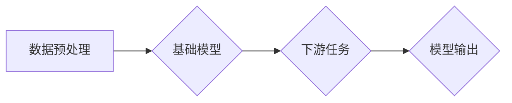

> 基础模型、大语言模型、深度学习、迁移学习、泛化能力、应用场景

## 1. 背景介绍

近年来，深度学习技术取得了飞速发展，尤其是大规模基础模型的涌现，为人工智能领域带来了革命性的变革。基础模型是指在海量数据上预训练的强大模型，具备强大的泛化能力和适应性，能够在各种下游任务中取得优异的性能。

传统的机器学习模型通常需要针对特定任务进行专门训练，这需要大量的标注数据和计算资源。而基础模型的出现改变了这一现状，它可以先在通用数据集上进行预训练，然后通过微调的方式适应不同的下游任务，大大降低了训练成本和时间。

## 2. 核心概念与联系

**2.1 基础模型的概念**

基础模型是指在海量数据上进行预训练的深度学习模型，其目标是学习到通用的语言表示或知识表示，而不是针对特定任务进行训练。

**2.2 大语言模型 (LLM)**

大语言模型是基础模型的一种，专门针对文本数据进行预训练，能够理解和生成人类语言。例如，GPT-3、BERT、LaMDA等都是著名的LLM。

**2.3 迁移学习**

迁移学习是指利用预训练模型在源任务上的知识迁移到目标任务，以提高目标任务的性能。基础模型的预训练过程本身就是一种迁移学习，它将源任务（预训练数据集）上的知识迁移到目标任务（下游任务）。

**2.4 泛化能力**

泛化能力是指模型在未见过的数据上也能表现出良好的性能。基础模型由于在海量数据上进行预训练，因此具有较强的泛化能力，能够适应不同的下游任务和数据分布。

**2.5 架构图**



## 3. 核心算法原理 & 具体操作步骤

**3.1 算法原理概述**

基础模型的训练主要基于深度学习算法，例如Transformer网络。Transformer网络通过自注意力机制学习文本之间的上下文关系，能够捕捉长距离依赖关系，从而实现更准确的文本理解和生成。

**3.2 算法步骤详解**

1. **数据预处理:** 将原始文本数据进行清洗、分词、词嵌入等预处理操作，使其能够被模型理解。
2. **模型训练:** 使用深度学习框架（如TensorFlow、PyTorch）训练基础模型，通过反向传播算法优化模型参数，使其能够学习到通用的语言表示。
3. **模型评估:** 在验证集上评估模型的性能，并根据评估结果调整训练参数，例如学习率、批处理大小等。
4. **模型微调:** 将预训练好的基础模型微调到特定的下游任务，例如文本分类、机器翻译、问答系统等。

**3.3 算法优缺点**

**优点:**

* 泛化能力强：在海量数据上预训练，能够适应不同的下游任务。
* 训练效率高：利用迁移学习，降低了训练成本和时间。
* 性能优异：在许多下游任务中取得了state-of-the-art的性能。

**缺点:**

* 计算资源需求高：预训练大型模型需要大量的计算资源。
* 数据依赖性强：模型性能受训练数据质量的影响。
* 潜在的偏见问题：模型可能继承训练数据中的偏见。

**3.4 算法应用领域**

基础模型在各个领域都有广泛的应用，例如：

* 自然语言处理：文本分类、机器翻译、问答系统、文本生成等。
*计算机视觉：图像识别、目标检测、图像分割等。
*语音识别：语音转文本、语音合成等。
*推荐系统：商品推荐、内容推荐等。

## 4. 数学模型和公式 & 详细讲解 & 举例说明

**4.1 数学模型构建**

基础模型通常基于深度神经网络，其数学模型可以表示为一个多层感知机，其中每一层都包含多个神经元。每个神经元接收来自上一层的输入，并通过激活函数进行非线性变换，然后将结果传递给下一层。

**4.2 公式推导过程**

深度神经网络的训练过程基于梯度下降算法，其目标是最小化模型的损失函数。损失函数通常定义为预测值与真实值的差值。梯度下降算法通过计算损失函数的梯度，更新模型参数，使其朝着损失函数最小化的方向前进。

**4.3 案例分析与讲解**

例如，在训练一个文本分类模型时，损失函数可以定义为交叉熵损失函数，其公式如下：

$$
L = -\sum_{i=1}^{N} y_i \log(p_i)
$$

其中：

* $L$ 是损失函数
* $N$ 是样本数量
* $y_i$ 是真实标签
* $p_i$ 是模型预测的概率

通过梯度下降算法，可以更新模型参数，使其能够更好地预测文本的类别。

## 5. 项目实践：代码实例和详细解释说明

**5.1 开发环境搭建**

使用Python语言和深度学习框架（如TensorFlow、PyTorch）进行开发。

**5.2 源代码详细实现**

```python
# 使用TensorFlow框架训练一个简单的文本分类模型

import tensorflow as tf

# 定义模型结构
model = tf.keras.models.Sequential([
    tf.keras.layers.Embedding(input_dim=10000, output_dim=128),
    tf.keras.layers.LSTM(units=64),
    tf.keras.layers.Dense(units=2, activation='softmax')
])

# 编译模型
model.compile(optimizer='adam',
              loss='sparse_categorical_crossentropy',
              metrics=['accuracy'])

# 训练模型
model.fit(x_train, y_train, epochs=10)

# 评估模型
loss, accuracy = model.evaluate(x_test, y_test)
print('Loss:', loss)
print('Accuracy:', accuracy)
```

**5.3 代码解读与分析**

* 首先定义了模型结构，包括嵌入层、LSTM层和全连接层。
* 然后编译模型，指定优化器、损失函数和评价指标。
* 接着训练模型，使用训练数据进行训练。
* 最后评估模型，使用测试数据计算模型的损失和准确率。

**5.4 运行结果展示**

训练完成后，可以查看模型的损失和准确率，并根据结果进行模型调优。

## 6. 实际应用场景

基础模型在各个领域都有广泛的应用，例如：

**6.1 自然语言处理**

* **文本分类:** 将文本分类到不同的类别，例如情感分析、垃圾邮件过滤等。
* **机器翻译:** 将文本从一种语言翻译成另一种语言。
* **问答系统:** 回答用户提出的问题。
* **文本生成:** 生成新的文本内容，例如文章写作、故事创作等。

**6.2 计算机视觉**

* **图像识别:** 将图像分类到不同的类别，例如物体识别、场景识别等。
* **目标检测:** 在图像中检测到特定目标，并标注其位置和类别。
* **图像分割:** 将图像分割成不同的区域，例如人体的分割、道路的分割等。

**6.3 语音识别**

* **语音转文本:** 将语音信号转换为文本。
* **语音合成:** 将文本转换为语音信号。

**6.4 其他领域**

* **推荐系统:** 根据用户的历史行为推荐商品或内容。
* **医疗诊断:** 辅助医生进行疾病诊断。
* **金融分析:** 分析金融数据，预测市场趋势。

**6.5 未来应用展望**

随着基础模型的不断发展，其应用场景将会更加广泛，例如：

* **个性化教育:** 根据学生的学习情况提供个性化的学习内容和辅导。
* **智能客服:** 提供更加智能和人性化的客服服务。
* **自动驾驶:** 辅助自动驾驶系统进行决策和控制。

## 7. 工具和资源推荐

**7.1 学习资源推荐**

* **书籍:**
    * 深度学习
    * 自然语言处理
* **在线课程:**
    * Coursera
    * edX
    * fast.ai

**7.2 开发工具推荐**

* **深度学习框架:** TensorFlow, PyTorch, Keras
* **编程语言:** Python
* **云计算平台:** AWS, Google Cloud, Azure

**7.3 相关论文推荐**

* Attention Is All You Need
* BERT: Pre-training of Deep Bidirectional Transformers for Language Understanding
* GPT-3: Language Models are Few-Shot Learners

## 8. 总结：未来发展趋势与挑战

**8.1 研究成果总结**

基础模型在人工智能领域取得了显著的进展，其强大的泛化能力和应用潜力为人工智能的未来发展提供了重要的基础。

**8.2 未来发展趋势**

* **模型规模的进一步扩大:** 预计未来基础模型的规模将会进一步扩大，从而提升模型的性能和能力。
* **多模态学习:** 基础模型将从单模态数据扩展到多模态数据，例如文本、图像、音频等，实现更全面的知识表示。
* **可解释性研究:** 研究基础模型的决策过程，提高模型的可解释性和可信度。

**8.3 面临的挑战**

* **计算资源需求:** 训练大型基础模型需要大量的计算资源，这对于资源有限的机构和个人来说是一个挑战。
* **数据安全和隐私:** 基础模型的训练需要大量数据，如何保证数据的安全和隐私是一个重要的问题。
* **模型偏见:** 基础模型可能继承训练数据中的偏见，如何解决模型偏见是一个需要持续关注的问题。

**8.4 研究展望**

未来基础模型的研究将继续朝着更强大、更安全、更可解释的方向发展，为人工智能的广泛应用提供更坚实的基础。

## 9. 附录：常见问题与解答

**9.1 如何选择合适的基础模型？**

选择合适的基础模型需要根据具体的应用场景和需求进行考虑，例如：

* **任务类型:** 不同的任务类型需要不同的基础模型，例如文本分类需要使用文本相关的基础模型，图像识别需要使用图像相关的基础模型。
* **数据规模:** 数据规模越大，可以选择规模更大的基础模型。
* **计算资源:** 计算资源有限的情况下，可以选择规模较小的基础模型。

**9.2 如何进行基础模型的微调？**

基础模型的微调需要使用少量的数据进行训练，调整模型参数，使其适应特定的下游任务。

**9.3 如何解决基础模型的偏见问题？**

解决基础模型的偏见问题需要从多个方面入手，例如：

* 使用更加公平的数据集进行训练。
* 在训练过程中加入对抗训练，增强模型对偏见的鲁棒性。
* 开发新的算法和方法，减少模型的偏见。


作者：禅与计算机程序设计艺术 / Zen and the Art of Computer Programming 
<end_of_turn>