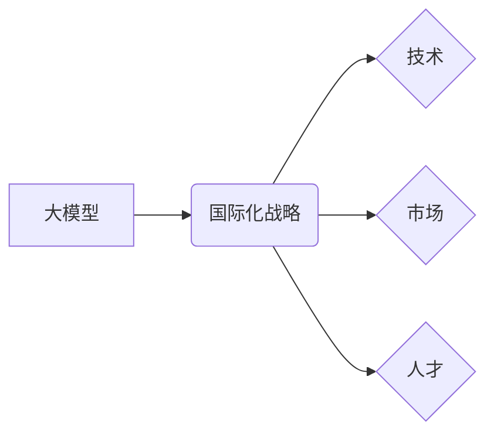

> 大模型、国际化、战略、技术、市场、人才

## 1. 背景介绍

近年来，大模型技术蓬勃发展，其强大的泛化能力和应用潜力吸引了全球各地的目光。从自然语言处理到计算机视觉，从药物研发到科学探索，大模型正在深刻地改变着各个领域。与此同时，大模型企业也开始走向国际化，寻求更大的发展空间和机遇。

然而，大模型企业的国际化并非易事。不同国家和地区的文化背景、法律法规、市场需求和技术生态都存在着差异，这给大模型企业的海外扩张带来了诸多挑战。

## 2. 核心概念与联系

**2.1 大模型**

大模型是指参数规模庞大、训练数据海量的人工智能模型。其强大的学习能力使其能够在各种任务上表现出卓越的性能，例如文本生成、机器翻译、图像识别等。

**2.2 国际化战略**

国际化战略是指企业为了拓展海外市场、获取资源和提升竞争力而采取的一系列行动。对于大模型企业而言，国际化战略需要考虑技术、市场、人才等多方面因素。

**2.3 核心概念关系图**



## 3. 核心算法原理 & 具体操作步骤

**3.1 算法原理概述**

大模型的训练主要基于深度学习算法，例如Transformer模型。Transformer模型通过自注意力机制学习文本之间的上下文关系，从而实现更精准的理解和生成。

**3.2 算法步骤详解**

1. **数据预处理:** 将原始数据清洗、格式化和转换为模型可理解的形式。
2. **模型构建:** 根据任务需求选择合适的模型架构，并设置模型参数。
3. **模型训练:** 使用训练数据训练模型，并通过优化算法调整模型参数，使其能够准确地完成任务。
4. **模型评估:** 使用测试数据评估模型的性能，并根据评估结果进行模型调优。
5. **模型部署:** 将训练好的模型部署到实际应用场景中。

**3.3 算法优缺点**

**优点:**

* 强大的泛化能力
* 高精度
* 可处理海量数据

**缺点:**

* 训练成本高
* 训练时间长
* 容易过拟合

**3.4 算法应用领域**

* 自然语言处理：文本生成、机器翻译、问答系统
* 计算机视觉：图像识别、目标检测、图像生成
* 药物研发：药物发现、药物设计
* 科学探索：数据分析、模式识别

## 4. 数学模型和公式 & 详细讲解 & 举例说明

**4.1 数学模型构建**

大模型的训练过程可以看作是一个优化问题，目标是找到一个模型参数向量，使得模型在训练数据上的损失函数最小。

**损失函数:**

$$L(w) = \sum_{i=1}^{N} \mathcal{L}(y_i, \hat{y}_i)$$

其中：

* $w$ 是模型参数向量
* $N$ 是训练数据的数量
* $\mathcal{L}$ 是单个样本的损失函数
* $y_i$ 是真实标签
* $\hat{y}_i$ 是模型预测的标签

**4.2 公式推导过程**

通过梯度下降算法，可以迭代地更新模型参数，使得损失函数逐渐减小。

梯度下降公式:

$$w = w - \eta \nabla L(w)$$

其中：

* $\eta$ 是学习率
* $\nabla L(w)$ 是损失函数对模型参数的梯度

**4.3 案例分析与讲解**

例如，在文本生成任务中，可以使用交叉熵损失函数来衡量模型预测结果与真实标签之间的差异。

交叉熵损失函数:

$$ \mathcal{L}(y, \hat{y}) = - \sum_{i=1}^{M} y_i \log(\hat{y}_i)$$

其中：

* $y$ 是真实标签向量
* $\hat{y}$ 是模型预测的概率分布向量
* $M$ 是词汇表的大小

## 5. 项目实践：代码实例和详细解释说明

**5.1 开发环境搭建**

使用Python语言和深度学习框架TensorFlow或PyTorch搭建开发环境。

**5.2 源代码详细实现**

```python
import tensorflow as tf

# 定义模型架构
model = tf.keras.Sequential([
    tf.keras.layers.Embedding(vocab_size, embedding_dim),
    tf.keras.layers.LSTM(units),
    tf.keras.layers.Dense(vocab_size, activation='softmax')
])

# 编译模型
model.compile(optimizer='adam', loss='sparse_categorical_crossentropy', metrics=['accuracy'])

# 训练模型
model.fit(train_data, train_labels, epochs=10)

# 评估模型
loss, accuracy = model.evaluate(test_data, test_labels)
print('Loss:', loss)
print('Accuracy:', accuracy)
```

**5.3 代码解读与分析**

这段代码定义了一个基于LSTM的文本生成模型。

* Embedding层将单词转换为向量表示。
* LSTM层学习文本之间的上下文关系。
* Dense层输出每个单词的概率分布。

**5.4 运行结果展示**

训练完成后，可以使用模型生成新的文本。

## 6. 实际应用场景

**6.1 自然语言处理**

* 机器翻译：将文本从一种语言翻译成另一种语言。
* 文本摘要：生成文本的简短摘要。
* 问答系统：回答用户提出的问题。

**6.2 计算机视觉**

* 图像识别：识别图像中的物体。
* 目标检测：定位图像中的物体并识别其类别。
* 图像生成：生成新的图像。

**6.3 其他领域**

* 药物研发：预测药物的活性。
* 科学探索：分析大规模数据，发现新的模式和规律。

**6.4 未来应用展望**

大模型技术将继续发展，并应用于更多领域。例如，可以用于个性化教育、智能医疗、自动驾驶等。

## 7. 工具和资源推荐

**7.1 学习资源推荐**

* 深度学习课程：Coursera、edX、Udacity
* 大模型论文：arXiv、ACL Anthology

**7.2 开发工具推荐**

* 深度学习框架：TensorFlow、PyTorch
* 代码托管平台：GitHub、GitLab

**7.3 相关论文推荐**

* Attention Is All You Need
* BERT: Pre-training of Deep Bidirectional Transformers for Language Understanding

## 8. 总结：未来发展趋势与挑战

**8.1 研究成果总结**

大模型技术取得了显著的进展，在多个领域展现出强大的应用潜力。

**8.2 未来发展趋势**

* 模型规模进一步扩大
* 训练效率提升
* 应用场景更加广泛

**8.3 面临的挑战**

* 训练成本高
* 数据安全和隐私问题
* 算法可解释性

**8.4 研究展望**

未来研究将重点关注降低训练成本、提高模型效率、增强模型可解释性和安全性。

## 9. 附录：常见问题与解答

**9.1 如何选择合适的模型架构？**

选择合适的模型架构取决于具体的应用场景和数据特点。

**9.2 如何处理大规模数据？**

可以使用分布式训练技术来处理大规模数据。

**9.3 如何评估模型性能？**

可以使用准确率、召回率、F1-score等指标来评估模型性能。


作者：禅与计算机程序设计艺术 / Zen and the Art of Computer Programming 
<end_of_turn>