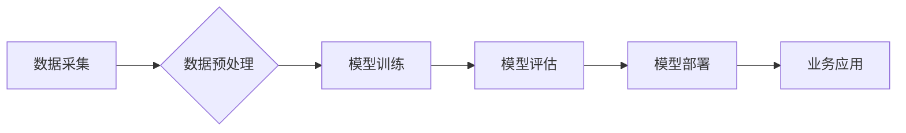

> 大模型、商业智能、深度学习、自然语言处理、计算机视觉、数据分析、预测建模、人工智能

## 1. 背景介绍

在当今数据爆炸的时代，商业智能（BI）正扮演着越来越重要的角色。企业需要从海量数据中挖掘价值，以做出更明智的决策。传统 BI 工具依赖于人工特征工程和规则化分析，难以应对复杂数据和非结构化数据的挑战。而大模型的出现，为商业智能带来了新的机遇和可能性。

大模型是指参数规模庞大、训练数据海量的人工智能模型。近年来，随着深度学习技术的进步和计算能力的提升，大模型取得了显著的成果，在自然语言处理、计算机视觉、语音识别等领域展现出强大的能力。

## 2. 核心概念与联系

大模型的核心概念在于利用海量数据训练出能够泛化学习的模型，从而在新的数据上进行预测、分类、生成等任务。

**大模型与商业智能的联系：**

大模型可以帮助企业从海量数据中提取更丰富的洞察，并将其转化为 actionable insights，从而提升决策效率和业务效益。

**大模型的架构：**



## 3. 核心算法原理 & 具体操作步骤

### 3.1  算法原理概述

大模型通常基于深度学习算法，例如 Transformer、BERT、GPT 等。这些算法通过多层神经网络结构，学习数据之间的复杂关系，并提取出特征表示。

### 3.2  算法步骤详解

1. **数据采集:** 收集相关业务数据，包括结构化数据和非结构化数据。
2. **数据预处理:** 对数据进行清洗、转换、编码等操作，使其适合模型训练。
3. **模型训练:** 使用深度学习框架（如 TensorFlow、PyTorch）训练大模型，并通过优化算法（如 Adam、SGD）调整模型参数。
4. **模型评估:** 使用测试数据评估模型的性能，并根据评估结果进行模型调优。
5. **模型部署:** 将训练好的模型部署到生产环境中，用于实际业务应用。

### 3.3  算法优缺点

**优点:**

* 能够处理海量数据和复杂关系。
* 具有强大的泛化能力，能够应用于不同的业务场景。
* 可以自动学习特征，减少人工特征工程的成本。

**缺点:**

* 训练成本高，需要大量的计算资源和时间。
* 模型解释性差，难以理解模型的决策过程。
* 对数据质量要求高，数据偏差会影响模型性能。

### 3.4  算法应用领域

大模型在商业智能领域有广泛的应用场景，例如：

* **客户关系管理 (CRM):** 预测客户 churn、个性化推荐、客户服务自动化。
* **市场营销:** 预测市场趋势、精准广告投放、客户画像分析。
* **销售预测:** 预测销售额、库存管理、定价策略优化。
* **财务分析:** 欺诈检测、风险评估、财务报表分析。

## 4. 数学模型和公式 & 详细讲解 & 举例说明

### 4.1  数学模型构建

大模型的训练过程本质上是一个优化问题，目标是找到模型参数，使得模型在训练数据上的损失函数最小。

损失函数通常采用交叉熵损失函数或均方误差损失函数。

**交叉熵损失函数:**

$$
L = -\sum_{i=1}^{N} y_i \log(\hat{y}_i)
$$

其中：

* $N$ 是样本数量。
* $y_i$ 是真实标签。
* $\hat{y}_i$ 是模型预测的概率。

**均方误差损失函数:**

$$
L = \frac{1}{N} \sum_{i=1}^{N} (y_i - \hat{y}_i)^2
$$

其中：

* $N$ 是样本数量。
* $y_i$ 是真实标签。
* $\hat{y}_i$ 是模型预测值。

### 4.2  公式推导过程

损失函数的最小化可以通过梯度下降算法实现。梯度下降算法的基本思想是沿着梯度方向更新模型参数，直到损失函数达到最小值。

**梯度下降算法:**

$$
\theta = \theta - \alpha \nabla L(\theta)
$$

其中：

* $\theta$ 是模型参数。
* $\alpha$ 是学习率。
* $\nabla L(\theta)$ 是损失函数对模型参数的梯度。

### 4.3  案例分析与讲解

例如，在自然语言处理任务中，可以使用 BERT 模型进行文本分类。BERT 模型通过训练一个双向 Transformer 网络，学习文本的上下文信息。

在训练过程中，BERT 模型会使用交叉熵损失函数，并通过梯度下降算法更新模型参数。最终，训练好的 BERT 模型可以用于对新的文本进行分类。

## 5. 项目实践：代码实例和详细解释说明

### 5.1  开发环境搭建

* Python 3.7+
* TensorFlow 2.0+
* PyTorch 1.0+
* CUDA 10.0+

### 5.2  源代码详细实现

```python
# 使用 TensorFlow 框架训练一个简单的线性回归模型

import tensorflow as tf

# 定义模型
model = tf.keras.models.Sequential([
    tf.keras.layers.Dense(units=1, input_shape=[1])
])

# 定义损失函数和优化器
model.compile(loss='mean_squared_error', optimizer='adam')

# 训练模型
model.fit(x_train, y_train, epochs=100)

# 评估模型
loss = model.evaluate(x_test, y_test)
print('Loss:', loss)
```

### 5.3  代码解读与分析

* 首先，我们定义了一个简单的线性回归模型，包含一个全连接层。
* 然后，我们使用均方误差损失函数和 Adam 优化器训练模型。
* 训练完成后，我们使用测试数据评估模型的性能。

### 5.4  运行结果展示

训练完成后，我们可以观察模型的损失函数值，以及在测试数据上的预测精度。

## 6. 实际应用场景

### 6.1  客户关系管理 (CRM)

大模型可以帮助企业预测客户 churn、个性化推荐、客户服务自动化。例如，通过分析客户的历史购买记录、浏览行为等数据，大模型可以预测哪些客户可能会 churn，从而帮助企业采取措施挽留客户。

### 6.2  市场营销

大模型可以帮助企业预测市场趋势、精准广告投放、客户画像分析。例如，通过分析社交媒体数据、新闻报道等信息，大模型可以预测市场趋势，帮助企业制定营销策略。

### 6.3  销售预测

大模型可以帮助企业预测销售额、库存管理、定价策略优化。例如，通过分析历史销售数据、市场趋势等信息，大模型可以预测未来的销售额，帮助企业优化库存管理和定价策略。

### 6.4  未来应用展望

随着大模型技术的不断发展，其在商业智能领域的应用场景将更加广泛。例如，大模型可以用于更复杂的业务分析，例如预测客户行为、识别市场机会、优化运营流程等。

## 7. 工具和资源推荐

### 7.1  学习资源推荐

* **书籍:**
    * 《深度学习》
    * 《自然语言处理》
    * 《机器学习》
* **在线课程:**
    * Coursera
    * edX
    * Udacity

### 7.2  开发工具推荐

* **深度学习框架:**
    * TensorFlow
    * PyTorch
    * Keras
* **数据处理工具:**
    * Pandas
    * NumPy
    * Scikit-learn

### 7.3  相关论文推荐

* **BERT:** Devlin, J., Chang, M. W., Lee, K., & Toutanova, K. (2018). BERT: Pre-training of deep bidirectional transformers for language understanding. arXiv preprint arXiv:1810.04805.
* **GPT:** Radford, A., Wu, J., Child, R., Luan, D., Amodei, D., & Sutskever, I. (2019). Language models are few-shot learners. OpenAI blog.

## 8. 总结：未来发展趋势与挑战

### 8.1  研究成果总结

大模型在商业智能领域取得了显著的成果，为企业提供了更强大的数据分析和决策支持能力。

### 8.2  未来发展趋势

* **模型规模和能力的提升:** 未来，大模型的规模和能力将继续提升，能够处理更复杂的数据和任务。
* **模型解释性和可解释性的增强:** 研究者将致力于提高大模型的解释性和可解释性，使其决策过程更加透明。
* **模型的个性化定制:** 未来，大模型将更加个性化，能够根据用户的需求进行定制。

### 8.3  面临的挑战

* **数据安全和隐私保护:** 大模型的训练需要海量数据，如何保证数据安全和隐私保护是一个重要的挑战。
* **模型的公平性和可信度:** 大模型的训练数据可能存在偏差，导致模型输出结果不公平或不可靠。
* **模型的部署和维护成本:** 大模型的部署和维护成本较高，需要企业投入更多的资源。

### 8.4  研究展望

未来，大模型在商业智能领域的应用将更加广泛和深入，为企业带来更大的价值。研究者将继续致力于解决大模型面临的挑战，推动大模型技术的发展。

## 9. 附录：常见问题与解答

**Q1: 大模型的训练成本很高，如何降低成本？**

**A1:** 可以使用预训练模型，并对模型进行微调，降低训练成本。

**Q2: 如何保证大模型的公平性和可信度？**

**A2:** 在训练数据中进行去偏处理，并使用公平性评估指标，确保模型输出结果公平可靠。

**Q3: 如何部署和维护大模型？**

**A3:** 可以使用云平台提供的服务，简化模型部署和维护过程。


作者：禅与计算机程序设计艺术 / Zen and the Art of Computer Programming 
<end_of_turn>