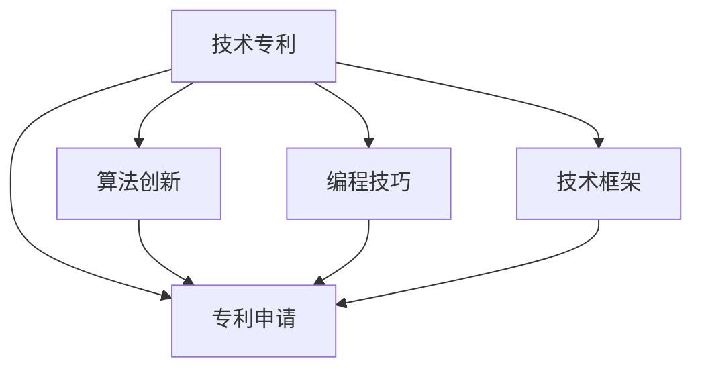
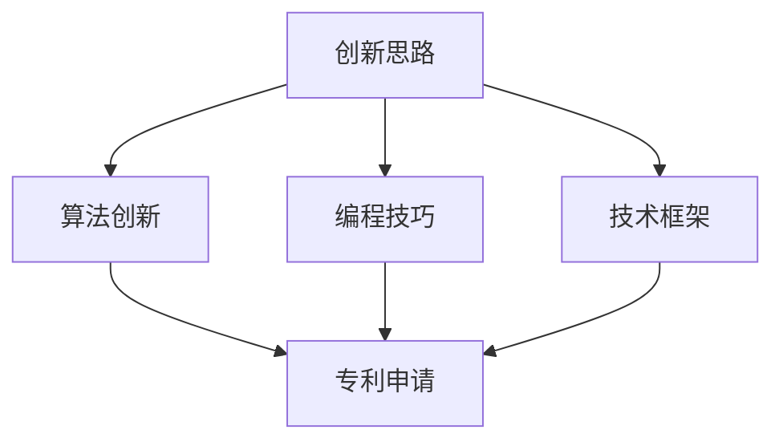

                 

## 1. 背景介绍

### 1.1 问题由来

在当今数字化时代，技术的更新换代日新月异，如何在快速变化的技术环境中保持竞争力，成为每个程序员都需要思考的问题。而技术的核心价值之一，就在于其可以转化为具有商业价值的知识产权，即技术专利。技术专利不仅是对创新成果的保护，更是在未来技术竞争中占据先机的重要手段。本文将从核心概念、算法原理、项目实践、应用场景、工具推荐、未来展望等方面，全面解析程序员如何通过技术专利挖掘其隐藏财富。

### 1.2 问题核心关键点

技术专利的获取与维护，涉及专利申请、专利审查、专利维护等多个环节。而编程技巧、算法创新、技术框架等方面，则是实现技术专利的核心点。掌握这些核心点，将帮助程序员在技术创新与专利获取上迈出关键一步。

## 2. 核心概念与联系

### 2.1 核心概念概述

为更好地理解程序员如何挖掘其隐藏财富，首先需要介绍几个关键概念：

- **技术专利**：指法律赋予发明人在一定期限内对其技术方案独占使用的权利。技术专利是知识产权的重要组成部分，保护了技术创新成果，使其在市场竞争中占据优势。
- **专利申请**：向专利局提交专利文档，经过审查获得专利授权的过程。专利申请是技术专利获取的第一步，需要撰写详细且新颖的技术方案文档。
- **算法创新**：指在现有算法的基础上，通过新的思路或方法实现性能改进或功能增强的创新行为。算法创新是技术专利的重要来源，通常涉及算法优化、新算法设计等。
- **编程技巧**：指在编程过程中，通过技巧性手段实现代码优化、效率提升等目标。编程技巧的应用，也是实现技术专利的途径之一。
- **技术框架**：指用于解决特定问题的模块化、标准化的技术方案，涵盖了从数据结构到应用架构的各个层面。技术框架的创新，同样是技术专利的重要领域。

这些核心概念之间的联系通过以下Mermaid流程图展示：



### 2.2 核心概念原理和架构的 Mermaid 流程图



## 3. 核心算法原理 & 具体操作步骤

### 3.1 算法原理概述

技术专利的实现，本质上是通过创新算法、优化编程技巧、设计技术框架等手段，形成具有商业价值的独特技术方案。这些技术方案的创新点可以是全新的算法设计、改进的算法性能、新的编程方法等。

算法创新是技术专利的核心，通常通过以下步骤实现：

1. **需求分析**：明确技术问题的核心需求，理解现有算法的不足之处。
2. **算法设计**：根据需求设计新的算法思路，确定算法的基本框架和核心步骤。
3. **算法验证**：通过实验验证算法的性能和效果，调整优化算法细节。
4. **文档撰写**：将算法思路和技术细节撰写成详细的技术文档，作为专利申请的支撑。
5. **专利申请**：向专利局提交专利申请，经过审查获得专利授权。

### 3.2 算法步骤详解

算法创新的具体步骤可以分为以下几个环节：

#### 3.2.1 需求分析

1. **问题定义**：明确需要解决的技术问题，如计算效率、算法复杂度、应用场景等。
2. **现有方法**：调研当前已有的解决方案，理解其优缺点。
3. **问题瓶颈**：分析现有方法的不足，识别出需要改进的环节。

#### 3.2.2 算法设计

1. **算法思路**：基于需求分析，设计新的算法思路，如改进算法流程、引入新算法等。
2. **算法框架**：构建算法的基本框架，确定算法的主要步骤和关键参数。
3. **算法细节**：细化算法步骤，确定每一步的具体实现方法。

#### 3.2.3 算法验证

1. **实验设置**：设计实验环境，包括实验数据、测试指标等。
2. **算法测试**：在实验环境中运行算法，收集实验结果。
3. **效果评估**：评估算法的效果，包括性能提升、资源节约等。
4. **调整优化**：根据评估结果，调整算法细节，进行多次迭代优化。

#### 3.2.4 文档撰写

1. **撰写背景**：介绍技术问题的背景，包括现有方法的不足和改进需求。
2. **算法描述**：详细描述新算法的思路和实现过程，包括算法框架、步骤和关键参数等。
3. **实验结果**：展示算法的实验结果，包括性能对比、实验设置和结果分析等。
4. **结论与展望**：总结算法的效果和未来研究方向，明确技术专利的商业价值。

#### 3.2.5 专利申请

1. **撰写专利**：根据撰写文档，撰写正式的专利申请文件。
2. **提交申请**：向专利局提交专利申请，等待专利审查。
3. **专利授权**：专利申请通过审查，获得专利授权。

### 3.3 算法优缺点

技术专利的实现，虽然能够带来丰厚的商业回报，但也存在一定的局限性：

#### 3.3.1 优点

1. **保护创新**：技术专利保护了技术创新的成果，使其在市场竞争中占据优势。
2. **商业价值**：技术专利可以转化为具有商业价值的知识产权，帮助企业获得丰厚的回报。
3. **技术传播**：专利申请和授权过程中，技术方案会被广泛传播，有助于技术进步。
4. **竞争优势**：技术专利增强了企业在技术市场上的竞争地位，使其在竞争中获得优势。

#### 3.3.2 缺点

1. **申请复杂**：专利申请过程复杂，需要撰写详细且新颖的技术文档，涉及大量工作。
2. **费用高昂**：专利申请和维护费用较高，需要一定的经济投入。
3. **授权周期长**：专利审查周期较长，可能影响技术的快速应用。
4. **市场竞争**：专利授权后，可能面临市场竞争者对专利的挑战，需要持续维护。

### 3.4 算法应用领域

技术专利的应用领域非常广泛，涵盖计算机科学、电子工程、生物技术等多个领域。程序员可以通过以下方式挖掘其隐藏财富：

1. **软件开发**：针对具体问题设计创新的算法或编程技巧，实现软件功能的优化和提升。
2. **硬件设计**：设计创新的硬件算法，提升硬件性能和效率，实现新的硬件技术。
3. **数据处理**：开发新的数据处理算法，提高数据处理效率和效果，实现数据驱动的应用。
4. **人工智能**：设计新的AI算法，提升AI系统的性能和效果，实现智能应用。
5. **系统架构**：设计创新的系统架构，提升系统性能和可扩展性，实现高效的系统应用。

## 4. 数学模型和公式 & 详细讲解 & 举例说明

### 4.1 数学模型构建

技术专利的核心在于算法创新和编程技巧的应用，可以通过数学模型来描述和分析这些创新点。

设问题为 $P$，现有算法为 $A$，改进后的算法为 $B$。改进前后的算法效果可以用以下数学模型描述：

- **算法性能**：$A$ 的性能为 $P_A$，$B$ 的性能为 $P_B$。
- **算法复杂度**：$A$ 的复杂度为 $C_A$，$B$ 的复杂度为 $C_B$。

### 4.2 公式推导过程

基于上述模型，我们可以通过以下公式推导算法的改进效果：

1. **性能提升**：$P_B - P_A$
2. **复杂度降低**：$C_B - C_A$

### 4.3 案例分析与讲解

以常见的排序算法为例，假设现有排序算法的时间复杂度为 $O(n^2)$，而改进后的排序算法时间复杂度为 $O(n\log n)$。通过以下公式计算性能提升和复杂度降低：

- **性能提升**：$O(n\log n) - O(n^2) = O(n)$
- **复杂度降低**：$O(n\log n) - O(n^2) = O(n)$

## 5. 项目实践：代码实例和详细解释说明

### 5.1 开发环境搭建

要进行技术专利的实现，首先需要搭建好开发环境。以下是一个基本的开发环境搭建步骤：

1. **安装Python**：从官网下载并安装Python，建议使用最新的稳定版本。
2. **安装开发工具**：安装Git、Visual Studio Code、PyCharm等开发工具。
3. **安装编程框架**：安装Django、Flask等Python框架，方便进行Web应用开发。
4. **配置开发环境**：配置环境变量、虚拟环境等，保证开发环境的稳定性。

### 5.2 源代码详细实现

以一个简单的排序算法优化为例，展示技术专利的实现过程：

```python
def bubble_sort(arr):
    n = len(arr)
    for i in range(n):
        for j in range(n-i-1):
            if arr[j] > arr[j+1]:
                arr[j], arr[j+1] = arr[j+1], arr[j]
    return arr

def quick_sort(arr):
    if len(arr) <= 1:
        return arr
    pivot = arr[len(arr) // 2]
    left = [x for x in arr if x < pivot]
    middle = [x for x in arr if x == pivot]
    right = [x for x in arr if x > pivot]
    return quick_sort(left) + middle + quick_sort(right)

arr = [3, 2, 1, 5, 4]
print("Bubble Sort:", bubble_sort(arr))
print("Quick Sort:", quick_sort(arr))
```

### 5.3 代码解读与分析

上述代码实现了一个简单的冒泡排序和快速排序算法，展示了技术专利的实现过程。

**代码解读**：

- **冒泡排序**：通过相邻元素的比较交换，将最大的元素逐渐交换到数组末尾。
- **快速排序**：通过选取基准元素，将数组分为左右两部分，递归排序左右两部分，最终合并结果。

**性能分析**：

- **冒泡排序**：时间复杂度为 $O(n^2)$，性能较低，不适用于大规模数据排序。
- **快速排序**：时间复杂度为 $O(n\log n)$，性能较好，适用于大规模数据排序。

## 6. 实际应用场景

### 6.1 软件开发

技术专利在软件开发中的应用，可以帮助企业提升软件性能和功能，增强竞争力。

- **性能优化**：针对性能瓶颈设计新算法，提升软件运行速度。
- **功能增强**：设计新的功能模块，扩展软件应用场景。
- **安全防护**：设计新的安全算法，提升软件安全性。

### 6.2 硬件设计

技术专利在硬件设计中的应用，可以帮助企业提升硬件性能和效率，实现新的硬件技术。

- **算法优化**：设计新的硬件算法，提升硬件处理能力。
- **系统优化**：设计新的系统架构，提高系统性能和可扩展性。
- **应用创新**：设计新的硬件应用，拓展硬件应用场景。

### 6.3 数据处理

技术专利在数据处理中的应用，可以帮助企业提升数据处理效率和效果，实现数据驱动的应用。

- **数据预处理**：设计新的数据预处理算法，提升数据质量。
- **数据分析**：设计新的数据分析算法，提升数据洞察力。
- **数据存储**：设计新的数据存储算法，提高数据存储效率。

### 6.4 人工智能

技术专利在人工智能中的应用，可以帮助企业提升AI系统的性能和效果，实现智能应用。

- **算法改进**：设计新的AI算法，提升AI系统性能。
- **应用创新**：设计新的AI应用，拓展AI应用场景。
- **数据优化**：设计新的数据优化算法，提升AI系统效果。

## 7. 工具和资源推荐

### 7.1 学习资源推荐

为了帮助程序员掌握技术专利的实现，以下是一些优质的学习资源：

1. **专利申请指南**：国家知识产权局、世界知识产权组织等机构发布的专利申请指南。
2. **专利案例分析**：知名企业的专利申请案例分析，如Google、Apple等。
3. **专利法律知识**：专利法律基础知识、专利审查流程等。
4. **技术博客和论坛**：知名技术博客和论坛，如CSDN、GitHub、Stack Overflow等。
5. **专利申请软件**：如PatentWizard、CLM等专利申请软件，提供一站式专利申请服务。

### 7.2 开发工具推荐

进行技术专利的开发，需要借助一些高效的开发工具：

1. **Python开发环境**：如PyCharm、Visual Studio Code等，提供强大的代码编写和调试功能。
2. **代码管理工具**：如Git、GitHub等，方便版本控制和协作开发。
3. **代码分析工具**：如SonarQube、Lint工具等，帮助发现代码缺陷和优化建议。
4. **测试工具**：如Junit、Pytest等，帮助进行单元测试和功能测试。
5. **文档工具**：如Markdown、Confluence等，方便撰写和发布技术文档。

### 7.3 相关论文推荐

技术专利的研究涉及多个领域，以下是几篇具有代表性的相关论文：

1. **专利申请与审查**：《专利申请指南》、《专利审查流程与案例分析》等。
2. **算法创新**：《高效排序算法设计》、《机器学习算法优化》等。
3. **编程技巧**：《优化Python代码》、《高效数据结构设计》等。
4. **技术框架**：《Web框架开发与实践》、《分布式系统设计》等。

## 8. 总结：未来发展趋势与挑战

### 8.1 研究成果总结

本文详细介绍了技术专利的实现过程，包括核心概念、算法原理、具体操作步骤、项目实践、应用场景、工具推荐等。通过深入分析技术专利的应用，展示了程序员如何挖掘其隐藏财富。

### 8.2 未来发展趋势

未来技术专利的发展将呈现以下趋势：

1. **技术融合**：技术专利将与其他技术（如人工智能、物联网、大数据等）进行深度融合，形成更广泛的应用场景。
2. **知识产权保护**：随着技术创新的加速，技术专利的保护范围将进一步扩大，帮助企业更好地保护其创新成果。
3. **国际合作**：跨国技术合作和技术共享将加速技术专利的全球化发展。
4. **开源社区**：开源社区将成为技术专利的重要发布平台，加速技术成果的传播和应用。
5. **自动化申请**：专利申请自动化技术将得到广泛应用，提高专利申请的效率和准确性。

### 8.3 面临的挑战

技术专利的实现和维护，仍面临诸多挑战：

1. **高成本**：专利申请和维护成本较高，需要企业投入大量资源。
2. **时间长**：专利审查周期较长，影响技术的快速应用。
3. **市场竞争**：专利授权后，可能面临市场竞争者的挑战，需要持续维护。
4. **法律风险**：专利法律环境复杂，存在一定的法律风险。

### 8.4 研究展望

未来技术专利的研究方向将包括：

1. **自动化申请**：通过自动化技术，提高专利申请的效率和准确性。
2. **开放共享**：推动技术专利的开放共享，加速技术成果的传播和应用。
3. **法律保护**：加强专利法律环境的保护，降低技术创新的法律风险。
4. **国际化**：拓展技术专利的国际化应用，提升企业的全球竞争力。
5. **新技术融合**：将技术专利与其他新技术（如区块链、AI等）进行深度融合，形成更广泛的应用场景。

## 9. 附录：常见问题与解答

**Q1: 如何判断一个技术点是否具备专利申请的价值？**

A: 判断技术点是否具备专利申请价值，需要考虑以下因素：

1. **新颖性**：技术点是否具有新颖性，是否与现有技术不同。
2. **创造性**：技术点是否具有创造性，是否解决了现有技术无法解决的问题。
3. **实用性**：技术点是否具有实用性，是否能够被实际应用。
4. **独特性**：技术点是否具有独特性，是否与现有技术有明显差异。
5. **商业价值**：技术点是否具备商业价值，是否能够带来经济收益。

**Q2: 如何撰写技术专利申请文件？**

A: 撰写技术专利申请文件，需要按照以下步骤进行：

1. **撰写背景**：介绍技术问题的背景，包括现有方法的不足和改进需求。
2. **算法描述**：详细描述新算法的思路和实现过程，包括算法框架、步骤和关键参数等。
3. **实验结果**：展示算法的实验结果，包括性能对比、实验设置和结果分析等。
4. **结论与展望**：总结算法的效果和未来研究方向，明确技术专利的商业价值。

**Q3: 如何保护技术专利的商业价值？**

A: 保护技术专利的商业价值，需要采取以下措施：

1. **专利申请**：及时申请专利，获得专利授权。
2. **专利维护**：定期进行专利维护，保持专利的有效性。
3. **法律保护**：制定严格的专利保护策略，防止侵权行为。
4. **市场推广**：积极推广专利技术，扩大市场应用。
5. **知识产权法律咨询**：聘请专业的知识产权律师，提供法律咨询服务。

---

作者：禅与计算机程序设计艺术 / Zen and the Art of Computer Programming

