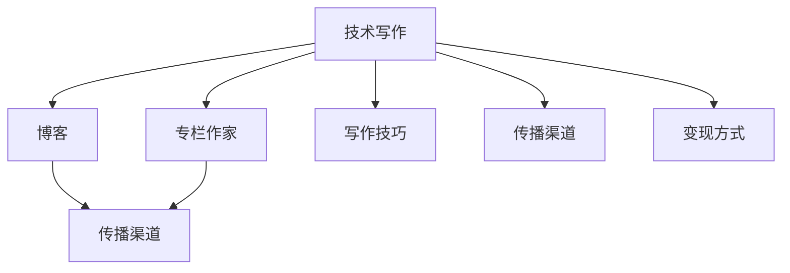

                 

# 技术写作：从博客到专栏作家之路

> 关键词：技术写作, 博客, 专栏, 作家, 写作技巧, 技术博客, 专栏作家, 写作风格, 内容创作, 编辑技巧, 出版渠道

## 1. 背景介绍

### 1.1 问题由来
在信息技术迅速发展的今天，技术写作已经成为连接技术领域与更广泛受众的重要桥梁。随着互联网的普及和社交媒体的兴起，越来越多的人开始通过博客、专栏等形式，分享自己的技术见解和经验。然而，对于很多技术开发者来说，从“编码者”到“写作者”的转变，并不是一件容易的事。一方面，技术写作需要严谨的逻辑思维和清晰表达能力；另一方面，技术博客和专栏作者又需要广博的知识储备和独特见解。

### 1.2 问题核心关键点
本文将围绕技术写作的核心问题进行深入探讨，帮助技术开发者理解技术写作的要素，掌握从博客到专栏作家的转型技巧，提升写作水平和传播效果。具体来说，文章将涵盖以下几个关键点：

- 技术写作的本质和重要性
- 技术博客与专栏作家的区别与联系
- 技术写作的核心要素和技巧
- 技术写作的传播渠道和变现方式
- 技术写作的持续改进和创新

### 1.3 问题研究意义
技术写作不仅是技术传播的重要手段，更是开发者个人品牌建设和行业影响力提升的关键途径。通过精炼的技术文章，能够将自己的技术积累和思维见解传递给更广泛的受众，促进技术知识的普及和应用。同时，写作也是锻炼思维和表达能力的重要方式，有助于开发者更深入地理解和应用所学知识，形成系统化的知识体系。

## 2. 核心概念与联系

### 2.1 核心概念概述

为更好地理解技术写作的要素和方法，本节将介绍几个关键概念：

- 技术写作(Technical Writing)：通过文字、图片、视频等形式，清晰准确地传达技术信息、经验分享和知识传播。
- 博客(Blog)：个人或团体通过互联网平台发布的技术文章，形式灵活，内容多样。
- 专栏作家(Columnist)：长期为某平台或刊物撰写技术文章，有一定影响力和粉丝基础的作者。
- 写作技巧(Writing Skills)：包括语法、结构、风格等，是技术写作的重要组成部分。
- 传播渠道(Dissemination Channels)：如个人博客、技术社区、专业刊物等，是技术写作的重要载体。
- 变现方式(Monetization Methods)：通过广告、赞助、付费订阅等，获得经济回报。

这些核心概念之间存在着密切的联系。技术写作是博客和专栏写作的基础，博客和专栏写作是技术写作的高级形式。写作技巧贯穿整个技术写作过程，传播渠道和变现方式则是技术写作成功的重要保障。

### 2.2 核心概念原理和架构的 Mermaid 流程图



这个流程图展示了技术写作、博客、专栏作家、写作技巧、传播渠道和变现方式之间的逻辑关系。

## 3. 核心算法原理 & 具体操作步骤

### 3.1 算法原理概述

技术写作的核心在于将复杂的技术概念和操作流程，用清晰、准确、易于理解的方式呈现出来。这需要作者具备较强的逻辑思维和表达能力，能够将复杂问题分解为若干步骤，并清晰地传达给读者。

### 3.2 算法步骤详解

技术写作的总体步骤包括选题、规划、写作、编辑和发布五个环节。每个环节都有其独特的要求和技巧：

- **选题**：选择与自身技术领域相关、具有一定受众基础和讨论价值的主题。可以参考行业趋势、技术热点和实际问题，确保选题具有实用性和创新性。
- **规划**：确定文章的结构和内容大纲，包括引言、主体和结论三个部分。每个部分都有其特定的目的和内容要求。
- **写作**：按照大纲进行详细撰写，使用简洁明了的语言，避免过于专业化或术语堆砌，保证信息的可读性和易理解性。可以使用图表、代码块等辅助说明。
- **编辑**：对初稿进行多次修订，确保语法、拼写、标点等无误，逻辑清晰，层次分明。可以请同事或社区成员审阅，获得反馈。
- **发布**：选择合适的发布平台和发布时间，确保文章的可见度和传播效果。利用SEO、社交媒体等手段提高文章的曝光率。

### 3.3 算法优缺点

技术写作具有以下优点：

- 促进知识传播：通过撰写技术文章，可以传播新技术和新理念，推动行业发展。
- 提升个人品牌：良好的写作能力有助于提升个人影响力，建立专业形象。
- 锻炼思维能力：写作需要深入思考问题，提炼关键点，有助于提升逻辑思维和问题解决能力。

同时，技术写作也存在一些局限：

- 学习曲线陡峭：需要掌握一定的写作技巧和表达能力，初学者可能面临较大挑战。
- 内容更新快：技术日新月异，需要不断更新文章内容以保持时效性。
- 受众广度有限：技术写作往往局限于特定领域，难以吸引大众读者。

### 3.4 算法应用领域

技术写作广泛应用于软件开发、系统运维、数据科学、人工智能等技术领域。无论是在博客上分享开发经验，还是在专业杂志上发表深度文章，技术写作都能够有效地传播技术知识，促进技术交流和应用。

## 4. 数学模型和公式 & 详细讲解 & 举例说明

### 4.1 数学模型构建

技术写作的数学模型可以抽象为“信息传递模型”。作者将知识转化为信息，通过写作和传播渠道传递给读者，读者接收信息后转化为对知识的理解和应用。

### 4.2 公式推导过程

设 $A$ 为作者的知识库，$M$ 为文章的信息集，$C$ 为传播渠道，$R$ 为读者的反馈。则技术写作的模型可以表示为：

$$
A \rightarrow M \rightarrow C \rightarrow R \rightarrow A'
$$

其中 $A'$ 表示作者根据读者反馈更新后的知识库。

### 4.3 案例分析与讲解

以一篇关于深度学习模型优化的技术文章为例，其核心步骤包括：

1. 选题：选择一个当前热门且具有一定挑战性的问题，如“如何在GPU上优化深度学习模型”。
2. 规划：将文章分为“问题背景、优化方法、实验验证、总结展望”四个部分。
3. 写作：详细解释背景知识，介绍几种常见的优化策略，通过代码和图表展示实验结果，并总结最佳实践。
4. 编辑：反复检查语法、标点等错误，确保逻辑流畅，语言准确。
5. 发布：选择技术社区如Medium、CSDN等平台，利用SEO优化关键词，增加文章曝光率。

## 5. 项目实践：代码实例和详细解释说明

### 5.1 开发环境搭建

技术写作的开发环境主要涉及写作工具和发布平台。

- 写作工具：如Atom、Visual Studio Code等，用于撰写和编辑文章。
- 发布平台：如Medium、CSDN、知乎等，用于发布和传播文章。

### 5.2 源代码详细实现

技术写作不需要编程，但可以使用Markdown语法来简化排版和格式控制。以下是一个简单的Markdown代码示例：

```markdown
# 如何在GPU上优化深度学习模型

## 问题背景
深度学习模型在大规模数据训练时，往往需要大量的计算资源和时间。如何在有限的GPU资源下提高模型训练效率，是当前研究的热点问题。

## 优化方法
### 1. 模型并行
通过将模型拆分为多个子模型，并行训练，可以大幅提升训练速度。使用PyTorch的DataParallel模块，可以实现模型的并行化。

```python
import torch.nn.parallel
from torchvision.models import resnet18

model = resnet18(pretrained=True)
model = torch.nn.DataParallel(model)
```

### 2. 数据并行
通过将数据分批次输入模型，并行处理，也可以提高训练效率。使用PyTorch的DistributedDataParallel模块，可以实现数据并行化。

```python
import torch.distributed as dist

dist.init_process_group(backend='nccl')
```

### 3. 混合精度训练
使用半精度浮点数进行训练，可以显著减少内存占用和计算时间。使用NVIDIA的混合精度训练工具，可以实现混合精度训练。

```python
import torch.cuda.amp as amp
```

## 实验验证
### 实验结果
### 总结展望
```

### 5.3 代码解读与分析

本文以一个具体的技术问题“如何在GPU上优化深度学习模型”为例，介绍了三种常见的优化策略：模型并行、数据并行和混合精度训练。通过代码示例，清晰展示了每种策略的实现方法。

## 6. 实际应用场景

### 6.1 软件开发

技术写作在软件开发中的应用非常广泛。开发者可以通过撰写技术博客，分享自己的开发经验和心得，帮助其他开发者解决问题，提升技术水平。例如，开源社区如GitHub上的README文件、技术博客如CSDN和Medium等平台，都是开发者分享知识的绝佳渠道。

### 6.2 系统运维

系统运维工程师需要处理大量的技术问题，通过撰写技术文章，分享故障诊断和解决问题的经验，可以帮助其他运维人员快速解决类似问题，提升运维效率。例如，监控系统、自动化运维工具等运维相关技术文章，往往具有很高的实用价值。

### 6.3 数据科学

数据科学家需要处理大量的数据和模型，通过撰写技术文章，分享数据分析和建模的经验，可以帮助其他数据科学家避免走弯路，提升研究效率。例如，数据分析工具、机器学习模型等相关的技术文章，往往具有很高的学术价值。

### 6.4 未来应用展望

未来，技术写作将在更多领域得到应用，为各行各业带来变革性影响。在医疗、教育、金融等领域，技术写作将推动知识普及和技术创新，为社会进步提供新的动力。同时，技术写作也将进一步与人工智能、大数据等技术融合，形成更加智能化的内容生成和传播方式。

## 7. 工具和资源推荐

### 7.1 学习资源推荐

为了帮助技术开发者掌握技术写作的技巧，以下是几款优秀的学习资源：

1. 《技术写作的艺术》系列书籍：涵盖从选题、规划到发布的全流程，适合初学者阅读。
2. Coursera《技术写作与编辑》课程：由著名技术写作专家开设，提供系统的写作训练和实践机会。
3. Medium的“How to Write Great Technical Blogs”指南：实用性强，适合快速提升写作技巧。
4. 知乎的“如何写出优秀的技术文章”话题：汇集了大量优秀的技术文章和写作技巧分享。
5. 技术博客的“最佳实践”系列文章：涵盖选题、结构、语言等多个方面，值得参考。

### 7.2 开发工具推荐

以下是几款常用的技术写作工具：

1. Atom：灵活的文本编辑器，支持Markdown语法，适合撰写技术文章。
2. Visual Studio Code：功能强大的编辑器，支持多种编程语言和插件，适合各种开发环境。
3. Medium：全球最大的技术博客平台，易于发布和管理文章。
4. CSDN：国内最大的技术社区，拥有大量技术文章和交流平台。
5. GitHub Pages：免费的静态网站托管服务，适合搭建个人博客。

### 7.3 相关论文推荐

以下是几篇奠基性的技术写作相关论文，推荐阅读：

1. “Technical Writing: A Practical Guide for Engineers and Scientists”（作者：Joanne J. N/svg
2. “How to Write Your First Tech Blog Post: A Step-by-Step Guide”（作者：Medium）
3. “The Craft of Technical Writing”（作者：Joanne J. N/svg）

这些论文代表了大语言模型微调技术的发展脉络，通过学习这些前沿成果，可以帮助研究者把握学科前进方向，激发更多的创新灵感。

## 8. 总结：未来发展趋势与挑战

### 8.1 总结

本文对技术写作的核心问题进行了全面系统的介绍。首先阐述了技术写作的本质和重要性，明确了技术写作在技术传播和开发者自我提升方面的独特价值。其次，从原理到实践，详细讲解了技术写作的数学模型和操作步骤，给出了技术写作任务开发的完整代码实例。同时，本文还广泛探讨了技术写作在软件开发、系统运维、数据科学等多个领域的应用前景，展示了技术写作范式的巨大潜力。此外，本文精选了技术写作的学习资源，力求为读者提供全方位的技术指引。

通过本文的系统梳理，可以看到，技术写作不仅是技术传播的重要手段，更是开发者个人品牌建设和行业影响力提升的关键途径。受益于信息技术的发展，技术写作将迎来更多机遇和挑战，需要开发者不断学习和适应新的技术和工具，才能在新时代中脱颖而出。

### 8.2 未来发展趋势

展望未来，技术写作将呈现以下几个发展趋势：

1. 技术写作平台的多样化：随着新兴技术的发展，如区块链、量子计算等，将有更多平台和渠道支持技术写作，为技术传播提供更多可能性。
2. 内容创作的多媒体化：技术写作将结合视频、音频等多媒体形式，提升内容的吸引力和传播效果。
3. 自动化工具的普及：随着AI技术的进步，自动生成文章、优化排版等工具将逐渐普及，提升写作效率。
4. 跨领域内容的融合：技术写作将与其他学科如社会学、心理学等结合，形成更加综合性的知识体系。
5. 国际化内容的扩展：全球化的技术交流需要更多的国际化技术写作内容，帮助技术开发者跨越语言和文化障碍。

这些趋势预示着技术写作将更加多元、开放和高效，为技术传播和开发者自我提升提供更多机会。

### 8.3 面临的挑战

尽管技术写作已经取得了瞩目成就，但在迈向更加智能化、普适化应用的过程中，它仍面临着诸多挑战：

1. 内容质量问题：技术文章内容质量参差不齐，缺乏深度和系统性。如何提升内容质量，确保文章的实用性和学术性，仍需努力。
2. 传播渠道单一：尽管已有许多平台支持技术写作，但内容覆盖范围和传播效率仍有限。如何拓宽传播渠道，扩大受众群体，仍是重要课题。
3. 知识更新迅速：技术发展日新月异，需要不断更新文章内容以保持时效性。如何在保持时效性的同时，提升文章的深度和广度，仍需探索。
4. 版权和抄袭问题：技术写作中存在版权和抄袭问题，如何保护原创作者权益，打击侵权行为，仍需建立更加完善的机制。
5. 国际化和本地化问题：不同国家和地区的技术发展水平和语言习惯不同，如何实现技术写作的国际化和本地化，提升全球化传播效果，仍需不断探索。

这些挑战凸显了技术写作的复杂性和多样性，需要开发者不断学习和适应新的技术和工具，才能在新时代中脱颖而出。

### 8.4 研究展望

面对技术写作所面临的种种挑战，未来的研究需要在以下几个方面寻求新的突破：

1. 内容质量提升：通过建立严格的审稿机制，引入更多专业作者和编辑，提升技术写作内容的质量和深度。
2. 多渠道传播：利用新兴技术和平台，拓宽技术写作的传播渠道，提升传播效率。
3. 知识体系化：整合多学科知识，形成更加系统化和综合性的技术写作内容。
4. 版权保护机制：建立更加完善的版权保护机制，保护原创作者的权益，打击侵权行为。
5. 国际化内容：提升技术写作的国际化水平，帮助技术开发者跨越语言和文化障碍，提升全球化传播效果。

这些研究方向的探索，必将引领技术写作技术迈向更高的台阶，为技术传播和开发者自我提升提供更多机会。面向未来，技术写作需要与其他学科和技术深度融合，共同推动技术传播和开发者自我提升。只有勇于创新、敢于突破，才能不断拓展技术写作的边界，让技术知识更好地服务于人类社会。

## 9. 附录：常见问题与解答

**Q1：如何提升技术写作的质量？**

A: 提升技术写作质量的关键在于深度思考和系统化表达。以下几点建议可能有所帮助：

1. 选题要精准：选择具有实用性和创新性的技术问题，确保文章的实用价值。
2. 规划要全面：制定详细的文章大纲，确保内容条理清晰，层次分明。
3. 写作要严谨：使用准确的语言，避免术语堆砌，确保信息传递准确无误。
4. 编辑要细致：反复检查文章，确保语法、拼写、标点等无误，逻辑流畅。

**Q2：如何拓宽技术写作的传播渠道？**

A: 拓宽技术写作的传播渠道，需要充分利用新兴技术和平台。以下几点建议可能有所帮助：

1. 利用社交媒体：通过微博、微信、LinkedIn等社交平台，分享技术文章，扩大受众群体。
2. 利用专业平台：如Medium、CSDN、知乎等，发布高质量的技术文章，提升文章的曝光率。
3. 利用技术社区：如GitHub、Stack Overflow等，分享技术文章和代码，提升文章的实用价值。
4. 利用视频平台：如YouTube、Bilibili等，发布技术视频，提升文章的传播效果。

**Q3：如何保护技术写作的版权？**

A: 保护技术写作的版权，需要建立完善的版权保护机制。以下几点建议可能有所帮助：

1. 申请版权：通过版权登记，确保文章具有法律保护。
2. 明确版权声明：在文章开头明确版权声明，说明作者和版权信息。
3. 打击侵权行为：通过技术手段，如版权监测工具，打击侵权行为。
4. 加强合作：与版权平台合作，共同打击侵权行为，保护作者权益。

这些问题的解答，希望能为你提供一些实际可行的建议，帮助你在技术写作的道路上取得更好的成绩。

---

作者：禅与计算机程序设计艺术 / Zen and the Art of Computer Programming

