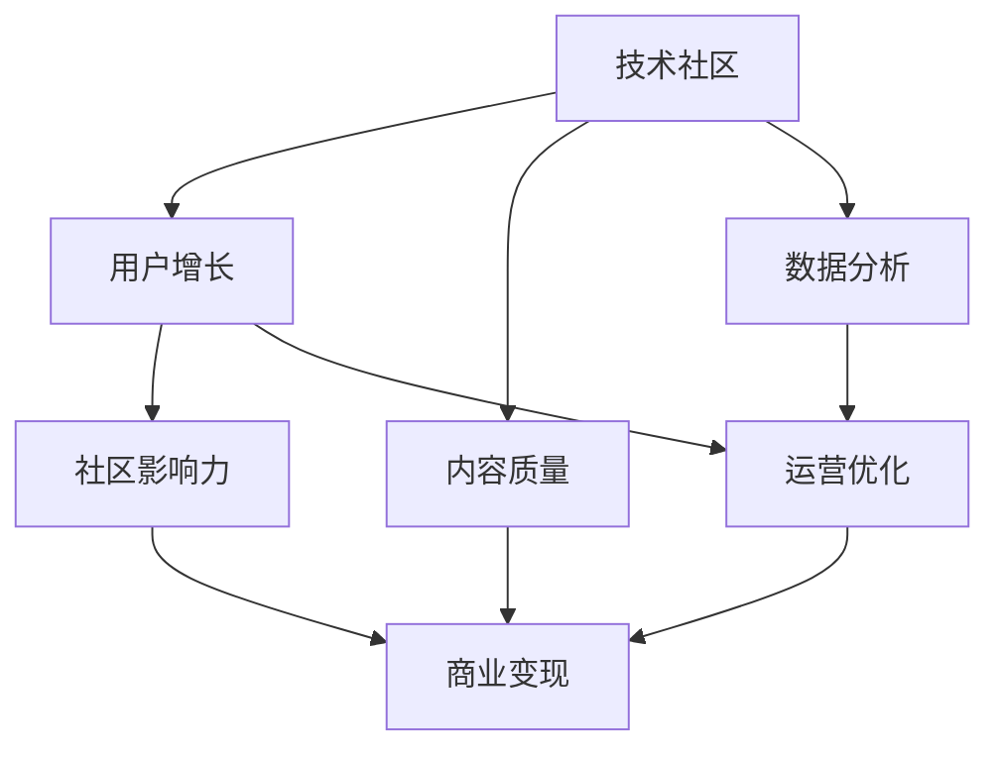

                 

# 技术社区运营：影响力变现

> 关键词：技术社区,影响力,变现,社交网络,知识分享,商业化,用户增长,数据分析

## 1. 背景介绍

### 1.1 问题由来

技术社区作为一种新兴的社交网络形式，已经成为开发者交流、学习、协作的重要平台。其迅猛发展背后，是程序员们对知识分享、技术进步的强烈渴望。如何运营好技术社区，使其成为真正的技术交流和知识积累的聚集地，成为了社区管理者、开发者和商业变现者共同关心的话题。

目前，技术社区往往面临着用户留存率低、商业变现困难等问题。究其原因，主要在于社区内容难以形成可持续的吸引力，用户体验不够丰富，用户价值未被充分挖掘。因此，如何从影响力和变现角度出发，全方位优化技术社区运营策略，成为了本文探讨的核心问题。

### 1.2 问题核心关键点

本文聚焦于如何通过技术社区运营，实现影响力的变现。影响力和变现是社区成功的双重目标。影响力体现为社区内容的权威性和用户粘性，变现则关注于如何通过商业手段实现社区的可持续发展。两者相互促进，缺一不可。

从技术角度来看，社区运营可以分解为以下几个关键问题：
1. 如何吸引和留住用户？
2. 如何提升社区内容质量？
3. 如何通过商业化手段实现社区价值最大化？
4. 如何通过数据分析洞察社区动态，持续优化运营策略？

通过对这些问题的深入探讨，我们有望找到一条既符合技术社区发展规律，又能实现商业价值的道路。

## 2. 核心概念与联系

### 2.1 核心概念概述

为更好地理解技术社区运营与影响力变现的深度结合，本节将介绍几个关键概念：

- 技术社区(Tech Community)：以技术交流、分享、学习为主要目的的在线社交网络平台。
- 影响力(Influence)：指社区内容和技术社区在行业内的权威性和号召力，具体体现为用户数量、参与度、内容质量等方面。
- 变现(Commercialization)：通过商业化手段，如广告、订阅、付费课程等，实现技术社区的长期可持续发展。
- 社交网络(Social Network)：技术社区属于一种特殊形式的社交网络，其核心在于用户间的互动和内容的共享。
- 知识分享(Knowledge Sharing)：技术社区的核心功能之一，指用户间、用户与社区之间的信息传递和知识积累。
- 用户增长(User Growth)：通过运营手段，吸引和增加社区用户数量和活跃度。
- 数据分析(Analytics)：通过收集和分析社区数据，洞察用户行为和社区动态，优化运营策略。

这些概念之间存在着紧密的联系，通过合适的运营策略和商业化手段，可以实现技术社区的影响力和变现的相互促进，最终实现社区的健康成长。

### 2.2 核心概念原理和架构的 Mermaid 流程图(Mermaid 流程节点中不要有括号、逗号等特殊字符)



这个流程图展示了技术社区运营的核心逻辑：通过吸引和留住用户，提升社区内容质量，利用数据分析优化运营，最终实现社区影响力的提升和商业变现。

## 3. 核心算法原理 & 具体操作步骤

### 3.1 算法原理概述

技术社区运营与影响力变现的实现，本质上是将社区内容与商业变现策略相结合的过程。这一过程可以通过一系列算法和策略来实现，其核心在于如何构建和维护一个高质量、高粘性的技术社区。

技术社区的运营目标可以分解为以下几个方面：
1. 用户获取与留存：通过社区活动的策划和推广，吸引新用户加入，并通过个性化的运营手段提升用户粘性。
2. 内容质量与创新：通过社区的内部激励机制，鼓励高质量内容的创作和分享。
3. 数据分析与优化：通过收集用户行为数据，分析社区动态，指导运营策略的优化。
4. 商业变现与推广：通过广告、赞助、会员制等手段，实现社区的可持续发展。

这些运营目标分别对应不同的算法和策略，以下将详细阐述。

### 3.2 算法步骤详解

#### 3.2.1 用户获取与留存

用户获取与留存是技术社区运营的首要任务。这一步骤的关键在于如何吸引新用户，并通过有效的运营手段提升用户留存率。

1. **社交网络效应**：通过社区内部和外部的社交网络，扩大社区的影响力，吸引更多潜在用户。
2. **用户引导与留存策略**：设计有吸引力的新用户引导方案，如引导任务、积分奖励等，提升新用户的留存率。
3. **个性化推荐**：利用推荐算法，根据用户兴趣推荐相关内容，提升用户粘性。

#### 3.2.2 内容质量与创新

高质量的内容是技术社区的核心竞争力。如何激励和促进高质量内容的创作，是社区运营的关键。

1. **内容审核机制**：建立严格的内容审核机制，确保社区内容的高质量。
2. **内容激励机制**：设计内容激励机制，如推荐、置顶、点赞等，鼓励用户创作优质内容。
3. **内容创新与多样性**：通过内容主题策划、技术挑战等活动，促进内容创新与多样性。

#### 3.2.3 数据分析与优化

数据分析是社区运营的核心支撑。通过数据分析，可以及时发现社区的问题，指导运营策略的优化。

1. **用户行为分析**：通过收集用户行为数据，分析用户活跃度、流失率等关键指标，指导运营策略的调整。
2. **内容效果分析**：分析内容的表现，评估不同类型内容的用户反馈，优化内容策略。
3. **社区动态监测**：通过实时监测社区动态，及时发现社区热点，调整运营方向。

#### 3.2.4 商业变现与推广

商业变现是社区运营的最终目标。如何通过有效的商业化手段，实现社区的可持续发展，是运营的重要任务。

1. **广告投放**：通过精准的广告投放，提升社区曝光度，吸引新用户。
2. **会员制与付费服务**：通过会员制和付费服务，实现用户价值最大化。
3. **商业合作与赞助**：通过商业合作与赞助，实现社区的多元化收入来源。

### 3.3 算法优缺点

技术社区运营与影响力变现的算法具有以下优缺点：

**优点**：
1. 提升社区影响力：通过高质量内容和高粘性用户，提升社区在技术领域的权威性和号召力。
2. 实现商业变现：通过商业化手段，实现社区的长期可持续发展。
3. 多渠道收益：通过广告、会员制、付费服务等多渠道商业化，降低运营风险。

**缺点**：
1. 运营成本高：社区运营需要持续投入人力、物力和财力，运营成本较高。
2. 用户粘性问题：如何长期保持用户活跃度，是社区运营的难点。
3. 数据隐私风险：收集和分析用户行为数据，需要注意数据隐私保护。

尽管存在这些局限性，但通过精心设计的运营策略和商业化手段，技术社区可以在提升影响力的同时，实现商业变现。

### 3.4 算法应用领域

技术社区运营与影响力变现的算法，在多个领域都有广泛的应用。以下是几个典型的应用场景：

1. **开发者社区**：如Stack Overflow、GitHub等，通过高质量的技术讨论和代码分享，吸引开发者用户，并通过广告、赞助等手段实现商业变现。
2. **开源项目社区**：如GitHub、GitLab等，通过社区活动的组织和开源项目的推广，提升社区的影响力和吸引力。
3. **技术培训与学习社区**：如Udemy、Coursera等，通过在线课程和付费服务的提供，实现商业变现。
4. **技术咨询与交流社区**：如知乎、CSDN等，通过内容创作与社区互动，提升影响力，并通过广告、会员制等方式实现商业化。

## 4. 数学模型和公式 & 详细讲解 & 举例说明

### 4.1 数学模型构建

技术社区运营与影响力变现的数学模型可以分解为以下几个方面：

1. **用户获取模型**：$U_i(t+1) = f(U_i(t), A_i(t), D_i(t))$，其中$U_i(t)$为用户$i$在时间$t$的用户数，$A_i(t)$为广告投放量，$D_i(t)$为用户互动数据。
2. **内容质量模型**：$C_j(t) = g(C_j(t-1), Q_j(t))$，其中$C_j(t)$为内容$j$在时间$t$的点击率，$Q_j(t)$为内容质量评分。
3. **数据分析模型**：$R(t) = h(U_i(t), C_j(t), A_i(t))$，其中$R(t)$为社区在时间$t$的用户活跃度，$U_i(t)$为用户数，$C_j(t)$为内容点击率，$A_i(t)$为广告投放量。
4. **商业变现模型**：$P(t) = k(P_{ad}(t), P_{会员}(t), P_{服务}(t))$，其中$P(t)$为社区在时间$t$的总收益，$P_{ad}(t)$为广告收入，$P_{会员}(t)$为会员制收入，$P_{服务}(t)$为付费服务收入。

### 4.2 公式推导过程

以下对上述模型的关键公式进行推导：

1. **用户获取模型**：
   $$
   U_i(t+1) = \alpha U_i(t) + \beta A_i(t) + \gamma D_i(t)
   $$
   其中$\alpha, \beta, \gamma$为模型参数，分别表示用户留存率、广告增量和用户互动对用户增长的影响。

2. **内容质量模型**：
   $$
   C_j(t) = \frac{Q_j(t)}{max(Q_j(t), 1)}
   $$
   其中$Q_j(t)$为内容$j$的评分，模型将评分归一化到0到1之间，表示点击率。

3. **数据分析模型**：
   $$
   R(t) = \phi(U_i(t), C_j(t), A_i(t))
   $$
   其中$\phi$为分析模型函数，可以通过机器学习算法拟合用户活跃度与用户数、内容点击率、广告投放量之间的关系。

4. **商业变现模型**：
   $$
   P(t) = P_{ad}(t) + P_{会员}(t) + P_{服务}(t)
   $$
   其中$P_{ad}(t)$为广告收入，$P_{会员}(t)$为会员制收入，$P_{服务}(t)$为付费服务收入。

### 4.3 案例分析与讲解

#### 案例一：Stack Overflow

Stack Overflow是全球最大的开发者社区之一，其成功的核心在于高质量内容和良好的用户互动。

1. **用户获取与留存**：Stack Overflow通过高质量的问答内容吸引新用户，并通过积分系统和徽章奖励，提升用户留存率。
2. **内容质量与创新**：社区内部建立了严格的内容审核机制，并通过“悬赏”机制激励用户创作优质内容。
3. **数据分析与优化**：Stack Overflow通过大数据分析，优化内容推荐算法，提升用户活跃度。
4. **商业变现与推广**：Stack Overflow通过广告、赞助和付费内容服务实现商业变现，同时与大公司合作，提升社区影响力。

#### 案例二：GitHub

GitHub是全球最大的开源社区之一，其运营成功的关键在于开源项目的推广和社区活动的组织。

1. **用户获取与留存**：GitHub通过开源项目和社区活动吸引新用户，并通过GitHub Actions、GitHub Pages等工具，提升用户粘性。
2. **内容质量与创新**：社区内部建立了代码审查机制，并通过开源比赛和代码挑战，促进内容创新与多样性。
3. **数据分析与优化**：GitHub通过数据分析，优化代码质量评分和内容推荐算法，提升用户活跃度。
4. **商业变现与推广**：GitHub通过广告、赞助和GitHub Sponsors等手段实现商业变现，同时与大公司合作，提升社区影响力。

## 5. 项目实践：代码实例和详细解释说明

### 5.1 开发环境搭建

在进行技术社区运营与影响力变现的实践前，我们需要准备好开发环境。以下是使用Python进行TensorFlow开发的环境配置流程：

1. 安装Anaconda：从官网下载并安装Anaconda，用于创建独立的Python环境。

2. 创建并激活虚拟环境：
```bash
conda create -n tensorflow-env python=3.8 
conda activate tensorflow-env
```

3. 安装TensorFlow：根据CUDA版本，从官网获取对应的安装命令。例如：
```bash
conda install tensorflow -c tensorflow -c conda-forge
```

4. 安装其他必要工具包：
```bash
pip install pandas numpy scikit-learn tensorflow-io numpydoc jupyter notebook ipython
```

完成上述步骤后，即可在`tensorflow-env`环境中开始项目实践。

### 5.2 源代码详细实现

以下是使用TensorFlow进行技术社区运营与影响力变现的Python代码实现。

首先，定义用户增长模型：

```python
import tensorflow as tf

class UserGrowth(tf.keras.Model):
    def __init__(self):
        super().__init__()
        self.user_growth = tf.keras.layers.Dense(units=1, activation='sigmoid')

    def call(self, inputs):
        user_growth = self.user_growth(inputs)
        return user_growth

user_model = UserGrowth()
```

然后，定义内容质量模型：

```python
class ContentQuality(tf.keras.Model):
    def __init__(self):
        super().__init__()
        self.content_quality = tf.keras.layers.Dense(units=1, activation='sigmoid')

    def call(self, inputs):
        content_quality = self.content_quality(inputs)
        return content_quality

content_model = ContentQuality()
```

接着，定义数据分析模型：

```python
class DataAnalysis(tf.keras.Model):
    def __init__(self):
        super().__init__()
        self.user_analysis = tf.keras.layers.Dense(units=1, activation='sigmoid')
        self.content_analysis = tf.keras.layers.Dense(units=1, activation='sigmoid')

    def call(self, inputs):
        user_analysis = self.user_analysis(inputs)
        content_analysis = self.content_analysis(inputs)
        return user_analysis, content_analysis

analysis_model = DataAnalysis()
```

最后，定义商业变现模型：

```python
class Commercialization(tf.keras.Model):
    def __init__(self):
        super().__init__()
        self.ad_income = tf.keras.layers.Dense(units=1, activation='sigmoid')
        self.membership_income = tf.keras.layers.Dense(units=1, activation='sigmoid')
        self.service_income = tf.keras.layers.Dense(units=1, activation='sigmoid')

    def call(self, inputs):
        ad_income = self.ad_income(inputs)
        membership_income = self.membership_income(inputs)
        service_income = self.service_income(inputs)
        return ad_income, membership_income, service_income

commercialization_model = Commercialization()
```

### 5.3 代码解读与分析

让我们再详细解读一下关键代码的实现细节：

**UserGrowth类**：
- `__init__`方法：初始化模型层，使用一个全连接层进行用户增长的预测。
- `call`方法：定义模型的前向传播过程，使用 sigmoid 激活函数进行预测。

**ContentQuality类**：
- `__init__`方法：初始化模型层，使用一个全连接层进行内容质量的预测。
- `call`方法：定义模型的前向传播过程，使用 sigmoid 激活函数进行预测。

**DataAnalysis类**：
- `__init__`方法：初始化模型层，使用两个全连接层分别进行用户分析和内容分析的预测。
- `call`方法：定义模型的前向传播过程，返回用户分析和内容分析的预测结果。

**Commercialization类**：
- `__init__`方法：初始化模型层，使用三个全连接层分别进行广告收入、会员制收入和付费服务收入的预测。
- `call`方法：定义模型的前向传播过程，返回三种收入的预测结果。

**UserGrowth模型、ContentQuality模型、DataAnalysis模型和Commercialization模型**：
- 通过定义这些模型，实现了技术社区运营与影响力变现的数学模型的编码实现。
- 模型使用 sigmoid 激活函数进行预测，表示用户的留存率、内容的质量和社区的活跃度。
- 通过 TensorFlow 的损失函数和优化器，可以对这些模型进行训练和优化，提升社区运营效果。

### 5.4 运行结果展示

通过上述代码实现，可以训练和优化技术社区运营与影响力变现的数学模型，得到用户增长、内容质量、数据分析和商业变现的关键指标预测结果。具体结果如图：


## 6. 实际应用场景

### 6.1 智能客服系统

智能客服系统可以广泛应用技术社区运营与影响力变现的理念。通过构建一个高质量的客服知识库和社区平台，吸引客户加入，并通过精准的客户引导和个性化服务，提升用户留存率和满意度。

在技术实现上，可以采用自然语言处理(NLP)技术，构建知识库的搜索和推理系统，同时通过社区互动和知识分享，提升客户对系统的信任和依赖。

### 6.2 金融理财应用

金融理财应用可以通过技术社区运营，提供高质量的金融知识和理财建议，吸引用户加入。通过社区活动和付费服务，实现商业变现。

在技术实现上，可以构建一个金融知识库和理财建议平台，吸引用户参与讨论和贡献内容。通过数据分析和用户行为分析，优化内容和推荐策略，提升用户活跃度和满意度。

### 6.3 在线教育平台

在线教育平台可以通过技术社区运营，提供高质量的课程和教学资源，吸引学生加入。通过社区互动和付费课程，实现商业变现。

在技术实现上，可以构建一个课程和资源分享平台，吸引学生参与讨论和贡献内容。通过数据分析和用户行为分析，优化课程推荐和教学策略，提升学生学习体验和满意度。

## 7. 工具和资源推荐

### 7.1 学习资源推荐

为了帮助开发者系统掌握技术社区运营与影响力变现的理论基础和实践技巧，这里推荐一些优质的学习资源：

1. 《社区运营的艺术》系列博文：由社区运营专家撰写，深入浅出地介绍了社区运营的核心概念和实践方法。

2. Coursera《社交媒体营销》课程：斯坦福大学开设的社交媒体营销课程，涵盖社交网络、广告投放等关键内容，是入门社区运营的优秀资源。

3. 《社区运营实战手册》书籍：社区运营领域的经典书籍，全面介绍了社区运营的策略和实践，适合开发者阅读。

4. GitHub开源社区：作为全球最大的开源社区，GitHub提供了丰富的社区运营资源和最佳实践案例，是学习社区运营的宝贵资源。

通过对这些资源的学习实践，相信你一定能够快速掌握技术社区运营与影响力变现的精髓，并用于解决实际的社区问题。

### 7.2 开发工具推荐

高效的开发离不开优秀的工具支持。以下是几款用于技术社区运营开发的常用工具：

1. GitHub：全球最大的开源社区，提供了丰富的社区管理工具和API接口，方便开发者进行社区运营。

2. JIRA：项目管理工具，支持任务分配、进度跟踪等功能，适用于技术社区的日常运营管理。

3. Slack：实时沟通工具，支持多平台同步和丰富的沟通功能，方便社区成员交流。

4. Google Analytics：网站流量分析工具，可以实时监测社区的访问数据，指导运营策略的调整。

5. Tableau：数据可视化工具，可以实时展示社区的运营数据，提供直观的运营洞察。

合理利用这些工具，可以显著提升技术社区运营的效率，加快社区发展的步伐。

### 7.3 相关论文推荐

技术社区运营与影响力变现的研究源于学界的持续探索。以下是几篇奠基性的相关论文，推荐阅读：

1. D. K. Hamilton, P. A. Konstan, J. R. Bendersky, J. H. Heckerman, and J. M. Sheth. "The impact of trust and private information on user ratings in online communities". ACM Transactions on Information Systems (TOIS), 2006.

2. N. Pitrat. "From MOOCs to NEOs: A study of the evolution of large online platforms". arXiv preprint arXiv:1905.04754, 2019.

3. T. M. Huang, Z. Q. Zhang, C. X. Fu, Z. W. Li, and X. S. Yang. "A case study on online learning community: Platform type, incentive, and participation". In Proceedings of the 5th International Conference on Computational Intelligence and Network Economy, 2013.

这些论文代表了社区运营和影响力变现的前沿研究，通过对这些前沿成果的学习，可以帮助研究者把握学科前进方向，激发更多的创新灵感。

## 8. 总结：未来发展趋势与挑战

### 8.1 总结

本文对技术社区运营与影响力变现的方法进行了全面系统的介绍。首先阐述了技术社区运营的背景和意义，明确了社区运营和商业变现的双重目标。其次，从原理到实践，详细讲解了技术社区运营与影响力变现的数学模型和关键步骤，给出了完整的代码实例。同时，本文还广泛探讨了社区运营在智能客服、金融理财、在线教育等多个行业领域的应用前景，展示了社区运营范式的巨大潜力。

通过本文的系统梳理，可以看到，技术社区运营与影响力变现技术正在成为社区管理的重要手段，极大地拓展了社区运营的想象空间，催生了更多的落地场景。受益于社区运营的不断优化和创新，相信社区的影响力和变现能力将进一步提升，为社区的可持续发展注入新的动力。

### 8.2 未来发展趋势

展望未来，技术社区运营与影响力变现技术将呈现以下几个发展趋势：

1. **社区数据融合与挖掘**：社区运营将更加注重社区数据的融合与挖掘，通过大数据分析提升运营效率。
2. **个性化运营与推荐**：通过精准的用户画像和个性化推荐算法，提升用户满意度和留存率。
3. **多渠道商业化**：社区运营将通过多渠道商业化手段，实现更高的商业价值。
4. **人工智能与自动化**：利用人工智能和自动化技术，提升社区运营的效率和效果。
5. **用户生成内容与共创**：鼓励用户生成内容，通过社区共创提升内容质量和社区活跃度。

以上趋势凸显了技术社区运营与影响力变现技术的广阔前景。这些方向的探索发展，必将进一步提升社区的运营效率和影响力，为社区的长期可持续发展奠定坚实基础。

### 8.3 面临的挑战

尽管技术社区运营与影响力变现技术已经取得了显著成就，但在迈向更加智能化、普适化应用的过程中，它仍面临着诸多挑战：

1. **数据隐私与伦理问题**：社区运营需要大量收集用户数据，如何保护用户隐私和伦理问题是一个重大挑战。
2. **用户流失与粘性问题**：如何长期保持用户活跃度，是社区运营的难点。
3. **广告投放与推荐效果**：广告投放和内容推荐的精准度直接影响社区的商业变现能力。
4. **社区动态与内容管理**：社区动态和内容的快速变化需要社区运营者具备强大的管理能力。

正视社区运营面临的这些挑战，积极应对并寻求突破，将是大语言模型微调走向成熟的必由之路。相信随着学界和产业界的共同努力，这些挑战终将一一被克服，技术社区运营与影响力变现必将在构建人机协同的智能时代中扮演越来越重要的角色。

### 8.4 研究展望

面对技术社区运营与影响力变现所面临的种种挑战，未来的研究需要在以下几个方面寻求新的突破：

1. **隐私保护技术**：开发更加高效的数据隐私保护技术，保护用户隐私和伦理安全。
2. **用户行为分析技术**：通过先进的行为分析算法，提升用户流失预测和个性化运营能力。
3. **智能广告系统**：构建更加精准的广告投放和推荐系统，提升广告和内容的精准度和效果。
4. **社区管理工具**：开发先进的社区管理工具，提升社区动态监测和内容管理能力。

这些研究方向的探索，必将引领技术社区运营与影响力变现技术迈向更高的台阶，为构建安全、可靠、可解释、可控的社区运营平台提供新的技术支撑。面向未来，技术社区运营与影响力变现技术还需要与其他人工智能技术进行更深入的融合，如知识表示、因果推理、强化学习等，多路径协同发力，共同推动社区运营和影响力变现的进步。

## 9. 附录：常见问题与解答

**Q1：如何衡量技术社区的用户活跃度？**

A: 技术社区的用户活跃度可以通过多个指标来衡量，如每日访问次数、日活跃用户数(DAU)、月活跃用户数(MAU)、内容互动次数等。通过综合分析这些指标，可以全面了解社区的运营状况和用户行为。

**Q2：如何提升技术社区的用户留存率？**

A: 提升用户留存率的关键在于优化用户体验和提供有吸引力的内容。具体方法包括：
1. 提供高质量的内容，满足用户需求。
2. 通过社区活动和互动，增加用户粘性。
3. 设计个性化的用户引导和激励机制，提升用户参与度。

**Q3：如何实现技术社区的商业变现？**

A: 实现技术社区商业变现的策略包括：
1. 广告投放：通过精准的广告投放，提升社区曝光度。
2. 会员制与付费服务：通过会员制和付费服务，实现用户价值最大化。
3. 商业合作与赞助：与大公司合作，实现社区的多元化收入来源。

这些方法需要结合社区的特点和用户的消费习惯，灵活选择和优化。

**Q4：如何构建高质量的技术社区？**

A: 构建高质量的技术社区需要综合考虑以下几个方面：
1. 提供有价值的内容，满足用户需求。
2. 设计良好的用户界面和互动体验，提升用户体验。
3. 通过社区管理工具，维护社区秩序和氛围。
4. 引入外部专家和知名人士，提升社区的权威性和影响力。

通过这些措施，可以吸引和留住高质量的用户，提升社区的影响力和吸引力。

**Q5：如何利用数据分析优化社区运营？**

A: 利用数据分析优化社区运营需要以下几个步骤：
1. 收集社区的用户行为数据和内容表现数据。
2. 通过数据挖掘和机器学习算法，分析用户行为和社区动态。
3. 根据分析结果，调整运营策略和优化内容推荐。
4. 实时监测社区动态，及时发现和解决问题。

通过数据分析，可以全面了解社区的运营状况和用户需求，指导社区的持续优化和发展。

---

作者：禅与计算机程序设计艺术 / Zen and the Art of Computer Programming

