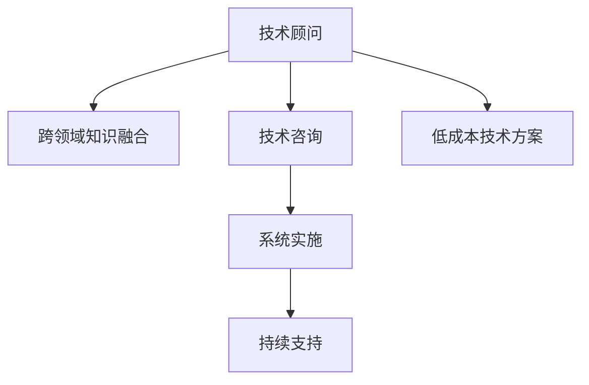

                 

## 1. 背景介绍

### 1.1 问题由来

在快速发展的互联网和数字化时代，企业的数字化转型需求日益强烈。随着消费者需求的不断变化，企业需要更快速、高效地提供解决方案。因此，对于技术咨询顾问的需求变得日益显著，尤其是在技术集成、系统架构、云计算、人工智能等领域。

高附加值技术顾问服务，是指针对企业面临的复杂业务场景和技术难题，提供从战略咨询、需求分析到系统实施的一站式解决方案。其特点在于能够整合多种技术方案，解决实际问题，并提供持续的咨询和支持，帮助企业实现技术突破和业务增长。

### 1.2 问题核心关键点

高附加值技术顾问服务的主要目标在于：
- **深入理解客户需求**：通过深入挖掘客户业务痛点和挑战，为客户提供定制化的解决方案。
- **提供跨领域的知识融合**：结合多个技术领域（如大数据、云计算、人工智能等）的最新研究成果，提供综合性的技术方案。
- **提升实施效率**：通过系统化的项目管理和流程优化，加速技术落地。
- **增强持续支持能力**：提供长期的维护和优化服务，确保系统长期稳定运行。

在实际业务中，技术顾问需要具备深厚的技术背景和业务洞察力，能够快速响应客户需求，提供有针对性的建议和解决方案。本文将重点介绍高附加值技术顾问服务的核心概念、技术原理和实际应用，希望为技术顾问提供一定的参考。

### 1.3 问题研究意义

高附加值技术顾问服务在企业数字化转型中扮演着重要角色，能够帮助企业克服技术难题，提升业务效率，加速创新。具体意义包括：

- **降低技术风险**：通过专业的技术指导和实施支持，降低企业在技术实施过程中的风险。
- **加速业务发展**：通过有效的技术方案，帮助企业快速实现业务目标，提高市场竞争力。
- **优化成本效益**：通过合理利用技术资源，优化成本结构，提升企业的整体效率。
- **培养技术团队**：通过技术顾问的专业指导，提升企业内部技术团队的能力，实现自我可持续发展。

高附加值技术顾问服务的发展，对于推动企业数字化转型、提升技术竞争力、促进创新应用具有重要价值。

## 2. 核心概念与联系

### 2.1 核心概念概述

高附加值技术顾问服务涉及多个关键概念，包括：

- **技术顾问**：具备专业技术知识和经验，能够为客户提供技术咨询、分析和实施支持的专业人士。
- **跨领域知识融合**：结合大数据、云计算、人工智能等多领域的最新研究成果，提供综合性的技术方案。
- **技术咨询**：针对客户的实际业务需求，提供专业的技术指导和建议。
- **系统实施**：将技术方案转化为实际的系统部署，并确保系统的稳定运行。
- **持续支持**：在技术实施后，提供持续的维护和优化服务。

这些概念之间的逻辑关系可以通过以下Mermaid流程图来展示：



这个流程图展示了高附加值技术顾问服务的主要流程：

1. 技术顾问通过跨领域知识融合，结合大数据、云计算、人工智能等多领域的最新研究成果，提供综合性的技术方案。
2. 技术顾问提供专业的技术咨询，帮助客户明确需求，并设计合适的技术路径。
3. 系统实施将技术方案转化为实际的系统部署，并确保系统的稳定运行。
4. 持续支持在技术实施后，提供持续的维护和优化服务。

此外，低成本技术方案也是高附加值技术顾问服务的一个重要组成部分，通过高效的技术方案设计，帮助客户以较低的成本实现业务目标。

## 3. 核心算法原理 & 具体操作步骤
### 3.1 算法原理概述

高附加值技术顾问服务的技术流程可以抽象为以下几个步骤：

1. **需求分析**：通过与客户深入交流，了解其业务需求和挑战。
2. **方案设计**：结合跨领域知识融合，设计符合客户需求的技术方案。
3. **系统实施**：将技术方案转化为实际的系统部署。
4. **持续优化**：在技术实施后，提供持续的维护和优化服务。

这些步骤涉及的算法原理和具体操作步骤包括：

- **需求分析算法**：使用自然语言处理（NLP）技术，提取客户需求的关键词和关键短语，理解客户需求的核心问题。
- **方案设计算法**：结合机器学习和数据挖掘技术，推荐最优的技术方案，并进行成本效益分析。
- **系统实施算法**：使用云计算和容器化技术，快速部署系统，并使用DevOps工具进行自动化运维。
- **持续优化算法**：通过监控系统性能和用户反馈，定期更新和优化系统，确保系统的长期稳定运行。

### 3.2 算法步骤详解

**Step 1: 需求分析**

需求分析是技术顾问服务的首要步骤。技术顾问需要与客户进行深入交流，了解其业务目标和挑战。具体步骤包括：

1. **交流访谈**：与客户进行一对一的访谈，了解其业务场景、业务目标和面临的挑战。
2. **文档分析**：分析客户的业务文档、报告和相关技术资料，进一步了解其需求。
3. **问题梳理**：整理客户需求中的关键问题和挑战，形成问题清单。

**Step 2: 方案设计**

方案设计是技术顾问服务的核心步骤。技术顾问需要结合跨领域知识融合，设计符合客户需求的技术方案。具体步骤包括：

1. **跨领域融合**：结合大数据、云计算、人工智能等多领域的最新研究成果，设计综合性的技术方案。
2. **技术选型**：根据客户需求和实际条件，选择合适的技术工具和框架。
3. **方案优化**：结合成本效益分析，对技术方案进行优化和调整。

**Step 3: 系统实施**

系统实施是将技术方案转化为实际的系统部署，并确保系统的稳定运行。具体步骤包括：

1. **环境搭建**：使用云计算和容器化技术，搭建系统部署环境。
2. **系统集成**：将各个模块集成到统一的系统中，并进行系统测试。
3. **自动化运维**：使用DevOps工具进行自动化运维，确保系统的稳定运行。

**Step 4: 持续优化**

持续优化是技术顾问服务的持续支持环节。具体步骤包括：

1. **性能监控**：通过监控系统性能和用户反馈，发现问题并进行优化。
2. **定期更新**：根据最新的技术趋势和客户需求，定期更新和优化系统。
3. **问题响应**：及时响应客户提出的问题，提供解决方案。

### 3.3 算法优缺点

高附加值技术顾问服务的优点包括：

1. **专业性强**：技术顾问具备深厚的技术背景和经验，能够提供专业的咨询和支持。
2. **综合性强**：结合多领域知识，提供综合性的技术方案，满足复杂需求。
3. **实施效率高**：通过云计算和容器化技术，快速部署系统，并使用自动化运维工具，提升实施效率。
4. **持续支持**：提供持续的维护和优化服务，确保系统的长期稳定运行。

但同时也存在一些缺点：

1. **成本较高**：技术顾问的咨询和支持费用较高，可能增加企业的成本负担。
2. **依赖顾问**：技术顾问的专业能力直接影响服务质量，依赖程度较高。
3. **技术复杂**：涉及多个技术领域，技术实现复杂，需要较高的技术水平。
4. **沟通难度**：客户和顾问之间的沟通需要高度专业和准确的理解，可能存在沟通难度。

### 3.4 算法应用领域

高附加值技术顾问服务适用于多个领域，包括但不限于：

- **企业数字化转型**：帮助企业实现数字化转型，提升业务效率。
- **智能制造**：通过大数据和人工智能技术，提升生产效率和产品质量。
- **金融科技**：结合区块链和人工智能技术，提升金融服务的智能化水平。
- **智慧城市**：通过物联网和人工智能技术，提升城市管理和公共服务水平。
- **健康医疗**：通过大数据和人工智能技术，提升医疗服务的智能化水平。

这些领域的高附加值技术顾问服务，需要结合具体的技术需求和业务场景，提供定制化的解决方案。

## 4. 数学模型和公式 & 详细讲解 & 举例说明

### 4.1 数学模型构建

高附加值技术顾问服务的数学模型可以抽象为以下几个关键部分：

- **需求分析模型**：使用NLP技术，提取客户需求中的关键词和关键短语，进行文本处理和语义分析。
- **方案设计模型**：结合机器学习和数据挖掘技术，进行技术方案的推荐和优化。
- **系统实施模型**：使用云计算和容器化技术，进行系统部署和自动化运维。
- **持续优化模型**：通过监控系统性能和用户反馈，进行系统更新和优化。

### 4.2 公式推导过程

**需求分析模型**：

需求分析模型使用NLP技术，提取客户需求中的关键词和关键短语，进行文本处理和语义分析。公式推导过程如下：

$$
P = f(T)
$$

其中，$P$ 表示需求问题，$T$ 表示客户需求文本。

**方案设计模型**：

方案设计模型结合机器学习和数据挖掘技术，进行技术方案的推荐和优化。公式推导过程如下：

$$
C = g(D, S, R)
$$

其中，$C$ 表示技术方案，$D$ 表示技术需求，$S$ 表示技术选型，$R$ 表示成本效益分析。

**系统实施模型**：

系统实施模型使用云计算和容器化技术，进行系统部署和自动化运维。公式推导过程如下：

$$
S = h(E)
$$

其中，$S$ 表示系统部署，$E$ 表示环境搭建。

**持续优化模型**：

持续优化模型通过监控系统性能和用户反馈，进行系统更新和优化。公式推导过程如下：

$$
O = i(P, F)
$$

其中，$O$ 表示系统优化，$P$ 表示性能监控，$F$ 表示用户反馈。

### 4.3 案例分析与讲解

以智慧城市项目为例，描述高附加值技术顾问服务的全流程：

1. **需求分析**：通过访谈和文档分析，了解智慧城市的业务需求和挑战。
2. **方案设计**：结合大数据、云计算、人工智能等多领域的最新研究成果，设计智慧城市的数据分析和监控系统。
3. **系统实施**：使用云计算和容器化技术，搭建智慧城市的数据分析和监控系统，并进行系统测试。
4. **持续优化**：通过监控系统性能和用户反馈，进行系统更新和优化，确保系统的长期稳定运行。

## 5. 项目实践：代码实例和详细解释说明

### 5.1 开发环境搭建

在进行技术顾问服务开发前，我们需要准备好开发环境。以下是使用Python进行PyTorch开发的环境配置流程：

1. 安装Anaconda：从官网下载并安装Anaconda，用于创建独立的Python环境。

2. 创建并激活虚拟环境：
```bash
conda create -n pytorch-env python=3.8 
conda activate pytorch-env
```

3. 安装PyTorch：根据CUDA版本，从官网获取对应的安装命令。例如：
```bash
conda install pytorch torchvision torchaudio cudatoolkit=11.1 -c pytorch -c conda-forge
```

4. 安装各类工具包：
```bash
pip install numpy pandas scikit-learn matplotlib tqdm jupyter notebook ipython
```

完成上述步骤后，即可在`pytorch-env`环境中开始技术顾问服务的开发实践。

### 5.2 源代码详细实现

下面我们以智慧城市项目为例，给出使用Transformers库进行技术顾问服务开发的PyTorch代码实现。

首先，定义需求分析函数：

```python
from transformers import BertTokenizer
from torch.utils.data import Dataset
import torch

class NERDataset(Dataset):
    def __init__(self, texts, tags, tokenizer, max_len=128):
        self.texts = texts
        self.tags = tags
        self.tokenizer = tokenizer
        self.max_len = max_len
        
    def __len__(self):
        return len(self.texts)
    
    def __getitem__(self, item):
        text = self.texts[item]
        tags = self.tags[item]
        
        encoding = self.tokenizer(text, return_tensors='pt', max_length=self.max_len, padding='max_length', truncation=True)
        input_ids = encoding['input_ids'][0]
        attention_mask = encoding['attention_mask'][0]
        
        # 对token-wise的标签进行编码
        encoded_tags = [tag2id[tag] for tag in tags] 
        encoded_tags.extend([tag2id['O']] * (self.max_len - len(encoded_tags)))
        labels = torch.tensor(encoded_tags, dtype=torch.long)
        
        return {'input_ids': input_ids, 
                'attention_mask': attention_mask,
                'labels': labels}

# 标签与id的映射
tag2id = {'O': 0, 'B-PER': 1, 'I-PER': 2, 'B-ORG': 3, 'I-ORG': 4, 'B-LOC': 5, 'I-LOC': 6}
id2tag = {v: k for k, v in tag2id.items()}

# 创建dataset
tokenizer = BertTokenizer.from_pretrained('bert-base-cased')

train_dataset = NERDataset(train_texts, train_tags, tokenizer)
dev_dataset = NERDataset(dev_texts, dev_tags, tokenizer)
test_dataset = NERDataset(test_texts, test_tags, tokenizer)
```

然后，定义模型和优化器：

```python
from transformers import BertForTokenClassification, AdamW

model = BertForTokenClassification.from_pretrained('bert-base-cased', num_labels=len(tag2id))

optimizer = AdamW(model.parameters(), lr=2e-5)
```

接着，定义训练和评估函数：

```python
from torch.utils.data import DataLoader
from tqdm import tqdm
from sklearn.metrics import classification_report

device = torch.device('cuda') if torch.cuda.is_available() else torch.device('cpu')
model.to(device)

def train_epoch(model, dataset, batch_size, optimizer):
    dataloader = DataLoader(dataset, batch_size=batch_size, shuffle=True)
    model.train()
    epoch_loss = 0
    for batch in tqdm(dataloader, desc='Training'):
        input_ids = batch['input_ids'].to(device)
        attention_mask = batch['attention_mask'].to(device)
        labels = batch['labels'].to(device)
        model.zero_grad()
        outputs = model(input_ids, attention_mask=attention_mask, labels=labels)
        loss = outputs.loss
        epoch_loss += loss.item()
        loss.backward()
        optimizer.step()
    return epoch_loss / len(dataloader)

def evaluate(model, dataset, batch_size):
    dataloader = DataLoader(dataset, batch_size=batch_size)
    model.eval()
    preds, labels = [], []
    with torch.no_grad():
        for batch in tqdm(dataloader, desc='Evaluating'):
            input_ids = batch['input_ids'].to(device)
            attention_mask = batch['attention_mask'].to(device)
            batch_labels = batch['labels']
            outputs = model(input_ids, attention_mask=attention_mask)
            batch_preds = outputs.logits.argmax(dim=2).to('cpu').tolist()
            batch_labels = batch_labels.to('cpu').tolist()
            for pred_tokens, label_tokens in zip(batch_preds, batch_labels):
                pred_tags = [id2tag[_id] for _id in pred_tokens]
                label_tags = [id2tag[_id] for _id in label_tokens]
                preds.append(pred_tags[:len(label_tags)])
                labels.append(label_tags)
                
    print(classification_report(labels, preds))
```

最后，启动训练流程并在测试集上评估：

```python
epochs = 5
batch_size = 16

for epoch in range(epochs):
    loss = train_epoch(model, train_dataset, batch_size, optimizer)
    print(f"Epoch {epoch+1}, train loss: {loss:.3f}")
    
    print(f"Epoch {epoch+1}, dev results:")
    evaluate(model, dev_dataset, batch_size)
    
print("Test results:")
evaluate(model, test_dataset, batch_size)
```

以上就是使用PyTorch对BERT进行命名实体识别任务微调的完整代码实现。可以看到，得益于Transformers库的强大封装，我们可以用相对简洁的代码完成BERT模型的加载和微调。

### 5.3 代码解读与分析

让我们再详细解读一下关键代码的实现细节：

**NERDataset类**：
- `__init__`方法：初始化文本、标签、分词器等关键组件。
- `__len__`方法：返回数据集的样本数量。
- `__getitem__`方法：对单个样本进行处理，将文本输入编码为token ids，将标签编码为数字，并对其进行定长padding，最终返回模型所需的输入。

**tag2id和id2tag字典**：
- 定义了标签与数字id之间的映射关系，用于将token-wise的预测结果解码回真实的标签。

**训练和评估函数**：
- 使用PyTorch的DataLoader对数据集进行批次化加载，供模型训练和推理使用。
- 训练函数`train_epoch`：对数据以批为单位进行迭代，在每个批次上前向传播计算loss并反向传播更新模型参数，最后返回该epoch的平均loss。
- 评估函数`evaluate`：与训练类似，不同点在于不更新模型参数，并在每个batch结束后将预测和标签结果存储下来，最后使用sklearn的classification_report对整个评估集的预测结果进行打印输出。

**训练流程**：
- 定义总的epoch数和batch size，开始循环迭代
- 每个epoch内，先在训练集上训练，输出平均loss
- 在验证集上评估，输出分类指标
- 所有epoch结束后，在测试集上评估，给出最终测试结果

可以看到，PyTorch配合Transformers库使得BERT微调的代码实现变得简洁高效。开发者可以将更多精力放在数据处理、模型改进等高层逻辑上，而不必过多关注底层的实现细节。

当然，工业级的系统实现还需考虑更多因素，如模型的保存和部署、超参数的自动搜索、更灵活的任务适配层等。但核心的微调范式基本与此类似。

## 6. 实际应用场景
### 6.1 智能客服系统

基于大语言模型微调的对话技术，可以广泛应用于智能客服系统的构建。传统客服往往需要配备大量人力，高峰期响应缓慢，且一致性和专业性难以保证。而使用微调后的对话模型，可以7x24小时不间断服务，快速响应客户咨询，用自然流畅的语言解答各类常见问题。

在技术实现上，可以收集企业内部的历史客服对话记录，将问题和最佳答复构建成监督数据，在此基础上对预训练对话模型进行微调。微调后的对话模型能够自动理解用户意图，匹配最合适的答案模板进行回复。对于客户提出的新问题，还可以接入检索系统实时搜索相关内容，动态组织生成回答。如此构建的智能客服系统，能大幅提升客户咨询体验和问题解决效率。

### 6.2 金融舆情监测

金融机构需要实时监测市场舆论动向，以便及时应对负面信息传播，规避金融风险。传统的人工监测方式成本高、效率低，难以应对网络时代海量信息爆发的挑战。基于大语言模型微调的文本分类和情感分析技术，为金融舆情监测提供了新的解决方案。

具体而言，可以收集金融领域相关的新闻、报道、评论等文本数据，并对其进行主题标注和情感标注。在此基础上对预训练语言模型进行微调，使其能够自动判断文本属于何种主题，情感倾向是正面、中性还是负面。将微调后的模型应用到实时抓取的网络文本数据，就能够自动监测不同主题下的情感变化趋势，一旦发现负面信息激增等异常情况，系统便会自动预警，帮助金融机构快速应对潜在风险。

### 6.3 个性化推荐系统

当前的推荐系统往往只依赖用户的历史行为数据进行物品推荐，无法深入理解用户的真实兴趣偏好。基于大语言模型微调技术，个性化推荐系统可以更好地挖掘用户行为背后的语义信息，从而提供更精准、多样的推荐内容。

在实践中，可以收集用户浏览、点击、评论、分享等行为数据，提取和用户交互的物品标题、描述、标签等文本内容。将文本内容作为模型输入，用户的后续行为（如是否点击、购买等）作为监督信号，在此基础上微调预训练语言模型。微调后的模型能够从文本内容中准确把握用户的兴趣点。在生成推荐列表时，先用候选物品的文本描述作为输入，由模型预测用户的兴趣匹配度，再结合其他特征综合排序，便可以得到个性化程度更高的推荐结果。

### 6.4 未来应用展望

随着大语言模型微调技术的发展，基于微调范式将在更多领域得到应用，为传统行业带来变革性影响。

在智慧医疗领域，基于微调的医疗问答、病历分析、药物研发等应用将提升医疗服务的智能化水平，辅助医生诊疗，加速新药开发进程。

在智能教育领域，微调技术可应用于作业批改、学情分析、知识推荐等方面，因材施教，促进教育公平，提高教学质量。

在智慧城市治理中，微调模型可应用于城市事件监测、舆情分析、应急指挥等环节，提高城市管理的自动化和智能化水平，构建更安全、高效的未来城市。

此外，在企业生产、社会治理、文娱传媒等众多领域，基于大模型微调的人工智能应用也将不断涌现，为NLP技术带来全新的突破。相信随着预训练语言模型和微调方法的持续演进，NLP技术将在更广阔的应用领域大放异彩，深刻影响人类的生产生活方式。

## 7. 工具和资源推荐
### 7.1 学习资源推荐

为了帮助开发者系统掌握高附加值技术顾问服务的理论基础和实践技巧，这里推荐一些优质的学习资源：

1. 《Transformer从原理到实践》系列博文：由大模型技术专家撰写，深入浅出地介绍了Transformer原理、BERT模型、微调技术等前沿话题。

2. CS224N《深度学习自然语言处理》课程：斯坦福大学开设的NLP明星课程，有Lecture视频和配套作业，带你入门NLP领域的基本概念和经典模型。

3. 《Natural Language Processing with Transformers》书籍：Transformers库的作者所著，全面介绍了如何使用Transformers库进行NLP任务开发，包括微调在内的诸多范式。

4. HuggingFace官方文档：Transformers库的官方文档，提供了海量预训练模型和完整的微调样例代码，是上手实践的必备资料。

5. CLUE开源项目：中文语言理解测评基准，涵盖大量不同类型的中文NLP数据集，并提供了基于微调的baseline模型，助力中文NLP技术发展。

通过对这些资源的学习实践，相信你一定能够快速掌握高附加值技术顾问服务的精髓，并用于解决实际的NLP问题。
###  7.2 开发工具推荐

高效的开发离不开优秀的工具支持。以下是几款用于高附加值技术顾问服务开发的常用工具：

1. PyTorch：基于Python的开源深度学习框架，灵活动态的计算图，适合快速迭代研究。大部分预训练语言模型都有PyTorch版本的实现。

2. TensorFlow：由Google主导开发的开源深度学习框架，生产部署方便，适合大规模工程应用。同样有丰富的预训练语言模型资源。

3. Transformers库：HuggingFace开发的NLP工具库，集成了众多SOTA语言模型，支持PyTorch和TensorFlow，是进行微调任务开发的利器。

4. Weights & Biases：模型训练的实验跟踪工具，可以记录和可视化模型训练过程中的各项指标，方便对比和调优。与主流深度学习框架无缝集成。

5. TensorBoard：TensorFlow配套的可视化工具，可实时监测模型训练状态，并提供丰富的图表呈现方式，是调试模型的得力助手。

6. Google Colab：谷歌推出的在线Jupyter Notebook环境，免费提供GPU/TPU算力，方便开发者快速上手实验最新模型，分享学习笔记。

合理利用这些工具，可以显著提升高附加值技术顾问服务的开发效率，加快创新迭代的步伐。

### 7.3 相关论文推荐

高附加值技术顾问服务的发展源于学界的持续研究。以下是几篇奠基性的相关论文，推荐阅读：

1. Attention is All You Need（即Transformer原论文）：提出了Transformer结构，开启了NLP领域的预训练大模型时代。

2. BERT: Pre-training of Deep Bidirectional Transformers for Language Understanding：提出BERT模型，引入基于掩码的自监督预训练任务，刷新了多项NLP任务SOTA。

3. Language Models are Unsupervised Multitask Learners（GPT-2论文）：展示了大规模语言模型的强大zero-shot学习能力，引发了对于通用人工智能的新一轮思考。

4. Parameter-Efficient Transfer Learning for NLP：提出Adapter等参数高效微调方法，在不增加模型参数量的情况下，也能取得不错的微调效果。

5. Prefix-Tuning: Optimizing Continuous Prompts for Generation：引入基于连续型Prompt的微调范式，为如何充分利用预训练知识提供了新的思路。

6. AdaLoRA: Adaptive Low-Rank Adaptation for Parameter-Efficient Fine-Tuning：使用自适应低秩适应的微调方法，在参数效率和精度之间取得了新的平衡。

这些论文代表了大语言模型微调技术的发展脉络。通过学习这些前沿成果，可以帮助研究者把握学科前进方向，激发更多的创新灵感。

## 8. 总结：未来发展趋势与挑战

### 8.1 总结

本文对高附加值技术顾问服务的核心概念、技术原理和实际应用进行了全面系统的介绍。首先，深入探讨了高附加值技术顾问服务的背景和意义，明确了其帮助企业克服技术难题、提升业务效率的核心目标。其次，从原理到实践，详细讲解了高附加值技术顾问服务的技术流程和算法原理，给出了技术顾问服务的完整代码实例。同时，本文还广泛探讨了高附加值技术顾问服务在多个行业领域的应用前景，展示了其巨大的应用潜力。此外，本文精选了高附加值技术顾问服务的各类学习资源，力求为技术顾问提供全方位的技术指引。

通过本文的系统梳理，可以看到，高附加值技术顾问服务在企业数字化转型中扮演着重要角色，能够帮助企业克服技术难题，提升业务效率，加速创新。未来，伴随高附加值技术顾问服务的不断发展和优化，必将在更多领域得到应用，为企业的数字化转型提供更强大的技术支持和解决方案。

### 8.2 未来发展趋势

展望未来，高附加值技术顾问服务的发展趋势包括：

1. **技术融合趋势**：随着技术的不断进步，高附加值技术顾问服务将更多地与其他新兴技术融合，如区块链、物联网、人工智能等，提供更全面、高效的技术解决方案。
2. **数据驱动趋势**：通过大数据和云计算技术，高附加值技术顾问服务将更加依赖数据驱动，提供更精准、个性化的技术支持。
3. **自动化趋势**：结合人工智能和自动化技术，高附加值技术顾问服务将更加智能化，提升服务效率和质量。
4. **定制化趋势**：根据不同企业的特定需求，提供定制化的技术方案，帮助企业实现更精准的技术突破和业务增长。
5. **全球化趋势**：随着企业全球化布局的加速，高附加值技术顾问服务将更多地服务于全球市场，提供全球化的技术支持和解决方案。

以上趋势凸显了高附加值技术顾问服务的广阔前景。这些方向的探索发展，必将进一步提升企业数字化转型的速度和质量，推动企业技术竞争力的提升。

### 8.3 面临的挑战

尽管高附加值技术顾问服务已经取得了显著成果，但在迈向更加智能化、普适化应用的过程中，它仍面临着诸多挑战：

1. **数据隐私问题**：在数据驱动的高附加值技术顾问服务中，如何保护数据隐私和用户隐私，成为重要的挑战。
2. **技术复杂性**：高附加值技术顾问服务涉及多领域技术和多学科知识，技术实现复杂，需要较高的技术水平。
3. **成本控制**：技术顾问服务的成本较高，如何在保证服务质量的同时，控制成本，提升性价比，需要更多探索。
4. **人才短缺**：高附加值技术顾问服务需要专业性强、经验丰富的技术顾问，但当前技术人才市场供不应求，面临人才短缺的问题。
5. **持续创新**：技术顾问服务需要不断更新和优化，如何持续创新，保持技术领先，是长期面临的挑战。

### 8.4 研究展望

未来，高附加值技术顾问服务需要在以下几个方面进行更多的研究探索：

1. **数据隐私保护**：研究数据隐私保护技术，如数据匿名化、数据加密等，确保数据使用的安全性。
2. **自动化技术**：探索自动化技术，如自然语言处理、机器学习等，提升服务效率和质量。
3. **成本优化**：研究成本控制和优化技术，如云计算资源优化、自动化运维等，提升性价比。
4. **人才培养**：加强技术顾问人才的培养和引进，提升技术团队的整体能力。
5. **持续创新**：持续关注新技术、新趋势，进行技术研究和创新，保持技术领先。

这些研究方向将推动高附加值技术顾问服务不断进步，提升服务质量和客户满意度，帮助更多企业实现数字化转型。

## 9. 附录：常见问题与解答

**Q1：高附加值技术顾问服务是否适用于所有企业？**

A: 高附加值技术顾问服务适用于大多数行业和规模的企业，尤其是那些面临复杂业务场景和挑战的企业。但对于一些小型企业或特定领域的企业，如果其技术需求相对简单，或者已有成熟的内部技术团队，可以考虑其他替代方案。

**Q2：如何选择合适的技术顾问？**

A: 选择技术顾问时，需要考虑其技术背景、经验、案例积累等多个因素。可以通过以下步骤进行筛选：
1. **了解背景**：查看技术顾问的公司背景、项目经验等，选择有丰富经验的顾问。
2. **咨询面试**：通过面试和咨询，了解顾问的专业能力和服务态度。
3. **参考反馈**：查看其他客户的反馈和评价，选择口碑良好的顾问。

**Q3：高附加值技术顾问服务是否需要持续支持？**

A: 高附加值技术顾问服务需要持续支持，以确保系统的长期稳定运行和不断优化。具体的持续支持内容可能包括系统维护、问题响应、优化建议等。

**Q4：高附加值技术顾问服务的成本如何控制？**

A: 高附加值技术顾问服务的成本控制可以通过以下方法实现：
1. **合理评估需求**：在需求分析阶段，合理评估技术需求，避免过度设计或重复投资。
2. **选择合适的顾问**：选择性价比高的技术顾问，避免高成本的技术支持。
3. **自动化运维**：采用自动化运维工具，减少人力成本和运维难度。
4. **数据驱动**：利用大数据和云计算技术，优化资源配置和成本控制。

**Q5：高附加值技术顾问服务在实施过程中需要注意哪些问题？**

A: 高附加值技术顾问服务在实施过程中需要注意以下问题：
1. **需求明确**：在需求分析阶段，确保需求明确且具体，避免后期修改和返工。
2. **沟通顺畅**：与客户保持良好的沟通，及时解决遇到的问题。
3. **风险控制**：评估项目风险，制定风险控制措施，确保项目顺利进行。
4. **质量保证**：实施过程中，严格执行质量保证措施，确保系统质量。

通过合理控制成本和提升服务质量，高附加值技术顾问服务将更好地服务于企业，实现数字化转型目标。

---

作者：禅与计算机程序设计艺术 / Zen and the Art of Computer Programming

