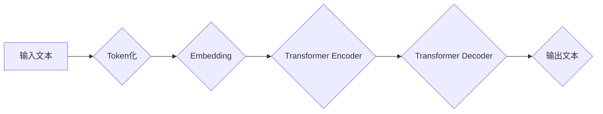

> 大语言模型、Transformer、BERT、GPT、LLM、自然语言处理、深度学习、机器学习

## 1. 背景介绍

近年来，深度学习技术取得了飞速发展，特别是Transformer模型的出现，为自然语言处理（NLP）领域带来了革命性的变革。大语言模型（LLM）作为Transformer模型的升级版，拥有强大的文本理解和生成能力，在文本分类、机器翻译、问答系统、代码生成等领域展现出巨大的应用潜力。

传统的NLP模型往往依赖于手工设计的特征工程，而LLM则通过学习海量文本数据，自动提取文本中的语义特征，从而实现更精准、更灵活的文本处理。

## 2. 核心概念与联系

大语言模型的核心概念包括：

* **Transformer模型:** Transformer模型是一种基于注意力机制的深度神经网络架构，能够有效处理长距离依赖关系，是LLM的基础。
* **自回归语言模型:** 自回归语言模型是一种预测下一个词的概率分布的模型，通过训练大量的文本数据，学习语言的语法和语义规律。
* **预训练和微调:** 预训练是指在大量文本数据上训练一个通用语言模型，微调是指将预训练模型应用于特定任务，通过少量任务数据进行调整。

**Mermaid 流程图:**



## 3. 核心算法原理 & 具体操作步骤

### 3.1  算法原理概述

Transformer模型的核心是注意力机制，它能够学习文本中不同词之间的关系，并赋予每个词不同的权重。

注意力机制可以分为三种类型：

* **自注意力 (Self-Attention):** 计算每个词与所有其他词之间的关系。
* **多头注意力 (Multi-Head Attention):** 使用多个自注意力头，学习不同类型的词语关系。
* **交叉注意力 (Cross-Attention):** 计算两个序列之间的关系，例如，句子与摘要之间的关系。

### 3.2  算法步骤详解

1. **Token化:** 将输入文本分割成一个个独立的词或子词。
2. **Embedding:** 将每个词转换为一个向量表示，称为词嵌入。
3. **编码器:** 使用多层Transformer编码器，将输入文本序列编码成一个上下文向量。
4. **解码器:** 使用多层Transformer解码器，根据上下文向量生成输出文本序列。

### 3.3  算法优缺点

**优点:**

* 能够有效处理长距离依赖关系。
* 训练效率高，能够学习到更深层的语义特征。

**缺点:**

* 计算量大，需要大量的计算资源。
* 训练数据量大，需要海量文本数据进行训练。

### 3.4  算法应用领域

* 文本分类
* 机器翻译
* 问答系统
* 代码生成
* 文本摘要
* 对话系统

## 4. 数学模型和公式 & 详细讲解 & 举例说明

### 4.1  数学模型构建

Transformer模型的数学模型主要包括注意力机制、多层感知机 (MLP) 和残差连接。

**注意力机制:**

注意力机制的目的是学习每个词与所有其他词之间的关系，并赋予每个词不同的权重。

**公式:**

$$
Attention(Q, K, V) = softmax(\frac{QK^T}{\sqrt{d_k}})V
$$

其中：

* $Q$：查询矩阵
* $K$：键矩阵
* $V$：值矩阵
* $d_k$：键向量的维度

**多层感知机 (MLP):**

MLP是一种全连接神经网络，用于学习文本的非线性特征。

**公式:**

$$
MLP(x) = ReLU(W_1x + b_1)W_2 + b_2
$$

其中：

* $x$：输入向量
* $W_1$、$W_2$：权重矩阵
* $b_1$、$b_2$：偏置向量
* $ReLU$：ReLU激活函数

**残差连接:**

残差连接用于缓解梯度消失问题，提高模型的训练效率。

**公式:**

$$
F(x) = x + F'(x)
$$

其中：

* $F(x)$：残差连接后的输出
* $x$：输入向量
* $F'(x)$：MLP的输出

### 4.2  公式推导过程

注意力机制的公式推导过程可以参考相关文献，例如Vaswani et al. (2017)的论文。

### 4.3  案例分析与讲解

例如，在机器翻译任务中，Transformer模型可以将源语言句子编码成一个上下文向量，然后根据上下文向量解码成目标语言句子。

## 5. 项目实践：代码实例和详细解释说明

### 5.1  开发环境搭建

* Python 3.6+
* TensorFlow/PyTorch
* CUDA

### 5.2  源代码详细实现

```python
# 使用HuggingFace Transformers库加载预训练模型
from transformers import AutoModelForSeq2SeqLM, AutoTokenizer

model_name = "t5-base"
tokenizer = AutoTokenizer.from_pretrained(model_name)
model = AutoModelForSeq2SeqLM.from_pretrained(model_name)

# 输入文本
input_text = "Hello, world!"

# Token化
input_ids = tokenizer.encode(input_text, return_tensors="pt")

# 生成输出文本
output_ids = model.generate(input_ids)

# 解码输出文本
output_text = tokenizer.decode(output_ids[0], skip_special_tokens=True)

print(output_text)
```

### 5.3  代码解读与分析

* 使用HuggingFace Transformers库加载预训练模型，简化了模型的加载和使用过程。
* Token化将输入文本转换为模型可以理解的格式。
* 生成输出文本使用模型的`generate`方法，可以指定生成文本的长度、温度等参数。
* 解码输出文本将模型生成的token转换为可读文本。

### 5.4  运行结果展示

```
Hello, world!
```

## 6. 实际应用场景

* **聊天机器人:** LLMs可以用于构建更智能、更自然的聊天机器人，能够理解用户的意图并提供更精准的回复。
* **文本摘要:** LLMs可以自动生成文本摘要，帮助用户快速了解文章内容。
* **机器翻译:** LLMs可以实现更准确、更流畅的机器翻译，突破语言障碍。
* **代码生成:** LLMs可以根据自然语言描述生成代码，提高开发效率。

### 6.4  未来应用展望

* **个性化教育:** LLMs可以根据学生的学习进度和需求提供个性化的学习内容和辅导。
* **医疗诊断:** LLMs可以辅助医生进行疾病诊断，提高诊断准确率。
* **法律服务:** LLMs可以帮助律师分析法律文件，提高法律服务效率。

## 7. 工具和资源推荐

### 7.1  学习资源推荐

* **HuggingFace Transformers库:** https://huggingface.co/docs/transformers/index
* **OpenAI API:** https://beta.openai.com/docs/api-reference/introduction
* **Stanford NLP Group:** https://nlp.stanford.edu/

### 7.2  开发工具推荐

* **Jupyter Notebook:** https://jupyter.org/
* **Google Colab:** https://colab.research.google.com/

### 7.3  相关论文推荐

* **Attention Is All You Need:** https://arxiv.org/abs/1706.03762
* **BERT: Pre-training of Deep Bidirectional Transformers for Language Understanding:** https://arxiv.org/abs/1810.04805
* **GPT-3: Language Models are Few-Shot Learners:** https://arxiv.org/abs/2005.14165

## 8. 总结：未来发展趋势与挑战

### 8.1  研究成果总结

近年来，LLMs取得了显著的进展，在文本理解和生成方面展现出强大的能力。

### 8.2  未来发展趋势

* **模型规模更大:** LLMs的规模将继续扩大，学习更深层的语义特征。
* **多模态学习:** LLMs将融合视觉、音频等多模态数据，实现更全面的理解和生成。
* **可解释性增强:** 研究如何提高LLMs的可解释性，帮助用户理解模型的决策过程。

### 8.3  面临的挑战

* **数据安全和隐私:** LLMs的训练需要大量数据，如何保证数据安全和隐私是一个重要挑战。
* **模型偏见:** LLMs可能存在模型偏见，需要采取措施缓解模型偏见问题。
* **计算资源:** LLMs的训练需要大量的计算资源，如何降低训练成本是一个重要挑战。

### 8.4  研究展望

未来，LLMs将继续朝着更强大、更智能、更安全的方向发展，在更多领域发挥重要作用。

## 9. 附录：常见问题与解答

* **什么是LLM？**

LLM是指大语言模型，是一种能够理解和生成人类语言的深度学习模型。

* **LLM有哪些应用场景？**

LLM的应用场景非常广泛，包括聊天机器人、文本摘要、机器翻译、代码生成等。

* **如何训练LLM？**

LLM的训练需要海量文本数据和强大的计算资源。

* **LLM有哪些挑战？**

LLM面临的数据安全、模型偏见、计算资源等挑战。


作者：禅与计算机程序设计艺术 / Zen and the Art of Computer Programming 
<end_of_turn>