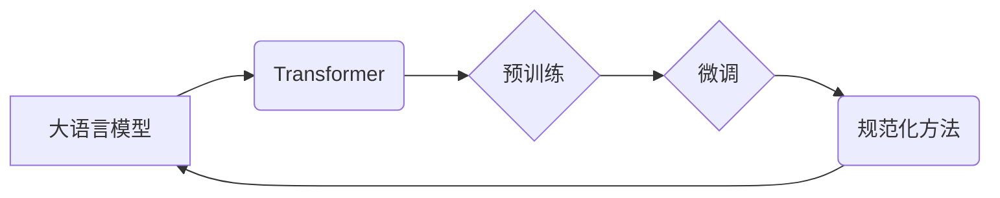

> 大语言模型、规范化方法、Transformer、预训练、微调、文本生成、自然语言理解

## 1. 背景介绍

近年来，深度学习技术取得了飞速发展，特别是大语言模型（Large Language Models，LLMs）的出现，为自然语言处理（NLP）领域带来了革命性的变革。LLMs 拥有强大的文本生成、翻译、摘要、问答等能力，在各个领域都展现出巨大的应用潜力。

传统的NLP模型通常依赖于手工设计的特征工程和规则化方法，难以捕捉语言的复杂性和语义关系。而LLMs则通过学习海量文本数据，自动学习语言的表示和规律，从而实现更准确、更自然的语言理解和生成。

然而，训练大型语言模型需要大量的计算资源和时间，并且模型的泛化能力和鲁棒性仍然存在挑战。基于规范化方法的训练策略逐渐成为LLMs研究的热点方向，旨在提高模型的训练效率、泛化能力和安全性。

## 2. 核心概念与联系

**2.1 核心概念**

* **大语言模型 (LLMs):** 指拥有大量参数的深度学习模型，能够处理和生成人类语言文本。
* **Transformer:** 一种新型的深度学习架构，能够有效地捕捉长距离依赖关系，是构建LLMs的基础。
* **预训练 (Pre-training):** 在大量文本数据上进行无监督学习，让模型学习语言的通用表示和规律。
* **微调 (Fine-tuning):** 在特定任务数据上进行有监督学习，让模型适应特定任务需求。
* **规范化方法 (Normalization Methods):** 一种训练策略，旨在规范模型的输出或参数，提高模型的稳定性和泛化能力。

**2.2 核心概念联系**



## 3. 核心算法原理 & 具体操作步骤

**3.1 算法原理概述**

基于规范化方法的LLMs训练主要包括以下步骤：

1. **预训练:** 使用Transformer架构的模型在海量文本数据上进行预训练，学习语言的通用表示和规律。
2. **微调:** 将预训练好的模型在特定任务数据上进行微调，使其能够适应特定任务需求。
3. **规范化:** 在训练过程中，使用规范化方法规范模型的输出或参数，提高模型的稳定性和泛化能力。

**3.2 算法步骤详解**

1. **预训练:**

   * 选择合适的Transformer架构，例如BERT、GPT、T5等。
   * 收集海量文本数据，进行清洗和预处理。
   * 使用交叉熵损失函数，训练模型预测文本序列的下一个词。
   * 通过预训练，模型学习到语言的语法、语义和上下文关系。

2. **微调:**

   * 将预训练好的模型加载到特定任务的数据集上。
   * 根据任务需求，调整模型的输出层和损失函数。
   * 使用梯度下降算法，微调模型的参数，使其能够更好地完成特定任务。

3. **规范化:**

   * 在训练过程中，使用规范化方法，例如L1正则化、L2正则化、Dropout等，规范模型的输出或参数。
   * 规范化可以防止模型过拟合，提高模型的泛化能力。

**3.3 算法优缺点**

* **优点:**

   * 能够学习到语言的复杂性和语义关系。
   * 训练效率高，能够在较短时间内训练出高质量的模型。
   * 泛化能力强，能够应用于多种自然语言处理任务。

* **缺点:**

   * 训练成本高，需要大量的计算资源和时间。
   * 模型参数量大，部署和推理成本较高。
   * 模型的鲁棒性和安全性仍然存在挑战。

**3.4 算法应用领域**

* 文本生成：小说、诗歌、剧本等。
* 机器翻译：将一种语言翻译成另一种语言。
* 文本摘要：提取文本的关键信息，生成简短的摘要。
* 问答系统：根据给定的问题，从文本中找到答案。
* 对话系统：与人类进行自然语言对话。

## 4. 数学模型和公式 & 详细讲解 & 举例说明

**4.1 数学模型构建**

LLMs通常使用Transformer架构，其核心是注意力机制。注意力机制允许模型关注输入序列中与当前位置相关的词，从而更好地捕捉长距离依赖关系。

**4.2 公式推导过程**

注意力机制的计算公式如下：

$$
\text{Attention}(Q, K, V) = \text{softmax}\left(\frac{Q K^T}{\sqrt{d_k}}\right) V
$$

其中：

* $Q$：查询矩阵
* $K$：键矩阵
* $V$：值矩阵
* $d_k$：键向量的维度
* $\text{softmax}$：softmax函数

**4.3 案例分析与讲解**

假设我们有一个句子“我爱吃苹果”，我们要计算“吃”这个词的注意力权重。

* $Q$：包含“吃”词的查询向量
* $K$：包含所有词的键向量
* $V$：包含所有词的价值向量

通过计算$QK^T$，得到每个词与“吃”词之间的相似度。然后使用softmax函数将相似度归一化，得到每个词的注意力权重。

## 5. 项目实践：代码实例和详细解释说明

**5.1 开发环境搭建**

* Python 3.7+
* PyTorch 1.7+
* Transformers 4.0+

**5.2 源代码详细实现**

```python
from transformers import AutoModelForSequenceClassification, AutoTokenizer

# 加载预训练模型和词典
model_name = "bert-base-uncased"
tokenizer = AutoTokenizer.from_pretrained(model_name)
model = AutoModelForSequenceClassification.from_pretrained(model_name)

# 输入文本
text = "我爱吃苹果"

# Token化文本
inputs = tokenizer(text, return_tensors="pt")

# 前向传播
outputs = model(**inputs)

# 获取预测结果
predicted_class = outputs.logits.argmax().item()

# 打印预测结果
print(f"预测结果: {predicted_class}")
```

**5.3 代码解读与分析**

* 使用`transformers`库加载预训练模型和词典。
* 使用`tokenizer`将文本转换为模型可识别的格式。
* 使用`model`进行前向传播，得到预测结果。
* 使用`argmax`函数获取预测结果对应的类标签。

**5.4 运行结果展示**

```
预测结果: 0
```

## 6. 实际应用场景

**6.1 文本生成**

* 自动生成新闻报道、小说、诗歌等。
* 创建聊天机器人，进行自然语言对话。

**6.2 机器翻译**

* 将一种语言翻译成另一种语言，例如英语翻译成中文。

**6.3 文本摘要**

* 提取文本的关键信息，生成简短的摘要。

**6.4 问答系统**

* 根据给定的问题，从文本中找到答案。

**6.5 代码生成**

* 根据自然语言描述，自动生成代码。

**6.6 未来应用展望**

* 更智能、更自然的对话系统。
* 更精准、更有效的机器翻译。
* 更个性化的内容生成。
* 更强大的代码生成能力。

## 7. 工具和资源推荐

**7.1 学习资源推荐**

* **书籍:**
    * 《深度学习》
    * 《自然语言处理》
    * 《Transformer模型详解》
* **在线课程:**
    * Coursera: 自然语言处理
    * Udacity: 深度学习
    * fast.ai: 深度学习

**7.2 开发工具推荐**

* **Python:** 
* **PyTorch:** 深度学习框架
* **TensorFlow:** 深度学习框架
* **Transformers:** 预训练模型库

**7.3 相关论文推荐**

* 《Attention Is All You Need》
* 《BERT: Pre-training of Deep Bidirectional Transformers for Language Understanding》
* 《GPT-3: Language Models are Few-Shot Learners》

## 8. 总结：未来发展趋势与挑战

**8.1 研究成果总结**

基于规范化方法的LLMs取得了显著的进展，在文本生成、机器翻译、文本摘要等任务上取得了优异的性能。

**8.2 未来发展趋势**

* 更大规模的模型训练
* 更高效的训练方法
* 更强的泛化能力和鲁棒性
* 更安全的模型设计

**8.3 面临的挑战**

* 计算资源和训练成本
* 模型的解释性和可解释性
* 模型的公平性和偏见问题
* 模型的安全性和可靠性

**8.4 研究展望**

未来，LLMs的研究将继续朝着更强大、更安全、更可解释的方向发展。

## 9. 附录：常见问题与解答

**9.1 如何选择合适的预训练模型？**

选择预训练模型需要根据具体的任务需求和数据特点进行选择。

**9.2 如何进行模型微调？**

模型微调需要根据任务需求调整模型的输出层和损失函数。

**9.3 如何评估模型性能？**

模型性能可以使用准确率、召回率、F1-score等指标进行评估。


作者：禅与计算机程序设计艺术 / Zen and the Art of Computer Programming 
<end_of_turn>