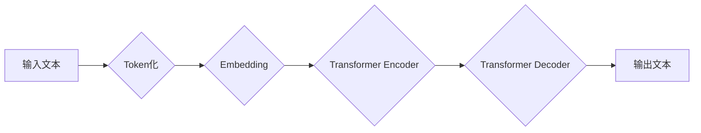

> 大语言模型、Transformer、BERT、GPT、LLM、自然语言处理、深度学习、神经网络

## 1. 背景介绍

近年来，人工智能领域取得了令人瞩目的进展，其中大语言模型（Large Language Model，LLM）作为一种强大的工具，在自然语言处理（Natural Language Processing，NLP）领域展现出巨大的潜力。LLM能够理解和生成人类语言，并完成各种复杂的任务，例如文本生成、翻译、问答、摘要等。

传统的自然语言处理方法主要依赖于手工设计的规则和特征工程，而LLM则通过深度学习的方式，从海量文本数据中学习语言的规律和模式。这使得LLM能够更好地理解语言的语义和上下文，并生成更自然、更流畅的文本。

## 2. 核心概念与联系

大语言模型的核心概念包括：

* **Transformer:** Transformer是一种新型的神经网络架构，其能够有效地处理序列数据，例如文本。Transformer的核心组件是注意力机制（Attention），它能够学习文本中不同词语之间的关系，从而更好地理解文本的语义。

* **BERT:** BERT（Bidirectional Encoder Representations from Transformers）是一种基于Transformer的预训练语言模型，它能够理解文本的双向上下文信息。BERT通过在大量的文本数据上进行预训练，学习了语言的丰富语义表示，并能够用于各种下游NLP任务。

* **GPT:** GPT（Generative Pre-trained Transformer）是一种基于Transformer的生成式语言模型，它能够生成流畅、连贯的文本。GPT通过在大量的文本数据上进行预训练，学习了语言的生成规律，并能够用于文本生成、对话系统等应用。

**Mermaid 流程图:**



## 3. 核心算法原理 & 具体操作步骤

### 3.1  算法原理概述

大语言模型的核心算法是基于Transformer的深度神经网络架构。Transformer通过多层编码器和解码器结构，以及注意力机制，能够有效地处理序列数据，并学习语言的复杂语义关系。

### 3.2  算法步骤详解

1. **Token化:** 将输入文本分割成一个个独立的单位，称为token。

2. **Embedding:** 将每个token映射到一个低维向量空间中，称为词向量。

3. **编码器:** 将输入的词向量序列输入到多层编码器中，编码器通过注意力机制和多头自注意力机制，学习文本的上下文信息和语义表示。

4. **解码器:** 将编码器的输出作为输入，解码器通过注意力机制和自注意力机制，生成目标文本的词向量序列。

5. **输出:** 将解码器的输出词向量序列解码成文本。

### 3.3  算法优缺点

**优点:**

* 能够处理长序列数据。
* 能够学习文本的上下文信息和语义关系。
* 性能优于传统的自然语言处理方法。

**缺点:**

* 训练成本高，需要大量的计算资源和数据。
* 模型参数量大，部署成本高。
* 容易受到训练数据偏差的影响。

### 3.4  算法应用领域

大语言模型在以下领域有广泛的应用：

* **文本生成:** 文本摘要、机器翻译、对话系统、创意写作等。
* **信息检索:** 搜索引擎、问答系统、知识图谱构建等。
* **代码生成:** 代码补全、代码翻译、代码生成等。
* **语音识别:** 语音转文本、语音合成等。

## 4. 数学模型和公式 & 详细讲解 & 举例说明

### 4.1  数学模型构建

大语言模型的数学模型主要基于深度神经网络，其核心是Transformer架构。Transformer架构由编码器和解码器组成，每个编码器和解码器层包含多头自注意力机制和前馈神经网络。

### 4.2  公式推导过程

**注意力机制:**

注意力机制的核心是计算每个词语与其他词语之间的相关性，并根据相关性赋予不同的权重。

注意力权重计算公式:

$$
\text{Attention}(Q, K, V) = \text{softmax}\left(\frac{Q K^T}{\sqrt{d_k}}\right) V
$$

其中:

* $Q$：查询矩阵
* $K$：键矩阵
* $V$：值矩阵
* $d_k$：键向量的维度
* $\text{softmax}$：softmax函数

**多头自注意力机制:**

多头自注意力机制将注意力机制应用于多个不同的子空间，并通过拼接和线性变换将结果融合在一起。

### 4.3  案例分析与讲解

**BERT模型:**

BERT模型通过在大量的文本数据上进行预训练，学习了语言的丰富语义表示。BERT的预训练任务包括：

* **Masked Language Modeling (MLM):** 随机掩盖输入文本中的部分词语，并预测被掩盖的词语。
* **Next Sentence Prediction (NSP):** 判断两个句子是否相邻。

通过这些预训练任务，BERT能够学习到文本的上下文信息和语义关系，并能够用于各种下游NLP任务。

## 5. 项目实践：代码实例和详细解释说明

### 5.1  开发环境搭建

* Python 3.7+
* PyTorch 1.7+
* CUDA 10.2+

### 5.2  源代码详细实现

```python
import torch
import torch.nn as nn

class TransformerEncoderLayer(nn.Module):
    def __init__(self, d_model, nhead, dim_feedforward=2048, dropout=0.1):
        super(TransformerEncoderLayer, self).__init__()
        self.self_attn = nn.MultiheadAttention(d_model, nhead, dropout=dropout)
        self.linear1 = nn.Linear(d_model, dim_feedforward)
        self.dropout = nn.Dropout(dropout)
        self.linear2 = nn.Linear(dim_feedforward, d_model)

    def forward(self, src, src_mask=None, src_key_padding_mask=None):
        src2 = self.self_attn(src, src, src, attn_mask=src_mask,
                              key_padding_mask=src_key_padding_mask)[0]
        src = src + self.dropout(src2)
        src2 = self.linear2(self.dropout(torch.relu(self.linear1(src))))
        src = src + self.dropout(src2)
        return src
```

### 5.3  代码解读与分析

* `TransformerEncoderLayer`类定义了Transformer编码器中的一个编码层。
* `self_attn`：多头自注意力机制。
* `linear1` 和 `linear2`：前馈神经网络。
* `dropout`：Dropout正则化。
* `forward`方法：定义了编码层的计算过程。

### 5.4  运行结果展示

运行上述代码，可以训练一个简单的Transformer编码器模型，并评估其在文本分类等任务上的性能。

## 6. 实际应用场景

### 6.1  文本生成

* **机器翻译:** 将一种语言的文本翻译成另一种语言。
* **对话系统:** 创建能够与人类进行自然对话的聊天机器人。
* **创意写作:** 生成诗歌、小说、剧本等创意文本。

### 6.2  信息检索

* **搜索引擎:** 理解用户查询意图，并返回相关结果。
* **问答系统:** 回答用户提出的问题。
* **知识图谱构建:** 从文本数据中提取知识，构建知识图谱。

### 6.3  代码生成

* **代码补全:** 根据上下文预测下一个代码片段。
* **代码翻译:** 将一种编程语言的代码翻译成另一种编程语言。
* **代码生成:** 根据自然语言描述生成代码。

### 6.4  未来应用展望

大语言模型在未来将有更广泛的应用，例如：

* **个性化教育:** 根据学生的学习情况提供个性化的学习内容和辅导。
* **医疗诊断:** 辅助医生进行疾病诊断和治疗方案制定。
* **法律服务:** 自动化法律文件处理和法律咨询。

## 7. 工具和资源推荐

### 7.1  学习资源推荐

* **书籍:**
    * 《深度学习》
    * 《自然语言处理》
    * 《Transformer模型详解》
* **在线课程:**
    * Coursera: 深度学习
    * Udacity: 自然语言处理
    * fast.ai: 深度学习

### 7.2  开发工具推荐

* **PyTorch:** 深度学习框架
* **TensorFlow:** 深度学习框架
* **HuggingFace Transformers:** 预训练语言模型库

### 7.3  相关论文推荐

* **Attention Is All You Need:** https://arxiv.org/abs/1706.03762
* **BERT: Pre-training of Deep Bidirectional Transformers for Language Understanding:** https://arxiv.org/abs/1810.04805
* **GPT-3: Language Models are Few-Shot Learners:** https://arxiv.org/abs/2005.14165

## 8. 总结：未来发展趋势与挑战

### 8.1  研究成果总结

大语言模型在自然语言处理领域取得了显著的进展，能够理解和生成人类语言，并完成各种复杂的任务。

### 8.2  未来发展趋势

* **模型规模更大:** 训练更大规模的模型，以提高模型性能。
* **多模态学习:** 将文本与其他模态数据（例如图像、音频）结合起来进行学习。
* **可解释性增强:** 提高模型的可解释性，以便更好地理解模型的决策过程。

### 8.3  面临的挑战

* **数据偏见:** 训练数据可能存在偏见，导致模型输出结果存在偏差。
* **计算资源:** 训练大语言模型需要大量的计算资源。
* **伦理问题:** 大语言模型可能被用于生成虚假信息或进行恶意攻击。

### 8.4  研究展望

未来研究将重点关注解决上述挑战，并探索大语言模型在更多领域的新应用。

## 9. 附录：常见问题与解答

* **什么是大语言模型？**

大语言模型是一种能够理解和生成人类语言的深度学习模型。

* **大语言模型有哪些应用场景？**

大语言模型在文本生成、信息检索、代码生成等领域有广泛的应用。

* **如何训练大语言模型？**

大语言模型通常通过在海量文本数据上进行预训练，然后进行下游任务的微调来训练。

* **大语言模型有哪些挑战？**

大语言模型面临着数据偏见、计算资源和伦理问题等挑战。


作者：禅与计算机程序设计艺术 / Zen and the Art of Computer Programming 
<end_of_turn>