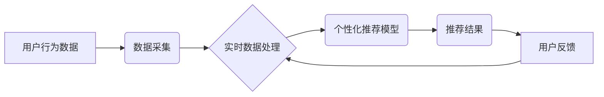

> 实时数据处理，个性化推荐，机器学习，数据流，实时分析，推荐系统

## 1. 背景介绍

在当今数据爆炸的时代，个性化推荐已成为各大互联网平台的核心竞争力。从电商平台的商品推荐到视频网站的影视内容推荐，从社交媒体的个性化内容推送到音乐平台的歌曲推荐，个性化推荐技术无处不在，为用户提供更加精准、高效、便捷的体验。

传统的个性化推荐系统通常依赖于离线数据处理，将历史用户行为数据进行挖掘和分析，构建用户画像和推荐模型。然而，随着用户行为的日益复杂和实时性增强，传统的离线处理方式已难以满足个性化推荐的需求。实时数据处理技术应运而生，为个性化推荐提供了新的思路和可能性。

实时数据处理是指对数据流进行实时分析和处理，及时获取数据洞察和做出决策。它能够捕捉用户行为的瞬时变化，并根据实时反馈进行动态调整，从而实现更加精准、个性化的推荐。

## 2. 核心概念与联系

**2.1 核心概念**

* **个性化推荐:** 根据用户的兴趣、偏好、行为等信息，为用户提供个性化的商品、内容或服务推荐。
* **实时数据处理:** 对数据流进行实时分析和处理，及时获取数据洞察和做出决策。
* **数据流:** 一种连续不断的数据流，例如用户点击、浏览、购买等行为数据。
* **机器学习:** 一种人工智能技术，通过算法学习数据中的模式和规律，进行预测和决策。

**2.2 架构关系**



**2.3 核心联系**

实时数据处理技术为个性化推荐提供了实时性、动态性和精准性的保障。通过实时采集和分析用户行为数据，个性化推荐系统能够及时捕捉用户兴趣变化，动态调整推荐策略，从而提供更加精准、个性化的推荐结果。

## 3. 核心算法原理 & 具体操作步骤

**3.1 算法原理概述**

实时数据处理在个性化推荐中的核心算法主要包括以下几种：

* **基于内容的协同过滤:** 根据用户历史行为数据，分析用户喜欢的商品或内容的共同特征，推荐与用户兴趣相似的商品或内容。
* **基于用户的协同过滤:** 根据用户之间的相似度，推荐与相似用户喜欢的商品或内容。
* **混合推荐:** 将基于内容的协同过滤和基于用户的协同过滤相结合，提高推荐的准确性和个性化程度。
* **深度学习推荐:** 利用深度学习算法，从海量用户行为数据中学习更复杂的特征和模式，实现更精准的推荐。

**3.2 算法步骤详解**

以基于内容的协同过滤为例，其具体操作步骤如下：

1. **数据预处理:** 对用户行为数据进行清洗、转换和特征提取，例如将商品信息转换为关键词向量。
2. **相似度计算:** 计算用户之间或商品之间的相似度，例如使用余弦相似度或皮尔逊相关系数。
3. **推荐生成:** 根据用户与商品的相似度，推荐与用户兴趣相似的商品。

**3.3 算法优缺点**

* **优点:** 能够捕捉用户兴趣变化，提供更加精准的推荐。
* **缺点:** 需要大量的历史数据进行训练，对冷启动问题较为敏感。

**3.4 算法应用领域**

实时数据处理在个性化推荐中的应用领域非常广泛，例如：

* **电商平台:** 商品推荐、用户画像分析、营销活动优化。
* **视频网站:** 视频推荐、用户行为分析、内容创作指导。
* **社交媒体:** 内容推荐、用户兴趣分析、广告投放优化。
* **音乐平台:** 歌曲推荐、用户音乐偏好分析、音乐创作指导。

## 4. 数学模型和公式 & 详细讲解 & 举例说明

**4.1 数学模型构建**

假设我们有一个用户-商品交互矩阵 $R$，其中 $R_{ui}$ 表示用户 $u$ 对商品 $i$ 的评分。我们的目标是预测用户 $u$ 对商品 $i$ 的评分。

我们可以使用协同过滤算法构建一个数学模型，例如基于内容的协同过滤模型：

$$
\hat{R}_{ui} = \mathbf{u}^T \mathbf{v}_i + b_u + b_i
$$

其中：

* $\hat{R}_{ui}$ 是预测的用户 $u$ 对商品 $i$ 的评分。
* $\mathbf{u}$ 是用户 $u$ 的特征向量。
* $\mathbf{v}_i$ 是商品 $i$ 的特征向量。
* $b_u$ 是用户 $u$ 的偏差项。
* $b_i$ 是商品 $i$ 的偏差项。

**4.2 公式推导过程**

该公式的推导过程基于矩阵分解和最小二乘法。

**4.3 案例分析与讲解**

假设我们有一个用户-商品交互矩阵 $R$，其中包含用户对电影的评分数据。我们可以使用协同过滤算法对该矩阵进行分解，得到用户特征向量和电影特征向量。然后，我们可以使用这些特征向量来预测用户对未观看的电影的评分。

## 5. 项目实践：代码实例和详细解释说明

**5.1 开发环境搭建**

* 操作系统: Ubuntu 20.04
* 编程语言: Python 3.8
* 框架: TensorFlow 2.0
* 库: Pandas, NumPy, Scikit-learn

**5.2 源代码详细实现**

```python
import pandas as pd
from sklearn.model_selection import train_test_split
from tensorflow.keras.layers import Embedding, Dense
from tensorflow.keras.models import Sequential

# 加载用户-商品交互数据
data = pd.read_csv('ratings.csv')

# 数据预处理
user_ids = data['user_id'].unique()
item_ids = data['item_id'].unique()
ratings = data['rating'].values

# 将用户和商品ID转换为整数索引
user_to_idx = {user_id: idx for idx, user_id in enumerate(user_ids)}
item_to_idx = {item_id: idx for idx, item_id in enumerate(item_ids)}

# 将数据转换为训练集和测试集
train_data, test_data = train_test_split(data, test_size=0.2)

# 构建推荐模型
model = Sequential()
model.add(Embedding(len(user_ids), 64))
model.add(Embedding(len(item_ids), 64))
model.add(Dense(1))

model.compile(loss='mse', optimizer='adam')

# 训练模型
model.fit(train_data, epochs=10)

# 预测用户对商品的评分
predictions = model.predict(test_data)

# 评估模型性能
# ...
```

**5.3 代码解读与分析**

该代码示例展示了如何使用深度学习算法构建一个个性化推荐模型。

* 首先，我们加载用户-商品交互数据，并进行数据预处理，将用户和商品ID转换为整数索引。
* 然后，我们使用 TensorFlow 构建一个深度学习模型，包含 Embedding 层和 Dense 层。
* 接着，我们使用训练集训练模型，并使用测试集评估模型性能。

**5.4 运行结果展示**

运行结果展示了模型的预测评分和实际评分之间的差异，可以用来评估模型的准确性。

## 6. 实际应用场景

**6.1 电商平台**

* **商品推荐:** 根据用户的浏览历史、购买记录和评分等信息，推荐与用户兴趣相似的商品。
* **用户画像分析:** 分析用户的购买行为、浏览习惯和评价内容，构建用户画像，以便进行精准营销和个性化服务。
* **营销活动优化:** 根据用户的兴趣和偏好，推荐合适的营销活动，提高营销效果。

**6.2 视频网站**

* **视频推荐:** 根据用户的观看历史、点赞记录和评论内容等信息，推荐与用户兴趣相似的视频。
* **用户行为分析:** 分析用户的观看时长、跳出率和评论内容等信息，了解用户的观看习惯和偏好。
* **内容创作指导:** 根据用户的观看数据，为内容创作者提供创作方向和建议。

**6.3 其他应用场景**

* **社交媒体:** 内容推荐、用户兴趣分析、广告投放优化。
* **音乐平台:** 歌曲推荐、用户音乐偏好分析、音乐创作指导。
* **新闻平台:** 新闻推荐、用户兴趣分析、个性化新闻订阅。

**6.4 未来应用展望**

随着实时数据处理技术的不断发展，个性化推荐将更加精准、智能和个性化。未来，个性化推荐将更加注重用户体验，提供更加个性化的内容和服务，例如：

* **多模态推荐:** 基于文本、图像、音频等多模态数据进行推荐。
* **实时互动推荐:** 根据用户的实时反馈进行动态调整，提供更加个性化的推荐。
* **个性化内容生成:** 基于用户的兴趣和偏好，生成个性化的内容，例如新闻、文章、视频等。

## 7. 工具和资源推荐

**7.1 学习资源推荐**

* **书籍:**
    * 《推荐系统实践》
    * 《机器学习》
    * 《深度学习》
* **在线课程:**
    * Coursera: Recommender Systems
    * Udacity: Machine Learning Engineer Nanodegree
* **博客和网站:**
    * Towards Data Science
    * Machine Learning Mastery

**7.2 开发工具推荐**

* **编程语言:** Python
* **框架:** TensorFlow, PyTorch
* **库:** Pandas, NumPy, Scikit-learn

**7.3 相关论文推荐**

* **协同过滤:**
    * "Collaborative Filtering for Implicit Feedback Datasets"
    * "Matrix Factorization Techniques for Recommender Systems"
* **深度学习推荐:**
    * "Deep Learning for Recommender Systems"
    * "Neural Collaborative Filtering"

## 8. 总结：未来发展趋势与挑战

**8.1 研究成果总结**

实时数据处理技术为个性化推荐提供了新的思路和可能性，使得推荐更加精准、动态和个性化。深度学习算法在个性化推荐领域取得了显著的成果，能够学习更复杂的特征和模式，提高推荐的准确性和个性化程度。

**8.2 未来发展趋势**

* **多模态推荐:** 基于文本、图像、音频等多模态数据进行推荐。
* **实时互动推荐:** 根据用户的实时反馈进行动态调整，提供更加个性化的推荐。
* **个性化内容生成:** 基于用户的兴趣和偏好，生成个性化的内容，例如新闻、文章、视频等。

**8.3 面临的挑战**

* **数据稀疏性:** 用户-商品交互数据往往是稀疏的，难以训练有效的推荐模型。
* **冷启动问题:** 新用户和新商品难以获得推荐，需要新的算法和策略来解决。
* **隐私保护:** 个性化推荐需要收集和分析用户的个人信息，需要采取有效的措施保护用户的隐私。

**8.4 研究展望**

未来，个性化推荐将更加注重用户体验，提供更加个性化的内容和服务。研究者将继续探索新的算法和技术，解决个性化推荐面临的挑战，为用户提供更加精准、智能和个性化的体验。

## 9. 附录：常见问题与解答

**9.1 Q: 如何解决数据稀疏性问题？**

**A:** 可以使用以下方法解决数据稀疏性问题：

* **协同过滤:** 利用用户之间的相似度或商品之间的相似度，填充缺失的数据。
* **矩阵分解:** 将用户-商品交互矩阵分解成用户特征向量和商品特征向量，从而填充缺失的数据。
* **深度学习:** 使用深度学习算法，学习更复杂的特征和模式，提高推荐的准确性。

**9.2 Q: 如何解决冷启动问题？**

**A:** 可以使用以下方法解决冷启动问题：

* **基于