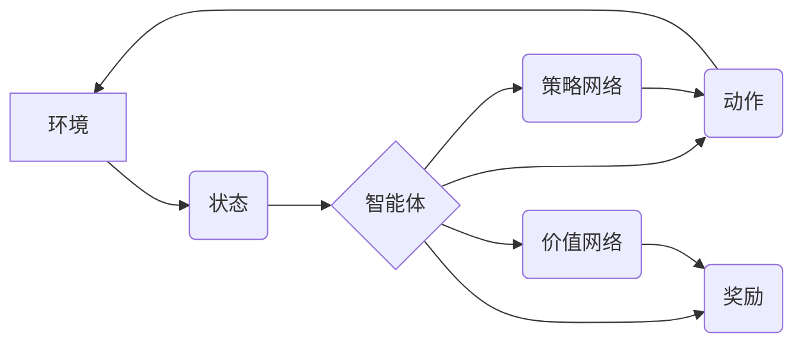

> 强化学习，Actor-Critic，深度强化学习，策略梯度，价值函数，代码实例

## 1. 背景介绍

强化学习 (Reinforcement Learning, RL) 作为机器学习领域的重要分支，近年来取得了显著进展，并在机器人控制、游戏 AI、推荐系统等领域展现出强大的应用潜力。强化学习的核心思想是通过智能体与环境的交互，学习最优的策略，以最大化累积的奖励。

Actor-Critic 算法是强化学习中的一种重要策略梯度算法，它结合了策略网络 (Actor) 和价值网络 (Critic) 的优势，能够有效地学习策略并提高收敛速度。

## 2. 核心概念与联系

**2.1 核心概念**

* **智能体 (Agent):**  与环境交互并采取行动的实体。
* **环境 (Environment):** 智能体所处的外部世界，会根据智能体的行动产生相应的状态变化和奖励信号。
* **状态 (State):** 环境的当前描述，例如游戏中的棋盘状态或机器人位置。
* **动作 (Action):** 智能体在特定状态下可以采取的行动，例如在游戏中移动棋子或机器人改变方向。
* **奖励 (Reward):** 环境对智能体采取的行动给予的反馈，可以是正向奖励或负向惩罚。
* **策略 (Policy):**  智能体在不同状态下选择动作的概率分布。
* **价值函数 (Value Function):**  评估状态或状态-动作对的长期价值，即智能体从该状态开始采取最优策略所能获得的累积奖励。

**2.2 Actor-Critic 架构**

Actor-Critic 算法的核心是将策略网络 (Actor) 和价值网络 (Critic) 结合起来。

* **策略网络 (Actor):**  根据当前状态预测智能体应该采取的动作，并输出动作的概率分布。
* **价值网络 (Critic):**  根据当前状态预测智能体所能获得的长期奖励，即状态的价值。

Actor-Critic 算法通过策略梯度和价值函数的反馈来更新策略网络和价值网络的参数，从而学习最优策略。



## 3. 核心算法原理 & 具体操作步骤

**3.1 算法原理概述**

Actor-Critic 算法的核心思想是利用策略梯度和价值函数的反馈来更新策略网络和价值网络的参数。

* **策略梯度:**  策略梯度用于更新策略网络，使其朝着能够获得更高奖励的方向进行调整。
* **价值函数:**  价值函数用于评估状态或状态-动作对的长期价值，并提供策略网络更新的反馈信号。

**3.2 算法步骤详解**

1. **初始化:** 初始化策略网络和价值网络的参数。
2. **环境交互:** 智能体与环境交互，观察当前状态并采取动作。
3. **奖励获取:** 环境根据智能体的动作产生奖励信号。
4. **价值函数更新:** 使用价值网络估计当前状态的价值，并根据实际奖励和估计价值进行更新。
5. **策略网络更新:** 使用策略梯度更新策略网络的参数，使其朝着能够获得更高奖励的方向进行调整。
6. **重复步骤 2-5:**  重复上述步骤，直到策略网络收敛或达到预设的训练目标。

**3.3 算法优缺点**

**优点:**

* **收敛速度快:**  Actor-Critic 算法能够利用价值函数的反馈，加速策略网络的收敛。
* **能够处理连续动作空间:**  Actor-Critic 算法可以应用于连续动作空间的问题，例如机器人控制。
* **相对稳定:**  Actor-Critic 算法在训练过程中相对稳定，不易出现震荡或发散。

**缺点:**

* **参数更新复杂:**  Actor-Critic 算法需要同时更新策略网络和价值网络的参数，参数更新过程相对复杂。
* **容易陷入局部最优:**  Actor-Critic 算法也可能陷入局部最优，需要使用一些技巧来避免这种情况。

**3.4 算法应用领域**

Actor-Critic 算法在以下领域具有广泛的应用:

* **机器人控制:**  控制机器人运动、抓取物体等任务。
* **游戏 AI:**  训练游戏 AI 策略，例如围棋、Go 等。
* **推荐系统:**  根据用户的历史行为推荐物品或服务。
* **金融交易:**  开发自动交易策略，进行股票、期货等金融资产的交易。

## 4. 数学模型和公式 & 详细讲解 & 举例说明

**4.1 数学模型构建**

* **状态空间:**  S = {s1, s2, ..., sn}
* **动作空间:**  A = {a1, a2, ..., am}
* **策略网络:**  π(a|s; θ)
* **价值网络:**  V(s; φ)

其中:

* θ: 策略网络的参数
* φ: 价值网络的参数
* π(a|s; θ):  在状态 s 下采取动作 a 的概率
* V(s; φ):  在状态 s 下的价值

**4.2 公式推导过程**

* **策略梯度:**

$$
\nabla_{\theta} J(\theta) = \mathbb{E}_{\tau \sim \pi_{\theta}} \left[ \nabla_{\theta} \log \pi_{\theta}(a_t|s_t) \cdot Q(s_t, a_t) \right]
$$

其中:

* J(θ):  策略网络的参数 θ 的目标函数，即累积奖励
* τ:  一个轨迹，由一系列状态和动作组成
* Q(s_t, a_t):  状态 s_t 和动作 a_t 的 Q 值，即状态-动作对的预期累积奖励

* **价值网络更新:**

$$
\phi = \phi - \alpha \nabla_{\phi} \left[ V(s_t; \phi) - R_{t+1} + \gamma V(s_{t+1}; \phi) \right]
$$

其中:

* α:  学习率
* R_{t+1}:  从状态 s_t 到状态 s_{t+1} 的奖励

**4.3 案例分析与讲解**

假设我们有一个简单的强化学习环境，智能体需要在一条直线上移动，目标是到达终点。

* 状态空间:  S = {0, 1, 2, ..., 10}，表示智能体在直线上的位置。
* 动作空间:  A = {-1, 0, 1}，表示智能体向左、不动或向右移动。
* 奖励函数:  当智能体到达终点时，奖励为 100，否则奖励为 0。

在 Actor-Critic 算法中，策略网络会学习在每个位置采取哪个动作，以最大化累积奖励。价值网络则会学习每个位置的价值，并提供策略网络更新的反馈信号。

## 5. 项目实践：代码实例和详细解释说明

**5.1 开发环境搭建**

* Python 3.6+
* TensorFlow 或 PyTorch

**5.2 源代码详细实现**

```python
import tensorflow as tf

# 定义策略网络
class Actor(tf.keras.Model):
    def __init__(self, state_dim, action_dim):
        super(Actor, self).__init__()
        self.dense1 = tf.keras.layers.Dense(64, activation='relu')
        self.dense2 = tf.keras.layers.Dense(action_dim, activation='softmax')

    def call(self, state):
        x = self.dense1(state)
        return self.dense2(x)

# 定义价值网络
class Critic(tf.keras.Model):
    def __init__(self, state_dim):
        super(Critic, self).__init__()
        self.dense1 = tf.keras.layers.Dense(64, activation='relu')
        self.dense2 = tf.keras.layers.Dense(1)

    def call(self, state):
        x = self.dense1(state)
        return self.dense2(x)

# 实例化 Actor 和 Critic 网络
actor = Actor(state_dim=10, action_dim=3)
critic = Critic(state_dim=10)

# ... 训练代码 ...
```

**5.3 代码解读与分析**

* 策略网络 Actor 使用 softmax 函数输出动作概率分布，使得动作选择符合概率性。
* 价值网络 Critic 使用单层神经网络估计状态的价值。
* 训练代码中需要定义奖励函数、环境交互逻辑以及策略梯度和价值网络更新规则。

**5.4 运行结果展示**

训练完成后，可以观察智能体在环境中执行的动作，以及其累积奖励的变化趋势。

## 6. 实际应用场景

**6.1 游戏 AI**

Actor-Critic 算法在游戏 AI 中应用广泛，例如 AlphaGo、AlphaStar 等。

**6.2 机器人控制**

Actor-Critic 算法可以用于控制机器人运动、抓取物体等任务。

**6.3 推荐系统**

Actor-Critic 算法可以用于个性化推荐，根据用户的历史行为推荐物品或服务。

**6.4 其他应用场景**

* 自动驾驶
* 金融交易
* 生物医学

**6.5 未来应用展望**

随着强化学习技术的不断发展，Actor-Critic 算法将在更多领域得到应用，例如：

* 更复杂的环境和任务
* 更高效的训练算法
* 更强大的计算能力

## 7. 工具和资源推荐

**7.1 学习资源推荐**

* **书籍:**
    * Reinforcement Learning: An Introduction by Richard S. Sutton and Andrew G. Barto
    * Deep Reinforcement Learning Hands-On by Maxim Lapan
* **在线课程:**
    * Deep Reinforcement Learning Specialization by DeepLearning.AI
    * Reinforcement Learning by David Silver (University of DeepMind)

**7.2 开发工具推荐**

* **TensorFlow:**  开源深度学习框架
* **PyTorch:**  开源深度学习框架
* **OpenAI Gym:**  强化学习环境库

**7.3 相关论文推荐**

* **Actor-Critic Algorithms** by Richard S. Sutton and Andrew G. Barto
* **Asynchronous Methods for Deep Reinforcement Learning** by Mnih et al.
* **Proximal Policy Optimization Algorithms** by Schulman et al.

## 8. 总结：未来发展趋势与挑战

**8.1 研究成果总结**

Actor-Critic 算法在强化学习领域取得了显著进展，并成功应用于多个领域。

**8.2 未来发展趋势**

* **更强大的计算能力:**  随着计算能力的提升，可以训练更复杂、更强大的强化学习模型。
* **更有效的训练算法:**  研究更有效的训练算法，例如分布式训练、迁移学习等，可以加速强化学习模型的训练过程。
* **更灵活的模型架构:**  探索更灵活的模型架构，例如 Transformer、Graph Neural Networks 等，可以更好地处理复杂的环境和任务。

**8.3 面临的挑战**

* **样本效率:**  强化学习算法通常需要大量的样本数据进行训练，这在现实世界中可能难以实现。
* **安全性和可靠性:**  强化学习模型在现实世界中的应用需要保证其安全性和可靠性，这仍然是一个重要的挑战。
* **可解释性:**  强化学习模型的决策过程通常难以解释，这限制了其在一些领域中的应用。

**8.4 研究展望**

未来强化学习研究将继续探索以下方向:

* **提高样本效率:**  研究更有效的样本利用方法，例如强化学习与监督学习的结合。
* **增强安全性和可靠性:**  开发更安全的强化学习算法，并设计有效的安全机制。
* **提升可解释性:**  研究强化学习模型的决策过程，使其更易于理解和解释。