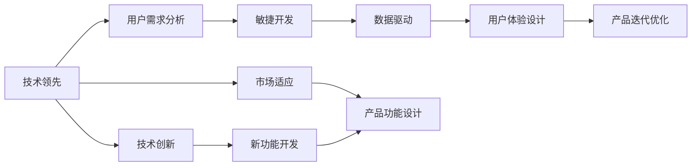

                 

# 技术领先与市场适应：Lepton AI的产品策略

> 关键词：AI产品策略, 技术领先, 市场适应, 产品开发流程, 用户需求分析, 数据驱动, 敏捷开发, 用户体验设计

## 1. 背景介绍

### 1.1 问题由来
近年来，人工智能(AI)技术迅猛发展，尤其在医疗、金融、制造、教育等多个领域中展现出了巨大的应用潜力。然而，AI技术要真正落地，实现大规模商业化应用，不仅需要强大的技术实力，还需准确把握市场动态和用户需求，制定合理的产品策略，确保产品在技术先进性和市场适应性之间找到最佳平衡。Lepton AI，作为AI领域的创新企业，始终将技术领先与市场适应作为核心产品策略，致力于在AI技术与市场需求之间架起桥梁。

### 1.2 问题核心关键点
1. **技术领先**：Lepton AI通过不断研发和引入前沿AI技术，如深度学习、自然语言处理、计算机视觉等，确保在技术上始终处于行业前沿。
2. **市场适应**：通过深度了解目标市场和用户需求，定制化解决方案，确保产品能够快速响应市场变化，满足用户痛点。
3. **产品开发流程**：建立规范的产品开发流程，包括需求收集、原型设计、技术实现、测试优化等步骤，确保产品从概念到上市的高效、高质。
4. **用户体验设计**：注重产品界面和功能的易用性，提供无缝的用户体验，提升用户满意度和忠诚度。
5. **数据驱动**：以数据为决策依据，不断优化产品功能和性能，确保产品能够持续适应市场需求变化。

### 1.3 问题研究意义
制定科学合理的产品策略，对于AI企业的长期发展和市场竞争力具有重要意义：
1. **提升产品竞争力**：通过精准定位市场需求和用户痛点，确保产品能够高效解决实际问题，提升市场竞争力。
2. **优化资源配置**：合理分配资源，集中力量突破关键技术，提升整体技术实力。
3. **快速响应市场变化**：构建灵活的产品开发流程，快速迭代产品，确保市场适应性。
4. **增强用户体验**：注重用户体验设计，提升产品吸引力和用户满意度，增强品牌影响力。
5. **推动创新发展**：以技术创新为核心，不断引入前沿技术，驱动行业持续进步。

## 2. 核心概念与联系

### 2.1 核心概念概述

Lepton AI的产品策略，建立在几个核心概念之上：

- **技术领先**：通过持续的技术创新，确保产品具备先进的AI技术支持，保持行业领先地位。
- **市场适应**：以市场和用户需求为导向，设计满足实际应用需求的产品功能。
- **用户需求分析**：通过市场调研和用户反馈，全面了解用户需求，制定科学的产品规划。
- **敏捷开发**：采用快速迭代和灵活调整的方法，提升产品开发效率和市场响应速度。
- **数据驱动**：利用数据收集和分析，指导产品优化和改进，确保产品能够持续满足市场需求。
- **用户体验设计**：通过精心设计的用户界面和功能，提升用户使用体验，增强用户粘性。

这些核心概念相互联系，共同构成了Lepton AI产品策略的基础框架。

### 2.2 核心概念原理和架构的 Mermaid 流程图



这个流程图展示了Lepton AI产品策略的逻辑流程：

1. **技术领先**：通过技术创新确保产品具备领先技术。
2. **市场适应**：以市场和用户需求为导向设计产品功能。
3. **用户需求分析**：通过调研和反馈了解用户需求。
4. **敏捷开发**：快速迭代和灵活调整，提升效率。
5. **数据驱动**：利用数据指导产品优化。
6. **用户体验设计**：提升用户体验，增强用户粘性。
7. **产品功能设计**：结合市场适应和用户需求，设计功能。
8. **产品迭代优化**：基于用户反馈不断优化产品。
9. **技术创新**：持续引入新功能。

## 3. 核心算法原理 & 具体操作步骤
### 3.1 算法原理概述

Lepton AI的产品策略，核心在于平衡技术领先与市场适应，通过科学的产品开发流程和技术手段，确保产品能够在满足市场需求的同时，保持技术先进性。具体而言，包括以下几个关键步骤：

1. **需求收集**：通过市场调研、用户访谈等方式，全面了解市场需求和用户痛点。
2. **功能设计**：结合技术能力和市场需求，设计核心功能和技术方案。
3. **原型设计**：创建产品原型，验证功能可行性和用户接受度。
4. **技术实现**：开发和实现产品功能，引入前沿AI技术。
5. **测试优化**：进行系统测试和用户测试，优化产品性能和用户体验。
6. **市场适应**：根据市场反馈，不断调整和优化产品功能，确保市场适应性。

### 3.2 算法步骤详解

1. **需求收集**：
   - **市场调研**：通过问卷调查、访谈等形式，收集潜在用户的需求和期望。
   - **竞品分析**：分析同类产品的优缺点，找出市场缺口和改进点。
   - **专家咨询**：邀请行业专家提供专业意见，确保需求分析的科学性和准确性。

2. **功能设计**：
   - **技术可行性分析**：评估功能设计的技术实现难度和可行性。
   - **用户体验设计**：设计易用、美观的界面和交互逻辑。
   - **需求优先级排序**：根据市场需求和用户痛点，确定功能的优先级。

3. **原型设计**：
   - **界面设计**：设计简洁直观的用户界面，确保用户易用。
   - **功能原型**：创建功能原型，验证核心功能的实现和用户体验。
   - **用户测试**：邀请目标用户测试原型，收集反馈意见。

4. **技术实现**：
   - **技术选型**：选择适合的技术方案和工具。
   - **代码开发**：实现产品功能和算法模型。
   - **性能优化**：确保产品的稳定性和高效性。

5. **测试优化**：
   - **系统测试**：进行功能、性能和安全等全面测试。
   - **用户测试**：邀请目标用户测试产品，收集使用反馈。
   - **持续优化**：根据测试结果和用户反馈，不断优化产品功能和性能。

6. **市场适应**：
   - **市场反馈**：收集市场反馈和用户意见。
   - **功能调整**：根据市场反馈调整产品功能。
   - **迭代发布**：持续迭代和发布新产品版本，保持市场竞争力。

### 3.3 算法优缺点

**优点**：
1. **技术领先**：通过引入前沿AI技术，确保产品具备行业领先的性能和功能。
2. **市场适应**：以用户需求为导向，确保产品能够快速响应市场变化，满足实际应用需求。
3. **敏捷开发**：快速迭代和灵活调整，提升产品开发效率和市场响应速度。
4. **用户体验设计**：注重用户界面和功能的易用性，提升用户满意度和忠诚度。
5. **数据驱动**：利用数据指导产品优化和改进，确保产品能够持续满足市场需求。

**缺点**：
1. **资源投入大**：技术领先和市场适应需要大量资源投入，尤其是技术研发和市场调研。
2. **市场风险**：快速迭代可能导致产品不够稳定，市场适应性不足。
3. **用户需求变化**：用户需求和市场环境不断变化，产品需要持续优化和调整。

### 3.4 算法应用领域

Lepton AI的产品策略，已经在多个AI应用领域得到了广泛应用，例如：

1. **医疗健康**：开发智能诊断系统，利用深度学习和计算机视觉技术，提升疾病诊断准确性。
2. **金融科技**：构建智能风控模型，通过自然语言处理和数据分析，防范金融风险。
3. **智能制造**：实现智能生产调度，利用机器学习和优化算法，提升生产效率。
4. **教育科技**：开发智能教育平台，通过自然语言理解和推荐系统，个性化推荐学习资源。
5. **智慧城市**：构建城市管理平台，利用数据驱动和人工智能技术，优化城市治理和公共服务。

此外，Lepton AI还不断探索AI技术在更多新兴领域的应用，如智能家居、自动驾驶等，为社会各行业数字化转型提供新动力。

## 4. 数学模型和公式 & 详细讲解 & 举例说明

### 4.1 数学模型构建

Lepton AI在产品开发中，广泛应用数学模型来指导产品功能和性能的优化。例如，在智能诊断系统中，利用机器学习算法构建疾病预测模型，通过历史病历数据进行训练，预测新患者的疾病概率。具体数学模型如下：

**疾病预测模型**：
设 $X$ 为患者历史病历数据，$Y$ 为疾病标签，模型目标为 $P(Y|X)$。

使用逻辑回归模型进行疾病预测：
$$
P(Y|X) = \frac{e^{w^T \phi(X)}}{1 + e^{w^T \phi(X)}}
$$
其中 $w$ 为模型参数，$\phi(X)$ 为特征映射函数。

### 4.2 公式推导过程

以疾病预测模型为例，推导逻辑回归的公式及其梯度计算：

**逻辑回归公式**：
$$
P(Y|X) = \frac{e^{w^T \phi(X)}}{1 + e^{w^T \phi(X)}}
$$

**对 $w$ 的梯度计算**：
$$
\frac{\partial P(Y|X)}{\partial w} = \frac{\partial}{\partial w} \frac{e^{w^T \phi(X)}}{1 + e^{w^T \phi(X)}} \cdot \frac{\partial}{\partial w} Y
$$

### 4.3 案例分析与讲解

以智能诊断系统为例，使用历史病历数据训练逻辑回归模型，进行疾病预测：

1. **数据准备**：收集并标注大量的历史病历数据。
2. **特征工程**：提取重要的病历特征，如症状、病史、实验室检查结果等。
3. **模型训练**：使用逻辑回归模型进行训练，优化参数 $w$。
4. **模型评估**：在验证集上评估模型性能，使用准确率、召回率等指标衡量模型效果。
5. **模型应用**：将训练好的模型应用到新患者的病历数据，预测其疾病概率。

## 5. 项目实践：代码实例和详细解释说明

### 5.1 开发环境搭建

Lepton AI在产品开发中，广泛使用Python和PyTorch进行数据分析和模型训练。以下是开发环境的搭建步骤：

1. **安装Python和Anaconda**：从官网下载并安装Python和Anaconda，创建虚拟环境。
2. **安装PyTorch和相关库**：使用pip安装PyTorch及相关机器学习库，如TensorFlow、Scikit-learn等。
3. **数据准备**：收集并标注历史病历数据，进行数据清洗和预处理。
4. **模型训练**：使用PyTorch编写代码，进行模型训练和优化。
5. **模型评估**：在验证集上评估模型性能，收集关键指标。

### 5.2 源代码详细实现

以智能诊断系统的疾病预测模型为例，展示PyTorch代码实现：

```python
import torch
import torch.nn as nn
import torch.optim as optim
from sklearn.model_selection import train_test_split
from torch.utils.data import Dataset, DataLoader

# 定义疾病预测模型
class DiseasePredictor(nn.Module):
    def __init__(self, in_dim, hidden_dim, out_dim):
        super(DiseasePredictor, self).__init__()
        self.fc1 = nn.Linear(in_dim, hidden_dim)
        self.fc2 = nn.Linear(hidden_dim, out_dim)
        self.sigmoid = nn.Sigmoid()
        
    def forward(self, x):
        x = self.fc1(x)
        x = self.fc2(x)
        return self.sigmoid(x)
        
# 加载数据集
class MedicalDataset(Dataset):
    def __init__(self, X, y):
        self.X = X
        self.y = y
        
    def __len__(self):
        return len(self.X)
    
    def __getitem__(self, idx):
        x = torch.tensor(self.X[idx], dtype=torch.float32)
        y = torch.tensor(self.y[idx], dtype=torch.float32)
        return x, y

# 加载数据集并进行划分
X_train, X_test, y_train, y_test = train_test_split(X, y, test_size=0.2, random_state=42)

# 创建数据加载器
train_loader = DataLoader(MedicalDataset(X_train, y_train), batch_size=32, shuffle=True)
test_loader = DataLoader(MedicalDataset(X_test, y_test), batch_size=32, shuffle=False)

# 定义模型和优化器
model = DiseasePredictor(in_dim, hidden_dim, out_dim)
optimizer = optim.SGD(model.parameters(), lr=0.01, momentum=0.9)

# 模型训练
for epoch in range(num_epochs):
    for batch_idx, (x, y) in enumerate(train_loader):
        optimizer.zero_grad()
        outputs = model(x)
        loss = nn.BCELoss()(outputs, y)
        loss.backward()
        optimizer.step()

# 模型评估
with torch.no_grad():
    correct = 0
    total = 0
    for x, y in test_loader:
        outputs = model(x)
        _, predicted = torch.max(outputs, 1)
        total += y.size(0)
        correct += (predicted == y).sum().item()
    print('Test Accuracy of the model on the 10000 test samples: %d %%' % (100 * correct / total))
```

### 5.3 代码解读与分析

**MedicalDataset类**：
- **定义**：用于加载和处理数据集，继承自`Dataset`类。
- **初始化**：接收输入特征 `X` 和标签 `y`。
- **__len__** 和 **__getitem__** 方法：实现数据的迭代和获取。

**DiseasePredictor类**：
- **定义**：定义疾病预测模型，继承自`nn.Module`。
- **初始化**：定义模型结构，包括两个全连接层和一个sigmoid激活函数。
- **forward** 方法：定义模型的前向传播过程。

**数据加载器**：
- **定义**：使用`DataLoader`类，封装数据加载逻辑。
- **train_loader** 和 **test_loader**：分别用于训练集和测试集的数据加载。

**模型训练**：
- **模型定义**：实例化DiseasePredictor模型。
- **优化器**：使用SGD优化器，学习率为0.01，动量为0.9。
- **训练循环**：在每个epoch内，对训练集数据进行迭代，更新模型参数。

**模型评估**：
- **关闭梯度计算**：使用`with torch.no_grad()`语句关闭梯度计算，避免对评估结果产生干扰。
- **计算准确率**：在测试集上评估模型性能，计算准确率。

## 6. 实际应用场景

### 6.1 医疗健康

Lepton AI在医疗健康领域，开发了智能诊断系统，利用深度学习和计算机视觉技术，提升疾病诊断准确性。具体应用包括：

1. **影像识别**：通过计算机视觉技术，自动分析医学影像，识别异常区域，辅助医生进行诊断。
2. **病理分析**：利用自然语言处理技术，分析病理报告，提取关键信息，辅助病理医生进行诊断。
3. **疾病预测**：通过历史病历数据训练疾病预测模型，预测新患者的疾病概率，提供早期诊断建议。

### 6.2 金融科技

在金融科技领域，Lepton AI构建了智能风控模型，通过自然语言处理和数据分析，防范金融风险。具体应用包括：

1. **信用评估**：利用自然语言处理技术，分析借款人的信用记录和申请材料，评估其信用风险。
2. **欺诈检测**：通过异常检测和关联分析，识别和防范金融欺诈行为。
3. **风险预警**：利用机器学习模型，预测市场波动和金融风险，提前预警并采取防范措施。

### 6.3 智能制造

在智能制造领域，Lepton AI实现了智能生产调度，利用机器学习和优化算法，提升生产效率。具体应用包括：

1. **生产优化**：通过数据分析和机器学习，优化生产流程和资源配置，提高生产效率。
2. **质量控制**：利用图像识别技术，自动检测产品质量，及时发现和纠正缺陷。
3. **设备维护**：通过传感器数据和机器学习，预测设备故障，提前进行维护，减少停机时间。

### 6.4 未来应用展望

未来，Lepton AI将继续探索AI技术在更多新兴领域的应用，如智能家居、自动驾驶等，为社会各行业数字化转型提供新动力。具体展望如下：

1. **智能家居**：开发智能家居系统，利用自然语言理解和语音识别技术，提升家居智能化的水平。
2. **自动驾驶**：构建自动驾驶平台，通过计算机视觉和深度学习技术，实现自主驾驶和环境感知。
3. **智慧城市**：开发城市管理平台，利用数据驱动和人工智能技术，优化城市治理和公共服务。
4. **智能客服**：构建智能客服系统，通过自然语言理解和生成技术，提升客服效率和用户满意度。

## 7. 工具和资源推荐

### 7.1 学习资源推荐

为帮助开发者系统掌握Lepton AI的产品策略和技术实现，推荐以下学习资源：

1. **官方文档**：Lepton AI官方技术文档，提供详细的产品开发指南和API接口。
2. **在线课程**：Coursera、edX等平台上的AI课程，涵盖深度学习、自然语言处理等领域。
3. **技术博客**：Medium、Towards Data Science等平台上的AI技术博客，分享前沿技术经验和案例。
4. **开源项目**：Github上的AI开源项目，如TensorFlow、PyTorch等，提供丰富的代码库和社区支持。

### 7.2 开发工具推荐

Lepton AI在产品开发中，广泛使用以下工具：

1. **Python**：Python语言广泛应用，支持各类科学计算和数据分析库。
2. **PyTorch**：深度学习框架，提供灵活的动态计算图和强大的自动微分功能。
3. **TensorFlow**：深度学习框架，提供高性能计算能力和丰富的模型库。
4. **Jupyter Notebook**：交互式编程环境，便于代码开发和数据探索。
5. **Kaggle**：数据科学竞赛平台，提供丰富的数据集和社区交流环境。

### 7.3 相关论文推荐

为深入理解Lepton AI的产品策略和技术实现，推荐以下论文：

1. **《深度学习在医疗健康中的应用》**：详细介绍了深度学习在医疗健康领域的应用，包括影像识别、病理分析等。
2. **《自然语言处理在金融科技中的应用》**：探讨了自然语言处理技术在金融风控、信用评估等方面的应用。
3. **《智能制造中的机器学习和优化算法》**：介绍了机器学习在智能制造中的应用，包括生产优化、质量控制等。
4. **《AI技术在智慧城市中的应用》**：探讨了AI技术在智慧城市治理中的应用，包括智能交通、城市管理等。
5. **《智能客服系统的设计与实现》**：介绍了智能客服系统的设计与实现，包括自然语言理解、生成等技术。

## 8. 总结：未来发展趋势与挑战

### 8.1 研究成果总结

Lepton AI在产品策略和技术实现方面取得了显著成果：

1. **技术领先**：通过持续的技术创新，保持了行业领先的性能和功能。
2. **市场适应**：以用户需求为导向，设计符合实际应用的产品功能。
3. **敏捷开发**：快速迭代和灵活调整，提升了产品开发效率和市场响应速度。
4. **用户体验设计**：注重用户界面和功能的易用性，提升了用户满意度和忠诚度。
5. **数据驱动**：利用数据指导产品优化和改进，确保产品能够持续满足市场需求。

### 8.2 未来发展趋势

未来，Lepton AI将继续在AI技术和市场需求之间架起桥梁，探索更多应用场景：

1. **技术创新**：引入前沿AI技术，如强化学习、生成对抗网络等，提升产品功能和性能。
2. **市场拓展**：探索更多新兴领域，如智能家居、自动驾驶等，推动行业数字化转型。
3. **用户需求**：深入了解用户需求，不断优化产品功能和性能，提升用户体验。
4. **数据驱动**：利用大数据和人工智能技术，优化产品开发流程，提高市场适应性。

### 8.3 面临的挑战

尽管Lepton AI在产品策略和技术实现方面取得了显著成果，但仍面临以下挑战：

1. **技术难度**：AI技术开发复杂，需要大量技术储备和经验积累。
2. **市场竞争**：AI市场竞争激烈，需要不断创新，保持技术领先和市场竞争力。
3. **用户需求变化**：用户需求和市场环境不断变化，需要持续优化和调整产品功能。
4. **数据隐私和安全**：AI产品涉及大量敏感数据，需要严格保护用户隐私和数据安全。

### 8.4 研究展望

未来，Lepton AI将在以下几个方面进行深入研究和探索：

1. **自动化与智能化**：引入自动化和智能化技术，提高产品开发效率和市场响应速度。
2. **跨领域融合**：探索AI技术与其他技术领域的融合，如区块链、物联网等，推动跨领域创新。
3. **伦理和社会责任**：加强AI伦理和社会责任研究，确保产品应用符合社会道德和法律法规。
4. **可持续发展**：探索AI技术在可持续发展中的应用，推动环保和社会进步。

## 9. 附录：常见问题与解答

**Q1: Lepton AI的产品策略具体包括哪些方面？**

A: Lepton AI的产品策略主要包括以下几个方面：
1. **技术领先**：通过持续的技术创新，确保产品具备先进的AI技术支持。
2. **市场适应**：以用户需求为导向，设计符合实际应用的产品功能。
3. **敏捷开发**：采用快速迭代和灵活调整的方法，提升产品开发效率和市场响应速度。
4. **用户体验设计**：注重用户界面和功能的易用性，提升用户满意度和忠诚度。
5. **数据驱动**：利用数据指导产品优化和改进，确保产品能够持续满足市场需求。

**Q2: Lepton AI在产品开发中主要使用哪些技术工具？**

A: Lepton AI在产品开发中主要使用以下技术工具：
1. **Python**：Python语言广泛应用，支持各类科学计算和数据分析库。
2. **PyTorch**：深度学习框架，提供灵活的动态计算图和强大的自动微分功能。
3. **TensorFlow**：深度学习框架，提供高性能计算能力和丰富的模型库。
4. **Jupyter Notebook**：交互式编程环境，便于代码开发和数据探索。
5. **Kaggle**：数据科学竞赛平台，提供丰富的数据集和社区交流环境。

**Q3: Lepton AI在智能制造领域的应用有哪些？**

A: Lepton AI在智能制造领域的应用主要包括：
1. **生产优化**：通过数据分析和机器学习，优化生产流程和资源配置，提高生产效率。
2. **质量控制**：利用图像识别技术，自动检测产品质量，及时发现和纠正缺陷。
3. **设备维护**：通过传感器数据和机器学习，预测设备故障，提前进行维护，减少停机时间。

**Q4: Lepton AI在智能家居领域的应用前景如何？**

A: Lepton AI在智能家居领域的应用前景广阔，主要体现在：
1. **智能控制**：利用自然语言理解和语音识别技术，实现智能家居设备的控制和管理。
2. **智能安防**：通过图像识别和异常检测技术，提升家居安防水平。
3. **个性化服务**：利用机器学习和数据分析技术，提供个性化的家居服务和推荐。

**Q5: Lepton AI在自动驾驶领域的主要技术难点是什么？**

A: Lepton AI在自动驾驶领域的主要技术难点包括：
1. **环境感知**：利用计算机视觉和传感器技术，实现高精度的环境感知和地图构建。
2. **决策优化**：通过机器学习和强化学习技术，优化驾驶策略和决策过程。
3. **安全保障**：确保自动驾驶系统的安全性和可靠性，避免交通事故和安全隐患。

---

作者：禅与计算机程序设计艺术 / Zen and the Art of Computer Programming

