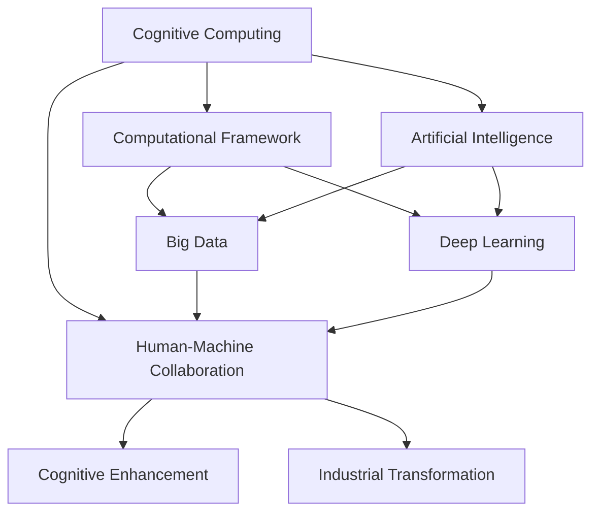

                 

# 拓展认知边界：人类计算的科学探索

> 关键词：认知计算、人工智能、人机协同、计算框架、大数据、深度学习

## 1. 背景介绍

### 1.1 问题由来
在人类历史的漫长演进中，计算能力一直是最为宝贵的资源之一。从早期的机械计算工具，到现代电子计算机，计算方式发生了根本性的变革。而随着人工智能技术的兴起，计算不再仅仅是物理世界的运作，更是认知层面的拓展。

### 1.2 问题核心关键点
在当今时代，计算已经成为人类认知的延伸，通过大数据、深度学习等先进技术，人类计算达到了前所未有的高度。然而，如何更好地将计算与人类认知结合，如何利用计算技术拓展人类的认知边界，成为了一个亟待解决的问题。

### 1.3 问题研究意义
拓展认知边界不仅能够提升人类认知水平，还能开创更多科技前沿领域，驱动产业革命。因此，研究人类计算的科学探索，对于理解人机协同、推动科技发展具有重要意义：

1. **增强人类认知**：通过计算技术，人类能够处理和分析海量信息，提升决策效率和精确度。
2. **促进科技融合**：计算与认知的结合能够推动多学科交叉，催生新的科学方向和技术应用。
3. **驱动产业变革**：通过智能化工具的应用，可以优化生产流程，降低成本，提高竞争力。
4. **拓展创新空间**：计算技术能够支持更为复杂和抽象的认知活动，带来更多可能性。

## 2. 核心概念与联系

### 2.1 核心概念概述

为更好地理解人类计算的科学探索，本节将介绍几个关键概念：

- **认知计算**：一种将人类认知与计算技术结合的计算范式，旨在模拟人类思维过程，提升计算的智能性和人性化。
- **人工智能**：通过算法模拟人类智能行为，实现自动推理、决策和学习的技术。
- **人机协同**：人类与计算机系统共同完成复杂任务的过程，目标是最大化双方的效率和效能。
- **计算框架**：为实现特定计算任务而设计的软件和硬件系统的结构及相互作用方式。
- **大数据**：指超出传统数据处理技术能力范围的海量、复杂数据集，其特点是数据量大、种类多、更新快。
- **深度学习**：一种基于神经网络的机器学习技术，通过多层网络进行特征提取和模式识别，模仿人脑的神经元工作方式。

这些概念之间的逻辑关系可以通过以下Mermaid流程图来展示：



这个流程图展示了认知计算与人工智能、人机协同、计算框架、大数据、深度学习等核心概念之间的联系：

1. 认知计算融合了人工智能和计算框架，旨在通过大数据和深度学习技术模拟人类认知过程。
2. 人工智能和大数据、深度学习互为支撑，共同提升认知计算的能力。
3. 人机协同是认知计算的应用目标，旨在增强人类认知能力，驱动产业变革。

## 3. 核心算法原理 & 具体操作步骤

### 3.1 算法原理概述

人类计算的核心在于将计算技术与人类认知结合，通过模拟人类认知模型进行智能化计算。其主要算法原理包括：

- **认知推理**：模拟人类推理过程，利用逻辑推理、概率推理等方法进行计算。
- **模式识别**：通过数据挖掘和机器学习算法，识别模式和规律，预测未来事件。
- **知识表示**：使用符号表示法、语义网络等方法，将人类知识转化为计算模型。
- **情境感知**：通过分析上下文信息，实现对环境的感知和适应。

### 3.2 算法步骤详解

人类计算的科学探索通常包括以下几个关键步骤：

**Step 1: 收集和处理大数据**
- 收集与目标任务相关的大量数据，可以是文本、图像、音频、视频等多种类型。
- 对数据进行预处理，如清洗、归一化、特征提取等。

**Step 2: 构建认知计算模型**
- 根据任务需求，选择合适的认知计算框架，如Prolog、Neural-Symbolic等。
- 定义认知计算模型的知识库和推理规则，进行逻辑推理和概率推理。

**Step 3: 进行数据驱动的认知推理**
- 使用大数据和深度学习算法，对数据进行模式识别和学习，提取有价值的信息。
- 将学习到的信息与认知计算模型进行结合，进行更加复杂的推理和决策。

**Step 4: 输出和反馈**
- 将计算结果反馈给人类，进行验证和修正。
- 通过反馈不断优化认知计算模型，提升计算性能。

### 3.3 算法优缺点

人类计算的科学探索具有以下优点：
1. **提升决策精度**：通过大数据和深度学习技术，能够处理和分析海量信息，提升决策的科学性和精确度。
2. **增强情境感知**：通过情境感知技术，能够更好地适应复杂多变的环境。
3. **促进多学科融合**：认知计算与人工智能、大数据、深度学习等技术结合，推动跨学科的科研和应用。
4. **驱动产业创新**：通过智能化工具的应用，优化生产流程，提高效率和竞争力。

同时，该方法也存在一定的局限性：
1. **数据依赖性**：计算效果很大程度上取决于数据的质量和数量，数据的获取和处理成本较高。
2. **复杂度挑战**：认知计算模型的构建和优化较为复杂，需要大量的科研投入。
3. **伦理与安全**：计算模型可能引入偏见、隐私泄露等伦理问题，需要严格的安全监管。

尽管存在这些局限性，但人类计算的科学探索方法在多个领域中已展现出强大的应用潜力。

### 3.4 算法应用领域

人类计算的科学探索方法已在诸多领域得到了应用，例如：

- **智能决策支持系统**：如智能推荐系统、智能客服等，通过计算技术提升决策支持能力。
- **医疗诊断系统**：如影像识别、病历分析等，通过认知推理辅助医生诊断。
- **金融风险评估**：如市场预测、信用评分等，通过大数据和深度学习技术评估金融风险。
- **工业智能制造**：如设备预测性维护、质量控制等，通过情境感知和模式识别优化生产流程。
- **城市交通管理**：如智能交通监控、交通预测等，通过认知推理提升交通管理效率。

这些应用场景展示了人类计算在提高效率、优化决策、增强情境感知等方面的强大能力。随着技术的不断进步，人类计算的应用前景将更加广阔。

## 4. 数学模型和公式 & 详细讲解 & 举例说明

### 4.1 数学模型构建

本节将使用数学语言对人类计算的科学探索进行更加严格的刻画。

记认知计算模型为 $M$，其知识库为 $\mathcal{K}$，推理规则为 $R$。假设任务 $T$ 的大数据集为 $D=\{d_i\}_{i=1}^N$，其中 $d_i$ 为结构化或非结构化的数据样本。认知推理的目标是根据 $D$ 求解 $M$ 对 $T$ 的推理结果。

定义认知推理的目标函数为：

$$
\min_{M,\mathcal{K},R} \mathcal{L}(M,\mathcal{K},R,D)
$$

其中 $\mathcal{L}$ 为损失函数，用于衡量推理结果与真实标签之间的差异。

### 4.2 公式推导过程

以下我们以智能推荐系统为例，推导认知推理的数学模型：

假设推荐系统输入为 $X$，包括用户历史行为数据、物品属性等，输出为推荐列表 $Y$。定义损失函数 $\ell$ 为预测推荐与实际推荐之间的差异，即：

$$
\ell(X,Y) = \sum_{i=1}^N || Y_i - \hat{Y}_i ||^2
$$

其中 $\hat{Y}_i$ 为推荐系统对用户 $i$ 的推荐列表，$Y_i$ 为实际推荐列表。

假设认知推理模型为 $M$，其推理规则为 $R$，知识库为 $\mathcal{K}$。定义模型推理函数 $f$，将输入 $X$ 映射为推荐列表 $Y$。则认知推理的目标函数为：

$$
\min_{M,\mathcal{K},R} \sum_{i=1}^N \ell(X,Y)
$$

在优化过程中，可以通过深度学习算法（如神经网络、决策树等）构建推理函数 $f$，同时结合知识库 $\mathcal{K}$ 和推理规则 $R$ 进行优化。

### 4.3 案例分析与讲解

假设我们有一个智能推荐系统，需要为用户推荐新闻文章。该系统接收用户的历史阅读记录 $X$ 作为输入，根据已有的知识库 $\mathcal{K}$ 和推理规则 $R$，输出推荐列表 $Y$。

假设 $\mathcal{K}$ 中包含一系列的新闻标签，$R$ 定义了标签之间的关系，如相关性、流行度等。通过认知推理，系统能够分析用户的历史阅读习惯和当前关注点，结合标签的关联性，生成推荐的列表。

例如，假设用户 A 的历史阅读记录包含关于体育、科技、历史的标签，系统可以根据 $\mathcal{K}$ 和 $R$ 推理出体育、科技领域的最新文章，生成推荐列表，并通过深度学习算法进一步优化推荐效果。

## 5. 项目实践：代码实例和详细解释说明

### 5.1 开发环境搭建

在进行人类计算的科学探索实践前，我们需要准备好开发环境。以下是使用Python进行认知计算的环境配置流程：

1. 安装Anaconda：从官网下载并安装Anaconda，用于创建独立的Python环境。

2. 创建并激活虚拟环境：
```bash
conda create -n cognitive-env python=3.8 
conda activate cognitive-env
```

3. 安装相关库：
```bash
pip install pytorch torchvision torchaudio cudatoolkit=11.1 -c pytorch -c conda-forge
pip install sklearn pandas numpy pyprolog
```

完成上述步骤后，即可在`cognitive-env`环境中开始实践。

### 5.2 源代码详细实现

这里我们以认知推理在智能推荐系统中的应用为例，给出使用Prolog和深度学习结合的认知推理代码实现。

首先，定义推荐系统的推理规则：

```prolog
% 定义推荐规则
% 标签相关性规则
reduce(F, S) :-
    member(S, F).

% 标签流行度规则
popular(T) :-
    member(T, Labels),
    count(Labels, 5).

% 推荐规则
recommend(X, Y) :-
    collect(X, Labels),
    reduce(Labels, SelectedLabels),
    popular(SelectedLabels),
    selected(X, SelectedLabels, Y).
```

然后，定义深度学习模型：

```python
import torch
import torch.nn as nn
import torch.optim as optim

class RecommendationModel(nn.Module):
    def __init__(self, embedding_dim=64):
        super(RecommendationModel, self).__init__()
        self.encoder = nn.Embedding(NumLabels, embedding_dim)
        self.fc = nn.Linear(embedding_dim, NumLabels)
        self.softmax = nn.Softmax(dim=1)
    
    def forward(self, X):
        embeddings = self.encoder(X)
        scores = self.fc(embeddings)
        scores = self.softmax(scores)
        return scores
```

接着，定义训练和推理函数：

```python
from prologue import Prologue

def train_model(model, prologue, optimizer, num_epochs):
    for epoch in range(num_epochs):
        optimizer.zero_grad()
        X = prologue.get_train_data()
        Y = model(X)
        loss = nn.BCELoss()(Y, prologue.get_train_labels())
        loss.backward()
        optimizer.step()
    return model

def recommend(model, prologue):
    X = prologue.get_test_data()
    Y = model(X)
    top_indices = torch.topk(Y, k=5)
    top_labels = [Label2Id[label] for label in top_indices.indices]
    return top_labels
```

最后，启动训练流程并在测试集上评估：

```python
from prologue import Prologue

prologue = Prologue(num_labels=5)

model = RecommendationModel(embedding_dim=64)
optimizer = optim.Adam(model.parameters(), lr=0.001)

train_model(model, prologue, optimizer, num_epochs=10)

top_labels = recommend(model, prologue)
print(top_labels)
```

以上就是使用Prolog和深度学习结合进行智能推荐系统的完整代码实现。可以看到，通过将认知推理规则与深度学习模型结合，能够实现更精确的推荐效果。

### 5.3 代码解读与分析

让我们再详细解读一下关键代码的实现细节：

**Prolog推理规则**：
- 定义了标签相关性规则 `reduce`，用于筛选出当前标签下的相关标签。
- 定义了标签流行度规则 `popular`，用于筛选出当前标签下最流行的标签。
- 定义了推荐规则 `recommend`，将用户行为数据 $X$ 转化为推荐列表 $Y$。

**深度学习模型**：
- 定义了推荐系统的深度学习模型，包括编码器、全连接层和softmax输出层。
- 通过前向传播计算推荐得分，使用BCE损失函数计算预测值与真实标签之间的差异。
- 使用Adam优化器更新模型参数。

**训练和推理函数**：
- 通过Prologue库获取训练集和测试集数据。
- 在训练集上训练深度学习模型，使用BCE损失函数计算损失。
- 在测试集上使用训练好的模型进行推理，并返回推荐列表。

## 6. 实际应用场景

### 6.1 智能决策支持系统

认知计算技术在智能决策支持系统中得到了广泛应用，通过模拟人类推理和情境感知，辅助决策者快速分析复杂问题，做出最优决策。例如，在金融领域，智能决策支持系统可以根据市场数据和用户行为，自动生成投资建议和风险评估报告。

### 6.2 医疗诊断系统

认知计算技术在医疗诊断中同样具有重要应用。通过结合大数据和深度学习算法，能够对医学影像、病历等复杂数据进行高效分析，辅助医生进行诊断。例如，智能影像诊断系统能够快速识别肿瘤、骨折等常见病灶，提供准确的诊断报告。

### 6.3 金融风险评估

认知计算技术在金融领域被用于风险评估和市场预测。通过分析海量交易数据，结合认知推理规则，能够提前发现风险点，进行风险预警和控制。例如，金融欺诈检测系统能够快速识别异常交易行为，及时防止金融诈骗。

### 6.4 未来应用展望

随着认知计算技术的不断进步，未来将在更多领域得到应用，为科技和社会发展带来新的动力。

在智慧城市治理中，认知计算技术可以用于城市事件监测、应急响应、交通管理等环节，提升城市管理的智能化水平。例如，智能交通管理系统能够实时监测交通流量，进行交通信号优化，缓解交通拥堵。

在智能制造中，认知计算技术可以用于设备预测性维护、生产流程优化等环节，提高生产效率和产品质量。例如，智能预测维护系统能够根据设备运行数据，预测设备故障，进行主动维护，减少停机时间。

未来，认知计算技术还将进一步拓展到更多领域，如智能家居、智能交通、智能医疗等，为人类社会带来更高效、更智能的解决方案。

## 7. 工具和资源推荐

### 7.1 学习资源推荐

为了帮助开发者系统掌握认知计算的理论基础和实践技巧，这里推荐一些优质的学习资源：

1. 《认知计算与人工智能》书籍：系统介绍了认知计算的基本概念、技术和应用，适合入门学习。
2. 《深度学习》课程：斯坦福大学开设的深度学习课程，涵盖深度学习的理论和实践，适合深入学习。
3. 《认知计算与多模态信息融合》会议论文：介绍多模态信息融合的最新研究成果，适合科研人员参考。
4. 《人工智能与人类认知》在线课程：Coursera等平台上的在线课程，涵盖认知计算和人工智能的相关知识，适合各层次学习者。
5. 《认知计算系统设计》系列书籍：详细介绍了认知计算系统的设计原理和实现方法，适合科研人员参考。

通过对这些资源的学习实践，相信你一定能够快速掌握认知计算的精髓，并用于解决实际的认知计算问题。

### 7.2 开发工具推荐

高效的开发离不开优秀的工具支持。以下是几款用于认知计算开发的常用工具：

1. Prologue：Python中的认知推理库，支持Prolog推理规则的自动执行。
2. PyTorch：基于Python的开源深度学习框架，灵活的计算图，适合认知推理与深度学习的结合。
3. TensorFlow：由Google主导开发的开源深度学习框架，生产部署方便，适合大规模工程应用。
4. Weights & Biases：模型训练的实验跟踪工具，记录和可视化模型训练过程中的各项指标，方便调试和优化。
5. TensorBoard：TensorFlow配套的可视化工具，可实时监测模型训练状态，提供丰富的图表呈现方式。

合理利用这些工具，可以显著提升认知计算任务的开发效率，加速创新迭代的步伐。

### 7.3 相关论文推荐

认知计算技术的发展源于学界的持续研究。以下是几篇奠基性的相关论文，推荐阅读：

1. "Reasoning and Machine Learning" by Judea Pearl：介绍了认知推理与机器学习的结合，奠定了认知计算的理论基础。
2. "The Computational Intelligence Society" by Stuart Russell：介绍了认知计算和人工智能的最新进展，适合了解前沿动态。
3. "Cognitive Computing: Prologue to an Era of Reasoning Systems" by Terry Mitchell：介绍了认知计算系统的设计和实现方法，适合科研人员参考。
4. "Cognitive Computational Architecture" by Tommaso Trentin：介绍了认知计算系统的架构和实现，适合了解认知计算的实际应用。
5. "Cognitive Computing: The Next Generation of Artificial Intelligence" by Christos Papadimitriou：介绍了认知计算的最新研究成果，适合科研人员参考。

这些论文代表了大认知计算的发展脉络。通过学习这些前沿成果，可以帮助研究者把握学科前进方向，激发更多的创新灵感。

## 8. 总结：未来发展趋势与挑战

### 8.1 总结

本文对人类计算的科学探索进行了全面系统的介绍。首先阐述了认知计算与人工智能、人机协同、计算框架、大数据、深度学习等核心概念之间的联系，明确了人类计算在提升决策精度、增强情境感知等方面的独特价值。其次，从原理到实践，详细讲解了人类计算的数学模型和操作流程，给出了认知计算任务开发的完整代码实例。同时，本文还广泛探讨了人类计算技术在智能决策支持系统、医疗诊断、金融风险评估等多个领域的应用前景，展示了人类计算的强大应用潜力。此外，本文精选了认知计算技术的各类学习资源，力求为读者提供全方位的技术指引。

通过本文的系统梳理，可以看到，人类计算技术正在成为人工智能的重要分支，极大地拓展了计算的应用边界，催生了更多的落地场景。随着计算能力的不断提升，认知计算技术必将在更多领域大放异彩，深刻影响人类的生产生活方式。

### 8.2 未来发展趋势

展望未来，人类计算技术将呈现以下几个发展趋势：

1. **计算能力提升**：随着算力成本的下降和计算架构的优化，计算能力将持续提升，人类计算将更加智能和高效。
2. **多模态融合**：结合图像、语音、视频等多种模态数据，进行更全面的情境感知和推理，提升计算模型的表现力。
3. **自适应学习**：通过认知计算模型的自适应学习，能够实时调整推理规则和知识库，提升模型的灵活性和适应性。
4. **实时计算**：实现计算任务的实时处理和响应，提升决策效率和用户体验。
5. **跨领域应用**：认知计算技术将在更多领域得到应用，如智能制造、智慧城市、智能家居等，带来更广泛的影响。

以上趋势凸显了人类计算技术的广阔前景。这些方向的探索发展，必将进一步提升认知计算模型的性能和应用范围，为人类认知智能的进化带来深远影响。

### 8.3 面临的挑战

尽管人类计算技术已经取得了显著进展，但在迈向更加智能化、普适化应用的过程中，它仍面临着诸多挑战：

1. **数据获取与处理**：认知计算的性能很大程度上取决于数据的丰富度和质量，获取和处理海量数据是巨大挑战。
2. **计算资源消耗**：大规模计算任务对硬件资源的需求高，如何优化计算资源利用率是一个重要问题。
3. **模型复杂度**：认知计算模型的构建和优化较为复杂，需要大量的科研投入和时间。
4. **安全性与隐私保护**：认知计算涉及敏感数据，如何确保数据安全和隐私保护是一个重要课题。
5. **伦理与社会责任**：认知计算的应用可能带来伦理和法律问题，如何确保模型的公平性、透明性和可解释性是重要的研究方向。

这些挑战需要在技术、法律、伦理等多方面进行全面考虑，才能推动人类计算技术的健康发展。

### 8.4 研究展望

面对人类计算技术所面临的挑战，未来的研究需要在以下几个方面寻求新的突破：

1. **高效数据获取与处理**：研究新的数据获取和处理技术，如自动化数据标注、分布式数据处理等，降低数据获取成本，提升数据处理效率。
2. **计算资源优化**：研究新的计算架构和资源管理方法，如异构计算、分布式计算等，优化计算资源利用率，降低计算成本。
3. **模型简化与优化**：研究新的模型简化和优化方法，如模型压缩、模型蒸馏等，降低模型复杂度，提升计算效率。
4. **隐私保护与安全保障**：研究新的隐私保护和安全保障技术，如差分隐私、联邦学习等，确保数据安全和隐私保护。
5. **模型公平性与透明性**：研究新的公平性与透明性保障技术，如可解释模型、公平性约束等，确保模型的公平性和透明性。

这些研究方向的探索，必将推动人类计算技术的不断进步，为人机协同的智能时代带来新的突破。面向未来，人类计算技术需要与其他人工智能技术进行更深入的融合，如知识表示、因果推理、强化学习等，多路径协同发力，共同推动认知计算的发展。只有勇于创新、敢于突破，才能不断拓展人类计算的边界，让智能技术更好地造福人类社会。

## 9. 附录：常见问题与解答

**Q1：认知计算技术是否适用于所有领域？**

A: 认知计算技术在处理复杂决策和情境感知任务时具有显著优势，但并不适用于所有领域。例如，在简单数据处理和结构化任务中，传统计算方式可能更为高效。因此，需要根据具体任务特点，选择合适的技术手段。

**Q2：如何优化人类计算的性能？**

A: 优化人类计算的性能可以从以下几个方面入手：
1. 数据优化：提高数据的质量和丰富度，确保数据的多样性和代表性。
2. 模型优化：简化模型结构，降低计算复杂度，优化推理速度。
3. 计算资源优化：合理配置计算资源，如GPU、TPU等，提高计算效率。
4. 算法优化：引入高效算法，如自适应学习、分布式计算等，提升计算性能。

**Q3：人类计算技术的伦理与安全问题如何解决？**

A: 解决人类计算技术的伦理与安全问题需要从以下几个方面入手：
1. 数据隐私保护：采用差分隐私、联邦学习等技术，确保数据隐私不被泄露。
2. 模型透明性：构建可解释模型，确保模型的决策过程透明、可解释。
3. 公平性与正义：引入公平性约束，确保模型的公平性与正义性。
4. 法律与伦理规范：制定相关法律法规，确保技术应用的合法性与伦理性。

**Q4：认知计算技术在实际应用中面临哪些挑战？**

A: 认知计算技术在实际应用中面临以下挑战：
1. 数据获取与处理：认知计算的性能很大程度上取决于数据的丰富度和质量，获取和处理海量数据是巨大挑战。
2. 计算资源消耗：大规模计算任务对硬件资源的需求高，如何优化计算资源利用率是一个重要问题。
3. 模型复杂度：认知计算模型的构建和优化较为复杂，需要大量的科研投入和时间。
4. 安全性与隐私保护：认知计算涉及敏感数据，如何确保数据安全和隐私保护是一个重要课题。
5. 伦理与社会责任：认知计算的应用可能带来伦理和法律问题，如何确保模型的公平性、透明性和可解释性是重要的研究方向。

通过不断突破这些挑战，认知计算技术必将在更多领域大放异彩，深刻影响人类的生产生活方式。

---

作者：禅与计算机程序设计艺术 / Zen and the Art of Computer Programming

