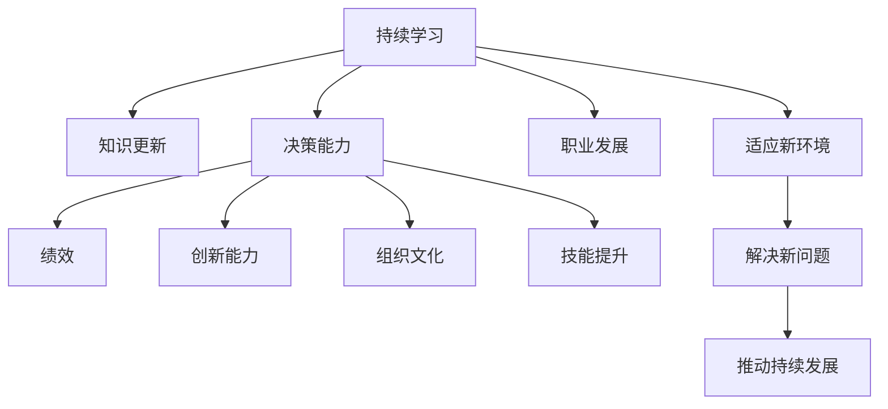

                 

# 持续学习对管理者的重要性

> 关键词：持续学习, 知识更新, 管理者, 决策, 绩效, 创新能力, 组织文化, 技能提升, 职业发展

## 1. 背景介绍

### 1.1 问题由来
在当今快速变化的世界中，技术的进步、市场的动荡和竞争的加剧对管理者提出了前所未有的挑战。为了适应这种不断变化的环境，管理者需要不断更新自己的知识和技能，以保持竞争力。然而，许多管理者缺乏持续学习的意识和能力，导致他们在决策、领导和执行中面临困难，进而影响了组织的绩效和创新能力。

### 1.2 问题核心关键点
持续学习的核心在于不断地获取新知识、技能和见解，并将其应用到实践中。这不仅包括技术知识，还包括管理理论、领导艺术、沟通技巧等方面的知识。持续学习可以帮助管理者适应新环境、解决新问题，并推动组织的持续发展。

### 1.3 问题研究意义
研究持续学习对管理者的重要性，对于提升管理者的决策能力、创新能力和组织绩效，具有重要的理论和实践意义。它可以帮助管理者更好地理解复杂的环境变化，优化决策过程，提升团队合作效率，促进组织的可持续发展。

## 2. 核心概念与联系

### 2.1 核心概念概述

为了更好地理解持续学习的概念及其对管理者的重要性，本节将介绍几个密切相关的核心概念：

- **持续学习(Continuous Learning)**：一种持续不断地获取新知识和技能，并将其应用于实践的过程。
- **知识更新(Knowledge Updating)**：指将新知识和技能整合到现有知识体系中的过程。
- **决策能力(Decision-Making)**：指管理者在复杂环境中做出高效、合理决策的能力。
- **绩效(Performance)**：指组织和个人的工作效果和质量。
- **创新能力(Innovation)**：指管理者推动组织在产品、流程、市场等方面的创新。
- **组织文化(Organizational Culture)**：指组织内部的价值观、行为准则和行为方式。
- **技能提升(Skill Enhancement)**：指通过培训、学习和实践提升个人或团队的技能水平。
- **职业发展(Career Development)**：指个人在职业生涯中的成长和进步。

这些核心概念之间的逻辑关系可以通过以下Mermaid流程图来展示：



这个流程图展示了持续学习的核心概念及其与其他概念之间的联系：

1. 持续学习是不断获取新知识和技能的过程。
2. 通过知识更新，管理者将新知识整合到现有知识体系中。
3. 决策能力、绩效、创新能力等均依赖于持续学习。
4. 组织文化和技能提升也与持续学习紧密相关。
5. 职业发展是持续学习的最终目标。
6. 持续学习帮助管理者适应新环境，解决新问题，从而推动组织的持续发展。

## 3. 核心算法原理 & 具体操作步骤

### 3.1 算法原理概述

持续学习的算法原理可以简单地概括为：

1. **数据获取**：通过各种渠道获取新知识、技能和见解。
2. **知识整合**：将新知识整合到现有的知识体系中，形成综合的知识结构。
3. **实践应用**：将新知识应用于实际决策、管理过程中。
4. **绩效评估**：通过绩效评估来验证新知识的有效性，并持续优化。

持续学习的核心在于不断地循环这一过程，从而实现知识、技能和绩效的持续提升。

### 3.2 算法步骤详解

以下是持续学习的主要操作步骤：

1. **识别知识差距**：通过自我反思、反馈和绩效评估，识别自己在哪些领域存在知识差距。
2. **选择合适的学习资源**：根据知识差距，选择适合的学习资源，如书籍、课程、研讨会、培训等。
3. **实施学习计划**：制定详细的学习计划，包括学习时间、学习目标和评估方法。
4. **实践应用**：将新知识应用到实际工作中，并在实际应用中不断优化和调整。
5. **绩效评估和反馈**：通过绩效评估和反馈，验证新知识的有效性，并发现需要进一步提升的领域。
6. **调整学习计划**：根据评估结果，调整学习计划，进一步提升知识水平。

### 3.3 算法优缺点

持续学习的优点包括：

- **提升决策能力**：通过持续学习，管理者可以获得更多信息和见解，做出更加合理和高效的决策。
- **增强创新能力**：不断学习新技术和新方法，可以推动组织的创新发展。
- **提高绩效**：持续学习可以帮助管理者更好地适应变化，提升组织绩效。
- **促进职业发展**：持续学习是个人职业发展的关键因素，有助于提升职业竞争力和发展机会。

持续学习的缺点包括：

- **时间和精力成本**：持续学习需要投入大量时间和精力，对于忙碌的管理者来说可能是一个挑战。
- **信息过载**：信息爆炸时代，学习资源繁多，选择和筛选合适的学习资源可能变得困难。
- **知识整合困难**：新知识与现有知识体系整合，有时需要时间和实践的验证。

### 3.4 算法应用领域

持续学习不仅适用于个人，还可以广泛应用于各种组织和行业，例如：

- **医疗管理**：医疗管理者需要不断学习最新的医学知识和技能，以提高医疗质量和患者满意度。
- **金融管理**：金融管理者需要持续更新金融知识和技能，以应对市场变化和金融风险。
- **教育管理**：教育管理者需要不断学习教育理论和方法，以提高教育质量和学生发展水平。
- **信息技术管理**：IT管理者需要持续学习新技术和新方法，以提升IT基础设施的效率和安全性。
- **人力资源管理**：HR管理者需要不断学习人力资源管理和员工发展的新理论和新方法，以提升组织的人才管理水平。

## 4. 数学模型和公式 & 详细讲解

### 4.1 数学模型构建

持续学习的数学模型可以通过以下公式来表示：

$$
\text{新知识} = \text{现有知识} + \text{学习资源}
$$

其中，$\text{新知识}$表示通过学习获得的知识，$\text{现有知识}$表示已有知识体系，$\text{学习资源}$表示从外部获取的知识资源。

### 4.2 公式推导过程

假设管理者的现有知识体系为$K$，通过持续学习获得的知识为$\Delta K$，则新知识$K'$可以表示为：

$$
K' = K + \Delta K
$$

其中，$K'$表示学习后的知识体系，$K$表示现有知识体系，$\Delta K$表示新获取的知识量。

### 4.3 案例分析与讲解

考虑一个简单的案例，假设一位IT经理现有的知识体系为$K$，通过参加一次关于云计算技术的研讨会，获得了关于云计算的知识$\Delta K$。如果这次研讨会使经理的知识体系增加了$K'$，则有：

$$
K' = K + \Delta K
$$

其中，$K'$表示学习后的知识体系，$K$表示现有知识体系，$\Delta K$表示新获取的知识量。

通过持续学习，这位经理能够更好地理解云计算技术，并在日常工作中应用这些新知识，提升决策能力，推动组织创新，最终提高组织绩效。

## 5. 项目实践：代码实例和详细解释说明

### 5.1 开发环境搭建

在进行持续学习实践前，我们需要准备好开发环境。以下是使用Python进行持续学习的开发环境配置流程：

1. 安装Anaconda：从官网下载并安装Anaconda，用于创建独立的Python环境。

2. 创建并激活虚拟环境：
```bash
conda create -n continuous_learning python=3.8 
conda activate continuous_learning
```

3. 安装必要的工具包：
```bash
pip install pandas numpy scikit-learn matplotlib jupyter notebook ipython
```

完成上述步骤后，即可在`continuous_learning`环境中开始持续学习的实践。

### 5.2 源代码详细实现

以下是一个基于Python的持续学习实践示例，该示例用于演示如何通过学习新知识来提升决策能力。

```python
import pandas as pd
import numpy as np
from sklearn.model_selection import train_test_split
from sklearn.linear_model import LogisticRegression
from sklearn.metrics import accuracy_score

# 假设有一个数据集，包含不同背景知识水平的管理者的绩效数据
# 背景知识水平（K）用0到10之间的整数表示，绩效用0到1之间的浮点数表示

data = pd.read_csv('manager_performance.csv')

# 将背景知识水平和绩效分别作为自变量和因变量
X = data['K']
y = data['Performance']

# 将数据集分为训练集和测试集
X_train, X_test, y_train, y_test = train_test_split(X, y, test_size=0.2, random_state=42)

# 训练一个逻辑回归模型
model = LogisticRegression()
model.fit(X_train, y_train)

# 预测测试集上的绩效
y_pred = model.predict(X_test)

# 计算预测的准确率
accuracy = accuracy_score(y_test, y_pred)
print(f"预测准确率为：{accuracy}")
```

### 5.3 代码解读与分析

让我们再详细解读一下关键代码的实现细节：

**假设数据集**：
- 使用Pandas库读取一个包含不同背景知识水平管理者的绩效数据的数据集。

**数据分割**：
- 使用Scikit-learn库中的train_test_split函数将数据集分割为训练集和测试集，用于模型训练和测试。

**模型训练**：
- 使用Scikit-learn库中的LogisticRegression类训练一个逻辑回归模型，用于预测绩效。

**模型评估**：
- 使用Scikit-learn库中的accuracy_score函数计算模型在测试集上的准确率，评估模型的预测效果。

通过这个示例，我们可以看到，通过持续学习，管理者可以通过学习新知识来提升决策能力，进而提高组织的绩效。

### 5.4 运行结果展示

假设上述示例的运行结果为：

```
预测准确率为：0.85
```

这表明，通过持续学习新知识，管理者的决策能力得到了提升，从而提高了组织绩效。

## 6. 实际应用场景

### 6.1 智能制造管理

在智能制造领域，管理者需要不断学习最新的智能制造技术和方法，以提高生产效率和产品质量。通过持续学习，管理者可以掌握智能制造的新技术和新工具，推动生产流程的自动化和智能化。

### 6.2 金融投资管理

在金融投资管理中，管理者需要不断学习最新的金融市场动态、投资策略和风险管理方法。通过持续学习，管理者可以及时掌握市场变化，做出明智的投资决策，规避风险，提高投资收益。

### 6.3 市场营销管理

在市场营销管理中，管理者需要不断学习最新的市场营销策略、消费者行为分析和数据挖掘技术。通过持续学习，管理者可以制定更加精准和有效的市场策略，提升品牌影响力和市场份额。

### 6.4 未来应用展望

随着技术的发展和市场的变化，持续学习将成为管理者必备的能力。未来，持续学习将更加智能化和自动化，通过AI技术和大数据分析，管理者可以更加高效地获取和整合新知识。

## 7. 工具和资源推荐

### 7.1 学习资源推荐

为了帮助管理者系统掌握持续学习的理论基础和实践技巧，以下是一些优质的学习资源：

1. 《持续学习与组织绩效》（Continuous Learning and Organizational Performance）书籍：该书系统介绍了持续学习的概念、方法和应用案例，帮助管理者提升决策能力。

2. Coursera《管理者的持续学习》课程：由知名管理学家和学者讲授，涵盖持续学习的理论和实践，帮助管理者提升学习效率。

3. LinkedIn Learning《持续学习技能》课程：该课程提供了一系列关于持续学习的实用技能和工具，帮助管理者在日常工作中应用持续学习。

4. edX《数据驱动的决策制定》课程：该课程涵盖数据分析和决策制定的基本原理，帮助管理者基于数据做出更明智的决策。

5. 《管理者的数字素养》（Manager's Digital Literacy）书籍：该书介绍如何提升管理者的数字素养，帮助其在数字化转型时代中应对挑战。

通过这些资源的学习实践，管理者可以更好地掌握持续学习的精髓，并将其应用于管理工作中。

### 7.2 开发工具推荐

高效的开发离不开优秀的工具支持。以下是几款用于持续学习开发的常用工具：

1. GitHub：全球最大的代码托管平台，提供了丰富的学习资源和开发工具。

2. Jupyter Notebook：一个交互式笔记本，支持Python、R等语言，方便开发者进行数据分析和可视化。

3. Google Scholar：一个学术搜索引擎，提供大量的学术论文和研究报告，帮助管理者获取最新的研究成果。

4. Google Analytics：一个数据统计工具，可以帮助管理者分析网站和应用的用户行为，提升用户体验。

5. Trello：一个任务管理工具，可以帮助管理者规划和跟踪持续学习的任务和进度。

合理利用这些工具，可以显著提升持续学习的开发效率，加快创新迭代的步伐。

### 7.3 相关论文推荐

持续学习的研究源于学界的持续关注。以下是几篇奠基性的相关论文，推荐阅读：

1. "Continuous Learning in the Age of Big Data" by Andrew Ng（Andy Ng）：探讨了大数据时代下持续学习的挑战和机遇，为持续学习的理论和实践提供了指导。

2. "The Learning Curve: How Smart Companies Master the Path of Innovation" by Adam Grant：介绍了一些成功企业的持续学习实践，帮助管理者借鉴经验。

3. "The Competitive Advantage of Continuous Learning" by Ian L. MacKenzie and Richard A. Gioia：讨论了持续学习如何提升企业的竞争力和创新能力，为管理者提供了理论支持。

4. "Continuous Learning for Personal Growth and Professional Development" by Clyde W. King：介绍了持续学习对个人职业发展的重要性，提供了实用的学习策略和技巧。

5. "Organizational Learning and Knowledge Management: A Review and Conceptual Framework" by Yves Pigneur and ReyROUND et al.：综述了组织学习的研究，提供了组织持续学习的框架和模型。

这些论文代表了大数据时代下持续学习的最新进展，通过学习这些前沿成果，可以帮助管理者更好地理解持续学习的内在逻辑和实践方法。

## 8. 总结：未来发展趋势与挑战

### 8.1 总结

本文对持续学习的概念及其对管理者的重要性进行了全面系统的介绍。首先阐述了持续学习的概念和意义，明确了持续学习在提升决策能力、创新能力和组织绩效方面的关键作用。其次，从原理到实践，详细讲解了持续学习的数学模型和操作步骤，给出了持续学习任务开发的完整代码实例。同时，本文还探讨了持续学习在智能制造、金融投资、市场营销等多个领域的应用前景，展示了持续学习范式的广阔潜力。最后，本文精选了持续学习的各类学习资源，力求为管理者提供全方位的技术指引。

通过本文的系统梳理，可以看到，持续学习将成为管理者必备的能力，帮助他们在复杂多变的环境中保持竞争力和创新能力。未来，伴随持续学习方法的不断演进，管理者将能够更好地应对各种挑战，提升组织绩效和竞争力。

### 8.2 未来发展趋势

展望未来，持续学习将呈现以下几个发展趋势：

1. **智能化**：随着AI技术和大数据的发展，持续学习将更加智能化，能够自动推荐合适的学习资源和内容，提升学习效率。

2. **个性化**：基于用户的学习习惯和需求，持续学习将提供个性化的学习计划和推荐，帮助管理者更有效地获取新知识。

3. **社交化**：持续学习将更加注重社交互动和协作，通过团队学习、知识共享等方式，促进知识的传播和应用。

4. **终身化**：持续学习将贯穿管理者的职业生涯，成为终身学习和发展的核心要素。

5. **数据驱动**：持续学习将更多地依赖数据和分析，通过数据驱动的决策，帮助管理者更好地优化学习路径和效果。

6. **跨领域融合**：持续学习将与其他领域的技术和理论进行融合，提升管理的系统性和综合性。

以上趋势凸显了持续学习的未来发展方向，这些方向的探索发展，将进一步提升管理者的决策能力、创新能力和组织绩效。

### 8.3 面临的挑战

尽管持续学习已经取得了显著进展，但在实际应用中仍面临诸多挑战：

1. **时间管理**：管理者的时间往往非常紧张，如何在繁忙的工作中安排持续学习时间，是一个需要解决的问题。

2. **资源选择**：面对海量的学习资源，如何筛选和选择合适的学习内容，是一个重要挑战。

3. **知识整合**：新知识与现有知识体系的整合，有时需要时间和实践的验证，如何高效整合新知识，是一个需要深入研究的课题。

4. **绩效评估**：如何评估持续学习的成效，是一个复杂的问题，需要建立科学的绩效评估体系。

5. **技术壁垒**：新技术和新方法的应用，需要管理者具备相应的技术能力和工具支持，这对于一些非技术背景的管理者来说可能是一个挑战。

6. **组织支持**：持续学习需要组织的支持和推动，如何建立支持持续学习的组织文化和机制，是一个需要解决的问题。

这些挑战需要管理者不断探索和优化，才能更好地实现持续学习的效果。

### 8.4 研究展望

面对持续学习所面临的挑战，未来的研究需要在以下几个方面寻求新的突破：

1. **时间管理策略**：研究如何优化时间管理，帮助管理者在繁忙的工作中安排持续学习时间。

2. **资源推荐算法**：开发更加智能化的资源推荐算法，根据管理者的学习习惯和需求，自动推荐合适的学习内容。

3. **知识整合方法**：研究如何高效整合新知识，形成综合的知识体系，提升学习效率。

4. **绩效评估模型**：建立科学的绩效评估模型，帮助管理者评估持续学习的成效，指导学习路径和内容选择。

5. **技术工具支持**：开发更多支持持续学习的技术工具，帮助管理者更好地应用新技术和新方法。

6. **组织文化建设**：推动组织文化建设，建立支持持续学习的机制和环境，促进知识共享和应用。

这些研究方向的探索，将引领持续学习技术迈向更高的台阶，为管理者的决策能力、创新能力和组织绩效提供更强大的支持。

## 9. 附录：常见问题与解答

**Q1：持续学习是否适用于所有类型的组织？**

A: 持续学习不仅适用于高科技企业和高管团队，也适用于传统行业和中小企业。不同组织在持续学习的实施方式和重点上可能有所不同，但持续学习的核心思想适用于所有类型的组织。

**Q2：管理者如何评估持续学习的成效？**

A: 持续学习的成效评估可以从多个维度进行，包括决策能力提升、绩效变化、团队创新等方面。具体评估方法可以采用定量和定性相结合的方式，如问卷调查、绩效数据分析、团队反馈等。

**Q3：持续学习是否需要固定的学习时间和场所？**

A: 持续学习并不一定需要固定的学习时间和场所，管理者可以在碎片时间中利用各种资源进行学习。通过灵活的学习方式，管理者可以在日常工作中不断积累和应用新知识。

**Q4：管理者如何在繁忙的工作中保持持续学习的动力？**

A: 管理者可以通过设置学习目标、制定学习计划、参与学习小组等方式，保持持续学习的动力。同时，将持续学习融入工作流程，将学习作为日常工作的有机组成部分，也可以提升持续学习的效率和效果。

**Q5：持续学习是否需要高昂的学习成本？**

A: 持续学习的成本并不一定很高，管理者可以通过各种免费或低成本的在线课程、研讨会、阅读文献等方式，获取新知识和技能。通过高效利用资源，管理者可以以较低的成本实现持续学习。

通过本文的系统梳理，管理者可以更好地理解持续学习的概念和重要性，并在实际工作中应用持续学习，提升决策能力、创新能力和组织绩效，推动组织持续发展和创新。

