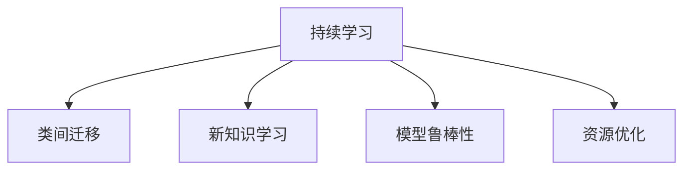

                 

## 1. 背景介绍

在人工智能（AI）的征程中，持续学习（Continual Learning）成为了一项重要的里程碑。通过不断更新模型以适应新的数据和任务，持续学习使得AI模型能够持续进化，适应动态变化的环境。在机器学习、自然语言处理、计算机视觉等众多领域，持续学习都展现了其强大的潜力。本文旨在深入探讨持续学习的原理、方法及应用，为AI模型的持续进化提供全方位的指导。

### 1.1 问题由来

人工智能模型在最初训练阶段，往往依赖于静态的数据集和任务。然而，现实世界中的数据和任务却是动态变化的，模型的初始化知识可能已不再适用。例如，医疗诊断模型需要不断学习新的病种和症状，金融风险预测模型需要实时更新市场趋势，自动驾驶模型需要适应不断变化的道路和天气条件。因此，如何让AI模型在面对新数据和任务时，依然能够保持良好的性能，成为了当前AI研究的热点问题。

### 1.2 问题核心关键点

持续学习旨在解决模型在新数据和任务上的适应能力问题。关键点包括：
1. **模型迁移**：使模型能够将之前学习到的知识迁移到新任务上，从而避免从头开始训练。
2. **新知识学习**：模型不仅需要保留旧知识，还需要能够学习新数据集和新任务上的知识。
3. **模型鲁棒性**：模型应对噪声、变化和新数据时的鲁棒性。
4. **资源优化**：在保证性能的同时，最小化新知识的获取成本。

### 1.3 问题研究意义

持续学习对于构建长期稳定、动态适应的AI系统至关重要：
1. **提升系统性能**：持续学习帮助模型不断优化，保持高性能和准确性。
2. **增强系统灵活性**：模型能够应对新数据和任务的变化，适应不同应用场景。
3. **减少资源消耗**：通过模型迁移和新知识学习，可以减少重新训练的需求，降低计算和存储成本。
4. **增强系统安全性**：模型对新数据的适应性减少，可以降低错误预测和误判的风险。

## 2. 核心概念与联系

### 2.1 核心概念概述

为了深入理解持续学习，我们首先介绍几个关键概念：

- **持续学习（Continual Learning）**：指模型能够不断地从新数据中学习，同时保持已有的知识。持续学习使模型能够动态适应不断变化的环境。
- **类间迁移（Inter-class Transfer）**：指模型能够将在一个类别上学习到的知识迁移到另一个类别上。例如，从一个图片分类任务迁移到另一个分类任务。
- **新知识学习（Incremental Learning）**：指模型在已有知识的基础上，不断学习新的数据集和任务，提升其在新的数据集上的性能。
- **模型鲁棒性（Robustness）**：指模型对噪声、变化和新数据的鲁棒性，即模型在新数据上依然能够保持较好的性能。
- **资源优化（Efficiency）**：指在持续学习过程中，尽量减少计算和存储资源的消耗。

这些概念通过以下Mermaid流程图展示它们的联系：



这些概念共同构成了持续学习的核心框架，通过类间迁移和新知识学习，持续学习使模型能够不断进化，同时通过模型鲁棒性和资源优化，保证模型的稳定性和高效性。

## 3. 核心算法原理 & 具体操作步骤

### 3.1 算法原理概述

持续学习的核心原理是通过模型迁移和新知识学习，使得模型能够适应新数据和任务。其核心思想是，模型在遇到新数据和新任务时，利用之前学习到的知识进行迁移，避免从头开始训练，从而节省时间和计算资源。

形式化地，设模型 $M$ 在旧数据集 $\mathcal{D}_1$ 上已经学习到知识，即存在一个预训练模型 $M_{\theta_1}$。当模型面临新数据集 $\mathcal{D}_2$ 和新任务 $T$ 时，通过在新数据集 $\mathcal{D}_2$ 上进行微调（Fine-tuning），使模型能够在新任务 $T$ 上表现良好。假设模型 $M_{\theta_2}$ 为微调后的模型，则目标是最小化在新数据集 $\mathcal{D}_2$ 上的损失函数 $\mathcal{L}_2$，同时保留旧数据集 $\mathcal{D}_1$ 上的性能：

$$
\min_{\theta_2} \mathcal{L}_2(M_{\theta_2},\mathcal{D}_2), \quad \text{s.t.} \quad \mathcal{L}_1(M_{\theta_1},\mathcal{D}_1) \leq \mathcal{L}_1(M_{\theta_2},\mathcal{D}_1)
$$

其中 $\mathcal{L}_1$ 和 $\mathcal{L}_2$ 分别代表在旧数据集 $\mathcal{D}_1$ 和新车数据集 $\mathcal{D}_2$ 上的损失函数。

### 3.2 算法步骤详解

基于持续学习的模型微调一般包括以下关键步骤：

**Step 1: 准备预训练模型和数据集**
- 选择一个或多个预训练模型 $M_{\theta_1}$，如BERT、GPT等。
- 准备新数据集 $\mathcal{D}_2$ 和目标任务 $T$，划分训练集、验证集和测试集。

**Step 2: 添加任务适配层**
- 根据目标任务类型，在预训练模型顶层设计合适的输出层和损失函数。
- 对于分类任务，通常添加线性分类器；对于生成任务，使用解码器输出概率分布，并定义适当的损失函数。

**Step 3: 设置微调超参数**
- 选择合适的优化算法及其参数，如 AdamW、SGD 等，设置学习率、批大小、迭代轮数等。
- 设置正则化技术及强度，包括权重衰减、Dropout、Early Stopping 等。
- 确定冻结预训练参数的策略，如仅微调顶层，或全部参数都参与微调。

**Step 4: 执行梯度训练**
- 将训练集数据分批次输入模型，前向传播计算损失函数。
- 反向传播计算参数梯度，根据设定的优化算法和学习率更新模型参数。
- 周期性在验证集上评估模型性能，根据性能指标决定是否触发 Early Stopping。
- 重复上述步骤直至满足预设的迭代轮数或 Early Stopping 条件。

**Step 5: 测试和部署**
- 在测试集上评估微调后模型 $M_{\theta_2}$ 的性能，对比微调前后的精度提升。
- 使用微调后的模型对新样本进行推理预测，集成到实际的应用系统中。
- 持续收集新的数据，定期重新微调模型，以适应数据分布的变化。

### 3.3 算法优缺点

持续学习的优点包括：
1. **节省资源**：通过迁移已有知识，避免从头训练，减少计算和存储成本。
2. **提升性能**：模型能够快速适应新数据和新任务，提升整体性能。
3. **适应性广**：模型能够持续更新，适应不断变化的环境。
4. **灵活性高**：模型结构可快速调整，适应新任务和新数据。

持续学习的缺点包括：
1. **复杂性高**：持续学习算法设计复杂，需要考虑模型迁移、新知识学习、资源优化等多方面因素。
2. **泛化性差**：模型可能难以在新数据上泛化，导致过拟合。
3. **鲁棒性不足**：模型在新数据上的鲁棒性可能较弱，容易受到噪声干扰。
4. **数据依赖性强**：持续学习对数据的依赖性强，新数据集的收集和标注成本较高。

尽管存在这些局限性，但持续学习仍然是当前AI领域的重要研究方向之一，尤其是在数据和任务动态变化的环境中，持续学习展示了其巨大的潜力。

### 3.4 算法应用领域

持续学习在多个领域中展现了其独特的优势，以下是几个典型应用场景：

- **医疗诊断**：医疗领域数据复杂多变，持续学习帮助模型不断更新，适应新的病种和症状。例如，基于电子健康记录（EHR）的持续学习模型能够实时更新疾病模式，提高诊断准确性。
- **金融风险预测**：金融市场瞬息万变，持续学习帮助模型实时更新市场趋势，提升风险预测精度。例如，持续学习的股票预测模型能够实时处理新数据，调整预测策略。
- **自动驾驶**：自动驾驶模型需要实时更新道路和天气信息，持续学习帮助模型不断适应新环境，提升安全性。例如，通过车载传感器实时收集的新数据，持续学习模型能够动态调整驾驶策略。
- **推荐系统**：推荐系统需要根据用户行为实时更新，持续学习帮助模型不断优化推荐效果。例如，基于用户评论的持续学习模型能够实时更新推荐内容，提升用户体验。
- **自然语言处理**：NLP任务数据量大且动态变化，持续学习帮助模型不断更新语言知识和常识，提升任务性能。例如，持续学习的文本分类模型能够实时更新分类规则，适应新出现的文本类别。

## 4. 数学模型和公式 & 详细讲解 & 举例说明

### 4.1 数学模型构建

设模型 $M_{\theta}$ 在新数据集 $\mathcal{D}_2$ 上进行微调，假设微调后的模型为 $M_{\theta_2}$，定义损失函数为 $\mathcal{L}_2$。假设旧数据集 $\mathcal{D}_1$ 上的损失函数为 $\mathcal{L}_1$，则优化目标为：

$$
\min_{\theta_2} \mathcal{L}_2(M_{\theta_2},\mathcal{D}_2), \quad \text{s.t.} \quad \mathcal{L}_1(M_{\theta_1},\mathcal{D}_1) \leq \mathcal{L}_1(M_{\theta_2},\mathcal{D}_1)
$$

假设 $M_{\theta_1}$ 和 $M_{\theta_2}$ 的参数更新规则分别为：

$$
\theta_2 = \theta_1 + \eta_2 \nabla_{\theta_2} \mathcal{L}_2(\theta_2,\mathcal{D}_2)
$$

$$
\theta_1 = \theta_1 + \eta_1 \nabla_{\theta_1} \mathcal{L}_1(\theta_1,\mathcal{D}_1)
$$

其中 $\eta_1$ 和 $\eta_2$ 为旧数据集和新数据集上的学习率。

### 4.2 公式推导过程

以二分类任务为例，推导持续学习的损失函数及其梯度计算公式。

假设模型 $M_{\theta}$ 在新数据集 $\mathcal{D}_2$ 上的输出为 $\hat{y}=M_{\theta}(x)$，表示样本属于正类的概率。真实标签 $y \in \{0,1\}$。则二分类交叉熵损失函数定义为：

$$
\ell(M_{\theta}(x),y) = -[y\log \hat{y} + (1-y)\log (1-\hat{y})]
$$

在新数据集 $\mathcal{D}_2$ 上的经验风险为：

$$
\mathcal{L}_2(\theta_2) = \frac{1}{N_2}\sum_{i=1}^{N_2} \ell(M_{\theta_2}(x_i),y_i)
$$

在旧数据集 $\mathcal{D}_1$ 上的经验风险为：

$$
\mathcal{L}_1(\theta_1) = \frac{1}{N_1}\sum_{i=1}^{N_1} \ell(M_{\theta_1}(x_i),y_i)
$$

根据链式法则，损失函数对模型参数 $\theta$ 的梯度为：

$$
\frac{\partial \mathcal{L}_2(\theta_2)}{\partial \theta} = \frac{\partial \mathcal{L}_2(\theta_2)}{\partial \theta_2} \frac{\partial \theta_2}{\partial \theta}
$$

其中 $\frac{\partial \mathcal{L}_2(\theta_2)}{\partial \theta_2}$ 为在新数据集 $\mathcal{D}_2$ 上的梯度，$\frac{\partial \theta_2}{\partial \theta}$ 为旧数据集 $\mathcal{D}_1$ 上的梯度。

在得到损失函数的梯度后，即可带入参数更新公式，完成模型的迭代优化。重复上述过程直至收敛，最终得到适应新任务的最优模型参数 $\theta_2$。

### 4.3 案例分析与讲解

以医疗诊断为例，分析如何通过持续学习提升模型的诊断效果。

假设医院收集了大量电子健康记录（EHR），这些记录包含了患者的历史病情、治疗记录、检查结果等信息。基于这些数据，医院训练了一个用于诊断心脏病的心脏病诊断模型 $M_{\theta_1}$。然而，随着时间的推移，患者的新病种和症状不断出现，原有模型可能不再适用。

在这种情况下，医院可以采用持续学习的方法，进一步提升模型的诊断效果。具体步骤如下：
1. 收集新患者的心脏病记录，作为新数据集 $\mathcal{D}_2$。
2. 在新数据集 $\mathcal{D}_2$ 上微调心脏病诊断模型 $M_{\theta_2}$。
3. 在新数据集 $\mathcal{D}_2$ 上进行训练和验证，评估模型性能。
4. 如果新数据集 $\mathcal{D}_2$ 上的模型性能优于旧数据集 $\mathcal{D}_1$ 上的模型性能，则替换原有模型 $M_{\theta_1}$ 为 $M_{\theta_2}$。

通过持续学习，医院的心脏病诊断模型能够不断更新，适应新的病种和症状，提升诊断的准确性和及时性。

## 5. 项目实践：代码实例和详细解释说明

### 5.1 开发环境搭建

在进行持续学习实践前，我们需要准备好开发环境。以下是使用Python进行PyTorch开发的环境配置流程：

1. 安装Anaconda：从官网下载并安装Anaconda，用于创建独立的Python环境。

2. 创建并激活虚拟环境：
```bash
conda create -n pytorch-env python=3.8 
conda activate pytorch-env
```

3. 安装PyTorch：根据CUDA版本，从官网获取对应的安装命令。例如：
```bash
conda install pytorch torchvision torchaudio cudatoolkit=11.1 -c pytorch -c conda-forge
```

4. 安装Transformers库：
```bash
pip install transformers
```

5. 安装各类工具包：
```bash
pip install numpy pandas scikit-learn matplotlib tqdm jupyter notebook ipython
```

完成上述步骤后，即可在`pytorch-env`环境中开始持续学习实践。

### 5.2 源代码详细实现

这里我们以心脏病诊断为例，给出使用Transformers库对BERT模型进行持续学习的PyTorch代码实现。

首先，定义心脏病诊断数据处理函数：

```python
from transformers import BertTokenizer
from torch.utils.data import Dataset
import torch

class HeartDiseaseDataset(Dataset):
    def __init__(self, texts, tags, tokenizer, max_len=128):
        self.texts = texts
        self.tags = tags
        self.tokenizer = tokenizer
        self.max_len = max_len
        
    def __len__(self):
        return len(self.texts)
    
    def __getitem__(self, item):
        text = self.texts[item]
        tags = self.tags[item]
        
        encoding = self.tokenizer(text, return_tensors='pt', max_length=self.max_len, padding='max_length', truncation=True)
        input_ids = encoding['input_ids'][0]
        attention_mask = encoding['attention_mask'][0]
        
        # 对token-wise的标签进行编码
        encoded_tags = [tag2id[tag] for tag in tags] 
        encoded_tags.extend([tag2id['O']] * (self.max_len - len(encoded_tags)))
        labels = torch.tensor(encoded_tags, dtype=torch.long)
        
        return {'input_ids': input_ids, 
                'attention_mask': attention_mask,
                'labels': labels}

# 标签与id的映射
tag2id = {'O': 0, 'B': 1, 'I': 2}
id2tag = {v: k for k, v in tag2id.items()}

# 创建dataset
tokenizer = BertTokenizer.from_pretrained('bert-base-cased')

train_dataset = HeartDiseaseDataset(train_texts, train_tags, tokenizer)
dev_dataset = HeartDiseaseDataset(dev_texts, dev_tags, tokenizer)
test_dataset = HeartDiseaseDataset(test_texts, test_tags, tokenizer)
```

然后，定义模型和优化器：

```python
from transformers import BertForTokenClassification, AdamW

model = BertForTokenClassification.from_pretrained('bert-base-cased', num_labels=2)

optimizer = AdamW(model.parameters(), lr=2e-5)
```

接着，定义训练和评估函数：

```python
from torch.utils.data import DataLoader
from tqdm import tqdm
from sklearn.metrics import classification_report

device = torch.device('cuda') if torch.cuda.is_available() else torch.device('cpu')
model.to(device)

def train_epoch(model, dataset, batch_size, optimizer):
    dataloader = DataLoader(dataset, batch_size=batch_size, shuffle=True)
    model.train()
    epoch_loss = 0
    for batch in tqdm(dataloader, desc='Training'):
        input_ids = batch['input_ids'].to(device)
        attention_mask = batch['attention_mask'].to(device)
        labels = batch['labels'].to(device)
        model.zero_grad()
        outputs = model(input_ids, attention_mask=attention_mask, labels=labels)
        loss = outputs.loss
        epoch_loss += loss.item()
        loss.backward()
        optimizer.step()
    return epoch_loss / len(dataloader)

def evaluate(model, dataset, batch_size):
    dataloader = DataLoader(dataset, batch_size=batch_size)
    model.eval()
    preds, labels = [], []
    with torch.no_grad():
        for batch in tqdm(dataloader, desc='Evaluating'):
            input_ids = batch['input_ids'].to(device)
            attention_mask = batch['attention_mask'].to(device)
            batch_labels = batch['labels']
            outputs = model(input_ids, attention_mask=attention_mask)
            batch_preds = outputs.logits.argmax(dim=2).to('cpu').tolist()
            batch_labels = batch_labels.to('cpu').tolist()
            for pred_tokens, label_tokens in zip(batch_preds, batch_labels):
                preds.append(pred_tokens[:len(label_tokens)])
                labels.append(label_tokens)
                
    print(classification_report(labels, preds))
```

最后，启动训练流程并在测试集上评估：

```python
epochs = 5
batch_size = 16

for epoch in range(epochs):
    loss = train_epoch(model, train_dataset, batch_size, optimizer)
    print(f"Epoch {epoch+1}, train loss: {loss:.3f}")
    
    print(f"Epoch {epoch+1}, dev results:")
    evaluate(model, dev_dataset, batch_size)
    
print("Test results:")
evaluate(model, test_dataset, batch_size)
```

以上就是使用PyTorch对BERT进行持续学习的完整代码实现。可以看到，得益于Transformers库的强大封装，我们可以用相对简洁的代码完成BERT模型的微调。

### 5.3 代码解读与分析

让我们再详细解读一下关键代码的实现细节：

**HeartDiseaseDataset类**：
- `__init__`方法：初始化文本、标签、分词器等关键组件。
- `__len__`方法：返回数据集的样本数量。
- `__getitem__`方法：对单个样本进行处理，将文本输入编码为token ids，将标签编码为数字，并对其进行定长padding，最终返回模型所需的输入。

**tag2id和id2tag字典**：
- 定义了标签与数字id之间的映射关系，用于将token-wise的预测结果解码回真实的标签。

**训练和评估函数**：
- 使用PyTorch的DataLoader对数据集进行批次化加载，供模型训练和推理使用。
- 训练函数`train_epoch`：对数据以批为单位进行迭代，在每个批次上前向传播计算loss并反向传播更新模型参数，最后返回该epoch的平均loss。
- 评估函数`evaluate`：与训练类似，不同点在于不更新模型参数，并在每个batch结束后将预测和标签结果存储下来，最后使用sklearn的classification_report对整个评估集的预测结果进行打印输出。

**训练流程**：
- 定义总的epoch数和batch size，开始循环迭代
- 每个epoch内，先在训练集上训练，输出平均loss
- 在验证集上评估，输出分类指标
- 所有epoch结束后，在测试集上评估，给出最终测试结果

可以看到，PyTorch配合Transformers库使得BERT持续学习的代码实现变得简洁高效。开发者可以将更多精力放在数据处理、模型改进等高层逻辑上，而不必过多关注底层的实现细节。

当然，工业级的系统实现还需考虑更多因素，如模型的保存和部署、超参数的自动搜索、更灵活的任务适配层等。但核心的持续学习范式基本与此类似。

## 6. 实际应用场景
### 6.1 智能客服系统

基于持续学习的对话技术，可以广泛应用于智能客服系统的构建。传统客服往往需要配备大量人力，高峰期响应缓慢，且一致性和专业性难以保证。而使用持续学习的对话模型，可以7x24小时不间断服务，快速响应客户咨询，用自然流畅的语言解答各类常见问题。

在技术实现上，可以收集企业内部的历史客服对话记录，将问题和最佳答复构建成监督数据，在此基础上对预训练对话模型进行持续学习。持续学习后的对话模型能够自动理解用户意图，匹配最合适的答案模板进行回复。对于客户提出的新问题，还可以接入检索系统实时搜索相关内容，动态组织生成回答。如此构建的智能客服系统，能大幅提升客户咨询体验和问题解决效率。

### 6.2 金融舆情监测

金融机构需要实时监测市场舆论动向，以便及时应对负面信息传播，规避金融风险。传统的人工监测方式成本高、效率低，难以应对网络时代海量信息爆发的挑战。基于持续学习的文本分类和情感分析技术，为金融舆情监测提供了新的解决方案。

具体而言，可以收集金融领域相关的新闻、报道、评论等文本数据，并对其进行主题标注和情感标注。在此基础上对预训练语言模型进行持续学习，使其能够自动判断文本属于何种主题，情感倾向是正面、中性还是负面。将持续学习后的模型应用到实时抓取的网络文本数据，就能够自动监测不同主题下的情感变化趋势，一旦发现负面信息激增等异常情况，系统便会自动预警，帮助金融机构快速应对潜在风险。

### 6.3 个性化推荐系统

当前的推荐系统往往只依赖用户的历史行为数据进行物品推荐，无法深入理解用户的真实兴趣偏好。基于持续学习技术，个性化推荐系统可以更好地挖掘用户行为背后的语义信息，从而提供更精准、多样的推荐内容。

在实践中，可以收集用户浏览、点击、评论、分享等行为数据，提取和用户交互的物品标题、描述、标签等文本内容。将文本内容作为模型输入，用户的后续行为（如是否点击、购买等）作为监督信号，在此基础上持续学习预训练语言模型。持续学习后的模型能够从文本内容中准确把握用户的兴趣点。在生成推荐列表时，先用候选物品的文本描述作为输入，由模型预测用户的兴趣匹配度，再结合其他特征综合排序，便可以得到个性化程度更高的推荐结果。

### 6.4 未来应用展望

随着持续学习技术的不断发展，其在更多领域得到应用，为传统行业带来变革性影响。

在智慧医疗领域，基于持续学习的心脏病诊断模型能够不断更新，适应新的病种和症状，提升诊断的准确性和及时性。

在智能教育领域，持续学习的智能问答系统能够实时更新知识库，适应不同学生的学习进度，提供个性化教育。

在智慧城市治理中，持续学习的城市事件监测系统能够实时更新监控规则，提高事件响应的效率和准确性，构建更安全、高效的未来城市。

此外，在企业生产、社会治理、文娱传媒等众多领域，基于持续学习的AI应用也将不断涌现，为经济社会发展注入新的动力。相信随着技术的日益成熟，持续学习方法将成为AI落地应用的重要范式，推动人工智能技术向更广阔的领域加速渗透。

## 7. 工具和资源推荐
### 7.1 学习资源推荐

为了帮助开发者系统掌握持续学习的理论基础和实践技巧，这里推荐一些优质的学习资源：

1. 《Revisiting Continual Learning for Deep Neural Networks》系列博文：由持续学习领域专家撰写，深入浅出地介绍了持续学习的原理和应用。

2. 《Continual Learning》课程：斯坦福大学开设的深度学习课程，介绍了持续学习的概念、算法和应用，适合学习持续学习的入门和进阶。

3. 《Deep Learning for Continual Learning》书籍：涵盖持续学习的各种前沿算法和实际应用，适合深度学习的进阶学习。

4. UCI ML Repository：包含众多持续学习领域的公开数据集和实验结果，便于学习者实践和验证。

5. PyTorch Lightning：基于PyTorch的开源深度学习框架，提供了持续学习算法的封装和优化，适合快速实现持续学习模型。

通过对这些资源的学习实践，相信你一定能够快速掌握持续学习的精髓，并用于解决实际的AI问题。
###  7.2 开发工具推荐

高效的开发离不开优秀的工具支持。以下是几款用于持续学习开发的常用工具：

1. PyTorch：基于Python的开源深度学习框架，灵活动态的计算图，适合快速迭代研究。大部分预训练语言模型都有PyTorch版本的实现。

2. TensorFlow：由Google主导开发的开源深度学习框架，生产部署方便，适合大规模工程应用。同样有丰富的预训练语言模型资源。

3. Transformers库：HuggingFace开发的NLP工具库，集成了众多SOTA语言模型，支持PyTorch和TensorFlow，是进行持续学习开发的利器。

4. Weights & Biases：模型训练的实验跟踪工具，可以记录和可视化模型训练过程中的各项指标，方便对比和调优。与主流深度学习框架无缝集成。

5. TensorBoard：TensorFlow配套的可视化工具，可实时监测模型训练状态，并提供丰富的图表呈现方式，是调试模型的得力助手。

6. Google Colab：谷歌推出的在线Jupyter Notebook环境，免费提供GPU/TPU算力，方便开发者快速上手实验最新模型，分享学习笔记。

合理利用这些工具，可以显著提升持续学习任务的开发效率，加快创新迭代的步伐。

### 7.3 相关论文推荐

持续学习在机器学习和深度学习领域得到了广泛的研究。以下是几篇奠基性的相关论文，推荐阅读：

1. A Comprehensive Survey of Continual Learning（综述论文）：综述了当前持续学习的各种算法和应用，适合入门学习和深入研究。

2. Continual Learning for Deep Neural Networks：介绍了持续学习的算法原理和实际应用，适合学习持续学习的核心概念和应用。

3. Incremental Learning in Deep Neural Networks：提出增量学习算法，解决了持续学习中模型遗忘和泛化性能的问题。

4. Model-Agnostic Meta-Learning for Sequential Data（MAML）：提出Meta-Learning算法，通过学习学习率，实现对新数据和新任务的快速适应。

5. Learning Never-Grinds to a Halt：提出全参数迁移学习算法，实现模型在新数据上的快速适应和迁移。

这些论文代表了大语言模型微调技术的发展脉络。通过学习这些前沿成果，可以帮助研究者把握学科前进方向，激发更多的创新灵感。

## 8. 总结：未来发展趋势与挑战

### 8.1 总结

本文对持续学习技术进行了全面系统的介绍。首先阐述了持续学习的背景和意义，明确了其在新数据和新任务上的适应能力问题。其次，从原理到实践，详细讲解了持续学习的数学原理和关键步骤，给出了持续学习任务开发的完整代码实例。同时，本文还广泛探讨了持续学习在多个领域的应用前景，展示了持续学习的巨大潜力。

通过本文的系统梳理，可以看到，持续学习在动态变化的环境下展示了其强大的适应能力，能够不断更新模型以适应新数据和任务，极大地提升了AI系统的稳定性和性能。未来，伴随持续学习技术的不断演进，AI系统将在更多应用场景中发挥重要作用，深刻影响人类的生产生活方式。

### 8.2 未来发展趋势

展望未来，持续学习技术将呈现以下几个发展趋势：

1. **模型迁移能力的增强**：未来模型迁移将更加灵活，能够实现跨模态、跨任务的知识迁移。例如，一个图像分类模型能够迁移到语音识别和自然语言处理任务中，提升整体模型的泛化性和适应性。

2. **新知识学习的加速**：未来将出现更多高效的新知识学习方法，如小样本学习、少数据学习等，使得模型在数据稀缺情况下依然能够快速学习新知识。

3. **资源优化策略的创新**：未来将开发更加高效、灵活的资源优化策略，例如分布式训练、联邦学习等，进一步降低持续学习的计算和存储成本。

4. **模型鲁棒性的提升**：未来模型将具备更强的鲁棒性，能够应对噪声和变化，提升模型在新数据上的性能。

5. **知识整合能力的提升**：未来模型将更好地整合外部知识，例如知识图谱、逻辑规则等，提升模型的综合推理能力。

以上趋势凸显了持续学习技术的广阔前景。这些方向的探索发展，必将进一步提升AI系统的性能和应用范围，为人类认知智能的进化带来深远影响。

### 8.3 面临的挑战

尽管持续学习技术已经取得了显著进展，但在实现其广泛应用的过程中，仍面临诸多挑战：

1. **数据依赖性**：持续学习对数据的依赖性较强，数据采集和标注成本较高，尤其是在长尾数据集上，数据稀缺问题尤为突出。

2. **遗忘问题**：持续学习模型在新数据上的遗忘问题，可能导致模型性能下降。如何在新数据上快速学习并保留旧知识，是一个重要研究方向。

3. **模型泛化性**：模型在新数据上的泛化性能可能较差，容易受到噪声和变化的影响。如何提升模型在新数据上的泛化能力，仍然是一个挑战。

4. **计算资源消耗**：持续学习模型需要大量的计算资源，尤其是在大规模数据集上，计算成本较高。如何优化模型结构和算法，降低计算成本，是一个重要的研究方向。

5. **模型可解释性**：持续学习模型的决策过程难以解释，特别是在涉及伦理和安全性的应用中，模型的可解释性尤为重要。

这些挑战需要学界和产业界共同努力，寻找新的突破口，推动持续学习技术向更深层次发展。

### 8.4 研究展望

面对持续学习面临的挑战，未来的研究需要在以下几个方面寻求新的突破：

1. **无监督学习和半监督学习**：探索更多无监督和半监督学习方法，通过利用未标注数据和噪声数据，降低持续学习的标注成本和计算成本。

2. **自适应学习算法**：研究自适应学习算法，使模型能够自动调整学习率和模型结构，适应新数据和任务的变化。

3. **知识图谱和逻辑推理**：将符号化的先验知识与神经网络模型结合，提升模型的推理能力和泛化能力。

4. **分布式和联邦学习**：利用分布式和联邦学习技术，实现模型在多个节点上的协同训练，降低单点计算成本。

5. **多模态融合**：将视觉、语音、文本等多种模态信息融合，提升模型的综合能力和泛化能力。

6. **伦理和安全性**：在持续学习模型中引入伦理和安全性约束，避免模型产生有害输出，确保系统的可靠性和安全性。

这些研究方向将推动持续学习技术向更深层次发展，为构建更加智能、可靠、可解释的AI系统提供坚实的理论和技术基础。面向未来，持续学习技术需要在更多的应用场景中验证和优化，逐步成为AI技术发展的重要组成部分。

## 9. 附录：常见问题与解答

**Q1：持续学习是否只适用于大型数据集？**

A: 持续学习并不局限于大型数据集，小规模数据集也可以用于持续学习。例如，通过增量学习、小样本学习等方法，模型可以在新数据上快速学习并适应新任务。但在大规模数据集上，持续学习能够更好地利用数据的丰富性和多样性，提升模型性能。

**Q2：持续学习是否会增加计算成本？**

A: 持续学习的计算成本取决于模型的规模、数据集的大小和复杂度。模型迁移和模型微调都需要计算资源，但通过优化算法和模型结构，可以降低持续学习的计算成本。例如，使用分布式训练和联邦学习技术，可以在多节点上协同训练，降低单点计算成本。

**Q3：如何衡量持续学习的性能？**

A: 持续学习的性能可以通过以下指标进行衡量：
1. **新数据上的精度**：模型在新数据上的表现，即模型在未见过的数据上的准确性和鲁棒性。
2. **模型迁移性能**：模型在旧数据和新数据上的迁移性能，即模型在新数据上保留旧知识的能力。
3. **模型鲁棒性**：模型对噪声和变化的鲁棒性，即模型在新数据上的性能稳定性。
4. **计算资源消耗**：模型在持续学习过程中的计算和存储成本。

**Q4：如何优化持续学习的模型结构？**

A: 持续学习的模型结构可以通过以下方式进行优化：
1. **模型剪枝**：去除模型中冗余的参数和层，减少计算量和存储需求。
2. **模型压缩**：使用量化技术、低秩分解等方法，减少模型参数的精度，降低计算成本。
3. **模型并行**：采用模型并行、数据并行等技术，在多节点上协同训练，提升模型性能和效率。
4. **模型融合**：通过集成多个模型的输出，提升模型的泛化能力和鲁棒性。

这些优化方法可以帮助持续学习模型在保持性能的同时，降低计算和存储成本，提高模型的可扩展性和可部署性。

通过本文的系统梳理，可以看到，持续学习在动态变化的环境下展示了其强大的适应能力，能够不断更新模型以适应新数据和任务，极大地提升了AI系统的稳定性和性能。未来，伴随持续学习技术的不断演进，AI系统将在更多应用场景中发挥重要作用，深刻影响人类的生产生活方式。

---

作者：禅与计算机程序设计艺术 / Zen and the Art of Computer Programming

