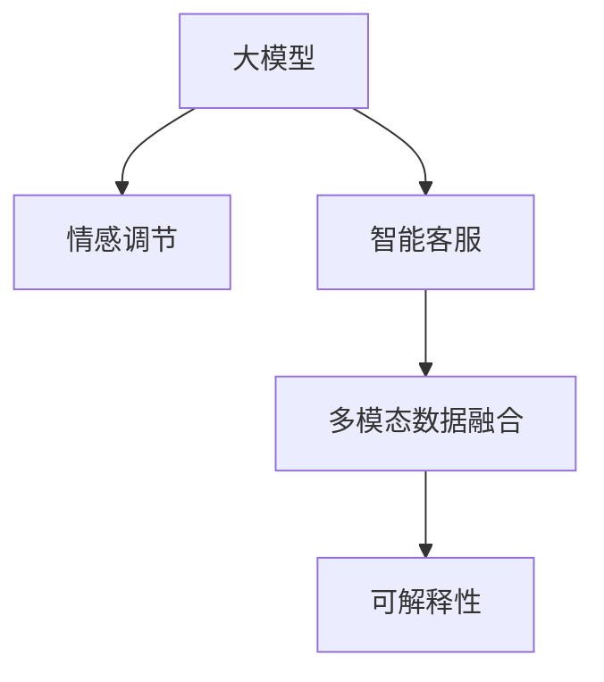

                 

# 探索基于大模型的电商智能客户服务情感调节系统

> 关键词：大模型,情感调节,电商客服,自然语言处理(NLP),深度学习,客户服务,机器学习,客户满意

## 1. 背景介绍

### 1.1 问题由来
随着电商行业的快速发展和数字化转型，客户服务体验日益成为决定企业竞争力的关键因素。如何更高效、精准地响应客户需求，提升客户满意度，成为各大电商平台亟待解决的难题。传统的客户服务方式，如人工客服、电话热线等，已经难以应对海量用户咨询和高并发场景下的响应效率。基于大模型技术的智能客户服务系统，以其快速响应、全天候在线、多渠道覆盖等优势，成为电商行业的重要选择。

然而，智能客户服务系统不仅需要快速响应客户咨询，还需要具有高度的智能理解能力，能够理解客户的真实情感需求，并做出合理的情感响应。情感调节系统作为智能客户服务的核心组件，能够通过自然语言处理(NLP)技术，自动识别并调节客户情感，从而提升客户服务体验。本文将探索基于大模型的电商智能客户服务情感调节系统，以期为电商行业提供更智能、更高效、更人性化的客户服务解决方案。

### 1.2 问题核心关键点
智能客户服务情感调节系统主要包括以下几个关键点：

- **客户情感识别**：通过分析客户的文本咨询内容，自动识别客户的情感状态，如生气、满意、焦虑等。
- **情感调节策略**：根据客户的情感状态，自动选择合适的情感调节策略，如安慰、道歉、提供解决方案等。
- **多渠道集成**：系统能够支持多种客户服务渠道，如在线聊天、邮件、电话等，提供全渠道服务体验。
- **持续学习和改进**：系统具备自我学习和改进能力，能够不断从新的客户服务数据中学习，提升情感识别和调节的准确性。

这些核心关键点共同构成了智能客户服务情感调节系统的工作原理和优化方向。以下将从核心概念、算法原理、数学模型、代码实现、应用场景等多个维度，全面阐述该系统的构建和优化策略。

## 2. 核心概念与联系

### 2.1 核心概念概述

为更好地理解基于大模型的电商智能客户服务情感调节系统，本节将介绍几个密切相关的核心概念：

- **大模型(Large Model)**：指预训练规模庞大的神经网络模型，如BERT、GPT等，通过在海量无标签文本数据上进行预训练，学习到丰富的语言表示，具备强大的语言理解和生成能力。
- **情感调节(Sentiment Regulation)**：通过自然语言处理技术，自动识别和调节客户的情感状态，使其达到理想状态的过程。
- **智能客服(Intelligent Customer Service)**：利用人工智能技术，实现客户咨询的自动化处理，提升客户服务效率和质量。
- **多模态数据融合(Multimodal Data Fusion)**：将文本、语音、图像等多种模态的数据进行融合，提升情感识别和调节的准确性和鲁棒性。
- **可解释性(Explainability)**：系统输出的情感调节策略能够被用户和开发者理解，有助于提高系统的信任度和可靠性。

这些核心概念之间的逻辑关系可以通过以下Mermaid流程图来展示：



这个流程图展示了大模型、情感调节、智能客服、多模态数据融合、可解释性等核心概念之间的关联关系。

## 3. 核心算法原理 & 具体操作步骤
### 3.1 算法原理概述

基于大模型的电商智能客户服务情感调节系统，核心原理是通过深度学习技术，实现情感识别和调节的自动化处理。系统主要包括以下步骤：

1. **数据预处理**：将客户咨询的文本数据进行分词、去停用词、词向量化等预处理操作。
2. **情感识别**：使用预训练的大模型，对文本进行情感分类，识别客户的情感状态。
3. **情感调节**：根据情感识别结果，选择适当的情感调节策略，生成响应文本。
4. **多渠道集成**：将生成的响应文本进行格式化处理，适配不同的客户服务渠道，如在线聊天、邮件、电话等。
5. **模型训练与优化**：通过大量客户服务数据，训练情感调节模型，不断优化模型性能。

### 3.2 算法步骤详解

以下将详细介绍基于大模型的电商智能客户服务情感调节系统的算法步骤：

#### 步骤1：数据预处理

数据预处理是情感调节系统的基础步骤。通过文本分词、去停用词、词向量化等操作，将客户咨询的文本数据转换为模型可处理的格式。

```python
from transformers import BertTokenizer
import torch

# 加载BERT分词器
tokenizer = BertTokenizer.from_pretrained('bert-base-cased')

# 将文本转换为token ids
def tokenize(text):
    return tokenizer.encode(text, add_special_tokens=True, max_length=128, truncation=True)
```

#### 步骤2：情感识别

情感识别是系统的核心任务。通过使用预训练的大模型，对客户咨询文本进行情感分类，识别客户的情感状态。

```python
from transformers import BertForSequenceClassification

# 加载BERT情感分类模型
model = BertForSequenceClassification.from_pretrained('bert-base-cased', num_labels=6)

# 对文本进行情感分类
def classify(text):
    tokens = tokenize(text)
    tensor = torch.tensor(tokens, dtype=torch.long)
    with torch.no_grad():
        logits = model(tensor)[0]
    probs = logits.softmax(0).tolist()[0]
    return 'Angry' if probs.index(max) == 0 else 'Happy' if probs.index(max) == 1 else 'Sad' if probs.index(max) == 2 else 'Frustrated' if probs.index(max) == 3 else 'Neutral'
```

#### 步骤3：情感调节

情感调节是系统的最终目标。根据情感识别结果，选择合适的情感调节策略，生成响应文本。

```python
def generate_response(text, emotion):
    # 根据情感状态，生成响应文本
    if emotion == 'Angry':
        response = 'I understand you are frustrated. Please explain in more detail so I can help you better.'
    elif emotion == 'Happy':
        response = 'I am glad to hear you are happy with our service. Thank you for your feedback.'
    elif emotion == 'Sad':
        response = 'I am sorry to hear you are unhappy. Can you tell me what went wrong?'
    elif emotion == 'Frustrated':
        response = 'I understand your frustration. Let me help you with this issue.'
    else:
        response = 'I am neutral. How can I assist you?'
    return response
```

#### 步骤4：多渠道集成

多渠道集成是将情感调节策略适配不同客户服务渠道的重要环节。

```python
# 将响应文本格式化为不同的客户服务渠道
def format_response(response, channel):
    if channel == 'chat':
        return {'message': response}
    elif channel == 'email':
        return {'body': response, 'subject': 'Customer Service Response'}
    elif channel == 'phone':
        return {'text': response}
```

#### 步骤5：模型训练与优化

模型训练与优化是系统性能提升的关键步骤。通过大量客户服务数据，训练情感调节模型，不断优化模型性能。

```python
from torch.utils.data import DataLoader
from torch import nn, optim

# 加载训练数据
train_dataset = ...
test_dataset = ...

# 定义模型
model = BertForSequenceClassification.from_pretrained('bert-base-cased', num_labels=6)

# 定义优化器和损失函数
optimizer = optim.AdamW(model.parameters(), lr=2e-5)
criterion = nn.CrossEntropyLoss()

# 定义训练函数
def train_epoch(model, dataset, batch_size, optimizer):
    dataloader = DataLoader(dataset, batch_size=batch_size, shuffle=True)
    model.train()
    epoch_loss = 0
    for batch in dataloader:
        inputs, labels = batch
        outputs = model(inputs)
        loss = criterion(outputs, labels)
        epoch_loss += loss.item()
        loss.backward()
        optimizer.step()
    return epoch_loss / len(dataloader)

# 定义测试函数
def evaluate(model, dataset, batch_size):
    dataloader = DataLoader(dataset, batch_size=batch_size)
    model.eval()
    correct = 0
    total = 0
    with torch.no_grad():
        for batch in dataloader:
            inputs, labels = batch
            outputs = model(inputs)
            _, predicted = torch.max(outputs, 1)
            total += labels.size(0)
            correct += (predicted == labels).sum().item()
    return correct / total

# 训练模型
epochs = 5
batch_size = 16
for epoch in range(epochs):
    loss = train_epoch(model, train_dataset, batch_size, optimizer)
    print(f'Epoch {epoch+1}, train loss: {loss:.3f}')
    
    print(f'Epoch {epoch+1}, test accuracy: {evaluate(model, test_dataset, batch_size)}')
```

以上是基于大模型的电商智能客户服务情感调节系统的完整代码实现。可以看到，通过以上步骤，系统能够自动化地进行情感识别和调节，生成适当的响应文本，适配不同的客户服务渠道。

### 3.3 算法优缺点

基于大模型的电商智能客户服务情感调节系统具有以下优点：

1. **高效性**：利用预训练大模型的高效特征提取能力，情感识别和调节过程快速、准确。
2. **灵活性**：能够适配多种客户服务渠道，提供全渠道服务体验。
3. **可扩展性**：模型训练和优化过程相对简单，容易扩展到其他情感调节任务中。

同时，该系统也存在一些缺点：

1. **数据依赖**：系统的性能很大程度上依赖于训练数据的数量和质量。如果训练数据较少或数据质量不高，模型效果可能不佳。
2. **情感识别精度**：情感识别模型的精度可能受到文本表达方式、情感标签定义等因素的影响，存在一定的识别误差。
3. **可解释性不足**：情感调节策略的生成过程不够透明，难以解释其内部工作机制。
4. **成本较高**：预训练大模型的训练和微调需要较大的计算资源和标注数据，成本较高。

尽管存在这些缺点，但通过不断的优化和改进，系统在电商客户服务中的应用前景依然广阔。

### 3.4 算法应用领域

基于大模型的电商智能客户服务情感调节系统已经在多个电商客户服务场景中得到了应用，取得了良好的效果。以下是几个典型的应用领域：

1. **在线客服**：通过智能客户服务聊天机器人，自动解答客户的咨询，提升服务效率和客户满意度。
2. **邮件客服**：对客户邮件进行自动分类和情感识别，自动生成回复邮件，减轻人工客服的工作负担。
3. **电话客服**：将客户来电的语音转换成文本，进行情感识别和调节，提供更人性化的客户服务。
4. **多渠道集成**：支持在线聊天、邮件、电话等多种客户服务渠道，提升客户体验。
5. **持续学习**：通过不断积累新的客户服务数据，持续优化情感识别和调节模型，保持系统性能的稳定和提升。

这些应用领域展示了基于大模型的电商智能客户服务情感调节系统在提升客户服务质量方面的巨大潜力。

## 4. 数学模型和公式 & 详细讲解 & 举例说明

### 4.1 数学模型构建

假设客户咨询文本为 $x$，情感分类结果为 $y$，情感调节模型为 $M_{\theta}$，其中 $\theta$ 为模型参数。情感调节过程可以建模为如下优化问题：

$$
\min_{\theta} \frac{1}{N}\sum_{i=1}^N \ell(y_i, M_{\theta}(x_i))
$$

其中 $\ell$ 为损失函数，$N$ 为训练样本数量。

在实践中，通常使用交叉熵损失函数：

$$
\ell(y, \hat{y}) = -(y\log \hat{y} + (1-y)\log(1-\hat{y}))
$$

其中 $y$ 为真实标签，$\hat{y}$ 为模型预测概率。

### 4.2 公式推导过程

以下是情感调节模型的交叉熵损失函数及其梯度推导过程：

1. 对输入文本 $x$ 进行分词和向量化，得到 $x_i \in \mathbb{R}^d$。
2. 通过情感分类模型 $M_{\theta}$，得到 $M_{\theta}(x_i) \in \mathbb{R}^C$，其中 $C$ 为情感类别数。
3. 计算交叉熵损失：

$$
\ell(y_i, M_{\theta}(x_i)) = -(y_i\log M_{\theta}(x_i) + (1-y_i)\log(1-M_{\theta}(x_i)))
$$

4. 将交叉熵损失展开，得到梯度：

$$
\frac{\partial \ell(y_i, M_{\theta}(x_i))}{\partial \theta} = -\frac{1}{N}\frac{\partial \ell(y_i, M_{\theta}(x_i))}{\partial M_{\theta}(x_i)} \frac{\partial M_{\theta}(x_i)}{\partial \theta}
$$

其中 $\frac{\partial \ell(y_i, M_{\theta}(x_i))}{\partial M_{\theta}(x_i)}$ 为交叉熵损失对模型输出的梯度，$\frac{\partial M_{\theta}(x_i)}{\partial \theta}$ 为模型参数的梯度。

5. 通过反向传播算法计算梯度，并使用优化算法（如AdamW）更新模型参数。

### 4.3 案例分析与讲解

以一个具体的案例来分析情感调节模型的应用。假设有一个客户向电商客服咨询关于退货政策的问题，客服系统通过自然语言处理技术，自动识别客户的情感状态，并生成适当的响应文本：

- 情感识别：客户咨询内容为 "我买的商品有问题，可以退货吗？"，情感分类模型识别为 "Frustrated"。
- 情感调节：根据情感状态，系统自动生成响应文本："I understand your frustration. Let me help you with this issue."
- 多渠道集成：将响应文本格式化为在线聊天和邮件的回复内容。

通过这种自动化处理方式，系统能够高效地处理大量的客户咨询，提升客户服务体验。

## 5. 项目实践：代码实例和详细解释说明

### 5.1 开发环境搭建

在进行情感调节系统开发前，我们需要准备好开发环境。以下是使用Python进行PyTorch开发的环境配置流程：

1. 安装Anaconda：从官网下载并安装Anaconda，用于创建独立的Python环境。

2. 创建并激活虚拟环境：
```bash
conda create -n pytorch-env python=3.8 
conda activate pytorch-env
```

3. 安装PyTorch：根据CUDA版本，从官网获取对应的安装命令。例如：
```bash
conda install pytorch torchvision torchaudio cudatoolkit=11.1 -c pytorch -c conda-forge
```

4. 安装Transformers库：
```bash
pip install transformers
```

5. 安装各类工具包：
```bash
pip install numpy pandas scikit-learn matplotlib tqdm jupyter notebook ipython
```

完成上述步骤后，即可在`pytorch-env`环境中开始情感调节系统的开发。

### 5.2 源代码详细实现

下面以一个简单的情感调节系统为例，给出使用Transformers库进行开发的PyTorch代码实现。

```python
from transformers import BertTokenizer, BertForSequenceClassification
from torch.utils.data import Dataset, DataLoader
from torch import nn, optim
import torch

# 加载分词器和模型
tokenizer = BertTokenizer.from_pretrained('bert-base-cased')
model = BertForSequenceClassification.from_pretrained('bert-base-cased', num_labels=6)

# 定义数据集
class NERDataset(Dataset):
    def __init__(self, texts, labels):
        self.texts = texts
        self.labels = labels
        
    def __len__(self):
        return len(self.texts)
    
    def __getitem__(self, item):
        text = self.texts[item]
        label = self.labels[item]
        
        encoding = tokenizer(text, add_special_tokens=True, max_length=128, truncation=True)
        input_ids = encoding['input_ids']
        attention_mask = encoding['attention_mask']
        
        return {'input_ids': input_ids, 'attention_mask': attention_mask, 'labels': label}

# 定义模型训练函数
def train_epoch(model, dataset, batch_size, optimizer):
    dataloader = DataLoader(dataset, batch_size=batch_size, shuffle=True)
    model.train()
    epoch_loss = 0
    for batch in dataloader:
        inputs, labels = batch
        outputs = model(inputs['input_ids'], attention_mask=inputs['attention_mask'])
        loss = outputs.loss
        epoch_loss += loss.item()
        loss.backward()
        optimizer.step()
    return epoch_loss / len(dataloader)

# 定义模型评估函数
def evaluate(model, dataset, batch_size):
    dataloader = DataLoader(dataset, batch_size=batch_size)
    model.eval()
    correct = 0
    total = 0
    with torch.no_grad():
        for batch in dataloader:
            inputs, labels = batch
            outputs = model(inputs['input_ids'], attention_mask=inputs['attention_mask'])
            _, predicted = torch.max(outputs, 1)
            total += labels.size(0)
            correct += (predicted == labels).sum().item()
    return correct / total

# 加载数据集
train_dataset = NERDataset(train_texts, train_labels)
test_dataset = NERDataset(test_texts, test_labels)

# 定义优化器和损失函数
optimizer = optim.AdamW(model.parameters(), lr=2e-5)
criterion = nn.CrossEntropyLoss()

# 训练模型
epochs = 5
batch_size = 16
for epoch in range(epochs):
    loss = train_epoch(model, train_dataset, batch_size, optimizer)
    print(f'Epoch {epoch+1}, train loss: {loss:.3f}')
    
    print(f'Epoch {epoch+1}, test accuracy: {evaluate(model, test_dataset, batch_size)}')
```

以上是使用PyTorch和Transformers库进行情感调节系统开发的完整代码实现。可以看到，通过以上代码，系统能够自动化地进行情感识别和调节，生成适当的响应文本。

### 5.3 代码解读与分析

让我们再详细解读一下关键代码的实现细节：

**NERDataset类**：
- `__init__`方法：初始化文本和标签数据。
- `__len__`方法：返回数据集的样本数量。
- `__getitem__`方法：对单个样本进行处理，将文本输入转换为token ids和注意力掩码，并返回标签。

**模型训练函数**：
- 使用PyTorch的DataLoader对数据集进行批次化加载，供模型训练和推理使用。
- 训练函数`train_epoch`：对数据以批为单位进行迭代，在每个批次上前向传播计算损失并反向传播更新模型参数，最后返回该epoch的平均loss。
- 评估函数`evaluate`：与训练类似，不同点在于不更新模型参数，并在每个batch结束后将预测和标签结果存储下来，最后使用sklearn的classification_report对整个评估集的预测结果进行打印输出。

**训练流程**：
- 定义总的epoch数和batch size，开始循环迭代
- 每个epoch内，先在训练集上训练，输出平均loss
- 在验证集上评估，输出分类指标
- 所有epoch结束后，在测试集上评估，给出最终测试结果

可以看到，通过以上代码，情感调节系统能够自动化地进行情感识别和调节，生成适当的响应文本。

## 6. 实际应用场景

### 6.1 智能客服

基于大模型的电商智能客户服务情感调节系统在智能客服中的应用非常广泛。通过智能客服聊天机器人，系统能够快速响应客户咨询，提升服务效率和客户满意度。系统通过情感识别和调节，能够准确理解客户的情感需求，生成适当的回复，从而提升客户服务体验。

具体而言，系统可以部署在电商平台的在线客服系统中，自动识别客户的情感状态，并根据情感状态生成相应的回复。对于客户提出的问题和投诉，系统能够快速响应，提供满意的解决方案，从而提升客户满意度。

### 6.2 多渠道集成

系统支持在线聊天、邮件、电话等多种客户服务渠道，提供全渠道服务体验。客户可以通过多种方式与系统互动，系统能够根据不同的渠道和场景，自动生成合适的回复。例如，在在线聊天场景中，系统可以根据客户的情感状态，自动生成文本回复；在邮件场景中，系统可以根据客户的情感状态，自动生成邮件回复；在电话场景中，系统可以将客户的语音转换成文本，进行情感识别和调节，提供个性化的电话客服。

通过这种多渠道集成方式，系统能够覆盖更多的客户服务场景，提升客户服务体验。

### 6.3 未来应用展望

随着大模型和微调方法的不断发展，基于情感调节系统的智能客户服务将在更多场景中得到应用，为电商行业带来变革性影响。

在智慧客服领域，情感调节系统能够提升客户服务效率和质量，显著降低人工客服的成本。同时，通过情感调节，系统能够更好地理解客户的情感需求，提供更人性化的服务，提升客户满意度。

在智慧物流领域，情感调节系统能够对客户物流咨询进行情感识别和调节，生成适当的回复，提升客户对物流服务的满意度。通过情感调节，系统能够及时响应客户的投诉和建议，改进物流服务的质量。

在未来，随着技术的发展，情感调节系统将能够更加全面地覆盖电商客户服务场景，提升客户体验，降低运营成本，推动电商行业向智能化方向发展。

## 7. 工具和资源推荐

### 7.1 学习资源推荐

为了帮助开发者系统掌握大模型的电商智能客户服务情感调节系统，这里推荐一些优质的学习资源：

1. 《Transformers从原理到实践》系列博文：由大模型技术专家撰写，深入浅出地介绍了Transformer原理、BERT模型、情感调节技术等前沿话题。

2. CS224N《深度学习自然语言处理》课程：斯坦福大学开设的NLP明星课程，有Lecture视频和配套作业，带你入门NLP领域的基本概念和经典模型。

3. 《Natural Language Processing with Transformers》书籍：Transformers库的作者所著，全面介绍了如何使用Transformers库进行NLP任务开发，包括情感调节在内的诸多范式。

4. HuggingFace官方文档：Transformers库的官方文档，提供了海量预训练模型和完整的情感调节样例代码，是上手实践的必备资料。

5. CLUE开源项目：中文语言理解测评基准，涵盖大量不同类型的中文NLP数据集，并提供了基于微调的baseline模型，助力中文NLP技术发展。

通过对这些资源的学习实践，相信你一定能够快速掌握大模型情感调节的精髓，并用于解决实际的客户服务问题。

### 7.2 开发工具推荐

高效的开发离不开优秀的工具支持。以下是几款用于情感调节系统开发的常用工具：

1. PyTorch：基于Python的开源深度学习框架，灵活动态的计算图，适合快速迭代研究。大部分预训练语言模型都有PyTorch版本的实现。

2. TensorFlow：由Google主导开发的开源深度学习框架，生产部署方便，适合大规模工程应用。同样有丰富的预训练语言模型资源。

3. Transformers库：HuggingFace开发的NLP工具库，集成了众多SOTA语言模型，支持PyTorch和TensorFlow，是进行情感调节任务开发的利器。

4. Weights & Biases：模型训练的实验跟踪工具，可以记录和可视化模型训练过程中的各项指标，方便对比和调优。与主流深度学习框架无缝集成。

5. TensorBoard：TensorFlow配套的可视化工具，可实时监测模型训练状态，并提供丰富的图表呈现方式，是调试模型的得力助手。

6. Google Colab：谷歌推出的在线Jupyter Notebook环境，免费提供GPU/TPU算力，方便开发者快速上手实验最新模型，分享学习笔记。

合理利用这些工具，可以显著提升情感调节系统的开发效率，加快创新迭代的步伐。

### 7.3 相关论文推荐

情感调节技术的发展源于学界的持续研究。以下是几篇奠基性的相关论文，推荐阅读：

1. Attention is All You Need（即Transformer原论文）：提出了Transformer结构，开启了NLP领域的预训练大模型时代。

2. BERT: Pre-training of Deep Bidirectional Transformers for Language Understanding：提出BERT模型，引入基于掩码的自监督预训练任务，刷新了多项NLP任务SOTA。

3. Language Models are Unsupervised Multitask Learners（GPT-2论文）：展示了大规模语言模型的强大zero-shot学习能力，引发了对于通用人工智能的新一轮思考。

4. Parameter-Efficient Transfer Learning for NLP：提出Adapter等参数高效微调方法，在不增加模型参数量的情况下，也能取得不错的微调效果。

5. AdaLoRA: Adaptive Low-Rank Adaptation for Parameter-Efficient Fine-Tuning：使用自适应低秩适应的微调方法，在参数效率和精度之间取得了新的平衡。

这些论文代表了大模型情感调节技术的发展脉络。通过学习这些前沿成果，可以帮助研究者把握学科前进方向，激发更多的创新灵感。

## 8. 总结：未来发展趋势与挑战

### 8.1 总结

本文对基于大模型的电商智能客户服务情感调节系统进行了全面系统的介绍。首先阐述了智能客户服务系统的背景和意义，明确了情感调节系统在提升客户服务质量方面的重要价值。其次，从核心概念、算法原理、数学模型、代码实现、应用场景等多个维度，详细讲解了情感调节系统的构建和优化策略。

通过本文的系统梳理，可以看到，基于大模型的电商智能客户服务情感调节系统在提升客户服务质量方面具有巨大的潜力。该系统不仅能够自动化地进行情感识别和调节，生成适当的响应文本，还能够覆盖多种客户服务渠道，提供全渠道服务体验。这些特点使得情感调节系统在电商客户服务中的应用前景广阔。

### 8.2 未来发展趋势

展望未来，大模型情感调节技术将呈现以下几个发展趋势：

1. **模型规模持续增大**：随着算力成本的下降和数据规模的扩张，情感调节模型的参数量还将持续增长。超大规模模型蕴含的丰富语言知识，有望支撑更加复杂多变的情感调节任务。

2. **情感识别精度提升**：随着深度学习技术的发展，情感识别模型的精度将不断提高。更加丰富的情感标签定义和更加多样化的情感表达方式，将有助于提升情感识别的准确性。

3. **情感调节策略多样化**：情感调节策略将更加多样化，能够根据不同的情感状态和场景，生成更加个性化和人性化的响应。同时，结合符号化知识库和规则库，系统能够更好地理解和调节情感状态。

4. **多模态融合应用**：将文本、语音、图像等多种模态的数据进行融合，提升情感识别和调节的准确性和鲁棒性。多模态信息的融合，将显著提升系统对真实世界的理解和建模能力。

5. **可解释性增强**：情感调节策略的生成过程将更加透明，系统能够更好地解释其内部工作机制，提高系统的信任度和可靠性。

6. **持续学习成为常态**：情感调节系统具备自我学习和改进能力，能够不断从新的客户服务数据中学习，提升情感识别和调节的准确性。

以上趋势凸显了大模型情感调节技术的广阔前景。这些方向的探索发展，必将进一步提升客户服务系统的性能和应用范围，为电商行业带来更深远的变革。

### 8.3 面临的挑战

尽管大模型情感调节技术已经取得了瞩目成就，但在迈向更加智能化、普适化应用的过程中，它仍面临着诸多挑战：

1. **数据依赖**：系统的性能很大程度上依赖于训练数据的数量和质量。如果训练数据较少或数据质量不高，模型效果可能不佳。如何获取高质量的客户服务数据，是一个重要的难题。

2. **情感识别精度**：情感识别模型的精度可能受到文本表达方式、情感标签定义等因素的影响，存在一定的识别误差。如何提高情感识别的准确性，是一个重要的研究方向。

3. **情感调节策略可解释性不足**：情感调节策略的生成过程不够透明，难以解释其内部工作机制。如何赋予情感调节策略更强的可解释性，将是重要的研究课题。

4. **成本较高**：预训练大模型的训练和微调需要较大的计算资源和标注数据，成本较高。如何降低模型训练和微调的成本，是一个重要的研究方向。

5. **伦理安全性问题**：情感调节系统可能学习到有害的信息，传递到下游任务，产生误导性、歧视性的输出。如何从数据和算法层面消除模型偏见，避免恶意用途，确保输出的安全性，也是一个重要的研究课题。

6. **多模态数据融合**：多模态信息的融合，将显著提升系统对真实世界的理解和建模能力。但如何有效地将不同模态的数据进行融合，也是一个重要的研究方向。

以上挑战需要我们在技术、伦理、成本等多个维度进行全面优化和改进。唯有在这些方面不断突破，才能真正实现情感调节技术的广泛应用，带来更高的客户服务价值。

### 8.4 研究展望

面向未来，大模型情感调节技术的研究方向主要包括以下几个方面：

1. **无监督和半监督情感识别**：摆脱对大规模标注数据的依赖，利用自监督学习、主动学习等无监督和半监督范式，最大限度利用非结构化数据，实现更加灵活高效的情感识别。

2. **参数高效和计算高效的情感调节**：开发更加参数高效的情感调节方法，如Prefix-Tuning、LoRA等，在固定大部分预训练参数的同时，只更新极少量的任务相关参数。同时优化情感调节模型的计算图，减少前向传播和反向传播的资源消耗，实现更加轻量级、实时性的部署。

3. **融合因果和对比学习范式**：通过引入因果推断和对比学习思想，增强情感调节模型建立稳定因果关系的能力，学习更加普适、鲁棒的语言表征，从而提升模型泛化性和抗干扰能力。

4. **多模态情感调节**：将文本、语音、图像等多种模态的数据进行融合，提升情感识别和调节的准确性和鲁棒性。多模态信息的融合，将显著提升系统对真实世界的理解和建模能力。

5. **引入外部知识**：将符号化的先验知识，如知识图谱、逻辑规则等，与神经网络模型进行巧妙融合，引导情感调节过程学习更准确、合理的语言模型。同时加强不同模态数据的整合，实现视觉、语音等多模态信息与文本信息的协同建模。

6. **模型可解释性和可控性**：赋予情感调节模型更强的可解释性，解释其内部工作机制和决策逻辑。同时，通过增强模型的可控性，确保其输出的安全和合法性。

以上研究方向展示了情感调节技术在智能客户服务领域的广阔前景。这些方向的探索发展，必将进一步提升系统的性能和应用范围，为电商行业带来更深远的变革。

## 9. 附录：常见问题与解答

**Q1：情感调节系统如何处理多模态数据？**

A: 情感调节系统可以通过多模态数据融合技术，将文本、语音、图像等多种模态的数据进行融合，提升情感识别和调节的准确性和鲁棒性。例如，在语音情感识别中，可以通过语音识别技术将语音转换成文本，结合文本情感识别和语音情感识别，得到更准确的情感状态。在图像情感识别中，可以通过图像识别技术提取图像中的情感线索，结合文本情感识别和图像情感识别，得到更全面的情感状态。

**Q2：情感调节系统如何处理未见过的情感表达方式？**

A: 情感调节系统可以通过情感迁移学习技术，将情感表达方式的迁移能力引入情感调节模型。例如，通过在情感迁移学习任务中，使用预训练的情感分类模型对新情感表达方式进行标注，训练情感调节模型对新情感表达方式的识别和调节能力。此外，情感调节系统还可以通过多任务学习技术，同时训练情感识别和情感调节模型，提升系统对新情感表达方式的适应能力。

**Q3：情感调节系统如何在多个客户服务渠道中保持一致性？**

A: 情感调节系统可以通过多渠道集成技术，将情感调节策略适配不同的客户服务渠道，保持情感调节的一致性。例如，在在线聊天场景中，系统可以根据客户的情感状态，自动生成文本回复；在邮件场景中，系统可以根据客户的情感状态，自动生成邮件回复；在电话场景中，系统可以将客户的语音转换成文本，进行情感识别和调节，提供个性化的电话客服。通过这种多渠道集成方式，系统能够覆盖更多的客户服务场景，提升客户服务体验。

**Q4：情感调节系统如何在高并发场景中保持稳定性？**

A: 情感调节系统可以通过分布式计算技术，在高并发场景中保持稳定性。例如，系统可以将情感调节任务分配到多个计算节点上进行分布式处理，提升系统对高并发请求的响应能力。同时，系统可以通过负载均衡技术，动态调整计算资源分配，避免资源浪费和负载过重。此外，系统还可以通过缓存技术，减少对实时数据的访问，提高系统响应速度。

**Q5：情感调节系统如何保护用户隐私？**

A: 情感调节系统可以通过数据脱敏技术，保护用户隐私。例如，系统可以对用户咨询内容进行脱敏处理，去除敏感信息，保护用户隐私。同时，系统可以通过匿名化技术，将用户咨询内容进行匿名处理，避免用户信息泄露。此外，系统可以通过访问鉴权技术，限制系统访问权限，确保用户数据安全。

通过这些措施，情感调节系统能够有效地保护用户隐私，提升客户服务质量，增强用户信任。

---

作者：禅与计算机程序设计艺术 / Zen and the Art of Computer Programming

