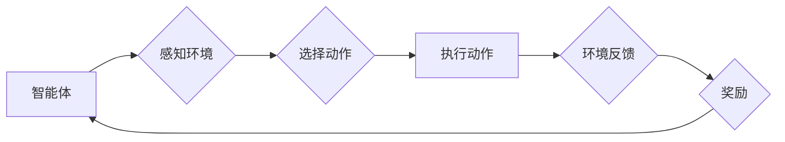

> 强化学习，电子游戏，游戏AI，深度强化学习，Q学习，价值函数，策略梯度

## 1. 背景介绍

电子游戏作为一种娱乐和休闲活动，近年来发展迅速，其技术水平也日益提高。其中，游戏人工智能（Game AI）是游戏开发中一个重要的组成部分，它赋予游戏角色智能行为，使游戏更加生动和富有挑战性。传统的基于规则的游戏AI往往难以应对复杂的游戏环境和玩家策略，而强化学习（Reinforcement Learning，RL）作为一种机器学习方法，为游戏AI的发展提供了新的思路和可能性。

强化学习是一种基于交互学习的机器学习方法，它通过让智能体在环境中进行交互，并根据其行为获得奖励或惩罚，从而学习最优的策略。在电子游戏领域，智能体可以是游戏角色，环境可以是游戏世界，奖励可以是完成任务或获得分数，惩罚可以是失败或损失生命值。通过不断地学习和调整策略，强化学习算法可以使游戏AI在游戏中取得更好的表现。

## 2. 核心概念与联系

**2.1 强化学习核心概念**

* **智能体（Agent）：** 在强化学习中，智能体是做出决策和采取行动的实体。在电子游戏中，智能体通常是游戏角色。
* **环境（Environment）：** 环境是智能体所处的外部世界，它会根据智能体的行动做出相应的反应。在电子游戏中，环境通常是游戏世界。
* **状态（State）：** 状态描述了智能体和环境在某个时刻的状况。
* **动作（Action）：** 动作是智能体在某个状态下可以采取的行动。
* **奖励（Reward）：** 奖励是智能体在采取某个动作后获得的反馈，它可以是正向的（例如获得分数）或负向的（例如损失生命值）。
* **策略（Policy）：** 策略是智能体在不同状态下选择动作的规则。

**2.2 强化学习流程图**



**2.3 强化学习与电子游戏的关系**

在电子游戏中，智能体可以利用强化学习算法学习最优的策略，以完成游戏目标，例如：

* **角色控制：** 强化学习可以训练游戏角色自动控制，例如自动躲避攻击、寻找资源、完成任务等。
* **游戏难度调节：** 强化学习可以根据玩家的水平动态调整游戏难度，提供更具挑战性和趣味性的游戏体验。
* **游戏剧情设计：** 强化学习可以用于设计更具随机性和沉浸感的游戏剧情，让玩家体验更丰富的游戏世界。

## 3. 核心算法原理 & 具体操作步骤

### 3.1 算法原理概述

Q学习是强化学习中一种经典的算法，它通过学习一个Q表来估计在每个状态下采取每个动作的期望回报。Q表是一个表格，其中每个单元格表示在某个状态下采取某个动作的期望回报。

Q学习算法的基本思想是：

1. 在初始状态下，Q表中的所有值都设置为0。
2. 智能体在环境中进行交互，并根据其行为获得奖励或惩罚。
3. 根据Bellman方程更新Q表中的值，使Q表中的值越来越接近真实期望回报。
4. 智能体根据Q表中的值选择最优的动作，并重复步骤2-3。

### 3.2 算法步骤详解

1. **初始化Q表:** 创建一个Q表，其中每个单元格表示在某个状态下采取某个动作的期望回报。
2. **选择初始状态:** 从环境中随机选择一个初始状态。
3. **选择动作:** 根据当前状态和Q表中的值，选择一个动作。
4. **执行动作:** 在环境中执行选择的动作。
5. **获得奖励:** 从环境中获得奖励。
6. **更新Q表:** 根据Bellman方程更新Q表中的值。
7. **重复步骤2-6:** 直到达到终止条件，例如游戏结束或训练次数达到上限。

### 3.3 算法优缺点

**优点:**

* 算法简单易懂，易于实现。
* 可以应用于离散状态和动作空间的场景。

**缺点:**

* 随着状态和动作空间的增加，Q表的规模会指数级增长，导致计算量巨大。
* 难以处理连续状态和动作空间的场景。

### 3.4 算法应用领域

Q学习算法广泛应用于各种领域，例如：

* **游戏AI:** 训练游戏角色自动控制，例如自动躲避攻击、寻找资源、完成任务等。
* **机器人控制:** 训练机器人自动完成任务，例如导航、抓取、搬运等。
* **推荐系统:** 建议用户感兴趣的内容，例如电影、音乐、商品等。

## 4. 数学模型和公式 & 详细讲解 & 举例说明

### 4.1 数学模型构建

强化学习的数学模型主要包括状态空间、动作空间、奖励函数和价值函数。

* **状态空间 (S):** 所有可能的智能体状态的集合。
* **动作空间 (A):** 智能体在每个状态下可以采取的所有动作的集合。
* **奖励函数 (R):** 描述智能体在某个状态采取某个动作后获得的奖励的函数。
* **价值函数 (V):** 描述智能体在某个状态下采取最优策略的期望回报的函数。

### 4.2 公式推导过程

Q学习算法的核心公式是Bellman方程：

$$Q(s, a) = R(s, a) + \gamma \max_{a'} Q(s', a')$$

其中：

* $Q(s, a)$ 表示在状态 $s$ 下采取动作 $a$ 的期望回报。
* $R(s, a)$ 表示在状态 $s$ 下采取动作 $a$ 后获得的奖励。
* $\gamma$ 是折扣因子，表示未来奖励的权重。
* $s'$ 是采取动作 $a$ 后进入的下一个状态。
* $a'$ 是在下一个状态 $s'$ 下采取的最优动作。

### 4.3 案例分析与讲解

假设有一个简单的电子游戏，智能体需要在两个状态之间切换，每个状态都有两个动作可以选择。

* 状态 1: 智能体在起点。
* 状态 2: 智能体在终点。
* 动作 1: 向右移动。
* 动作 2: 向左移动。

奖励函数如下：

* 在状态 1 中采取动作 1，获得奖励 1。
* 在状态 2 中采取动作 2，获得奖励 10。

其他情况下，奖励为 0。

使用 Q学习算法，可以训练智能体学习最优策略，即在每个状态下选择最优动作，以获得最大的总奖励。

## 5. 项目实践：代码实例和详细解释说明

### 5.1 开发环境搭建

* Python 3.x
* TensorFlow 或 PyTorch

### 5.2 源代码详细实现

```python
import numpy as np

# 定义状态空间和动作空间
states = ['start', 'end']
actions = ['left', 'right']

# 定义奖励函数
reward_function = {
    ('start', 'right'): 1,
    ('end', 'left'): 10,
}

# 定义 Q 表
q_table = np.zeros((len(states), len(actions)))

# 定义学习参数
learning_rate = 0.1
discount_factor = 0.9

# Q 学习算法
def q_learning(state, action, reward, next_state):
    global q_table
    current_q = q_table[state_index, action_index]
    next_action = np.argmax(q_table[next_state_index])
    new_q = reward + discount_factor * q_table[next_state_index, next_action]
    q_table[state_index, action_index] = current_q + learning_rate * (new_q - current_q)

# 游戏循环
for episode in range(1000):
    state = 'start'
    state_index = states.index(state)
    while state != 'end':
        action = np.argmax(q_table[state_index])
        action_index = actions.index(action)
        reward = reward_function.get((state, action), 0)
        next_state = 'end' if state == 'start' and action == 'right' else 'start'
        next_state_index = states.index(next_state)
        q_learning(state, action, reward, next_state)
        state = next_state

# 打印 Q 表
print(q_table)
```

### 5.3 代码解读与分析

* 代码首先定义了状态空间、动作空间、奖励函数和 Q 表。
* 然后定义了 Q 学习算法，该算法根据 Bellman 方程更新 Q 表中的值。
* 游戏循环模拟了智能体在环境中进行交互的过程，并根据 Q 表中的值选择最优动作。
* 最后打印了训练后的 Q 表，可以看出智能体已经学会了最优策略。

### 5.4 运行结果展示

运行代码后，会输出训练后的 Q 表，其中每个单元格的值表示在对应状态下采取对应动作的期望回报。

## 6. 实际应用场景

### 6.1 游戏AI

* **角色控制:** 强化学习可以训练游戏角色自动控制，例如自动躲避攻击、寻找资源、完成任务等。
* **游戏难度调节:** 强化学习可以根据玩家的水平动态调整游戏难度，提供更具挑战性和趣味性的游戏体验。
* **游戏剧情设计:** 强化学习可以用于设计更具随机性和沉浸感的游戏剧情，让玩家体验更丰富的游戏世界。

### 6.2 其他领域

* **机器人控制:** 强化学习可以训练机器人自动完成任务，例如导航、抓取、搬运等。
* **推荐系统:** 建议用户感兴趣的内容，例如电影、音乐、商品等。
* **金融交易:** 自动进行股票交易，以最大化收益。

### 6.4 未来应用展望

随着人工智能技术的不断发展，强化学习在电子游戏领域的应用前景十分广阔。未来，强化学习可能被用于：

* **创造更智能、更具挑战性的游戏AI。**
* **开发更具沉浸感和交互性的游戏体验。**
* **生成更丰富的游戏内容，例如游戏关卡、游戏剧情等。**

## 7. 工具和资源推荐

### 7.1 学习资源推荐

* **书籍:**
    * Reinforcement Learning: An Introduction by Richard S. Sutton and Andrew G. Barto
    * Deep Reinforcement Learning Hands-On by Maxim Lapan
* **在线课程:**
    * Coursera: Reinforcement Learning Specialization by David Silver
    * Udacity: Deep Reinforcement Learning Nanodegree

### 7.2 开发工具推荐

* **TensorFlow:** 一个开源的机器学习框架，支持强化学习算法的实现。
* **PyTorch:** 另一个开源的机器学习框架，也支持强化学习算法的实现。
* **OpenAI Gym:** 一个强化学习库，提供各种环境和任务供开发者测试和训练强化学习算法。

### 7.3 相关论文推荐

* Deep Q-Network (DQN)
* Proximal Policy Optimization (PPO)
* Asynchronous Advantage Actor-Critic (A3C)

## 8. 总结：未来发展趋势与挑战

### 8.1 研究成果总结

近年来，强化学习在电子游戏领域取得了显著的成果，例如：

* 训练出能够与人类玩家匹敌的游戏AI。
* 开发出能够自动生成游戏关卡和游戏剧情的系统。
* 创造出更具沉浸感和交互性的游戏体验。

### 8.2 未来发展趋势

未来，强化学习在电子游戏领域的应用将继续发展，主要趋势包括：

* **更智能、更具挑战性的游戏AI:** 训练出能够学习和适应玩家策略的游戏AI，提供更具挑战性和趣味性的游戏体验。
* **更丰富的游戏