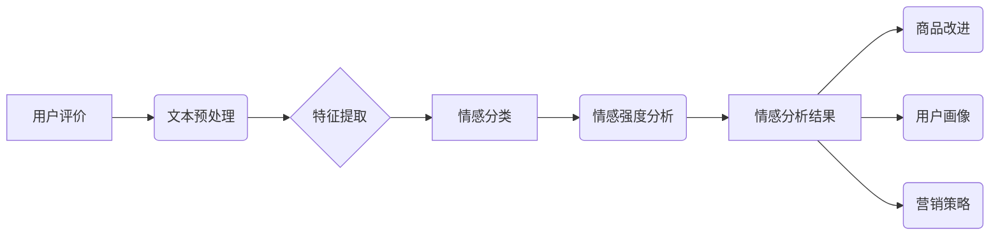

> 情感分析，电商，用户评价，商品改进，自然语言处理，机器学习，深度学习

## 1. 背景介绍

电子商务的蓬勃发展为消费者提供了便捷的购物体验，同时也为商家带来了海量用户评价数据。这些用户评价蕴含着丰富的商品信息和消费者的真实情感，是商家了解产品优缺点、改进产品设计和提升用户满意度的宝贵资源。情感分析作为一种能够从文本中识别和理解情感倾向的技术，在电商领域展现出巨大的应用潜力。

传统的电商平台主要依靠人工审核用户评价，效率低下且容易出现主观偏差。随着大数据时代的到来，情感分析技术逐渐被应用于电商领域，能够自动识别用户评价中的情感倾向，并将其转化为可量化的数据，为商家提供更精准、更有效的决策支持。

## 2. 核心概念与联系

情感分析的核心是识别和理解文本中的情感倾向，通常分为以下几个步骤：

1. **文本预处理:** 清洗文本数据，去除停用词、标点符号等无用信息，并将文本转换为适合模型处理的格式。
2. **特征提取:** 从预处理后的文本中提取情感相关的特征，例如关键词、词性、语法结构等。
3. **情感分类:** 根据提取的特征，将文本分类为正向、负向或中性情感。
4. **情感强度分析:** 除了情感类别，还可以分析情感的强度，例如非常满意、比较满意、一般、比较不满意、非常不满意等。

**情感分析技术架构**



## 3. 核心算法原理 & 具体操作步骤

### 3.1  算法原理概述

情感分析算法主要分为以下几种：

* **基于规则的算法:** 基于人工定义的规则和情感词典，识别文本中的情感倾向。
* **基于机器学习的算法:** 利用机器学习算法，从训练数据中学习情感分类模型，对新的文本进行情感分类。
* **基于深度学习的算法:** 利用深度神经网络，自动学习文本特征，实现更精准的情感分析。

### 3.2  算法步骤详解

以基于机器学习的算法为例，其具体操作步骤如下：

1. **数据收集:** 收集大量用户评价数据，并进行标注，将每个评价标记为正向、负向或中性情感。
2. **数据预处理:** 清洗文本数据，去除停用词、标点符号等无用信息，并将文本转换为适合模型处理的格式，例如词袋模型、TF-IDF等。
3. **模型训练:** 选择合适的机器学习算法，例如支持向量机、朴素贝叶斯、随机森林等，对预处理后的数据进行训练，学习情感分类模型。
4. **模型评估:** 使用测试数据对训练好的模型进行评估，计算模型的准确率、召回率、F1-score等指标，评估模型的性能。
5. **模型部署:** 将训练好的模型部署到线上环境，对新的用户评价数据进行情感分析。

### 3.3  算法优缺点

**基于规则的算法:**

* **优点:** 简单易实现，能够处理特定领域的文本数据。
* **缺点:** 规则难以覆盖所有情况，容易受到文本风格和语境的改变影响。

**基于机器学习的算法:**

* **优点:** 能够学习复杂的文本特征，对不同类型的文本数据具有较好的泛化能力。
* **缺点:** 需要大量的训练数据，训练过程耗时，模型解释性较差。

**基于深度学习的算法:**

* **优点:** 能够自动学习更深层次的文本特征，具有更高的准确率。
* **缺点:** 需要更强大的计算资源，训练过程更加复杂，模型解释性更差。

### 3.4  算法应用领域

情感分析算法广泛应用于电商领域，例如：

* **商品评价分析:** 分析用户对商品的评价，了解商品的优缺点，为商品改进提供参考。
* **客户服务优化:** 分析客户对客服服务的评价，识别客户不满意的方面，改进客服服务流程。
* **营销策略制定:** 分析用户对不同营销活动的评价，优化营销策略，提高营销效果。
* **品牌形象管理:** 分析用户对品牌的评价，了解品牌形象，及时调整品牌策略。

## 4. 数学模型和公式 & 详细讲解 & 举例说明

### 4.1  数学模型构建

情感分析模型通常采用分类模型，将文本分类为正向、负向或中性情感。常用的分类模型包括支持向量机（SVM）、朴素贝叶斯（NB）、逻辑回归（LR）等。

### 4.2  公式推导过程

以朴素贝叶斯算法为例，其核心公式为：

$$P(C|D) = \frac{P(D|C)P(C)}{P(D)}$$

其中：

* $P(C|D)$: 文本D属于类别C的概率。
* $P(D|C)$: 类别C下文本D出现的概率。
* $P(C)$: 类别C出现的概率。
* $P(D)$: 文本D出现的概率。

### 4.3  案例分析与讲解

假设我们有一个文本数据集，包含了正向、负向和中性情感的文本。我们可以使用朴素贝叶斯算法训练一个情感分类模型。

训练过程中，算法会计算每个类别下文本出现的概率，以及每个词语在不同类别下出现的概率。然后，根据贝叶斯公式，计算每个文本属于不同类别的概率。

例如，如果一个文本包含了“很好”、“喜欢”等词语，那么该文本属于正向情感的概率会比较高。反之，如果一个文本包含了“不好”、“不喜欢”等词语，那么该文本属于负向情感的概率会比较高。

## 5. 项目实践：代码实例和详细解释说明

### 5.1  开发环境搭建

* Python 3.x
* NLTK 自然语言处理库
* Scikit-learn 机器学习库
* TensorFlow 或 PyTorch 深度学习库

### 5.2  源代码详细实现

```python
import nltk
from nltk.corpus import stopwords
from sklearn.feature_extraction.text import TfidfVectorizer
from sklearn.model_selection import train_test_split
from sklearn.naive_bayes import MultinomialNB
from sklearn.metrics import accuracy_score

# 数据加载
data = [
    ("This movie is amazing!", "positive"),
    ("I hated this book.", "negative"),
    ("The food was okay.", "neutral"),
    # ...
]

# 数据预处理
stop_words = set(stopwords.words('english'))
def preprocess_text(text):
    text = text.lower()
    text = [word for word in text.split() if word not in stop_words]
    return " ".join(text)

processed_data = [(preprocess_text(text), label) for text, label in data]

# 特征提取
vectorizer = TfidfVectorizer()
X = vectorizer.fit_transform([text for text, label in processed_data])
y = [label for text, label in processed_data]

# 模型训练
X_train, X_test, y_train, y_test = train_test_split(X, y, test_size=0.2)
model = MultinomialNB()
model.fit(X_train, y_train)

# 模型评估
y_pred = model.predict(X_test)
accuracy = accuracy_score(y_test, y_pred)
print(f"Accuracy: {accuracy}")

# 新文本情感分析
new_text = "This product is fantastic!"
processed_new_text = preprocess_text(new_text)
new_text_vector = vectorizer.transform([processed_new_text])
predicted_sentiment = model.predict(new_text_vector)[0]
print(f"Predicted sentiment: {predicted_sentiment}")
```

### 5.3  代码解读与分析

这段代码演示了如何使用朴素贝叶斯算法进行情感分析。

首先，代码加载了用户评价数据，并对数据进行预处理，例如将文本转换为小写，去除停用词等。然后，代码使用TF-IDF算法提取文本特征，并将特征转换为适合模型处理的格式。

接下来，代码将数据分为训练集和测试集，并使用朴素贝叶斯算法训练模型。最后，代码使用测试集评估模型的性能，并对新文本进行情感分析。

### 5.4  运行结果展示

运行代码后，会输出模型的准确率以及对新文本的预测情感。

## 6. 实际应用场景

### 6.1  商品改进

电商平台可以利用情感分析技术分析用户对商品的评价，识别出商品的优缺点，并根据用户反馈进行商品改进。例如，如果用户频繁抱怨商品的质量问题，商家可以改进产品的生产工艺；如果用户反馈商品的设计不够美观，商家可以改进产品的外观设计。

### 6.2  客户服务优化

电商平台可以利用情感分析技术分析用户对客服服务的评价，识别出客户不满意的方面，并改进客服服务流程。例如，如果用户反馈客服回复时间过长，商家可以增加客服人员数量；如果用户反馈客服态度不佳，商家可以加强客服人员的培训。

### 6.3  营销策略制定

电商平台可以利用情感分析技术分析用户对不同营销活动的评价，优化营销策略，提高营销效果。例如，如果用户对某个促销活动评价很高，商家可以扩大促销活动的规模；如果用户对某个广告活动评价很低，商家可以调整广告内容或投放渠道。

### 6.4  未来应用展望

随着人工智能技术的不断发展，情感分析技术在电商领域的应用将更加广泛和深入。未来，情感分析技术可能被应用于以下领域：

* **个性化推荐:** 根据用户的喜好和情感倾向，为用户推荐更符合其需求的商品。
* **智能客服:** 利用人工智能技术，开发智能客服系统，能够自动识别用户的情感，并提供更精准的客服服务。
* **情感营销:** 利用情感分析技术，开发更具情感共鸣的营销活动，提高营销效果。

## 7. 工具和资源推荐

### 7.1  学习资源推荐

* **书籍:**
    * "Natural Language Processing with Python" by Steven Bird, Ewan Klein, and Edward Loper
    * "Speech and Language Processing" by Daniel Jurafsky and James H. Martin
* **在线课程:**
    * Coursera: Natural Language Processing Specialization
    * edX: Artificial Intelligence

### 7.2  开发工具推荐

* **NLTK:** Python 自然语言处理库
* **spaCy:** Python 自然语言处理库
* **Gensim:** Python 主题建模库
* **TensorFlow:** 深度学习框架
* **PyTorch:** 深度学习框架

### 7.3  相关论文推荐

* "Sentiment Analysis and Opinion Mining" by Pang and Lee
* "A Survey on Transfer Learning" by Pan and Yang
* "Deep Learning for Natural Language Processing" by Devlin et al.

## 8. 总结：未来发展趋势与挑战

### 8.1  研究成果总结

情感分析技术在电商领域取得了显著的成果，能够帮助商家了解用户需求，改进产品设计，优化营销策略，提升用户满意度。

### 8.2  未来发展趋势

未来，情感分析技术将朝着以下方向发展：

* **更精准的情感识别:** 利用深度学习技术，实现更精准的情感识别，能够识别出更细粒度的情感倾向。
* **跨语言情感分析:** 开发能够跨语言进行情感分析的模型，能够处理不同语言的文本数据。
* **多模态情感分析:** 将文本数据与其他模态数据，例如图像、音频等，进行融合分析，实现更全面的情感理解。

### 8.3  面临的挑战

