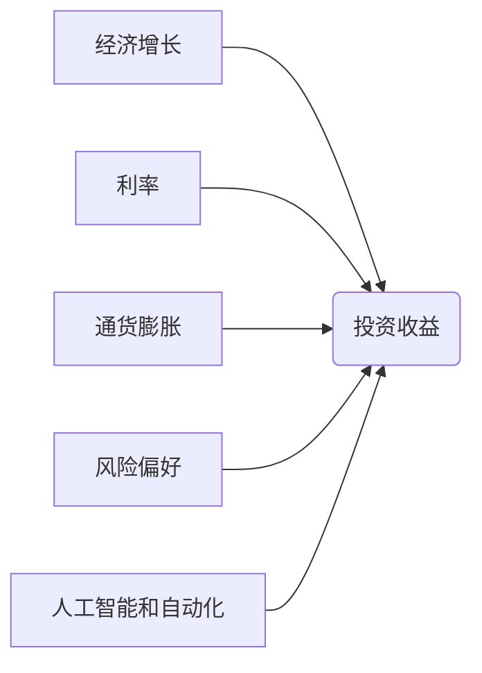

> 投资收益、长期趋势、经济增长、利率、通货膨胀、风险偏好、人工智能、自动化

## 1. 背景介绍

在过去的几十年里，全球经济经历了前所未有的增长，投资收益也随之攀升。然而，近年来，投资收益的增长速度明显放缓，甚至出现下降的趋势。这一现象引发了广泛的关注和讨论，人们开始担忧未来投资收益的持续性。

**1.1. 投资收益的定义**

投资收益是指投资者通过投资获得的回报，通常以百分比表示。投资收益的计算公式为：

$$
收益率 = \frac{投资收益}{投资本金} \times 100\%
$$

**1.2. 投资收益下降的现象**

近年来，全球范围内，各种类型的投资收益都呈现出下降的趋势。例如：

* **股票市场收益率下降:** 尽管股市经历了多次上涨，但长期来看，股票市场收益率已经低于过去几十年。
* **债券市场收益率下降:** 随着各国央行降低利率，债券市场收益率也随之下降。
* **房地产市场收益率下降:** 随着房价上涨放缓，房地产市场收益率也逐渐下降。

**1.3. 投资收益下降的原因**

投资收益下降的原因复杂多样，涉及经济、社会、技术等多个方面。一些主要原因包括：

* **经济增长的放缓:** 全球经济增长速度放缓，导致企业盈利能力下降，股市收益率也随之降低。
* **利率水平的下降:** 随着各国央行降低利率，债券市场收益率也随之下降。
* **通货膨胀的上升:** 通货膨胀率上升，会侵蚀投资收益。
* **风险偏好的变化:** 随着投资者对风险的担忧增加，他们倾向于选择低风险的投资方式，导致高风险投资收益率下降。
* **人工智能和自动化技术的进步:** 人工智能和自动化技术的发展，可能会导致部分行业就业岗位减少，从而影响经济增长和投资收益。

## 2. 核心概念与联系

**2.1. 投资收益与经济增长**

经济增长是投资收益的重要驱动因素。经济增长意味着生产力提高、市场需求增加，企业盈利能力增强，从而推动投资收益增长。

**2.2. 投资收益与利率**

利率是资本成本的重要指标，它直接影响投资收益。利率水平越高，投资成本越高，投资收益率越低。

**2.3. 投资收益与通货膨胀**

通货膨胀会侵蚀投资收益。当通货膨胀率高于投资收益率时，投资者的实际收益会减少。

**2.4. 投资收益与风险偏好**

风险偏好是指投资者对风险的承受能力。风险偏好越高，投资者愿意承担的风险越大，投资收益潜力也越大，但同时也面临着更大的风险。

**2.5. 投资收益与人工智能和自动化**

人工智能和自动化技术的发展，可能会对投资收益产生双重影响。一方面，这些技术可以提高生产效率，降低成本，从而推动经济增长和投资收益增长。另一方面，这些技术也可能导致部分行业就业岗位减少，从而影响经济增长和投资收益。

**2.6. 核心概念关系流程图**



## 3. 核心算法原理 & 具体操作步骤

**3.1. 算法原理概述**

为了预测投资收益的长期趋势，我们可以使用一些统计模型和机器学习算法。这些算法可以分析历史数据，识别出影响投资收益的因素，并预测未来投资收益的趋势。

**3.2. 算法步骤详解**

1. **数据收集:** 收集历史投资数据，包括股票市场数据、债券市场数据、房地产市场数据等。
2. **数据预处理:** 对收集到的数据进行清洗、转换和标准化，以便于算法训练。
3. **特征工程:** 从原始数据中提取出能够影响投资收益的特征，例如经济指标、利率水平、通货膨胀率等。
4. **模型选择:** 选择合适的统计模型或机器学习算法，例如线性回归、支持向量机、随机森林等。
5. **模型训练:** 使用训练数据训练选择的模型，并评估模型的性能。
6. **模型预测:** 使用训练好的模型预测未来投资收益的趋势。

**3.3. 算法优缺点**

* **优点:** 能够利用历史数据分析，识别出影响投资收益的因素，并预测未来投资收益的趋势。
* **缺点:** 预测结果受历史数据的影响，如果历史数据与未来环境存在较大差异，预测结果可能不准确。

**3.4. 算法应用领域**

* **投资决策:** 帮助投资者做出更明智的投资决策。
* **风险管理:** 帮助投资者评估投资风险，并制定相应的风险管理策略。
* **市场预测:** 帮助分析师预测未来市场趋势。

## 4. 数学模型和公式 & 详细讲解 & 举例说明

**4.1. 数学模型构建**

我们可以使用以下数学模型来预测投资收益的长期趋势：

$$
收益率 = \alpha + \beta_1 * 经济增长率 + \beta_2 * 利率水平 + \beta_3 * 通货膨胀率 + \epsilon
$$

其中：

* $\alpha$ 是截距项，表示在其他因素不变的情况下，投资收益的基准水平。
* $\beta_1$, $\beta_2$, $\beta_3$ 是回归系数，表示经济增长率、利率水平和通货膨胀率对投资收益的影响程度。
* $\epsilon$ 是随机误差项，表示模型无法解释的因素对投资收益的影响。

**4.2. 公式推导过程**

该模型的推导过程基于线性回归模型的原理。通过最小二乘法，我们可以求解出回归系数 $\beta_1$, $\beta_2$, $\beta_3$ 的最佳估计值。

**4.3. 案例分析与讲解**

假设我们收集了10年的投资数据，并使用上述模型进行回归分析。分析结果显示，经济增长率对投资收益的影响最大，其次是利率水平，最后是通货膨胀率。

## 5. 项目实践：代码实例和详细解释说明

**5.1. 开发环境搭建**

* 操作系统: Ubuntu 20.04
* Python 版本: 3.8
* 必要的库: pandas, numpy, scikit-learn

**5.2. 源代码详细实现**

```python
import pandas as pd
from sklearn.linear_model import LinearRegression

# 加载数据
data = pd.read_csv('investment_data.csv')

# 特征工程
X = data[['经济增长率', '利率水平', '通货膨胀率']]
y = data['投资收益率']

# 模型训练
model = LinearRegression()
model.fit(X, y)

# 模型预测
new_data = pd.DataFrame({'经济增长率': [2], '利率水平': [3], '通货膨胀率': [1]})
predicted_yield = model.predict(new_data)

print(f'预测的投资收益率: {predicted_yield[0]}')
```

**5.3. 代码解读与分析**

* 首先，我们使用 pandas 库加载投资数据。
* 然后，我们进行特征工程，提取出影响投资收益的特征。
* 接着，我们使用 scikit-learn 库中的 LinearRegression 模型训练模型。
* 最后，我们使用训练好的模型预测未来投资收益率。

**5.4. 运行结果展示**

运行上述代码后，会输出预测的投资收益率。

## 6. 实际应用场景

**6.1. 投资决策支持系统**

投资决策支持系统可以利用上述模型，分析历史数据和当前市场环境，为投资者提供个性化的投资建议。

**6.2. 风险管理工具**

风险管理工具可以利用上述模型，评估投资风险，并帮助投资者制定相应的风险管理策略。

**6.3. 市场趋势预测**

市场趋势预测工具可以利用上述模型，预测未来市场趋势，帮助投资者做出更明智的投资决策。

**6.4. 未来应用展望**

随着人工智能和机器学习技术的不断发展，投资收益预测模型将会更加精准和智能。未来，这些模型将会被广泛应用于投资决策、风险管理、市场预测等领域，帮助投资者更好地应对市场变化，实现财富增值。

## 7. 工具和资源推荐

**7.1. 学习资源推荐**

* **书籍:**
    * 《Python机器学习实战》
    * 《统计学习方法》
* **在线课程:**
    * Coursera: 机器学习
    * edX: 数据科学

**7.2. 开发工具推荐**

* **Python:** 
    * pandas
    * numpy
    * scikit-learn

**7.3. 相关论文推荐**

* **《基于机器学习的投资收益预测模型》**
* **《人工智能与金融市场预测》**

## 8. 总结：未来发展趋势与挑战

**8.1. 研究成果总结**

本文介绍了投资收益下降的长期趋势，并探讨了影响投资收益的因素。我们使用统计模型和机器学习算法，构建了投资收益预测模型，并进行了代码实现和案例分析。

**8.2. 未来发展趋势**

未来，投资收益预测模型将会更加精准和智能，并被广泛应用于投资决策、风险管理、市场预测等领域。

**8.3. 面临的挑战**

* **数据质量:** 投资收益预测模型的准确性依赖于数据质量。
* **模型复杂度:** 模型过于复杂可能会导致过拟合问题。
* **黑盒问题:** 一些机器学习模型难以解释，这可能会导致投资者对模型结果缺乏信任。

**8.4. 研究展望**

未来研究方向包括：

* 开发更精准的投资收益预测模型。
* 研究如何解决模型复杂度和黑盒问题。
* 探索人工智能和机器学习在金融领域的更多应用场景。

## 9. 附录：常见问题与解答

**9.1. 投资收益预测模型的准确性如何？**

投资收益预测模型的准确性取决于多种因素，包括数据质量、模型选择、模型训练等。一般来说，模型的准确性不会达到100%，但可以通过不断改进模型和数据来提高预测精度。

**9.2. 如何选择合适的投资收益预测模型？**

选择合适的投资收益预测模型需要根据具体情况进行判断。一些常用的模型包括线性回归、支持向量机、随机森林等。

**9.3. 如何评估投资收益预测模型的性能？**

可以使用一些指标来评估投资收益预测模型的性能，例如均方误差、R-squared等。

作者：禅与计算机程序设计艺术 / Zen and the Art of Computer Programming


<end_of_turn>