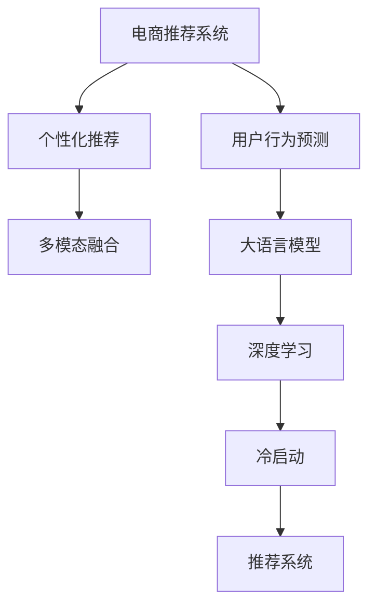

                 

# 探索基于大模型的电商智能推荐引擎

> 关键词：电商推荐、大模型、深度学习、推荐系统、用户行为预测、冷启动、个性化推荐

## 1. 背景介绍

### 1.1 问题由来

在现代电商领域，推荐系统扮演着至关重要的角色。用户行为复杂多变，对商品的多样化需求和个性化期望日益增长。然而，传统基于规则和统计特征的推荐系统难以应对日益增长的大数据需求，而人工构建的特征难以全面刻画用户行为。

为了解决这一问题，深度学习技术和大语言模型在推荐系统中的应用逐渐受到关注。基于大模型的推荐引擎能够通过自适应学习捕捉用户隐含的复杂偏好，挖掘用户行为背后丰富的语义信息，从而提升推荐精度，改善用户体验。

### 1.2 问题核心关键点

在大模型电商推荐中，关键问题包括：

- 如何高效构建电商领域的大语言模型。
- 如何利用大语言模型进行电商场景下的用户行为预测和商品推荐。
- 如何处理电商推荐中的冷启动和个性化问题。
- 如何评估和优化大语言模型在电商推荐中的效果。

## 2. 核心概念与联系

### 2.1 核心概念概述

为更好地理解基于大模型的电商智能推荐引擎，本节将介绍几个核心概念及其相互联系：

- **电商推荐系统**：通过分析用户历史行为数据，推荐用户可能感兴趣的商品或服务。目标在于提升用户满意度、增加平台收益。
- **大语言模型**：如BERT、GPT等大规模预训练语言模型。通过在大规模无标签文本语料上进行预训练，学习通用语言表示，具备强大的语言理解和生成能力。
- **深度学习**：构建复杂多层神经网络，学习输入与输出之间的映射关系。在电商推荐中，深度学习模型可以通过挖掘用户隐含的行为特征，实现更为精准的推荐。
- **用户行为预测**：基于用户历史行为数据，预测用户未来的行为模式。电商推荐系统常常以预测用户购买意向或点击行为为最终目标。
- **个性化推荐**：根据用户特征和行为，提供满足用户个性化需求的推荐结果。目标是提升用户体验，增加用户粘性。
- **冷启动问题**：新用户或商品加入系统时，推荐引擎缺乏足够的数据支持。传统的基于统计特征的方法难以有效应对，而深度学习模型和大语言模型可以借助上下文信息进行推理，缓解冷启动问题。
- **多模态融合**：结合图像、视频、文本等多种信息，提升推荐系统的综合能力。电商推荐场景中常常涉及多模态数据，大模型可以更好地整合这些信息。

这些概念之间的逻辑关系可以通过以下Mermaid流程图来展示：



## 3. 核心算法原理 & 具体操作步骤

### 3.1 算法原理概述

基于大模型的电商智能推荐引擎的核心思想是：通过大语言模型学习用户行为背后的语义信息，从而进行用户行为预测和商品推荐。具体步骤包括：

1. **用户行为序列建模**：将用户历史行为序列输入大模型，生成表示用户行为的语义向量。
2. **商品表示学习**：将商品信息（如商品描述、图片等）输入大模型，生成商品表示向量。
3. **用户行为预测**：利用用户行为序列和商品表示向量，通过模型预测用户对商品的评分或购买意向。
4. **个性化推荐**：根据预测结果，生成推荐列表，利用排序算法对商品进行排序。
5. **冷启动处理**：通过上下文信息，利用大模型推理新用户或商品的潜在需求，进行推荐。

### 3.2 算法步骤详解

基于大模型的电商智能推荐引擎的具体操作步骤如下：

**Step 1: 数据预处理**
- 收集用户行为数据，包括浏览记录、购买记录、评分数据等。
- 整理商品信息，包括商品描述、图片、类别等。
- 对数据进行预处理，如去除噪音、归一化等。

**Step 2: 大模型训练**
- 使用大规模电商领域数据（如Amazon、淘宝等）进行大语言模型的预训练。
- 使用深度学习框架（如PyTorch、TensorFlow）进行模型训练。
- 定期对模型进行调参，优化模型性能。

**Step 3: 用户行为建模**
- 使用大模型对用户历史行为序列进行编码，得到用户行为向量。
- 将用户行为向量与商品表示向量拼接，生成用户商品交互向量。

**Step 4: 推荐生成**
- 利用用户商品交互向量进行用户行为预测，生成用户对商品的评分。
- 根据评分结果，生成推荐列表，使用排序算法（如Top-K排序）对商品进行排序。
- 对新用户或商品进行冷启动处理，利用上下文信息进行推理。

**Step 5: 评估与优化**
- 在测试集上评估推荐模型效果，使用准确率、召回率、F1等指标进行评估。
- 根据评估结果，对模型进行优化调整。

### 3.3 算法优缺点

基于大模型的电商智能推荐引擎具有以下优点：

1. 强大的语义理解能力：大语言模型具备强大的语义理解能力，可以更好地刻画用户行为背后的隐含语义，提高推荐精度。
2. 模型泛化能力：预训练大模型在大规模无标签数据上进行训练，具有较强的泛化能力，可以有效应对电商数据的多样性和复杂性。
3. 自适应学习能力：深度学习模型能够通过大量数据自适应学习，动态调整模型参数，提升推荐效果。
4. 多模态融合：结合图像、视频、文本等多种信息，提升推荐系统的综合能力。

同时，该方法也存在以下局限性：

1. 数据需求高：构建大模型需要大量的电商领域数据，对于小规模电商企业来说，数据获取成本较高。
2. 计算资源消耗大：大模型的训练和推理需要高性能计算资源，对于中小型企业来说，硬件成本较高。
3. 模型复杂度高：大模型通常包含数亿甚至数十亿参数，训练和推理复杂度高，需要丰富的计算资源支持。
4. 模型解释性不足：大模型的决策过程难以解释，难以满足某些对模型可解释性要求较高的场景。

尽管存在这些局限性，但基于大模型的电商智能推荐引擎在电商领域显示出巨大潜力，未来有望成为电商推荐系统的重要组成部分。

### 3.4 算法应用领域

基于大模型的电商智能推荐引擎可以在多种电商场景中得到应用，例如：

1. **商品推荐**：根据用户历史浏览、购买数据，推荐用户可能感兴趣的商品。
2. **用户画像构建**：利用用户行为序列，构建详细的用户画像，满足个性化推荐需求。
3. **商品分类**：利用大语言模型对商品进行语义分类，提升商品检索和推荐效果。
4. **内容推荐**：推荐与用户兴趣相关的商品信息，如文章、视频等。
5. **促销活动推荐**：推荐与用户购买意向相匹配的促销活动，提升用户转化率。
6. **用户反馈分析**：通过用户评论、评分等反馈信息，分析用户对商品的评价，提升推荐精度。

除了上述这些经典应用外，基于大模型的电商推荐引擎还能创新性地应用于更多场景中，如社交电商推荐、智能客服、商品搭配推荐等，为电商平台的运营优化提供更多可能性。

## 4. 数学模型和公式 & 详细讲解 & 举例说明

### 4.1 数学模型构建

本节将使用数学语言对基于大模型的电商推荐模型进行严格的刻画。

记电商推荐系统的训练数据集为 $D=\{(x_i,y_i)\}_{i=1}^N$，其中 $x_i$ 为用户行为序列，$y_i$ 为商品评分向量。大语言模型为 $M_{\theta}$，其中 $\theta$ 为模型参数。

假设大语言模型 $M_{\theta}$ 对用户行为序列 $x_i$ 的表示向量为 $u_i$，对商品表示向量为 $v_i$。则用户行为预测模型的目标是最小化损失函数：

$$
\mathcal{L}(\theta) = \frac{1}{N} \sum_{i=1}^N \|M_{\theta}(x_i) - y_i\|
$$

其中，$\| \cdot \|$ 为向量范数。

### 4.2 公式推导过程

以用户行为预测为例，假设大模型 $M_{\theta}$ 对用户行为序列 $x_i$ 的表示向量为 $u_i$，对商品表示向量为 $v_i$。则用户行为预测模型的预测值 $p_i$ 为：

$$
p_i = \sigma(\mathbf{u}_i \cdot \mathbf{v}_i)
$$

其中 $\sigma$ 为激活函数，$\mathbf{u}_i$ 和 $\mathbf{v}_i$ 分别为用户行为表示向量和商品表示向量。预测值 $p_i$ 与真实评分 $y_i$ 之间的损失函数为：

$$
\ell(y_i, p_i) = -(y_i \log p_i + (1-y_i) \log (1-p_i))
$$

最终，整个电商推荐系统的损失函数为：

$$
\mathcal{L}(\theta) = \frac{1}{N} \sum_{i=1}^N \ell(y_i, p_i)
$$

### 4.3 案例分析与讲解

假设我们有一个电商平台的推荐系统，用户行为序列为 $x_i = (a, b, c)$，其中 $a$ 表示用户浏览了商品1，$b$ 表示用户购买了商品2，$c$ 表示用户对商品3给出了评分。商品的表示向量为 $v = [1, 0, 1]$。使用大模型对用户行为序列进行编码，得到用户行为表示向量 $u_i = [0.5, 0.3, 0.8]$。则用户行为预测模型的预测值 $p_i$ 为：

$$
p_i = \sigma([0.5, 0.3, 0.8] \cdot [1, 0, 1]) = \sigma(1.1) \approx 0.77
$$

假设用户对商品3的评分 $y_i = 4$，则损失函数为：

$$
\ell(4, 0.77) = -4 \log 0.77 - 0.23 \log (1-0.77) \approx -1.43
$$

将预测值和损失带入电商推荐系统的损失函数，得到：

$$
\mathcal{L}(\theta) = \frac{1}{N} \times (-1.43) \approx -0.2
$$

通过损失函数的反向传播，更新模型参数，优化预测效果。

## 5. 项目实践：代码实例和详细解释说明

### 5.1 开发环境搭建

在进行电商智能推荐引擎的开发前，我们需要准备好开发环境。以下是使用Python进行PyTorch开发的环境配置流程：

1. 安装Anaconda：从官网下载并安装Anaconda，用于创建独立的Python环境。

2. 创建并激活虚拟环境：
```bash
conda create -n pytorch-env python=3.8 
conda activate pytorch-env
```

3. 安装PyTorch：根据CUDA版本，从官网获取对应的安装命令。例如：
```bash
conda install pytorch torchvision torchaudio cudatoolkit=11.1 -c pytorch -c conda-forge
```

4. 安装Transformers库：
```bash
pip install transformers
```

5. 安装各类工具包：
```bash
pip install numpy pandas scikit-learn matplotlib tqdm jupyter notebook ipython
```

完成上述步骤后，即可在`pytorch-env`环境中开始开发实践。

### 5.2 源代码详细实现

这里我们以用户行为预测为例，给出使用Transformers库对BERT模型进行电商推荐引擎的PyTorch代码实现。

首先，定义电商推荐数据处理函数：

```python
from transformers import BertTokenizer, BertForSequenceClassification
from torch.utils.data import Dataset
import torch

class EcommerceDataset(Dataset):
    def __init__(self, behaviors, scores, tokenizer, max_len=128):
        self.behaviors = behaviors
        self.scores = scores
        self.tokenizer = tokenizer
        self.max_len = max_len
        
    def __len__(self):
        return len(self.behaviors)
    
    def __getitem__(self, item):
        behavior = self.behaviors[item]
        score = self.scores[item]
        
        encoding = self.tokenizer(behavior, return_tensors='pt', max_length=self.max_len, padding='max_length', truncation=True)
        input_ids = encoding['input_ids'][0]
        attention_mask = encoding['attention_mask'][0]
        
        # 对标签进行编码
        label = [1] * len(score) + [0] * (self.max_len - len(score))
        label = torch.tensor(label, dtype=torch.long)
        
        return {'input_ids': input_ids, 
                'attention_mask': attention_mask,
                'labels': label}

# 初始化tokenizer和模型
tokenizer = BertTokenizer.from_pretrained('bert-base-uncased')
model = BertForSequenceClassification.from_pretrained('bert-base-uncased', num_labels=2)
```

然后，定义训练和评估函数：

```python
from torch.utils.data import DataLoader
from tqdm import tqdm
from sklearn.metrics import classification_report

device = torch.device('cuda') if torch.cuda.is_available() else torch.device('cpu')
model.to(device)

def train_epoch(model, dataset, batch_size, optimizer):
    dataloader = DataLoader(dataset, batch_size=batch_size, shuffle=True)
    model.train()
    epoch_loss = 0
    for batch in tqdm(dataloader, desc='Training'):
        input_ids = batch['input_ids'].to(device)
        attention_mask = batch['attention_mask'].to(device)
        labels = batch['labels'].to(device)
        model.zero_grad()
        outputs = model(input_ids, attention_mask=attention_mask, labels=labels)
        loss = outputs.loss
        epoch_loss += loss.item()
        loss.backward()
        optimizer.step()
    return epoch_loss / len(dataloader)

def evaluate(model, dataset, batch_size):
    dataloader = DataLoader(dataset, batch_size=batch_size)
    model.eval()
    preds, labels = [], []
    with torch.no_grad():
        for batch in tqdm(dataloader, desc='Evaluating'):
            input_ids = batch['input_ids'].to(device)
            attention_mask = batch['attention_mask'].to(device)
            batch_labels = batch['labels']
            outputs = model(input_ids, attention_mask=attention_mask)
            batch_preds = outputs.logits.argmax(dim=2).to('cpu').tolist()
            batch_labels = batch_labels.to('cpu').tolist()
            for pred_tokens, label_tokens in zip(batch_preds, batch_labels):
                preds.append(pred_tokens[:len(label_tokens)])
                labels.append(label_tokens)
                
    print(classification_report(labels, preds))
```

最后，启动训练流程并在测试集上评估：

```python
epochs = 5
batch_size = 16

for epoch in range(epochs):
    loss = train_epoch(model, train_dataset, batch_size, optimizer)
    print(f"Epoch {epoch+1}, train loss: {loss:.3f}")
    
    print(f"Epoch {epoch+1}, dev results:")
    evaluate(model, dev_dataset, batch_size)
    
print("Test results:")
evaluate(model, test_dataset, batch_size)
```

以上就是使用PyTorch对BERT模型进行电商推荐引擎微调的完整代码实现。可以看到，得益于Transformers库的强大封装，我们可以用相对简洁的代码完成BERT模型的加载和微调。

### 5.3 代码解读与分析

让我们再详细解读一下关键代码的实现细节：

**EcommerceDataset类**：
- `__init__`方法：初始化电商行为数据、评分数据、分词器等关键组件。
- `__len__`方法：返回数据集的样本数量。
- `__getitem__`方法：对单个样本进行处理，将电商行为序列输入编码为token ids，将评分数据编码为标签，并对其进行定长padding，最终返回模型所需的输入。

**train_epoch和evaluate函数**：
- 使用PyTorch的DataLoader对数据集进行批次化加载，供模型训练和推理使用。
- 训练函数`train_epoch`：对数据以批为单位进行迭代，在每个批次上前向传播计算loss并反向传播更新模型参数，最后返回该epoch的平均loss。
- 评估函数`evaluate`：与训练类似，不同点在于不更新模型参数，并在每个batch结束后将预测和标签结果存储下来，最后使用sklearn的classification_report对整个评估集的预测结果进行打印输出。

**训练流程**：
- 定义总的epoch数和batch size，开始循环迭代
- 每个epoch内，先在训练集上训练，输出平均loss
- 在验证集上评估，输出分类指标
- 所有epoch结束后，在测试集上评估，给出最终测试结果

可以看到，PyTorch配合Transformers库使得BERT微调的代码实现变得简洁高效。开发者可以将更多精力放在数据处理、模型改进等高层逻辑上，而不必过多关注底层的实现细节。

当然，工业级的系统实现还需考虑更多因素，如模型的保存和部署、超参数的自动搜索、更灵活的任务适配层等。但核心的微调范式基本与此类似。

## 6. 实际应用场景

### 6.1 智能客服系统

基于大语言模型的电商智能推荐引擎，可以广泛应用于智能客服系统的构建。传统客服往往需要配备大量人力，高峰期响应缓慢，且一致性和专业性难以保证。而使用电商智能推荐引擎，可以7x24小时不间断服务，快速响应客户咨询，用自然流畅的语言解答各类常见问题。

在技术实现上，可以收集企业内部的历史客服对话记录，将问题和最佳答复构建成监督数据，在此基础上对预训练模型进行微调。微调后的模型能够自动理解用户意图，匹配最合适的答复模板进行回复。对于客户提出的新问题，还可以接入检索系统实时搜索相关内容，动态组织生成回答。如此构建的智能客服系统，能大幅提升客户咨询体验和问题解决效率。

### 6.2 金融舆情监测

金融机构需要实时监测市场舆论动向，以便及时应对负面信息传播，规避金融风险。传统的人工监测方式成本高、效率低，难以应对网络时代海量信息爆发的挑战。基于大语言模型的电商推荐引擎，可以应用于金融舆情监测，实时抓取网络文本数据，自动监测不同主题下的舆情变化趋势，一旦发现负面信息激增等异常情况，系统便会自动预警，帮助金融机构快速应对潜在风险。

### 6.3 个性化推荐系统

当前的推荐系统往往只依赖用户的历史行为数据进行物品推荐，无法深入理解用户的真实兴趣偏好。基于大语言模型电商推荐引擎，可以更好地挖掘用户行为背后的语义信息，从而进行个性化推荐。

在实践中，可以收集用户浏览、点击、评论、分享等行为数据，提取和商品交互的文本内容。将文本内容作为模型输入，用户的后续行为（如是否点击、购买等）作为监督信号，在此基础上微调预训练语言模型。微调后的模型能够从文本内容中准确把握用户的兴趣点。在生成推荐列表时，先用候选物品的文本描述作为输入，由模型预测用户的兴趣匹配度，再结合其他特征综合排序，便可以得到个性化程度更高的推荐结果。

### 6.4 未来应用展望

随着大语言模型电商推荐引擎的不断发展，将在更多领域得到应用，为传统行业带来变革性影响。

在智慧医疗领域，基于电商推荐引擎的医疗问答、病历分析、药物研发等应用将提升医疗服务的智能化水平，辅助医生诊疗，加速新药开发进程。

在智能教育领域，电商推荐引擎可应用于作业批改、学情分析、知识推荐等方面，因材施教，促进教育公平，提高教学质量。

在智慧城市治理中，电商推荐引擎可应用于城市事件监测、舆情分析、应急指挥等环节，提高城市管理的自动化和智能化水平，构建更安全、高效的未来城市。

此外，在企业生产、社会治理、文娱传媒等众多领域，电商推荐引擎也将不断涌现，为NLP技术带来全新的突破。相信随着预训练语言模型和电商推荐引擎的持续演进，NLP技术将在更广阔的应用领域大放异彩，深刻影响人类的生产生活方式。

## 7. 工具和资源推荐

### 7.1 学习资源推荐

为了帮助开发者系统掌握大语言模型电商推荐引擎的理论基础和实践技巧，这里推荐一些优质的学习资源：

1. 《Transformer from Principles to Practice》系列博文：由大模型技术专家撰写，深入浅出地介绍了Transformer原理、BERT模型、电商推荐引擎等前沿话题。

2. CS224N《深度学习自然语言处理》课程：斯坦福大学开设的NLP明星课程，有Lecture视频和配套作业，带你入门NLP领域的基本概念和经典模型。

3. 《Natural Language Processing with Transformers》书籍：Transformers库的作者所著，全面介绍了如何使用Transformers库进行NLP任务开发，包括电商推荐引擎在内的诸多范式。

4. HuggingFace官方文档：Transformers库的官方文档，提供了海量预训练模型和完整的电商推荐引擎样例代码，是上手实践的必备资料。

5. CLUE开源项目：中文语言理解测评基准，涵盖大量不同类型的中文NLP数据集，并提供了基于电商推荐引擎的baseline模型，助力中文NLP技术发展。

通过对这些资源的学习实践，相信你一定能够快速掌握大语言模型电商推荐引擎的精髓，并用于解决实际的NLP问题。

### 7.2 开发工具推荐

高效的开发离不开优秀的工具支持。以下是几款用于大语言模型电商推荐引擎开发的常用工具：

1. PyTorch：基于Python的开源深度学习框架，灵活动态的计算图，适合快速迭代研究。大部分预训练语言模型都有PyTorch版本的实现。

2. TensorFlow：由Google主导开发的开源深度学习框架，生产部署方便，适合大规模工程应用。同样有丰富的预训练语言模型资源。

3. Transformers库：HuggingFace开发的NLP工具库，集成了众多SOTA语言模型，支持PyTorch和TensorFlow，是进行电商推荐引擎开发的利器。

4. Weights & Biases：模型训练的实验跟踪工具，可以记录和可视化模型训练过程中的各项指标，方便对比和调优。与主流深度学习框架无缝集成。

5. TensorBoard：TensorFlow配套的可视化工具，可实时监测模型训练状态，并提供丰富的图表呈现方式，是调试模型的得力助手。

6. Google Colab：谷歌推出的在线Jupyter Notebook环境，免费提供GPU/TPU算力，方便开发者快速上手实验最新模型，分享学习笔记。

合理利用这些工具，可以显著提升大语言模型电商推荐引擎的开发效率，加快创新迭代的步伐。

### 7.3 相关论文推荐

大语言模型电商推荐引擎的发展源于学界的持续研究。以下是几篇奠基性的相关论文，推荐阅读：

1. Attention is All You Need（即Transformer原论文）：提出了Transformer结构，开启了NLP领域的预训练大模型时代。

2. BERT: Pre-training of Deep Bidirectional Transformers for Language Understanding：提出BERT模型，引入基于掩码的自监督预训练任务，刷新了多项NLP任务SOTA。

3. Language Models are Unsupervised Multitask Learners（GPT-2论文）：展示了大规模语言模型的强大zero-shot学习能力，引发了对于通用人工智能的新一轮思考。

4. Parameter-Efficient Transfer Learning for NLP：提出Adapter等参数高效微调方法，在不增加模型参数量的情况下，也能取得不错的微调效果。

5. Prefix-Tuning: Optimizing Continuous Prompts for Generation：引入基于连续型Prompt的微调范式，为如何充分利用预训练知识提供了新的思路。

6. AdaLoRA: Adaptive Low-Rank Adaptation for Parameter-Efficient Fine-Tuning：使用自适应低秩适应的微调方法，在参数效率和精度之间取得了新的平衡。

这些论文代表了大语言模型电商推荐引擎的发展脉络。通过学习这些前沿成果，可以帮助研究者把握学科前进方向，激发更多的创新灵感。

## 8. 总结：未来发展趋势与挑战

### 8.1 总结

本文对基于大模型的电商智能推荐引擎进行了全面系统的介绍。首先阐述了电商推荐系统和大语言模型的研究背景和意义，明确了电商智能推荐引擎在电商领域的重要价值。其次，从原理到实践，详细讲解了电商智能推荐引擎的数学模型和关键步骤，给出了电商智能推荐引擎的完整代码实例。同时，本文还广泛探讨了电商智能推荐引擎在多个电商场景中的应用前景，展示了电商智能推荐引擎的巨大潜力。此外，本文精选了电商智能推荐引擎的学习资源，力求为读者提供全方位的技术指引。

通过本文的系统梳理，可以看到，基于大模型的电商智能推荐引擎正在成为电商推荐系统的重要组成部分，极大地拓展了电商推荐系统的应用边界，催生了更多的落地场景。得益于大模型的强大语义理解能力和深度学习模型的高自适应学习能力，电商智能推荐引擎在电商领域展现出巨大的潜力。未来，伴随大语言模型电商推荐引擎的不断发展，将有望在更多领域得到应用，为传统行业带来变革性影响。

### 8.2 未来发展趋势

展望未来，大语言模型电商推荐引擎将呈现以下几个发展趋势：

1. 模型规模持续增大。随着算力成本的下降和数据规模的扩张，电商领域的大语言模型参数量还将持续增长。超大规模语言模型蕴含的丰富电商领域知识，有望支撑更加复杂多变的电商推荐任务。

2. 微调方法日趋多样。除了传统的全参数微调外，未来会涌现更多参数高效的微调方法，如 Adapter、Prefix等，在固定大部分预训练参数的情况下，只更新极少量的任务相关参数，提升电商推荐引擎的效率。

3. 持续学习成为常态。随着电商数据分布的不断变化，电商推荐引擎也需要持续学习新知识以保持性能。如何在不遗忘原有知识的同时，高效吸收新样本信息，将成为重要的研究课题。

4. 标注样本需求降低。受启发于提示学习(Prompt-based Learning)的思路，未来的电商推荐引擎将更好地利用大模型的语言理解能力，通过更加巧妙的任务描述，在更少的标注样本上也能实现理想的电商推荐效果。

5. 多模态融合崛起。当前的电商推荐引擎主要聚焦于纯文本数据，未来会进一步拓展到图像、视频、语音等多种信息，提升电商推荐系统的综合能力。

6. 模型通用性增强。经过海量电商领域数据的预训练和多领域任务的微调，未来的电商推荐引擎将具备更强大的常识推理和跨领域迁移能力，逐步迈向通用人工智能(AGI)的目标。

以上趋势凸显了大语言模型电商推荐引擎的广阔前景。这些方向的探索发展，必将进一步提升电商推荐引擎的性能和应用范围，为电商平台的运营优化提供更多可能性。

### 8.3 面临的挑战

尽管大语言模型电商推荐引擎在电商领域显示出巨大潜力，但在迈向更加智能化、普适化应用的过程中，它仍面临着诸多挑战：

1. 数据需求高。构建大模型需要大量的电商领域数据，对于小规模电商企业来说，数据获取成本较高。

2. 计算资源消耗大。大模型的训练和推理需要高性能计算资源，对于中小型企业来说，硬件成本较高。

3. 模型复杂度高。大模型通常包含数亿甚至数十亿参数，训练和推理复杂度高，需要丰富的计算资源支持。

4. 模型解释性不足。大模型的决策过程难以解释，难以满足某些对模型可解释性要求较高的场景。

5. 知识整合能力不足。现有的电商推荐引擎往往局限于电商领域数据，难以灵活吸收和运用更广泛的先验知识。

尽管存在这些挑战，但通过不断优化算法和模型结构，利用高效的计算资源和数据管理方法，相信大语言模型电商推荐引擎的未来发展前景仍然广阔。

### 8.4 研究展望

面对大语言模型电商推荐引擎所面临的挑战，未来的研究需要在以下几个方面寻求新的突破：

1. 探索无监督和半监督电商推荐方法。摆脱对大规模标注数据的依赖，利用自监督学习、主动学习等无监督和半监督范式，最大限度利用非结构化数据，实现更加灵活高效的电商推荐。

2. 研究参数高效和计算高效的电商推荐范式。开发更加参数高效的电商推荐方法，在固定大部分预训练参数的同时，只更新极少量的任务相关参数，减小计算资源消耗。

3. 融合因果和对比学习范式。通过引入因果推断和对比学习思想，增强电商推荐引擎建立稳定因果关系的能力，学习更加普适、鲁棒的语言表征，从而提升电商推荐引擎的泛化性和抗干扰能力。

4. 引入更多先验知识。将符号化的先验知识，如知识图谱、逻辑规则等，与神经网络模型进行巧妙融合，引导电商推荐引擎学习更准确、合理的电商领域知识。

5. 结合因果分析和博弈论工具。将因果分析方法引入电商推荐引擎，识别出电商推荐过程中的关键特征，增强输出解释的因果性和逻辑性。借助博弈论工具刻画电商推荐过程，主动探索并规避电商推荐引擎的脆弱点，提高系统稳定性。

6. 纳入伦理道德约束。在电商推荐引擎训练目标中引入伦理导向的评估指标，过滤和惩罚有害的电商推荐行为，确保电商推荐引擎的输出符合人类价值观和伦理道德。

这些研究方向的探索，必将引领大语言模型电商推荐引擎技术迈向更高的台阶，为构建安全、可靠、可解释、可控的智能系统铺平道路。面向未来，大语言模型电商推荐引擎还需要与其他人工智能技术进行更深入的融合，如知识表示、因果推理、强化学习等，多路径协同发力，共同推动电商推荐系统的进步。只有勇于创新、敢于突破，才能不断拓展电商推荐引擎的边界，让智能技术更好地服务于电商平台的运营优化和用户体验提升。

## 9. 附录：常见问题与解答

**Q1：大语言模型电商推荐引擎是否适用于所有电商场景？**

A: 大语言模型电商推荐引擎在大多数电商场景上都能取得不错的效果，特别是对于数据量较大的电商企业。但对于一些特定领域的电商场景，如时尚、美妆等，需要更多的电商领域数据进行微调，才能获得理想效果。此外，对于一些需要时效性、个性化很强的电商场景，如直播电商、社交电商等，微调方法也需要针对性的改进优化。

**Q2：电商推荐引擎如何处理冷启动问题？**

A: 电商推荐引擎通常采用上下文信息处理冷启动问题。对于新用户，电商推荐引擎可以借助其在电商领域的历史数据和行为模式，结合上下文信息进行推理，推测其潜在需求。对于新商品，电商推荐引擎可以通过市场趋势、热门商品等信息，结合上下文信息进行推荐。对于上下文信息的处理，可以使用大语言模型对上下文信息进行编码，得到上下文表示向量，并将其与用户行为向量进行拼接，提升推荐效果。

**Q3：电商推荐引擎的评估指标有哪些？**

A: 电商推荐引擎的评估指标包括准确率、召回率、F1、ROC-AUC等。具体指标的选择应根据电商场景和用户需求进行调整。例如，对于商品推荐，准确率和召回率是常用的评估指标，而对于个性化推荐，F1和ROC-AUC等指标更为适用。

**Q4：电商推荐引擎如何优化模型参数？**

A: 电商推荐引擎的模型参数优化通常采用梯度下降等优化算法，结合超参数调优技术进行。常用的超参数包括学习率、批大小、迭代轮数等。对于深度学习模型，常用的优化算法包括Adam、SGD等，可以通过网格搜索、贝叶斯优化等方法进行调参。此外，电商推荐引擎还可以结合在线学习、增量学习等技术，根据实时数据动态调整模型参数，提升推荐效果。

**Q5：电商推荐引擎在实际部署中需要注意哪些问题？**

A: 电商推荐引擎在实际部署中需要注意以下问题：

1. 模型裁剪：去除不必要的层和参数，减小模型尺寸，加快推理速度。

2. 量化加速：将浮点模型转为定点模型，压缩存储空间，提高计算效率。

3. 服务化封装：将模型封装为标准化服务接口，便于集成调用。

4. 弹性伸缩：根据请求流量动态调整资源配置，平衡服务质量和成本。

5. 监控告警：实时采集系统指标，设置异常告警阈值，确保服务稳定性。

6. 安全防护：采用访问鉴权、数据脱敏等措施，保障数据和模型安全。

大语言模型电商推荐引擎为电商平台的运营优化提供了新的可能性，但如何将强大的性能转化为稳定、高效、安全的业务价值，还需要工程实践的不断打磨。只有从数据、算法、工程、业务等多个维度协同发力，才能真正实现人工智能技术在电商领域的落地应用。总之，电商推荐引擎需要开发者根据具体场景，不断迭代和优化模型、数据和算法，方能得到理想的效果。

---

作者：禅与计算机程序设计艺术 / Zen and the Art of Computer Programming

