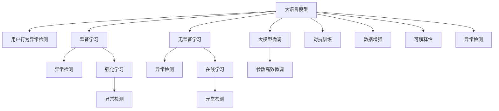

                 

## 1. 背景介绍

### 1.1 问题由来

随着电子商务的迅猛发展，电商平台的用户行为数据量急剧增长，同时用户行为也变得愈加复杂多样。为了保障平台运行的安全稳定，及时发现并防范各种潜在风险，电商平台亟需高效、准确的用户行为异常检测技术。传统的规则引擎和统计方法往往难以应对日新月异的行为模式，亟需新的技术手段赋能异常检测。

### 1.2 问题核心关键点

异常检测的核心在于从海量数据中识别出与常态不一致的行为模式，及时预警潜在风险。现有的异常检测方法主要分为两大类：监督学习方法和无监督学习方法。监督学习方法需要大量标注数据，而无监督学习方法依赖先验知识或隐式模式发现，往往难以应对高维度、多模态的行为数据。

大语言模型作为最新的预训练技术，通过在海量无标签文本数据上进行预训练，学习到丰富的语言知识，具备了强大的语义理解能力。结合大模型和异常检测的最新研究成果，可以开发高效、泛化性强的异常检测模型，赋能电商平台的安全运营。

## 2. 核心概念与联系

### 2.1 核心概念概述

为更好地理解大模型在电商平台异常检测中的应用，本节将介绍几个关键概念：

- 大语言模型(Large Language Model, LLM)：以自回归(如GPT)或自编码(如BERT)模型为代表的大规模预训练语言模型。通过在大规模无标签文本语料上进行预训练，学习通用的语言表示，具备强大的语言理解和生成能力。

- 用户行为异常检测(Anomaly Detection in User Behavior)：通过分析用户行为数据，识别出与常态不一致的行为模式，以实现风险预警和决策支持。

- 监督学习(Supervised Learning)：通过标注数据训练模型，使其能够对新数据进行分类、预测等任务。

- 无监督学习(Unsupervised Learning)：无需标注数据，模型通过学习数据的隐含模式实现异常检测。

- 大模型微调(Fine-Tuning Large Model)：在预训练模型的基础上，使用下游任务的少量标注数据进行有监督学习，优化模型性能。

- 参数高效微调(Parameter-Efficient Fine-Tuning, PEFT)：只更新少量的模型参数，保持大部分预训练权重不变，以提高微调效率，避免过拟合。

- 对抗训练(Adversarial Training)：在模型训练中加入对抗样本，提高模型鲁棒性。

- 数据增强(Data Augmentation)：通过对原始数据进行一系列变换，丰富数据集，提高模型的泛化能力。

- 强化学习(Reinforcement Learning)：通过奖励机制训练模型，使其在实际场景中做出最优决策。

- 可解释性(Explainability)：对模型的决策过程进行解释，增强模型的可信度。

- 在线学习(Online Learning)：模型在不断接收新数据的情况下，持续更新自身参数，保持最新的学习状态。

这些核心概念之间的逻辑关系可以通过以下Mermaid流程图来展示：



这个流程图展示了大语言模型在异常检测中的应用框架：

1. 大语言模型通过预训练获得基础能力。
2. 监督学习和大模型微调使得模型能够学习异常行为模式。
3. 无监督学习和对抗训练进一步提升模型的泛化能力和鲁棒性。
4. 强化学习和在线学习使模型能够在实际应用中不断更新优化。
5. 可解释性增强了模型的可信度，使得异常检测结果更具解释性。

这些概念共同构成了异常检测和大模型应用的理论基础，使得我们可以更全面地探索异常检测的可能性。

## 3. 核心算法原理 & 具体操作步骤
### 3.1 算法原理概述

基于大语言模型的用户行为异常检测方法，本质上是一种结合了语言理解和异常检测的技术手段。其核心思想是：通过预训练语言模型学习用户行为语义表示，在少量标注数据上进行微调，使得模型能够识别出与常态不一致的行为模式。

形式化地，假设用户行为数据为 $D=\{(x_i, y_i)\}_{i=1}^N$，其中 $x_i$ 为行为数据，$y_i$ 为异常标记。定义模型 $M_{\theta}$ 在行为数据 $x$ 上的异常检测函数为 $M_{\theta}(x)$，其中 $\theta$ 为模型参数。异常检测的目标是最小化模型的预测错误率，即：

$$
\hat{\theta}=\mathop{\arg\min}_{\theta} \mathbb{E}_{(x,y) \sim D}[\mathbb{1}(M_{\theta}(x) \neq y)]
$$

其中 $\mathbb{1}$ 为示性函数，当 $M_{\theta}(x) \neq y$ 时返回1，否则返回0。通过梯度下降等优化算法，模型不断更新参数 $\theta$，最小化预测错误率，从而学习到异常行为的模式。

### 3.2 算法步骤详解

基于大语言模型的用户行为异常检测一般包括以下几个关键步骤：

**Step 1: 准备预训练模型和数据集**
- 选择合适的预训练语言模型 $M_{\theta}$ 作为初始化参数，如 BERT、GPT 等。
- 准备电商平台用户行为数据集 $D=\{(x_i,y_i)\}_{i=1}^N$，其中 $x_i$ 为用户行为数据，$y_i$ 为行为是否异常的标记。

**Step 2: 添加任务适配层**
- 根据行为数据的特点，在预训练模型顶层设计合适的异常检测目标函数。
- 对于分类任务，通常在顶层添加二元分类器，以0和1表示正常和异常。
- 对于序列任务，可以使用序列标注任务，用标签序列表示异常模式。

**Step 3: 设置微调超参数**
- 选择合适的优化算法及其参数，如 AdamW、SGD 等，设置学习率、批大小、迭代轮数等。
- 设置正则化技术及强度，包括权重衰减、Dropout、Early Stopping等。
- 确定冻结预训练参数的策略，如仅微调顶层，或全部参数都参与微调。

**Step 4: 执行梯度训练**
- 将训练集数据分批次输入模型，前向传播计算损失函数。
- 反向传播计算参数梯度，根据设定的优化算法和学习率更新模型参数。
- 周期性在验证集上评估模型性能，根据性能指标决定是否触发 Early Stopping。
- 重复上述步骤直到满足预设的迭代轮数或 Early Stopping 条件。

**Step 5: 测试和部署**
- 在测试集上评估微调后模型 $M_{\hat{\theta}}$ 的性能，对比微调前后的异常检测效果。
- 使用微调后的模型对新用户行为进行异常检测，集成到实际的应用系统中。
- 持续收集新的数据，定期重新微调模型，以适应数据分布的变化。

以上是基于监督学习的大语言模型异常检测的一般流程。在实际应用中，还需要针对具体行为数据的特性，对微调过程的各个环节进行优化设计，如改进训练目标函数，引入更多的正则化技术，搜索最优的超参数组合等，以进一步提升模型性能。

### 3.3 算法优缺点

基于大语言模型的用户行为异常检测方法具有以下优点：

1. 简单高效。只需准备少量标注数据，即可对预训练模型进行快速适配，获得较大的性能提升。
2. 泛化能力强。预训练模型学习到通用的语言表示，能够对多种行为模式进行泛化。
3. 可以处理多模态数据。结合语音、图像等多种模态的行为数据，能够更全面地描述用户行为。
4. 可解释性高。基于大模型的语义理解能力，可以提供异常检测结果的详细解释，增强模型可信度。

同时，该方法也存在一定的局限性：

1. 依赖标注数据。微调的效果很大程度上取决于标注数据的质量和数量，获取高质量标注数据的成本较高。
2. 对异常模式的解释性不足。虽然基于大模型的检测具有较高的准确性，但很难解释检测结果的逻辑。
3. 过拟合风险。由于行为数据往往带有噪声，模型可能过度拟合，导致泛化性能下降。
4. 计算资源消耗大。大语言模型参数量大，计算需求高，需要高性能硬件支持。

尽管存在这些局限性，但就目前而言，基于大语言模型的异常检测方法仍是大模型应用的最主流范式。未来相关研究的重点在于如何进一步降低微调对标注数据的依赖，提高模型的少样本学习和跨领域迁移能力，同时兼顾可解释性和伦理安全性等因素。

### 3.4 算法应用领域

基于大语言模型的异常检测方法，在电商平台的应用场景下，具有以下优势：

1. **风险预警**：通过监测用户行为，及时发现潜在风险，如恶意交易、欺诈行为、不当操作等，保障平台安全。
2. **用户分析**：对用户行为模式进行分析，识别出异常活跃用户或频繁退货用户，进行风险预警和行为干预。
3. **运营优化**：通过分析用户行为，识别出异常的用户行为数据，优化运营策略，提升用户体验和转化率。
4. **个性化推荐**：结合用户行为数据，进行个性化推荐，提升用户粘性和满意度。
5. **客户服务**：通过监测用户行为，及时发现并解决客户问题，提升客户服务质量。

除了上述这些经典场景外，大语言模型异常检测也被创新性地应用到更多场景中，如金融风险控制、医疗健康监测、智能制造异常检测等，为各行业带来了新的技术突破。

## 4. 数学模型和公式 & 详细讲解  
### 4.1 数学模型构建

本节将使用数学语言对基于大语言模型的异常检测方法进行更加严格的刻画。

假设用户行为数据为 $D=\{(x_i,y_i)\}_{i=1}^N$，其中 $x_i$ 为行为数据，$y_i$ 为行为是否异常的标记。定义模型 $M_{\theta}$ 在行为数据 $x$ 上的异常检测函数为 $M_{\theta}(x)$，其中 $\theta$ 为模型参数。异常检测的目标是最小化模型的预测错误率，即：

$$
\hat{\theta}=\mathop{\arg\min}_{\theta} \mathbb{E}_{(x,y) \sim D}[\mathbb{1}(M_{\theta}(x) \neq y)]
$$

在实践中，我们通常使用基于梯度的优化算法（如SGD、Adam等）来近似求解上述最优化问题。设 $\eta$ 为学习率，$\lambda$ 为正则化系数，则参数的更新公式为：

$$
\theta \leftarrow \theta - \eta \nabla_{\theta}\mathcal{L}(\theta) - \eta\lambda\theta
$$

其中 $\nabla_{\theta}\mathcal{L}(\theta)$ 为损失函数对参数 $\theta$ 的梯度，可通过反向传播算法高效计算。

### 4.2 公式推导过程

以下我们以二分类任务为例，推导交叉熵损失函数及其梯度的计算公式。

假设模型 $M_{\theta}$ 在输入 $x$ 上的输出为 $\hat{y}=M_{\theta}(x) \in [0,1]$，表示用户行为是否异常的概率。真实标签 $y \in \{0,1\}$。则二分类交叉熵损失函数定义为：

$$
\ell(M_{\theta}(x),y) = -[y\log \hat{y} + (1-y)\log (1-\hat{y})]
$$

将其代入经验风险公式，得：

$$
\mathcal{L}(\theta) = -\frac{1}{N}\sum_{i=1}^N [y_i\log M_{\theta}(x_i)+(1-y_i)\log(1-M_{\theta}(x_i))]
$$

根据链式法则，损失函数对参数 $\theta_k$ 的梯度为：

$$
\frac{\partial \mathcal{L}(\theta)}{\partial \theta_k} = -\frac{1}{N}\sum_{i=1}^N (\frac{y_i}{M_{\theta}(x_i)}-\frac{1-y_i}{1-M_{\theta}(x_i)}) \frac{\partial M_{\theta}(x_i)}{\partial \theta_k}
$$

其中 $\frac{\partial M_{\theta}(x_i)}{\partial \theta_k}$ 可进一步递归展开，利用自动微分技术完成计算。

在得到损失函数的梯度后，即可带入参数更新公式，完成模型的迭代优化。重复上述过程直至收敛，最终得到适应电商平台用户行为异常检测任务的最优模型参数 $\theta^*$。

## 5. 项目实践：代码实例和详细解释说明
### 5.1 开发环境搭建

在进行异常检测实践前，我们需要准备好开发环境。以下是使用Python进行PyTorch开发的环境配置流程：

1. 安装Anaconda：从官网下载并安装Anaconda，用于创建独立的Python环境。

2. 创建并激活虚拟环境：
```bash
conda create -n pytorch-env python=3.8 
conda activate pytorch-env
```

3. 安装PyTorch：根据CUDA版本，从官网获取对应的安装命令。例如：
```bash
conda install pytorch torchvision torchaudio cudatoolkit=11.1 -c pytorch -c conda-forge
```

4. 安装Transformer库：
```bash
pip install transformers
```

5. 安装各类工具包：
```bash
pip install numpy pandas scikit-learn matplotlib tqdm jupyter notebook ipython
```

完成上述步骤后，即可在`pytorch-env`环境中开始异常检测实践。

### 5.2 源代码详细实现

下面我们以电商平台用户行为异常检测为例，给出使用Transformers库对BERT模型进行异常检测的PyTorch代码实现。

首先，定义异常检测任务的数据处理函数：

```python
from transformers import BertTokenizer
from torch.utils.data import Dataset
import torch

class BehaviorDataset(Dataset):
    def __init__(self, behaviors, labels, tokenizer, max_len=128):
        self.behaviors = behaviors
        self.labels = labels
        self.tokenizer = tokenizer
        self.max_len = max_len
        
    def __len__(self):
        return len(self.behaviors)
    
    def __getitem__(self, item):
        behavior = self.behaviors[item]
        label = self.labels[item]
        
        encoding = self.tokenizer(behavior, return_tensors='pt', max_length=self.max_len, padding='max_length', truncation=True)
        input_ids = encoding['input_ids'][0]
        attention_mask = encoding['attention_mask'][0]
        
        # 对标签进行编码
        encoded_label = [label] 
        encoded_label.extend([0] * (self.max_len - len(encoded_label)))
        labels = torch.tensor(encoded_label, dtype=torch.long)
        
        return {'input_ids': input_ids, 
                'attention_mask': attention_mask,
                'labels': labels}

# 标签与id的映射
label2id = {'normal': 0, 'anomaly': 1}
id2label = {v: k for k, v in label2id.items()}

# 创建dataset
tokenizer = BertTokenizer.from_pretrained('bert-base-cased')

train_dataset = BehaviorDataset(train_behaviors, train_labels, tokenizer)
dev_dataset = BehaviorDataset(dev_behaviors, dev_labels, tokenizer)
test_dataset = BehaviorDataset(test_behaviors, test_labels, tokenizer)
```

然后，定义模型和优化器：

```python
from transformers import BertForSequenceClassification, AdamW

model = BertForSequenceClassification.from_pretrained('bert-base-cased', num_labels=len(label2id))

optimizer = AdamW(model.parameters(), lr=2e-5)
```

接着，定义训练和评估函数：

```python
from torch.utils.data import DataLoader
from tqdm import tqdm
from sklearn.metrics import classification_report

device = torch.device('cuda') if torch.cuda.is_available() else torch.device('cpu')
model.to(device)

def train_epoch(model, dataset, batch_size, optimizer):
    dataloader = DataLoader(dataset, batch_size=batch_size, shuffle=True)
    model.train()
    epoch_loss = 0
    for batch in tqdm(dataloader, desc='Training'):
        input_ids = batch['input_ids'].to(device)
        attention_mask = batch['attention_mask'].to(device)
        labels = batch['labels'].to(device)
        model.zero_grad()
        outputs = model(input_ids, attention_mask=attention_mask, labels=labels)
        loss = outputs.loss
        epoch_loss += loss.item()
        loss.backward()
        optimizer.step()
    return epoch_loss / len(dataloader)

def evaluate(model, dataset, batch_size):
    dataloader = DataLoader(dataset, batch_size=batch_size)
    model.eval()
    preds, labels = [], []
    with torch.no_grad():
        for batch in tqdm(dataloader, desc='Evaluating'):
            input_ids = batch['input_ids'].to(device)
            attention_mask = batch['attention_mask'].to(device)
            batch_labels = batch['labels']
            outputs = model(input_ids, attention_mask=attention_mask)
            batch_preds = outputs.logits.argmax(dim=2).to('cpu').tolist()
            batch_labels = batch_labels.to('cpu').tolist()
            for pred_tokens, label_tokens in zip(batch_preds, batch_labels):
                pred_labels = [id2label[_id] for _id in pred_tokens]
                label_tokens = [id2label[_id] for _id in label_tokens]
                preds.append(pred_labels[:len(label_tokens)])
                labels.append(label_tokens)
                
    print(classification_report(labels, preds))
```

最后，启动训练流程并在测试集上评估：

```python
epochs = 5
batch_size = 16

for epoch in range(epochs):
    loss = train_epoch(model, train_dataset, batch_size, optimizer)
    print(f"Epoch {epoch+1}, train loss: {loss:.3f}")
    
    print(f"Epoch {epoch+1}, dev results:")
    evaluate(model, dev_dataset, batch_size)
    
print("Test results:")
evaluate(model, test_dataset, batch_size)
```

以上就是使用PyTorch对BERT进行电商平台用户行为异常检测的完整代码实现。可以看到，得益于Transformers库的强大封装，我们可以用相对简洁的代码完成BERT模型的加载和异常检测任务。

### 5.3 代码解读与分析

让我们再详细解读一下关键代码的实现细节：

**BehaviorDataset类**：
- `__init__`方法：初始化行为数据、标签、分词器等关键组件。
- `__len__`方法：返回数据集的样本数量。
- `__getitem__`方法：对单个样本进行处理，将行为输入编码为token ids，将标签编码为数字，并对其进行定长padding，最终返回模型所需的输入。

**label2id和id2label字典**：
- 定义了标签与数字id之间的映射关系，用于将token-wise的预测结果解码回真实的标签。

**训练和评估函数**：
- 使用PyTorch的DataLoader对数据集进行批次化加载，供模型训练和推理使用。
- 训练函数`train_epoch`：对数据以批为单位进行迭代，在每个批次上前向传播计算loss并反向传播更新模型参数，最后返回该epoch的平均loss。
- 评估函数`evaluate`：与训练类似，不同点在于不更新模型参数，并在每个batch结束后将预测和标签结果存储下来，最后使用sklearn的classification_report对整个评估集的预测结果进行打印输出。

**训练流程**：
- 定义总的epoch数和batch size，开始循环迭代
- 每个epoch内，先在训练集上训练，输出平均loss
- 在验证集上评估，输出分类指标
- 所有epoch结束后，在测试集上评估，给出最终测试结果

可以看到，PyTorch配合Transformers库使得BERT异常检测的代码实现变得简洁高效。开发者可以将更多精力放在数据处理、模型改进等高层逻辑上，而不必过多关注底层的实现细节。

当然，工业级的系统实现还需考虑更多因素，如模型的保存和部署、超参数的自动搜索、更灵活的任务适配层等。但核心的异常检测范式基本与此类似。

## 6. 实际应用场景
### 6.1 电商平台风险预警

基于大语言模型的用户行为异常检测，在电商平台的风险预警中具有重要应用价值。电商平台的用户行为数据复杂多变，仅靠规则引擎难以全面覆盖各种潜在风险。通过微调BERT等预训练语言模型，可以自动学习用户行为模式，实现风险预警和决策支持。

具体而言，可以收集电商平台的用户行为数据，如浏览、点击、购买、退货等行为，将行为数据和异常标记构建成监督数据，在此基础上对预训练BERT模型进行微调。微调后的模型能够识别出异常行为，如恶意交易、欺诈行为、不当操作等，并及时报警，保障平台安全。

### 6.2 用户行为分析

电商平台的用户行为数据蕴含丰富的用户兴趣和行为信息，通过微调BERT模型，可以自动分析用户行为模式，识别出异常活跃用户或频繁退货用户，进行风险预警和行为干预。

例如，通过分析用户的浏览历史和购买记录，识别出长期不活跃但近期频繁下单的用户，可能存在异常交易风险。通过对这些用户进行进一步审查，可以有效降低风险。

### 6.3 运营优化

用户行为数据还可以用于优化电商平台的运营策略。通过分析用户行为，识别出异常的用户行为数据，如频繁退货、恶意下单等，可以优化运营策略，提升用户体验和转化率。

例如，对于频繁退货的用户，可以进行行为干预，提供定制化的服务和产品推荐，提升用户粘性。对于恶意下单的用户，可以限制其下单权限，降低损失。

### 6.4 个性化推荐

电商平台的用户行为数据也可以用于个性化推荐。通过分析用户行为，识别出用户的兴趣点，提供更加精准的推荐内容。

例如，对于浏览了某类产品的用户，可以推荐相关产品，提高用户的购买意愿和满意度。对于频繁退货的用户，可以推荐适合的替代品，提升用户满意度。

### 6.5 客户服务

电商平台的用户行为数据还可以用于提升客户服务质量。通过监测用户行为，及时发现并解决客户问题，提升用户体验和满意度。

例如，对于频繁询问退货政策的用户，可以提供详细的退货指南，减少客户疑问。对于投诉用户，可以及时跟进处理，提升服务质量。

## 7. 工具和资源推荐
### 7.1 学习资源推荐

为了帮助开发者系统掌握大语言模型在电商平台用户行为异常检测中的应用，这里推荐一些优质的学习资源：

1. 《Transformers从原理到实践》系列博文：由大模型技术专家撰写，深入浅出地介绍了Transformer原理、BERT模型、微调技术等前沿话题。

2. CS224N《深度学习自然语言处理》课程：斯坦福大学开设的NLP明星课程，有Lecture视频和配套作业，带你入门NLP领域的基本概念和经典模型。

3. 《Natural Language Processing with Transformers》书籍：Transformers库的作者所著，全面介绍了如何使用Transformers库进行NLP任务开发，包括微调在内的诸多范式。

4. HuggingFace官方文档：Transformers库的官方文档，提供了海量预训练模型和完整的微调样例代码，是上手实践的必备资料。

5. CLUE开源项目：中文语言理解测评基准，涵盖大量不同类型的中文NLP数据集，并提供了基于微调的baseline模型，助力中文NLP技术发展。

通过对这些资源的学习实践，相信你一定能够快速掌握大语言模型在电商平台用户行为异常检测中的潜力，并用于解决实际的NLP问题。
###  7.2 开发工具推荐

高效的开发离不开优秀的工具支持。以下是几款用于大语言模型异常检测开发的常用工具：

1. PyTorch：基于Python的开源深度学习框架，灵活动态的计算图，适合快速迭代研究。大部分预训练语言模型都有PyTorch版本的实现。

2. TensorFlow：由Google主导开发的开源深度学习框架，生产部署方便，适合大规模工程应用。同样有丰富的预训练语言模型资源。

3. Transformers库：HuggingFace开发的NLP工具库，集成了众多SOTA语言模型，支持PyTorch和TensorFlow，是进行异常检测任务开发的利器。

4. Weights & Biases：模型训练的实验跟踪工具，可以记录和可视化模型训练过程中的各项指标，方便对比和调优。与主流深度学习框架无缝集成。

5. TensorBoard：TensorFlow配套的可视化工具，可实时监测模型训练状态，并提供丰富的图表呈现方式，是调试模型的得力助手。

6. Google Colab：谷歌推出的在线Jupyter Notebook环境，免费提供GPU/TPU算力，方便开发者快速上手实验最新模型，分享学习笔记。

合理利用这些工具，可以显著提升异常检测任务的开发效率，加快创新迭代的步伐。

### 7.3 相关论文推荐

大语言模型和异常检测技术的发展源于学界的持续研究。以下是几篇奠基性的相关论文，推荐阅读：

1. Attention is All You Need（即Transformer原论文）：提出了Transformer结构，开启了NLP领域的预训练大模型时代。

2. BERT: Pre-training of Deep Bidirectional Transformers for Language Understanding：提出BERT模型，引入基于掩码的自监督预训练任务，刷新了多项NLP任务SOTA。

3. Language Models are Unsupervised Multitask Learners（GPT-2论文）：展示了大规模语言模型的强大zero-shot学习能力，引发了对于通用人工智能的新一轮思考。

4. Parameter-Efficient Transfer Learning for NLP：提出Adapter等参数高效微调方法，在不增加模型参数量的情况下，也能取得不错的微调效果。

5. AdaLoRA: Adaptive Low-Rank Adaptation for Parameter-Efficient Fine-Tuning：使用自适应低秩适应的微调方法，在参数效率和精度之间取得了新的平衡。

6. TextRank: A Simple and Effective Method to Extract Key Information from Text：提出TextRank算法，通过图论模型识别文本中的重要信息，为异常检测提供了新的思路。

这些论文代表了大语言模型异常检测技术的发展脉络。通过学习这些前沿成果，可以帮助研究者把握学科前进方向，激发更多的创新灵感。

## 8. 总结：未来发展趋势与挑战

### 8.1 总结

本文对基于大语言模型的电商平台用户行为异常检测方法进行了全面系统的介绍。首先阐述了异常检测的核心思想和大模型的优势，明确了大模型在电商平台异常检测中的潜力。其次，从原理到实践，详细讲解了异常检测的数学原理和关键步骤，给出了异常检测任务开发的完整代码实例。同时，本文还广泛探讨了异常检测方法在电商平台风险预警、用户行为分析、运营优化、个性化推荐等多个场景下的应用前景，展示了异常检测技术的广泛应用价值。此外，本文精选了异常检测技术的各类学习资源，力求为开发者提供全方位的技术指引。

通过本文的系统梳理，可以看到，基于大语言模型的异常检测方法正在成为电商平台异常检测的重要范式，极大地拓展了异常检测的应用边界，催生了更多的落地场景。受益于大规模语料的预训练，异常检测模型以更低的时间和标注成本，在小样本条件下也能取得不俗的效果，有力推动了电商平台的安全运营。未来，伴随大语言模型和异常检测方法的持续演进，相信异常检测技术必将在更广阔的应用领域大放异彩，深刻影响电商平台的运营决策。

### 8.2 未来发展趋势

展望未来，电商平台用户行为异常检测技术将呈现以下几个发展趋势：

1. 模型规模持续增大。随着算力成本的下降和数据规模的扩张，预训练语言模型的参数量还将持续增长。超大规模语言模型蕴含的丰富语言知识，有望支撑更加复杂多变的用户行为异常模式。

2. 异常检测范式多样化。除了传统的监督学习和无监督学习外，未来会涌现更多如少样本学习、多任务学习等异常检测方法，提高检测效率和泛化能力。

3. 参数高效微调成为常态。开发更加参数高效的微调方法，在固定大部分预训练参数的同时，只更新极少量的异常检测参数，以提高微调效率。

4. 数据增强和对抗训练普及。通过引入数据增强和对抗训练技术，进一步提升异常检测模型的鲁棒性和泛化能力。

5. 结合因果推断技术。通过引入因果推断思想，提升异常检测模型的因果解释能力，增强模型的可信度。

6. 多模态异常检测技术崛起。结合语音、图像等多种模态的行为数据，能够更全面地描述用户行为，提升异常检测的准确性和鲁棒性。

以上趋势凸显了大语言模型异常检测技术的广阔前景。这些方向的探索发展，必将进一步提升异常检测模型的性能和应用范围，为电商平台的安全运营提供更坚实的技术保障。

### 8.3 面临的挑战

尽管基于大语言模型的异常检测方法已经取得了瞩目成就，但在迈向更加智能化、普适化应用的过程中，它仍面临着诸多挑战：

1. 异常模式复杂多样。电商平台用户行为数据复杂多变，单一的异常检测方法难以覆盖所有潜在风险。

2. 标注数据成本高昂。异常检测依赖高质量标注数据，获取标注数据的成本较高。

3. 过拟合风险。行为数据往往带有噪声，模型可能过度拟合，导致泛化性能下降。

4. 实时性要求高。异常检测需要在短时间内做出决策，对模型的推理速度和计算效率提出了高要求。

5. 解释性不足。异常检测模型的决策过程难以解释，模型输出的逻辑难以理解。

6. 安全性问题。异常检测模型的输出可能被恶意攻击者利用，带来安全隐患。

尽管存在这些挑战，但就目前而言，基于大语言模型的异常检测方法仍是大模型应用的最主流范式。未来相关研究的重点在于如何进一步降低异常检测对标注数据的依赖，提高模型的少样本学习和跨领域迁移能力，同时兼顾可解释性和伦理安全性等因素。

### 8.4 研究展望

面对大语言模型异常检测所面临的挑战，未来的研究需要在以下几个方面寻求新的突破：

1. 探索无监督和半监督异常检测方法。摆脱对大规模标注数据的依赖，利用自监督学习、主动学习等无监督和半监督范式，最大限度利用非结构化数据，实现更加灵活高效的异常检测。

2. 研究参数高效和计算高效的异常检测范式。开发更加参数高效的异常检测方法，在固定大部分预训练参数的同时，只更新极少量的异常检测参数。同时优化异常检测模型的计算图，减少前向传播和反向传播的资源消耗，实现更加轻量级、实时性的部署。

3. 引入更多先验知识。将符号化的先验知识，如知识图谱、逻辑规则等，与神经网络模型进行巧妙融合，引导异常检测过程学习更准确、合理的行为模式。

4. 结合因果分析和博弈论工具。将因果分析方法引入异常检测模型，识别出异常检测的关键特征，增强异常检测结果的因果解释能力，提高系统稳定性。

5. 纳入伦理道德约束。在异常检测目标中引入伦理导向的评估指标，过滤和惩罚有偏见、有害的输出倾向，确保异常检测模型输出的安全性。

这些研究方向的探索，必将引领大语言模型异常检测技术迈向更高的台阶，为电商平台的安全运营提供更坚实的技术保障。面向未来，异常检测技术还需要与其他人工智能技术进行更深入的融合，如知识表示、因果推理、强化学习等，多路径协同发力，共同推动异常检测技术的发展。只有勇于创新、敢于突破，才能不断拓展异常检测模型的边界，让智能技术更好地服务于电商平台的安全运营。

## 9. 附录：常见问题与解答

**Q1：异常检测是否需要标注数据？**

A: 传统的异常检测方法通常需要大量标注数据，但近年来基于深度学习的方法在无监督或半监督环境中取得了不错的效果。例如，基于自监督学习的大模型预训练和微调，无需标注数据即可发现异常行为模式。

**Q2：如何降低异常检测的过拟合风险？**

A: 降低异常检测过拟合风险的方法包括：
1. 数据增强：通过回译、近义替换等方式扩充训练集。
2. 正则化：使用L2正则、Dropout等方法抑制过拟合。
3. 对抗训练：加入对抗样本，提高模型鲁棒性。
4. 参数高效微调：仅调整少量异常检测参数，减少过拟合风险。

**Q3：异常检测的实时性要求高，如何优化模型推理速度？**

A: 优化异常检测模型推理速度的方法包括：
1. 模型裁剪：去除不必要的层和参数，减小模型尺寸，加快推理速度。
2. 量化加速：将浮点模型转为定点模型，压缩存储空间，提高计算效率。
3. 硬件优化：采用GPU、TPU等高性能硬件，提升计算速度。
4. 模型并行：使用模型并行技术，优化推理过程，提高计算效率。

**Q4：异常检测的解释性不足，如何提升模型可信度？**

A: 提升异常检测模型可信度的方法包括：
1. 引入因果推断：通过引入因果推断方法，增强模型的因果解释能力，增强模型的可信度。
2. 可解释性模型：使用可解释性模型，提供异常检测结果的详细解释。
3. 多模型集成：使用多模型集成方法，综合各模型的输出，提升模型的解释性。

这些方法需要根据具体应用场景进行选择，以最大化模型的解释性，增强用户的信任度。

**Q5：异常检测模型的安全性问题如何解决？**

A: 解决异常检测模型安全性问题的方法包括：
1. 数据清洗：对输入数据进行清洗，去除有害信息。
2. 模型脱敏：对模型输出进行脱敏处理，避免敏感信息泄露。
3. 模型监督：使用人工干预和审核，确保模型输出的安全性。
4. 模型更新：定期更新模型，避免恶意攻击者利用旧模型漏洞进行攻击。

通过这些措施，可以有效提升异常检测模型的安全性，保护用户隐私和数据安全。

---

作者：禅与计算机程序设计艺术 / Zen and the Art of Computer Programming

