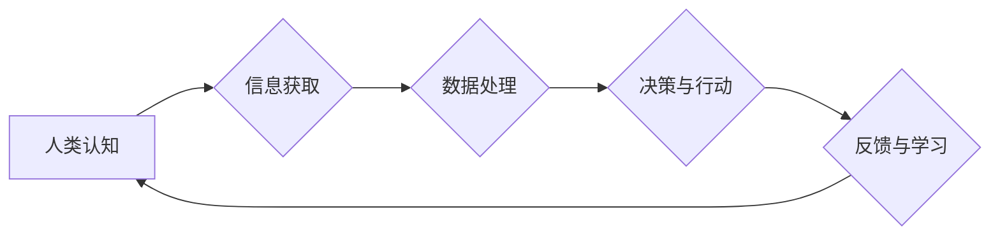

> 人类计算、人工智能、机器学习、深度学习、自然语言处理、计算机视觉、社会进步

## 1. 背景介绍

人类文明的发展离不开对信息的获取、处理和利用。随着信息技术的飞速发展，人类计算能力得到了极大的提升。从早期的机械计算器到如今的超级计算机，再到无所不在的智能手机和云计算平台，人类计算能力的不断增强，深刻地改变着我们的生活方式、工作模式和社会结构。

然而，人类计算能力的提升并非仅仅是技术进步的结果，更重要的是人类智慧和创造力的体现。人类能够通过抽象思维、逻辑推理和创造想象力，将复杂的现实世界转化为可计算的模型，并利用计算工具进行分析、模拟和预测。正是这种独特的“人类计算”能力，推动着社会进步的步伐。

## 2. 核心概念与联系

**2.1 人类计算的概念**

人类计算是指人类利用自身的认知能力和计算工具，对信息进行处理、分析和决策的过程。它涵盖了从感知、理解、记忆到推理、判断、创造等一系列认知活动。

**2.2 人工智能与人类计算的关系**

人工智能（AI）作为模拟人类智能的计算机系统，在一定程度上继承了人类计算的某些特征。例如，深度学习算法能够通过大量数据训练，学习识别模式和做出预测，类似于人类的学习和推理过程。

然而，人工智能与人类计算之间也存在着本质区别。人工智能系统仍然依赖于人类设计的算法和数据，而人类计算则更具灵活性、创造性和适应性。

**2.3 人类计算的积极影响**

人类计算在推动社会进步方面发挥着至关重要的作用。

* **科学研究与技术创新:** 人类计算能力的提升，推动了科学研究的深入和技术创新的加速。从探索宇宙奥秘到开发新材料，从设计智能机器人到构建虚拟现实世界，人类计算能力为人类探索未知领域提供了强大的工具。
* **经济发展与社会进步:** 人类计算能力的应用，推动了经济发展和社会进步。例如，大数据分析和人工智能技术，帮助企业优化运营、提高效率，并为消费者提供个性化服务。
* **文化传承与创造:** 人类计算能力，也为文化传承和创造提供了新的平台。例如，数字图书馆和虚拟博物馆，可以将文化遗产数字化保存和传播，并为人们提供更便捷的访问方式。

**2.4 Mermaid 流程图**



## 3. 核心算法原理 & 具体操作步骤

**3.1 算法原理概述**

人类计算的核心算法原理，可以概括为以下几个方面：

* **模式识别:** 人类能够通过观察和学习，识别出周围环境中的模式和规律。
* **逻辑推理:** 人类能够运用逻辑规则，从已知信息推导出新的结论。
* **知识表示与推理:** 人类能够将知识以符号或概念的形式表示出来，并通过推理机制进行知识发现和推导。
* **决策与规划:** 人类能够根据目标和环境信息，制定决策方案并进行计划执行。

**3.2 算法步骤详解**

人类计算的具体操作步骤，可以概括为以下几个阶段：

* **感知与理解:** 通过感官接收信息，并对信息进行初步理解和分类。
* **知识提取与表示:** 从感知到的信息中提取关键知识，并将其以符号或概念的形式表示出来。
* **推理与决策:** 利用已有的知识和逻辑规则，对问题进行推理和分析，并做出决策。
* **行动与反馈:** 根据决策方案，执行相应的行动，并根据行动结果进行反馈和学习。

**3.3 算法优缺点**

人类计算算法的优点：

* **灵活性:** 人类计算能够适应复杂和不确定的环境，并根据情况灵活调整策略。
* **创造性:** 人类能够进行原创性思维，提出新的解决方案和创意。
* **情感智能:** 人类能够理解和处理情感信息，并进行情感交流。

人类计算算法的缺点：

* **效率:** 人类计算效率相对较低，难以处理海量数据和复杂计算。
* **可重复性:** 人类计算结果受个人经验和主观判断影响，难以保证完全可重复性。
* **鲁棒性:** 人类计算系统容易受到干扰和错误影响。

**3.4 算法应用领域**

人类计算算法广泛应用于各个领域，例如：

* **医疗诊断:** 利用人工智能技术辅助医生进行疾病诊断和治疗方案制定。
* **金融风险管理:** 利用大数据分析和机器学习算法，识别金融风险并进行风险控制。
* **教育教学:** 利用人工智能技术个性化定制学习方案，提高学习效率。
* **智能制造:** 利用人工智能技术实现自动化生产和智能控制。

## 4. 数学模型和公式 & 详细讲解 & 举例说明

**4.1 数学模型构建**

人类计算过程可以抽象为一个数学模型，其中：

* **输入:** 感知到的信息
* **输出:** 决策和行动
* **状态:** 认知状态和知识库

**4.2 公式推导过程**

人类计算过程中的决策和行动，可以利用概率论和决策论等数学工具进行建模和分析。例如，可以使用贝叶斯公式来更新知识状态，并根据最大后验概率原则进行决策。

**4.3 案例分析与讲解**

例如，在医疗诊断领域，可以使用贝叶斯网络模型来表示疾病和症状之间的关系，并根据患者的症状信息，计算出不同疾病的概率，从而辅助医生进行诊断。

$$P(D|S) = \frac{P(S|D)P(D)}{P(S)}$$

其中：

* $P(D|S)$: 患者患有疾病D的概率，已知患者表现出症状S。
* $P(S|D)$: 患者表现出症状S的概率，已知患者患有疾病D。
* $P(D)$: 患者患有疾病D的概率。
* $P(S)$: 患者表现出症状S的概率。

## 5. 项目实践：代码实例和详细解释说明

**5.1 开发环境搭建**

* 操作系统: Ubuntu 20.04
* 编程语言: Python 3.8
* 库依赖: TensorFlow, NumPy, Pandas

**5.2 源代码详细实现**

```python
import tensorflow as tf
from tensorflow.keras.models import Sequential
from tensorflow.keras.layers import Dense

# 构建一个简单的多层感知机模型
model = Sequential()
model.add(Dense(128, activation='relu', input_shape=(784,)))
model.add(Dense(10, activation='softmax'))

# 编译模型
model.compile(optimizer='adam',
              loss='sparse_categorical_crossentropy',
              metrics=['accuracy'])

# 训练模型
model.fit(x_train, y_train, epochs=10)

# 评估模型
loss, accuracy = model.evaluate(x_test, y_test)
print('Test loss:', loss)
print('Test accuracy:', accuracy)
```

**5.3 代码解读与分析**

这段代码实现了构建和训练一个简单的多层感知机模型。

* `Sequential()` 创建一个顺序模型，即层级结构。
* `Dense()` 创建一个全连接层，其中 `128` 表示神经元数量， `relu` 表示激活函数， `input_shape=(784,)` 表示输入数据的形状。
* `compile()` 编译模型，指定优化器、损失函数和评估指标。
* `fit()` 训练模型，使用训练数据 `x_train` 和标签 `y_train`，训练 `10` 个 epochs。
* `evaluate()` 评估模型，使用测试数据 `x_test` 和标签 `y_test`，计算损失和准确率。

**5.4 运行结果展示**

训练完成后，模型可以用于预测新的数据。例如，可以将一张手写数字图像作为输入，模型会输出该图像对应的数字标签。

## 6. 实际应用场景

**6.1 人工智能助手**

人工智能助手，例如 Siri、Alexa 和 Google Assistant，利用自然语言处理和机器学习技术，能够理解用户的语音指令，并提供相应的服务，例如设置提醒、播放音乐、查询天气等。

**6.2 智能推荐系统**

智能推荐系统，例如 Netflix 和 Amazon 的推荐功能，利用用户行为数据和协同过滤算法，推荐用户可能感兴趣的电影、书籍或商品。

**6.3 自动驾驶汽车**

自动驾驶汽车，利用计算机视觉、传感器融合和路径规划算法，能够感知周围环境，并自主驾驶车辆。

**6.4 医疗诊断辅助系统**

医疗诊断辅助系统，利用机器学习算法分析患者的病历、影像数据和基因信息，辅助医生进行疾病诊断和治疗方案制定。

**6.5 金融风险管理系统**

金融风险管理系统，利用大数据分析和机器学习算法，识别金融风险并进行风险控制。

**6.4 未来应用展望**

随着人工智能技术的不断发展，人类计算将在更多领域发挥重要作用，例如：

* **个性化教育:** 利用人工智能技术，为每个学生提供个性化的学习方案，提高学习效率。
* **精准医疗:** 利用人工智能技术，根据患者的基因信息和病史，制定个性化的治疗方案。
* **智能城市:** 利用人工智能技术，优化城市交通、能源管理和环境保护。
* **人类增强:** 利用人工智能技术，增强人类的认知能力、创造力和生产力。

## 7. 工具和资源推荐

**7.1 学习资源推荐**

* **在线课程:** Coursera、edX、Udacity 等平台提供丰富的机器学习和人工智能课程。
* **书籍:** 《深度学习》、《人工智能：一种现代方法》等书籍。
* **开源项目:** TensorFlow、PyTorch 等开源机器学习框架。

**7.2 开发工具推荐**

* **编程语言:** Python、Java、C++ 等。
* **机器学习框架:** TensorFlow、PyTorch、Scikit-learn 等。
* **云计算平台:** AWS、Azure、Google Cloud 等。

**7.3 相关论文推荐**

* **AlphaGo论文:** https://arxiv.org/abs/1607.02886
* **BERT论文:** https://arxiv.org/abs/1810.04805
* **GPT-3论文:** https://arxiv.org/abs/2005.14165

## 8. 总结：未来发展趋势与挑战

**8.1 研究成果总结**

近年来，人工智能技术取得了长足进步，在各个领域都取得了显著应用。例如，在图像识别、语音识别、自然语言处理等领域，人工智能系统已经达到了甚至超过了人类水平。

**8.2 未来发展趋势**

未来，人工智能技术将继续朝着以下几个方向发展：

* **更强大的计算能力:** 随着硬件技术的进步，人工智能系统将拥有更强大的计算能力，能够处理更复杂的任务。
* **更深入的理解:** 人工智能系统将更加深入地理解人类语言和行为，能够更好地与人类进行交互。
* **更广泛的应用:** 人工智能技术将应用于更多领域，例如医疗、教育、金融、交通等。

**8.3 面临的挑战**

人工智能技术的发展也面临着一些挑战：

* **数据安全和隐私保护:** 人工智能系统依赖于大量数据，如何保证数据安全和隐私保护是一个重要问题。
* **算法偏见:** 人工智能算法可能存在偏见，导致不公平的结果。
* **伦理问题:** 人工智能技术的应用可能引发一些伦理问题，例如人工智能的责任和义务。

**8.4 研究展望**

未来，我们需要加强对人工智能技术的研究和开发，并制定相应的政策和规范，确保人工智能技术安全、可控和可持续发展。


## 9. 附录：常见问题与解答

**9.1 如何学习人工智能？**

学习人工智能需要掌握一定的数学、编程和机器学习基础知识。