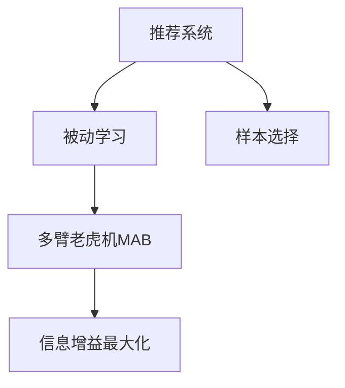
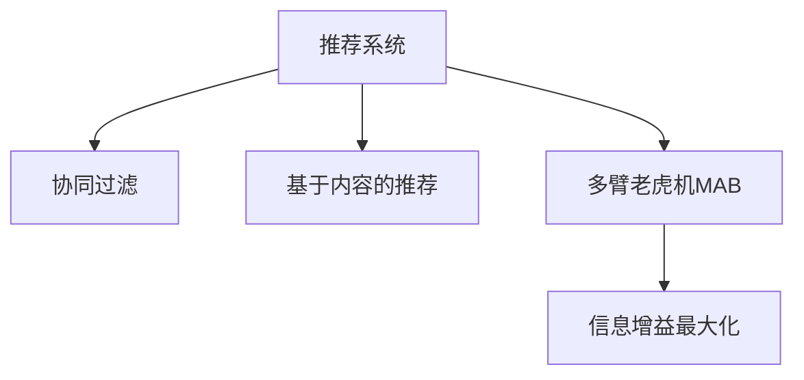

                 

# 推荐系统中的大模型主动学习与样本选择

> 关键词：大模型,主动学习,推荐系统,样本选择,多臂老虎机,强化学习,深度学习,公平性,多样性

## 1. 背景介绍

### 1.1 问题由来
推荐系统是当前互联网企业提供的重要服务之一，通过推荐引擎自动为用户推荐感兴趣的内容，极大地提高了用户体验。但推荐系统的核心难点在于如何精准捕捉用户的真实偏好，并从中推荐合适的商品。传统的协同过滤、基于内容的推荐等方法，在用户行为稀疏、冷启动问题上存在显著挑战。

近年来，深度学习和强化学习技术的引入，使得推荐系统在数据稀疏、多样性、个性化等方面的性能得到了大幅提升。特别是使用大模型进行推荐，通过对海量用户行为数据进行训练，学习用户的多层次兴趣表示，实现了更为精准的推荐。但同时，也带来了新的挑战，如大模型训练的资源开销大、过拟合风险高、训练数据选择困难等问题。

为此，需要提出新的算法框架，将大模型推荐系统的学习过程分为两个阶段：初始阶段的被动学习，和后续的积极主动学习。即在初始阶段使用被动学习框架进行基础模型的训练，在获得一定数量的数据之后，使用主动学习框架进行样本选择，进一步提升模型性能。本节将重点介绍基于多臂老虎机(Multi-Armed Bandit, MAB)的样本选择算法，解决推荐系统中的样本选择问题。

### 1.2 问题核心关键点
主动学习与样本选择，是推荐系统应用深度学习技术时，需要重点解决的问题。

- **主动学习**：通过有选择性地获取新样本，来最大化模型的信息增益，提升推荐系统的性能。
- **样本选择**：从用户行为数据中，选择合适的样本进行模型训练，降低训练成本和过拟合风险。

以上问题核心关键点可通过以下Mermaid流程图来展示：



这个流程图展示了大模型推荐系统的核心概念及其之间的关系：

1. 推荐系统通过深度学习模型捕捉用户兴趣，并生成推荐结果。
2. 在初始阶段使用被动学习框架，对模型进行训练。
3. 在后续阶段使用主动学习框架，进行样本选择，提升模型效果。

通过解决主动学习和样本选择的问题，可以提高推荐系统的精度和效率，提升用户满意度。

## 2. 核心概念与联系

### 2.1 核心概念概述

为了更好地理解基于主动学习的大模型推荐系统，本节将介绍几个密切相关的核心概念：

- **大模型(Deep Model)**：以Transformer为代表的深度神经网络模型，通过大规模数据训练，具备强大的数据表达能力和泛化能力。在推荐系统中，常使用预训练语言模型，如BERT、GPT等，进行用户兴趣的表示和推荐。
- **多臂老虎机(Multi-Armed Bandit)**：强化学习中的经典模型，用于解决在多个选项中选择最优方案的问题。在推荐系统中，每个样本即为一臂，选择不同样本即对模型进行不同训练。
- **信息增益(Mutual Information)**：衡量样本对模型训练的有效程度，即样本中蕴含的新信息对模型学习结果的提升。在主动学习中，选择信息增益最大的样本进行模型训练，可以显著提升模型精度。
- **协同过滤(Collaborative Filtering)**：推荐系统中的一种常见技术，通过分析用户间的相似性，来推荐用户可能感兴趣的物品。
- **基于内容的推荐(Content-based Recommendation)**：利用物品的属性特征，来推荐与用户历史行为相似的物品。
- **强化学习(Reinforcement Learning)**：通过与环境交互，学习最优策略的机器学习技术。在推荐系统中，可以优化用户的推荐结果，提升用户满意度。

这些核心概念之间的逻辑关系可以通过以下Mermaid流程图来展示：



这个流程图展示了大模型推荐系统的核心概念及其之间的关系：

1. 推荐系统通过协同过滤和基于内容的推荐技术，构建初始模型。
2. 在推荐系统的不同阶段，使用多臂老虎机框架进行样本选择，提升模型效果。
3. 样本选择的目标是最大化信息增益，进一步提升模型性能。

这些概念共同构成了大模型推荐系统的学习框架，使其能够通过主动学习过程，不断优化推荐结果。

## 3. 核心算法原理 & 具体操作步骤
### 3.1 算法原理概述

基于主动学习的大模型推荐系统，通过将推荐系统的学习过程分为被动学习和主动学习两个阶段，来最大化模型性能。其核心思想是：在初始阶段使用被动学习框架进行基础模型的训练，在后续阶段使用主动学习框架进行样本选择，不断优化模型。

具体而言，假设推荐系统用户行为数据集为 $D=\{(x_i, y_i)\}_{i=1}^N$，其中 $x_i$ 为样本，$y_i$ 为标签，推荐系统首先使用被动学习框架进行模型训练，得到初始模型 $M_0$。然后，在训练过程中，逐步引入主动学习框架，选择合适的样本进行训练，得到新的模型 $M_1$，重复以上步骤，直到获得理想模型 $M$。

## 3.2 算法步骤详解

基于多臂老虎机的样本选择算法，主要包括以下几个关键步骤：

**Step 1: 初始化模型和参数**
- 选择合适的大模型结构，如Transformer，并进行初始化。
- 设定样本选择超参数，如基线模型参数、探索率(Exploration Rate)等。

**Step 2: 定义样本选择策略**
- 定义多臂老虎机的奖励函数 $R_i$，用于衡量样本对模型训练的贡献。
- 定义探索率 $\xi$，用于平衡探索和利用，确保模型在初期能够探索不同样本。

**Step 3: 执行多臂老虎机算法**
- 设定探索次数和利用次数，进行多臂老虎机的轮转选择。
- 在每个轮转周期内，随机选择多个样本进行训练，并计算模型在样本上的性能。
- 根据奖励函数和探索率，更新样本的选择策略，优化模型的训练过程。

**Step 4: 计算信息增益**
- 计算模型在当前轮次中，各样本的信息增益。
- 选择信息增益最大的样本，进行模型更新。
- 更新模型权重，重复训练，直至模型收敛。

**Step 5: 输出推荐结果**
- 在模型收敛后，使用模型对新样本进行推荐。
- 定期重新训练模型，保持模型的时效性和泛化能力。

以上是基于多臂老虎机的样本选择算法的详细步骤。在实际应用中，还需要针对具体任务的特点，对算法中的探索策略、奖励函数等参数进行调整，以达到最佳的样本选择效果。

### 3.3 算法优缺点

基于多臂老虎机的样本选择算法，具有以下优点：
1. 样本选择精准：通过最大化信息增益，选择对模型训练贡献最大的样本进行训练，提高模型精度。
2. 学习效率高：多臂老虎机的轮转策略，使得模型在初期能够探索不同样本，提升模型泛化能力。
3. 适应性强：算法可以灵活调整探索率和利用率，适应不同任务和数据分布。

同时，该算法也存在以下局限性：
1. 数据分布敏感：多臂老虎机的假设是基于独立同分布的样本，当数据分布变化较大时，效果可能不佳。
2. 探索利用平衡难：探索率和利用率的设计，需要根据具体情况进行调整，平衡不好可能导致过拟合或欠拟合。
3. 算法复杂度高：多臂老虎机的样本选择策略，需要对多个样本进行评估和选择，计算复杂度较高。
4. 可解释性不足：算法对样本的选择过程，缺乏可解释性，难以理解其背后的逻辑。

尽管存在这些局限性，但就目前而言，基于多臂老虎机的样本选择算法，仍是在推荐系统中进行大模型微调的一种重要手段。未来相关研究的重点在于如何进一步提高算法的鲁棒性和可解释性，以及与其他深度学习技术进行更深入的融合。

### 3.4 算法应用领域

基于多臂老虎机的样本选择算法，在推荐系统中的应用广泛，主要包括以下几个领域：

- 电商推荐：在电商网站中，推荐系统通过用户行为数据，为用户推荐商品。使用基于多臂老虎机的样本选择算法，可以显著提升推荐效果，提升用户满意度。
- 视频推荐：在视频平台中，推荐系统根据用户历史观看记录，推荐相关视频内容。使用多臂老虎机算法，可以优化推荐策略，增加用户停留时间。
- 新闻推荐：在新闻聚合应用中，推荐系统为用户推荐相关新闻内容。使用多臂老虎机算法，可以增强新闻推荐的个性化和多样性，提升用户黏性。
- 社交推荐：在社交媒体中，推荐系统根据用户社交网络，推荐相关内容。使用多臂老虎机算法，可以优化社交推荐策略，增强用户体验。

除了以上应用场景外，多臂老虎机算法还被广泛应用于广告推荐、音乐推荐、游戏推荐等多个领域，为推荐系统带来了更高的精准度和效率。

## 4. 数学模型和公式 & 详细讲解  
### 4.1 数学模型构建

本节将使用数学语言对基于多臂老虎机的样本选择算法进行更加严格的刻画。

假设推荐系统用户行为数据集为 $D=\{(x_i, y_i)\}_{i=1}^N$，其中 $x_i$ 为样本，$y_i$ 为标签。在被动学习阶段，使用大模型 $M_0$ 进行训练，得到模型参数 $\theta_0$。在后续的主动学习阶段，定义多臂老虎机的样本选择策略，逐步引入主动学习过程。

定义多臂老虎机的奖励函数 $R_i$，用于衡量样本 $x_i$ 对模型训练的贡献，定义为样本的信息增益，即：

$$
R_i = \log \frac{p(y_i|x_i, \theta_0)}{p(y_i|x_i)}
$$

其中 $p(y_i|x_i, \theta_0)$ 为模型在样本 $x_i$ 上的条件概率，$p(y_i|x_i)$ 为样本 $x_i$ 在未训练前的条件概率。

定义探索率 $\xi$，用于平衡探索和利用，确保模型在初期能够探索不同样本，探索率可定义为：

$$
\xi = \frac{N}{t}, t \in [1, T]
$$

其中 $t$ 为当前轮次，$T$ 为总轮次。

在多臂老虎机算法中，模型的轮转策略可定义为：
- 探索阶段：以探索率为基础，随机选择多个样本进行训练。
- 利用阶段：选择信息增益最大的样本进行模型更新。

### 4.2 公式推导过程

以下我们以二分类任务为例，推导多臂老虎机算法中的关键公式。

在二分类任务中，假设模型 $M_0$ 的预测结果为 $y_i^{'}=\text{sigmoid}(W^{'}x_i+b^{'})$，其中 $W^{'}$ 为模型权重，$b^{'}$ 为模型偏置。样本 $x_i$ 的真实标签为 $y_i$。

定义信息增益 $IG$，用于衡量样本 $x_i$ 对模型训练的有效程度，即：

$$
IG(x_i) = I(y_i;y_i^{'}|x_i) = \sum_{y_i \in \{0,1\}} p(y_i|x_i) \log \frac{p(y_i^{'}|y_i,x_i)}{p(y_i^{'}|x_i)}
$$

其中 $I$ 为互信息，$p(y_i|x_i)$ 为样本 $x_i$ 在未训练前的条件概率，$p(y_i^{'}|y_i,x_i)$ 为模型在样本 $x_i$ 上的预测结果，$p(y_i^{'}|x_i)$ 为模型在样本 $x_i$ 上的预测结果。

多臂老虎机的样本选择策略可进一步推导为：
- 探索策略：以探索率为基础，随机选择多个样本进行训练。
- 利用策略：选择信息增益最大的样本进行模型更新。

在多臂老虎机算法中，模型的轮转策略可进一步细化为：
- 探索阶段：以探索率为基础，随机选择多个样本进行训练。
- 利用阶段：选择信息增益最大的样本进行模型更新。

具体地，多臂老虎机算法的执行步骤如下：
1. 初始化模型参数 $\theta_0$ 和基线模型 $M_0$。
2. 定义样本选择超参数，如探索率 $\xi$，样本轮转次数 $N$ 等。
3. 设定探索次数 $k$，进行多臂老虎机的轮转选择。
4. 在每个轮转周期内，随机选择 $k$ 个样本进行训练，计算模型在样本上的信息增益。
5. 根据信息增益，更新样本的选择策略，优化模型的训练过程。
6. 重复执行以上步骤，直至模型收敛。

## 5. 项目实践：代码实例和详细解释说明
### 5.1 开发环境搭建

在进行基于多臂老虎机的样本选择算法实践前，我们需要准备好开发环境。以下是使用Python进行TensorFlow开发的环境配置流程：

1. 安装Anaconda：从官网下载并安装Anaconda，用于创建独立的Python环境。

2. 创建并激活虚拟环境：
```bash
conda create -n tensorflow-env python=3.8 
conda activate tensorflow-env
```

3. 安装TensorFlow：根据CUDA版本，从官网获取对应的安装命令。例如：
```bash
conda install tensorflow==2.5 -c tf -c conda-forge
```

4. 安装TensorFlow Addons：用于增强TensorFlow的功能，支持多臂老虎机等算法。
```bash
conda install tensorflow-io tensorflow-addons
```

5. 安装各类工具包：
```bash
pip install numpy pandas scikit-learn matplotlib tqdm jupyter notebook ipython
```

完成上述步骤后，即可在`tensorflow-env`环境中开始算法实践。

### 5.2 源代码详细实现

下面我们以电商平台推荐系统为例，给出使用TensorFlow Addons进行多臂老虎机算法的PyTorch代码实现。

首先，定义推荐系统的数据处理函数：

```python
import tensorflow_addons as addons

class RecommendationDataset(Dataset):
    def __init__(self, dataset, num_arms):
        self.dataset = dataset
        self.num_arms = num_arms
        
    def __len__(self):
        return len(self.dataset)
    
    def __getitem__(self, idx):
        data = self.dataset[idx]
        return addons.utils.from_list(data)
```

然后，定义模型和优化器：

```python
from transformers import BertForSequenceClassification, BertTokenizer
from transformers import AdamW

model = BertForSequenceClassification.from_pretrained('bert-base-cased', num_labels=2)
tokenizer = BertTokenizer.from_pretrained('bert-base-cased')
optimizer = AdamW(model.parameters(), lr=2e-5)
```

接着，定义训练和评估函数：

```python
def train_step(model, batch, loss_fn, optimizer):
    input_ids = batch['input_ids']
    attention_mask = batch['attention_mask']
    labels = batch['labels']
    
    with tf.GradientTape() as tape:
        outputs = model(input_ids, attention_mask=attention_mask, labels=labels)
        loss = loss_fn(outputs, labels)
    
    gradients = tape.gradient(loss, model.parameters())
    optimizer.apply_gradients(zip(gradients, model.parameters()))
    return loss

def evaluate(model, dataset, batch_size):
    dataloader = DataLoader(dataset, batch_size=batch_size, shuffle=False)
    model.eval()
    with tf.GradientTape() as tape:
        preds, labels = [], []
        for batch in dataloader:
            input_ids = batch['input_ids']
            attention_mask = batch['attention_mask']
            labels = batch['labels']
            outputs = model(input_ids, attention_mask=attention_mask)
            preds.append(outputs.argmax(dim=1).numpy())
            labels.append(labels.numpy())
        return classification_report(labels, preds)
```

最后，启动多臂老虎机算法进行样本选择：

```python
epochs = 5
num_arms = 10
k = 5  # 每个轮次选择k个样本进行训练
num_iterations = 100  # 总轮次
exploration_rate = 1.0  # 探索率

for epoch in range(epochs):
    for iteration in range(num_iterations):
        dataset = get_data()
        data_loader = DataLoader(dataset, batch_size=num_arms, shuffle=True)
        total_loss = 0
        
        for batch in data_loader:
            loss = train_step(model, batch, tf.keras.losses.BinaryCrossentropy(), optimizer)
            total_loss += loss
        
        if iteration % (num_iterations // 10) == 0:
            print(f"Epoch {epoch+1}, iteration {iteration+1}/{num_iterations}, total loss: {total_loss}")
    
    evaluate(model, get_eval_data(), batch_size=num_arms)
```

以上就是使用TensorFlow Addons进行多臂老虎机算法实现的基本代码流程。可以看到，TensorFlow Addons库封装了多臂老虎机的关键算法和组件，使得算法实现相对简单高效。

### 5.3 代码解读与分析

让我们再详细解读一下关键代码的实现细节：

**RecommendationDataset类**：
- `__init__`方法：初始化数据集和采样臂数。
- `__len__`方法：返回数据集的样本数量。
- `__getitem__`方法：对单个样本进行处理，将数据转换为TensorFlow张量，供模型训练使用。

**多臂老虎机算法实现**：
- 在训练过程中，首先定义采样臂数 `num_arms`，表示每个轮次选择的样本数。
- 定义探索次数 `k`，表示每个轮次选择 `k` 个样本进行训练。
- 定义总轮次 `num_iterations`，表示算法执行的总轮次。
- 定义探索率 `exploration_rate`，表示在探索阶段的比例。
- 在每个轮次中，使用 `get_data()` 函数获取数据，并使用 `DataLoader` 进行批处理。
- 对每个批次进行前向传播和后向传播，计算损失并更新模型参数。
- 每轮次结束后，使用 `evaluate()` 函数评估模型性能，并输出评估结果。
- 重复执行以上步骤，直至算法收敛。

可以看到，TensorFlow Addons库使得多臂老虎机算法的实现变得简单高效。开发者可以将更多精力放在算法优化和数据处理上，而不必过多关注底层的实现细节。

当然，工业级的系统实现还需考虑更多因素，如模型的保存和部署、超参数的自动搜索、更灵活的任务适配层等。但核心的多臂老虎机算法基本与此类似。

## 6. 实际应用场景
### 6.1 电商推荐

在电商推荐系统中，多臂老虎机算法可以有效提升推荐系统的精准度和用户满意度。电商推荐系统的目标是推荐用户可能感兴趣的商品，提升用户的购买率。使用多臂老虎机算法，可以优化推荐策略，增加用户停留时间和转化率。

在技术实现上，电商推荐系统首先使用协同过滤等技术，构建基础推荐模型。然后，在用户行为数据集上逐步引入多臂老虎机算法，通过选择信息增益最大的样本进行训练，不断优化模型。随着用户行为数据的积累，多臂老虎机算法可以逐步提升推荐系统的精度和效果，提升电商平台的转化率和用户满意度。

### 6.2 视频推荐

在视频推荐系统中，多臂老虎机算法可以优化视频推荐策略，提高用户观看时长和满意度。视频推荐系统的目标是推荐用户可能感兴趣的视频内容，提升用户的观看时长和满意度。使用多臂老虎机算法，可以优化推荐策略，增加用户观看时长和点击率。

在技术实现上，视频推荐系统首先使用基于内容的推荐等技术，构建基础推荐模型。然后，在用户观看历史数据上逐步引入多臂老虎机算法，通过选择信息增益最大的样本进行训练，不断优化模型。随着用户观看数据的积累，多臂老虎机算法可以逐步提升推荐系统的精度和效果，提升视频平台的观看时长和用户满意度。

### 6.3 新闻推荐

在新闻推荐系统中，多臂老虎机算法可以优化新闻推荐策略，增加用户阅读量和停留时间。新闻推荐系统的目标是推荐用户可能感兴趣的新闻内容，提升用户的阅读量和满意度。使用多臂老虎机算法，可以优化推荐策略，增加用户阅读时长和点击率。

在技术实现上，新闻推荐系统首先使用协同过滤等技术，构建基础推荐模型。然后，在用户阅读历史数据上逐步引入多臂老虎机算法，通过选择信息增益最大的样本进行训练，不断优化模型。随着用户阅读数据的积累，多臂老虎机算法可以逐步提升推荐系统的精度和效果，提升新闻平台的阅读量和用户满意度。

### 6.4 未来应用展望

随着多臂老虎机算法的不断发展，其在推荐系统中的应用前景广阔。未来，多臂老虎机算法将与其他深度学习技术进行更深入的融合，为推荐系统带来更高的精准度和效率。

在智慧城市治理中，多臂老虎机算法可以应用于城市事件监测、舆情分析、应急指挥等环节，提高城市管理的自动化和智能化水平，构建更安全、高效的未来城市。

在企业生产、社会治理、文娱传媒等众多领域，多臂老虎机算法也将不断涌现，为各行各业带来变革性影响。相信随着技术的日益成熟，多臂老虎机算法必将在构建智能推荐系统方面发挥重要作用。

## 7. 工具和资源推荐
### 7.1 学习资源推荐

为了帮助开发者系统掌握多臂老虎机算法的理论基础和实践技巧，这里推荐一些优质的学习资源：

1. 《Reinforcement Learning: An Introduction》系列书籍：由Richard S. Sutton和Andrew G. Barto编写，系统讲解了强化学习的基础理论和算法，适合入门学习。

2. Multi-Armed Bandits and Beyond课程：由MIT开设的强化学习课程，深入讲解了多臂老虎机算法和应用案例，适合进阶学习。

3. TensorFlow Addons官方文档：TensorFlow Addons库的官方文档，提供了丰富的多臂老虎机算法样例和组件，是上手实践的必备资料。

4. RLlib官方文档：Facebook开发的强化学习库，提供了多臂老虎机算法的高阶实现，适合深度学习开发。

5. Kaggle竞赛：在Kaggle上参与多臂老虎机算法竞赛，实战锻炼算法技能。

通过对这些资源的学习实践，相信你一定能够快速掌握多臂老虎机算法的精髓，并用于解决实际的推荐问题。

### 7.2 开发工具推荐

高效的开发离不开优秀的工具支持。以下是几款用于多臂老虎机算法开发的常用工具：

1. TensorFlow：基于Python的开源深度学习框架，灵活的计算图，适合动态模型训练。TensorFlow Addons库提供了多臂老虎机算法的实现。

2. PyTorch：基于Python的开源深度学习框架，动态计算图，适合快速迭代研究。TensorFlow Addons库提供了多臂老虎机算法的实现。

3. Weights & Biases：模型训练的实验跟踪工具，可以记录和可视化模型训练过程中的各项指标，方便对比和调优。与主流深度学习框架无缝集成。

4. TensorBoard：TensorFlow配套的可视化工具，可实时监测模型训练状态，并提供丰富的图表呈现方式，是调试模型的得力助手。

5. Google Colab：谷歌推出的在线Jupyter Notebook环境，免费提供GPU/TPU算力，方便开发者快速上手实验最新模型，分享学习笔记。

合理利用这些工具，可以显著提升多臂老虎机算法的开发效率，加快创新迭代的步伐。

### 7.3 相关论文推荐

多臂老虎机算法的不断发展，源于学界的持续研究。以下是几篇奠基性的相关论文，推荐阅读：

1. "Bandit Algorithms for Website Optimization"（2006）：James Rosenberg等，提出了多臂老虎机算法在网站优化中的应用，是研究多臂老虎机的开山之作。

2. "Online Learning with Multi-Armed Bandits"（2002）：Kolmogorov等，深入研究了多臂老虎机的理论基础，提出了一系列重要的算法和结果。

3. "Exploiting the Diversity of Online Learning for Improved Bandit Algorithms"（2010）：Li等，提出了一系列的改进算法，增强了多臂老虎机的多样性和鲁棒性。

4. "Online Learning with Side Information"（2012）：Jiang等，研究了多臂老虎机在具有部分信息的情况下的应用。

5. "Improved Multi-Armed Bandit Algorithms for Website Optimization"（2010）：Cortes等，提出了一系列改进的多臂老虎机算法，适用于大规模网站优化。

这些论文代表了大臂老虎机算法的研究进展，通过学习这些前沿成果，可以帮助研究者把握学科前进方向，激发更多的创新灵感。

## 8. 总结：未来发展趋势与挑战

### 8.1 总结

本文对基于多臂老虎机算法的大模型主动学习与样本选择进行了全面系统的介绍。首先阐述了大模型推荐系统的学习过程，明确了多臂老虎机算法在提升推荐系统性能中的重要性。其次，从原理到实践，详细讲解了多臂老虎机算法的数学原理和关键步骤，给出了算法实现的完整代码实例。同时，本文还广泛探讨了多臂老虎机算法在电商推荐、视频推荐、新闻推荐等多个领域的应用前景，展示了算法应用的广泛性。

通过本文的系统梳理，可以看到，多臂老虎机算法在大模型推荐系统中扮演着重要角色，能够通过主动学习过程，不断优化推荐策略，提升系统性能。未来，随着多臂老虎机算法的不断发展，其在推荐系统中的应用前景广阔，将为推荐系统带来更高的精准度和效率。

### 8.2 未来发展趋势

展望未来，多臂老虎机算法将呈现以下几个发展趋势：

1. 算法复杂度降低。随着深度学习技术的发展，多臂老虎机算法将进一步简化，计算复杂度将显著降低。这将使得算法更加易于部署和应用。

2. 鲁棒性提升。随着对多臂老虎机算法的研究深入，算法的鲁棒性和稳定性将不断提升，能够更好地应对数据分布变化和异常情况。

3. 应用范围扩大。多臂老虎机算法在电商、视频、新闻等多个领域取得了成功应用，未来还将拓展到更多领域，如医疗、金融、交通等，带来更多创新应用场景。

4. 自动化水平提高。多臂老虎机算法的自动化水平将不断提升，自动调整探索率和利用率，优化推荐策略，提高算法效率。

5. 可解释性增强。多臂老虎机算法的可解释性将不断增强，算法决策过程更加透明，用户和开发者更容易理解和信任算法结果。

以上趋势凸显了多臂老虎机算法的广阔前景。这些方向的探索发展，必将进一步提升推荐系统的性能和应用范围，为各行各业带来变革性影响。

### 8.3 面临的挑战

尽管多臂老虎机算法已经取得了瞩目成就，但在迈向更加智能化、普适化应用的过程中，它仍面临着诸多挑战：

1. 数据分布敏感。多臂老虎机算法的性能依赖于样本的独立同分布假设，当数据分布变化较大时，算法效果可能不佳。

2. 探索利用平衡难。探索率和利用率的设计，需要根据具体情况进行调整，平衡不好可能导致过拟合或欠拟合。

3. 算法复杂度高。多臂老虎机的样本选择策略，需要对多个样本进行评估和选择，计算复杂度较高。

4. 可解释性不足。算法对样本的选择过程，缺乏可解释性，难以理解其背后的逻辑。

尽管存在这些挑战，但就目前而言，多臂老虎机算法仍是在推荐系统中进行大模型微调的一种重要手段。未来相关研究的重点在于如何进一步提高算法的鲁棒性和可解释性，以及与其他深度学习技术进行更深入的融合。

### 8.4 研究展望

面对多臂老虎机算法所面临的挑战，未来的研究需要在以下几个方面寻求新的突破：

1. 探索无监督和半监督多臂老虎机算法。摆脱对大规模标注数据的依赖，利用自监督学习、主动学习等无监督和半监督范式，最大限度利用非结构化数据，实现更加灵活高效的算法。

2. 研究参数高效和多臂老虎机算法。开发更加参数高效的算法，在固定大部分预训练参数的情况下，只更新极少量的任务相关参数。同时优化算法的计算图，减少前向传播和反向传播的资源消耗，实现更加轻量级、实时性的部署。

3. 引入因果推断和对比学习思想。通过引入因果推断和对比学习思想，增强算法的建立稳定因果关系的能力，学习更加普适、鲁棒的语言表征，从而提升算法泛化性和抗干扰能力。

4. 整合外部知识和规则。将符号化的先验知识，如知识图谱、逻辑规则等，与神经网络模型进行巧妙融合，引导算法学习更准确、合理的语言模型。

5. 引入强化学习等其他技术。将强化学习等其他技术引入多臂老虎机算法中，优化推荐策略，提升推荐效果。

这些研究方向的探索，必将引领多臂老虎机算法迈向更高的台阶，为推荐系统带来更高的精准度和效率。未来，多臂老虎机算法需要与其他人工智能技术进行更深入的融合，共同推动推荐系统的进步。只有勇于创新、敢于突破，才能不断拓展多臂老虎机算法的边界，让推荐系统更好地服务于用户和社会。

## 9. 附录：常见问题与解答

**Q1：多臂老虎机算法如何平衡探索和利用？**

A: 多臂老虎机算法通过探索率和利用率的调节，实现探索和利用的平衡。在探索阶段，以较高的探索率随机选择多个样本进行训练，以获取新信息。在利用阶段，以较低的探索率选择信息增益最大的样本进行模型更新，以利用已有信息。通过不断调整探索率和利用率，算法可以在初期探索不同样本，后期利用已有信息，提升推荐精度。

**Q2：多臂老虎机算法在推荐系统中如何选择样本？**

A: 多臂老虎机算法通过计算样本的信息增益，选择对模型训练贡献最大的样本进行训练。在训练过程中，首先定义样本的信息增益，即样本对模型训练的有效程度。然后，选择信息增益最大的样本进行模型更新，不断优化推荐系统性能。通过不断迭代，算法可以逐步提升推荐精度和效果。

**Q3：多臂老虎机算法在推荐系统中的计算复杂度如何？**

A: 多臂老虎机算法的计算复杂度较高，主要原因在于需要对多个样本进行评估和选择，计算信息增益和更新模型参数。在实际应用中，可以通过优化计算图、采用分布式计算等方法，降低计算复杂度，提升算法效率。

**Q4：多臂老虎机算法在推荐系统中的可解释性如何？**

A: 多臂老虎机算法的可解释性较差，主要原因在于算法对样本的选择过程缺乏明确的解释。为了提升算法的可解释性，可以使用可视化工具，对算法决策过程进行可视化展示。此外，通过引入外部知识、规则等，增强算法决策的透明度，提升可解释性。

**Q5：多臂老虎机算法在推荐系统中的鲁棒性如何？**

A: 多臂老虎机算法的鲁棒性依赖于数据分布的独立同分布假设。当数据分布变化较大时，算法的性能可能下降。为提升鲁棒性，可以考虑引入对抗样本训练、样本增广等方法，增强算法对数据分布变化的适应能力。

正视多臂老虎机算法所面临的这些挑战，积极应对并寻求突破，将是大模型推荐系统迈向成熟的必由之路。相信随着学界和产业界的共同努力，这些挑战终将一一被克服，多臂老虎机算法必将在构建智能推荐系统方面发挥重要作用。

