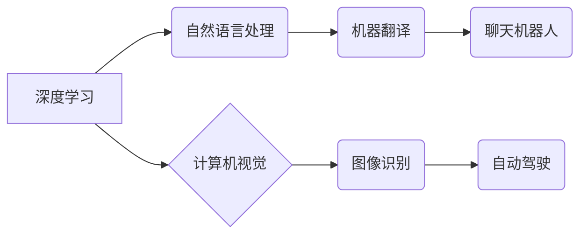

> AI 2.0, 
> 深度学习, 
> 自然语言处理, 
> 计算机视觉, 
> 机器学习, 
> 算法, 
> 应用场景

## 1. 背景介绍

人工智能（AI）技术近年来发展迅速，从最初的局限于特定领域的应用，逐渐发展到广泛应用于各个领域，深刻地改变着我们的生活方式和工作模式。随着深度学习算法的突破和计算能力的提升，AI 进入了 2.0 时代，其能力和应用场景都发生了质的飞跃。

李开复，作为一位享誉全球的人工智能专家，在 AI 2.0 时代的发展中扮演着重要的角色。他不仅是一位杰出的科学家和工程师，更是一位优秀的科技传播者，致力于将 AI 技术的最新进展和未来趋势传递给大众。

## 2. 核心概念与联系

AI 2.0 时代的核心概念包括深度学习、自然语言处理、计算机视觉、机器学习等。这些概念相互关联，共同推动着 AI 技术的进步。

**Mermaid 流程图：**



**深度学习**：深度学习是一种基于多层神经网络的机器学习方法，能够从海量数据中自动学习特征，并进行复杂的模式识别和预测。

**自然语言处理**：自然语言处理是指让计算机能够理解、处理和生成人类语言的技术。

**计算机视觉**：计算机视觉是指让计算机能够“看”和理解图像和视频的技术。

**机器学习**：机器学习是一种人工智能技术，通过算法训练模型，使模型能够从数据中学习并做出预测。

## 3. 核心算法原理 & 具体操作步骤

### 3.1  算法原理概述

深度学习算法的核心是多层神经网络。神经网络由多个层组成，每层包含多个神经元。每个神经元接收来自上一层的输入信号，并对其进行处理，然后将处理后的信号传递给下一层的输入。通过多层神经网络的叠加，可以实现对数据的复杂特征提取和学习。

### 3.2  算法步骤详解

1. **数据预处理**: 将原始数据进行清洗、转换和格式化，使其适合深度学习模型的训练。
2. **模型构建**: 根据任务需求选择合适的深度学习模型架构，例如卷积神经网络（CNN）、循环神经网络（RNN）等。
3. **模型训练**: 使用训练数据训练深度学习模型，调整模型参数，使其能够准确地预测或分类数据。
4. **模型评估**: 使用测试数据评估模型的性能，例如准确率、召回率、F1-score等。
5. **模型部署**: 将训练好的模型部署到实际应用场景中，用于进行预测或分类。

### 3.3  算法优缺点

**优点**:

* 能够自动学习复杂特征，无需人工特征工程。
* 性能优异，在图像识别、自然语言处理等领域取得了突破性进展。
* 可扩展性强，可以处理海量数据。

**缺点**:

* 训练数据量大，需要大量的计算资源和时间。
* 模型解释性差，难以理解模型的决策过程。
* 对数据质量要求高，数据噪声或偏差会影响模型性能。

### 3.4  算法应用领域

深度学习算法广泛应用于各个领域，例如：

* **计算机视觉**: 图像识别、物体检测、图像分割、人脸识别等。
* **自然语言处理**: 机器翻译、文本摘要、情感分析、聊天机器人等。
* **语音识别**: 语音转文本、语音助手等。
* **医疗诊断**: 疾病诊断、影像分析等。
* **金融分析**: 风险评估、欺诈检测等。

## 4. 数学模型和公式 & 详细讲解 & 举例说明

### 4.1  数学模型构建

深度学习模型的数学基础是神经网络。神经网络由多个层组成，每层包含多个神经元。每个神经元接收来自上一层的输入信号，并对其进行处理，然后将处理后的信号传递给下一层的输入。

**神经元模型**:

$$
y = f(w^T x + b)
$$

其中：

* $x$ 是输入向量
* $w$ 是权重向量
* $b$ 是偏置项
* $f$ 是激活函数

### 4.2  公式推导过程

深度学习模型的训练过程是通过反向传播算法来进行的。反向传播算法的核心思想是通过计算误差信号，并反向传播到各层神经元，调整权重和偏置项，使得模型的预测结果与真实值尽可能接近。

**反向传播算法**:

1. 计算输出层的误差信号。
2. 根据误差信号，计算各层神经元的梯度。
3. 使用梯度下降算法更新权重和偏置项。

### 4.3  案例分析与讲解

**举例说明**:

假设我们有一个简单的深度学习模型，用于识别手写数字。模型的输入是一个 28x28 的图像，输出是一个 10 维的向量，分别代表数字 0 到 9 的概率。

在训练过程中，我们使用大量的标注好的手写数字图像数据，通过反向传播算法，调整模型的权重和偏置项，使得模型能够准确地识别手写数字。

## 5. 项目实践：代码实例和详细解释说明

### 5.1  开发环境搭建

为了实现深度学习模型的开发和训练，我们需要搭建一个合适的开发环境。常用的开发环境包括：

* **Python**: 深度学习框架的编程语言。
* **TensorFlow**: Google 开发的开源深度学习框架。
* **PyTorch**: Facebook 开发的开源深度学习框架。
* **CUDA**: NVIDIA 开发的 GPU 计算平台。

### 5.2  源代码详细实现

以下是一个使用 TensorFlow 实现手写数字识别模型的简单代码示例：

```python
import tensorflow as tf

# 定义模型结构
model = tf.keras.models.Sequential([
    tf.keras.layers.Flatten(input_shape=(28, 28)),
    tf.keras.layers.Dense(128, activation='relu'),
    tf.keras.layers.Dense(10, activation='softmax')
])

# 编译模型
model.compile(optimizer='adam',
              loss='sparse_categorical_crossentropy',
              metrics=['accuracy'])

# 训练模型
model.fit(x_train, y_train, epochs=5)

# 评估模型
loss, accuracy = model.evaluate(x_test, y_test)
print('Test loss:', loss)
print('Test accuracy:', accuracy)
```

### 5.3  代码解读与分析

* **模型结构**: 模型由两层全连接层组成，第一层有 128 个神经元，使用 ReLU 激活函数；第二层有 10 个神经元，使用 softmax 激活函数，用于输出数字 0 到 9 的概率。
* **编译模型**: 使用 Adam 优化器、稀疏类别交叉熵损失函数和准确率作为评估指标。
* **训练模型**: 使用训练数据训练模型 5 个 epoch。
* **评估模型**: 使用测试数据评估模型的性能。

### 5.4  运行结果展示

训练完成后，我们可以使用测试数据评估模型的性能。输出结果会显示测试集上的损失值和准确率。

## 6. 实际应用场景

### 6.1  图像识别

深度学习算法在图像识别领域取得了突破性进展，广泛应用于：

* **人脸识别**: 用于身份验证、安全监控等。
* **物体检测**: 用于自动驾驶、安防监控等。
* **图像分类**: 用于医疗诊断、产品分类等。

### 6.2  自然语言处理

深度学习算法在自然语言处理领域也取得了显著进展，应用于：

* **机器翻译**: 将一种语言翻译成另一种语言。
* **文本摘要**: 自动生成文本的简短摘要。
* **情感分析**: 分析文本的情感倾向。

### 6.3  语音识别

深度学习算法在语音识别领域也取得了突破性进展，应用于：

* **语音转文本**: 将语音转换为文本。
* **语音助手**: 例如 Siri、Alexa 等。

### 6.4  未来应用展望

AI 2.0 时代，深度学习算法将继续推动人工智能技术的进步，并应用于更多领域，例如：

* **个性化推荐**: 根据用户的兴趣和行为，推荐个性化的产品和服务。
* **自动写作**: 自动生成新闻报道、小说等文本。
* **医疗辅助诊断**: 辅助医生进行疾病诊断和治疗方案制定。

## 7. 工具和资源推荐

### 7.1  学习资源推荐

* **在线课程**: Coursera、edX、Udacity 等平台提供深度学习相关的在线课程。
* **书籍**: 《深度学习》、《动手学深度学习》等书籍。
* **博客**: TensorFlow、PyTorch 等深度学习框架的官方博客。

### 7.2  开发工具推荐

* **TensorFlow**: Google 开发的开源深度学习框架。
* **PyTorch**: Facebook 开发的开源深度学习框架。
* **Keras**: TensorFlow 上的深度学习 API。

### 7.3  相关论文推荐

* **《ImageNet Classification with Deep Convolutional Neural Networks》**: AlexNet 模型的论文。
* **《Sequence to Sequence Learning with Neural Networks》**: seq2seq 模型的论文。
* **《Attention Is All You Need》**: Transformer 模型的论文。

## 8. 总结：未来发展趋势与挑战

### 8.1  研究成果总结

AI 2.0 时代，深度学习算法取得了显著进展，在图像识别、自然语言处理、语音识别等领域取得了突破性成果。

### 8.2  未来发展趋势

* **模型规模和复杂度**: 模型规模和复杂度将继续增加，例如 Transformer 模型的规模不断扩大。
* **数据驱动**: 数据将成为深度学习模型训练和优化的关键因素。
* **边缘计算**: 深度学习模型将部署到边缘设备，实现更快速的响应和更低的延迟。
* **解释性**: 深度学习模型的解释性将成为一个重要的研究方向。

### 8.3  面临的挑战

* **数据隐私**: 深度学习模型的训练需要大量数据，如何保护数据隐私是一个重要的挑战。
* **算法可解释性**: 深度学习模型的决策过程难以理解，如何提高算法的可解释性是一个重要的研究方向。
* **公平性**: 深度学习模型可能存在偏见，如何确保模型的公平性是一个重要的挑战。

### 8.4  研究展望

未来，深度学习技术将继续发展，并应用于更多领域，为人类社会带来更多福祉。

## 9. 附录：常见问题与解答

**常见问题**:

* **什么是深度学习？**
* **深度学习有哪些应用场景？**
* **如何学习深度学习？**
* **如何搭建深度学习开发环境？**

**解答**:

* 深度学习是一种基于多层神经网络的机器学习方法。
* 深度学习应用于图像识别、自然语言处理、语音识别等领域。
* 可以通过在线课程、书籍、博客等方式学习深度学习。
* 可以使用 Python、TensorFlow、PyTorch 等工具搭建深度学习开发环境。


作者：禅与计算机程序设计艺术 / Zen and the Art of Computer Programming 
<end_of_turn>