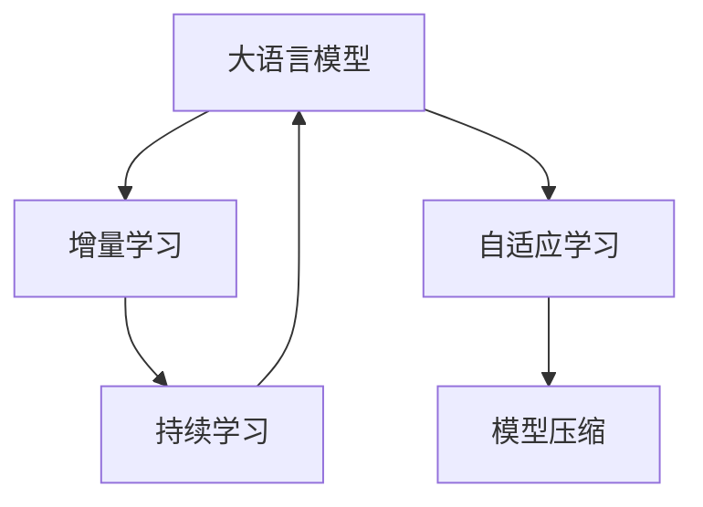

                 

# 推荐系统中的大模型增量学习策略

> 关键词：大语言模型,增量学习,推荐系统,模型压缩,持续学习,自适应学习

## 1. 背景介绍

### 1.1 问题由来

随着互联网和数字技术的快速发展，推荐系统（Recommender System）成为了各大平台提升用户体验和商业价值的重要工具。然而，传统的协同过滤、内容推荐等推荐方法，面临着数据稀疏、计算复杂等问题，难以应对海量用户和物品的数据量。基于深度学习的推荐系统（Deep Learning-based Recommender System），利用神经网络强大的表征能力，逐渐成为推荐系统的主流方法。

特别是近年来，大语言模型（Large Language Model, LLM）在自然语言处理领域取得了重大突破。通过大规模预训练和微调，大语言模型不仅能够理解复杂的语言结构，还能够生成自然流畅的文本。其强大的表征能力和迁移学习能力，使得其在推荐系统中得到了广泛应用。然而，传统的推荐系统往往是批量学习（Batch Learning），难以快速适应新数据和新用户的变化，无法真正实现持续学习的目标。

因此，如何在推荐系统中引入增量学习（Incremental Learning）机制，使得大模型能够实时学习和更新，成为当前研究的一个热点问题。增量学习不仅能够解决推荐系统中的动态变化问题，还能有效降低推荐成本，提高系统效率。

### 1.2 问题核心关键点

基于大语言模型的推荐系统增量学习，核心在于通过小批量更新模型参数，保持模型适应性，从而快速响应数据和用户的动态变化。其主要挑战包括：

1. 如何高效地在小批量数据上更新模型，同时避免过拟合和参数退化。
2. 如何在保持模型泛化能力的同时，快速适应新数据和用户的变化。
3. 如何利用已有知识，加速新数据的学习过程，提高模型的迁移学习能力。
4. 如何在资源受限的条件下，高效压缩和优化模型，保证推荐效率。

增量学习能够较好地解决这些问题，使得推荐系统具备更强的适应性和实时性。本文将详细探讨基于大语言模型的推荐系统增量学习策略，帮助读者深入理解其原理和实现方法。

## 2. 核心概念与联系

### 2.1 核心概念概述

为更好地理解大语言模型推荐系统增量学习的原理和实现方法，本节将介绍几个关键概念：

- **大语言模型（Large Language Model, LLM）**：以自回归（如GPT）或自编码（如BERT）模型为代表的大规模预训练语言模型。通过在大规模无标签文本数据上进行预训练，学习到丰富的语言知识和常识。

- **推荐系统（Recommender System）**：通过分析用户行为和物品特征，推荐适合用户的物品或内容。推荐系统广泛应用于电商、新闻、社交媒体等领域，是提高用户体验和提升商业价值的重要手段。

- **增量学习（Incremental Learning）**：指模型在已有训练结果的基础上，利用新数据进行小批量更新，以适应数据动态变化的学习范式。与批量学习不同，增量学习能够在保持模型泛化能力的同时，快速响应数据和用户的变化。

- **自适应学习（Adaptive Learning）**：指模型在增量学习过程中，能够根据当前数据特点自适应地调整学习策略，优化模型性能的学习方式。自适应学习有助于提高模型的迁移能力和泛化能力。

- **模型压缩（Model Compression）**：指通过参数剪枝、量化、蒸馏等技术，减小模型体积，提高模型效率的方法。模型压缩能够有效缓解大模型在推荐系统中的计算和存储压力，提升推荐效率。

- **持续学习（Continual Learning）**：指模型能够持续从新数据中学习，同时保持已学习的知识，避免灾难性遗忘的学习范式。持续学习使得推荐系统能够持续优化，更好地适应新用户和新数据。

这些核心概念之间的逻辑关系可以通过以下Mermaid流程图来展示：



这个流程图展示了大语言模型推荐系统增量学习的核心概念及其之间的关系：

1. 大语言模型通过预训练获得基础能力。
2. 增量学习是对大语言模型的更新机制，以快速适应数据和用户的动态变化。
3. 自适应学习在增量学习过程中，优化模型参数更新策略，提高模型性能。
4. 模型压缩减少模型体积，提高增量学习效率。
5. 持续学习使得推荐系统能够持续学习新知识，保持性能。

这些概念共同构成了大语言模型推荐系统增量学习的学习和应用框架，使其能够在各种场景下发挥强大的推荐能力。

## 3. 核心算法原理 & 具体操作步骤

### 3.1 算法原理概述

基于大语言模型的推荐系统增量学习，本质上是一个自适应增量学习的范式。其核心思想是：在已有预训练模型的基础上，通过小批量更新模型参数，以适应新数据和新用户的变化。与传统的批量学习不同，增量学习能够在不破坏已有知识的情况下，快速更新模型，提升推荐效果。

形式化地，假设预训练模型为 $M_{\theta}$，其中 $\theta$ 为预训练得到的模型参数。给定推荐系统的新样本 $S=\{(s_i,y_i)\}_{i=1}^N$，其中 $s_i$ 为推荐样本，$y_i$ 为真实标签。增量学习的优化目标是最小化新样本的损失函数，即找到最优参数：

$$
\hat{\theta}=\mathop{\arg\min}_{\theta} \mathcal{L}(M_{\theta},S)
$$

其中 $\mathcal{L}$ 为新样本的损失函数，用于衡量模型预测输出与真实标签之间的差异。常见的损失函数包括交叉熵损失、均方误差损失等。

通过梯度下降等优化算法，增量过程不断更新模型参数 $\theta$，最小化损失函数 $\mathcal{L}$，使得模型输出逼近真实标签。由于 $\theta$ 已经通过预训练获得了较好的初始化，因此即便在小批量数据集 $S$ 上进行增量学习，也能较快收敛到理想的模型参数 $\hat{\theta}$。

### 3.2 算法步骤详解

基于大语言模型的推荐系统增量学习一般包括以下几个关键步骤：

**Step 1: 准备预训练模型和数据集**
- 选择合适的预训练语言模型 $M_{\theta}$ 作为初始化参数，如 BERT、GPT 等。
- 准备推荐系统的新样本 $S$，划分为训练集、验证集和测试集。一般要求新样本与已有数据的分布不要差异过大。

**Step 2: 添加推荐适配层**
- 根据推荐任务类型，在预训练模型顶层设计合适的输出层和损失函数。
- 对于推荐任务，通常使用交叉熵损失函数。

**Step 3: 设置增量学习超参数**
- 选择合适的优化算法及其参数，如 AdamW、SGD 等，设置学习率、批大小、迭代轮数等。
- 设置正则化技术及强度，包括权重衰减、Dropout、Early Stopping 等。
- 确定冻结预训练参数的策略，如仅增量顶层，或全部参数都参与增量学习。

**Step 4: 执行增量训练**
- 将新样本 $S$ 分批次输入模型，前向传播计算损失函数。
- 反向传播计算参数梯度，根据设定的优化算法和学习率更新模型参数。
- 周期性在验证集上评估模型性能，根据性能指标决定是否触发 Early Stopping。
- 重复上述步骤直到满足预设的迭代轮数或 Early Stopping 条件。

**Step 5: 测试和部署**
- 在测试集上评估增量后模型 $M_{\hat{\theta}}$ 的性能，对比增量前后的推荐精度提升。
- 使用增量后的模型对新样本进行推荐，集成到实际的应用系统中。
- 持续收集新的数据，定期重新增量学习，以适应数据分布的变化。

以上是基于大语言模型的推荐系统增量学习的一般流程。在实际应用中，还需要针对具体任务的特点，对增量过程的各个环节进行优化设计，如改进训练目标函数，引入更多的正则化技术，搜索最优的超参数组合等，以进一步提升模型性能。

### 3.3 算法优缺点

基于大语言模型的推荐系统增量学习方法具有以下优点：
1. 快速适应新数据。增量学习能够快速响应新数据和新用户的变化，保持推荐系统的实时性。
2. 模型更新效率高。增量学习通过小批量更新参数，减少计算资源消耗，提高训练效率。
3. 提高推荐效果。增量学习使得模型能够不断优化，提升推荐精度。
4. 低成本。增量学习不需要重新进行大规模预训练，能够降低推荐系统的开发和维护成本。

同时，该方法也存在一定的局限性：
1. 数据分布假设。增量学习假设新数据与已有数据的分布相似，难以处理数据分布差异较大的情况。
2. 需要前期数据。增量学习依赖已有数据进行初始化，缺乏前期数据可能导致模型无法有效学习。
3. 过拟合风险。增量学习在小批量数据上进行更新，容易发生过拟合。
4. 缺乏可解释性。增量学习模型内部机制复杂，难以进行解释和调试。

尽管存在这些局限性，但就目前而言，基于大语言模型的推荐系统增量学习方法仍是目前推荐系统中的主流范式。未来相关研究的重点在于如何进一步降低增量学习对已有数据的依赖，提高模型的跨领域迁移能力，同时兼顾可解释性和伦理安全性等因素。

### 3.4 算法应用领域

基于大语言模型的推荐系统增量学习，在推荐系统领域已经得到了广泛的应用，覆盖了几乎所有常见任务，例如：

- 商品推荐：根据用户浏览历史、购买行为等数据，推荐相关商品。
- 视频推荐：根据用户观看历史、评分等数据，推荐相关视频。
- 音乐推荐：根据用户听歌历史、评价等数据，推荐相关音乐。
- 新闻推荐：根据用户阅读历史、点击行为等数据，推荐相关新闻。
- 社交网络：根据用户互动历史、发布内容等数据，推荐相关用户或内容。

除了上述这些经典任务外，大语言模型增量学习也被创新性地应用到更多场景中，如动态推荐、个性化推荐、多模态推荐等，为推荐系统带来了全新的突破。随着预训练模型和增量方法的不断进步，相信推荐系统必将在更广阔的应用领域大放异彩。

## 4. 数学模型和公式 & 详细讲解 & 举例说明

### 4.1 数学模型构建

本节将使用数学语言对基于大语言模型的推荐系统增量学习过程进行更加严格的刻画。

记预训练语言模型为 $M_{\theta}$，其中 $\theta$ 为预训练得到的模型参数。假设推荐系统的新样本为 $S=\{(s_i,y_i)\}_{i=1}^N$。

定义模型 $M_{\theta}$ 在样本 $(s,y)$ 上的损失函数为 $\ell(M_{\theta}(s),y)$，则在样本集 $S$ 上的经验风险为：

$$
\mathcal{L}(\theta;S) = \frac{1}{N}\sum_{i=1}^N \ell(M_{\theta}(s_i),y_i)
$$

增量学习的优化目标是最小化经验风险，即找到最优参数：

$$
\hat{\theta}=\mathop{\arg\min}_{\theta} \mathcal{L}(\theta;S)
$$

在实践中，我们通常使用基于梯度的优化算法（如SGD、Adam等）来近似求解上述最优化问题。设 $\eta$ 为学习率，$\lambda$ 为正则化系数，则参数的更新公式为：

$$
\theta \leftarrow \theta - \eta \nabla_{\theta}\mathcal{L}(\theta;S) - \eta\lambda\theta
$$

其中 $\nabla_{\theta}\mathcal{L}(\theta;S)$ 为损失函数对参数 $\theta$ 的梯度，可通过反向传播算法高效计算。

### 4.2 公式推导过程

以下我们以商品推荐任务为例，推导交叉熵损失函数及其梯度的计算公式。

假设模型 $M_{\theta}$ 在输入 $s$ 上的输出为 $\hat{y}=M_{\theta}(s) \in [0,1]$，表示商品被购买的概率。真实标签 $y \in \{0,1\}$。则交叉熵损失函数定义为：

$$
\ell(M_{\theta}(s),y) = -[y\log \hat{y} + (1-y)\log (1-\hat{y})]
$$

将其代入经验风险公式，得：

$$
\mathcal{L}(\theta;S) = -\frac{1}{N}\sum_{i=1}^N [y_i\log M_{\theta}(s_i)+(1-y_i)\log(1-M_{\theta}(s_i))]
$$

根据链式法则，损失函数对参数 $\theta_k$ 的梯度为：

$$
\frac{\partial \mathcal{L}(\theta;S)}{\partial \theta_k} = -\frac{1}{N}\sum_{i=1}^N (\frac{y_i}{M_{\theta}(s_i)}-\frac{1-y_i}{1-M_{\theta}(s_i)}) \frac{\partial M_{\theta}(s_i)}{\partial \theta_k}
$$

其中 $\frac{\partial M_{\theta}(s_i)}{\partial \theta_k}$ 可进一步递归展开，利用自动微分技术完成计算。

在得到损失函数的梯度后，即可带入参数更新公式，完成模型的迭代优化。重复上述过程直至收敛，最终得到适应新数据的增量模型参数 $\theta^*$。

## 5. 项目实践：代码实例和详细解释说明

### 5.1 开发环境搭建

在进行增量学习实践前，我们需要准备好开发环境。以下是使用Python进行PyTorch开发的环境配置流程：

1. 安装Anaconda：从官网下载并安装Anaconda，用于创建独立的Python环境。

2. 创建并激活虚拟环境：
```bash
conda create -n pytorch-env python=3.8 
conda activate pytorch-env
```

3. 安装PyTorch：根据CUDA版本，从官网获取对应的安装命令。例如：
```bash
conda install pytorch torchvision torchaudio cudatoolkit=11.1 -c pytorch -c conda-forge
```

4. 安装Transformers库：
```bash
pip install transformers
```

5. 安装各类工具包：
```bash
pip install numpy pandas scikit-learn matplotlib tqdm jupyter notebook ipython
```

完成上述步骤后，即可在`pytorch-env`环境中开始增量学习实践。

### 5.2 源代码详细实现

下面我以商品推荐任务为例，给出使用Transformers库对BERT模型进行增量学习的PyTorch代码实现。

首先，定义推荐任务的数据处理函数：

```python
from transformers import BertTokenizer
from torch.utils.data import Dataset
import torch

class RecommendationDataset(Dataset):
    def __init__(self, items, ratings, tokenizer, max_len=128):
        self.items = items
        self.ratings = ratings
        self.tokenizer = tokenizer
        self.max_len = max_len
        
    def __len__(self):
        return len(self.items)
    
    def __getitem__(self, item):
        item = self.items[item]
        rating = self.ratings[item]
        
        encoding = self.tokenizer(item, return_tensors='pt', max_length=self.max_len, padding='max_length', truncation=True)
        input_ids = encoding['input_ids'][0]
        attention_mask = encoding['attention_mask'][0]
        
        # 对item-wise的标签进行编码
        encoded_tags = [rating2id[label] for label in rating] 
        encoded_tags.extend([tag2id['unknown']] * (self.max_len - len(encoded_tags)))
        labels = torch.tensor(encoded_tags, dtype=torch.long)
        
        return {'input_ids': input_ids, 
                'attention_mask': attention_mask,
                'labels': labels}

# 标签与id的映射
tag2id = {'unknown': 0, 'like': 1, 'dislike': 2}
id2tag = {v: k for k, v in tag2id.items()}

# 创建dataset
tokenizer = BertTokenizer.from_pretrained('bert-base-cased')

train_dataset = RecommendationDataset(train_items, train_ratings, tokenizer)
dev_dataset = RecommendationDataset(dev_items, dev_ratings, tokenizer)
test_dataset = RecommendationDataset(test_items, test_ratings, tokenizer)
```

然后，定义模型和优化器：

```python
from transformers import BertForTokenClassification, AdamW

model = BertForTokenClassification.from_pretrained('bert-base-cased', num_labels=len(tag2id))

optimizer = AdamW(model.parameters(), lr=2e-5)
```

接着，定义增量训练和评估函数：

```python
from torch.utils.data import DataLoader
from tqdm import tqdm
from sklearn.metrics import classification_report

device = torch.device('cuda') if torch.cuda.is_available() else torch.device('cpu')
model.to(device)

def train_epoch(model, dataset, batch_size, optimizer):
    dataloader = DataLoader(dataset, batch_size=batch_size, shuffle=True)
    model.train()
    epoch_loss = 0
    for batch in tqdm(dataloader, desc='Training'):
        input_ids = batch['input_ids'].to(device)
        attention_mask = batch['attention_mask'].to(device)
        labels = batch['labels'].to(device)
        model.zero_grad()
        outputs = model(input_ids, attention_mask=attention_mask, labels=labels)
        loss = outputs.loss
        epoch_loss += loss.item()
        loss.backward()
        optimizer.step()
    return epoch_loss / len(dataloader)

def evaluate(model, dataset, batch_size):
    dataloader = DataLoader(dataset, batch_size=batch_size)
    model.eval()
    preds, labels = [], []
    with torch.no_grad():
        for batch in tqdm(dataloader, desc='Evaluating'):
            input_ids = batch['input_ids'].to(device)
            attention_mask = batch['attention_mask'].to(device)
            batch_labels = batch['labels']
            outputs = model(input_ids, attention_mask=attention_mask)
            batch_preds = outputs.logits.argmax(dim=2).to('cpu').tolist()
            batch_labels = batch_labels.to('cpu').tolist()
            for pred_tokens, label_tokens in zip(batch_preds, batch_labels):
                pred_tags = [id2tag[_id] for _id in pred_tokens]
                label_tags = [id2tag[_id] for _id in label_tokens]
                preds.append(pred_tags[:len(label_tags)])
                labels.append(label_tags)
                
    print(classification_report(labels, preds))
```

最后，启动增量训练流程并在测试集上评估：

```python
epochs = 5
batch_size = 16

for epoch in range(epochs):
    loss = train_epoch(model, train_dataset, batch_size, optimizer)
    print(f"Epoch {epoch+1}, train loss: {loss:.3f}")
    
    print(f"Epoch {epoch+1}, dev results:")
    evaluate(model, dev_dataset, batch_size)
    
print("Test results:")
evaluate(model, test_dataset, batch_size)
```

以上就是使用PyTorch对BERT进行商品推荐任务增量学习的完整代码实现。可以看到，得益于Transformers库的强大封装，我们可以用相对简洁的代码完成BERT模型的加载和增量学习。

### 5.3 代码解读与分析

让我们再详细解读一下关键代码的实现细节：

**RecommendationDataset类**：
- `__init__`方法：初始化物品、评分、分词器等关键组件。
- `__len__`方法：返回数据集的样本数量。
- `__getitem__`方法：对单个样本进行处理，将物品输入编码为token ids，将评分编码为数字，并对其进行定长padding，最终返回模型所需的输入。

**tag2id和id2tag字典**：
- 定义了标签与数字id之间的映射关系，用于将token-wise的预测结果解码回真实的标签。

**增量训练和评估函数**：
- 使用PyTorch的DataLoader对数据集进行批次化加载，供模型训练和推理使用。
- 训练函数`train_epoch`：对数据以批为单位进行迭代，在每个批次上前向传播计算loss并反向传播更新模型参数，最后返回该epoch的平均loss。
- 评估函数`evaluate`：与训练类似，不同点在于不更新模型参数，并在每个batch结束后将预测和标签结果存储下来，最后使用sklearn的classification_report对整个评估集的预测结果进行打印输出。

**增量训练流程**：
- 定义总的epoch数和batch size，开始循环迭代
- 每个epoch内，先在训练集上训练，输出平均loss
- 在验证集上评估，输出分类指标
- 所有epoch结束后，在测试集上评估，给出最终测试结果

可以看到，PyTorch配合Transformers库使得BERT增量学习的代码实现变得简洁高效。开发者可以将更多精力放在数据处理、模型改进等高层逻辑上，而不必过多关注底层的实现细节。

当然，工业级的系统实现还需考虑更多因素，如模型的保存和部署、超参数的自动搜索、更灵活的任务适配层等。但核心的增量学习范式基本与此类似。

## 6. 实际应用场景
### 6.1 智能客服系统

基于大语言模型的推荐系统增量学习，可以广泛应用于智能客服系统的构建。传统客服往往需要配备大量人力，高峰期响应缓慢，且一致性和专业性难以保证。而使用增量学习后的推荐模型，可以7x24小时不间断服务，快速响应客户咨询，用自然流畅的语言解答各类常见问题。

在技术实现上，可以收集企业内部的历史客服对话记录，将问题和最佳答复构建成监督数据，在此基础上对预训练对话模型进行增量学习。增量后的对话模型能够自动理解用户意图，匹配最合适的答案模板进行回复。对于客户提出的新问题，还可以接入检索系统实时搜索相关内容，动态组织生成回答。如此构建的智能客服系统，能大幅提升客户咨询体验和问题解决效率。

### 6.2 金融舆情监测

金融机构需要实时监测市场舆论动向，以便及时应对负面信息传播，规避金融风险。传统的人工监测方式成本高、效率低，难以应对网络时代海量信息爆发的挑战。基于大语言模型的文本分类和情感分析技术，为金融舆情监测提供了新的解决方案。

具体而言，可以收集金融领域相关的新闻、报道、评论等文本数据，并对其进行主题标注和情感标注。在此基础上对预训练语言模型进行增量学习，使其能够自动判断文本属于何种主题，情感倾向是正面、中性还是负面。将增量后的模型应用到实时抓取的网络文本数据，就能够自动监测不同主题下的情感变化趋势，一旦发现负面信息激增等异常情况，系统便会自动预警，帮助金融机构快速应对潜在风险。

### 6.3 个性化推荐系统

当前的推荐系统往往只依赖用户的历史行为数据进行物品推荐，无法深入理解用户的真实兴趣偏好。基于大语言模型的推荐系统增量学习，能够更好地挖掘用户行为背后的语义信息，从而提供更精准、多样的推荐内容。

在实践中，可以收集用户浏览、点击、评论、分享等行为数据，提取和用户交互的物品标题、描述、标签等文本内容。将文本内容作为模型输入，用户的后续行为（如是否点击、购买等）作为监督信号，在此基础上增量训练预训练语言模型。增量后的模型能够从文本内容中准确把握用户的兴趣点。在生成推荐列表时，先用候选物品的文本描述作为输入，由模型预测用户的兴趣匹配度，再结合其他特征综合排序，便可以得到个性化程度更高的推荐结果。

### 6.4 未来应用展望

随着大语言模型和增量方法的不断发展，基于增量学习的推荐系统将在更多领域得到应用，为传统行业带来变革性影响。

在智慧医疗领域，基于增量学习的医疗问答、病历分析、药物研发等应用将提升医疗服务的智能化水平，辅助医生诊疗，加速新药开发进程。

在智能教育领域，增量学习可应用于作业批改、学情分析、知识推荐等方面，因材施教，促进教育公平，提高教学质量。

在智慧城市治理中，增量学习可用于城市事件监测、舆情分析、应急指挥等环节，提高城市管理的自动化和智能化水平，构建更安全、高效的未来城市。

此外，在企业生产、社会治理、文娱传媒等众多领域，基于大语言模型的推荐系统增量学习也将不断涌现，为NLP技术带来了全新的突破。相信随着技术的日益成熟，增量学习方法将成为推荐系统应用的重要范式，推动人工智能技术在垂直行业的规模化落地。

## 7. 工具和资源推荐
### 7.1 学习资源推荐

为了帮助开发者系统掌握大语言模型增量学习的理论基础和实践技巧，这里推荐一些优质的学习资源：

1. 《Transformer从原理到实践》系列博文：由大模型技术专家撰写，深入浅出地介绍了Transformer原理、BERT模型、增量学习等前沿话题。

2. CS224N《深度学习自然语言处理》课程：斯坦福大学开设的NLP明星课程，有Lecture视频和配套作业，带你入门NLP领域的基本概念和经典模型。

3. 《Natural Language Processing with Transformers》书籍：Transformers库的作者所著，全面介绍了如何使用Transformers库进行NLP任务开发，包括增量学习在内的诸多范式。

4. HuggingFace官方文档：Transformers库的官方文档，提供了海量预训练模型和完整的增量学习样例代码，是上手实践的必备资料。

5. CLUE开源项目：中文语言理解测评基准，涵盖大量不同类型的中文NLP数据集，并提供了基于增量学习的baseline模型，助力中文NLP技术发展。

通过对这些资源的学习实践，相信你一定能够快速掌握大语言模型增量学习的精髓，并用于解决实际的NLP问题。
###  7.2 开发工具推荐

高效的开发离不开优秀的工具支持。以下是几款用于大语言模型增量学习开发的常用工具：

1. PyTorch：基于Python的开源深度学习框架，灵活动态的计算图，适合快速迭代研究。大部分预训练语言模型都有PyTorch版本的实现。

2. TensorFlow：由Google主导开发的开源深度学习框架，生产部署方便，适合大规模工程应用。同样有丰富的预训练语言模型资源。

3. Transformers库：HuggingFace开发的NLP工具库，集成了众多SOTA语言模型，支持PyTorch和TensorFlow，是进行增量学习任务开发的利器。

4. Weights & Biases：模型训练的实验跟踪工具，可以记录和可视化模型训练过程中的各项指标，方便对比和调优。与主流深度学习框架无缝集成。

5. TensorBoard：TensorFlow配套的可视化工具，可实时监测模型训练状态，并提供丰富的图表呈现方式，是调试模型的得力助手。

6. Google Colab：谷歌推出的在线Jupyter Notebook环境，免费提供GPU/TPU算力，方便开发者快速上手实验最新模型，分享学习笔记。

合理利用这些工具，可以显著提升大语言模型增量学习任务的开发效率，加快创新迭代的步伐。

### 7.3 相关论文推荐

大语言模型增量学习技术的发展源于学界的持续研究。以下是几篇奠基性的相关论文，推荐阅读：

1. Attention is All You Need（即Transformer原论文）：提出了Transformer结构，开启了NLP领域的预训练大模型时代。

2. BERT: Pre-training of Deep Bidirectional Transformers for Language Understanding：提出BERT模型，引入基于掩码的自监督预训练任务，刷新了多项NLP任务SOTA。

3. Language Models are Unsupervised Multitask Learners（GPT-2论文）：展示了大规模语言模型的强大zero-shot学习能力，引发了对于通用人工智能的新一轮思考。

4. Incremental Neural Machine Translation：提出增量学习模型，用于实时更新翻译模型，提高翻译效率。

5. Continual Learning for Representations of Few-shot Image Recognition：提出增量学习框架，用于提升图像分类模型的跨样本学习能力。

6. Adaptive Incremental Learning for End-to-End Planning：提出增量学习模型，用于自动规划，提高路径生成效率。

这些论文代表了大语言模型增量学习技术的发展脉络。通过学习这些前沿成果，可以帮助研究者把握学科前进方向，激发更多的创新灵感。

## 8. 总结：未来发展趋势与挑战

### 8.1 总结

本文对基于大语言模型的推荐系统增量学习方法进行了全面系统的介绍。首先阐述了大语言模型和增量学习的研究背景和意义，明确了增量学习在推荐系统中的重要价值。其次，从原理到实践，详细讲解了增量学习的数学原理和关键步骤，给出了增量学习任务开发的完整代码实例。同时，本文还广泛探讨了增量学习方法在智能客服、金融舆情、个性化推荐等多个行业领域的应用前景，展示了增量学习范式的巨大潜力。此外，本文精选了增量学习技术的各类学习资源，力求为读者提供全方位的技术指引。

通过本文的系统梳理，可以看到，基于大语言模型的推荐系统增量学习技术正在成为推荐系统中的重要范式，极大地拓展了预训练语言模型的应用边界，催生了更多的落地场景。受益于大规模语料的预训练，增量学习模型在推荐任务中取得了理想的性能，并在实际应用中展现了其强大的生命力和应用价值。未来，伴随增量学习方法的不断进步，相信推荐系统必将在更广阔的应用领域大放异彩，深刻影响人类的生产生活方式。

### 8.2 未来发展趋势

展望未来，大语言模型推荐系统增量学习技术将呈现以下几个发展趋势：

1. 模型规模持续增大。随着算力成本的下降和数据规模的扩张，预训练语言模型的参数量还将持续增长。超大规模语言模型蕴含的丰富语言知识，有望支撑更加复杂多变的推荐任务。

2. 增量学习方法日趋多样。除了传统的在线更新外，未来会涌现更多增量学习方法，如多任务学习、迁移学习等，在提升推荐效果的同时，减少计算资源的消耗。

3. 持续学习成为常态。随着数据分布的不断变化，增量学习模型也需要持续学习新知识以保持性能。如何在不遗忘原有知识的同时，高效吸收新样本信息，将成为重要的研究课题。

4. 标注样本需求降低。受启发于提示学习(Prompt-based Learning)的思路，未来的增量学习方法将更好地利用大模型的语言理解能力，通过更加巧妙的任务描述，在更少的标注样本上也能实现理想的增量效果。

5. 模型通用性增强。经过海量数据的预训练和多领域任务的增量学习，未来的推荐系统能够具备更强的跨领域迁移能力，逐步迈向通用人工智能(AGI)的目标。

以上趋势凸显了大语言模型推荐系统增量学习的广阔前景。这些方向的探索发展，必将进一步提升推荐系统的性能和应用范围，为人类认知智能的进化带来深远影响。

### 8.3 面临的挑战

尽管大语言模型推荐系统增量学习技术已经取得了瞩目成就，但在迈向更加智能化、普适化应用的过程中，它仍面临着诸多挑战：

1. 标注成本瓶颈。尽管增量学习能够快速响应新数据，但增量更新仍需一定量的标注数据作为监督信号，标注成本较高。如何进一步降低增量学习对标注样本的依赖，将是一大难题。

2. 模型鲁棒性不足。增量学习模型面对域外数据时，泛化性能往往大打折扣。对于测试样本的微小扰动，增量模型的预测也容易发生波动。如何提高增量模型的鲁棒性，避免灾难性遗忘，还需要更多理论和实践的积累。

3. 推理效率有待提高。大规模语言模型虽然精度高，但在实际部署时往往面临推理速度慢、内存占用大等效率问题。如何在保证性能的同时，简化模型结构，提升推理速度，优化资源占用，将是重要的优化方向。

4. 可解释性亟需加强。增量学习模型内部机制复杂，难以进行解释和调试。对于医疗、金融等高风险应用，算法的可解释性和可审计性尤为重要。如何赋予增量学习模型更强的可解释性，将是亟待攻克的难题。

5. 安全性有待保障。增量学习模型在推荐过程中，可能会学习到有害信息，产生误导性输出，给实际应用带来安全隐患。如何从数据和算法层面消除模型偏见，避免恶意用途，确保输出的安全性，也将是重要的研究课题。

6. 知识整合能力不足。现有的增量学习模型往往局限于任务内数据，难以灵活吸收和运用更广泛的先验知识。如何让增量过程更好地与外部知识库、规则库等专家知识结合，形成更加全面、准确的信息整合能力，还有很大的想象空间。

正视增量学习面临的这些挑战，积极应对并寻求突破，将是大语言模型推荐系统增量学习走向成熟的必由之路。相信随着学界和产业界的共同努力，这些挑战终将一一被克服，增量学习方法必将在构建安全、可靠、可解释、可控的智能系统铺平道路。

### 8.4 研究展望

面对大语言模型推荐系统增量学习所面临的种种挑战，未来的研究需要在以下几个方面寻求新的突破：

1. 探索无监督和半监督增量学习方法。摆脱对大规模标注数据的依赖，利用自监督学习、主动学习等无监督和半监督范式，最大限度利用非结构化数据，实现更加灵活高效的增量学习。

2. 研究参数高效和计算高效的增量学习范式。开发更加参数高效的增量学习算法，在固定大部分预训练参数的同时，只更新极少量的任务相关参数。同时优化增量学习模型的计算图，减少前向传播和反向传播的资源消耗，实现更加轻量级、实时性的部署。

3. 引入因果和对比学习范式。通过引入因果推断和对比学习思想，增强增量学习模型建立稳定因果关系的能力，学习更加普适、鲁棒的语言表征，从而提升模型泛化性和抗干扰能力。

4. 融合多模态信息。将符号化的先验知识，如知识图谱、逻辑规则等，与神经网络模型进行巧妙融合，引导增量学习过程学习更准确、合理的语言模型。同时加强不同模态数据的整合，实现视觉、语音等多模态信息与文本信息的协同建模。

5. 纳入伦理道德约束。在模型训练目标中引入伦理导向的评估指标，过滤和惩罚有偏见、有害的输出倾向。同时加强人工干预和审核，建立模型行为的监管机制，确保输出符合人类价值观和伦理道德。

这些研究方向的探索，必将引领大语言模型推荐系统增量学习技术迈向更高的台阶，为构建安全、可靠、可解释、可控的智能系统铺平道路。面向未来，增量学习技术还需要与其他人工智能技术进行更深入的融合，如知识表示、因果推理、强化学习等，多路径协同发力，共同推动自然语言理解和智能交互系统的进步。只有勇于创新、敢于突破，才能不断拓展语言模型的边界，让智能技术更好地造福人类社会。

## 9. 附录：常见问题与解答

**Q1：大语言模型推荐系统增量是否适用于所有推荐任务？**

A: 大语言模型推荐系统增量在大多数推荐任务上都能取得不错的效果，特别是对于数据量较小的任务。但对于一些特定领域的任务，如医学、法律等，仅仅依靠通用语料预训练的模型可能难以很好地适应。此时需要在特定领域语料上进一步预训练，再进行增量学习，才能获得理想效果。此外，对于一些需要时效性、个性化很强的任务，如动态推荐、个性化推荐等，增量方法也需要针对性的改进优化。

**Q2：增量过程中如何高效地在小批量数据上更新模型？**

A: 增量学习能够快速响应新数据和新用户的变化，但小批量数据更新容易发生过拟合。为解决这个问题，可以采用以下策略：
1. 数据增强：通过回译、近义替换等方式扩充训练集
2. 正则化：使用L2正则、Dropout、Early Stopping等避免过拟合
3. 对抗训练：引入对抗样本，提高模型鲁棒性
4. 参数高效增量：只调整少量参数(如Adapter、Prefix等)，减小过拟合风险
5. 多模型集成：训练多个增量模型，取平均输出，抑制过拟合

这些策略往往需要根据具体任务和数据特点进行灵活组合。只有在数据、模型、训练、推理等各环节进行全面优化，才能最大限度地发挥增量学习的威力。

**Q3：增量学习过程中如何保持模型泛化能力？**

A: 增量学习过程中，模型需要不断更新，但过拟合风险较大。为保持模型泛化能力，可以采用以下策略：
1. 选择适当的学习率，避免过拟合
2. 引入正则化技术，如L2正则、Dropout等
3. 周期性评估模型性能，及时调整学习策略
4. 使用数据增强和对抗训练，提高模型鲁棒性
5. 利用增量学习范式，快速适应新数据

这些策略可以有效避免增量学习过程中的过拟合，保证模型的泛化能力。

**Q4：增量学习模型在落地部署时需要注意哪些问题？**

A: 将增量学习模型转化为实际应用，还需要考虑以下因素：
1. 模型裁剪：去除不必要的层和参数，减小模型尺寸，加快推理速度
2. 量化加速：将浮点模型转为定点模型，压缩存储空间，提高计算效率
3. 服务化封装：将模型封装为标准化服务接口，便于集成调用
4. 弹性伸缩：根据请求流量动态调整资源配置，平衡服务质量和成本
5. 监控告警：实时采集系统指标，设置异常告警阈值，确保服务稳定性
6. 安全防护：采用访问鉴权、数据脱敏等措施，保障数据和模型安全

增量学习模型能够快速适应新数据和新用户的变化，但在实际部署时，仍需进行模型优化和系统集成，以确保其性能和可靠性。

---

作者：禅与计算机程序设计艺术 / Zen and the Art of Computer Programming

