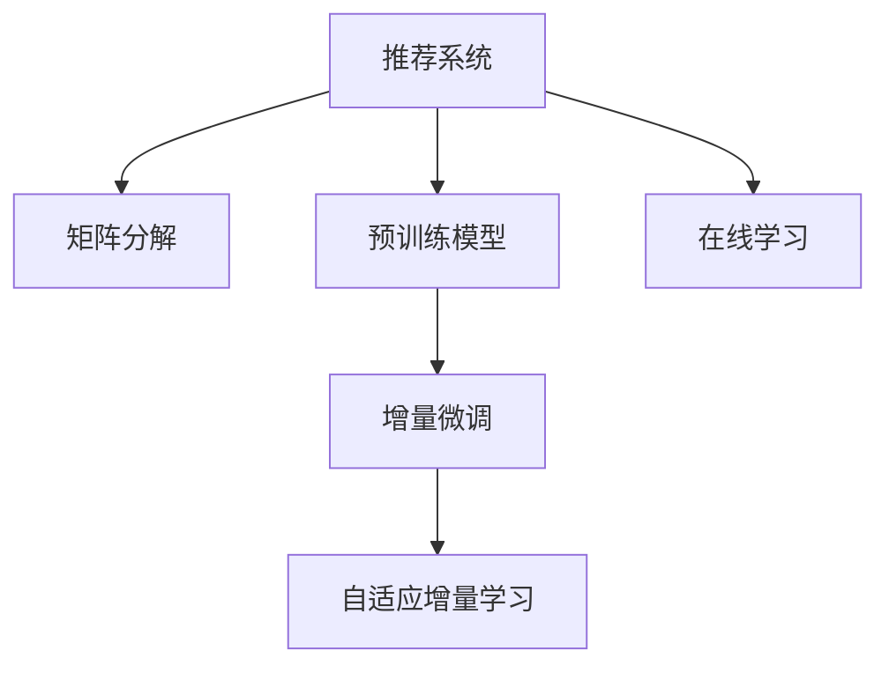

                 

# 推荐系统中的大模型增量微调应用

> 关键词：大模型增量微调,推荐系统,深度学习,矩阵分解,预训练,自适应,在线学习

## 1. 背景介绍

### 1.1 问题由来
随着电商、社交网络等互联网平台的崛起，推荐系统在个性化信息流、商品推荐、广告投放等领域发挥了重要作用。传统的基于矩阵分解等方法的推荐系统，往往需要反复迭代训练才能更新推荐模型，难以实时响应用户需求。

近年来，预训练大模型在推荐系统中的应用引起了广泛关注。通过在大规模数据上预训练模型，可以提升模型的泛化能力和隐式知识的学习，使得模型在新的数据上能够更快收敛。但预训练模型的参数量通常较大，导致训练和推理成本高昂。此外，推荐系统通常需要实时调整，传统的全量微调方法难以满足实时性需求。

因此，增量微调方法应运而生。它允许推荐系统在用户访问过程中，根据新收集到的用户行为数据，进行动态更新和优化。增量微调方法结合了预训练模型的泛化能力和推荐系统的实时性，为推荐系统提供了更加灵活高效的解决方案。

### 1.2 问题核心关键点
增量微调方法的核心在于如何在保留预训练模型泛化能力的同时，快速、高效地更新模型，适应新的用户行为。关键点包括：

- 选择合适的增量微调算法。常见的算法包括基于梯度的方法(如AdaGrad、SGD)、基于模型的在线学习算法(如FTRL)、自适应增量学习算法(如AdaFOM)等。
- 设计增量微调的优化目标。推荐系统通常需要平衡预测精度和在线性能，如何设计合适的优化目标函数，是增量微调的重要问题。
- 实现增量微调的动态更新。增量微调需要实时处理新数据，如何设计高效的增量更新策略，也是增量微调的关键。

### 1.3 问题研究意义
研究增量微调方法，对于构建实时性、个性化更强的推荐系统，提升用户体验，加速推荐系统迭代更新，具有重要意义：

1. 提高用户体验。实时响应用户行为，提供符合个性化的推荐内容，提升用户满意度和粘性。
2. 提升推荐精度。利用预训练模型泛化能力，快速适应新数据，优化推荐模型，提高推荐效果。
3. 加速系统迭代。通过增量微调，推荐系统可以实时更新模型，快速迭代优化，缩短上线周期。
4. 减少计算资源消耗。增量微调仅需要更新少量参数，同时保留了预训练模型的泛化能力，大幅降低计算和存储成本。
5. 应对冷启动问题。增量微调可以逐步积累用户行为数据，快速为用户建立画像，缓解冷启动问题。

## 2. 核心概念与联系

### 2.1 核心概念概述

为更好地理解增量微调方法，本节将介绍几个密切相关的核心概念：

- 推荐系统(Recommendation System)：利用用户行为数据，对用户和物品进行建模，并提供个性化推荐的服务。常见的推荐系统包括基于协同过滤、内容推荐、混合推荐等。
- 矩阵分解(Matrix Factorization)：推荐系统中的经典方法，通过分解用户-物品评分矩阵，学习用户和物品的隐式表示，并生成预测评分。
- 预训练模型(Pre-trained Model)：在大型无标签数据上预训练的模型，学习通用的语言和知识表示。常见的预训练模型包括BERT、GPT等。
- 增量微调(Incremental Fine-tuning)：在模型训练过程中，利用新收集到的数据，快速更新模型参数，适应新任务的方法。常见的增量微调算法包括在线梯度下降、增量Adagrad等。
- 自适应增量学习(Adaptive Incremental Learning)：在增量微调中，能够自动调整增量更新步长，适应不同数据集的算法。
- 在线学习(Online Learning)：实时收集数据，并实时更新模型参数，适应数据分布变化的方法。

这些核心概念之间的逻辑关系可以通过以下Mermaid流程图来展示：



这个流程图展示推荐的推荐系统、矩阵分解、预训练模型、增量微调等关键概念及其之间的关系：

1. 推荐系统通过矩阵分解等方法，对用户和物品进行建模，并提供个性化推荐。
2. 预训练模型通过在大规模数据上预训练，学习通用的语言和知识表示，被应用于推荐系统。
3. 增量微调方法允许推荐系统根据新数据实时更新模型，提高推荐精度。
4. 自适应增量学习是增量微调的一种高级形式，能够自动调整增量更新步长，适应不同数据集。
5. 在线学习实时收集数据，并实时更新模型参数，适应数据分布变化。

这些概念共同构成了推荐系统的核心框架，使得推荐系统能够快速响应用户需求，提供更精准的推荐内容。

## 3. 核心算法原理 & 具体操作步骤
### 3.1 算法原理概述

增量微调方法的核心思想是在保留预训练模型泛化能力的同时，快速适应新数据。其原理与传统的监督微调方法类似，但具有更加灵活的参数更新机制，适用于实时、在线场景。

假设推荐系统有 $N$ 个用户 $U$ 和 $M$ 个物品 $I$，每个用户对每个物品的评分 $r_{ui}$ 已知。目标是在用户访问过程中，通过增量微调方法，快速更新模型参数，使得模型能够实时预测新的评分。

形式化地，假设预训练推荐模型为 $M_{\theta}$，其中 $\theta$ 为预训练得到的模型参数。给定推荐系统收集到的新用户行为数据 $\{(u_i,i)\}_{i=1}^n$，增量微调的目标是找到新的模型参数 $\hat{\theta}$，使得：

$$
\hat{\theta}=\mathop{\arg\min}_{\theta} \mathcal{L}(M_{\theta},\{(u_i,i)\})
$$

其中 $\mathcal{L}$ 为针对推荐任务设计的损失函数，用于衡量模型预测评分与真实评分之间的差异。常见的损失函数包括均方误差损失、交叉熵损失等。

通过梯度下降等优化算法，增量微调过程不断更新模型参数 $\theta$，最小化损失函数 $\mathcal{L}$，使得模型预测评分逼近真实评分。由于 $\theta$ 已经通过预训练获得了较好的初始化，因此即便在在线场景下，模型也能较快收敛到理想的模型参数 $\hat{\theta}$。

### 3.2 算法步骤详解

增量微调方法的具体操作步骤如下：

**Step 1: 准备预训练模型和数据集**
- 选择合适的预训练推荐模型 $M_{\theta}$ 作为初始化参数，如基于矩阵分解的方法。
- 准备推荐系统收集到的新用户行为数据集，包括用户和物品的交互记录。

**Step 2: 添加任务适配层**
- 根据推荐任务类型，在预训练推荐模型顶层设计合适的输出层和损失函数。
- 对于评分预测任务，通常在顶层添加线性分类器和均方误差损失函数。
- 对于多标签分类任务，通常使用交叉熵损失函数。

**Step 3: 设置增量微调超参数**
- 选择合适的优化算法及其参数，如在线梯度下降、增量Adagrad等，设置学习率、批大小、迭代轮数等。
- 设置正则化技术及强度，包括权重衰减、Dropout、Early Stopping等。
- 确定冻结预训练参数的策略，如仅微调顶层，或全部参数都参与增量更新。

**Step 4: 执行增量微调**
- 在用户行为数据上迭代训练模型，每次只更新部分模型参数。
- 将新数据样本前向传播计算损失函数，反向传播计算参数梯度。
- 根据设定的优化算法和学习率更新模型参数，完成增量更新。
- 周期性在验证集上评估模型性能，根据性能指标决定是否触发 Early Stopping。
- 重复上述步骤直至满足预设的迭代轮数或 Early Stopping 条件。

**Step 5: 测试和部署**
- 在测试集上评估增量微调后模型 $M_{\hat{\theta}}$ 的性能，对比增量微调前后的精度提升。
- 使用增量微调后的模型对新样本进行预测，集成到实际的应用系统中。
- 持续收集新的数据，定期重新增量微调模型，以适应数据分布的变化。

以上是增量微调方法的一般流程。在实际应用中，还需要针对具体任务的特点，对增量微调过程的各个环节进行优化设计，如改进训练目标函数，引入更多的正则化技术，搜索最优的超参数组合等，以进一步提升模型性能。

### 3.3 算法优缺点

增量微调方法具有以下优点：
1. 实时更新。增量微调可以在用户访问过程中动态更新模型，实时响应用户行为，提升推荐效果。
2. 灵活高效。增量微调仅更新少量的模型参数，避免了预训练模型大规模训练和存储的瓶颈，提高了优化效率。
3. 适应性强。增量微调能够适应新数据，快速优化模型，缓解冷启动问题，提升推荐精度。
4. 降低成本。增量微调减少了重复训练模型的需求，节省了计算资源，降低了成本。
5. 易于维护。增量微调方法维护成本低，易于部署和迭代更新。

同时，该方法也存在一些局限性：
1. 数据质量依赖。增量微调的效果很大程度上取决于新数据的准确性和代表性，质量不佳的数据会导致模型性能下降。
2. 模型稳定性受影响。增量微调过程中，模型参数频繁更新，容易受到噪声数据和异常值的影响。
3. 离线评估困难。增量微调后，模型的性能评估需要在实际在线场景中进行，难以在离线环境中进行全面评估。
4. 模型鲁棒性不足。增量微调过程中，模型可能学习到噪声数据带来的误差，降低模型的鲁棒性。
5. 模型可解释性不足。增量微调过程复杂，模型参数更新频繁，难以提供明确的解释。

尽管存在这些局限性，但就目前而言，增量微调方法仍是推荐系统优化的一个重要方向。未来相关研究的重点在于如何进一步降低增量微调对新数据的依赖，提高模型的少样本学习和跨领域迁移能力，同时兼顾可解释性和伦理安全性等因素。

### 3.4 算法应用领域

增量微调方法在推荐系统中已经得到了广泛的应用，覆盖了几乎所有推荐任务，例如：

- 评分预测：如电商网站的用户商品评分预测。通过对用户行为数据进行增量微调，训练模型预测用户对物品的评分。
- 多标签分类：如电商网站的商品标签预测。将用户历史行为数据作为增量数据，训练模型预测物品的多个标签。
- 序列预测：如电商网站的购物序列预测。利用用户的历史浏览和购买行为，增量微调模型预测用户的下一步行为。
- 交互概率预测：如社交网络的好友推荐。通过对用户交互数据进行增量微调，训练模型预测用户对其他用户的交互概率。

除了上述这些经典任务外，增量微调方法还被创新性地应用到更多场景中，如广告投放、内容推荐、个性化推荐等，为推荐系统带来了全新的突破。随着预训练模型和增量微调方法的不断进步，相信推荐系统将在更广阔的应用领域大放异彩。

## 4. 数学模型和公式 & 详细讲解
### 4.1 数学模型构建

本节将使用数学语言对增量微调方法进行更加严格的刻画。

假设推荐系统有 $N$ 个用户 $U$ 和 $M$ 个物品 $I$，每个用户对每个物品的评分 $r_{ui}$ 已知。目标是在用户访问过程中，通过增量微调方法，快速更新模型参数，使得模型能够实时预测新的评分。

增量微调的目标是最小化用户和物品评分矩阵 $\mathcal{R}$ 与模型预测评分矩阵 $\hat{\mathcal{R}}$ 之间的平方误差损失：

$$
\mathcal{L}(\theta) = \frac{1}{2}\sum_{i=1}^N\sum_{j=1}^M (r_{ij} - \hat{r}_{ij})^2
$$

其中 $\hat{r}_{ij}$ 为模型预测的用户 $i$ 对物品 $j$ 的评分。

增量微调的目标是找到新的模型参数 $\hat{\theta}$，使得：

$$
\hat{\theta}=\mathop{\arg\min}_{\theta} \mathcal{L}(M_{\theta},\{(u_i,i)\})
$$

在实践中，我们通常使用基于梯度的优化算法（如在线梯度下降、增量Adagrad等）来近似求解上述最优化问题。设 $\eta$ 为学习率，$\lambda$ 为正则化系数，则参数的更新公式为：

$$
\theta \leftarrow \theta - \eta \nabla_{\theta}\mathcal{L}(\theta) - \eta\lambda\theta
$$

其中 $\nabla_{\theta}\mathcal{L}(\theta)$ 为损失函数对参数 $\theta$ 的梯度，可通过反向传播算法高效计算。

### 4.2 公式推导过程

以下我们以评分预测任务为例，推导增量微调损失函数及其梯度的计算公式。

假设模型 $M_{\theta}$ 在输入 $x$ 上的输出为 $\hat{y}=M_{\theta}(x) \in [0,1]$，表示样本属于正类的概率。真实标签 $y \in \{0,1\}$。则二分类交叉熵损失函数定义为：

$$
\ell(M_{\theta}(x),y) = -[y\log \hat{y} + (1-y)\log (1-\hat{y})]
$$

将其代入经验风险公式，得：

$$
\mathcal{L}(\theta) = -\frac{1}{N}\sum_{i=1}^N \sum_{j=1}^M (r_{ij} - \hat{r}_{ij})^2
$$

根据链式法则，损失函数对参数 $\theta_k$ 的梯度为：

$$
\frac{\partial \mathcal{L}(\theta)}{\partial \theta_k} = -\frac{1}{N}\sum_{i=1}^N \sum_{j=1}^M 2(r_{ij} - \hat{r}_{ij}) \frac{\partial \hat{r}_{ij}}{\partial \theta_k}
$$

其中 $\frac{\partial \hat{r}_{ij}}{\partial \theta_k}$ 可进一步递归展开，利用自动微分技术完成计算。

在得到损失函数的梯度后，即可带入参数更新公式，完成模型的迭代优化。重复上述过程直至收敛，最终得到适应新用户行为的模型参数 $\hat{\theta}$。

## 5. 项目实践：代码实例和详细解释说明
### 5.1 开发环境搭建

在进行增量微调实践前，我们需要准备好开发环境。以下是使用Python进行PyTorch开发的环境配置流程：

1. 安装Anaconda：从官网下载并安装Anaconda，用于创建独立的Python环境。

2. 创建并激活虚拟环境：
```bash
conda create -n pytorch-env python=3.8 
conda activate pytorch-env
```

3. 安装PyTorch：根据CUDA版本，从官网获取对应的安装命令。例如：
```bash
conda install pytorch torchvision torchaudio cudatoolkit=11.1 -c pytorch -c conda-forge
```

4. 安装Transformer库：
```bash
pip install transformers
```

5. 安装各类工具包：
```bash
pip install numpy pandas scikit-learn matplotlib tqdm jupyter notebook ipython
```

完成上述步骤后，即可在`pytorch-env`环境中开始增量微调实践。

### 5.2 源代码详细实现

下面我们以评分预测任务为例，给出使用Transformers库对BERT模型进行增量微调的PyTorch代码实现。

首先，定义评分预测任务的数据处理函数：

```python
from transformers import BertTokenizer
from torch.utils.data import Dataset
import torch

class RatingDataset(Dataset):
    def __init__(self, texts, ratings, tokenizer, max_len=128):
        self.texts = texts
        self.ratings = ratings
        self.tokenizer = tokenizer
        self.max_len = max_len
        
    def __len__(self):
        return len(self.texts)
    
    def __getitem__(self, item):
        text = self.texts[item]
        rating = self.ratings[item]
        
        encoding = self.tokenizer(text, return_tensors='pt', max_length=self.max_len, padding='max_length', truncation=True)
        input_ids = encoding['input_ids'][0]
        attention_mask = encoding['attention_mask'][0]
        
        # 对rating进行编码
        encoded_rating = torch.tensor([rating], dtype=torch.float32)
        
        return {'input_ids': input_ids, 
                'attention_mask': attention_mask,
                'labels': encoded_rating}

# 创建dataset
tokenizer = BertTokenizer.from_pretrained('bert-base-cased')

train_dataset = RatingDataset(train_texts, train_ratings, tokenizer)
dev_dataset = RatingDataset(dev_texts, dev_ratings, tokenizer)
test_dataset = RatingDataset(test_texts, test_ratings, tokenizer)
```

然后，定义模型和优化器：

```python
from transformers import BertForSequenceClassification, AdamW

model = BertForSequenceClassification.from_pretrained('bert-base-cased', num_labels=1)

optimizer = AdamW(model.parameters(), lr=2e-5)
```

接着，定义训练和评估函数：

```python
from torch.utils.data import DataLoader
from tqdm import tqdm
from sklearn.metrics import mean_squared_error

device = torch.device('cuda') if torch.cuda.is_available() else torch.device('cpu')
model.to(device)

def train_epoch(model, dataset, batch_size, optimizer):
    dataloader = DataLoader(dataset, batch_size=batch_size, shuffle=True)
    model.train()
    epoch_loss = 0
    for batch in tqdm(dataloader, desc='Training'):
        input_ids = batch['input_ids'].to(device)
        attention_mask = batch['attention_mask'].to(device)
        labels = batch['labels'].to(device)
        model.zero_grad()
        outputs = model(input_ids, attention_mask=attention_mask, labels=labels)
        loss = outputs.loss
        epoch_loss += loss.item()
        loss.backward()
        optimizer.step()
    return epoch_loss / len(dataloader)

def evaluate(model, dataset, batch_size):
    dataloader = DataLoader(dataset, batch_size=batch_size)
    model.eval()
    preds, labels = [], []
    with torch.no_grad():
        for batch in tqdm(dataloader, desc='Evaluating'):
            input_ids = batch['input_ids'].to(device)
            attention_mask = batch['attention_mask'].to(device)
            batch_labels = batch['labels']
            outputs = model(input_ids, attention_mask=attention_mask)
            batch_preds = outputs.logits.argmax(dim=2).to('cpu').tolist()
            batch_labels = batch_labels.to('cpu').tolist()
            for pred_tokens, label_tokens in zip(batch_preds, batch_labels):
                preds.append(pred_tokens[0])
                labels.append(label_tokens[0])
                
    print(mean_squared_error(labels, preds))
```

最后，启动训练流程并在测试集上评估：

```python
epochs = 5
batch_size = 16

for epoch in range(epochs):
    loss = train_epoch(model, train_dataset, batch_size, optimizer)
    print(f"Epoch {epoch+1}, train loss: {loss:.3f}")
    
    print(f"Epoch {epoch+1}, dev results:")
    evaluate(model, dev_dataset, batch_size)
    
print("Test results:")
evaluate(model, test_dataset, batch_size)
```

以上就是使用PyTorch对BERT进行评分预测任务增量微调的完整代码实现。可以看到，得益于Transformers库的强大封装，我们可以用相对简洁的代码完成BERT模型的加载和增量微调。

### 5.3 代码解读与分析

让我们再详细解读一下关键代码的实现细节：

**RatingDataset类**：
- `__init__`方法：初始化文本、评分、分词器等关键组件。
- `__len__`方法：返回数据集的样本数量。
- `__getitem__`方法：对单个样本进行处理，将文本输入编码为token ids，将评分编码为数字，并对其进行定长padding，最终返回模型所需的输入。

**模型和优化器**：
- 定义评分预测任务的模型，使用BERT作为预训练模型。
- 定义AdamW优化器，设置学习率为2e-5。

**训练和评估函数**：
- 使用PyTorch的DataLoader对数据集进行批次化加载，供模型训练和推理使用。
- 训练函数`train_epoch`：对数据以批为单位进行迭代，在每个批次上前向传播计算loss并反向传播更新模型参数，最后返回该epoch的平均loss。
- 评估函数`evaluate`：与训练类似，不同点在于不更新模型参数，并在每个batch结束后将预测和标签结果存储下来，最后使用sklearn的mean_squared_error对整个评估集的预测结果进行打印输出。

**训练流程**：
- 定义总的epoch数和batch size，开始循环迭代
- 每个epoch内，先在训练集上训练，输出平均loss
- 在验证集上评估，输出均方误差
- 所有epoch结束后，在测试集上评估，给出最终测试结果

可以看到，PyTorch配合Transformers库使得BERT增量微调的代码实现变得简洁高效。开发者可以将更多精力放在数据处理、模型改进等高层逻辑上，而不必过多关注底层的实现细节。

当然，工业级的系统实现还需考虑更多因素，如模型的保存和部署、超参数的自动搜索、更灵活的任务适配层等。但核心的增量微调范式基本与此类似。

## 6. 实际应用场景
### 6.1 电商推荐系统

基于增量微调方法的电商推荐系统，可以实时响应用户的行为数据，提供个性化商品推荐。传统的推荐系统往往需要离线训练后，才能提供推荐，难以满足实时性要求。而使用增量微调方法，推荐系统可以动态更新模型，快速适应新用户行为，提升推荐效果。

在技术实现上，可以收集电商网站的用户浏览、点击、购买行为数据，并将这些行为数据作为增量数据，对预训练模型进行增量微调。增量微调后的模型能够实时预测用户对商品评分和购买意向，推荐系统根据预测结果，为用户推荐相关商品。

### 6.2 社交网络内容推荐

社交网络的内容推荐系统，需要对用户行为进行实时分析，生成个性化内容推荐。传统的基于矩阵分解的方法，难以应对大规模数据集和实时数据流。而增量微调方法能够实时处理新数据，快速更新模型，提高内容推荐的实时性和个性化程度。

在实现中，可以收集用户在社交网络上的点赞、分享、评论等行为数据，并将这些数据作为增量数据，对预训练模型进行增量微调。增量微调后的模型能够实时预测用户对内容的兴趣度，社交网络根据预测结果，为用户推荐相关内容。

### 6.3 广告投放优化

广告投放优化系统需要对用户行为进行实时分析，优化广告投放策略。传统的广告优化方法，需要反复迭代训练，难以满足实时优化需求。而增量微调方法能够实时更新模型，优化广告投放效果，提高广告投放的ROI。

在实现中，可以收集用户在广告平台上的点击、曝光、转化等行为数据，并将这些数据作为增量数据，对预训练模型进行增量微调。增量微调后的模型能够实时预测广告效果，广告平台根据预测结果，优化广告投放策略，提升广告效果。

### 6.4 未来应用展望

随着增量微调方法的发展，未来推荐系统将在更多领域得到应用，为人类生活带来更多便利。

在智慧医疗领域，基于增量微调的推荐系统可以实时分析患者数据，推荐个性化的诊疗方案。在智能交通领域，推荐系统可以根据实时交通数据，推荐最优的出行路线。在智慧农业领域，推荐系统可以根据土壤、气候等实时数据，推荐最佳的种植方案。

此外，增量微调方法还可以应用于更多场景中，如金融投资、能源管理、工业制造等，为各行各业带来变革性影响。相信随着技术的日益成熟，增量微调方法将在构建智能推荐系统方面发挥更加重要的作用。

## 7. 工具和资源推荐
### 7.1 学习资源推荐

为了帮助开发者系统掌握增量微调的理论基础和实践技巧，这里推荐一些优质的学习资源：

1. 《深度学习理论与实战》系列博文：由深度学习专家撰写，深入浅出地介绍了深度学习的基本理论和实战技巧。

2. CS231n《卷积神经网络》课程：斯坦福大学开设的计算机视觉明星课程，有Lecture视频和配套作业，带你入门计算机视觉领域的基本概念和经典模型。

3. 《Reinforcement Learning: An Introduction》书籍：深度强化学习领域的经典教材，涵盖强化学习的基本理论和算法，适合深入学习。

4. Weights & Biases：模型训练的实验跟踪工具，可以记录和可视化模型训练过程中的各项指标，方便对比和调优。与主流深度学习框架无缝集成。

5. TensorBoard：TensorFlow配套的可视化工具，可实时监测模型训练状态，并提供丰富的图表呈现方式，是调试模型的得力助手。

通过对这些资源的学习实践，相信你一定能够快速掌握增量微调的精髓，并用于解决实际的推荐问题。
###  7.2 开发工具推荐

高效的开发离不开优秀的工具支持。以下是几款用于增量微调开发的常用工具：

1. PyTorch：基于Python的开源深度学习框架，灵活动态的计算图，适合快速迭代研究。大部分预训练语言模型都有PyTorch版本的实现。

2. TensorFlow：由Google主导开发的开源深度学习框架，生产部署方便，适合大规模工程应用。同样有丰富的预训练语言模型资源。

3. Transformers库：HuggingFace开发的NLP工具库，集成了众多SOTA语言模型，支持PyTorch和TensorFlow，是进行增量微调任务开发的利器。

4. Weights & Biases：模型训练的实验跟踪工具，可以记录和可视化模型训练过程中的各项指标，方便对比和调优。与主流深度学习框架无缝集成。

5. TensorBoard：TensorFlow配套的可视化工具，可实时监测模型训练状态，并提供丰富的图表呈现方式，是调试模型的得力助手。

6. Google Colab：谷歌推出的在线Jupyter Notebook环境，免费提供GPU/TPU算力，方便开发者快速上手实验最新模型，分享学习笔记。

合理利用这些工具，可以显著提升增量微调任务的开发效率，加快创新迭代的步伐。

### 7.3 相关论文推荐

增量微调方法的发展源于学界的持续研究。以下是几篇奠基性的相关论文，推荐阅读：

1. Incremental Learning Algorithms: The State of the Art：综述了增量学习算法的研究进展，介绍了AdaGrad、FTRL等经典算法。

2. Adaptive Incremental Learning Algorithms: Extending Online Learning to Sequential Structured Data：提出了一种自适应增量学习算法，能够自动调整增量更新步长，适应不同数据集的算法。

3. The Linear Double Pass Algorithm for Online and Incremental Logistic Regression：提出了一种增量逻辑回归算法，能够高效处理增量数据，提高训练效率。

4. Incremental Matrix Factorization Techniques for Recommender Systems：介绍了矩阵分解的增量更新算法，如SVD、ALS等，能够适应新数据，快速更新推荐模型。

5. Online and Incremental Matrix Factorization：综述了在线和增量矩阵分解算法的研究进展，介绍了多种增量更新策略。

这些论文代表了大模型增量微调方法的发展脉络。通过学习这些前沿成果，可以帮助研究者把握学科前进方向，激发更多的创新灵感。

## 8. 总结：未来发展趋势与挑战
### 8.1 总结

本文对基于增量微调方法的大语言模型应用进行了全面系统的介绍。首先阐述了增量微调方法的研究背景和意义，明确了增量微调在实时性、个性化更强的推荐系统中的独特价值。其次，从原理到实践，详细讲解了增量微调的数学原理和关键步骤，给出了增量微调任务开发的完整代码实例。同时，本文还广泛探讨了增量微调方法在电商推荐、社交网络内容推荐、广告投放等多个领域的应用前景，展示了增量微调范式的巨大潜力。此外，本文精选了增量微调技术的各类学习资源，力求为读者提供全方位的技术指引。

通过本文的系统梳理，可以看到，基于增量微调方法的大模型应用正在成为推荐系统优化的重要方向，极大地拓展了预训练语言模型的应用边界，催生了更多的落地场景。受益于大规模语料的预训练，增量微调方法在实时、在线场景下表现优异，为推荐系统带来了新的突破。未来，伴随预训练模型和增量微调方法的持续演进，相信推荐系统将在更广阔的应用领域大放异彩，深刻影响人类的生产生活方式。

### 8.2 未来发展趋势

展望未来，增量微调方法将呈现以下几个发展趋势：

1. 模型规模持续增大。随着算力成本的下降和数据规模的扩张，增量微调模型的参数量还将持续增长。超大批次的训练和推理，也将成为可能。

2. 增量微调算法更加高效。未来的增量微调算法将更加灵活和高效，支持多任务学习和自适应增量更新，能够更快速地适应新数据。

3. 自适应增量学习更普及。自适应增量学习方法，能够自动调整增量更新步长，适应不同数据集的算法，将成为增量微调的主流范式。

4. 增量微调与强化学习结合。增量微调与强化学习相结合，能够实现更加实时、动态的优化，提升推荐系统的效果。

5. 增量微调在更多领域应用。增量微调方法不仅在推荐系统中有广泛应用，在金融、医疗、教育等多个领域，也有着广阔的前景。

6. 增量微调方法更加可解释。未来的增量微调方法将更加注重可解释性，能够提供明确的解释和反馈，增强用户的信任和满意度。

以上趋势凸显了增量微调方法的广阔前景。这些方向的探索发展，必将进一步提升推荐系统的性能和应用范围，为人类认知智能的进化带来深远影响。

### 8.3 面临的挑战

尽管增量微调方法已经取得了显著成果，但在迈向更加智能化、普适化应用的过程中，它仍面临着诸多挑战：

1. 增量微调的效果依赖于增量数据的质量。增量微调的效果很大程度上取决于增量数据的准确性和代表性，质量不佳的数据会导致模型性能下降。

2. 模型稳定性受影响。增量微调过程中，模型参数频繁更新，容易受到噪声数据和异常值的影响，模型稳定性降低。

3. 离线评估困难。增量微调后，模型的性能评估需要在实际在线场景中进行，难以在离线环境中进行全面评估。

4. 模型鲁棒性不足。增量微调过程中，模型可能学习到噪声数据带来的误差，降低模型的鲁棒性。

5. 模型可解释性不足。增量微调过程复杂，模型参数更新频繁，难以提供明确的解释。

尽管存在这些挑战，但就目前而言，增量微调方法仍然是推荐系统优化的一个重要方向。未来相关研究的重点在于如何进一步降低增量微调对新数据的依赖，提高模型的少样本学习和跨领域迁移能力，同时兼顾可解释性和伦理安全性等因素。

### 8.4 研究展望

面对增量微调方法所面临的种种挑战，未来的研究需要在以下几个方面寻求新的突破：

1. 探索无监督和半监督增量学习。摆脱对大规模增量数据的依赖，利用自监督学习、主动学习等无监督和半监督范式，最大限度利用非结构化数据，实现更加灵活高效的增量微调。

2. 研究自适应增量学习的动态更新策略。开发更加自适应、高效的增量更新策略，使增量微调方法能够更好地适应不同数据集和任务，提高增量微调的效果。

3. 引入更多先验知识。将符号化的先验知识，如知识图谱、逻辑规则等，与增量微调算法进行巧妙融合，引导模型快速适应新数据。

4. 结合因果分析和博弈论工具。将因果分析方法引入增量微调模型，识别出模型决策的关键特征，增强输出解释的因果性和逻辑性。借助博弈论工具刻画人机交互过程，主动探索并规避模型的脆弱点，提高系统稳定性。

5. 纳入伦理道德约束。在模型训练目标中引入伦理导向的评估指标，过滤和惩罚有偏见、有害的输出倾向。同时加强人工干预和审核，建立模型行为的监管机制，确保输出符合人类价值观和伦理道德。

这些研究方向的探索，必将引领增量微调技术迈向更高的台阶，为构建安全、可靠、可解释、可控的智能系统铺平道路。面向未来，增量微调技术还需要与其他人工智能技术进行更深入的融合，如知识表示、因果推理、强化学习等，多路径协同发力，共同推动智能推荐系统的进步。只有勇于创新、敢于突破，才能不断拓展增量微调技术的边界，让智能技术更好地造福人类社会。

## 9. 附录：常见问题与解答

**Q1：增量微调与传统的微调方法有何区别？**

A: 增量微调与传统的微调方法最大的区别在于其在线更新机制。传统的微调方法通常需要在大规模数据集上进行全量微调，而增量微调方法允许模型在实时数据流中动态更新，适应新数据。这种在线更新机制，使得增量微调方法能够实时响应用户行为，提升推荐效果。

**Q2：增量微调是否适用于所有推荐任务？**

A: 增量微调方法适用于大多数推荐任务，特别是对实时性、个性化要求较高的场景。但对于一些需要复杂计算或训练的推荐任务，如多标签分类、序列预测等，增量微调方法可能不如全量微调方法。

**Q3：增量微调如何避免模型过拟合？**

A: 增量微调中，模型参数频繁更新，容易受到噪声数据和异常值的影响。为了避免模型过拟合，可以引入正则化技术，如L2正则、Dropout等，同时使用增量Adagrad等自适应增量学习算法，自动调整增量更新步长，提高模型的泛化能力。

**Q4：增量微调是否需要存储预训练模型？**

A: 增量微调通常只需要存储模型参数的增量更新记录，不需要存储整个预训练模型。这使得增量微调方法在资源和存储上更加高效，能够更好地适应在线场景。

**Q5：增量微调能否处理冷启动问题？**

A: 增量微调方法能够逐步积累用户行为数据，缓解冷启动问题。初始阶段可以使用预训练模型进行推荐，随着用户行为的积累，模型能够快速更新并适应新用户，提高推荐精度。

---

作者：禅与计算机程序设计艺术 / Zen and the Art of Computer Programming

