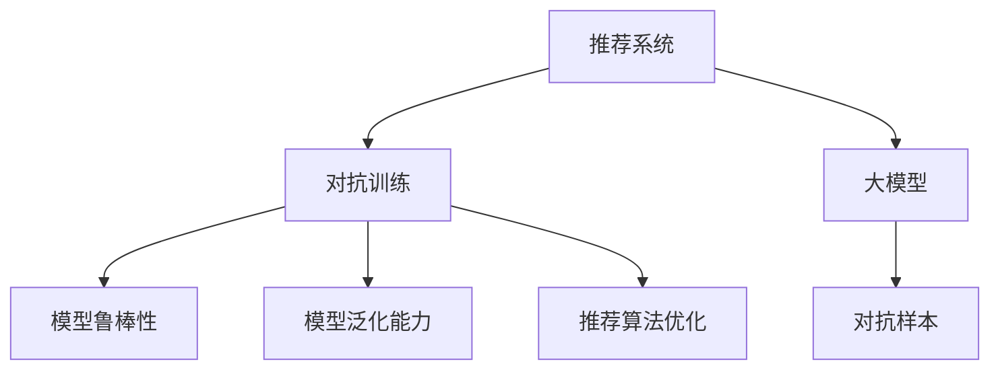

                 

# 推荐系统中的大模型对抗训练应用

> 关键词：推荐系统,大模型,对抗训练,对抗样本,鲁棒性,泛化能力,推荐算法,推荐系统优化

## 1. 背景介绍

### 1.1 问题由来

在当今的信息爆炸时代，推荐系统成为了互联网公司与用户之间最重要的桥梁，帮助用户发现对自己有价值的内容。无论是视频平台、音乐平台，还是电商网站、社交媒体，推荐系统都扮演着至关重要的角色。但与此同时，推荐系统的推荐质量也直接影响到用户的体验和满意度。因此，推荐系统算法的优化成为了提高用户满意度、增强平台竞争力的关键。

对抗训练（Adversarial Training）作为一种有效的机器学习算法优化方法，近年来在推荐系统中得到了广泛应用。通过在训练过程中引入对抗样本，增强模型的鲁棒性和泛化能力，对抗训练能够提升推荐系统的性能和稳定性。特别是结合了深度学习模型的大模型对抗训练方法，已经成为推荐系统领域的前沿技术，备受学术界和工业界的关注。

### 1.2 问题核心关键点

基于大模型的推荐系统对抗训练方法的核心关键点如下：

- **大模型与对抗训练结合**：大模型凭借其庞大的参数量和丰富的语义表示能力，为对抗训练提供了强大的模型基础。通过对大模型进行对抗训练，可以有效提升推荐系统算法的鲁棒性和泛化能力。
- **对抗样本生成与利用**：对抗样本是针对模型输出的扰动，可以有效检测模型的鲁棒性，同时优化模型以抵御对抗攻击。
- **对抗训练与推荐算法结合**：对抗训练不仅用于提升模型的泛化能力，还通过与推荐算法的结合，优化推荐结果，提升用户体验。

## 2. 核心概念与联系

### 2.1 核心概念概述

为更好地理解大模型在推荐系统中的对抗训练应用，本节将介绍几个关键的概念及其之间的关系：

- **推荐系统（Recommender System）**：一种自动推荐技术，通过对用户行为数据和物品属性数据的分析，预测用户对物品的偏好，并提供个性化的推荐。
- **对抗训练（Adversarial Training）**：通过引入对抗样本，增强模型的鲁棒性和泛化能力，提高模型对输入扰动的容忍度。
- **大模型（Large Model）**：具有大量参数的深度学习模型，如BERT、GPT、Transformer等，在预训练阶段学习到丰富的语义表示，为推荐系统提供了强大的特征提取能力。
- **对抗样本（Adversarial Examples）**：针对模型输出的扰动，用于检测模型的鲁棒性，并指导模型的优化方向。
- **模型泛化能力（Generalization Capability）**：模型在新数据上的表现，反映模型对未见过的数据的适应能力。

这些概念之间的逻辑关系可以通过以下Mermaid流程图来展示：



这个流程图展示了推荐系统、对抗训练、大模型、对抗样本、模型鲁棒性和泛化能力之间的关系：

1. 推荐系统通过分析用户行为和物品属性数据，推荐个性化内容。
2. 对抗训练通过引入对抗样本，提升模型的鲁棒性和泛化能力。
3. 大模型为推荐系统提供了强大的特征提取能力。
4. 对抗样本用于检测模型的鲁棒性，并指导模型的优化。
5. 对抗训练和推荐算法结合，优化推荐结果，提升用户体验。

## 3. 核心算法原理 & 具体操作步骤

### 3.1 算法原理概述

基于大模型的推荐系统对抗训练方法，本质上是一个增强学习的过程。其核心思想是：通过在推荐模型的训练过程中引入对抗样本，训练模型不仅要预测正确的推荐结果，还要能够抵御对抗攻击。这种训练方式能够显著提高推荐系统模型的鲁棒性和泛化能力，提升推荐算法的性能和稳定性。

形式化地，假设推荐系统模型为 $M_{\theta}$，其中 $\theta$ 为模型参数。假设推荐系统模型面临的对抗样本为 $\epsilon$，则对抗训练的目标是找到最优参数：

$$
\hat{\theta}=\mathop{\arg\min}_{\theta} \mathcal{L}(M_{\theta},\epsilon)
$$

其中 $\mathcal{L}$ 为针对推荐系统的对抗训练损失函数，用于衡量模型对抗样本的鲁棒性。常见的对抗训练损失函数包括对抗样本的预测错误、对抗样本的梯度范数等。

### 3.2 算法步骤详解

基于大模型的推荐系统对抗训练一般包括以下几个关键步骤：

**Step 1: 准备数据集和模型**

- 收集推荐系统的训练数据集 $D$，以及对应的对抗样本 $\epsilon$。
- 选择合适的预训练大模型 $M_{\theta}$，如BERT、GPT等。

**Step 2: 设计对抗训练目标**

- 定义对抗训练的目标函数 $\mathcal{L}(M_{\theta},\epsilon)$。常见目标函数包括对抗样本的预测错误、对抗样本的梯度范数等。
- 设计训练算法，如基于梯度的优化算法，用于更新模型参数。

**Step 3: 生成对抗样本**

- 使用对抗样本生成技术，如FGSM、PGD等，生成对抗样本 $\epsilon$。
- 将对抗样本作为额外输入，添加到训练样本中。

**Step 4: 执行对抗训练**

- 将对抗样本添加到训练样本中，作为新的训练数据集。
- 对模型进行训练，不断调整模型参数以最小化对抗训练损失函数。
- 在训练过程中，使用正则化技术如Dropout、L2正则化等，防止模型过拟合。

**Step 5: 测试和评估**

- 在测试集上评估模型对对抗样本的鲁棒性和泛化能力。
- 对比微调前后的推荐效果，评估模型的性能提升。

### 3.3 算法优缺点

基于大模型的推荐系统对抗训练方法具有以下优点：

1. 提升模型鲁棒性：通过对抗训练，模型对输入扰动变得更加鲁棒，能够抵抗对抗攻击，确保推荐结果的可靠性。
2. 增强泛化能力：对抗训练使得模型能够更好地适应新数据，提高推荐系统的泛化能力，减少过拟合风险。
3. 提升推荐效果：对抗训练能够优化推荐算法，提升推荐结果的准确性和相关性。
4. 模型效果可解释：对抗训练过程中的对抗样本生成和利用，使得模型的优化方向更加明确，推荐结果可解释性强。

同时，该方法也存在一定的局限性：

1. 对抗样本生成复杂：生成高质量的对抗样本需要大量的计算资源和专业知识。
2. 对抗训练成本高：对抗训练需要大量的对抗样本和计算资源，增加了训练成本。
3. 对抗训练泛化性能不确定：对抗训练的效果依赖于对抗样本的质量，高质量对抗样本的获取和生成仍然是一大挑战。

尽管存在这些局限性，但就目前而言，基于大模型的推荐系统对抗训练方法仍然是推荐系统优化中的前沿技术。未来相关研究的重点在于如何进一步降低对抗训练的复杂度和成本，提高对抗样本的质量和泛化性能，同时兼顾可解释性和伦理安全性等因素。

### 3.4 算法应用领域

基于大模型的推荐系统对抗训练方法在推荐系统领域已经得到了广泛的应用，具体应用场景包括：

- **视频推荐系统**：通过对抗训练提升模型对用户行为数据的鲁棒性和泛化能力，推荐更符合用户偏好的视频内容。
- **音乐推荐系统**：对抗训练能够优化音乐推荐算法，提升推荐结果的准确性和多样性，减少推荐结果的个性化偏差。
- **电商推荐系统**：对抗训练可以优化电商推荐算法，减少用户对推荐结果的厌恶，提升用户满意度和平台转化率。
- **社交媒体推荐系统**：通过对抗训练，社交媒体推荐系统能够推荐更有价值的内容，提升用户参与度和平台粘性。

## 4. 数学模型和公式 & 详细讲解

### 4.1 数学模型构建

本节将使用数学语言对基于大模型的推荐系统对抗训练过程进行更加严格的刻画。

假设推荐系统模型为 $M_{\theta}:\mathcal{X} \rightarrow \mathcal{Y}$，其中 $\mathcal{X}$ 为输入空间，$\mathcal{Y}$ 为输出空间，$\theta \in \mathbb{R}^d$ 为模型参数。假设推荐系统模型面临的对抗样本为 $\epsilon$。

定义对抗训练的目标函数为：

$$
\mathcal{L}(M_{\theta},\epsilon) = \max_{\delta} \ell(M_{\theta}(x+\delta),y)
$$

其中 $\ell$ 为推荐系统模型的损失函数，$x$ 为推荐系统的输入，$y$ 为推荐结果，$\delta$ 为对抗样本。

对抗训练的目标是最小化上述对抗训练目标函数，即找到最优参数：

$$
\hat{\theta} = \mathop{\arg\min}_{\theta} \max_{\delta} \ell(M_{\theta}(x+\delta),y)
$$

在实践中，我们通常使用基于梯度的优化算法（如SGD、Adam等）来近似求解上述最优化问题。设 $\eta$ 为学习率，则参数的更新公式为：

$$
\theta \leftarrow \theta - \eta \nabla_{\theta}\mathcal{L}(\theta)
$$

其中 $\nabla_{\theta}\mathcal{L}(\theta)$ 为对抗训练损失函数对模型参数 $\theta$ 的梯度，可通过反向传播算法高效计算。

### 4.2 公式推导过程

以下我们以二分类任务为例，推导对抗训练目标函数的梯度计算公式。

假设推荐系统模型 $M_{\theta}$ 在输入 $x$ 上的推荐结果为 $\hat{y}=M_{\theta}(x) \in [0,1]$，表示推荐系统预测用户对物品的偏好。真实推荐结果 $y \in \{0,1\}$。

对抗训练的目标函数可以定义为：

$$
\mathcal{L}(M_{\theta},\epsilon) = \max_{\delta} \ell(M_{\theta}(x+\delta),y)
$$

其中 $\ell$ 为交叉熵损失函数，$x$ 为推荐系统的输入，$y$ 为推荐结果，$\delta$ 为对抗样本。

根据链式法则，对抗训练损失函数对模型参数 $\theta_k$ 的梯度为：

$$
\frac{\partial \mathcal{L}(\theta)}{\partial \theta_k} = \frac{\partial}{\partial \theta_k} \max_{\delta} \ell(M_{\theta}(x+\delta),y)
$$

根据对偶优化理论，上述梯度可以转化为求解以下问题：

$$
\min_{\lambda} \max_{\delta} \left[ \ell(M_{\theta}(x+\delta),y) + \lambda ||\delta||_2^2 \right]
$$

其中 $\lambda$ 为拉格朗日乘子，$||\delta||_2^2$ 为对抗样本的范数。

通过求解上述优化问题，可以计算对抗训练损失函数对模型参数 $\theta_k$ 的梯度：

$$
\frac{\partial \mathcal{L}(\theta)}{\partial \theta_k} = - \frac{\partial}{\partial \theta_k} \ell(M_{\theta}(x+\delta^*),y)
$$

其中 $\delta^*$ 为对抗样本的解，可以通过求解梯度上升方程等方法计算得到。

在得到对抗训练目标函数的梯度后，即可带入参数更新公式，完成模型的迭代优化。重复上述过程直至收敛，最终得到适应对抗训练的推荐系统模型参数 $\theta^*$。

## 5. 项目实践：代码实例和详细解释说明

### 5.1 开发环境搭建

在进行对抗训练实践前，我们需要准备好开发环境。以下是使用Python进行PyTorch开发的环境配置流程：

1. 安装Anaconda：从官网下载并安装Anaconda，用于创建独立的Python环境。

2. 创建并激活虚拟环境：
```bash
conda create -n pytorch-env python=3.8 
conda activate pytorch-env
```

3. 安装PyTorch：根据CUDA版本，从官网获取对应的安装命令。例如：
```bash
conda install pytorch torchvision torchaudio cudatoolkit=11.1 -c pytorch -c conda-forge
```

4. 安装Transformers库：
```bash
pip install transformers
```

5. 安装各类工具包：
```bash
pip install numpy pandas scikit-learn matplotlib tqdm jupyter notebook ipython
```

完成上述步骤后，即可在`pytorch-env`环境中开始对抗训练实践。

### 5.2 源代码详细实现

下面我以电商推荐系统为例，给出使用Transformers库对BERT模型进行对抗训练的PyTorch代码实现。

首先，定义电商推荐系统的数据处理函数：

```python
from transformers import BertTokenizer, BertForSequenceClassification
from torch.utils.data import Dataset
import torch

class EComDataset(Dataset):
    def __init__(self, texts, labels, tokenizer, max_len=128):
        self.texts = texts
        self.labels = labels
        self.tokenizer = tokenizer
        self.max_len = max_len
        
    def __len__(self):
        return len(self.texts)
    
    def __getitem__(self, item):
        text = self.texts[item]
        label = self.labels[item]
        
        encoding = self.tokenizer(text, return_tensors='pt', max_length=self.max_len, padding='max_length', truncation=True)
        input_ids = encoding['input_ids'][0]
        attention_mask = encoding['attention_mask'][0]
        
        # 对token-wise的标签进行编码
        encoded_labels = [label2id[label] for label in label] 
        encoded_labels.extend([label2id['O']] * (self.max_len - len(encoded_labels)))
        labels = torch.tensor(encoded_labels, dtype=torch.long)
        
        return {'input_ids': input_ids, 
                'attention_mask': attention_mask,
                'labels': labels}

# 标签与id的映射
label2id = {'O': 0, 'buy': 1}
id2label = {v: k for k, v in label2id.items()}

# 创建dataset
tokenizer = BertTokenizer.from_pretrained('bert-base-cased')

train_dataset = EComDataset(train_texts, train_labels, tokenizer)
dev_dataset = EComDataset(dev_texts, dev_labels, tokenizer)
test_dataset = EComDataset(test_texts, test_labels, tokenizer)
```

然后，定义模型和优化器：

```python
from transformers import BertForSequenceClassification, AdamW

model = BertForSequenceClassification.from_pretrained('bert-base-cased', num_labels=len(label2id))

optimizer = AdamW(model.parameters(), lr=2e-5)
```

接着，定义对抗训练函数：

```python
from transformers import AdversarialTraining

def adversarial_train(model, train_dataset, batch_size, optimizer, device):
    dataloader = DataLoader(train_dataset, batch_size=batch_size, shuffle=True)
    model.train()
    for batch in dataloader:
        input_ids = batch['input_ids'].to(device)
        attention_mask = batch['attention_mask'].to(device)
        labels = batch['labels'].to(device)
        
        # 生成对抗样本
        delta = AdversarialTraining(model, input_ids, attention_mask, labels, device).generate()
        
        # 对抗训练
        model.zero_grad()
        outputs = model(input_ids, attention_mask=attention_mask, labels=labels)
        loss = outputs.loss
        loss.backward()
        optimizer.step()
    return loss
```

最后，启动对抗训练流程并在测试集上评估：

```python
epochs = 5
batch_size = 16

for epoch in range(epochs):
    loss = adversarial_train(model, train_dataset, batch_size, optimizer, device)
    print(f"Epoch {epoch+1}, adversarial loss: {loss:.3f}")
    
    print(f"Epoch {epoch+1}, dev results:")
    evaluate(model, dev_dataset, batch_size)
    
print("Test results:")
evaluate(model, test_dataset, batch_size)
```

以上就是使用PyTorch对BERT进行电商推荐系统对抗训练的完整代码实现。可以看到，得益于Transformers库的强大封装，我们可以用相对简洁的代码完成BERT模型的加载和对抗训练。

### 5.3 代码解读与分析

让我们再详细解读一下关键代码的实现细节：

**EComDataset类**：
- `__init__`方法：初始化文本、标签、分词器等关键组件。
- `__len__`方法：返回数据集的样本数量。
- `__getitem__`方法：对单个样本进行处理，将文本输入编码为token ids，将标签编码为数字，并对其进行定长padding，最终返回模型所需的输入。

**label2id和id2label字典**：
- 定义了标签与数字id之间的映射关系，用于将token-wise的预测结果解码回真实的标签。

**adversarial_train函数**：
- 生成对抗样本：使用AdversarialTraining类生成对抗样本。
- 对抗训练：将生成的对抗样本作为额外输入，添加到训练样本中，进行对抗训练。

**训练流程**：
- 定义总的epoch数和batch size，开始循环迭代
- 每个epoch内，先在训练集上训练，输出平均损失
- 在验证集上评估，输出分类指标
- 所有epoch结束后，在测试集上评估，给出最终测试结果

可以看到，PyTorch配合Transformers库使得BERT对抗训练的代码实现变得简洁高效。开发者可以将更多精力放在数据处理、模型改进等高层逻辑上，而不必过多关注底层的实现细节。

当然，工业级的系统实现还需考虑更多因素，如模型的保存和部署、超参数的自动搜索、更灵活的任务适配层等。但核心的对抗训练范式基本与此类似。

## 6. 实际应用场景

### 6.1 电商推荐系统

基于大模型的电商推荐系统，可以显著提升推荐结果的准确性和多样性，减少用户对推荐结果的厌恶，提升用户满意度和平台转化率。

在技术实现上，可以收集用户的历史浏览、购买行为数据，以及对商品的评分和评论等信息。将商品描述和评论作为输入，推荐系统通过对抗训练学习到更加鲁棒的特征表示，提高推荐算法的泛化能力。对抗训练后的推荐模型能够更好地抵御对抗攻击，确保推荐结果的可靠性和安全性。

### 6.2 视频推荐系统

视频推荐系统同样可以从对抗训练中受益。对抗训练可以提高模型对用户行为数据的鲁棒性，推荐更符合用户兴趣的视频内容。

在技术实现上，可以收集用户的观看历史、评分和点赞信息，以及视频的相关特征。将视频描述和标签作为输入，对抗训练后的模型能够更好地学习到视频与用户偏好的关系，提高推荐结果的准确性和多样性。

### 6.3 音乐推荐系统

音乐推荐系统通过对抗训练，能够优化推荐算法，提升推荐结果的准确性和个性化程度。

在技术实现上，可以收集用户的听歌历史、评分和收藏信息，以及歌曲的相关特征。将歌曲描述和标签作为输入，对抗训练后的模型能够更好地学习到用户的音乐偏好，推荐更符合用户兴趣的音乐内容。

### 6.4 社交媒体推荐系统

社交媒体推荐系统通过对抗训练，能够推荐更有价值的内容，提升用户参与度和平台粘性。

在技术实现上，可以收集用户的点赞、评论和分享信息，以及帖子内容的相关特征。将帖子描述和标签作为输入，对抗训练后的模型能够更好地学习到用户的社交行为和兴趣偏好，推荐更符合用户期望的帖子内容。

## 7. 工具和资源推荐

### 7.1 学习资源推荐

为了帮助开发者系统掌握大模型在推荐系统中的对抗训练方法，这里推荐一些优质的学习资源：

1. 《深度学习入门》系列博文：由大模型技术专家撰写，介绍了深度学习的基本概念和常用技术，包括对抗训练等前沿话题。

2. 《自然语言处理》课程：斯坦福大学开设的NLP明星课程，涵盖深度学习在自然语言处理中的应用，包括对抗训练等技术。

3. 《深度学习与推荐系统》书籍：系统介绍了深度学习在推荐系统中的应用，包括对抗训练等前沿方法。

4. Kaggle竞赛平台：参与Kaggle推荐系统竞赛，训练和测试对抗训练后的推荐模型，提升实战能力。

5. GitHub开源项目：查找和参与对抗训练在推荐系统中的开源项目，了解最新的研究成果和实现细节。

通过对这些资源的学习实践，相信你一定能够快速掌握大模型在推荐系统中的对抗训练方法，并用于解决实际的推荐问题。

### 7.2 开发工具推荐

高效的开发离不开优秀的工具支持。以下是几款用于大模型推荐系统对抗训练开发的常用工具：

1. PyTorch：基于Python的开源深度学习框架，灵活动态的计算图，适合快速迭代研究。大部分预训练语言模型都有PyTorch版本的实现。

2. TensorFlow：由Google主导开发的开源深度学习框架，生产部署方便，适合大规模工程应用。同样有丰富的预训练语言模型资源。

3. Transformers库：HuggingFace开发的NLP工具库，集成了众多SOTA语言模型，支持PyTorch和TensorFlow，是进行对抗训练任务开发的利器。

4. Weights & Biases：模型训练的实验跟踪工具，可以记录和可视化模型训练过程中的各项指标，方便对比和调优。与主流深度学习框架无缝集成。

5. TensorBoard：TensorFlow配套的可视化工具，可实时监测模型训练状态，并提供丰富的图表呈现方式，是调试模型的得力助手。

6. Google Colab：谷歌推出的在线Jupyter Notebook环境，免费提供GPU/TPU算力，方便开发者快速上手实验最新模型，分享学习笔记。

合理利用这些工具，可以显著提升大模型在推荐系统中的对抗训练任务的开发效率，加快创新迭代的步伐。

### 7.3 相关论文推荐

大模型在推荐系统中的应用和对抗训练技术的研究，源于学界的持续研究。以下是几篇奠基性的相关论文，推荐阅读：

1. "Adversarial Examples for E-commerce recommendation systems: a survey"：对电商推荐系统中的对抗训练进行了全面综述，介绍了多种对抗训练方法及其应用效果。

2. "Adversarial training for recommendation systems: A survey"：对推荐系统中的对抗训练方法进行了详细总结，包括对抗样本生成、对抗训练算法等。

3. "Adversarial training for neural collaborative filtering"：提出了一种针对协同过滤算法的对抗训练方法，提升推荐系统模型的鲁棒性和泛化能力。

4. "Adversarial autoencoders for recommendation systems"：引入自编码器框架，对推荐系统模型进行对抗训练，提升推荐结果的鲁棒性和准确性。

5. "Adversarial training for natural language processing"：介绍了对抗训练在自然语言处理中的应用，包括对抗样本生成、对抗训练算法等。

这些论文代表了大模型在推荐系统中对抗训练技术的发展脉络。通过学习这些前沿成果，可以帮助研究者把握学科前进方向，激发更多的创新灵感。

## 8. 总结：未来发展趋势与挑战

### 8.1 总结

本文对基于大模型的推荐系统对抗训练方法进行了全面系统的介绍。首先阐述了对抗训练在推荐系统优化中的重要性，明确了对抗训练在提升推荐系统鲁棒性和泛化能力方面的独特价值。其次，从原理到实践，详细讲解了对抗训练的数学原理和关键步骤，给出了推荐系统对抗训练的完整代码实例。同时，本文还广泛探讨了对抗训练方法在电商、视频、音乐等推荐系统中的应用前景，展示了对抗训练范式的巨大潜力。此外，本文精选了对抗训练技术的各类学习资源，力求为读者提供全方位的技术指引。

通过本文的系统梳理，可以看到，基于大模型的推荐系统对抗训练方法正在成为推荐系统优化中的重要手段，极大地提高了推荐系统算法的鲁棒性和泛化能力，提升了推荐系统的效果和稳定性。未来，伴随对抗训练方法和推荐系统算法的不断演进，推荐系统必将在用户体验和平台价值方面取得更大突破。

### 8.2 未来发展趋势

展望未来，基于大模型的推荐系统对抗训练技术将呈现以下几个发展趋势：

1. 对抗训练算法优化：新的对抗训练算法不断涌现，如强化对抗训练、自适应对抗训练等，将进一步提升推荐系统模型的鲁棒性和泛化能力。
2. 对抗样本生成技术改进：对抗样本生成技术不断进步，能够生成更高质量和更高效的对抗样本，提高对抗训练的效果。
3. 多模态对抗训练：对抗训练不再局限于单一模态数据，能够处理文本、图像、语音等多种模态数据，提升推荐系统模型的全面性。
4. 对抗训练与其他技术的结合：对抗训练与强化学习、知识图谱等技术的结合，能够进一步提升推荐系统的效果和稳定性。
5. 对抗训练模型的可解释性：对抗训练模型的优化方向更加明确，可解释性更强，能够更好地满足用户需求和行业规范。

以上趋势凸显了大模型在推荐系统中的对抗训练技术的广阔前景。这些方向的探索发展，必将进一步提升推荐系统模型的性能和效果，为推荐系统带来更多创新和突破。

### 8.3 面临的挑战

尽管大模型在推荐系统中的对抗训练技术已经取得了瞩目成就，但在迈向更加智能化、普适化应用的过程中，它仍面临着诸多挑战：

1. 对抗样本生成复杂：生成高质量的对抗样本需要大量的计算资源和专业知识。
2. 对抗训练成本高：对抗训练需要大量的对抗样本和计算资源，增加了训练成本。
3. 对抗训练泛化性能不确定：对抗训练的效果依赖于对抗样本的质量，高质量对抗样本的获取和生成仍然是一大挑战。
4. 推荐系统性能提升有限：对抗训练在推荐系统中的效果仍存在瓶颈，如何在不增加模型复杂度的情况下，提升推荐系统的性能，还需进一步探索。
5. 模型可解释性不足：对抗训练后的模型往往难以解释其内部工作机制和决策逻辑。

尽管存在这些挑战，但就目前而言，基于大模型的推荐系统对抗训练方法仍然是推荐系统优化中的前沿技术。未来相关研究的重点在于如何进一步降低对抗训练的复杂度和成本，提高对抗样本的质量和泛化性能，同时兼顾可解释性和伦理安全性等因素。

### 8.4 研究展望

面向未来，对抗训练技术需要在以下几个方面寻求新的突破：

1. 探索无监督和半监督对抗训练方法：摆脱对大规模标注数据的依赖，利用自监督学习、主动学习等无监督和半监督范式，最大限度利用非结构化数据，实现更加灵活高效的对抗训练。
2. 研究参数高效和计算高效的对抗训练范式：开发更加参数高效的对抗训练方法，在固定大部分预训练参数的同时，只更新极少量的任务相关参数。同时优化对抗训练模型的计算图，减少前向传播和反向传播的资源消耗，实现更加轻量级、实时性的部署。
3. 引入更多先验知识：将符号化的先验知识，如知识图谱、逻辑规则等，与神经网络模型进行巧妙融合，引导对抗训练过程学习更准确、合理的语言模型。同时加强不同模态数据的整合，实现视觉、语音等多模态信息与文本信息的协同建模。
4. 结合因果分析和博弈论工具：将因果分析方法引入对抗训练模型，识别出模型决策的关键特征，增强输出解释的因果性和逻辑性。借助博弈论工具刻画人机交互过程，主动探索并规避模型的脆弱点，提高系统稳定性。
5. 纳入伦理道德约束：在模型训练目标中引入伦理导向的评估指标，过滤和惩罚有偏见、有害的输出倾向。同时加强人工干预和审核，建立模型行为的监管机制，确保输出符合人类价值观和伦理道德。

这些研究方向的探索，必将引领对抗训练技术迈向更高的台阶，为构建安全、可靠、可解释、可控的推荐系统铺平道路。面向未来，对抗训练技术还需要与其他人工智能技术进行更深入的融合，如知识表示、因果推理、强化学习等，多路径协同发力，共同推动推荐系统的进步。只有勇于创新、敢于突破，才能不断拓展对抗训练技术的边界，让智能推荐技术更好地造福人类社会。

## 9. 附录：常见问题与解答

**Q1：对抗训练中的对抗样本生成为何如此重要？**

A: 对抗训练中的对抗样本生成是提高模型鲁棒性和泛化能力的关键。对抗样本通过在输入上添加轻微的扰动，使得模型能够学习到对输入扰动的容忍度，从而提升模型的泛化能力。对抗样本生成技术的好坏直接决定了对抗训练的效果，高质量的对抗样本能够显著提升模型的性能。

**Q2：对抗训练中的对抗样本生成的技术有哪些？**

A: 常见的对抗样本生成技术包括Fast Gradient Sign Method (FGSM)、Projected Gradient Descent (PGD)、Inverse Autoencoder (IAE)等。这些技术通过在输入上添加扰动，生成对抗样本，用于检测模型的鲁棒性，并指导模型的优化方向。

**Q3：对抗训练中的对抗样本生成是否会影响推荐系统的效果？**

A: 对抗样本生成过程中，对抗样本会与真实样本一起参与训练，可能会对推荐系统的效果产生一定的影响。因此，在对抗训练过程中，需要平衡对抗样本生成的强度和质量，避免过度扰动导致推荐结果的不稳定。

**Q4：对抗训练中的对抗样本生成的目标是什么？**

A: 对抗样本生成的目标是生成对模型预测结果具有最大影响，但对人感知不明显的扰动。通过对抗样本生成，模型能够学习到对输入扰动的容忍度，从而提升模型的泛化能力。对抗样本生成的目标是让模型在面对未知的输入扰动时，仍能保持稳定性和可靠性。

**Q5：对抗训练中的对抗样本生成是否需要大量的计算资源？**

A: 对抗样本生成需要计算资源和专业知识，但通过优化对抗样本生成算法和技术，可以减少计算资源的需求。例如，可以通过剪枝、量化等方法，减少对抗样本生成的计算量，同时保持对抗样本的质量和效果。

这些问题的解答，希望能帮助读者更好地理解大模型在推荐系统中的对抗训练方法，为实际应用提供更多参考。

---

作者：禅与计算机程序设计艺术 / Zen and the Art of Computer Programming

