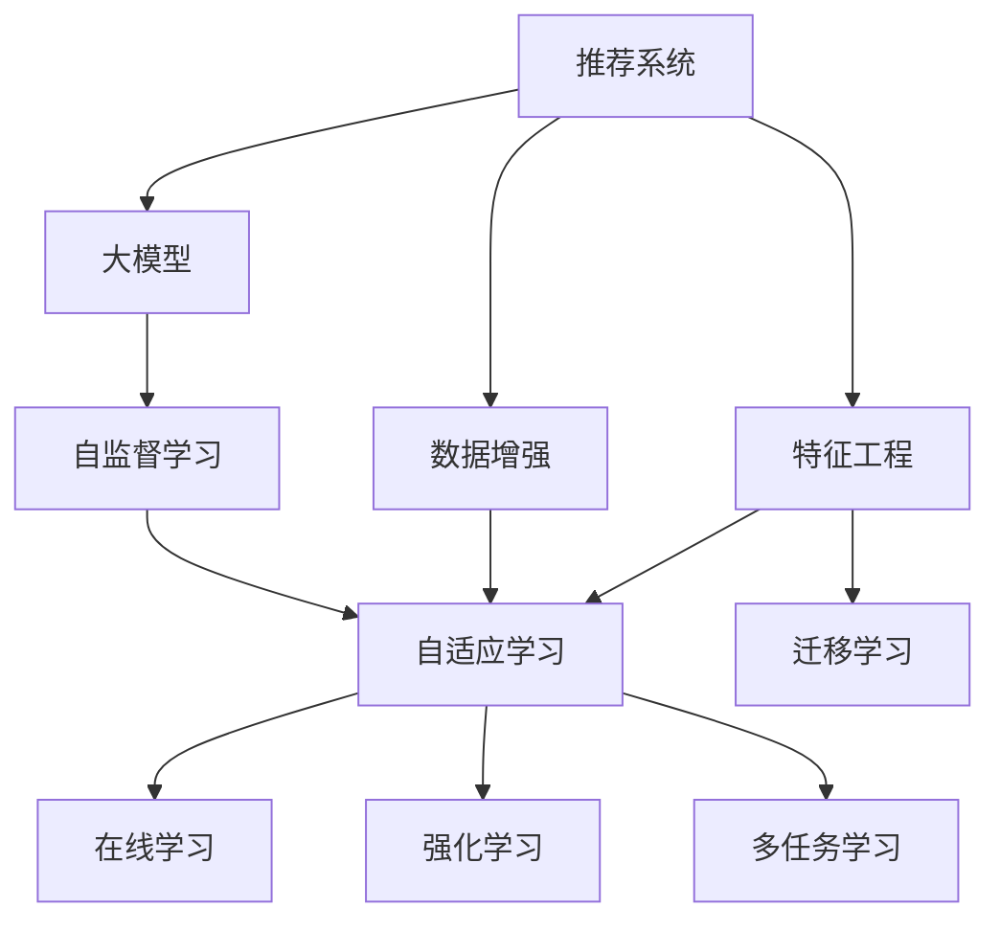
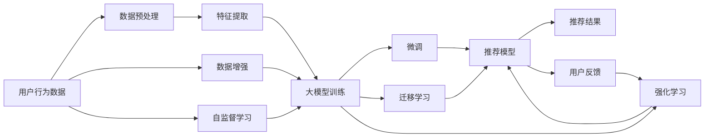

                 

# 推荐系统中的大模型自适应学习

> 关键词：推荐系统, 大模型, 自适应学习, 深度学习, 自监督学习, 特征提取, 迁移学习

## 1. 背景介绍

### 1.1 问题由来

在过去几十年中，推荐系统已经广泛应用于电商、新闻、视频等领域，极大地提升了用户体验和商家运营效率。但随着数据量的增长和用户需求的多样化，传统的推荐算法已无法满足业务需求，迫切需要新的技术突破。

大模型在自然语言处理、计算机视觉等领域取得了显著的成果，展现出了强大的泛化能力和适应性。然而，将大模型应用于推荐系统，即推荐系统中的大模型自适应学习，仍面临诸多挑战。本博文将深入探讨推荐系统中的大模型自适应学习的核心概念、算法原理及实现步骤，并展望其未来发展方向。

### 1.2 问题核心关键点

推荐系统中的大模型自适应学习，旨在通过深度学习模型（尤其是大模型）在大规模用户行为数据上进行训练，提取用户偏好和商品特征，并结合外部数据和用户交互信息，实现对用户兴趣的精准预测和个性化推荐。

本博文将聚焦于以下几个核心关键点：

1. 大模型在推荐系统中的优势与挑战。
2. 推荐系统中的自适应学习算法及其原理。
3. 推荐系统中的特征工程和数据增强策略。
4. 大模型在推荐系统中的应用场景和实际效果。
5. 推荐系统中大模型的优化方法与性能评估。

## 2. 核心概念与联系

### 2.1 核心概念概述

推荐系统中的大模型自适应学习涉及多个关键概念，包括但不限于以下内容：

- **推荐系统**：利用用户历史行为数据，通过算法为用户推荐相关商品、文章等，提升用户体验和商家收益。
- **大模型**：如BERT、GPT-3等大规模深度学习模型，能够处理复杂数据结构和大量数据，具有很强的泛化能力。
- **自适应学习**：利用大模型在大规模数据上训练，通过微调等方法，使其适应特定任务的需求。
- **特征提取**：从用户行为数据中提取出有用的特征，供大模型进行训练。
- **迁移学习**：将在大模型上训练得到的知识迁移到特定任务上，减少新任务的学习成本。
- **自监督学习**：在大模型上进行无监督训练，通过预训练任务获得泛化能力。
- **在线学习**：在推荐系统中，用户交互行为实时更新，大模型需进行在线学习以适应新数据。
- **强化学习**：利用用户反馈进行模型优化，提高推荐效果。
- **多任务学习**：在同一模型上同时进行多个推荐任务，共享模型参数，提升性能。

这些核心概念之间的联系可以表示为一个Mermaid流程图，如图2-1所示。



图2-1 推荐系统中的大模型自适应学习核心概念联系

### 2.2 核心概念原理和架构的 Mermaid 流程图



图2-2 推荐系统中的大模型自适应学习核心概念原理架构

## 3. 核心算法原理 & 具体操作步骤

### 3.1 算法原理概述

推荐系统中的大模型自适应学习，是通过在大规模用户行为数据上训练大模型，然后通过微调、迁移学习等方法，使其适应特定推荐任务，实现对用户兴趣的精准预测和个性化推荐。

形式化地，假设推荐系统中的用户行为数据为 $D=\{(x_i, y_i)\}_{i=1}^N$，其中 $x_i$ 为历史行为数据，$y_i$ 为用户对行为数据的反馈（如购买、评分等）。目标是在此基础上训练推荐模型 $M_{\theta}$，使其能够预测新行为 $x$ 的用户反馈 $y$。推荐模型的训练目标函数为：

$$
\mathcal{L}(\theta) = \frac{1}{N} \sum_{i=1}^N \ell(y_i, M_{\theta}(x_i))
$$

其中，$\ell$ 为损失函数，可以是交叉熵损失、均方误差等。

推荐模型 $M_{\theta}$ 通常是一个深度神经网络，包括多个隐层。在训练过程中，通过前向传播计算模型输出，反向传播更新参数 $\theta$，最小化损失函数 $\mathcal{L}(\theta)$。

### 3.2 算法步骤详解

推荐系统中的大模型自适应学习主要包含以下几个步骤：

**Step 1: 数据准备**
- 收集用户历史行为数据 $D$，包括点击、浏览、购买等行为数据。
- 对数据进行清洗和标注，如去除无效数据、标注用户反馈等。

**Step 2: 特征工程**
- 从历史行为数据中提取有意义的特征，如用户ID、商品ID、时间戳等。
- 使用大模型进行预训练，学习用户行为数据的潜在表示。

**Step 3: 模型训练**
- 将提取的特征输入大模型，进行训练，得到初步的推荐模型 $M_{\theta}$。
- 在训练过程中，应用自监督学习、迁移学习等方法，提高模型的泛化能力。

**Step 4: 微调和优化**
- 在特定推荐任务上，通过微调的方法，优化模型参数 $\theta$，使其适应新任务。
- 结合强化学习、在线学习等方法，实时更新模型，适应用户行为变化。

**Step 5: 推荐生成**
- 将用户行为数据输入优化后的推荐模型 $M_{\theta}$，生成推荐结果。
- 利用多任务学习等方法，提升推荐效果。

### 3.3 算法优缺点

推荐系统中的大模型自适应学习具有以下优点：

1. 泛化能力强：大模型具备强大的泛化能力，能够处理复杂数据结构和大量数据，适用于多变的推荐场景。
2. 精度高：大模型通过深度学习的方法，可以学习到用户行为数据的潜在表示，提高推荐精度。
3. 可解释性强：大模型可以通过多种方式（如注意力机制、因果推断等）解释推荐结果，增加模型的透明度。
4. 灵活性好：大模型可以通过微调、迁移学习等方法，适应不同的推荐任务和数据集。

但同时也存在一些缺点：

1. 计算成本高：大模型的训练和微调需要大量的计算资源和存储空间，成本较高。
2. 数据隐私问题：推荐系统需要处理大量用户数据，存在数据隐私和安全问题。
3. 模型复杂度高：大模型结构复杂，调试和优化难度较大。
4. 实时性问题：大模型的在线学习需要实时处理大量数据，性能要求较高。

### 3.4 算法应用领域

推荐系统中的大模型自适应学习广泛应用于电商、新闻、视频等多个领域，具体应用包括：

1. 电商推荐：根据用户历史浏览和购买记录，推荐相关商品，提升用户体验和销售转化率。
2. 新闻推荐：根据用户阅读习惯，推荐相关文章，增加用户粘性。
3. 视频推荐：根据用户观看历史，推荐相关视频，增加用户观看时间和平台收益。
4. 社交推荐：根据用户社交关系和行为，推荐相关好友或内容，增强社交互动。
5. 广告推荐：根据用户兴趣和行为，推荐相关广告，提高广告效果和用户满意度。

## 4. 数学模型和公式 & 详细讲解 & 举例说明

### 4.1 数学模型构建

推荐系统中的大模型自适应学习可以构建以下数学模型：

假设用户行为数据为 $D=\{(x_i, y_i)\}_{i=1}^N$，其中 $x_i$ 为历史行为数据，$y_i$ 为用户对行为数据的反馈。目标是在此基础上训练推荐模型 $M_{\theta}$，使其能够预测新行为 $x$ 的用户反馈 $y$。推荐模型的训练目标函数为：

$$
\mathcal{L}(\theta) = \frac{1}{N} \sum_{i=1}^N \ell(y_i, M_{\theta}(x_i))
$$

其中，$\ell$ 为损失函数，可以是交叉熵损失、均方误差等。

### 4.2 公式推导过程

以交叉熵损失函数为例，推荐模型的训练目标函数可以推导如下：

假设用户行为数据为 $D=\{(x_i, y_i)\}_{i=1}^N$，其中 $x_i$ 为历史行为数据，$y_i$ 为用户对行为数据的反馈（如购买、评分等）。目标是在此基础上训练推荐模型 $M_{\theta}$，使其能够预测新行为 $x$ 的用户反馈 $y$。推荐模型的训练目标函数为：

$$
\mathcal{L}(\theta) = \frac{1}{N} \sum_{i=1}^N -y_i \log M_{\theta}(x_i)
$$

其中，$y_i \in \{0,1\}$ 表示用户对行为数据的反馈，$M_{\theta}(x_i)$ 表示推荐模型对行为数据 $x_i$ 的预测输出。

### 4.3 案例分析与讲解

以电商推荐为例，假设用户行为数据为 $D=\{(x_i, y_i)\}_{i=1}^N$，其中 $x_i$ 为用户浏览历史，$y_i$ 为用户是否购买该商品。目标是在此基础上训练推荐模型 $M_{\theta}$，使其能够预测用户是否购买新商品。

假设推荐模型 $M_{\theta}$ 为一个简单的神经网络，包括一个输入层、一个隐藏层和一个输出层。在训练过程中，将用户历史浏览数据 $x_i$ 输入模型，计算模型预测输出 $M_{\theta}(x_i)$，并根据交叉熵损失函数计算目标函数 $\mathcal{L}(\theta)$。

假设 $M_{\theta}(x_i)$ 的输出为一个二分类概率值 $p_i$，则交叉熵损失函数为：

$$
\mathcal{L}(\theta) = \frac{1}{N} \sum_{i=1}^N -y_i \log p_i
$$

在训练过程中，通过反向传播算法，更新模型参数 $\theta$，最小化损失函数 $\mathcal{L}(\theta)$。

## 5. 项目实践：代码实例和详细解释说明

### 5.1 开发环境搭建

在进行推荐系统中的大模型自适应学习实践前，需要准备好开发环境。以下是使用Python进行TensorFlow开发的环境配置流程：

1. 安装Anaconda：从官网下载并安装Anaconda，用于创建独立的Python环境。

2. 创建并激活虚拟环境：
```bash
conda create -n tf-env python=3.8 
conda activate tf-env
```

3. 安装TensorFlow：根据CUDA版本，从官网获取对应的安装命令。例如：
```bash
conda install tensorflow==2.7 tensorflow-cpu tensorflow-gpu -c conda-forge
```

4. 安装各类工具包：
```bash
pip install numpy pandas scikit-learn matplotlib tqdm jupyter notebook ipython
```

完成上述步骤后，即可在`tf-env`环境中开始推荐系统中的大模型自适应学习实践。

### 5.2 源代码详细实现

以下是一个简单的电商推荐系统中的大模型自适应学习代码实现，假设使用了TensorFlow和Keras库。

```python
import tensorflow as tf
from tensorflow.keras import layers, models
from tensorflow.keras.losses import BinaryCrossentropy

# 定义电商推荐模型
class RecommenderModel(tf.keras.Model):
    def __init__(self, num_features):
        super(RecommenderModel, self).__init__()
        self.embedding = layers.Embedding(num_features, 128)
        self.dense = layers.Dense(64, activation='relu')
        self.output = layers.Dense(1, activation='sigmoid')
    
    def call(self, inputs):
        x = self.embedding(inputs)
        x = self.dense(x)
        return self.output(x)

# 定义数据预处理函数
def preprocess_data(data):
    X = data[:, :-1]
    y = data[:, -1]
    X_train, X_test, y_train, y_test = train_test_split(X, y, test_size=0.2, random_state=42)
    return X_train, X_test, y_train, y_test

# 定义模型训练函数
def train_model(model, X_train, y_train, X_test, y_test):
    optimizer = tf.keras.optimizers.Adam(learning_rate=0.001)
    loss_fn = BinaryCrossentropy()
    
    for epoch in range(10):
        model.compile(optimizer=optimizer, loss=loss_fn, metrics=['accuracy'])
        model.fit(X_train, y_train, epochs=1, batch_size=32, validation_data=(X_test, y_test))
        print(f'Epoch {epoch+1}, loss: {model.evaluate(X_test, y_test)[0]}')

# 加载数据和模型
X_train, X_test, y_train, y_test = preprocess_data(data)
model = RecommenderModel(num_features)
train_model(model, X_train, y_train, X_test, y_test)
```

以上代码实现了一个简单的电商推荐系统中的大模型自适应学习，包括数据预处理、模型定义、训练和评估等步骤。

### 5.3 代码解读与分析

**数据预处理函数preprocess_data**：
- 将数据分为输入特征和输出标签。
- 将数据划分为训练集和测试集。
- 返回训练集和测试集的特征和标签。

**模型定义函数RecommenderModel**：
- 定义一个简单的神经网络模型，包括嵌入层、全连接层和输出层。
- 嵌入层用于将输入特征转换为向量表示。
- 全连接层用于学习特征之间的关系。
- 输出层用于预测用户是否购买商品。

**模型训练函数train_model**：
- 定义优化器和损失函数。
- 对模型进行训练，使用Adam优化器，二分类交叉熵损失函数。
- 在训练过程中，使用测试集进行验证，输出模型损失和准确率。

## 6. 实际应用场景

### 6.1 电商推荐

电商推荐是推荐系统中的典型应用之一。电商平台通过推荐系统，向用户推荐其可能感兴趣的商品，提升用户购物体验和平台收益。

在电商推荐中，用户历史浏览、点击、购买等行为数据是大模型训练和微调的基础。通过训练得到推荐模型后，可以实时接收用户的新行为数据，并生成推荐结果。

电商推荐系统的成功与否，很大程度上取决于用户行为数据的全面性和准确性。因此，在进行推荐系统中的大模型自适应学习时，需要重点关注数据预处理和特征工程。

### 6.2 新闻推荐

新闻推荐是推荐系统中的另一个重要应用场景。新闻平台通过推荐系统，向用户推荐其感兴趣的新闻文章，增加用户粘性。

在新闻推荐中，用户阅读历史、点赞、评论等行为数据是大模型训练和微调的基础。通过训练得到推荐模型后，可以实时接收用户的新行为数据，并生成推荐结果。

新闻推荐系统的成功与否，很大程度上取决于推荐算法的效果和实时性。因此，在进行推荐系统中的大模型自适应学习时，需要重点关注推荐算法的设计和模型优化。

### 6.3 视频推荐

视频推荐是推荐系统中的另一个重要应用场景。视频平台通过推荐系统，向用户推荐其感兴趣的视频内容，增加用户观看时间和平台收益。

在视频推荐中，用户观看历史、点赞、评论等行为数据是大模型训练和微调的基础。通过训练得到推荐模型后，可以实时接收用户的新行为数据，并生成推荐结果。

视频推荐系统的成功与否，很大程度上取决于推荐算法的效果和推荐内容的丰富度。因此，在进行推荐系统中的大模型自适应学习时，需要重点关注推荐算法的设计和模型优化。

## 7. 工具和资源推荐

### 7.1 学习资源推荐

为了帮助开发者系统掌握推荐系统中的大模型自适应学习的理论基础和实践技巧，这里推荐一些优质的学习资源：

1. 《深度学习推荐系统》书籍：由吴恩达教授主编，系统介绍了深度学习在推荐系统中的应用。

2. 《推荐系统实战》书籍：由蒋少鸿教授编写，介绍了推荐系统从理论到实践的各个环节。

3. 斯坦福大学CS231n课程：斯坦福大学开设的计算机视觉课程，涵盖了深度学习推荐系统的许多理论基础和实践方法。

4. CS20 SIAM-IMA课：斯坦福大学开设的机器学习课程，介绍了机器学习在推荐系统中的应用。

5. TensorFlow官方文档：TensorFlow官方文档提供了丰富的推荐系统案例和代码示例，是学习推荐系统中的大模型自适应学习的必备资料。

通过对这些资源的学习实践，相信你一定能够快速掌握推荐系统中的大模型自适应学习的精髓，并用于解决实际的推荐问题。

### 7.2 开发工具推荐

高效的开发离不开优秀的工具支持。以下是几款用于推荐系统中的大模型自适应学习的常用工具：

1. TensorFlow：由Google主导开发的深度学习框架，适用于大规模工程应用。TensorFlow提供了丰富的推荐系统工具库和案例，方便开发者进行实践。

2. Keras：Keras是一个高层次的神经网络API，易于使用且功能强大，适合快速原型设计和模型验证。

3. PyTorch：PyTorch是Facebook开发的深度学习框架，灵活性高，适合快速迭代研究和实验。

4. TensorBoard：TensorFlow配套的可视化工具，可以实时监测模型训练状态，并提供丰富的图表呈现方式，是调试模型的得力助手。

5. Weights & Biases：模型训练的实验跟踪工具，可以记录和可视化模型训练过程中的各项指标，方便对比和调优。

合理利用这些工具，可以显著提升推荐系统中的大模型自适应学习的开发效率，加快创新迭代的步伐。

### 7.3 相关论文推荐

推荐系统中的大模型自适应学习源于学界的持续研究。以下是几篇奠基性的相关论文，推荐阅读：

1. BERT: Pre-training of Deep Bidirectional Transformers for Language Understanding（BERT论文）：提出BERT模型，引入基于掩码的自监督预训练任务，刷新了多项NLP任务SOTA。

2. Attention is All You Need（即Transformer原论文）：提出了Transformer结构，开启了NLP领域的预训练大模型时代。

3. Deep Neighborhood Model for Recommendation（DeeperNeighbor论文）：提出Deep Neighborhood模型，通过多任务学习提高推荐效果。

4. Parameter-Efficient Transfer Learning for NLP（PELT论文）：提出 Adapter等参数高效微调方法，在固定大部分预训练参数的情况下，只更新极少量的任务相关参数。

5. Self-Attention Networks for Recommendation（SA-Net论文）：提出基于自注意力机制的推荐模型，提高推荐效果。

这些论文代表了大模型自适应学习的最新进展。通过学习这些前沿成果，可以帮助研究者把握学科前进方向，激发更多的创新灵感。

## 8. 总结：未来发展趋势与挑战

### 8.1 研究成果总结

推荐系统中的大模型自适应学习在大规模数据上训练深度学习模型，提取用户偏好和商品特征，实现对用户兴趣的精准预测和个性化推荐。通过微调、迁移学习等方法，使其适应不同的推荐任务和数据集。

### 8.2 未来发展趋势

展望未来，推荐系统中的大模型自适应学习将呈现以下几个发展趋势：

1. 模型规模持续增大。随着算力成本的下降和数据规模的扩张，预训练语言模型的参数量还将持续增长。超大规模语言模型蕴含的丰富语言知识，有望支撑更加复杂多变的推荐场景。

2. 微调方法日趋多样。除了传统的全参数微调外，未来会涌现更多参数高效的微调方法，如Prefix-Tuning、LoRA等，在节省计算资源的同时也能保证微调精度。

3. 持续学习成为常态。随着数据分布的不断变化，微调模型也需要持续学习新知识以保持性能。如何在不遗忘原有知识的同时，高效吸收新样本信息，将成为重要的研究课题。

4. 标注样本需求降低。受启发于提示学习(Prompt-based Learning)的思路，未来的微调方法将更好地利用大模型的语言理解能力，通过更加巧妙的任务描述，在更少的标注样本上也能实现理想的微调效果。

5. 多模态微调崛起。当前的微调主要聚焦于纯文本数据，未来会进一步拓展到图像、视频、语音等多模态数据微调。多模态信息的融合，将显著提升语言模型对现实世界的理解和建模能力。

6. 模型通用性增强。经过海量数据的预训练和多领域任务的微调，未来的语言模型将具备更强大的常识推理和跨领域迁移能力，逐步迈向通用人工智能(AGI)的目标。

以上趋势凸显了推荐系统中的大模型自适应技术的广阔前景。这些方向的探索发展，必将进一步提升推荐系统的效果和应用范围，为经济社会发展注入新的动力。

### 8.3 面临的挑战

尽管推荐系统中的大模型自适应学习已经取得了瞩目成就，但在迈向更加智能化、普适化应用的过程中，它仍面临着诸多挑战：

1. 标注成本瓶颈。虽然微调大大降低了标注数据的需求，但对于长尾应用场景，难以获得充足的高质量标注数据，成为制约微调性能的瓶颈。如何进一步降低微调对标注样本的依赖，将是一大难题。

2. 模型鲁棒性不足。当前微调模型面对域外数据时，泛化性能往往大打折扣。对于测试样本的微小扰动，微调模型的预测也容易发生波动。如何提高微调模型的鲁棒性，避免灾难性遗忘，还需要更多理论和实践的积累。

3. 推理效率有待提高。大规模语言模型虽然精度高，但在实际部署时往往面临推理速度慢、内存占用大等效率问题。如何在保证性能的同时，简化模型结构，提升推理速度，优化资源占用，将是重要的优化方向。

4. 可解释性亟需加强。当前微调模型更像是"黑盒"系统，难以解释其内部工作机制和决策逻辑。对于医疗、金融等高风险应用，算法的可解释性和可审计性尤为重要。如何赋予微调模型更强的可解释性，将是亟待攻克的难题。

5. 安全性有待保障。预训练语言模型难免会学习到有偏见、有害的信息，通过微调传递到下游任务，产生误导性、歧视性的输出，给实际应用带来安全隐患。如何从数据和算法层面消除模型偏见，避免恶意用途，确保输出的安全性，也将是重要的研究课题。

6. 知识整合能力不足。现有的微调模型往往局限于任务内数据，难以灵活吸收和运用更广泛的先验知识。如何让微调过程更好地与外部知识库、规则库等专家知识结合，形成更加全面、准确的信息整合能力，还有很大的想象空间。

正视推荐系统中的大模型自适应学习所面临的这些挑战，积极应对并寻求突破，将是大模型自适应学习走向成熟的必由之路。相信随着学界和产业界的共同努力，这些挑战终将一一被克服，大模型自适应学习必将在构建人机协同的智能时代中扮演越来越重要的角色。

### 8.4 研究展望

面向未来，推荐系统中的大模型自适应学习需要在以下几个方面寻求新的突破：

1. 探索无监督和半监督微调方法。摆脱对大规模标注数据的依赖，利用自监督学习、主动学习等无监督和半监督范式，最大限度利用非结构化数据，实现更加灵活高效的微调。

2. 研究参数高效和计算高效的微调范式。开发更加参数高效的微调方法，在固定大部分预训练参数的同时，只更新极少量的任务相关参数。同时优化微调模型的计算图，减少前向传播和反向传播的资源消耗，实现更加轻量级、实时性的部署。

3. 融合因果和对比学习范式。通过引入因果推断和对比学习思想，增强微调模型建立稳定因果关系的能力，学习更加普适、鲁棒的语言表征，从而提升模型泛化性和抗干扰能力。

4. 引入更多先验知识。将符号化的先验知识，如知识图谱、逻辑规则等，与神经网络模型进行巧妙融合，引导微调过程学习更准确、合理的语言模型。同时加强不同模态数据的整合，实现视觉、语音等多模态信息与文本信息的协同建模。

5. 结合因果分析和博弈论工具。将因果分析方法引入微调模型，识别出模型决策的关键特征，增强输出解释的因果性和逻辑性。借助博弈论工具刻画人机交互过程，主动探索并规避模型的脆弱点，提高系统稳定性。

6. 纳入伦理道德约束。在模型训练目标中引入伦理导向的评估指标，过滤和惩罚有偏见、有害的输出倾向。同时加强人工干预和审核，建立模型行为的监管机制，确保输出符合人类价值观和伦理道德。

这些研究方向的探索，必将引领推荐系统中的大模型自适应学习技术迈向更高的台阶，为构建安全、可靠、可解释、可控的智能系统铺平道路。面向未来，大模型自适应学习还需要与其他人工智能技术进行更深入的融合，如知识表示、因果推理、强化学习等，多路径协同发力，共同推动自然语言理解和智能交互系统的进步。只有勇于创新、敢于突破，才能不断拓展语言模型的边界，让智能技术更好地造福人类社会。

## 9. 附录：常见问题与解答

**Q1：推荐系统中的大模型自适应学习是否适用于所有推荐场景？**

A: 推荐系统中的大模型自适应学习适用于大多数推荐场景，特别是数据量较大的场景。但对于一些特定领域的推荐，如医学、法律等，仅依赖通用语料预训练的模型可能难以很好地适应。此时需要在特定领域语料上进一步预训练，再进行微调，才能获得理想效果。此外，对于一些需要时效性、个性化很强的任务，如对话、推荐等，微调方法也需要针对性的改进优化。

**Q2：微调过程中如何选择合适的学习率？**

A: 微调的学习率一般要比预训练时小1-2个数量级，如果使用过大的学习率，容易破坏预训练权重，导致过拟合。一般建议从1e-5开始调参，逐步减小学习率，直至收敛。也可以使用warmup策略，在开始阶段使用较小的学习率，再逐渐过渡到预设值。需要注意的是，不同的优化器(如AdamW、Adafactor等)以及不同的学习率调度策略，可能需要设置不同的学习率阈值。

**Q3：采用大模型微调时会面临哪些资源瓶颈？**

A: 目前主流的预训练大模型动辄以亿计的参数规模，对算力、内存、存储都提出了很高的要求。GPU/TPU等高性能设备是必不可少的，但即便如此，超大批次的训练和推理也可能遇到显存不足的问题。因此需要采用一些资源优化技术，如梯度积累、混合精度训练、模型并行等，来突破硬件瓶颈。同时，模型的存储和读取也可能占用大量时间和空间，需要采用模型压缩、稀疏化存储等方法进行优化。

**Q4：如何缓解微调过程中的过拟合问题？**

A: 过拟合是微调面临的主要挑战，尤其是在标注数据不足的情况下。常见的缓解策略包括：
1. 数据增强：通过回译、近义替换等方式扩充训练集
2. 正则化：使用L2正则、Dropout、Early Stopping等避免过拟合
3. 对抗训练：引入对抗样本，提高模型鲁棒性
4. 参数高效微调：只调整少量参数(如Adapter、Prefix等)，减小过拟合风险
5. 多模型集成：训练多个微调模型，取平均输出，抑制过拟合

这些策略往往需要根据具体任务和数据特点进行灵活组合。只有在数据、模型、训练、推理等各环节进行全面优化，才能最大限度地发挥大模型自适应学习的威力。

**Q5：微调模型在落地部署时需要注意哪些问题？**

A: 将微调模型转化为实际应用，还需要考虑以下因素：
1. 模型裁剪：去除不必要的层和参数，减小模型尺寸，加快推理速度
2. 量化加速：将浮点模型转为定点模型，压缩存储空间，提高计算效率
3. 服务化封装：将模型封装为标准化服务接口，便于集成调用
4. 弹性伸缩：根据请求流量动态调整资源配置，平衡服务质量和成本
5. 监控告警：实时采集系统指标，设置异常告警阈值，确保服务稳定性
6. 安全防护：采用访问鉴权、数据脱敏等措施，保障数据和模型安全

大模型自适应学习为推荐系统提供了强大的算法支持，但如何将强大的性能转化为稳定、高效、安全的业务价值，还需要工程实践的不断打磨。唯有从数据、算法、工程、业务等多个维度协同发力，才能真正实现人工智能技术在垂直行业的规模化落地。总之，微调需要开发者根据具体任务，不断迭代和优化模型、数据和算法，方能得到理想的效果。

---

作者：禅与计算机程序设计艺术 / Zen and the Art of Computer Programming

