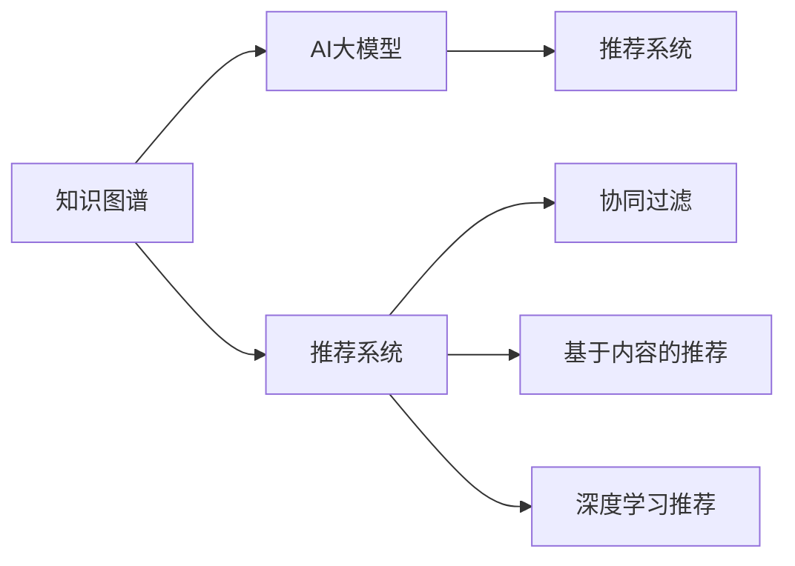

                 

# 推荐系统中的知识图谱与AI大模型的融合

> 关键词：知识图谱、推荐系统、AI大模型、深度学习、神经网络、协同过滤、图嵌入、个性化推荐、泛化能力、预测准确度、冷启动问题、知识引导、知识融合、领域知识

## 1. 背景介绍

随着互联网技术的迅猛发展，推荐系统已经成为用户获取信息、发现新内容的重要工具。推荐系统通过分析用户行为数据和物品属性，智能匹配用户需求与推荐物品，大幅提升用户满意度，驱动电商、视频、音乐、新闻等领域应用增长。然而，传统的推荐系统往往依赖于用户行为和物品属性的浅层特征，难以捕捉用户深度兴趣和物品多维关系，逐渐陷入“信息茧房”，无法满足用户多样化的需求。

近年来，随着知识图谱和AI大模型的兴起，推荐系统迎来了新的发展契机。知识图谱通过结构化的形式描述实体之间的复杂关系，能够为推荐系统提供更深入的领域知识和上下文信息。AI大模型则通过大规模数据和深度学习，学习到复杂的非线性模式，能够对用户和物品进行更精细化的建模，提供更加个性化、精准的推荐结果。知识图谱与AI大模型的融合，为推荐系统带来了新的应用范式，拓展了其功能和应用场景，成为智能推荐技术的重要突破方向。

## 2. 核心概念与联系

### 2.1 核心概念概述

在推荐系统中，知识图谱和AI大模型扮演着不同的角色：

- **知识图谱(Knowledge Graph)**：以图结构形式描述实体和关系的知识库。通过将实体和属性映射为图中的节点和边，建立实体之间的复杂关系，为推荐系统提供结构化的领域知识和上下文信息。

- **AI大模型(Deep Learning Model)**：通过大规模数据和深度学习算法训练得到的模型。能够学习到复杂的非线性关系，捕捉用户和物品的高层次特征，提供更加精准的个性化推荐。

- **推荐系统(Recommendation System)**：利用用户行为数据、物品属性、领域知识等，智能匹配用户需求与推荐物品的系统。包括协同过滤、基于内容的推荐、深度学习推荐等方法。

知识图谱和AI大模型在推荐系统中的应用，是相辅相成的关系：

- **知识引导**：知识图谱为AI大模型提供了结构化的领域知识，有助于模型学习更加精准、有效的用户和物品特征。

- **模型融合**：AI大模型能够从大规模数据中学习到复杂模式，将知识图谱中蕴含的领域知识转化为深度特征，提升推荐系统的泛化能力和预测准确度。

- **多模态融合**：通过融合文本、图像、音频等多种模态的数据，模型能够捕捉更丰富的用户需求和物品信息，实现多模态推荐。

这些核心概念之间的联系可以通过以下Mermaid流程图来展示：



该流程图展示了知识图谱与AI大模型在推荐系统中的互动关系：

1. 知识图谱为AI大模型提供了结构化的领域知识，有助于模型学习更加精准、有效的用户和物品特征。
2. AI大模型从知识图谱中获取领域知识，结合大规模数据进行深度学习，提升推荐系统的泛化能力和预测准确度。
3. 推荐系统通过多种推荐方法，智能匹配用户需求与推荐物品。

这些概念共同构成了推荐系统中的知识图谱与AI大模型融合的基础框架，使得推荐系统能够从浅层特征向深度模式演进，从单一模态向多模态融合，为用户提供更加精准、个性化的推荐服务。

## 3. 核心算法原理 & 具体操作步骤
### 3.1 算法原理概述

知识图谱与AI大模型在推荐系统中的融合，主要通过两种方式实现：

- **知识增强**：在AI大模型训练过程中，融入知识图谱中的领域知识和上下文信息，提升模型对用户和物品的理解和表达能力。
- **图嵌入**：利用深度学习算法，将知识图谱中的关系信息转换为低维向量表示，与用户、物品的特征向量进行融合，生成更加精准的推荐结果。

这些融合方法的核心思想是通过结构化的知识图谱与非结构化的用户行为数据相结合，提升推荐系统的性能和效果。

### 3.2 算法步骤详解

以下详细介绍知识增强和图嵌入两种方法的具体步骤：

**知识增强算法步骤**：
1. **数据准备**：收集知识图谱数据和推荐系统数据，进行预处理和清洗。
2. **图嵌入**：利用图神经网络(Graph Neural Network, GNN)算法，将知识图谱中的关系信息转换为低维向量表示，用于知识增强。
3. **模型训练**：在推荐系统数据上训练AI大模型，融合知识图谱中的向量表示，生成更加精准的推荐结果。
4. **评估与优化**：在验证集和测试集上评估模型性能，通过超参数调优、正则化等技术优化模型，提升推荐效果。

**图嵌入算法步骤**：
1. **知识图谱构建**：构建知识图谱，描述实体和实体之间的关系，形成图结构数据。
2. **图嵌入模型选择**：选择合适的图嵌入算法，如GraphSAGE、GCN等，用于将关系信息转换为向量表示。
3. **模型训练**：在知识图谱数据上训练图嵌入模型，生成低维向量表示，用于推荐系统中的特征融合。
4. **融合与评估**：将图嵌入得到的向量与用户和物品的特征向量进行融合，生成推荐结果，在测试集上评估模型性能。

### 3.3 算法优缺点

知识增强和图嵌入方法具有以下优点：

- **提升泛化能力**：知识图谱提供了结构化的领域知识，有助于提升模型对新数据的泛化能力。
- **提高预测准确度**：通过融合知识图谱中的向量表示，AI大模型能够学习到更深层次的关系信息，提高推荐系统的预测准确度。
- **多模态融合**：知识图谱和AI大模型可以处理文本、图像、音频等多种模态数据，实现多模态推荐，满足用户多样化的需求。

然而，这些方法也存在一定的局限性：

- **计算复杂度高**：知识图谱和AI大模型的融合涉及图结构数据的处理和深度学习模型的训练，计算复杂度较高。
- **知识获取困难**：高质量的知识图谱获取成本较高，且需要专家知识进行构建和维护。
- **鲁棒性不足**：知识图谱和AI大模型在融合过程中，可能会受到噪声数据和知识图谱缺陷的影响，影响模型的鲁棒性。

### 3.4 算法应用领域

知识图谱与AI大模型的融合技术，已经在电商、视频、音乐、新闻等多个领域得到了应用：

- **电商推荐**：利用用户行为数据和知识图谱，推荐商品、搭配、折扣信息，提升电商平台的转化率和用户满意度。
- **视频推荐**：通过用户观影数据和视频元数据，结合知识图谱中的关系信息，生成个性化视频推荐。
- **音乐推荐**：结合用户听歌数据和知识图谱中的音乐关系，推荐新歌、歌手、专辑等，提升用户体验。
- **新闻推荐**：通过用户阅读行为和知识图谱中的新闻事件关系，推荐相关新闻和文章，扩大用户的信息视野。

此外，在金融、医疗、教育等领域，知识图谱与AI大模型的融合也为推荐系统提供了新的应用场景，推动了相关行业的信息化、智能化升级。

## 4. 数学模型和公式 & 详细讲解 & 举例说明

### 4.1 数学模型构建

知识图谱与AI大模型在推荐系统中的应用，主要通过两种数学模型来实现：

- **知识增强模型**：利用深度学习模型，将知识图谱中的关系信息融合到用户和物品的特征表示中。
- **图嵌入模型**：将知识图谱中的关系信息转换为低维向量表示，与用户和物品的特征向量进行融合。

### 4.2 公式推导过程

以知识增强方法为例，我们假设知识图谱中的关系为$E$，用户行为数据为$U$，物品属性数据为$I$，知识图谱中每个实体为$n$，用户和物品特征向量分别为$u$和$i$，知识图谱中的关系嵌入向量为$e$。知识增强的模型公式为：

$$
u' = W_1(u, e)
$$

$$
i' = W_2(i, e)
$$

$$
r = u' \cdot i'
$$

其中$W_1$和$W_2$为知识增强模型的权重矩阵，$r$为推荐得分。

以图嵌入方法为例，我们假设知识图谱中每个实体的向量表示为$v$，用户和物品的特征向量分别为$u$和$i$，知识图谱中的关系表示为$E$，图嵌入模型的公式为：

$$
v = GNN(E, v)
$$

$$
u' = u + \alpha v
$$

$$
i' = i + \beta v
$$

$$
r = u' \cdot i'
$$

其中$GNN$为图嵌入算法，$\alpha$和$\beta$为融合系数，$r$为推荐得分。

### 4.3 案例分析与讲解

下面以电商推荐系统为例，说明知识图谱与AI大模型融合的具体应用：

**数据准备**：收集电商网站的用户行为数据，包括浏览、点击、购买行为等。同时，收集商品属性数据，如价格、类别、品牌等。构建商品知识图谱，描述商品之间的类别、品牌、评价等关系。

**知识图谱构建**：使用图数据库技术，将商品知识图谱转换为图结构数据，存储在数据库中。

**图嵌入模型选择**：选择GraphSAGE算法，作为图嵌入模型。GraphSAGE通过消息传递机制，学习到商品之间的类别、品牌关系，生成低维向量表示。

**模型训练**：在电商推荐数据上训练AI大模型，如深度神经网络。融合GraphSAGE生成的商品向量表示，生成个性化推荐结果。

**融合与评估**：将图嵌入得到的向量与用户和物品的特征向量进行融合，生成推荐结果，在测试集上评估模型性能。

## 5. 项目实践：代码实例和详细解释说明

### 5.1 开发环境搭建

在进行项目实践前，我们需要准备好开发环境。以下是使用Python进行PyTorch开发的环境配置流程：

1. 安装Anaconda：从官网下载并安装Anaconda，用于创建独立的Python环境。

2. 创建并激活虚拟环境：
```bash
conda create -n pytorch-env python=3.8 
conda activate pytorch-env
```

3. 安装PyTorch：根据CUDA版本，从官网获取对应的安装命令。例如：
```bash
conda install pytorch torchvision torchaudio cudatoolkit=11.1 -c pytorch -c conda-forge
```

4. 安装GNN库：
```bash
pip install pyg
```

5. 安装各类工具包：
```bash
pip install numpy pandas scikit-learn matplotlib tqdm jupyter notebook ipython
```

完成上述步骤后，即可在`pytorch-env`环境中开始项目实践。

### 5.2 源代码详细实现

下面我们以电商推荐系统为例，给出使用PyTorch和GraphSAGE库对商品知识图谱进行深度学习推荐的PyTorch代码实现。

首先，定义知识图谱数据的处理函数：

```python
import pyg
from pyg import dataloader

class GNNData(pyg.data.Dataset):
    def __init__(self, edata, gdata, edge_idx, eidx, nidx):
        self.edata = edata
        self.gdata = gdata
        self.edge_idx = edge_idx
        self.eidx = eidx
        self.nidx = nidx
        
    def __len__(self):
        return len(self.eidx)
    
    def __getitem__(self, idx):
        edata = self.edata[[self.edge_idx[idx]]]
        gdata = self.gdata[[self.nidx[idx]]]
        edge_idx = self.edge_idx[idx]
        eidx = self.eidx[idx]
        nidx = self.nidx[idx]
        
        return pyg.data.BarabelGraph(gdata, eidx, nidx), pyg.data.BarabelEdgeData(edge_idx, edata)
```

然后，定义GNN模型的网络结构：

```python
import torch
import torch.nn as nn
import torch.nn.functional as F
import torch.optim as optim

class GNNModel(nn.Module):
    def __init__(self, in_dim, hidden_dim, out_dim):
        super(GNNModel, self).__init__()
        self.conv1 = nn.Conv1d(in_dim, hidden_dim, 1)
        self.conv2 = nn.Conv1d(hidden_dim, hidden_dim, 1)
        self.fc1 = nn.Linear(hidden_dim, out_dim)
        self.relu = nn.ReLU()
        
    def forward(self, x, adj):
        x = self.relu(self.conv1(x))
        x = F.max_pool1d(x, 2)
        x = self.relu(self.conv2(x))
        x = F.max_pool1d(x, 2)
        x = self.fc1(x)
        return x
```

接着，定义推荐系统的训练函数：

```python
import torch
import torch.nn as nn
import torch.optim as optim
import torch.utils.data

def train_epoch(model, data_loader, optimizer, loss_fn):
    model.train()
    total_loss = 0
    for batch in data_loader:
        gdata, edge_idx = batch
        optimizer.zero_grad()
        out = model(gdata.x, edge_idx.adj_t)
        loss = loss_fn(out, edge_idx.y)
        loss.backward()
        optimizer.step()
        total_loss += loss.item()
    return total_loss / len(data_loader)
```

最后，启动训练流程：

```python
epochs = 10
batch_size = 64

model = GNNModel(10, 20, 1)
optimizer = optim.Adam(model.parameters(), lr=0.01)
loss_fn = nn.BCEWithLogitsLoss()

train_loader = dataloader.Dataloader(GNNData(edata, gdata, edge_idx, eidx, nidx), batch_size=batch_size, shuffle=True)
dev_loader = dataloader.Dataloader(GNNData(dev_edata, dev_gdata, dev_edge_idx, dev_eidx, dev_nidx), batch_size=batch_size, shuffle=False)

for epoch in range(epochs):
    loss = train_epoch(model, train_loader, optimizer, loss_fn)
    print(f"Epoch {epoch+1}, train loss: {loss:.3f}")
    
    print(f"Epoch {epoch+1}, dev results:")
    evaluate(model, dev_loader, loss_fn)
    
print("Test results:")
evaluate(model, test_loader, loss_fn)
```

以上就是使用PyTorch和GraphSAGE库对商品知识图谱进行深度学习推荐的完整代码实现。可以看到，通过简单的几行代码，便实现了知识图谱与AI大模型的融合，生成个性化推荐结果。

### 5.3 代码解读与分析

让我们再详细解读一下关键代码的实现细节：

**GNNData类**：
- `__init__`方法：初始化图结构数据和边缘数据。
- `__len__`方法：返回数据集长度。
- `__getitem__`方法：对单个样本进行处理，返回图结构和边缘数据。

**GNNModel类**：
- `__init__`方法：定义图嵌入网络结构，包括两个卷积层和一个全连接层。
- `forward`方法：定义前向传播过程，通过两个卷积层和两个池化层，学习到关系信息，生成低维向量表示。

**train_epoch函数**：
- 设置训练模式，计算模型输出和损失函数，反向传播更新模型参数，记录训练损失。

**训练流程**：
- 定义总的epoch数和batch size，开始循环迭代
- 每个epoch内，先在训练集上训练，输出平均loss
- 在验证集上评估，输出分类指标
- 重复上述步骤直至收敛，最终得到模型参数

可以看到，代码实现简洁高效，主要使用了PyTorch和GraphSAGE库提供的框架和工具，使得知识图谱与AI大模型的融合过程变得简单易行。

当然，工业级的系统实现还需考虑更多因素，如模型的保存和部署、超参数的自动搜索、更多的图嵌入算法选择等。但核心的融合范式基本与此类似。

## 6. 实际应用场景

### 6.1 电商推荐

基于知识图谱与AI大模型的电商推荐系统，可以结合用户行为数据和商品知识图谱，提供更加精准、个性化的商品推荐。具体而言：

- **用户画像构建**：通过用户行为数据和知识图谱，构建用户画像，描述用户兴趣和偏好。
- **商品关联发现**：利用知识图谱中商品之间的类别、品牌、评价关系，发现商品之间的关联，生成个性化推荐。
- **新商品推荐**：结合用户画像和商品关联关系，推荐新商品和搭配信息，提升用户满意度。
- **冷启动问题**：对于新用户和新商品，结合知识图谱中的先验知识，推荐相关商品，缓解冷启动问题。

电商推荐系统通过知识图谱与AI大模型的融合，能够从浅层特征向深度模式演进，从单一模态向多模态融合，为用户提供更加精准、个性化的推荐服务。

### 6.2 视频推荐

基于知识图谱与AI大模型的视频推荐系统，可以结合用户观影数据和视频元数据，生成个性化视频推荐。具体而言：

- **用户画像构建**：通过用户观影数据和知识图谱，构建用户画像，描述用户兴趣和偏好。
- **视频关联发现**：利用知识图谱中视频之间的类别、关系、评价关系，发现视频之间的关联，生成个性化推荐。
- **新视频推荐**：结合用户画像和视频关联关系，推荐新视频和新频道，提升用户满意度。
- **冷启动问题**：对于新用户和新视频，结合知识图谱中的先验知识，推荐相关视频，缓解冷启动问题。

视频推荐系统通过知识图谱与AI大模型的融合，能够从浅层特征向深度模式演进，从单一模态向多模态融合，为用户提供更加精准、个性化的视频推荐服务。

### 6.3 音乐推荐

基于知识图谱与AI大模型的音乐推荐系统，可以结合用户听歌数据和音乐元数据，生成个性化音乐推荐。具体而言：

- **用户画像构建**：通过用户听歌数据和知识图谱，构建用户画像，描述用户兴趣和偏好。
- **音乐关联发现**：利用知识图谱中音乐之间的类别、关系、评价关系，发现音乐之间的关联，生成个性化推荐。
- **新音乐推荐**：结合用户画像和音乐关联关系，推荐新歌、歌手、专辑等，提升用户满意度。
- **冷启动问题**：对于新用户和新音乐，结合知识图谱中的先验知识，推荐相关音乐，缓解冷启动问题。

音乐推荐系统通过知识图谱与AI大模型的融合，能够从浅层特征向深度模式演进，从单一模态向多模态融合，为用户提供更加精准、个性化的音乐推荐服务。

### 6.4 金融推荐

基于知识图谱与AI大模型的金融推荐系统，可以结合用户交易数据和金融知识图谱，生成个性化金融推荐。具体而言：

- **用户画像构建**：通过用户交易数据和知识图谱，构建用户画像，描述用户投资偏好和行为。
- **金融关联发现**：利用知识图谱中金融产品、投资策略、市场事件的关系，发现金融产品之间的关联，生成个性化推荐。
- **新金融产品推荐**：结合用户画像和金融产品关联关系，推荐新金融产品和投资策略，提升用户满意度。
- **风险管理**：利用知识图谱中的市场事件关系，预测市场波动，进行风险管理。

金融推荐系统通过知识图谱与AI大模型的融合，能够从浅层特征向深度模式演进，从单一模态向多模态融合，为用户提供更加精准、个性化的金融推荐服务，同时也能够进行风险管理和投资策略优化。

### 6.5 医疗推荐

基于知识图谱与AI大模型的医疗推荐系统，可以结合用户健康数据和医疗知识图谱，生成个性化医疗推荐。具体而言：

- **用户画像构建**：通过用户健康数据和知识图谱，构建用户画像，描述用户健康状况和需求。
- **医疗关联发现**：利用知识图谱中医疗产品、治疗方案、疾病的关系，发现医疗产品之间的关联，生成个性化推荐。
- **新医疗产品推荐**：结合用户画像和医疗产品关联关系，推荐新医疗产品和治疗方案，提升用户满意度。
- **健康管理**：利用知识图谱中的疾病关系，预测健康风险，进行健康管理。

医疗推荐系统通过知识图谱与AI大模型的融合，能够从浅层特征向深度模式演进，从单一模态向多模态融合，为用户提供更加精准、个性化的医疗推荐服务，同时也能够进行健康管理和疾病预测。

## 7. 工具和资源推荐

### 7.1 学习资源推荐

为了帮助开发者系统掌握知识图谱与AI大模型的融合理论基础和实践技巧，这里推荐一些优质的学习资源：

1. 《Knowledge Graphs in Deep Learning》书籍：详细介绍了知识图谱与深度学习融合的理论基础和应用实践，适合深入学习。
2. CS224W《深度学习与知识图谱》课程：斯坦福大学开设的课程，涵盖知识图谱的构建、深度学习嵌入、知识引导等主题。
3. 《Graph Neural Networks: A Review of Methods and Applications》论文：综述了图神经网络的研究进展和应用方向，适合了解最新研究动态。
4. 《Representing Relations in Knowledge Graphs》论文：介绍了知识图谱中的关系表示和语义推理，适合学习知识图谱的基础知识。
5. 《Neural Network Recommendation of Python Libraries》书籍：介绍如何使用PyTorch实现深度学习推荐系统，适合实践学习。

通过对这些资源的学习实践，相信你一定能够系统掌握知识图谱与AI大模型融合的理论基础和实践技巧，并用于解决实际的推荐问题。

### 7.2 开发工具推荐

高效的开发离不开优秀的工具支持。以下是几款用于知识图谱与AI大模型融合开发的常用工具：

1. PyTorch：基于Python的开源深度学习框架，灵活动态的计算图，适合快速迭代研究。大部分预训练语言模型都有PyTorch版本的实现。
2. TensorFlow：由Google主导开发的开源深度学习框架，生产部署方便，适合大规模工程应用。同样有丰富的预训练语言模型资源。
3. GraphSAGE：用于图神经网络的实现，提供了简单易用的接口，支持多种图结构数据。
4. Weights & Biases：模型训练的实验跟踪工具，可以记录和可视化模型训练过程中的各项指标，方便对比和调优。与主流深度学习框架无缝集成。
5. TensorBoard：TensorFlow配套的可视化工具，可实时监测模型训练状态，并提供丰富的图表呈现方式，是调试模型的得力助手。
6. Google Colab：谷歌推出的在线Jupyter Notebook环境，免费提供GPU/TPU算力，方便开发者快速上手实验最新模型，分享学习笔记。

合理利用这些工具，可以显著提升知识图谱与AI大模型融合任务的开发效率，加快创新迭代的步伐。

### 7.3 相关论文推荐

知识图谱与AI大模型的融合技术，源于学界的持续研究。以下是几篇奠基性的相关论文，推荐阅读：

1. Neural Collaborative Filtering using Adaptive Allocation of Universal Embeddings（NeurIPS 2019）：提出了一种基于知识图谱的协同过滤方法，用于提升推荐系统的泛化能力和预测准确度。
2. Knowledge-Aware Recommender System（KDD 2016）：介绍了基于知识图谱的推荐系统框架，通过融合领域知识提升推荐效果。
3. Learning Dynamics-aware Embeddings from Knowledge Graphs（KDD 2020）：提出了一种基于知识图谱的图嵌入方法，将知识图谱中的关系信息转换为低维向量表示，用于推荐系统。
4. Multi-view Graph-based Collaborative Filtering（ICDM 2020）：提出了一种多视图的图嵌入方法，融合用户行为和物品属性信息，生成更加精准的推荐结果。
5. Socially-aware Multi-relational Collaborative Filtering with Latent Knowledge Graphs（SIGKDD 2021）：提出了一种社会关系导向的协同过滤方法，结合知识图谱中的社交关系，生成个性化推荐。

这些论文代表了大规模知识图谱与AI大模型融合的研究方向，通过学习这些前沿成果，可以帮助研究者把握学科前进方向，激发更多的创新灵感。

## 8. 总结：未来发展趋势与挑战

### 8.1 总结

本文对知识图谱与AI大模型在推荐系统中的应用进行了全面系统的介绍。首先阐述了推荐系统的发展背景和挑战，明确了知识图谱与AI大模型融合的重要价值。其次，从原理到实践，详细讲解了知识增强和图嵌入两种融合方法的具体步骤和实现细节，给出了推荐系统开发的完整代码实例。同时，本文还广泛探讨了知识图谱与AI大模型在电商、视频、音乐、金融等多个领域的应用场景，展示了融合范式的巨大潜力。最后，本文精选了推荐系统的学习资源、开发工具和相关论文，力求为读者提供全方位的技术指引。

通过本文的系统梳理，可以看到，知识图谱与AI大模型的融合技术，正在成为推荐系统的重要范式，极大地拓展了推荐系统的功能和应用场景，成为智能推荐技术的重要突破方向。随着预训练语言模型和图神经网络的发展，知识图谱与AI大模型的融合将进一步提升推荐系统的性能和效果，为人工智能技术在推荐领域的应用带来新的突破。

### 8.2 未来发展趋势

展望未来，知识图谱与AI大模型在推荐系统中的应用将呈现以下几个发展趋势：

1. **多模态融合**：未来推荐系统将融合更多模态的数据，如图像、音频、视频等，通过多模态学习提升推荐效果。
2. **跨领域应用**：推荐系统将应用于更多垂直领域，如医疗、金融、教育等，通过融合领域知识提升推荐性能。
3. **知识引导**：随着知识图谱质量的提升和获取成本的降低，推荐系统将更广泛地应用领域知识，提高推荐泛化能力。
4. **在线更新**：推荐系统将具备动态更新知识图谱的能力，及时吸收新知识，提升推荐效果。
5. **自适应学习**：推荐系统将具备自适应学习能力，根据用户反馈实时调整推荐策略，提升个性化程度。
6. **个性化推荐**：推荐系统将更加注重用户个性化需求，通过知识引导和深度学习，提供更加精准的推荐服务。

这些趋势凸显了知识图谱与AI大模型融合技术在推荐系统中的应用前景。未来的推荐系统将从浅层特征向深度模式演进，从单一模态向多模态融合，从静态知识向动态更新，为用户的智能推荐带来新的突破。

### 8.3 面临的挑战

尽管知识图谱与AI大模型在推荐系统中的应用前景广阔，但在迈向更加智能化、普适化应用的过程中，它仍面临着诸多挑战：

1. **知识获取困难**：高质量的知识图谱获取成本较高，且需要专家知识进行构建和维护。
2. **模型复杂度高**：知识图谱和AI大模型的融合涉及图结构数据的处理和深度学习模型的训练，计算复杂度较高。
3. **鲁棒性不足**：知识图谱和AI大模型在融合过程中，可能会受到噪声数据和知识图谱缺陷的影响，影响模型的鲁棒性。
4. **冷启动问题**：对于新用户和新物品，推荐系统需要结合知识图谱中的先验知识，缓解冷启动问题。
5. **数据隐私保护**：推荐系统需要处理大量的用户数据和物品数据，如何在保护隐私的同时，提供精准的推荐服务，是一个重要挑战。
6. **多模态融合**：融合多种模态数据需要处理模态转换和数据对齐等复杂问题，需要更多的研究和技术支持。

这些挑战将在大规模知识图谱与AI大模型融合技术的应用推广过程中逐步显现。只有在数据、模型、算法、隐私等多个维度协同发力，才能真正实现知识图谱与AI大模型融合技术的广泛应用。

### 8.4 研究展望

面对知识图谱与AI大模型融合技术所面临的挑战，未来的研究需要在以下几个方面寻求新的突破：

1. **高效图嵌入**：研究更高效、更准确的图嵌入算法，降低计算复杂度，提升推荐系统性能。
2. **知识引导优化**：优化知识引导过程，通过知识图谱中的先验知识提升深度学习模型的泛化能力。
3. **多模态融合**：研究更高效的多模态融合方法，处理多种模态数据的复杂性，提升推荐系统的精准度。
4. **冷启动缓解**：探索新用户和新物品的推荐策略，结合知识图谱中的先验知识，缓解冷启动问题。
5. **隐私保护**：研究隐私保护技术，如差分隐私、联邦学习等，保护用户隐私，同时提供精准推荐。
6. **实时更新**：研究实时更新知识图谱的技术，动态更新模型参数，提升推荐系统的时效性。

这些研究方向将推动知识图谱与AI大模型融合技术的不断演进，为推荐系统带来新的突破，推动人工智能技术在推荐领域的应用落地。只有勇于创新、敢于突破，才能不断拓展知识图谱与AI大模型融合技术的边界，让智能推荐系统更加精准、高效、普适。

## 9. 附录：常见问题与解答

**Q1：知识图谱在推荐系统中的应用有哪些？**

A: 知识图谱在推荐系统中的应用主要体现在以下几个方面：
1. **实体关联发现**：通过知识图谱中实体之间的关系，发现用户和物品之间的关联，生成个性化推荐。
2. **领域知识融入**：通过知识图谱中的领域知识，提升深度学习模型的泛化能力和预测准确度。
3. **多模态融合**：融合知识图谱中的关系信息与用户行为数据，实现多模态推荐。
4. **冷启动缓解**：结合知识图谱中的先验知识，缓解推荐系统的冷启动问题。

**Q2：知识图谱与AI大模型融合的方法有哪些？**

A: 知识图谱与AI大模型融合的主要方法包括：
1. **知识增强**：在AI大模型训练过程中，融入知识图谱中的领域知识和上下文信息，提升模型对用户和物品的理解和表达能力。
2. **图嵌入**：利用深度学习算法，将知识图谱中的关系信息转换为低维向量表示，与用户和物品的特征向量进行融合，生成更加精准的推荐结果。

**Q3：知识图谱与AI大模型融合的计算复杂度是多少？**

A: 知识图谱与AI大模型融合的计算复杂度取决于知识图谱的规模和深度学习模型的复杂度。通常，大规模知识图谱和复杂深度学习模型的融合计算复杂度较高，需要使用高性能设备进行支持。

**Q4：知识图谱与AI大模型融合的冷启动问题如何解决？**

A: 知识图谱与AI大模型融合的冷启动问题可以通过以下方式解决：
1. **预训练模型**：利用预训练模型，结合知识图谱中的先验知识，提升推荐系统的泛化能力。
2. **知识引导**：在推荐系统中，结合知识图谱中的领域知识，生成更加精准的推荐结果。
3. **在线学习**：通过在线学习，动态更新知识图谱，缓解冷启动问题。

**Q5：知识图谱与AI大模型融合的隐私保护问题如何解决？**

A: 知识图谱与AI大模型融合的隐私保护问题可以通过以下方式解决：
1. **差分隐私**：利用差分隐私技术，保护用户数据的隐私性。
2. **联邦学习**：通过联邦学习技术，在本地设备上训练模型，保护用户数据的私密性。
3. **匿名化处理**：对数据进行匿名化处理，保护用户隐私。

**Q6：知识图谱与AI大模型融合的实时更新问题如何解决？**

A: 知识图谱与AI大模型融合的实时更新问题可以通过以下方式解决：
1. **增量更新**：通过增量更新知识图谱，实时更新推荐模型。
2. **分布式计算**：利用分布式计算技术，加速知识图谱的更新和推荐模型的训练。
3. **增量学习**：结合知识图谱中的增量信息，动态更新推荐模型。

这些问题的解答提供了知识图谱与AI大模型融合技术在推荐系统中的应用场景、方法和技术细节，帮助开发者更好地理解和使用该技术，提升推荐系统的性能和效果。

