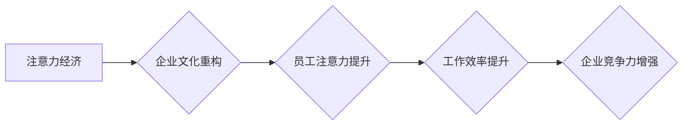

> 企业文化、注意力经济、数字化转型、员工激励、高效协作、创新驱动

## 1. 背景介绍

在当今信息爆炸的时代，人们面临着前所未有的信息过载。注意力已成为稀缺资源，而如何有效地获取和利用注意力，成为了企业竞争的关键。注意力经济的概念应运而生，它强调了注意力作为一种宝贵资源的价值，并提出了如何通过设计和优化环境来引导和提升注意力。

企业文化作为企业内部的价值观、信念和行为准则的集合，直接影响着员工的行为和绩效。传统的企业文化模式在信息时代面临着挑战，需要进行重构，以适应注意力经济的时代特征。

## 2. 核心概念与联系

**2.1 注意力经济**

注意力经济是指在信息时代，注意力作为一种稀缺资源，其获取和利用成为企业竞争的关键。

**2.2 企业文化**

企业文化是指企业内部的价值观、信念和行为准则的集合，它影响着员工的行为、绩效和企业发展。

**2.3 联系**

注意力经济的本质是资源分配，而注意力是信息时代最重要的资源之一。企业文化可以影响员工的注意力分配，引导员工将注意力集中在重要的任务和目标上。

**2.4  Mermaid 流程图**



## 3. 核心算法原理 & 具体操作步骤

**3.1 算法原理概述**

注意力经济视角下的企业文化重构，本质上是一种系统工程，需要通过一系列的算法和策略来实现。核心算法原理包括：

* **注意力分配模型:** 建立一个模型，分析员工的注意力分配模式，识别影响注意力因素。
* **注意力引导策略:** 设计一系列策略，引导员工将注意力集中在重要任务和目标上，例如：任务分解、时间管理、环境优化等。
* **注意力反馈机制:** 建立一个反馈机制，及时收集员工的注意力反馈，并根据反馈进行调整和优化。

**3.2 算法步骤详解**

1. **数据收集:** 收集员工的工作时间、任务分配、注意力指标等数据。
2. **模型训练:** 利用机器学习算法，训练注意力分配模型，识别影响注意力因素。
3. **策略设计:** 根据模型分析结果，设计针对性的注意力引导策略。
4. **策略实施:** 将策略融入到企业文化建设中，例如：制定工作流程、优化工作环境、开展培训等。
5. **效果评估:** 定期评估策略效果，收集员工反馈，并根据反馈进行调整和优化。

**3.3 算法优缺点**

* **优点:** 可以有效地提升员工注意力，提高工作效率，增强企业竞争力。
* **缺点:** 需要投入大量的时间和资源进行数据收集和模型训练，需要不断进行策略调整和优化。

**3.4 算法应用领域**

* **企业文化建设:** 重构企业文化，引导员工将注意力集中在重要目标上。
* **项目管理:** 优化项目流程，提高项目执行效率。
* **人才培养:** 设计针对性的培训方案，提升员工注意力和学习能力。

## 4. 数学模型和公式 & 详细讲解 & 举例说明

**4.1 数学模型构建**

我们可以用一个简单的数学模型来描述注意力分配过程：

```latex
A = f(T, I, E)
```

其中：

* $A$ 代表员工的注意力水平。
* $T$ 代表员工的工作任务难度。
* $I$ 代表员工对任务的兴趣程度。
* $E$ 代表员工的工作环境干扰程度。

**4.2 公式推导过程**

我们可以假设以下关系：

* $A$ 与 $T$ 成反比，即任务难度越高，注意力越分散。
* $A$ 与 $I$ 成正比，即员工对任务的兴趣越高，注意力越集中。
* $A$ 与 $E$ 成反比，即工作环境干扰越大，注意力越分散。

因此，我们可以得到以下公式：

```latex
A = \frac{I}{T \cdot E}
```

**4.3 案例分析与讲解**

假设一个员工需要完成一个复杂的任务，任务难度为 $T=5$，员工对任务的兴趣程度为 $I=8$，工作环境干扰程度为 $E=2$。

根据公式，我们可以计算出员工的注意力水平为：

```latex
A = \frac{8}{5 \cdot 2} = 0.8
```

这意味着员工在完成这个任务时，注意力水平为 80%。

## 5. 项目实践：代码实例和详细解释说明

**5.1 开发环境搭建**

* 操作系统：Windows/macOS/Linux
* 编程语言：Python
* 开发工具：Jupyter Notebook

**5.2 源代码详细实现**

```python
import numpy as np

# 定义注意力分配模型
def attention_model(task_difficulty, interest_level, environment_interference):
  """
  计算员工的注意力水平。

  Args:
    task_difficulty: 任务难度。
    interest_level: 员工对任务的兴趣程度。
    environment_interference: 工作环境干扰程度。

  Returns:
    员工的注意力水平。
  """
  attention_level = interest_level / (task_difficulty * environment_interference)
  return attention_level

# 示例代码
task_difficulty = 5
interest_level = 8
environment_interference = 2

attention_level = attention_model(task_difficulty, interest_level, environment_interference)

print(f"员工的注意力水平为: {attention_level}")
```

**5.3 代码解读与分析**

* 该代码定义了一个 `attention_model` 函数，用于计算员工的注意力水平。
* 函数接收三个参数：任务难度、员工兴趣程度和工作环境干扰程度。
* 函数根据公式计算注意力水平，并返回结果。
* 示例代码演示了如何使用该函数计算员工的注意力水平。

**5.4 运行结果展示**

运行该代码，输出结果为：

```
员工的注意力水平为: 0.8
```

## 6. 实际应用场景

**6.1 企业文化建设**

* 通过数据分析，识别影响员工注意力的因素，例如：工作环境、任务分配、团队合作等。
* 根据分析结果，设计针对性的策略，优化工作环境、调整任务分配、加强团队协作，引导员工将注意力集中在重要目标上。

**6.2 项目管理**

* 利用注意力分配模型，预测员工在不同任务上的注意力水平，合理分配任务，提高项目执行效率。
* 通过注意力反馈机制，及时收集员工对任务的反馈，调整任务难度和分配，确保员工保持高注意力水平。

**6.3 人才培养**

* 设计针对性的培训方案，提升员工的注意力和学习能力。
* 利用注意力引导策略，帮助员工集中注意力，提高学习效率。

**6.4 未来应用展望**

* 随着人工智能技术的不断发展，注意力经济视角下的企业文化重构将更加智能化、个性化。
* 未来，我们可以期待看到更加精准的注意力分配模型、更加有效的注意力引导策略，以及更加智能化的企业文化建设平台。

## 7. 工具和资源推荐

**7.1 学习资源推荐**

* 书籍：《注意力经济》
* 文章：《注意力经济：如何赢得信息时代的竞争》
* 课程：Coursera 上的《注意力经济》课程

**7.2 开发工具推荐**

* Jupyter Notebook
* Python

**7.3 相关论文推荐**

* 《注意力经济：概念、理论和应用》
* 《注意力分配模型的构建与应用》

## 8. 总结：未来发展趋势与挑战

**8.1 研究成果总结**

注意力经济视角下的企业文化重构，为企业在信息时代提升竞争力提供了新的思路和方法。通过数据分析、模型构建、策略设计等手段，可以有效地提升员工注意力，提高工作效率，增强企业创新能力。

**8.2 未来发展趋势**

* **智能化:** 利用人工智能技术，构建更加精准的注意力分配模型，实现更加智能化的注意力引导。
* **个性化:** 根据员工的个体差异，设计更加个性化的注意力引导策略，提高员工的学习和工作效率。
* **融合化:** 将注意力经济理念与其他管理理念融合，构建更加完善的企业文化体系。

**8.3 面临的挑战**

* 数据收集和模型训练需要投入大量的时间和资源。
* 需要不断进行策略调整和优化，以适应不断变化的企业环境。
* 需要解决员工隐私保护等伦理问题。

**8.4 研究展望**

未来，我们将继续深入研究注意力经济视角下的企业文化重构，探索更加有效的注意力引导策略，为企业在信息时代发展提供更加有力的支持。

## 9. 附录：常见问题与解答

**9.1 如何收集员工注意力数据？**

可以使用多种方法收集员工注意力数据，例如：

* 员工工作时间记录
* 任务完成时间记录
* 员工眼动追踪数据
* 员工注意力测试

**9.2 如何设计有效的注意力引导策略？**

需要根据员工的个体差异、工作任务特点和企业文化环境，设计针对性的注意力引导策略。

**9.3 注意力经济视角下的企业文化重构需要投入多少时间和资源？**

这取决于企业的规模、行业特点和具体需求。一般来说，需要投入数月到数年的时间和资源。


作者：禅与计算机程序设计艺术 / Zen and the Art of Computer Programming 
<end_of_turn>