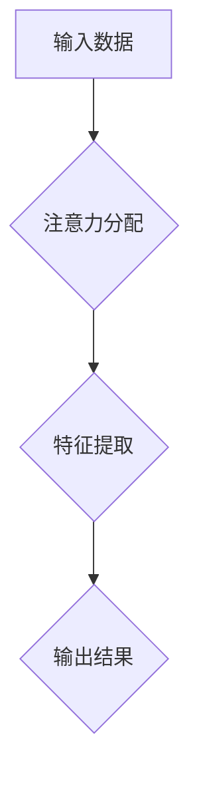

> 注意力训练，认知能力，专注力，大脑，神经科学，机器学习，深度学习，注意力机制

## 1. 背景介绍

在当今信息爆炸的时代，我们每天都被各种信息轰炸，注意力被不断分散。如何集中注意力，提升认知能力，成为了一个越来越重要的课题。

注意力是认知功能的基础，它决定了我们能够有效地处理信息的能力。注意力训练可以帮助我们增强专注力，提高记忆力、学习能力和解决问题的能力。

近年来，神经科学和人工智能领域取得了长足的进步，为注意力训练提供了新的理论基础和技术手段。

## 2. 核心概念与联系

### 2.1 注意力机制

注意力机制是人工智能领域近年来发展迅速的理论和技术，它模拟了人类大脑对重要信息进行选择性关注的机制。

注意力机制的核心思想是，在处理信息时，我们并不总是关注所有信息，而是会根据任务需求和环境变化，选择性地关注一部分信息，并对这些信息进行深入处理。

**Mermaid 流程图:**



### 2.2 认知能力提升

认知能力是指人类大脑处理信息、解决问题、学习和创造的能力。注意力是认知能力的重要组成部分，它直接影响着我们的学习、记忆、决策和创造力等方面。

注意力训练可以帮助我们增强认知能力，提高学习效率、工作效率和生活质量。

## 3. 核心算法原理 & 具体操作步骤

### 3.1 算法原理概述

注意力机制的算法原理主要包括以下几个方面：

* **注意力权重:**  注意力机制会为每个输入元素分配一个注意力权重，权重越高，表示该元素对当前任务的关注度越高。
* **注意力计算:**  注意力权重通常通过一个注意力函数计算得到，该函数会根据输入元素之间的关系和任务需求来确定权重。
* **加权求和:**  注意力权重与输入元素相乘后，再进行求和，得到最终的输出结果。

### 3.2 算法步骤详解

1. **输入数据:**  将需要处理的信息作为输入数据。
2. **特征提取:**  对输入数据进行特征提取，提取出与任务相关的特征。
3. **注意力分配:**  根据特征信息和任务需求，计算每个输入元素的注意力权重。
4. **加权求和:**  将注意力权重与特征信息相乘后，进行求和，得到最终的输出结果。

### 3.3 算法优缺点

**优点:**

* 可以有效地提高模型的处理效率，减少计算量。
* 可以模拟人类大脑对重要信息进行选择性关注的机制。
* 在各种自然语言处理任务中取得了优异的性能。

**缺点:**

* 训练复杂度较高，需要大量的训练数据。
* 对于长序列数据，注意力机制的计算量仍然较大。

### 3.4 算法应用领域

注意力机制在人工智能领域有着广泛的应用，例如：

* **自然语言处理:**  机器翻译、文本摘要、问答系统等。
* **计算机视觉:**  图像识别、目标检测、图像分割等。
* **语音识别:**  语音转文本、语音合成等。

## 4. 数学模型和公式 & 详细讲解 & 举例说明

### 4.1 数学模型构建

注意力机制的数学模型通常由以下几个部分组成:

* **查询 (Query):**  用于表示当前任务的需求或关注点。
* **键 (Key):**  用于表示输入元素的特征信息。
* **值 (Value):**  用于表示输入元素的具体内容。

### 4.2 公式推导过程

注意力权重通常通过以下公式计算得到:

$$
\text{Attention}(Q, K, V) = \text{softmax}\left(\frac{Q K^T}{\sqrt{d_k}}\right) V
$$

其中:

* $Q$ 是查询向量。
* $K$ 是键向量。
* $V$ 是值向量。
* $d_k$ 是键向量的维度。
* $\text{softmax}$ 是一个归一化函数，用于将注意力权重归一化到 [0, 1] 之间。

### 4.3 案例分析与讲解

假设我们有一个句子 "我爱学习编程"，我们想要计算每个单词的注意力权重。

* $Q$ 可以表示为 "学习" 这个单词的向量表示。
* $K$ 可以表示为每个单词的向量表示。
* $V$ 可以表示为每个单词的词义向量。

通过计算 $Q K^T$，我们可以得到每个单词与 "学习" 的相关性得分。然后通过 $\text{softmax}$ 函数，将这些得分归一化到 [0, 1] 之间，得到每个单词的注意力权重。

## 5. 项目实践：代码实例和详细解释说明

### 5.1 开发环境搭建

* Python 3.x
* TensorFlow 或 PyTorch

### 5.2 源代码详细实现

```python
import tensorflow as tf

# 定义注意力机制层
class AttentionLayer(tf.keras.layers.Layer):
    def __init__(self, units):
        super(AttentionLayer, self).__init__()
        self.Wq = tf.keras.layers.Dense(units)
        self.Wk = tf.keras.layers.Dense(units)
        self.Wv = tf.keras.layers.Dense(units)
        self.fc = tf.keras.layers.Dense(units)

    def call(self, inputs):
        q = self.Wq(inputs)
        k = self.Wk(inputs)
        v = self.Wv(inputs)
        attention_scores = tf.matmul(q, k, transpose_b=True) / tf.math.sqrt(tf.cast(tf.shape(k)[-1], tf.float32))
        attention_weights = tf.nn.softmax(attention_scores, axis=-1)
        context_vector = tf.matmul(attention_weights, v)
        output = self.fc(context_vector)
        return output

# 实例化注意力机制层
attention_layer = AttentionLayer(units=128)

# 输入数据
inputs = tf.random.normal(shape=(1, 10, 512))

# 通过注意力机制层进行处理
outputs = attention_layer(inputs)

# 打印输出结果
print(outputs.shape)
```

### 5.3 代码解读与分析

* 我们定义了一个 `AttentionLayer` 类，实现了注意力机制层。
* 该层包含三个稠密层 (`Wq`, `Wk`, `Wv`) 用于计算查询、键和值的向量表示。
* 然后，我们计算注意力权重，并使用这些权重对值向量进行加权求和，得到上下文向量。
* 最后，我们使用一个稠密层 (`fc`) 将上下文向量映射到输出空间。

### 5.4 运行结果展示

运行上述代码，会输出一个形状为 `(1, 10, 128)` 的张量，表示经过注意力机制处理后的输出结果。

## 6. 实际应用场景

### 6.1  机器翻译

注意力机制可以帮助机器翻译模型更好地理解句子结构和语义关系，从而提高翻译质量。

### 6.2 文本摘要

注意力机制可以帮助文本摘要模型识别重要信息，并生成更准确、更简洁的摘要。

### 6.3 问答系统

注意力机制可以帮助问答系统更好地理解问题和上下文，从而给出更准确的答案。

### 6.4 未来应用展望

注意力机制在人工智能领域有着广阔的应用前景，未来可能会应用于更多领域，例如：

* **医疗诊断:**  帮助医生更好地理解患者的病史和症状，提高诊断准确率。
* **金融风险管理:**  帮助金融机构识别潜在的风险，降低风险损失。
* **自动驾驶:**  帮助自动驾驶汽车更好地理解周围环境，提高安全性。

## 7. 工具和资源推荐

### 7.1 学习资源推荐

* **书籍:**
    * 《深度学习》
    * 《注意力机制》
* **在线课程:**
    * Coursera: 深度学习
    * Udacity: 自然语言处理

### 7.2 开发工具推荐

* **TensorFlow:**  开源深度学习框架
* **PyTorch:**  开源深度学习框架
* **Hugging Face:**  自然语言处理模型库

### 7.3 相关论文推荐

* 《Attention Is All You Need》
* 《BERT: Pre-training of Deep Bidirectional Transformers for Language Understanding》

## 8. 总结：未来发展趋势与挑战

### 8.1 研究成果总结

注意力机制在人工智能领域取得了显著的成果，在各种自然语言处理任务中取得了优异的性能。

### 8.2 未来发展趋势

未来，注意力机制的研究将朝着以下几个方向发展:

* **更有效的注意力机制:**  设计更有效的注意力机制，提高计算效率和性能。
* **多模态注意力机制:**  将注意力机制应用于多模态数据，例如文本、图像、音频等。
* **可解释性注意力机制:**  提高注意力机制的可解释性，帮助人们更好地理解模型的决策过程。

### 8.3 面临的挑战

注意力机制也面临着一些挑战:

* **计算复杂度:**  对于长序列数据，注意力机制的计算量仍然较大。
* **参数量:**  一些注意力机制模型参数量较大，需要大量的训练数据。
* **可解释性:**  注意力机制的决策过程相对复杂，难以解释。

### 8.4 研究展望

未来，我们将继续研究注意力机制，探索其在人工智能领域的更多应用，并努力解决其面临的挑战。

## 9. 附录：常见问题与解答

### 9.1 什么是注意力机制？

注意力机制是一种模拟人类大脑对重要信息进行选择性关注的机制。

### 9.2 注意力机制的应用场景有哪些？

注意力机制在人工智能领域有着广泛的应用，例如：机器翻译、文本摘要、问答系统等。

### 9.3 注意力机制的优缺点是什么？

**优点:**

* 可以有效地提高模型的处理效率，减少计算量。
* 可以模拟人类大脑对重要信息进行选择性关注的机制。
* 在各种自然语言处理任务中取得了优异的性能。

**缺点:**

* 训练复杂度较高，需要大量的训练数据。
* 对于长序列数据，注意力机制的计算量仍然较大。


作者：禅与计算机程序设计艺术 / Zen and the Art of Computer Programming 
<end_of_turn>