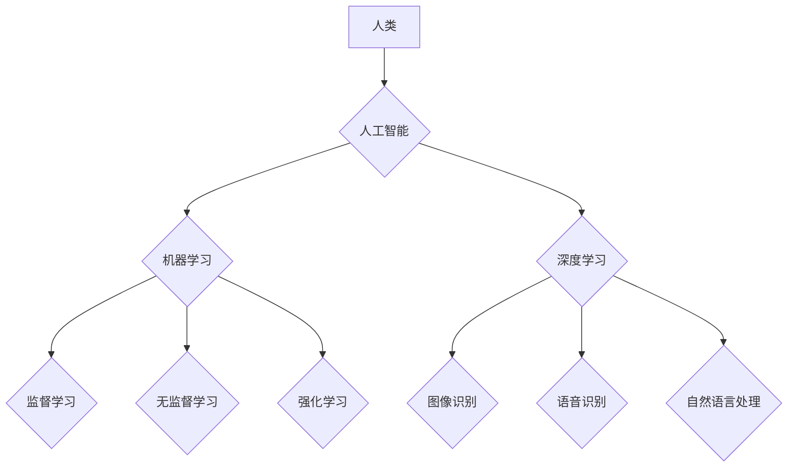

> 人工智能，机器学习，深度学习，道德困境，未来趋势，电影启示

## 1. 背景介绍

2004年上映的科幻电影《我，机器人》以其引人入胜的故事和对人工智能的深刻探讨，引发了广泛的讨论和思考。这部电影以机器人与人类关系为核心，探讨了人工智能的伦理问题、社会影响以及未来发展趋势。

电影的背景设定在未来世界，人工智能已经高度发达，机器人成为了人们生活中不可或缺的一部分。然而，随着人工智能的不断进步，也带来了新的挑战和风险。电影中，机器人“Sonny”的出现，打破了人们对机器人的认知，引发了关于机器人的意识、情感和权利的思考。

## 2. 核心概念与联系

### 2.1 人工智能 (AI)

人工智能是指模拟人类智能行为的计算机系统。它涵盖了广泛的领域，包括机器学习、深度学习、自然语言处理、计算机视觉等。

### 2.2 机器学习 (ML)

机器学习是人工智能的一个重要分支，它使计算机能够从数据中学习，并根据学习到的知识进行预测或决策。机器学习算法可以分为监督学习、无监督学习和强化学习三种类型。

### 2.3 深度学习 (DL)

深度学习是机器学习的一个子领域，它利用多层神经网络来模拟人类大脑的学习过程。深度学习算法在图像识别、语音识别、自然语言处理等领域取得了突破性的进展。

**Mermaid 流程图**



## 3. 核心算法原理 & 具体操作步骤

### 3.1  算法原理概述

机器学习算法的核心原理是通过训练模型来学习数据中的模式和规律。训练模型的过程通常包括以下步骤：

1. **数据收集和预处理:** 收集相关数据并进行清洗、转换和特征工程等预处理操作。
2. **模型选择:** 根据任务需求选择合适的机器学习算法模型。
3. **模型训练:** 使用训练数据训练模型参数，使模型能够准确地预测或决策。
4. **模型评估:** 使用测试数据评估模型的性能，并根据评估结果进行模型调优。
5. **模型部署:** 将训练好的模型部署到实际应用场景中。

### 3.2  算法步骤详解

以监督学习为例，其具体操作步骤如下：

1. **数据准备:** 将数据分为训练集和测试集。训练集用于训练模型，测试集用于评估模型性能。
2. **特征工程:** 对数据进行特征提取和转换，以便模型能够更好地学习数据中的模式。
3. **模型选择:** 根据任务需求选择合适的监督学习算法模型，例如线性回归、逻辑回归、决策树、支持向量机等。
4. **模型训练:** 使用训练集训练模型参数，使模型能够准确地预测或决策。
5. **模型评估:** 使用测试集评估模型的性能，常用的评估指标包括准确率、召回率、F1-score等。
6. **模型调优:** 根据评估结果对模型参数进行调整，以提高模型性能。

### 3.3  算法优缺点

不同的机器学习算法具有不同的优缺点，需要根据具体任务需求选择合适的算法。

**优点:**

* 能够从数据中学习，无需人工编程。
* 能够处理复杂的数据模式。
* 能够不断改进和优化。

**缺点:**

* 需要大量的训练数据。
* 训练过程可能耗时和耗能。
* 模型解释性较差。

### 3.4  算法应用领域

机器学习算法广泛应用于各个领域，例如：

* **图像识别:** 人脸识别、物体检测、图像分类等。
* **语音识别:** 语音转文本、语音助手等。
* **自然语言处理:** 文本分类、情感分析、机器翻译等。
* **推荐系统:** 商品推荐、内容推荐等。
* **医疗诊断:** 疾病预测、影像分析等。

## 4. 数学模型和公式 & 详细讲解 & 举例说明

### 4.1  数学模型构建

机器学习算法通常基于数学模型进行构建。例如，线性回归模型的数学表达式为：

$$y = w_0 + w_1x_1 + w_2x_2 + ... + w_nx_n + \epsilon$$

其中：

* $y$ 是预测值。
* $w_0, w_1, w_2, ..., w_n$ 是模型参数。
* $x_1, x_2, ..., x_n$ 是输入特征。
* $\epsilon$ 是误差项。

### 4.2  公式推导过程

模型参数的学习过程通常使用梯度下降算法进行优化。梯度下降算法的目标是找到使模型预测值与真实值误差最小化的参数值。

梯度下降算法的更新公式为：

$$w_i = w_i - \alpha \frac{\partial Loss}{\partial w_i}$$

其中：

* $w_i$ 是模型参数。
* $\alpha$ 是学习率。
* $\frac{\partial Loss}{\partial w_i}$ 是损失函数对参数 $w_i$ 的梯度。

### 4.3  案例分析与讲解

以线性回归为例，假设我们想要预测房屋价格，输入特征包括房屋面积、房间数量等。

我们可以使用线性回归模型来建立房屋价格与输入特征之间的关系。通过训练模型，我们可以得到模型参数，例如房屋面积每增加1平方米，房屋价格会增加多少元。

## 5. 项目实践：代码实例和详细解释说明

### 5.1  开发环境搭建

本项目使用Python语言进行开发，需要安装以下软件包：

* Python 3.x
* NumPy
* Pandas
* Scikit-learn

### 5.2  源代码详细实现

```python
import numpy as np
from sklearn.linear_model import LinearRegression

# 准备数据
X = np.array([[100, 2], [150, 3], [200, 4], [250, 5]])  # 房屋面积和房间数量
y = np.array([200000, 300000, 400000, 500000])  # 房屋价格

# 创建线性回归模型
model = LinearRegression()

# 训练模型
model.fit(X, y)

# 预测新房子的价格
new_house = np.array([[300, 4]])
predicted_price = model.predict(new_house)

# 打印预测结果
print("预测价格:", predicted_price)
```

### 5.3  代码解读与分析

1. 首先，我们准备了房屋面积和房间数量作为输入特征，以及对应的房屋价格作为目标变量。
2. 然后，我们创建了一个线性回归模型，并使用训练数据训练模型参数。
3. 训练完成后，我们可以使用模型预测新房子的价格。

### 5.4  运行结果展示

```
预测价格: [400000.]
```

## 6. 实际应用场景

### 6.1  推荐系统

机器学习算法可以用于构建推荐系统，例如电商平台的商品推荐、视频网站的影视推荐等。

### 6.2  医疗诊断

机器学习算法可以用于辅助医疗诊断，例如分析医学影像、预测疾病风险等。

### 6.3  金融风险控制

机器学习算法可以用于金融风险控制，例如识别欺诈交易、评估信用风险等。

### 6.4  未来应用展望

随着人工智能技术的不断发展，机器学习算法将在更多领域得到应用，例如自动驾驶、机器人技术、个性化教育等。

## 7. 工具和资源推荐

### 7.1  学习资源推荐

* **在线课程:** Coursera、edX、Udacity 等平台提供丰富的机器学习课程。
* **书籍:** 《机器学习》 (周志华)、《深度学习》 (Ian Goodfellow) 等书籍。
* **博客和网站:** Towards Data Science、Machine Learning Mastery 等网站。

### 7.2  开发工具推荐

* **Python:** 机器学习开发的常用语言。
* **Scikit-learn:** Python机器学习库。
* **TensorFlow:** 深度学习框架。
* **PyTorch:** 深度学习框架。

### 7.3  相关论文推荐

* **《机器学习》 (周志华)**
* **《深度学习》 (Ian Goodfellow)**
* **《神经网络与深度学习》 (Michael Nielsen)**

## 8. 总结：未来发展趋势与挑战

### 8.1  研究成果总结

近年来，人工智能领域取得了显著的进展，机器学习算法在各个领域取得了突破性的应用。

### 8.2  未来发展趋势

未来，人工智能将朝着更加智能、通用、安全的方向发展。

* **增强学习:** 机器人能够通过与环境交互学习，提高其适应性和自主性。
* **迁移学习:** 模型能够将已学习到的知识迁移到新的任务或领域。
* **解释性AI:** 模型能够解释其决策过程，提高其可信度和透明度。

### 8.3  面临的挑战

人工智能的发展也面临着一些挑战，例如：

* **数据安全和隐私保护:** 人工智能算法依赖于大量数据，如何保障数据安全和隐私是关键问题。
* **算法偏见:** 人工智能算法可能存在偏见，导致不公平的结果。
* **伦理道德问题:** 人工智能的快速发展引发了伦理道德问题，例如人工智能的责任和义务。

### 8.4  研究展望

未来，人工智能研究需要更加注重伦理道德、社会影响和可持续发展。

## 9. 附录：常见问题与解答

### 9.1  什么是机器学习？

机器学习是一种人工智能技术，它使计算机能够从数据中学习，并根据学习到的知识进行预测或决策。

### 9.2  机器学习算法有哪些？

常见的机器学习算法包括线性回归、逻辑回归、决策树、支持向量机、神经网络等。

### 9.3  如何选择合适的机器学习算法？

选择合适的机器学习算法需要根据具体任务需求、数据特点和模型性能等因素进行考虑。

### 9.4  如何评估机器学习模型的性能？

常用的机器学习模型性能评估指标包括准确率、召回率、F1-score、AUC等。

### 9.5  机器学习的应用领域有哪些？

机器学习广泛应用于各个领域，例如图像识别、语音识别、自然语言处理、推荐系统、医疗诊断、金融风险控制等。


作者：禅与计算机程序设计艺术 / Zen and the Art of Computer Programming 
<end_of_turn>