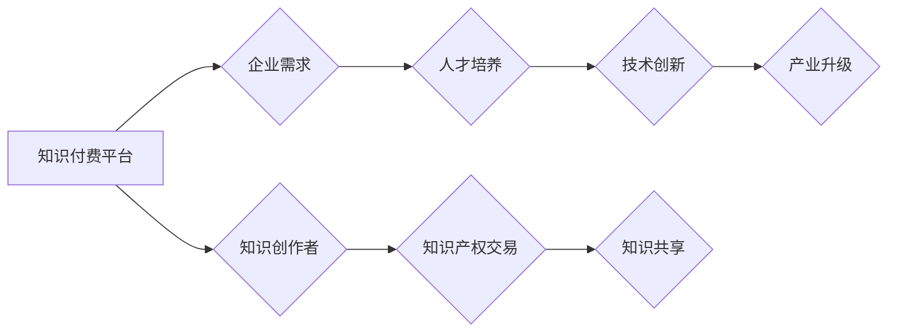

> 知识付费、产业链、融合发展、技术创新、人才培养、市场需求

## 1. 背景介绍

知识经济时代，知识已成为重要的生产要素，知识付费作为一种新的商业模式，在近年来迅速发展。它打破了传统教育模式的局限，为个人提供更灵活、更个性化的学习机会，也为企业提供了更有效的人才培养和技术创新途径。然而，当前知识付费市场仍存在一些问题，例如内容质量参差不齐、用户粘性不足、产业链条不完善等。

为了推动知识付费行业健康发展，加强与产业链上下游的融合发展至关重要。

## 2. 核心概念与联系

**2.1 知识付费**

知识付费是指以知识、技能、经验等为核心内容，通过线上线下等多种形式，向用户提供付费学习服务。

**2.2 产业链**

产业链是指一个产业从原材料采购到最终产品销售的全过程，包括上游、中游和下游环节。

**2.3 融合发展**

融合发展是指不同产业、不同领域、不同环节相互渗透、相互融合，形成新的产业生态系统。

**2.4 融合发展模式**

知识付费与产业链的融合发展可以采取多种模式，例如：

* **平台与企业合作：**知识付费平台与企业合作，为企业员工提供定制化的培训课程，帮助企业提升员工技能水平和核心竞争力。
* **教育机构与产业链合作：**教育机构与产业链企业合作，开发与产业需求相匹配的专业课程，培养符合市场需求的人才。
* **知识产权交易平台：**知识产权交易平台为知识创作者和企业提供知识交易服务，促进知识的流动和共享。

**Mermaid 流程图**



## 3. 核心算法原理 & 具体操作步骤

**3.1 算法原理概述**

知识付费与产业链融合发展的核心算法原理是基于数据分析和机器学习。通过对用户学习行为、市场需求和产业趋势等数据的分析，可以精准匹配用户需求和产业需求，从而实现知识付费内容的个性化定制和产业链的协同发展。

**3.2 算法步骤详解**

1. **数据采集:** 收集用户学习行为数据、市场需求数据、产业趋势数据等。
2. **数据清洗:** 对收集到的数据进行清洗和预处理，去除噪声和异常值。
3. **特征提取:** 从数据中提取用户兴趣、技能水平、学习偏好等特征，以及产业需求、技术趋势、市场机会等特征。
4. **模型训练:** 利用机器学习算法，对提取的特征进行训练，建立知识付费内容推荐模型和产业链匹配模型。
5. **模型预测:** 将新用户和新产业需求输入模型，预测用户对哪些知识付费内容感兴趣，以及哪些产业链企业需要哪些人才和技术。
6. **结果输出:** 将预测结果输出，为用户提供个性化学习推荐，为企业提供人才和技术匹配服务。

**3.3 算法优缺点**

* **优点:**

    * 精准匹配用户需求和产业需求。
    * 个性化定制知识付费内容。
    * 促进产业链协同发展。

* **缺点:**

    * 数据依赖性强，需要大量高质量数据支持。
    * 模型训练复杂，需要专业的技术人员。
    * 算法本身存在一定的局限性，无法完全满足所有用户的需求。

**3.4 算法应用领域**

* **在线教育平台:** 为用户提供个性化学习推荐，提高用户学习效率和满意度。
* **企业培训平台:** 为企业员工提供定制化的培训课程，提升员工技能水平和核心竞争力。
* **人才招聘平台:** 为企业提供精准的人才匹配服务，帮助企业找到符合需求的优秀人才。
* **技术创新平台:** 为企业提供技术趋势和市场机会分析，促进企业技术创新和产业升级。

## 4. 数学模型和公式 & 详细讲解 & 举例说明

**4.1 数学模型构建**

知识付费与产业链融合发展的数学模型可以基于用户行为分析、市场需求预测和产业链网络分析等方面构建。

**4.2 公式推导过程**

例如，可以利用用户行为数据构建用户兴趣模型，并根据用户兴趣和市场需求预测用户对哪些知识付费内容感兴趣。

**用户兴趣模型:**

$$
P(u, c) = \frac{e^{w_u \cdot f_u + w_c \cdot f_c}}{\sum_{c'} e^{w_u \cdot f_u + w_{c'} \cdot f_{c'}}}
$$

其中:

* $P(u, c)$ 表示用户 $u$ 对内容 $c$ 的兴趣概率。
* $w_u$ 和 $w_c$ 分别为用户 $u$ 和内容 $c$ 的权重。
* $f_u$ 和 $f_c$ 分别为用户 $u$ 和内容 $c$ 的特征向量。

**4.3 案例分析与讲解**

假设有一个在线教育平台，平台收集了用户学习行为数据，包括用户学习过的课程、用户评分、用户评论等。

利用用户行为数据，可以构建用户兴趣模型，并预测用户对哪些课程感兴趣。例如，如果用户学习过很多编程课程，并且对编程课程评分较高，那么平台可以预测用户对高级编程课程感兴趣。

## 5. 项目实践：代码实例和详细解释说明

**5.1 开发环境搭建**

* 操作系统: Ubuntu 20.04 LTS
* Python 版本: 3.8.10
* 必要的库: pandas, numpy, scikit-learn, matplotlib

**5.2 源代码详细实现**

```python
import pandas as pd
from sklearn.feature_extraction.text import TfidfVectorizer
from sklearn.metrics.pairwise import cosine_similarity

# 加载用户学习行为数据
data = pd.read_csv('user_behavior.csv')

# 提取用户学习过的课程名称
courses = data['course_name'].values

# 使用 TF-IDF 向量化课程名称
vectorizer = TfidfVectorizer()
course_vectors = vectorizer.fit_transform(courses)

# 计算课程之间的余弦相似度
similarity_matrix = cosine_similarity(course_vectors)

# 获取用户学习过的课程
user_courses = data[data['user_id'] == 1]['course_name'].values

# 计算用户与所有课程的相似度
user_similarity = cosine_similarity(vectorizer.transform(user_courses), course_vectors)

# 获取用户感兴趣的课程
top_k_courses = similarity_matrix[user_courses].argsort()[-5:][::-1]

# 打印用户感兴趣的课程名称
print(vectorizer.inverse_transform(course_vectors[top_k_courses]))
```

**5.3 代码解读与分析**

* 该代码首先加载用户学习行为数据，并提取用户学习过的课程名称。
* 然后，使用 TF-IDF 向量化课程名称，将课程名称转换为数值向量。
* 接着，计算课程之间的余弦相似度，表示课程之间的语义相似度。
* 然后，计算用户与所有课程的相似度，并获取用户感兴趣的课程。
* 最后，打印用户感兴趣的课程名称。

**5.4 运行结果展示**

运行该代码后，可以得到用户感兴趣的课程名称列表。例如，如果用户学习过很多编程课程，那么列表中可能包含高级编程课程、数据结构算法课程等。

## 6. 实际应用场景

**6.1 在线教育平台**

在线教育平台可以利用知识付费与产业链融合发展模式，为用户提供个性化学习推荐，并与企业合作，开发符合企业需求的培训课程。

**6.2 企业培训平台**

企业培训平台可以利用知识付费与产业链融合发展模式，为企业员工提供定制化的培训课程，提升员工技能水平和核心竞争力。

**6.3 人才招聘平台**

人才招聘平台可以利用知识付费与产业链融合发展模式，为企业提供精准的人才匹配服务，帮助企业找到符合需求的优秀人才。

**6.4 技术创新平台**

技术创新平台可以利用知识付费与产业链融合发展模式，为企业提供技术趋势和市场机会分析，促进企业技术创新和产业升级。

**6.5 未来应用展望**

随着人工智能、大数据等技术的不断发展，知识付费与产业链融合发展的应用场景将更加广泛。例如，未来可能出现基于虚拟现实、增强现实等技术的沉浸式学习体验，以及更加精准的个性化学习推荐和人才匹配服务。

## 7. 工具和资源推荐

**7.1 学习资源推荐**

* **在线课程:** Coursera, edX, Udemy
* **书籍:** 《知识经济》、《数字经济》、《人工智能》
* **博客:** 36氪, 腾讯科技, 网易科技

**7.2 开发工具推荐**

* **Python:** 语言环境
* **Pandas:** 数据分析库
* **Scikit-learn:** 机器学习库
* **TensorFlow:** 深度学习框架

**7.3 相关论文推荐**

* **The Economics of Knowledge Sharing**
* **The Impact of Online Learning on Higher Education**
* **The Future of Work: How Artificial Intelligence Will Transform the Workplace**

## 8. 总结：未来发展趋势与挑战

**8.1 研究成果总结**

知识付费与产业链融合发展是知识经济时代的重要趋势，它可以促进知识的流动和共享，推动产业链协同发展，提升人才培养和技术创新的效率。

**8.2 未来发展趋势**

未来，知识付费与产业链融合发展将朝着以下几个方向发展：

* **更加个性化:** 利用人工智能技术，为用户提供更加个性化的学习推荐和人才匹配服务。
* **更加智能化:** 利用大数据分析和机器学习算法，预测用户需求和产业趋势，提供更加精准的知识付费内容和人才服务。
* **更加融合化:** 与其他产业链更加紧密地融合，形成更加完整的产业生态系统。

**8.3 面临的挑战**

知识付费与产业链融合发展也面临一些挑战：

* **数据安全和隐私保护:** 需要加强数据安全和隐私保护措施，确保用户数据安全。
* **知识产权保护:** 需要加强知识产权保护机制，防止知识盗窃和侵权行为。
* **人才培养:** 需要培养更多具备知识付费和产业链融合发展能力的人才。

**8.4 研究展望**

未来，我们将继续深入研究知识付费与产业链融合发展，探索更加有效的融合发展模式，推动知识经济的健康发展。

## 9. 附录：常见问题与解答

**9.1 如何选择合适的知识付费平台？**

选择知识付费平台时，可以考虑以下因素：

* 平台的口碑和信誉
* 平台提供的课程质量和内容丰富度
* 平台的学习体验和用户服务

**9.2 如何提高知识付费的学习效果？**

提高知识付费的学习效果，可以采取以下措施：

* 制定学习计划，并坚持执行
* 积极参与课程互动，与老师和同学交流
* 将所学知识应用到实际工作中

**9.3 如何参与知识付费与产业链融合发展？**

参与知识付费与产业链融合发展，可以采取以下方式：

* 成为知识付费平台的创作者，提供优质的知识付费内容
* 与知识付费平台合作，开发符合企业需求的培训课程
* 参与知识付费与产业链融合发展的相关研究和实践


作者：禅与计算机程序设计艺术 / Zen and the Art of Computer Programming 
<end_of_turn>