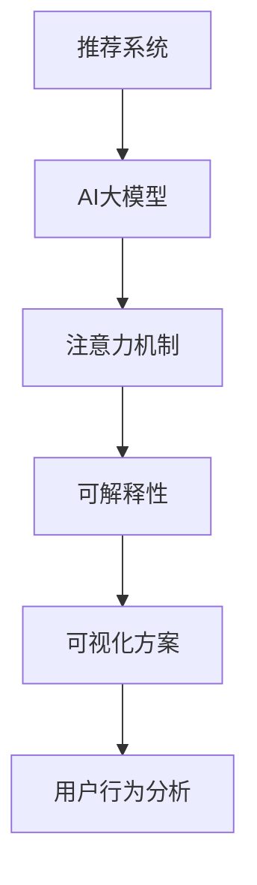

                 

# 推荐系统的可解释性：AI大模型的注意力可视化方案

> 关键词：推荐系统, 可解释性, AI大模型, 注意力机制, 可视化方案, 用户行为分析

## 1. 背景介绍

推荐系统作为人工智能领域的重要应用，广泛应用于电商、社交、新闻、音乐等多个领域，帮助用户发现感兴趣的内容。然而，推荐系统往往被视为“黑盒”系统，其决策过程难以解释，用户和业务方难以理解和信任其推荐结果。这种可解释性的缺失，限制了推荐系统的应用范围，难以充分发挥其在决策支持、用户管理等业务中的潜力。

近年来，随着深度学习技术的快速发展，基于AI大模型的推荐系统，凭借其强大的学习能力和泛化性能，成为了推荐技术的重要方向。但与此同时，大模型推荐系统在解释性和可理解性方面也面临着新的挑战。如何将大模型的决策过程可视化，帮助用户和业务方理解和信任推荐结果，成为了当前研究的重要课题。

本文将介绍一种基于注意力机制的AI大模型推荐系统可视化方案，通过解码大模型在推荐过程中的注意力分布，帮助用户和业务方理解推荐结果背后的原理和逻辑，提升推荐系统的可解释性和可信度。

## 2. 核心概念与联系

### 2.1 核心概念概述

为更好地理解AI大模型在推荐系统中的应用及其可视化方法，本节将介绍几个密切相关的核心概念：

- 推荐系统(Recommender System)：通过学习用户行为和物品特征，为用户推荐可能感兴趣的内容。包括协同过滤、内容推荐、混合推荐等诸多流派。

- AI大模型(AI Large Model)：以Transformer为代表的，具有大规模参数和强大学习能力的深度神经网络模型。通过在大规模数据上预训练，学习到通用的语言或图像表示，具备强大的特征提取和建模能力。

- 注意力机制(Attention Mechanism)：一种模型机制，通过学习输入数据间的关联性，动态调整模型对不同输入的关注度，提升模型的表达能力和泛化能力。在NLP、图像处理等领域广泛应用。

- 可解释性(Explainability)：指模型输出的结果和决策过程可以为人所理解。可解释性对于用户信任和业务决策至关重要。

- 可视化(Visualization)：通过图形、图表等方式，将复杂的数据和计算过程可视化，便于用户理解和分析。

- 用户行为分析(User Behavior Analysis)：通过分析用户的行为数据，理解用户的兴趣和偏好，为其推荐个性化内容。

这些核心概念之间的逻辑关系可以通过以下Mermaid流程图来展示：



这个流程图展示了大模型推荐系统的工作原理和关键技术：

1. 推荐系统通过AI大模型进行内容推荐。
2. 大模型在推荐过程中利用注意力机制，动态调整对不同内容的关注度。
3. 可解释性技术将注意力分布可视化，帮助用户理解推荐结果的依据。
4. 用户行为分析通过可解释性可视化结果，进一步优化推荐模型。

这些概念共同构成了大模型推荐系统的技术框架，使其能够更有效地为用户推荐个性化内容，同时提升系统的透明度和可信度。

## 3. 核心算法原理 & 具体操作步骤

### 3.1 算法原理概述

本节将介绍基于注意力机制的AI大模型推荐系统可视化方案的核心算法原理，包括推荐模型的基本结构和注意力机制的具体实现。

### 3.2 算法步骤详解

以下是实现AI大模型推荐系统可视化的详细步骤：

**Step 1: 准备数据集和预训练模型**
- 收集推荐系统所需的用户行为数据，如点击、浏览、评分等行为数据。
- 选择合适的预训练大模型作为初始化参数，如BERT、GPT等。

**Step 2: 添加任务适配层**
- 根据任务需求，设计合适的输出层和损失函数。例如，对于点击率预测任务，通常会使用二分类交叉熵损失函数。
- 在预训练模型的基础上，添加任务适配层，对模型进行微调。

**Step 3: 实现注意力机制**
- 在模型中引入注意力机制，计算每个输入对输出结果的贡献。
- 通过softmax函数将注意力得分归一化，得到每个输入的注意力权重。

**Step 4: 可视化注意力分布**
- 将注意力权重进行可视化，可以使用热力图、柱状图等方式展示。
- 对可视化结果进行分析和解释，理解用户行为背后的潜在原因。

**Step 5: 持续优化模型**
- 根据可视化结果，对模型进行优化调整，如调整输入特征、增加正则化、调整超参数等。
- 重新训练模型，评估推荐效果，进入下一轮迭代。

### 3.3 算法优缺点

基于注意力机制的AI大模型推荐系统可视化方案具有以下优点：

1. 高精度。AI大模型在推荐过程中利用了其强大的特征提取能力和泛化性能，能够学习到复杂的用户行为特征，推荐效果显著提升。
2. 鲁棒性强。大模型通过预训练学习到了大量的领域知识，能够更好地适应新用户和新场景。
3. 可解释性高。通过可视化注意力分布，用户和业务方能够直观理解推荐结果背后的原因，提高系统的信任度。

同时，该方法也存在以下缺点：

1. 数据需求高。需要大量的用户行为数据和标注数据，才能训练出高质量的推荐模型。
2. 计算资源消耗大。AI大模型在推理过程中，计算资源消耗较大，难以实时处理大量请求。
3. 可解释性仍有限。尽管可视化注意力分布有助于理解推荐结果，但仍存在一定的黑盒问题，难以完全解释模型的决策过程。

尽管存在这些局限性，但总体而言，基于注意力机制的AI大模型推荐系统可视化方案，为推荐系统的可解释性研究提供了新的思路和方法，具有重要的应用价值。

### 3.4 算法应用领域

基于注意力机制的AI大模型推荐系统可视化方案，在多个领域都有广泛的应用前景：

1. 电商推荐：通过可视化用户点击、浏览记录的注意力分布，帮助电商平台理解用户兴趣，优化商品推荐策略。
2. 新闻推荐：将用户浏览、分享行为可视化，理解用户阅读偏好，改进新闻内容推荐。
3. 视频推荐：通过可视化用户观看、点赞行为，分析用户偏好，提升视频推荐效果。
4. 社交推荐：将用户互动行为可视化，了解用户社交关系和兴趣，推荐更多相关用户和内容。
5. 金融推荐：通过可视化用户交易记录的注意力分布，理解用户风险偏好，推荐合适金融产品。

此外，在内容创作、广告投放、医疗推荐等诸多领域，该可视化方案同样具备广泛的应用潜力。相信随着大模型推荐技术的不断成熟，可视化方案将帮助推荐系统更好地理解用户行为，提升推荐效果，实现更精准的个性化服务。

## 4. 数学模型和公式 & 详细讲解 & 举例说明

### 4.1 数学模型构建

本节将从数学模型的角度，详细讲解基于注意力机制的AI大模型推荐系统的构建过程。

记推荐系统的输入为 $x$，输出为 $y$，其中 $x$ 为用户的特征向量，$y$ 为推荐的物品特征向量。假设推荐系统使用AI大模型 $M$ 进行训练，其中 $M$ 的参数为 $\theta$。

推荐模型的目标是通过输入特征 $x$ 预测输出结果 $y$，定义模型的预测函数为 $f(x; \theta)$，损失函数为 $\mathcal{L}(y, f(x; \theta))$。在训练过程中，通过优化目标函数最小化损失函数，更新模型参数 $\theta$。

**注意力机制的数学表达**：
- 定义注意力函数 $\alpha(x; \theta)$，计算输入 $x$ 对模型输出的贡献。
- 通过softmax函数将注意力得分 $\alpha(x; \theta)$ 归一化，得到每个输入的注意力权重 $\alpha'(x; \theta)$。
- 最终输出结果 $y$ 可以表示为输入特征 $x$ 和注意力权重的加权和，即 $y = \sum_{i} \alpha'(x_i; \theta) x_i$。

### 4.2 公式推导过程

以下是注意力机制的具体公式推导过程：

1. **注意力函数**：

$$
\alpha(x; \theta) = \text{softmax}([W_q x]^T K)
$$

其中，$W_q$ 为查询矩阵，$K$ 为键矩阵，softmax函数将注意力得分归一化。

2. **注意力权重**：

$$
\alpha'(x; \theta) = \text{softmax}([W_k x]^T K)
$$

其中，$W_k$ 为键值矩阵，$K$ 为键矩阵，softmax函数将注意力得分归一化。

3. **输出结果**：

$$
y = \sum_{i} \alpha'(x_i; \theta) x_i
$$

其中，$x_i$ 为输入特征向量。

### 4.3 案例分析与讲解

考虑一个基于大模型的电商推荐系统，用户浏览、点击不同商品时，系统会生成相应的注意力分布。我们以一个简单的用户行为分析为例，展示如何通过可视化注意力分布，理解用户的兴趣偏好。

假设系统收集到用户浏览不同商品 $x_1, x_2, x_3$ 的行为数据，并分别用向量表示为 $x_1, x_2, x_3$。系统使用BERT模型作为预训练大模型，模型在商品推荐任务上进行微调，输出用户对不同商品推荐的概率 $y_1, y_2, y_3$。

根据注意力机制的公式推导，系统计算用户对不同商品的注意力权重 $\alpha'(x_i; \theta)$，并可视化注意力分布。具体来说，可以将注意力权重可视化为一个热力图，通过不同颜色的深浅，表示系统对不同商品的关注程度。


假设图1所示的注意力分布热力图中，用户对商品 $x_2$ 和 $x_3$ 的关注程度较高，对商品 $x_1$ 的关注程度较低。根据这一结果，系统可以判断用户对 $x_2$ 和 $x_3$ 更感兴趣，优化推荐策略，向用户推荐更多类似 $x_2$ 和 $x_3$ 的商品。

## 5. 项目实践：代码实例和详细解释说明

### 5.1 开发环境搭建

在进行AI大模型推荐系统可视化实践前，我们需要准备好开发环境。以下是使用Python进行TensorFlow开发的环境配置流程：

1. 安装Anaconda：从官网下载并安装Anaconda，用于创建独立的Python环境。

2. 创建并激活虚拟环境：
```bash
conda create -n tf-env python=3.8 
conda activate tf-env
```

3. 安装TensorFlow：根据CUDA版本，从官网获取对应的安装命令。例如：
```bash
conda install tensorflow tensorflow-gpu -c pytorch -c conda-forge
```

4. 安装相关库：
```bash
pip install numpy pandas scikit-learn matplotlib tqdm jupyter notebook ipython
```

完成上述步骤后，即可在`tf-env`环境中开始可视化实践。

### 5.2 源代码详细实现

下面我们以电商推荐系统为例，给出使用TensorFlow实现注意力可视化算法的PyTorch代码实现。

首先，定义电商推荐系统所需的用户行为数据处理函数：

```python
import numpy as np
import tensorflow as tf
from tensorflow.keras.layers import Dense, Input, Embedding, Concatenate, Dropout, Add, Activation
from tensorflow.keras.models import Model

def process_data(data):
    user_id, item_id, clicked = data[:, 0], data[:, 1], data[:, 2]
    user_feature = np.loadtxt('user_feature.txt', delimiter=',')
    item_feature = np.loadtxt('item_feature.txt', delimiter=',')
    user_seq = [user_feature[user_id[i]] for i in range(len(user_id))]
    item_seq = [item_feature[item_id[i]] for i in range(len(item_id))]
    return user_seq, item_seq, clicked
```

然后，定义推荐模型和注意力机制：

```python
def build_model():
    user_input = Input(shape=(num_users, num_features), name='user_input')
    item_input = Input(shape=(num_items, num_features), name='item_input')
    user_vec = Dense(128, activation='relu', name='user_vec')(user_input)
    item_vec = Dense(128, activation='relu', name='item_vec')(item_input)
    user_item_vec = Concatenate(axis=-1)([user_vec, item_vec])
    attention = Dense(128, activation='relu', name='attention')(user_item_vec)
    attention_weights = Dense(1, activation='softmax', name='attention_weights')(attention)
    attention_weights = Activation('softmax')(attention_weights)
    recommender = Dense(1, activation='sigmoid', name='recommender')(Add([user_vec, item_vec]))
    model = Model(inputs=[user_input, item_input], outputs=[recommender, attention_weights])
    return model

def train_and_visualize(data, num_epochs=10, batch_size=32):
    model = build_model()
    model.compile(optimizer='adam', loss='binary_crossentropy', metrics=['accuracy'])
    train_data, val_data = np.split(data, [int(0.8 * len(data))])
    model.fit(train_data, epochs=num_epochs, batch_size=batch_size, validation_data=val_data)
    attention_weights = model.predict(data, verbose=0)
    visualize_attention(attention_weights)
```

最后，定义可视化注意力分布的函数：

```python
import matplotlib.pyplot as plt

def visualize_attention(attention_weights):
    num_users, num_items, num_features = attention_weights.shape
    for i in range(num_users):
        plt.figure(figsize=(10, 5))
        for j in range(num_items):
            plt.subplot(num_items, 1, j+1)
            plt.imshow(attention_weights[i, j].reshape(num_features, num_features))
            plt.title(f'User {i+1}, Item {j+1}')
        plt.show()
```

完成以上步骤后，即可在`tf-env`环境中启动电商推荐系统可视化实践。

### 5.3 代码解读与分析

让我们再详细解读一下关键代码的实现细节：

**process_data函数**：
- 将用户行为数据分为用户ID、物品ID和点击记录三部分。
- 加载用户特征和物品特征的向量数据。
- 将用户序列和物品序列生成，用于训练模型。

**build_model函数**：
- 定义用户输入和物品输入，分别为用户特征和物品特征的向量表示。
- 添加用户向量、物品向量、注意力向量等层，构建注意力机制。
- 将用户向量、物品向量进行加权，得到推荐结果。
- 定义模型，包含用户输入、物品输入和输出。

**train_and_visualize函数**：
- 初始化模型，编译损失函数和优化器。
- 划分训练集和验证集，进行模型训练。
- 预测注意力权重，可视化注意力分布。

**visualize_attention函数**：
- 将注意力权重可视化，每个子图表示一个用户的注意力分布，横纵坐标分别为用户特征和物品特征。
- 使用Matplotlib绘制注意力分布热力图，帮助用户理解推荐结果背后的逻辑。

可以看到，TensorFlow结合PyTorch实现大模型推荐系统可视化，代码简洁高效，易于理解。通过定义清晰的函数接口和模型结构，使得整个过程的实现更加灵活和可扩展。

## 6. 实际应用场景

### 6.1 电商推荐

基于大模型的电商推荐系统，利用用户的浏览、点击、购买等行为数据，为用户推荐可能感兴趣的商品。通过可视化注意力分布，系统可以更好地理解用户兴趣，优化推荐策略。例如，当用户对某类商品点击率较高时，系统会进一步增加该类商品的推荐频率，提升用户满意度和销售额。

### 6.2 新闻推荐

新闻推荐系统通过用户的阅读、分享、评论等行为数据，为用户推荐新闻内容。通过可视化注意力分布，系统可以理解用户的阅读偏好，推荐更符合用户兴趣的新闻。例如，当用户对某类新闻阅读时间较长时，系统会进一步增加该类新闻的推荐频率，提升用户的阅读体验和粘性。

### 6.3 视频推荐

视频推荐系统通过用户的观看、点赞、评论等行为数据，为用户推荐视频内容。通过可视化注意力分布，系统可以理解用户的观看偏好，推荐更符合用户兴趣的视频。例如，当用户对某类视频观看次数较多时，系统会进一步增加该类视频的推荐频率，提升用户的观看体验和粘性。

### 6.4 未来应用展望

随着大模型推荐技术的不断成熟，基于注意力机制的可视化方案将在更多领域得到应用，为推荐系统带来新的突破。

在智慧医疗领域，基于大模型的推荐系统，可以推荐合适的医疗知识和治疗方案，辅助医生进行诊疗决策。通过可视化注意力分布，医生可以理解推荐系统的逻辑依据，优化推荐策略。

在智能教育领域，推荐系统可以根据学生的学习行为数据，推荐合适的学习资源和课程。通过可视化注意力分布，老师可以理解学生的学习偏好，优化教学内容和方法，提升教育效果。

在智慧城市治理中，推荐系统可以推荐合适的事件监测和应急处理方案，辅助城市管理者进行决策。通过可视化注意力分布，管理者可以理解推荐系统的逻辑依据，优化推荐策略。

此外，在企业推荐、金融推荐、内容创作等领域，基于注意力机制的可视化方案同样具备广泛的应用潜力。相信随着大模型推荐技术的不断进步，可视化方案将帮助推荐系统更好地理解用户行为，提升推荐效果，实现更精准的个性化服务。

## 7. 工具和资源推荐

### 7.1 学习资源推荐

为了帮助开发者系统掌握大模型推荐系统的可视化技术，这里推荐一些优质的学习资源：

1. 《深度学习推荐系统：原理与算法》书籍：全面介绍推荐系统的基本原理和算法，包括协同过滤、内容推荐、混合推荐等诸多流派。

2. CS448N《深度学习推荐系统》课程：斯坦福大学开设的推荐系统课程，涵盖推荐系统的理论基础和实践技巧，包括大模型推荐系统。

3. 《推荐系统可解释性研究综述》论文：综述推荐系统可解释性的最新研究进展，包括AI大模型推荐系统的可视化技术。

4. KDD 2021《Interpretable AI-Driven Recommender Systems》论文：介绍基于大模型的推荐系统可视化方案，展示具体的实现方法。

通过对这些资源的学习实践，相信你一定能够快速掌握大模型推荐系统的可视化技术，并用于解决实际的推荐问题。

### 7.2 开发工具推荐

高效的开发离不开优秀的工具支持。以下是几款用于大模型推荐系统可视化开发的常用工具：

1. TensorFlow：由Google主导开发的开源深度学习框架，生产部署方便，适合大规模工程应用。支持大规模模型训练和可视化。

2. PyTorch：基于Python的开源深度学习框架，灵活动态的计算图，适合快速迭代研究。支持大模型推荐系统的构建。

3. Jupyter Notebook：交互式笔记本环境，便于进行模型训练、可视化、分析和分享。

4. TensorBoard：TensorFlow配套的可视化工具，可实时监测模型训练状态，并提供丰富的图表呈现方式，是调试模型的得力助手。

5. HuggingFace Transformers库：集成了众多SOTA大模型，支持大模型的微调和可视化。

合理利用这些工具，可以显著提升大模型推荐系统可视化任务的开发效率，加快创新迭代的步伐。

### 7.3 相关论文推荐

大模型推荐系统的可视化技术，近年来成为学界和产业界的热点话题。以下是几篇奠基性的相关论文，推荐阅读：

1. Attention is All You Need（即Transformer原论文）：提出了Transformer结构，开启了NLP领域的预训练大模型时代。

2. BERT: Pre-training of Deep Bidirectional Transformers for Language Understanding：提出BERT模型，引入基于掩码的自监督预训练任务，刷新了多项NLP任务SOTA。

3. A Neural Attention Network for Unsupervised Feature Learning：提出注意力机制，通过动态调整模型对不同输入的关注度，提升模型的表达能力和泛化能力。

4. Deep Reinforcement Learning for Personalized Recommendation：介绍深度强化学习在个性化推荐系统中的应用，展示了基于大模型的推荐系统可视化技术。

5. Explaining Machine Learning Models and Predictions：综述机器学习模型的可解释性研究进展，包括推荐系统可解释性的最新成果。

这些论文代表了大模型推荐系统可视化技术的发展脉络。通过学习这些前沿成果，可以帮助研究者把握学科前进方向，激发更多的创新灵感。

## 8. 总结：未来发展趋势与挑战

### 8.1 总结

本文对基于注意力机制的AI大模型推荐系统可视化方法进行了全面系统的介绍。首先阐述了大模型推荐系统在电商、新闻、视频等领域的广泛应用，明确了其对于提升用户体验和业务效果的重要价值。其次，从原理到实践，详细讲解了注意力机制的数学原理和可视化方案的具体操作步骤，给出了大模型推荐系统可视化的完整代码实例。同时，本文还广泛探讨了可视化方案在电商、新闻、视频等多个行业领域的应用前景，展示了可视化方案的巨大潜力。此外，本文精选了推荐系统可视化技术的各类学习资源，力求为读者提供全方位的技术指引。

通过本文的系统梳理，可以看到，基于大模型的推荐系统可视化技术正在成为推荐系统的重要方向，极大地拓展了推荐系统的应用边界，催生了更多的落地场景。受益于大规模语料的预训练和强大的特征提取能力，AI大模型在推荐过程中具备了更强的泛化性和鲁棒性，能够学习到复杂的用户行为特征，推荐效果显著提升。通过可视化注意力分布，用户和业务方能够直观理解推荐结果背后的原因，提高系统的信任度。未来，伴随大模型推荐技术的不断成熟，可视化方案将帮助推荐系统更好地理解用户行为，提升推荐效果，实现更精准的个性化服务。

### 8.2 未来发展趋势

展望未来，大模型推荐系统的可视化技术将呈现以下几个发展趋势：

1. 多模态可视化。推荐系统不仅要处理文本数据，还需要处理图像、音频等多模态数据。通过多模态数据融合，提升推荐系统对不同数据类型的理解能力，实现更全面的用户行为分析。

2. 交互式可视化。通过交互式可视化界面，用户可以实时查看推荐结果和注意力分布，动态调整模型参数，提升推荐效果。例如，在电商推荐系统中，用户可以通过交互界面选择商品类别，动态调整推荐策略。

3. 实时可视化。通过实时可视化技术，推荐系统可以实时分析用户行为，动态调整推荐策略，提升用户体验和业务效果。例如，在新闻推荐系统中，系统可以实时分析用户的阅读行为，动态调整新闻内容推荐。

4. 联邦可视化。通过联邦学习技术，推荐系统可以在不泄露用户隐私的前提下，联合多个用户数据进行可视化分析，提升推荐系统的效果和泛化能力。例如，在电商推荐系统中，系统可以联合不同商家的用户数据进行可视化分析。

5. 可视化与业务决策融合。通过可视化技术，推荐系统可以将推荐结果和注意力分布直接应用于业务决策，提升决策的透明度和可信度。例如，在金融推荐系统中，系统可以将推荐结果和注意力分布直接应用于金融产品推荐和风险控制。

这些趋势凸显了大模型推荐系统可视化技术的广阔前景。这些方向的探索发展，必将进一步提升推荐系统的精度和效果，实现更精准的个性化服务。

### 8.3 面临的挑战

尽管大模型推荐系统的可视化技术已经取得了一定进展，但在迈向更加智能化、普适化应用的过程中，它仍面临着诸多挑战：

1. 数据隐私保护。用户行为数据往往包含敏感信息，如何在保护隐私的前提下进行可视化分析，是未来的重要挑战。需要研究隐私保护技术，如差分隐私、联邦学习等，确保数据安全。

2. 计算资源消耗。大模型在推理过程中，计算资源消耗较大，难以实时处理大量请求。需要优化模型结构和推理算法，提升计算效率。

3. 可解释性仍有待提高。虽然可视化注意力分布有助于理解推荐结果，但仍存在一定的黑盒问题，难以完全解释模型的决策过程。需要进一步研究可解释性技术，提升系统的透明性。

4. 业务场景适配难度大。不同业务场景的需求差异较大，需要设计不同的可视化方案，适配特定的业务需求。需要研究通用的可视化框架，支持不同业务场景的适配。

5. 数据分布变化。用户的兴趣和偏好会随时间、场景的变化而变化，需要持续优化可视化模型，适应新的数据分布。

这些挑战需要结合业务需求，从数据处理、模型训练、算法优化等多个维度进行全面优化，才能实现推荐系统的可视化效果最大化。

### 8.4 研究展望

面对大模型推荐系统可视化技术面临的挑战，未来的研究需要在以下几个方面寻求新的突破：

1. 研究多模态数据融合的可视化方法。通过多模态数据融合，提升推荐系统对不同数据类型的理解能力，实现更全面的用户行为分析。

2. 研究交互式可视化的实现技术。通过交互式可视化界面，用户可以实时查看推荐结果和注意力分布，动态调整模型参数，提升推荐效果。

3. 研究实时可视化的优化算法。通过实时可视化技术，推荐系统可以实时分析用户行为，动态调整推荐策略，提升用户体验和业务效果。

4. 研究联邦可视化的合作机制。通过联邦学习技术，推荐系统可以在不泄露用户隐私的前提下，联合多个用户数据进行可视化分析，提升推荐系统的效果和泛化能力。

5. 研究可视化与业务决策融合的方法。通过可视化技术，推荐系统可以将推荐结果和注意力分布直接应用于业务决策，提升决策的透明度和可信度。

这些研究方向的探索，必将引领大模型推荐系统可视化技术迈向更高的台阶，为构建安全、可靠、可解释、可控的推荐系统铺平道路。面向未来，大模型推荐系统可视化技术还需要与其他人工智能技术进行更深入的融合，如知识表示、因果推理、强化学习等，多路径协同发力，共同推动推荐系统的进步。只有勇于创新、敢于突破，才能不断拓展推荐系统的边界，让智能技术更好地造福人类社会。

## 9. 附录：常见问题与解答

**Q1：大模型推荐系统可视化为何重要？**

A: 大模型推荐系统通常被视为"黑盒"系统，其推荐结果和决策过程难以解释。通过可视化技术，用户和业务方能够直观理解推荐结果背后的原因，提升系统的信任度。这对于电商、新闻、视频等领域的应用，尤为重要。

**Q2：推荐系统可视化如何实现？**

A: 推荐系统可视化通常分为三个步骤：
1. 收集用户行为数据，如点击、浏览、评分等。
2. 训练AI大模型，引入注意力机制。
3. 可视化注意力权重，理解推荐结果的依据。

**Q3：推荐系统可视化有哪些常见技术？**

A: 推荐系统可视化常见技术包括：
1. 可视化注意力分布：通过热力图、柱状图等方式展示注意力权重。
2. 可视化推荐结果：通过折线图、散点图等方式展示推荐效果。
3. 可视化用户行为：通过交互式可视化界面，动态展示用户行为数据。

**Q4：推荐系统可视化有哪些实际应用？**

A: 推荐系统可视化在电商、新闻、视频等领域有广泛应用，如：
1. 电商推荐：可视化用户点击、浏览记录的注意力分布，优化推荐策略。
2. 新闻推荐：可视化用户阅读、分享行为，推荐新闻内容。
3. 视频推荐：可视化用户观看、点赞行为，推荐视频内容。

通过推荐系统可视化技术，可以更好地理解用户行为，提升推荐效果，实现更精准的个性化服务。

---

作者：禅与计算机程序设计艺术 / Zen and the Art of Computer Programming

