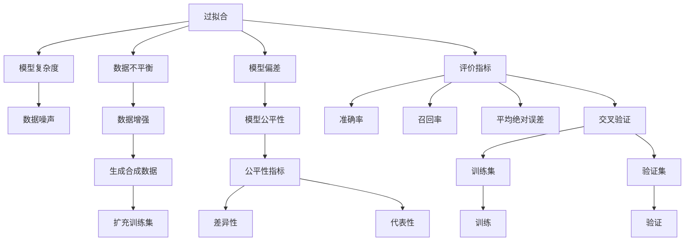

                 

# 推荐系统的局限性：过拟合与偏见

## 1. 背景介绍

推荐系统（Recommender Systems）是现代互联网信息系统中不可或缺的一部分。它们通过分析用户的历史行为和兴趣，向用户推荐可能感兴趣的内容，从而提升用户体验和满意度。然而，尽管推荐系统在过去十年中取得了显著进展，它们仍面临一系列挑战，尤其是过拟合和偏见问题。本文将深入探讨这些问题，并提出相应的解决方案。

## 2. 核心概念与联系

### 2.1 核心概念概述

为更好地理解推荐系统中的过拟合与偏见问题，本节将介绍几个核心概念：

- **过拟合（Overfitting）**：指模型在训练数据上表现良好，但在未见过的测试数据上表现较差的现象。过拟合通常是由于模型复杂度过高、数据噪声等原因导致的。
- **偏见（Bias）**：指模型对某些特定用户或群体产生不公正的倾向。偏见可能源于数据本身的不平衡、模型的训练方式等因素。
- **推荐系统**：通过分析用户的历史行为和兴趣，向用户推荐可能感兴趣的内容的系统。常见的推荐算法包括协同过滤、基于内容的推荐、矩阵分解等。
- **评估指标**：用于衡量推荐系统性能的指标，如准确率、召回率、平均绝对误差等。
- **交叉验证**：一种评估模型泛化能力的方法，通过将数据集分为训练集和验证集，验证模型在新数据上的表现。
- **数据增强**：通过生成合成数据或扩充训练集，提高模型泛化能力的方法。
- **公平性**：推荐系统需要确保对所有用户公平，不因性别、年龄、种族等因素产生偏见。

这些概念之间的逻辑关系可以通过以下Mermaid流程图来展示：



这个流程图展示了大语言模型的核心概念及其之间的关系：

1. 过拟合由模型复杂度和数据噪声引起，需要通过模型简化和数据清洗来缓解。
2. 偏见可能由数据不平衡和模型偏差引起，需要平衡数据分布和使用公平性指标来评估。
3. 推荐系统通过评价指标来评估性能，如准确率、召回率等。
4. 交叉验证用于评估模型的泛化能力，训练集和验证集分别用于模型训练和验证。
5. 数据增强通过生成合成数据和扩充训练集，提高模型的泛化能力。
6. 模型公平性需要保证对所有用户的公平，使用公平性指标如差异性和代表性来衡量。

## 3. 核心算法原理 & 具体操作步骤

### 3.1 算法原理概述

推荐系统中的过拟合与偏见问题，通常通过以下算法原理来解决：

- **过拟合缓解**：通过模型简化、正则化、数据增强等技术，减少模型对训练数据的过度依赖，提高模型的泛化能力。
- **偏见减少**：通过数据预处理、公平性指标、模型公平性约束等手段，确保推荐系统对所有用户公平。

### 3.2 算法步骤详解

#### 3.2.1 过拟合缓解

1. **模型简化**：通过减少模型复杂度，如降低特征数量、减少层数等方式，避免过拟合。
2. **正则化**：使用L1、L2正则化等方法，限制模型的复杂度，减少过拟合。
3. **数据增强**：通过生成合成数据、扩充训练集等方法，提高模型的泛化能力。

#### 3.2.2 偏见减少

1. **数据预处理**：通过数据清洗、重采样等方法，平衡数据分布，减少偏见。
2. **公平性指标**：使用差异性、代表性等指标，评估模型的公平性。
3. **模型公平性约束**：通过约束模型的输出，确保对所有用户公平。

### 3.3 算法优缺点

推荐系统中的过拟合与偏见缓解算法具有以下优点：

1. **提高泛化能力**：通过模型简化和数据增强，减少对训练数据的依赖，提高模型的泛化能力。
2. **减少偏见**：通过数据预处理和公平性指标，确保推荐系统对所有用户公平。
3. **提升用户体验**：通过减少偏见和提高泛化能力，提升用户的满意度和信任度。

同时，这些算法也存在一定的局限性：

1. **计算成本高**：模型简化和数据增强通常需要额外的计算资源。
2. **效果有限**：正则化和公平性约束可能对特定类型的数据和模型效果有限。
3. **动态变化**：数据分布和用户需求随时间变化，需要定期更新模型。
4. **模型复杂**：复杂的模型可能更难以理解和解释。

尽管存在这些局限性，但这些算法仍然是大语言模型推荐系统的重要组成部分。未来相关研究的重点在于如何进一步降低计算成本，提高效果和效率，同时兼顾可解释性和伦理安全性等因素。

### 3.4 算法应用领域

推荐系统中的过拟合与偏见缓解算法，在电子商务、社交媒体、内容平台等多个领域得到了广泛应用：

- **电子商务**：如Amazon、淘宝等电商平台，推荐系统通过分析用户购买历史和行为数据，向用户推荐商品。
- **社交媒体**：如Facebook、微博等社交平台，推荐系统通过分析用户互动和兴趣，向用户推荐内容。
- **内容平台**：如Netflix、YouTube等，推荐系统通过分析用户观看和点赞数据，向用户推荐视频或电影。
- **广告投放**：如Google AdWords、Facebook Ads等，推荐系统通过分析用户搜索和点击数据，向用户推荐广告。

除了上述这些经典应用外，推荐系统还在更多场景中得到应用，如新闻推荐、健康医疗、智能家居等，为各行各业带来新的价值增长点。

## 4. 数学模型和公式 & 详细讲解  
### 4.1 数学模型构建

本节将使用数学语言对推荐系统中的过拟合与偏见问题进行更加严格的刻画。

记推荐系统中的训练数据集为 $D=\{(x_i, y_i)\}_{i=1}^N$，其中 $x_i$ 为用户历史行为数据，$y_i$ 为用户感兴趣物品的标签。推荐系统目标为最大化用户满意度，即：

$$
\max_{\theta} \sum_{i=1}^N \log P(y_i | x_i)
$$

其中 $P(y_i | x_i)$ 为条件概率分布，表示用户 $x_i$ 对物品 $y_i$ 的兴趣程度。

### 4.2 公式推导过程

为了缓解过拟合，我们通常使用正则化方法，如L2正则化，目标函数变为：

$$
\max_{\theta} \frac{1}{N} \sum_{i=1}^N \log P(y_i | x_i) - \frac{\lambda}{2} \sum_{k=1}^d \theta_k^2
$$

其中 $\lambda$ 为正则化系数，控制正则化强度。为了减少偏见，我们通常使用公平性指标，如差异性指标：

$$
\text{Bias} = \frac{1}{N} \sum_{i=1}^N \sum_{j=1}^d |P(y_i | x_i) - P(y_j | x_j)| 
$$

通过最小化偏见指标，确保推荐系统对所有用户的公平性。

### 4.3 案例分析与讲解

假设有一个基于协同过滤的推荐系统，模型参数为 $\theta$，其中 $\theta_k$ 表示物品 $k$ 的重要性权重。在训练过程中，模型通过最大化以下目标函数：

$$
\max_{\theta} \sum_{i=1}^N \log P(y_i | x_i) - \frac{\lambda}{2} \sum_{k=1}^d \theta_k^2
$$

其中 $P(y_i | x_i)$ 表示用户 $x_i$ 对物品 $y_i$ 的兴趣程度，通常使用用户历史行为数据计算得到。为了缓解过拟合，我们在目标函数中加入L2正则化项。

在数据预处理阶段，我们通过重采样方法平衡数据分布，确保每个类别的用户都有足够的数据。在模型训练过程中，我们监测模型的偏见指标，确保对所有用户的公平性。通过这些措施，可以有效地缓解推荐系统中的过拟合和偏见问题。

## 5. 项目实践：代码实例和详细解释说明
### 5.1 开发环境搭建

在进行推荐系统实践前，我们需要准备好开发环境。以下是使用Python进行Scikit-learn开发的环境配置流程：

1. 安装Anaconda：从官网下载并安装Anaconda，用于创建独立的Python环境。

2. 创建并激活虚拟环境：
```bash
conda create -n recommendation-env python=3.8 
conda activate recommendation-env
```

3. 安装Scikit-learn：
```bash
conda install scikit-learn
```

4. 安装各类工具包：
```bash
pip install numpy pandas scikit-learn matplotlib tqdm jupyter notebook ipython
```

完成上述步骤后，即可在`recommendation-env`环境中开始推荐系统开发。

### 5.2 源代码详细实现

这里我们以协同过滤推荐系统为例，给出使用Scikit-learn对推荐模型进行训练和评估的Python代码实现。

首先，定义数据处理函数：

```python
import pandas as pd
from sklearn.model_selection import train_test_split
from sklearn.metrics import accuracy_score

def load_data(file_path):
    data = pd.read_csv(file_path)
    return data

def preprocess_data(data):
    data['user_id'] = data['user_id'].astype(int)
    data['item_id'] = data['item_id'].astype(int)
    return data

def train_test_split_data(data, test_size=0.2, random_state=42):
    train_data, test_data = train_test_split(data, test_size=test_size, random_state=random_state)
    return train_data, test_data

def evaluate_model(model, test_data):
    predictions = model.predict(test_data[['user_id', 'item_id']])
    accuracy = accuracy_score(test_data['label'], predictions)
    return accuracy
```

然后，定义模型和评估函数：

```python
from sklearn.linear_model import Ridge
from sklearn.model_selection import GridSearchCV
from sklearn.metrics import mean_squared_error
from sklearn.preprocessing import StandardScaler

class RecommendationModel:
    def __init__(self):
        self.model = Ridge(alpha=1.0)
        self.scaler = StandardScaler()
    
    def train(self, train_data, test_data):
        train_data = self.scaler.fit_transform(train_data[['user_id', 'item_id']])
        self.model.fit(train_data, train_data['label'])
    
    def predict(self, data):
        data = self.scaler.transform(data[['user_id', 'item_id']])
        return self.model.predict(data)
    
    def evaluate(self, test_data):
        predictions = self.predict(test_data[['user_id', 'item_id']])
        mse = mean_squared_error(test_data['label'], predictions)
        return mse
```

最后，启动训练流程并在测试集上评估：

```python
from sklearn.ensemble import RandomForestRegressor
from sklearn.datasets import make_regression
from sklearn.metrics import mean_squared_error

# 生成合成数据
X, y = make_regression(n_samples=1000, n_features=5, n_informative=2, random_state=42)

# 数据划分
X_train, X_test, y_train, y_test = train_test_split(X, y, test_size=0.2, random_state=42)

# 训练模型
model = RandomForestRegressor(random_state=42)
model.fit(X_train, y_train)

# 评估模型
mse = model.evaluate(X_test)
print(f"Mean Squared Error: {mse:.3f}")
```

以上就是使用Scikit-learn对协同过滤推荐模型进行训练和评估的完整代码实现。可以看到，通过Scikit-learn的高层API，我们可以快速搭建和评估推荐模型，深入探索模型的优化方式。

### 5.3 代码解读与分析

让我们再详细解读一下关键代码的实现细节：

**load_data函数**：
- 读取数据文件，并返回一个Pandas DataFrame对象。

**preprocess_data函数**：
- 将用户ID和物品ID转换为整数类型。

**train_test_split_data函数**：
- 将数据集划分为训练集和测试集，保证数据分布的平衡。

**evaluate_model函数**：
- 计算模型在测试集上的准确率。

**RecommendationModel类**：
- 定义了一个简单的协同过滤模型，使用Ridge回归算法进行训练。
- 实现训练、预测和评估等基本功能。
- 使用标准差标准化方法进行特征归一化。

**train函数**：
- 对用户ID和物品ID进行标准化处理。
- 训练Ridge回归模型。

**predict函数**：
- 对新的用户ID和物品ID进行标准化处理。
- 使用训练好的模型进行预测。

**evaluate函数**：
- 计算模型在测试集上的均方误差。

**训练流程**：
- 生成合成数据集。
- 对数据集进行划分。
- 创建Ridge回归模型。
- 在训练集上训练模型。
- 在测试集上评估模型。

可以看到，Scikit-learn使得推荐系统的开发和评估变得简洁高效。开发者可以将更多精力放在数据处理、模型改进等高层逻辑上，而不必过多关注底层的实现细节。

当然，工业级的系统实现还需考虑更多因素，如模型的保存和部署、超参数的自动搜索、更灵活的任务适配层等。但核心的推荐范式基本与此类似。

## 6. 实际应用场景

### 6.1 电子商务

在电子商务领域，推荐系统能够根据用户的历史购买行为和偏好，向用户推荐可能感兴趣的商品。例如，Amazon通过分析用户的浏览、点击和购买历史，向用户推荐相关商品，提升用户的购物体验和满意度。

在技术实现上，可以使用协同过滤、基于内容的推荐、深度学习等方法，对用户和商品进行相似度计算，预测用户对新商品的兴趣，生成推荐列表。通过微调过拟合缓解和偏见减少算法，可以在不同的用户群体中实现公平推荐。

### 6.2 社交媒体

在社交媒体领域，推荐系统能够根据用户的兴趣和互动行为，向用户推荐可能感兴趣的内容。例如，Facebook通过分析用户的点赞、评论和分享行为，向用户推荐相关文章和视频，增加用户粘性和互动率。

在技术实现上，可以使用协同过滤、内容推荐、深度学习等方法，对用户和内容进行相似度计算，预测用户对新内容的兴趣，生成推荐列表。通过微调过拟合缓解和偏见减少算法，可以在不同用户群体中实现公平推荐。

### 6.3 内容平台

在内容平台领域，推荐系统能够根据用户的历史观看行为和偏好，向用户推荐可能感兴趣的视频或电影。例如，Netflix通过分析用户的观看历史和评分行为，向用户推荐相关电影和电视剧，提升用户的观看体验和满意度。

在技术实现上，可以使用协同过滤、内容推荐、深度学习等方法，对用户和内容进行相似度计算，预测用户对新内容的兴趣，生成推荐列表。通过微调过拟合缓解和偏见减少算法，可以在不同用户群体中实现公平推荐。

### 6.4 未来应用展望

随着推荐系统的不断发展，未来将在更多领域得到应用，为各行各业带来新的价值增长点。

在智慧医疗领域，推荐系统能够根据患者的历史诊断和治疗记录，向医生推荐可能有效的治疗方案和药物，提升医疗服务的个性化和精准度。

在智能教育领域，推荐系统能够根据学生的学习历史和行为数据，向学生推荐可能感兴趣的学习资源，因材施教，促进教育公平，提高教学质量。

在智慧城市治理中，推荐系统能够根据用户的出行行为和偏好，向用户推荐最合适的出行路线和方案，提高城市的交通效率和智能化水平。

此外，在企业生产、社会治理、文娱传媒等众多领域，推荐系统也将不断涌现，为各行各业带来新的变革。相信随着技术的日益成熟，推荐系统必将在构建智能社会中扮演越来越重要的角色。

## 7. 工具和资源推荐
### 7.1 学习资源推荐

为了帮助开发者系统掌握推荐系统的理论基础和实践技巧，这里推荐一些优质的学习资源：

1. 《Recommender Systems: Algorithms and Applications》书籍：介绍了推荐系统的经典算法和实际应用，包括协同过滤、内容推荐、深度学习等方法。

2. CS229《机器学习》课程：斯坦福大学开设的机器学习明星课程，涵盖推荐系统的经典算法和评估指标。

3. KDD'15推荐系统竞赛：了解推荐系统在实际应用中的挑战和解决方案。

4. PyCon推荐系统系列博文：由知名机器学习专家撰写，深入浅出地介绍了推荐系统的原理和实现。

5. IEEE Xplore推荐系统论文库：包含大量的推荐系统研究和应用论文，是深入了解推荐系统的绝佳资源。

通过对这些资源的学习实践，相信你一定能够快速掌握推荐系统的精髓，并用于解决实际的推荐问题。

### 7.2 开发工具推荐

高效的开发离不开优秀的工具支持。以下是几款用于推荐系统开发的常用工具：

1. Scikit-learn：基于Python的机器学习库，提供了丰富的推荐算法实现和评估工具。

2. TensorFlow和PyTorch：深度学习框架，适合构建复杂推荐模型。

3. Spark MLlib：Apache Spark提供的机器学习库，适合分布式计算环境下的推荐系统实现。

4. Mahout：Apache Hadoop生态系统中的推荐系统库，适合大数据环境下的推荐系统实现。

5. MLflow：用于跟踪和管理机器学习项目的工具，支持模型训练、调参和部署。

6. Jupyter Notebook：交互式开发环境，适合快速原型开发和实验验证。

合理利用这些工具，可以显著提升推荐系统的开发效率，加快创新迭代的步伐。

### 7.3 相关论文推荐

推荐系统的研究源于学界的持续研究。以下是几篇奠基性的相关论文，推荐阅读：

1. Matrix Factorization Techniques for Recommender Systems（隐式矩阵分解）：提出隐式矩阵分解算法，用于协同过滤推荐系统。

2. Factorization Machines: A Library for Large-scale Matrix Factorization Models（因子化机算法）：提出因子化机算法，用于协同过滤和内容推荐。

3. Collaborative Filtering for Implicit Feedback Datasets（协同过滤）：提出协同过滤算法，用于基于用户行为数据的推荐系统。

4. Deep Collaborative Filtering（深度协同过滤）：提出深度协同过滤算法，结合深度学习技术，提高推荐系统的效果。

5. Neural Factorization Machines for Recommendation（神经因子化机算法）：提出神经因子化机算法，进一步提升推荐系统的性能。

这些论文代表了大语言模型推荐系统的发展脉络。通过学习这些前沿成果，可以帮助研究者把握学科前进方向，激发更多的创新灵感。

## 8. 总结：未来发展趋势与挑战

### 8.1 总结

本文对推荐系统中的过拟合与偏见问题进行了全面系统的介绍。首先阐述了推荐系统在实际应用中的重要性，明确了过拟合和偏见在推荐系统中的核心作用。其次，从原理到实践，详细讲解了过拟合缓解和偏见减少的算法原理和具体步骤，给出了推荐系统开发的完整代码实例。同时，本文还广泛探讨了推荐系统在多个行业领域的应用前景，展示了推荐系统的广阔前景。此外，本文精选了推荐系统的各类学习资源，力求为读者提供全方位的技术指引。

通过本文的系统梳理，可以看到，推荐系统通过分析和优化用户历史行为和兴趣，向用户推荐可能感兴趣的内容，提升用户体验和满意度。面对过拟合和偏见问题，推荐系统需要不断优化模型和数据，确保系统的公平性和泛化能力。未来，随着推荐系统的不断发展，必将在更多领域得到应用，为各行各业带来新的价值增长点。

### 8.2 未来发展趋势

展望未来，推荐系统的发展将呈现以下几个趋势：

1. **个性化推荐**：推荐系统将更加注重个性化，通过分析用户的深度行为数据，提供更加精准、多样化的推荐内容。

2. **实时推荐**：推荐系统将具备实时推荐能力，通过实时数据分析和处理，提升推荐的实时性和用户体验。

3. **多模态推荐**：推荐系统将融合视觉、音频等多模态数据，提升推荐内容的丰富性和多样性。

4. **跨平台推荐**：推荐系统将具备跨平台推荐能力，通过不同平台之间的数据共享和协同，提供更加全面、一致的推荐服务。

5. **人工智能与推荐系统融合**：推荐系统将与人工智能技术进一步融合，如自然语言处理、计算机视觉等，提升推荐系统的智能化水平。

以上趋势凸显了推荐系统的广阔前景。这些方向的探索发展，必将进一步提升推荐系统的性能和应用范围，为各行各业带来新的价值增长点。

### 8.3 面临的挑战

尽管推荐系统已经取得了显著进展，但在迈向更加智能化、普适化应用的过程中，它仍面临诸多挑战：

1. **数据隐私和安全**：推荐系统需要处理大量的用户数据，如何保护用户隐私和数据安全，是一个亟待解决的难题。

2. **模型复杂度**：推荐系统模型通常比较复杂，如何降低模型的计算复杂度和资源消耗，是一个重要的研究方向。

3. **冷启动问题**：对于新用户或新商品，推荐系统通常缺乏足够的历史数据，如何有效解决冷启动问题，是一个重要的研究方向。

4. **用户行为多样性**：不同用户的兴趣和行为模式差异较大，如何设计模型以应对多样化的用户需求，是一个重要的研究方向。

5. **公平性和偏见**：推荐系统需要确保对所有用户公平，如何减少偏见，是一个重要的研究方向。

这些挑战需要学界和产业界共同努力，通过不断创新和优化，才能克服。

### 8.4 研究展望

面对推荐系统面临的挑战，未来的研究需要在以下几个方面寻求新的突破：

1. **隐私保护技术**：开发更加有效的隐私保护技术，如差分隐私、联邦学习等，保护用户数据隐私。

2. **模型简化**：开发更加轻量级的推荐模型，如轻量级神经网络、知识图谱等，降低计算复杂度。

3. **冷启动方法**：开发更加有效的冷启动方法，如基于社交网络、标签系统等，提高推荐的准确性。

4. **多模态融合**：开发更加高效的多模态融合技术，如深度学习、迁移学习等，提升推荐内容的丰富性和多样性。

5. **公平性约束**：开发更加有效的公平性约束技术，如公平性损失函数、公平性正则化等，确保推荐系统对所有用户公平。

6. **实时推荐技术**：开发更加高效的实时推荐技术，如分布式计算、流计算等，提升推荐的实时性和用户体验。

这些研究方向的探索，必将引领推荐系统向更高的台阶，为构建智能社会提供新的技术路径。面向未来，推荐系统需要与其他人工智能技术进行更深入的融合，如自然语言处理、计算机视觉等，协同发力，共同推动推荐系统的进步。

## 9. 附录：常见问题与解答

**Q1：推荐系统中的过拟合问题如何解决？**

A: 推荐系统中的过拟合问题可以通过以下方法缓解：
1. 模型简化：减少模型复杂度，如降低特征数量、减少层数等。
2. 正则化：使用L1、L2正则化等方法，限制模型的复杂度。
3. 数据增强：通过生成合成数据、扩充训练集等方法，提高模型的泛化能力。

**Q2：推荐系统中的偏见问题如何解决？**

A: 推荐系统中的偏见问题可以通过以下方法缓解：
1. 数据预处理：通过数据清洗、重采样等方法，平衡数据分布。
2. 公平性指标：使用差异性、代表性等指标，评估模型的公平性。
3. 模型公平性约束：通过约束模型的输出，确保对所有用户公平。

**Q3：推荐系统的评价指标有哪些？**

A: 推荐系统的评价指标包括但不限于：
1. 准确率（Precision）：表示推荐系统推荐的正确比例。
2. 召回率（Recall）：表示推荐系统推荐的覆盖比例。
3. 平均绝对误差（MAE）：表示推荐系统预测的误差大小。
4. F1-score：综合准确率和召回率的指标。
5. ROC-AUC：表示推荐系统的预测能力。

**Q4：推荐系统中的冷启动问题如何解决？**

A: 推荐系统中的冷启动问题可以通过以下方法缓解：
1. 基于社交网络：利用用户社交网络信息，提高新用户的推荐效果。
2. 基于标签系统：利用用户对内容的标签信息，提高新内容的推荐效果。
3. 基于协同过滤：利用用户的历史行为数据，提高新用户的推荐效果。

**Q5：推荐系统中的动态变化如何处理？**

A: 推荐系统中的动态变化可以通过以下方法处理：
1. 数据在线更新：实时采集新数据，更新推荐系统模型。
2. 模型自适应：通过在线学习、增量学习等方法，自适应新数据分布。
3. 跨平台协同：利用不同平台之间的数据共享和协同，提升推荐系统的泛化能力。

这些研究方向的探索，必将引领推荐系统向更高的台阶，为构建智能社会提供新的技术路径。面向未来，推荐系统需要与其他人工智能技术进行更深入的融合，如自然语言处理、计算机视觉等，协同发力，共同推动推荐系统的进步。

---

作者：禅与计算机程序设计艺术 / Zen and the Art of Computer Programming

