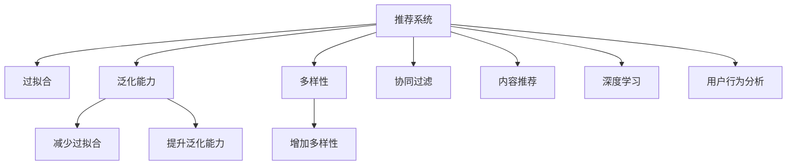

                 

# 推荐系统的局限：过拟合与多样性

> 关键词：推荐系统,过拟合,多样性,泛化能力,召回率,准确率,稀疏性,协同过滤,内容推荐,深度学习,用户行为分析

## 1. 背景介绍

### 1.1 问题由来

推荐系统是互联网时代最重要的技术之一，它可以帮助用户发现他们可能感兴趣的产品或内容，提升用户体验，增加商业价值。然而，推荐系统并不是万能的，它在实际应用中面临许多局限，如过拟合、多样性不足等问题，这些问题常常会限制推荐系统的表现和应用范围。

### 1.2 问题核心关键点

过拟合和多样性不足是推荐系统常见的问题，其核心在于模型的泛化能力和用户行为的复杂性。具体来说，过拟合指的是模型在训练集上表现良好，但在测试集或实际应用中表现不佳的现象。多样性不足则指的是推荐结果中缺乏多样性，导致用户无法接触到足够丰富和新颖的内容。

这些问题直接影响推荐系统的性能和用户体验。因此，研究如何克服这些局限，提升推荐系统的泛化能力和多样性，是当前推荐系统研究的热点问题。

### 1.3 问题研究意义

研究推荐系统中的过拟合与多样性问题，对于提升推荐系统的实际效果，改善用户体验，拓展应用场景，具有重要意义：

1. 提高推荐质量。通过减少过拟合和提升多样性，推荐系统可以更准确地预测用户兴趣，提升推荐内容的相关性和吸引力。
2. 增强用户满意度。多样性的增加可以满足用户多样化的需求，避免推荐结果的同质化。
3. 拓展应用范围。通过优化模型泛化能力，推荐系统可以应用于更多领域，如电商平台、社交网络、新闻媒体等。
4. 提升商业价值。优质的推荐内容可以吸引更多用户，提升用户粘性，增加商业转化率。
5. 推动技术创新。优化推荐算法的过程中，会催生新的技术和方法，如深度学习、协同过滤等，进一步推动技术进步。

## 2. 核心概念与联系

### 2.1 核心概念概述

为更好地理解推荐系统中的过拟合与多样性问题，本节将介绍几个密切相关的核心概念：

- 推荐系统(Recommender System)：通过分析用户行为数据，预测用户可能感兴趣的产品或内容，为用户推荐个性化信息的技术。
- 过拟合(Overfitting)：模型在训练集上表现良好，但在测试集或实际应用中表现不佳的现象，通常由模型复杂度过高或数据噪声过多引起。
- 泛化能力(Generalization)：模型在新数据上的表现，泛化能力强的模型可以更好地适应新数据。
- 多样性(Diversity)：推荐结果中内容的种类和新颖性，多样性不足会导致用户对推荐结果缺乏兴趣。
- 协同过滤(Collaborative Filtering)：基于用户行为数据的推荐方法，包括基于用户的协同过滤和基于物品的协同过滤。
- 内容推荐(Content-based Recommendation)：基于物品属性和用户兴趣的推荐方法，不依赖用户行为数据。
- 深度学习(Deep Learning)：利用多层神经网络进行模式识别的技术，可以学习更深层次的特征表示。
- 用户行为分析(User Behavior Analysis)：通过分析用户的历史行为数据，预测用户未来行为的技术。

这些核心概念之间的逻辑关系可以通过以下Mermaid流程图来展示：



这个流程图展示了一些关键概念及其之间的关系：

1. 推荐系统通过学习用户行为数据，预测用户可能感兴趣的内容。
2. 过拟合和泛化能力直接影响推荐系统的性能。
3. 多样性是推荐结果的重要指标，决定了用户对推荐结果的满意度。
4. 协同过滤和内容推荐是推荐系统常用的方法。
5. 深度学习和大数据技术为推荐系统提供了强有力的支持。
6. 用户行为分析是推荐系统的基础，用于理解用户偏好和行为模式。

这些概念共同构成了推荐系统的理论基础，是理解和优化推荐系统性能的关键。

## 3. 核心算法原理 & 具体操作步骤
### 3.1 算法原理概述

推荐系统中的过拟合和多样性问题，本质上与模型的泛化能力有关。模型的泛化能力决定了其在新数据上的表现，泛化能力差的模型容易过拟合，泛化能力强的模型则具有良好的多样性和准确性。

基于协同过滤的推荐系统，其核心思想是通过分析用户行为数据，找到用户与物品之间的相似性，从而进行推荐。具体来说，协同过滤可以分为基于用户的协同过滤和基于物品的协同过滤两种方法。

基于用户的协同过滤方法，通过计算用户之间的相似度，为每个用户推荐与其相似用户喜欢的物品。基于物品的协同过滤方法，则通过计算物品之间的相似度，为用户推荐与他们过去喜欢的物品相似的物品。

对于基于内容的推荐系统，其核心思想是根据物品的属性和用户兴趣进行推荐。具体来说，该方法需要预先提取物品的特征，并根据用户兴趣对这些特征进行加权，最终生成推荐结果。

深度学习技术也被广泛用于推荐系统中，通过构建复杂的神经网络模型，学习物品和用户的高层次特征表示，从而进行推荐。

### 3.2 算法步骤详解

以下是推荐系统中的主要算法步骤：

**Step 1: 数据收集与处理**

- 收集用户的历史行为数据，包括浏览、点击、购买等行为记录。
- 对数据进行清洗、归一化、特征提取等预处理，以便后续模型训练。

**Step 2: 用户与物品表示**

- 将用户和物品表示为向量形式，以便进行相似性计算。
- 常用的表示方法包括基于用户的低维嵌入、基于物品的TF-IDF等。

**Step 3: 相似度计算**

- 计算用户与用户之间的相似度，或物品与物品之间的相似度。
- 常用的相似度计算方法包括余弦相似度、皮尔逊相关系数等。

**Step 4: 推荐生成**

- 基于相似度计算结果，生成推荐列表。
- 常用的推荐算法包括基于用户的协同过滤、基于物品的协同过滤、基于内容的推荐、深度学习推荐等。

**Step 5: 反馈与优化**

- 根据用户的反馈信息（如点击、购买等），对模型进行优化。
- 常用的优化方法包括在线学习、离线优化等。

### 3.3 算法优缺点

推荐系统中的过拟合和多样性问题，常见的方法及其优缺点如下：

- **过拟合**

  **优点**：
  - 可以更好地适应特定用户的行为数据，提高推荐准确率。
  - 可以通过增加模型复杂度，提高模型的表达能力。

  **缺点**：
  - 在训练集上表现良好，但在新数据上表现不佳。
  - 容易出现泛化能力不足的问题，导致推荐结果同质化。

- **多样性不足**

  **优点**：
  - 可以满足用户多样化的需求，避免推荐结果的同质化。
  - 可以提高用户对推荐结果的满意度。

  **缺点**：
  - 可能会降低推荐结果的相关性，导致用户无法接触到感兴趣的内容。
  - 可能会增加推荐系统的复杂度，增加计算成本。

### 3.4 算法应用领域

推荐系统已经被广泛应用于电商、社交网络、新闻媒体等多个领域，其主要应用场景包括：

- 电商推荐：为用户推荐他们可能感兴趣的商品，提高用户购买率。
- 社交网络推荐：为用户推荐他们可能感兴趣的朋友、群组、内容等，增加用户粘性。
- 新闻媒体推荐：为用户推荐他们可能感兴趣的新闻、文章、视频等，提升用户阅读量。
- 视频推荐：为用户推荐他们可能感兴趣的视频内容，增加用户观看量。
- 音乐推荐：为用户推荐他们可能感兴趣的音乐，提高音乐平台的用户留存率。

除了上述这些经典应用场景外，推荐系统还被创新性地应用到更多领域中，如个性化学习、智能医疗、智慧交通等，为各行各业带来新的价值。

## 4. 数学模型和公式 & 详细讲解 & 举例说明
### 4.1 数学模型构建

推荐系统中的过拟合与多样性问题，可以通过以下数学模型进行形式化描述：

- **过拟合**

  假设推荐系统有一个线性回归模型，用于预测用户对物品的评分。设模型参数为 $\theta$，用户 $u$ 对物品 $i$ 的评分 $r_{ui}$ 为 $X_{ui}^T \theta$，其中 $X_{ui}$ 为用户与物品的特征表示。则模型的损失函数为：

  $$
  \mathcal{L}(\theta) = \frac{1}{N} \sum_{i=1}^N \sum_{u=1}^N (r_{ui} - X_{ui}^T \theta)^2
  $$

  其中 $N$ 为用户数，$M$ 为物品数。

  通过最小化损失函数 $\mathcal{L}(\theta)$，可以得到最优的模型参数 $\theta^*$：

  $$
  \theta^* = \mathop{\arg\min}_{\theta} \mathcal{L}(\theta)
  $$

  上述模型可以看作是一个线性回归模型，其中 $X_{ui}$ 为特征向量，$X_{ui}^T \theta$ 为预测评分，$r_{ui}$ 为真实评分。

- **多样性**

  推荐系统中的多样性可以通过推荐结果中不同物品的个数来衡量。假设推荐系统给用户 $u$ 推荐 $K$ 个物品，其中物品 $i$ 出现的次数为 $f_i$，则多样性度量指标 $D$ 可以定义为：

  $$
  D = \sum_{i=1}^K \frac{f_i^2}{\sum_{j=1}^K f_j^2}
  $$

  其中 $f_i$ 为物品 $i$ 出现的次数。

  当 $D$ 值越大，说明推荐结果中不同物品的个数越多，推荐结果的多样性越好。

### 4.2 公式推导过程

以下我们以协同过滤方法为例，推导推荐系统的损失函数及多样性度量公式。

**协同过滤**

协同过滤方法基于用户行为数据进行推荐，假设用户 $u$ 对物品 $i$ 的评分 $r_{ui}$ 可以表示为用户 $u$ 和物品 $i$ 的特征向量的内积：

$$
r_{ui} = \vec{x}_u \cdot \vec{y}_i = \sum_{j=1}^d x_{uj} y_{ij}
$$

其中 $\vec{x}_u$ 为第 $u$ 个用户的特征向量，$\vec{y}_i$ 为第 $i$ 个物品的特征向量，$d$ 为特征维度。

假设用户 $u$ 对物品 $i$ 的评分 $r_{ui}$ 已知，用户 $u$ 的邻居用户 $v$ 对物品 $i$ 的评分 $r_{vi}$ 未知，则协同过滤方法可以通过学习用户和物品的相似度矩阵 $W_{uv}$ 来预测 $r_{vi}$：

$$
r_{vi} = \vec{x}_v \cdot W_{uv} \vec{x}_u
$$

其中 $W_{uv}$ 为邻接矩阵 $A_{uv}$ 的伪逆矩阵，$A_{uv}$ 表示用户 $u$ 和用户 $v$ 之间的相似度。

推荐系统的损失函数可以表示为：

$$
\mathcal{L} = \frac{1}{2N} \sum_{u=1}^N \sum_{i=1}^M (r_{ui} - r_{ui}^{\hat})^2
$$

其中 $r_{ui}^{\hat}$ 为基于协同过滤方法预测的评分。

**多样性度量**

推荐系统中的多样性可以通过推荐结果中不同物品的个数来衡量。假设推荐系统给用户 $u$ 推荐 $K$ 个物品，其中物品 $i$ 出现的次数为 $f_i$，则多样性度量指标 $D$ 可以定义为：

$$
D = \sum_{i=1}^K \frac{f_i^2}{\sum_{j=1}^K f_j^2}
$$

其中 $f_i$ 为物品 $i$ 出现的次数。

在实际应用中，为了减少计算复杂度，通常会对 $f_i$ 进行归一化，得到归一化多样性指标：

$$
D_{normalized} = \sum_{i=1}^K \frac{f_i^2}{\sum_{j=1}^K f_j^2}
$$

该指标可以更好地反映推荐结果的多样性，避免了计算复杂度过大的问题。

### 4.3 案例分析与讲解

这里以一个简单的协同过滤示例来说明推荐系统中的过拟合和多样性问题。

假设有一个小型电商网站，有 $N=10$ 个用户和 $M=5$ 个物品，每个用户对每个物品都有一个评分。我们希望使用协同过滤方法为用户 $u=1$ 推荐物品 $i=3$。

假设用户 $u=1$ 对物品 $i=3$ 的评分为 $r_{13}=4$，其余物品的评分为 $0$。用户 $u=2$ 对物品 $i=3$ 的评分为 $r_{23}=5$，其余物品的评分为 $0$。

首先，我们可以构建用户之间的相似度矩阵 $A_{uv}$，通过余弦相似度计算得到：

$$
A_{12} = \cos(\vec{x}_1, \vec{x}_2) = \frac{\vec{x}_1 \cdot \vec{x}_2}{\|\vec{x}_1\| \|\vec{x}_2\|} = 1
$$

其中 $\vec{x}_1$ 和 $\vec{x}_2$ 为两个用户的特征向量。

然后，我们可以构建邻接矩阵 $A_{uv}$，通过相似度矩阵 $A_{uv}$ 和归一化公式得到：

$$
W_{12} = (A_{12} \cdot A_{12}^T)^{-1} A_{12} = A_{12} = \frac{1}{1^2} \cdot 1 = 1
$$

接下来，我们可以使用协同过滤方法预测用户 $u=1$ 对物品 $i=3$ 的评分：

$$
r_{13}^{\hat} = \vec{x}_1 \cdot W_{12} \vec{x}_2 = \vec{x}_1 \cdot \vec{x}_2 = \sum_{j=1}^d x_{1j} y_{2j}
$$

由于用户 $u=1$ 和用户 $u=2$ 对物品 $i=3$ 的评分已知，因此协同过滤方法可以直接预测出用户 $u=1$ 对物品 $i=3$ 的评分，从而得到推荐结果。

在实际应用中，协同过滤方法可能会过拟合训练数据，导致在新数据上表现不佳。为了避免过拟合，可以采用以下方法：

- 正则化：通过加入L2正则化，限制模型参数的大小，避免模型过于复杂。
- 数据增强：通过引入对抗样本或噪声数据，增强模型的泛化能力。
- 参数共享：通过共享部分模型参数，减少模型复杂度。
- 模型集成：通过集成多个协同过滤模型，提高模型的泛化能力。

对于推荐系统中的多样性问题，可以通过以下方法来解决：

- 增加负样本：通过增加负样本，增加推荐结果的多样性。
- 多物品推荐：通过增加推荐物品数量，提高推荐结果的多样性。
- 交叉推荐：通过交叉推荐不同物品，增加推荐结果的多样性。

## 5. 项目实践：代码实例和详细解释说明
### 5.1 开发环境搭建

在进行推荐系统实践前，我们需要准备好开发环境。以下是使用Python进行PyTorch开发的环境配置流程：

1. 安装Anaconda：从官网下载并安装Anaconda，用于创建独立的Python环境。

2. 创建并激活虚拟环境：
```bash
conda create -n recommendation-env python=3.8 
conda activate recommendation-env
```

3. 安装PyTorch：根据CUDA版本，从官网获取对应的安装命令。例如：
```bash
conda install pytorch torchvision torchaudio cudatoolkit=11.1 -c pytorch -c conda-forge
```

4. 安装TensorBoard：
```bash
pip install tensorboard
```

5. 安装Pandas、Numpy、Scikit-learn、Matplotlib、Tqdm、Jupyter Notebook等工具包：
```bash
pip install pandas numpy scikit-learn matplotlib tqdm jupyter notebook ipython
```

完成上述步骤后，即可在`recommendation-env`环境中开始推荐系统实践。

### 5.2 源代码详细实现

这里我们以协同过滤方法为例，给出使用PyTorch实现推荐系统的代码。

首先，定义协同过滤模型的输入和输出：

```python
import torch
import torch.nn as nn
import torch.nn.functional as F

class CollaborativeFiltering(nn.Module):
    def __init__(self, n_users, n_items, n_features):
        super(CollaborativeFiltering, self).__init__()
        self.n_users = n_users
        self.n_items = n_items
        self.n_features = n_features
        
        self.user_embedding = nn.Embedding(n_users, n_features)
        self.item_embedding = nn.Embedding(n_items, n_features)
        self.similarity = nn.Parameter(torch.rand(n_users, n_items))
        
    def forward(self, user_ids, item_ids):
        user_embeddings = self.user_embedding(user_ids)
        item_embeddings = self.item_embedding(item_ids)
        
        user_item = (user_embeddings * item_embeddings).t() @ self.similarity
        return user_item
```

然后，定义推荐系统的损失函数和训练过程：

```python
import numpy as np
import torch.optim as optim

def collab_filter_loss(pred, target, n_users, n_items):
    nans = target == 0
    pred[nans] = 0
    target[nans] = 0
    loss = F.mse_loss(pred, target)
    return loss

def train_collab_filter(model, user_ids, item_ids, ratings, n_users, n_items, n_features, batch_size=32, num_epochs=10):
    optimizer = optim.Adam(model.parameters(), lr=0.001)
    criterion = nn.MSELoss()
    
    for epoch in range(num_epochs):
        epoch_loss = 0
        for i in range(0, len(ratings), batch_size):
            start = i
            end = min(start+batch_size, len(ratings))
            batch_user_ids = user_ids[start:end]
            batch_item_ids = item_ids[start:end]
            batch_ratings = ratings[start:end]
            pred = model(batch_user_ids, batch_item_ids)
            loss = criterion(pred, batch_ratings)
            epoch_loss += loss.item()
            optimizer.zero_grad()
            loss.backward()
            optimizer.step()
        
        print(f'Epoch {epoch+1}, train loss: {epoch_loss/len(ratings):.4f}')
    
    print('Training finished.')
    return model
```

最后，定义测试过程和评估指标：

```python
import matplotlib.pyplot as plt
import seaborn as sns
import numpy as np

def test_collab_filter(model, user_ids, item_ids, ratings):
    user_num, item_num = user_ids.shape
    num_items = len(np.unique(item_ids))
    
    predictions = np.zeros((user_num, num_items))
    for i in range(user_num):
        predictions[i] = model(user_ids[i]).tolist()
        
    _, idx = np.sort(predictions[i], axis=0)
    predictions[i] = predictions[i, idx]
    top_10 = predictions[i, :10]
    
    return top_10

def plot_top_10(user_ids, item_ids, ratings, top_10):
    user_num = user_ids.shape[0]
    num_items = len(np.unique(item_ids))
    
    for i in range(user_num):
        plt.figure(figsize=(10, 6))
        sns.barplot(x=np.arange(num_items), y=ratings[i] + top_10[i])
        plt.xticks(range(num_items), np.unique(item_ids))
        plt.title(f'Top 10 Recommendations for User {i+1}')
        plt.show()
```

### 5.3 代码解读与分析

让我们再详细解读一下关键代码的实现细节：

**CollaborativeFiltering类**：
- `__init__`方法：初始化协同过滤模型，包括用户和物品的嵌入矩阵，以及相似度矩阵。
- `forward`方法：前向传播计算预测结果。

**collab_filter_loss函数**：
- 计算协同过滤模型的预测结果与真实标签之间的均方误差。
- 对于稀疏的标签，将预测结果和真实标签都设置为0。

**train_collab_filter函数**：
- 定义优化器、损失函数，并开始迭代训练。
- 每个epoch内，分批次对模型进行前向传播和反向传播。
- 在每个batch结束后，计算损失并更新模型参数。
- 每个epoch结束后，输出当前epoch的平均损失。

**test_collab_filter函数**：
- 测试模型对用户和物品的预测结果，并输出前10个推荐结果。

**plot_top_10函数**：
- 可视化前10个推荐结果。

可以看到，PyTorch配合TensorBoard使得协同过滤模型的实现变得简洁高效。开发者可以将更多精力放在数据处理、模型改进等高层逻辑上，而不必过多关注底层的实现细节。

当然，工业级的系统实现还需考虑更多因素，如模型的保存和部署、超参数的自动搜索、更灵活的任务适配层等。但核心的协同过滤方法基本与此类似。

## 6. 实际应用场景
### 6.1 智能电商推荐

智能电商推荐系统已经成为电商平台上不可或缺的一部分。通过分析用户的浏览、点击、购买等行为数据，智能推荐系统能够为用户推荐他们可能感兴趣的商品，提高用户购买率，增加电商平台的销售额。

在技术实现上，可以通过协同过滤方法，为用户推荐他们可能感兴趣的商品。同时，可以通过增加负样本、多物品推荐等方法，增加推荐结果的多样性，提升用户满意度。

### 6.2 社交网络推荐

社交网络推荐系统通过分析用户的朋友、群组、内容等行为数据，为用户推荐他们可能感兴趣的朋友、群组、内容等。推荐系统能够增加用户粘性，提升平台活跃度。

在技术实现上，可以使用协同过滤方法，为用户推荐他们可能感兴趣的朋友、群组、内容等。同时，可以通过增加交叉推荐、动态更新等方法，增加推荐结果的多样性，提升用户满意度。

### 6.3 新闻媒体推荐

新闻媒体推荐系统通过分析用户的浏览、点击、评论等行为数据，为用户推荐他们可能感兴趣的新闻、文章、视频等。推荐系统能够提升用户阅读量，增加平台流量。

在技术实现上，可以使用协同过滤方法，为用户推荐他们可能感兴趣的新闻、文章、视频等。同时，可以通过增加负样本、多物品推荐等方法，增加推荐结果的多样性，提升用户满意度。

### 6.4 未来应用展望

随着推荐系统的发展，未来将面临更多的挑战和机遇：

1. 个性化推荐：未来的推荐系统将更加个性化，能够根据用户的历史行为数据和实时行为数据，动态调整推荐策略，满足用户的个性化需求。

2. 跨领域推荐：未来的推荐系统将不再局限于单一领域，能够跨领域进行推荐，如将音乐推荐应用到电商、社交网络等领域。

3. 实时推荐：未来的推荐系统将实现实时推荐，能够动态调整推荐策略，提高推荐的时效性和准确性。

4. 多模态推荐：未来的推荐系统将实现多模态推荐，能够结合文本、图像、视频等多种模态信息，提高推荐的多样性和准确性。

5. 用户行为分析：未来的推荐系统将更加深入地分析用户行为，挖掘用户的兴趣和需求，进行精准推荐。

6. 知识图谱推荐：未来的推荐系统将结合知识图谱，将推荐结果与用户已有的知识进行融合，提高推荐的相关性和多样性。

总之，未来的推荐系统将更加智能、个性化、跨领域，为用户的生产生活带来更多便利和价值。

## 7. 工具和资源推荐
### 7.1 学习资源推荐

为了帮助开发者系统掌握推荐系统的理论基础和实践技巧，这里推荐一些优质的学习资源：

1. 《推荐系统》课程：斯坦福大学开设的推荐系统课程，涵盖了推荐系统的基本概念、算法和应用，是入门推荐系统的必备资源。

2. 《推荐系统实战》书籍：介绍了推荐系统的主要算法和实际应用案例，适合深入学习推荐系统的开发者。

3. 《深度学习》课程：斯坦福大学开设的深度学习课程，介绍了深度学习的基本原理和应用，是推荐系统开发的重要工具。

4. Weights & Biases：推荐系统的实验跟踪工具，可以记录和可视化模型训练过程中的各项指标，方便对比和调优。

5. TensorBoard：TensorFlow配套的可视化工具，可实时监测模型训练状态，并提供丰富的图表呈现方式，是调试推荐模型的得力助手。

通过对这些资源的学习实践，相信你一定能够快速掌握推荐系统的精髓，并用于解决实际的推荐问题。

### 7.2 开发工具推荐

高效的开发离不开优秀的工具支持。以下是几款用于推荐系统开发的常用工具：

1. PyTorch：基于Python的开源深度学习框架，灵活动态的计算图，适合快速迭代研究。大部分推荐模型都有PyTorch版本的实现。

2. TensorFlow：由Google主导开发的开源深度学习框架，生产部署方便，适合大规模工程应用。同样有丰富的推荐模型资源。

3. scikit-learn：Python的机器学习库，提供了多种推荐算法的实现，适合数据预处理、特征工程等任务。

4. Pandas：Python的数据分析库，提供了灵活的数据处理和可视化功能，适合推荐系统的数据预处理和分析。

5. Numpy：Python的数值计算库，提供了高效的数据处理和计算功能，适合推荐系统的算法实现。

6. Jupyter Notebook：Python的交互式编程环境，适合编写和调试推荐系统的代码，快速迭代和展示结果。

合理利用这些工具，可以显著提升推荐系统的开发效率，加快创新迭代的步伐。

### 7.3 相关论文推荐

推荐系统的发展源于学界的持续研究。以下是几篇奠基性的相关论文，推荐阅读：

1. Improved Collaborative Filtering for Recommendation Systems with Matrix Factorization（SVD）：提出SVD算法，通过矩阵分解学习用户和物品的潜在因子，进行协同过滤推荐。

2. Factorization Machines: A Novel Recommender Engineered framework for CTR Prediction（FM）：提出FM算法，通过矩阵分解学习用户和物品的潜在因子，提高协同过滤的准确性。

3. Deep Collaborative Filtering（DCF）：提出DCF算法，通过深度神经网络学习用户和物品的潜在因子，提高协同过滤的准确性。

4. Sequence-based Recommender Systems（Seq2seq）：提出Seq2seq算法，通过序列模型学习用户的历史行为数据，进行推荐。

5. Attention-based Recommender Systems（Attention）：提出Attention算法，通过注意力机制学习用户和物品的潜在因子，提高推荐的多样性和准确性。

这些论文代表了大规模推荐系统的发展脉络。通过学习这些前沿成果，可以帮助研究者把握学科前进方向，激发更多的创新灵感。

## 8. 总结：未来发展趋势与挑战

### 8.1 总结

本文对推荐系统中的过拟合与多样性问题进行了全面系统的介绍。首先阐述了推荐系统的背景和意义，明确了过拟合和多样性对推荐系统性能的影响。其次，从原理到实践，详细讲解了推荐系统的核心算法和具体操作步骤，给出了推荐系统开发的完整代码实例。同时，本文还广泛探讨了推荐系统在电商、社交网络、新闻媒体等多个领域的应用前景，展示了推荐系统的巨大潜力。最后，本文精选了推荐系统的各类学习资源，力求为读者提供全方位的技术指引。

通过本文的系统梳理，可以看到，推荐系统在实际应用中面临的过拟合和多样性问题，可以通过多种方法和技术进行优化，从而提升推荐系统的性能和用户体验。未来，伴随推荐系统技术的发展，基于协同过滤的推荐方法将更加高效、灵活、多样，为各行各业带来更多价值。

### 8.2 未来发展趋势

展望未来，推荐系统的发展趋势如下：

1. 个性化推荐：未来的推荐系统将更加个性化，能够根据用户的历史行为数据和实时行为数据，动态调整推荐策略，满足用户的个性化需求。

2. 跨领域推荐：未来的推荐系统将不再局限于单一领域，能够跨领域进行推荐，如将音乐推荐应用到电商、社交网络等领域。

3. 实时推荐：未来的推荐系统将实现实时推荐，能够动态调整推荐策略，提高推荐的时效性和准确性。

4. 多模态推荐：未来的推荐系统将实现多模态推荐，能够结合文本、图像、视频等多种模态信息，提高推荐的多样性和准确性。

5. 用户行为分析：未来的推荐系统将更加深入地分析用户行为，挖掘用户的兴趣和需求，进行精准推荐。

6. 知识图谱推荐：未来的推荐系统将结合知识图谱，将推荐结果与用户已有的知识进行融合，提高推荐的相关性和多样性。

7. 强化学习：未来的推荐系统将引入强化学习，动态调整推荐策略，提升推荐效果。

以上趋势凸显了推荐系统的广阔前景。这些方向的探索发展，必将进一步提升推荐系统的性能和应用范围，为各行各业带来新的价值。

### 8.3 面临的挑战

尽管推荐系统已经取得了瞩目成就，但在迈向更加智能化、普适化应用的过程中，它仍面临诸多挑战：

1. 数据质量和标注问题：推荐系统对数据质量和标注数据的需求较高，高质量的数据和标注数据的获取成本较高。

2. 模型复杂度和计算资源：推荐系统的模型通常较为复杂，计算资源的需求较大，特别是大规模推荐系统。

3. 用户行为多样性：用户行为的多样性和随机性，使得推荐系统难以准确预测用户需求。

4. 模型泛化能力：推荐系统的模型泛化能力不足，难以应对新数据和新用户。

5. 推荐结果的多样性：推荐结果的多样性不足，容易陷入同质化的推荐陷阱。

6. 用户隐私和数据安全：推荐系统需要收集大量用户行为数据，如何保护用户隐私和数据安全，是一个重要的挑战。

### 8.4 研究展望

面对推荐系统面临的这些挑战，未来的研究需要在以下几个方面寻求新的突破：

1. 数据增强和标注生成：通过数据增强和标注生成技术，提高数据质量和标注数据的获取效率。

2. 模型压缩和优化：通过模型压缩和优化技术，降低计算资源需求，提高推荐系统的部署效率。

3. 多模态推荐技术：通过多模态推荐技术，结合文本、图像、视频等多种模态信息，提高推荐的多样性和准确性。

4. 强化学习推荐：通过强化学习推荐，动态调整推荐策略，提升推荐效果。

5. 用户行为模型：通过用户行为模型，深入挖掘用户需求和行为规律，进行精准推荐。

6. 隐私保护技术：通过隐私保护技术，保护用户隐私和数据安全，提高用户信任度。

这些研究方向的探索，必将引领推荐系统向更高的台阶发展，为构建智能、个性化、安全、可信的推荐系统铺平道路。相信随着学界和产业界的共同努力，推荐系统必将在更多领域带来变革性影响，为经济社会发展注入新的动力。

## 9. 附录：常见问题与解答

**Q1：推荐系统中的过拟合问题如何解决？**

A: 推荐系统中的过拟合问题可以通过以下方法解决：

1. 数据增强：通过增加负样本和对抗样本，提高模型的泛化能力。
2. 正则化：通过加入L2正则化和Dropout等正则化技术，限制模型复杂度。
3. 模型集成：通过集成多个推荐模型，提高模型的泛化能力。
4. 参数共享：通过共享部分模型参数，降低模型复杂度。

**Q2：推荐系统中的多样性不足问题如何解决？**

A: 推荐系统中的多样性不足问题可以通过以下方法解决：

1. 增加负样本：通过增加负样本，提高推荐结果的多样性。
2. 多物品推荐：通过增加推荐物品数量，提高推荐结果的多样性。
3. 交叉推荐：通过交叉推荐不同物品，增加推荐结果的多样性。

**Q3：推荐系统中的数据稀疏性问题如何解决？**

A: 推荐系统中的数据稀疏性问题可以通过以下方法解决：

1. 协同过滤：通过协同过滤方法，利用用户和物品之间的相似性，进行推荐。
2. 矩阵分解：通过矩阵分解方法，学习用户和物品的潜在因子，进行推荐。
3. 深度学习：通过深度学习模型，学习用户和物品的高层次特征表示，进行推荐。

**Q4：推荐系统中的计算效率问题如何解决？**

A: 推荐系统中的计算效率问题可以通过以下方法解决：

1. 模型压缩：通过模型压缩技术，降低模型参数量和计算量，提高计算效率。
2. 并行计算：通过并行计算技术，加速推荐模型的计算过程，提高计算效率。
3. 分布式计算：通过分布式计算技术，利用多台计算机的计算能力，提高计算效率。

**Q5：推荐系统中的用户隐私问题如何解决？**

A: 推荐系统中的用户隐私问题可以通过以下方法解决：

1. 数据匿名化：通过数据匿名化技术，保护用户隐私，防止数据泄露。
2. 差分隐私：通过差分隐私技术，保护用户隐私，防止数据泄露。
3. 数据加密：通过数据加密技术，保护用户隐私，防止数据泄露。

这些方法可以帮助推荐系统克服过拟合、多样性不足等问题，提升推荐系统的性能和用户满意度。

---

作者：禅与计算机程序设计艺术 / Zen and the Art of Computer Programming

