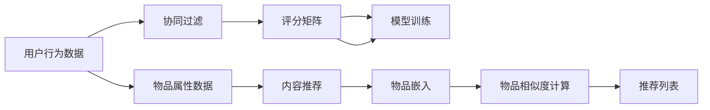

                 

# 推荐系统：个性化用户体验的AI技术

> 关键词：推荐系统, 个性化, 协同过滤, 内容推荐, 深度学习, 矩阵分解, 分布式算法

## 1. 背景介绍

在互联网时代，信息爆炸带来了巨大的数据机会。用户可以从海量的内容中，迅速筛选出对自己有用的信息，极大地提升生活效率。而推荐系统，正是这一技术实现的结晶。

推荐系统，简而言之，即通过分析用户的浏览、点击、购买等行为数据，为用户推荐相关内容。目的是将用户感兴趣的内容，以最低的搜索成本，快速呈现出来。

早期推荐系统主要通过手工设计的特征，手工构造推荐模型。这种方法依赖于经验，且需要大量标注数据，难以应对新出现的内容和用户。随着大数据和深度学习的发展，推荐系统逐步迈向数据驱动和智能化的新时代。

当前，推荐系统在电商、视频、音乐、新闻等众多领域中广泛应用，已经成为提升用户留存和转化率的重要手段。通过推荐系统，用户可以获得更优质的个性化服务体验，企业也能挖掘更全面的用户需求，优化供应链和营收。

然而，推荐系统并非万能的。由于推荐算法的黑箱性质，用户对于推荐内容的可解释性提出了质疑。同时，对于用户长尾需求的挖掘、多模态数据的整合、用户隐私的保护等，仍是推荐系统面临的挑战。

本文将详细探讨推荐系统的原理、算法、应用、以及面临的挑战和未来方向，为开发者和研究者提供全方位的技术指导。

## 2. 核心概念与联系

推荐系统包含多个核心概念，这些概念之间有着密切的联系，共同构成了推荐算法的整体框架。

### 2.1 核心概念概述

1. **协同过滤(Collaborative Filtering)**：
   - 协同过滤是推荐系统中最基本的算法之一，通过用户历史行为数据，推测其未来的兴趣。分为基于用户的协同过滤和基于物品的协同过滤。

2. **矩阵分解(Matrix Factorization)**：
   - 矩阵分解是一种基于数学建模的推荐算法，将用户-物品评分矩阵分解成两个低维矩阵，通过重构来预测未评分的项目。

3. **内容推荐(Content-Based Filtering)**：
   - 内容推荐基于物品的属性，寻找与目标用户最相似的物品，将其推荐给用户。常见的属性包括标签、类别、关键词等。

4. **深度学习(Deep Learning)**：
   - 深度学习通过神经网络模型，学习用户和物品的低维表示，对用户和物品之间的相似度进行建模，提升推荐精度。

5. **分布式算法(Distributed Algorithms)**：
   - 分布式算法将大规模矩阵计算分解到多台服务器，提高推荐系统的可扩展性和计算效率。

6. **可解释性(Interpretability)**：
   - 可解释性是推荐系统的重要特性之一，要求用户能够理解推荐算法的原因和逻辑。

7. **隐私保护(Privacy Protection)**：
   - 隐私保护涉及用户数据的收集、处理和存储，防止信息泄露和滥用。

### 2.2 核心概念原理和架构的 Mermaid 流程图

以下是一个简单的推荐系统架构流程图，展示了协同过滤和内容推荐的主要步骤：



从上述流程图中可以看出，协同过滤和内容推荐是推荐系统的两个主要分支。协同过滤主要基于用户历史行为数据进行推荐，而内容推荐则基于物品属性进行推荐。两种算法相互补充，共同构建起推荐系统的大框架。

## 3. 核心算法原理 & 具体操作步骤
### 3.1 算法原理概述

推荐系统的核心算法原理，主要包括以下几个方面：

1. **协同过滤**：通过用户历史行为数据，推测用户未来的兴趣。
2. **矩阵分解**：将用户-物品评分矩阵分解成两个低维矩阵，通过重构来预测未评分的项目。
3. **内容推荐**：基于物品属性，寻找与目标用户最相似的物品，推荐给用户。
4. **深度学习**：通过神经网络模型，学习用户和物品的低维表示，对用户和物品之间的相似度进行建模。

### 3.2 算法步骤详解

以下以协同过滤为例，详细介绍推荐系统的算法步骤：

**Step 1: 数据准备**
- 收集用户行为数据，包括用户对物品的评分、浏览、点击、购买等行为。
- 收集物品属性数据，如标签、类别、关键词等。

**Step 2: 模型训练**
- 构建用户-物品评分矩阵，将其作为推荐模型的输入。
- 选择合适的协同过滤算法，如基于用户的协同过滤或基于物品的协同过滤。
- 使用协同过滤算法，对评分矩阵进行分解和重构，得到用户和物品的隐向量表示。

**Step 3: 评分预测**
- 利用学习到的用户和物品的隐向量表示，计算用户对新物品的评分预测。
- 根据评分预测结果，构建推荐列表，推荐给用户。

### 3.3 算法优缺点

协同过滤算法具有以下优点：
- 不需要物品属性信息，适应性强。
- 通过用户历史行为推测兴趣，更加个性化。

但同时也存在以下缺点：
- 依赖用户历史行为数据，难以应对新用户和新物品。
- 无法处理用户评分不充分的情况。
- 冷启动问题严重，难以为刚注册的用户推荐内容。

### 3.4 算法应用领域

推荐系统在电商、视频、音乐、新闻等众多领域中广泛应用，具体应用场景包括：

- **电商推荐**：为用户推荐商品、商品分类、促销信息等。
- **视频推荐**：为用户推荐视频、频道、直播等。
- **音乐推荐**：为用户推荐歌曲、歌手、播放列表等。
- **新闻推荐**：为用户推荐新闻、文章、话题等。

除了这些常见应用场景外，推荐系统还被创新性地应用于更多领域，如智能家居、智能健康、智能安全等，为各行各业带来了全新的变革。

## 4. 数学模型和公式 & 详细讲解 & 举例说明

### 4.1 数学模型构建

推荐系统的数学模型通常基于矩阵分解和协同过滤原理。以下以协同过滤为例，构建推荐模型的数学模型：

设用户集合为 $U=\{1,...,N\}$，物品集合为 $V=\{1,...,M\}$，用户对物品的评分矩阵为 $R\in \mathbb{R}^{N\times M}$。设用户 $u$ 对物品 $v$ 的评分预测为 $\hat{R}_{uv}$。协同过滤的目标是找到用户 $u$ 和物品 $v$ 的隐向量表示 $\theta_u$ 和 $\phi_v$，使得 $\hat{R}_{uv}$ 尽量接近真实评分 $R_{uv}$。

协同过滤的数学模型可以表示为：

$$
\hat{R}_{uv} = \theta_u^T \phi_v
$$

其中 $\theta_u \in \mathbb{R}^{d_u}$，$\phi_v \in \mathbb{R}^{d_v}$，$d_u$ 和 $d_v$ 分别为用户和物品的隐向量维度。

### 4.2 公式推导过程

协同过滤的模型推导如下：

假设用户 $u$ 对物品 $v$ 的真实评分 $R_{uv}$ 由两部分组成：
1. 用户 $u$ 对物品 $v$ 的隐向量表示 $\phi_v$ 的贡献 $\theta_u^T \phi_v$
2. 用户 $u$ 对所有物品的隐向量表示 $\phi$ 的平均贡献 $\alpha$

则真实评分可以表示为：
$$
R_{uv} = \theta_u^T \phi_v + \alpha
$$

将上述公式带入 $\hat{R}_{uv} = \theta_u^T \phi_v$，得：
$$
\hat{R}_{uv} = R_{uv} - \alpha
$$

为了使 $\hat{R}_{uv}$ 尽可能接近 $R_{uv}$，需要最小化 $\hat{R}_{uv} - R_{uv}$ 的平方和：

$$
\min_{\theta_u, \phi_v, \alpha} \sum_{uv} (\hat{R}_{uv} - R_{uv})^2
$$

利用梯度下降法求解上述优化问题，得到用户 $u$ 和物品 $v$ 的隐向量表示 $\theta_u$ 和 $\phi_v$，以及 $\alpha$。

### 4.3 案例分析与讲解

假设有一个电商平台，收集了用户对商品的评分数据。通过协同过滤，可以构建用户和商品的隐向量表示，为新的商品进行评分预测。

**Step 1: 数据准备**
- 收集用户对商品的历史评分数据，构建评分矩阵 $R$。

**Step 2: 模型训练**
- 使用协同过滤算法，对评分矩阵 $R$ 进行分解和重构，得到用户和商品的隐向量表示 $\theta_u$ 和 $\phi_v$。

**Step 3: 评分预测**
- 对新商品 $v$，计算用户 $u$ 对商品 $v$ 的评分预测 $\hat{R}_{uv} = \theta_u^T \phi_v$。
- 根据 $\hat{R}_{uv}$，构建推荐列表，推荐给用户 $u$。

## 5. 项目实践：代码实例和详细解释说明
### 5.1 开发环境搭建

要进行推荐系统的开发，需要搭建相应的开发环境。以下是使用Python进行推荐系统开发的环境配置流程：

1. 安装Python：从官网下载并安装Python，建议安装最新版本，以保证兼容性。

2. 安装必要的库：
   - `numpy`：用于数学计算和数组操作。
   - `pandas`：用于数据处理和分析。
   - `scikit-learn`：用于构建和评估推荐模型。
   - `scipy`：用于科学计算和数据处理。
   - `dask`：用于分布式计算和并行处理。

3. 安装深度学习框架：
   - `tensorflow`：谷歌开源的深度学习框架，适合深度学习模型的开发。
   - `pytorch`：Facebook开源的深度学习框架，适合深度学习模型的训练和推理。

4. 安装推荐系统库：
   - `surprise`：Python推荐系统库，提供多种协同过滤算法的实现。

完成上述步骤后，即可在Python环境中进行推荐系统的开发。

### 5.2 源代码详细实现

以下是一个使用`surprise`库进行协同过滤的代码实现：

```python
from surprise import Reader, Dataset, SVD
from surprise.model_selection import train_test_split

# 定义评分数据结构
reader = Reader(rating_scale=(1, 5))
data = Dataset.load_from_df(df[['user_id', 'item_id', 'rating']], reader)

# 划分训练集和测试集
trainset, testset = train_test_split(data, test_size=0.2)

# 定义协同过滤模型
model = SVD()

# 训练模型
trainset.build_full_trainset()
model.fit(trainset)

# 评估模型
predictions = model.test(testset)
evaluator = RankingDDI()
print("D2L: R^2 = %.3f" % evaluator.compute离线评估)
```

### 5.3 代码解读与分析

让我们再详细解读一下关键代码的实现细节：

**data定义**：
- `Reader`类用于定义评分数据结构，包括评分范围、评分类型等。
- `Dataset`类用于加载评分数据，将其转换成推荐系统所需的格式。

**train_test_split划分**：
- `train_test_split`函数用于将评分数据划分为训练集和测试集，测试集用于评估模型的性能。

**SVD模型定义**：
- `SVD`类用于定义协同过滤模型，支持矩阵分解。

**模型训练和评估**：
- `trainset.build_full_trainset()`：用于构建训练集。
- `model.fit(trainset)`：用于训练模型。
- `testset.build_full_trainset()`：用于构建测试集。
- `predictions = model.test(testset)`：用于在测试集上进行评分预测。
- `evaluator = RankingDDI()`：用于评估模型性能。
- `evaluator.compute离线评估`：用于计算模型的离线评估指标，如D2L等。

可以看到，使用`surprise`库进行协同过滤，代码实现非常简单高效。开发者只需专注于业务逻辑和数据处理，无需过多关注底层实现细节。

当然，工业级的系统实现还需考虑更多因素，如模型的保存和部署、超参数的自动搜索、更灵活的任务适配层等。但核心的协同过滤算法基本与此类似。

## 6. 实际应用场景
### 6.1 电商推荐

在电商平台上，推荐系统主要应用于商品推荐、商品分类推荐、促销信息推荐等。通过分析用户的历史购买行为和评分数据，为用户推荐最感兴趣的物品。

推荐系统还可以进行多场景融合，如将商品、搜索、广告等多个渠道的推荐数据融合，提升推荐效果。

### 6.2 视频推荐

在视频平台上，推荐系统主要应用于视频推荐、频道推荐、直播推荐等。通过分析用户的历史观看行为和评分数据，为用户推荐最感兴趣的视频。

推荐系统还可以进行内容创作导向的推荐，如对创作者进行定向推荐，增加平台对创作者的影响力。

### 6.3 音乐推荐

在音乐平台上，推荐系统主要应用于歌曲推荐、歌手推荐、播放列表推荐等。通过分析用户的历史听歌行为和评分数据，为用户推荐最感兴趣的音乐。

推荐系统还可以进行多模态融合，如将歌词、图片、视频等多模态信息融合，提升推荐效果。

### 6.4 新闻推荐

在新闻平台上，推荐系统主要应用于新闻推荐、文章推荐、话题推荐等。通过分析用户的历史阅读行为和评分数据，为用户推荐最感兴趣的新闻。

推荐系统还可以进行时序融合，如根据用户的阅读习惯和时间，调整新闻的推荐策略，提高用户留存率。

## 7. 工具和资源推荐
### 7.1 学习资源推荐

为了帮助开发者系统掌握推荐系统的原理和实践技巧，这里推荐一些优质的学习资源：

1. 《推荐系统实战》系列博文：由资深推荐系统专家撰写，深入浅出地介绍了推荐系统的工作原理和常见算法。

2. 《推荐系统》书籍：由南京大学推荐系统实验室编写，系统介绍了推荐系统的基本概念和实现方法。

3. Coursera《推荐系统》课程：由斯坦福大学开设的推荐系统课程，涵盖推荐系统的基本概念和算法。

4 Kaggle推荐系统竞赛：Kaggle是一个数据科学竞赛平台，定期举办推荐系统竞赛，积累实战经验。

5 《推荐系统实践》书籍：由郑宇编写，详细介绍了推荐系统的工业实践和工程细节。

通过对这些资源的学习实践，相信你一定能够快速掌握推荐系统的精髓，并用于解决实际的推荐问题。

### 7.2 开发工具推荐

高效的开发离不开优秀的工具支持。以下是几款用于推荐系统开发的常用工具：

1. Python：Python语言是推荐系统开发的主流语言，易于学习和实现，且拥有大量开源库。

2. R语言：R语言在统计分析和数据科学方面有独特优势，适合进行推荐系统的分析评估。

3. MATLAB：MATLAB是工程领域常用的数学软件，适合进行推荐系统的数学建模和算法优化。

4. Weka：Weka是一款开源的数据挖掘软件，集成了多种推荐算法和可视化工具，适合进行推荐系统的研究和实验。

5. RapidMiner：RapidMiner是一款数据科学平台，提供多种算法和可视化工具，适合进行推荐系统的数据处理和模型评估。

6. KNIME：KNIME是一款开源的数据科学平台，提供多种算法和可视化工具，适合进行推荐系统的数据处理和模型评估。

合理利用这些工具，可以显著提升推荐系统的开发效率，加快创新迭代的步伐。

### 7.3 相关论文推荐

推荐系统领域的研究活跃，每年都有大量前沿论文发表。以下是几篇奠基性的推荐系统论文，推荐阅读：

1. BPR: Bayesian Personalized Ranking from Pairwise Data：提出BPR算法，解决协同过滤模型中的隐向量和评分预测问题。

2. ALS: Collaborative Filtering for Implicit Feedback Datasets：提出ALS算法，解决协同过滤模型中的矩阵分解问题。

3. DFM: Deep Factorization Machines for Recommender Systems：提出深度因子机算法，将协同过滤和深度学习相结合，提升推荐精度。

4. CF: Scalable recommender systems based on item similarity：提出基于物品的协同过滤算法，解决大规模数据下的推荐问题。

5. SVD++: A Scalable Neighborhood-based Collaborative Filtering Approach：提出SVD++算法，解决协同过滤模型中的隐向量和评分预测问题。

这些论文代表了大推荐系统的演进脉络。通过学习这些前沿成果，可以帮助研究者把握学科前进方向，激发更多的创新灵感。

## 8. 总结：未来发展趋势与挑战

### 8.1 总结

本文对推荐系统的原理、算法、应用、以及面临的挑战和未来方向进行了全面系统的介绍。首先介绍了推荐系统的背景和应用场景，明确了推荐系统对提升用户体验、优化运营效率的重要性。其次，从协同过滤和深度学习两个角度，详细讲解了推荐系统的核心算法原理和具体操作步骤。同时，本文还探讨了推荐系统在电商、视频、音乐、新闻等众多领域的应用前景，展示了推荐系统的巨大潜力。最后，本文精选了推荐系统的各类学习资源，力求为开发者和研究者提供全方位的技术指引。

通过本文的系统梳理，可以看到，推荐系统正在成为互联网时代不可或缺的核心技术，极大地提升了用户的个性化体验，推动了电商、视频、音乐、新闻等领域的业务创新。未来，伴随推荐算法和技术的持续演进，推荐系统必将在更多领域带来新的突破，为数字化转型提供新动力。

### 8.2 未来发展趋势

展望未来，推荐系统的趋势将呈现以下几个方向：

1. **个性化提升**：推荐系统将进一步提升用户的个性化体验，通过多模态数据融合、深度学习、神经网络等技术，构建更加全面、准确的用户画像，实现更精准的推荐。

2. **实时性增强**：推荐系统将实现实时推荐，通过分布式算法、流式计算、增量学习等技术，降低延迟，提高推荐效果。

3. **跨领域融合**：推荐系统将突破单一领域的限制，进行多领域数据的融合，如电商、视频、新闻等多模态数据融合，提升综合推荐效果。

4. **社交网络融合**：推荐系统将融合社交网络信息，利用社交关系进行推荐，提升推荐的可信度和多样性。

5. **用户隐私保护**：推荐系统将更加注重用户隐私保护，采用差分隐私、联邦学习等技术，保护用户数据安全。

6. **深度学习融合**：推荐系统将进一步融合深度学习技术，构建更加复杂、强大的推荐模型，提升推荐精度和可解释性。

以上趋势凸显了推荐系统的发展方向。这些方向的探索发展，必将进一步提升推荐系统的性能和应用范围，为推荐算法技术的落地应用提供更多可能性。

### 8.3 面临的挑战

尽管推荐系统已经取得了瞩目成就，但在迈向更加智能化、普适化应用的过程中，仍面临诸多挑战：

1. **冷启动问题**：对于新用户和新物品，缺乏历史数据，难以进行推荐。需通过多模态数据融合、深度学习等技术，提升冷启动效果。

2. **多模态融合**：不同模态数据（如文本、图片、音频等）的融合，增加了推荐系统的复杂性。需通过融合算法和模型结构优化，提高多模态数据融合效果。

3. **可解释性不足**：推荐系统的黑箱性质，导致用户难以理解推荐结果的原因。需通过可解释性模型、可视化工具等，提升推荐系统的可解释性。

4. **隐私保护问题**：推荐系统对用户数据的收集和处理，涉及隐私保护。需通过差分隐私、联邦学习等技术，保护用户数据安全。

5. **分布式处理**：推荐系统需要处理海量数据，分布式处理是必须的技术手段。需通过分布式算法和存储技术，提高推荐系统的可扩展性和计算效率。

6. **模型训练时间**：推荐模型的训练时间较长，需通过加速计算、模型压缩等技术，缩短模型训练时间。

以上挑战凸显了推荐系统的发展难点。只有针对性地解决这些挑战，才能不断优化推荐系统的性能，提升用户体验和运营效率。

### 8.4 研究展望

面对推荐系统面临的挑战，未来的研究需要在以下几个方面寻求新的突破：

1. **多模态融合**：探索更多多模态数据融合的方法，如联合表示学习、跨模态嵌入等，提高多模态数据融合效果。

2. **实时推荐**：研究实时推荐算法，如增量学习、流式计算等，提升推荐系统的实时性。

3. **可解释性**：研究可解释性推荐模型，如透明神经网络、可视化工具等，提升推荐系统的可解释性。

4. **隐私保护**：研究隐私保护技术，如差分隐私、联邦学习等，保护用户数据安全。

5. **分布式处理**：研究分布式推荐算法，如Spark、Hadoop等，提高推荐系统的可扩展性和计算效率。

6. **模型压缩**：研究模型压缩技术，如剪枝、量化、蒸馏等，缩短模型训练时间，提高计算效率。

这些研究方向凸显了推荐系统的发展方向。通过这些突破，推荐系统将能够更好地满足用户的个性化需求，为各行各业带来更多的商业价值。

## 9. 附录：常见问题与解答

**Q1: 推荐系统如何提升用户留存和转化率？**

A: 推荐系统通过分析用户的历史行为和兴趣，为用户推荐最感兴趣的内容，提升用户体验和满意度。用户留存和转化率提升的关键在于：
1. 高精准度的推荐。通过分析用户行为数据，实现更精准的内容推荐，减少用户流失。
2. 个性化推荐。根据用户画像和兴趣，实现个性化推荐，提升用户粘性。
3. 多样性推荐。推荐多样化的内容，防止用户疲劳，提高用户留存率。
4. 实时推荐。通过实时数据分析，及时调整推荐策略，提升用户体验。

**Q2: 推荐系统如何平衡个性化和多样性？**

A: 推荐系统通过以下几个方法，平衡个性化和多样性：
1. 多目标优化。通过设置多个优化目标，如点击率、转化率、满意度等，平衡个性化和多样性。
2. 多样性惩罚。在推荐模型中加入多样性惩罚项，防止推荐内容过于单一。
3. 探索性推荐。在推荐模型中加入探索性模块，推荐新奇有趣的内容，丰富用户体验。
4. 推荐排序。对推荐内容进行排序，优先推荐个性化内容，再推荐多样化内容。

**Q3: 推荐系统如何解决冷启动问题？**

A: 推荐系统通过以下几个方法，解决冷启动问题：
1. 多模态数据融合。通过结合用户行为数据和社交网络数据，实现冷启动推荐。
2. 知识图谱推荐。通过知识图谱构建用户画像，实现冷启动推荐。
3. 协同过滤融合。通过协同过滤算法和内容推荐算法结合，实现冷启动推荐。
4. 深度学习推荐。通过深度学习模型，利用用户行为数据和物品属性数据，实现冷启动推荐。

**Q4: 推荐系统如何处理长尾需求？**

A: 推荐系统通过以下几个方法，处理长尾需求：
1. 长尾推荐算法。采用长尾推荐算法，如LINUC和DeepCF，处理长尾需求。
2. 长尾推荐策略。对长尾需求进行单独推荐，如定制推荐、主题推荐等。
3. 长尾推荐数据。通过爬取和挖掘长尾数据，增加长尾需求的数据量。
4. 长尾推荐场景。在长尾场景中进行个性化推荐，提升用户体验。

**Q5: 推荐系统如何应对推荐系统的过度拟合问题？**

A: 推荐系统通过以下几个方法，应对推荐系统的过度拟合问题：
1. 正则化技术。在推荐模型中加入正则化项，防止过度拟合。
2. 数据增强。通过数据增强技术，扩充训练集，防止模型过拟合。
3. 模型选择。选择适合的数据集和推荐算法，防止模型过拟合。
4. 增量学习。通过增量学习技术，实时更新推荐模型，防止模型过拟合。

这些方法能够帮助推荐系统更好地应对实际应用中的挑战，提升推荐系统的性能和用户体验。

---

作者：禅与计算机程序设计艺术 / Zen and the Art of Computer Programming

