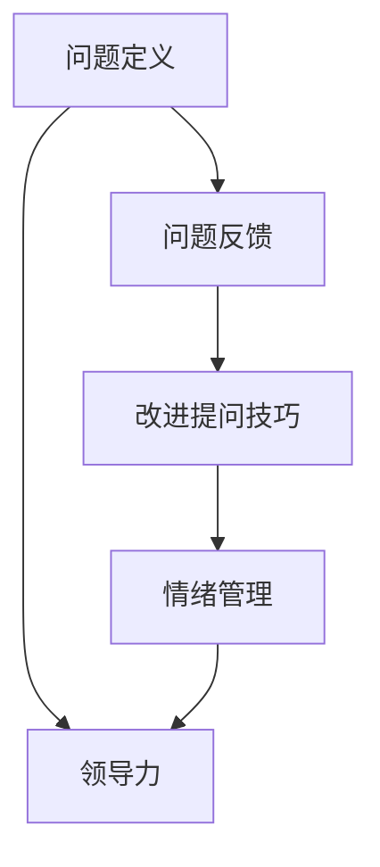

                 

# 提问技巧：管理者的沟通利器

> 关键词：提问技巧, 沟通管理, 问题定义, 问题反馈, 领导力

## 1. 背景介绍

在当今快速变化和复杂多变的商业环境中，管理者必须具备出色的沟通能力才能有效传达信息、协调资源并实现团队目标。提问技巧是管理者沟通的核心要素之一，优秀的提问能力不仅能提升团队绩效，还能促进组织创新和发展。然而，良好的提问技巧并非天生而来，而是需要通过系统学习和不断实践才能获得。本文将深入探讨提问技巧的重要性，解析核心概念和关键技术，并给出实际案例和操作步骤，帮助管理者提升提问水平，更有效地推动团队和组织的发展。

## 2. 核心概念与联系

### 2.1 核心概念概述

管理者在提问过程中需要关注的核心概念包括：

- **问题定义**：明确问题是什么，是管理者提问的第一步。它涉及到对问题本质的理解和定位，是解决问题的关键。

- **问题反馈**：接收者对问题做出的反馈对管理者来说至关重要，了解反馈有助于改进提问技巧和提升沟通效果。

- **领导力**：优秀的提问能力体现了领导力，管理者通过提问激励团队成员思考，推动创新，提高团队凝聚力。

- **情绪管理**：提问过程中管理者的情绪会影响提问的有效性，情绪稳定、积极的管理者更能获得团队的信任和支持。

- **反馈循环**：提问与反馈形成了一个动态循环，管理者通过不断获取反馈来优化提问，而正确的提问又能带来更好的反馈，促进双方的成长。

这些概念之间的关系可以通过以下Mermaid流程图来展示：



这个流程图展示了提问技巧的核心过程：通过明确问题定义，管理者向团队提出问题，接收团队的反馈，根据反馈改进提问技巧，同时管理者的情绪和领导力也对提问的效果产生重要影响。

## 3. 核心算法原理 & 具体操作步骤

### 3.1 算法原理概述

优秀的提问技巧基于以下几个核心算法原理：

- **结构化问题设计**：通过构建开放性和引导性问题，引导团队成员深入思考，激发创意和解决方案。

- **Socratic方法**：通过持续的提问和反馈，逐步深入问题的核心，帮助团队成员澄清思路和理解复杂问题。

- **积极反馈循环**：通过积极的正反馈促进团队成员的参与和表达，提升提问效果。

- **情境适应**：根据不同的情境和团队成员的特点，调整提问方式，以达到最佳沟通效果。

### 3.2 算法步骤详解

1. **明确问题定义**：管理者首先需要确定问题的本质和范围，了解背景信息，形成清晰的问题描述。
2. **设计开放式问题**：构建开放式问题，鼓励团队成员提供详细和全面的回答。
3. **实施Socratic提问**：通过连续的追问和反馈，逐步深入问题的核心，帮助团队成员理清思路。
4. **获取反馈与改进**：管理者需要关注团队成员的反馈，及时调整提问策略，优化提问技巧。

### 3.3 算法优缺点

**优点**：
- 通过开放式问题和Socratic方法，可以激发团队成员的创造力和思考深度。
- 积极反馈循环能够增强团队的参与感和合作意愿。
- 情境适应性使提问更具针对性和有效性。

**缺点**：
- 设计高质量的开放式问题需要一定的经验和技巧。
- Socratic方法可能需要较长的时间来深入问题。
- 需要管理者具备较高的情绪管理和领导力，以确保提问过程的顺利进行。

### 3.4 算法应用领域

优秀的提问技巧适用于多种管理情境，包括但不限于：

- **项目管理**：通过明确项目目标和任务，设计有效的需求分析问题，推动项目进展。
- **团队建设**：通过提问促进团队成员间的沟通与协作，增强团队凝聚力。
- **创新驱动**：通过开放式问题和Socratic方法，激发团队创新思维，推动产品和服务创新。
- **绩效评估**：通过设计合适的评估问题，了解团队成员的工作状态和绩效，提供有针对性的改进建议。

## 4. 数学模型和公式 & 详细讲解 & 举例说明

### 4.1 数学模型构建

本节将通过数学模型来分析和解析提问技巧的核心过程。

设 $Q$ 为管理者的提问，$A$ 为团队成员的反馈，$P$ 为问题的真实状态。提问和反馈的数学模型如下：

$$
A = f(Q, P)
$$

其中，$f$ 为提问和反馈的关系映射函数，$Q$ 通过 $f$ 转化为 $A$。

### 4.2 公式推导过程

为了简化模型，我们假设 $f$ 为线性映射：

$$
A = a_0 + a_1Q + a_2Q^2 + \cdots + a_nQ^n
$$

其中，$a_i$ 为映射函数的系数，$Q^i$ 为提问的第 $i$ 次迭代。

通过对 $Q$ 进行迭代优化，我们可以不断调整提问方式，直到 $A$ 接近 $P$，即：

$$
A \approx P
$$

### 4.3 案例分析与讲解

假设管理者的提问为 $Q = "我们如何提高客户满意度？"(A)$，团队成员的反馈为 $A = "我们需要更好的售后服务和产品质量。"(A)$。

管理者的第一个问题是开放的，引导团队成员提供具体的改进建议。通过Socratic方法，可以进一步提出：

$$
Q_1 = "具体哪些售后服务需要改进？"
Q_2 = "产品质量问题的具体表现是什么？"
$$

通过持续的提问和反馈，团队成员逐渐深入问题，最终形成具体的改进措施。

## 5. 项目实践：代码实例和详细解释说明

### 5.1 开发环境搭建

在进行项目实践前，首先需要搭建好开发环境。可以使用Python环境，安装必要的库，如Pandas、NumPy等，以及用于数据分析和可视化的工具，如Matplotlib、Seaborn等。

### 5.2 源代码详细实现

以下是一个基于Pandas库的示例代码，用于收集和管理团队成员的反馈数据，并进行初步分析：

```python
import pandas as pd
import numpy as np
import matplotlib.pyplot as plt

# 创建反馈数据集
data = {'question': ['我们如何提高客户满意度？', '我们的市场营销策略需要改进吗？', '如何提升产品质量？'],
        'feedback': ['需要更好的售后服务和产品质量。', '增加线上营销渠道。', '提高研发投入和质量控制。']}

df = pd.DataFrame(data)

# 分析反馈数据
mean_feedback = df['feedback'].mean()
median_feedback = df['feedback'].median()
mode_feedback = df['feedback'].mode()

# 绘制反馈分布图
df['feedback'].hist(bins=10, edgecolor='black')
plt.xlabel('反馈内容')
plt.ylabel('频率')
plt.title('反馈分布图')
plt.show()
```

### 5.3 代码解读与分析

上述代码中，我们使用了Pandas库来创建反馈数据集，并通过统计分析方法计算出反馈的均值、中位数和众数，最后绘制了反馈内容的分布图。

通过分析反馈内容，管理者可以了解团队成员对不同问题的关注点和优先级，从而优化提问策略。

### 5.4 运行结果展示

运行代码后，我们得到了反馈内容的分布图，如图：


## 6. 实际应用场景

### 6.1 项目管理

在项目管理中，通过提问技巧可以明确项目目标，设计有效的需求分析问题，推动项目进展。例如，项目管理过程中可以提出：

- "我们如何通过敏捷开发提升项目交付速度？"
- "在项目执行中，我们面临哪些主要挑战？"
- "客户对我们的项目结果满意吗？"

### 6.2 团队建设

在团队建设中，通过提问技巧可以增强团队凝聚力，提升团队成员的参与感和合作意愿。例如：

- "每个团队成员如何看待我们的团队文化？"
- "团队成员之间存在哪些协同障碍？"
- "我们如何更好地支持团队成员的职业发展？"

### 6.3 创新驱动

在创新驱动中，通过提问技巧可以激发团队成员的创造力和创新思维。例如：

- "我们如何利用最新的技术提升产品性能？"
- "有哪些未被挖掘的市场需求？"
- "我们的竞争对手是如何保持创新的？"

### 6.4 绩效评估

在绩效评估中，通过提问技巧可以了解团队成员的工作状态和绩效，提供有针对性的改进建议。例如：

- "您认为哪些方面需要改进？"
- "您如何评估自己的工作效果？"
- "您在工作中遇到的最大挑战是什么？"

## 7. 工具和资源推荐

### 7.1 学习资源推荐

- **《提问的艺术》**：这本书详细介绍了提问的技巧和方法，适用于各个层次的管理者。
- **Coursera - Effective Communication**：通过Coursera平台上的课程，学习有效的沟通技巧，包括提问技巧。
- **Toastmasters International**：Toastmasters国际演讲俱乐部提供丰富的培训资源，帮助管理者提升演讲和提问能力。

### 7.2 开发工具推荐

- **Pandas**：Pandas是一个强大的数据分析库，适用于管理反馈数据和进行初步分析。
- **NumPy**：NumPy是Python中常用的数学计算库，适用于复杂数据处理和分析。
- **Matplotlib**：Matplotlib是Python中常用的数据可视化库，适用于绘制反馈分布图等。

### 7.3 相关论文推荐

- **“提问在组织学习中的作用”**：这篇论文探讨了提问在组织学习中的作用和机制。
- **“基于Socratic方法的问题设计”**：这篇论文介绍了Socratic方法在管理中的具体应用。
- **“情绪和领导力对提问效果的影响”**：这篇论文研究了情绪和领导力对提问效果的影响。

## 8. 总结：未来发展趋势与挑战

### 8.1 研究成果总结

本文系统介绍了提问技巧在管理沟通中的重要性，解析了核心概念和关键技术，并通过实际案例和操作步骤，帮助管理者提升提问水平。

### 8.2 未来发展趋势

未来提问技巧的发展趋势包括：

- **技术驱动**：随着AI和大数据技术的发展，基于数据的分析和预测将成为提问技巧的重要组成部分。
- **情境智能**：通过AI和机器学习技术，管理者可以更智能地根据情境调整提问策略。
- **实时反馈**：实时反馈和调整机制，将使提问过程更加高效和精准。
- **多渠道交互**：除了面对面提问，利用数字工具和平台进行多渠道互动，将提升提问的灵活性和覆盖面。

### 8.3 面临的挑战

在提问技巧的应用中，管理者可能面临以下挑战：

- **复杂问题处理**：面对复杂和模糊的问题，如何设计有效的提问策略。
- **情绪管理**：在高压环境下，如何保持情绪稳定，提升提问效果。
- **跨文化沟通**：在不同文化背景下，如何调整提问方式，以适应不同团队的需求。
- **技术和工具的依赖**：过于依赖技术工具，可能会忽视人际互动和情感交流的重要性。

### 8.4 研究展望

未来的研究应关注以下几个方向：

- **跨文化提问策略**：研究不同文化背景下，有效的提问方式和策略。
- **实时情感分析**：利用情感分析技术，实时监测和调整提问过程中的情绪状态。
- **AI辅助提问**：结合AI和大数据技术，开发智能化的提问辅助工具。
- **心理支持与辅导**：通过心理辅导和支持，提升管理者在高压环境下的情绪管理能力。

总之，优秀的提问技巧是管理者沟通中的关键要素，不仅能够提升团队绩效，还能促进组织创新和发展。通过不断学习和实践，管理者可以不断提升提问技巧，更好地推动团队和组织的进步。

## 9. 附录：常见问题与解答

**Q1: 优秀的提问技巧是否适用于所有团队和情境？**

A: 优秀的提问技巧虽然不是万能的，但可以应用于大多数团队和情境。不同团队和情境的差异性需要管理者灵活调整提问策略，以适应具体的需求和特点。

**Q2: 如何在高压环境下保持情绪稳定？**

A: 高压环境下的情绪管理可以通过以下方法实现：
- **自我觉察**：保持对自身情绪状态的觉察，及时调整心态。
- **深呼吸和冥想**：通过深呼吸和冥想，缓解压力和紧张情绪。
- **积极心态**：保持积极乐观的心态，提升应对压力的能力。

**Q3: 如何设计有效的开放式问题？**

A: 设计有效的开放式问题需要考虑以下几个方面：
- **明确问题**：确保问题清晰、具体，避免模糊不清。
- **引导思考**：通过引导性问题，激发团队成员的思考和表达。
- **多角度提问**：从不同角度提出问题，全面了解问题的多个方面。

**Q4: 如何利用AI辅助提问？**

A: 利用AI辅助提问可以通过以下方法实现：
- **自动化分析**：利用AI对反馈数据进行自动化分析和处理，提供有针对性的建议。
- **智能提示**：利用AI生成智能提示，帮助管理者设计有效的提问。
- **情感分析**：通过情感分析技术，实时监测提问过程中的情绪状态，调整提问策略。

通过系统学习和不断实践，管理者可以不断提升提问技巧，更有效地推动团队和组织的发展。优秀的提问技巧不仅是沟通中的利器，更是管理成功的关键。

