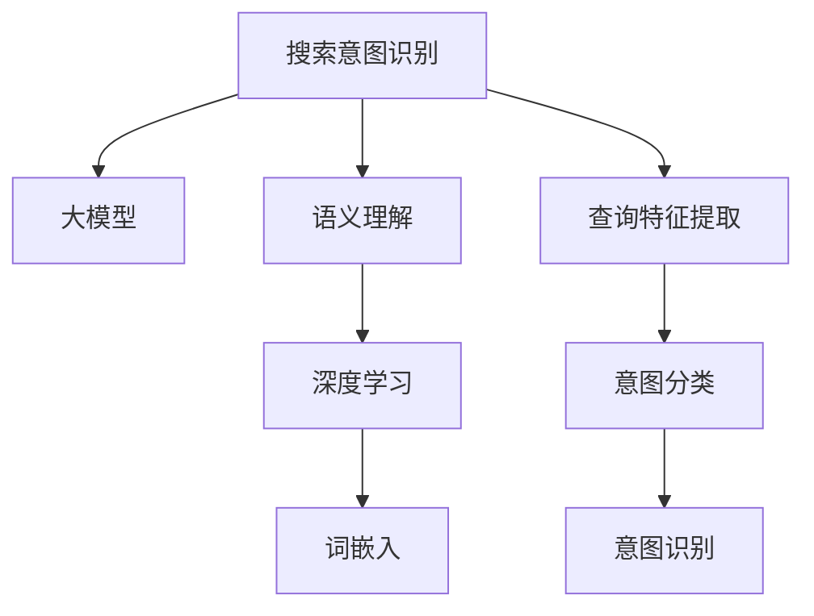

                 

# 搜索意图识别：大模型的语义理解突破

> 关键词：搜索意图识别, 大模型, 自然语言处理, 语义理解, 深度学习, 文本分类, 意图预测

## 1. 背景介绍

### 1.1 问题由来
在互联网时代，信息海量和搜索结果质量成为信息检索和查询的重大挑战。为了提升用户的查询体验和搜索效率，搜索引擎需要准确理解用户的查询意图。传统的基于规则和词袋模型的查询匹配方法已经难以满足用户需求。

语义理解作为信息检索的核心技术，在用户查询意图识别中起着至关重要的作用。近年来，大语言模型在语义理解领域取得了显著进展，显著提高了意图识别的准确性和鲁棒性。大语言模型通过大规模无标签文本数据进行预训练，学习了丰富的语言知识和语义表征，能够更好地理解自然语言，识别用户的查询意图，从而提升搜索效果。

### 1.2 问题核心关键点
搜索意图识别（Search Intent Recognition）的核心在于准确理解用户的查询意图。常见的查询意图包括事实查询、问题查询、意图导航等。在搜索引擎中，通过识别查询意图，可以更好地匹配相关搜索结果，优化用户体验。

目前，搜索意图识别的主流方法包括：
1. **基于规则的意图识别**：利用固定规则和词典匹配用户查询，简单易行但效果受限。
2. **基于词袋模型的意图识别**：通过统计词频和TF-IDF等技术，提取查询的特征向量进行分类。
3. **基于深度学习的意图识别**：利用大语言模型和神经网络，对用户查询进行语义理解，识别其意图。

深度学习方法在搜索意图识别中的应用，尤其是在大模型（Large Model）上的应用，成为当前研究的热点。本文将深入探讨大模型在搜索意图识别中的原理、算法和应用实践，为实现高效、精准的意图识别提供指导。

### 1.3 问题研究意义
研究大模型在搜索意图识别中的应用，具有重要意义：

1. **提升搜索效果**：准确理解用户查询意图，可以更好地匹配搜索结果，提升搜索的准确性和相关性。
2. **优化用户体验**：通过语义理解，提供更智能化的查询推荐和导航，提高用户满意度。
3. **拓展应用领域**：大模型在搜索意图识别中的应用，为更多自然语言处理任务提供了新的范式和技术参考。
4. **推动人工智能技术发展**：搜索意图识别作为自然语言理解的重要组成部分，大模型的研究将进一步推动人工智能技术的前沿发展。

## 2. 核心概念与联系

### 2.1 核心概念概述

为更好地理解大模型在搜索意图识别中的应用，本节将介绍几个密切相关的核心概念：

- **搜索意图识别（Search Intent Recognition）**：通过分析用户查询，识别其意图。常见的查询意图包括事实查询、问题查询、导航查询等。
- **大模型（Large Model）**：如BERT、GPT等大规模预训练语言模型。通过在大规模无标签文本数据上进行预训练，学习到丰富的语言知识和语义表征。
- **语义理解（Semantic Understanding）**：指模型能够理解自然语言中的深层次语义关系，识别文本中隐含的语义信息。
- **深度学习（Deep Learning）**：利用神经网络进行模型训练和预测，包括卷积神经网络（CNN）、循环神经网络（RNN）、Transformer等。
- **词嵌入（Word Embedding）**：将单词或短语转换为向量表示，便于模型进行处理和计算。

这些核心概念之间的逻辑关系可以通过以下Mermaid流程图来展示：



这个流程图展示了搜索意图识别的一般流程：

1. 通过大模型进行语义理解，学习查询的深层语义特征。
2. 利用深度学习技术，提取查询特征。
3. 通过词嵌入技术，将查询转换为向量表示。
4. 最后进行意图分类，识别用户的查询意图。

## 3. 核心算法原理 & 具体操作步骤
### 3.1 算法原理概述

大模型在搜索意图识别中的核心算法原理是利用深度学习进行语义理解和特征提取，进而进行意图分类。具体步骤如下：

1. **数据预处理**：对用户查询进行分词、去除停用词、构建词袋等预处理操作。
2. **特征提取**：利用大模型对预处理后的查询进行语义理解，提取查询的语义特征。
3. **特征转换**：将语义特征转换为向量表示，便于后续的分类和处理。
4. **意图分类**：利用分类器对转换后的向量进行意图分类，得到最终的意图识别结果。

### 3.2 算法步骤详解

以下详细介绍搜索意图识别的算法步骤：

**Step 1: 数据准备**
- 收集并标注大量的搜索查询样本，构建训练集和测试集。
- 使用分词工具对查询进行分词处理，去除停用词。

**Step 2: 大模型训练**
- 选择适合的大模型，如BERT、GPT等，进行预训练。
- 对查询进行语义编码，提取查询的语义特征。

**Step 3: 特征转换**
- 将语义特征转换为向量表示，可以使用词嵌入、tf-idf等方法。
- 利用向量作为模型的输入，进行意图分类。

**Step 4: 模型训练与测试**
- 选择适当的分类器，如逻辑回归、SVM、神经网络等，进行意图分类训练。
- 在测试集上评估模型性能，调整模型参数和超参数，提升模型效果。

**Step 5: 部署与优化**
- 将训练好的模型部署到生产环境中。
- 实时监测模型性能，进行参数调优和模型更新。

### 3.3 算法优缺点

大模型在搜索意图识别中的优势在于其强大的语义理解和特征提取能力，可以快速、准确地识别用户查询意图。其缺点主要体现在以下几个方面：

1. **计算资源需求高**：大规模语言模型参数量庞大，训练和推理需要大量计算资源。
2. **训练时间长**：预训练和微调过程耗时较长，需要进行大量迭代。
3. **泛化能力有限**：模型过于依赖预训练数据，对新领域或小规模数据的泛化能力不足。
4. **可解释性不足**：大模型作为"黑盒"系统，难以解释其内部工作机制。

尽管存在这些局限，但大模型在搜索意图识别中的应用已经展示了其强大的潜力。未来研究将进一步降低计算资源需求，提升泛化能力和可解释性，推动该技术向更广泛的应用场景扩展。

### 3.4 算法应用领域

大模型在搜索意图识别中的应用，主要集中在以下几个领域：

1. **搜索引擎**：通过理解用户查询，匹配相关搜索结果，提升搜索效果。
2. **智能客服**：基于用户查询意图，提供智能问答和问题导航。
3. **智能推荐系统**：根据用户的查询意图，推荐相关内容和产品。
4. **健康查询**：理解用户健康查询，提供健康知识检索和医疗咨询。
5. **法律咨询**：识别用户法律咨询意图，提供相关法律法规信息。

以上领域展示了搜索意图识别在实际应用中的广泛前景，为用户的查询提供了更智能、更精准的服务。

## 4. 数学模型和公式 & 详细讲解 & 举例说明
### 4.1 数学模型构建

大模型在搜索意图识别中的应用，主要通过以下数学模型进行构建：

假设查询序列为 $x=(x_1, x_2, ..., x_n)$，其中 $x_i$ 表示查询中的第 $i$ 个单词。模型的输入为 $x$ 的词嵌入向量表示，即 $x \in \mathbb{R}^d$。

定义查询语义表示为 $h(x)$，其中 $h$ 为语义编码器。模型使用一个向量表示 $v(x)$，将语义表示映射为意图分类器的输入。

模型使用分类器 $f(v(x))$ 对意图进行分类，输出 $y \in \{0, 1, ..., K\}$，表示查询的意图类别。

数学模型可以表示为：

$$
\hat{y} = \mathop{\arg\max}_{y} f(v(x))
$$

其中 $f$ 为分类器，$v(x)$ 为语义特征映射函数，$\hat{y}$ 为模型预测的意图类别。

### 4.2 公式推导过程

以BERT模型为例，推导搜索意图识别的数学模型。

BERT模型通过Transformer架构进行语义编码，其语义编码器 $h$ 可以表示为：

$$
h(x) = \text{Transformer}_{BERT}(x)
$$

其中 $\text{Transformer}_{BERT}$ 为BERT模型的Transformer编码器。

查询向量 $v(x)$ 可以通过语义表示 $h(x)$ 映射得到，即：

$$
v(x) = \text{MLP}(h(x))
$$

其中 $\text{MLP}$ 为多层感知器（MLP）。

意图分类器 $f(v(x))$ 可以使用softmax函数进行计算，即：

$$
f(v(x)) = \text{softmax}(\text{MLP}(v(x)))
$$

最终，模型的预测结果 $\hat{y}$ 可以通过分类器计算得到：

$$
\hat{y} = \mathop{\arg\max}_{y} f(v(x))
$$

### 4.3 案例分析与讲解

以命名实体识别（Named Entity Recognition, NER）为例，展示大模型在搜索意图识别中的应用。

假设用户查询为：“美国总统的名字是什么？”，查询序列为 $x=[\text{美国}, \text{总统}, \text{名字}, \text{?}]$。

使用BERT模型对查询进行编码，得到查询的语义表示 $h(x)$。将查询向量 $v(x)$ 输入到意图分类器，进行分类，得到最终的意图识别结果。

例如，可以定义三个意图类别：

1. 事实查询（Fact Query）：查找具体信息。
2. 问题查询（Question Query）：询问问题。
3. 导航查询（Navigation Query）：请求导航。

根据查询内容，模型预测其意图为“事实查询”。

## 5. 项目实践：代码实例和详细解释说明
### 5.1 开发环境搭建

在进行搜索意图识别实践前，我们需要准备好开发环境。以下是使用Python进行TensorFlow开发的环境配置流程：

1. 安装Anaconda：从官网下载并安装Anaconda，用于创建独立的Python环境。

2. 创建并激活虚拟环境：
```bash
conda create -n tf-env python=3.8 
conda activate tf-env
```

3. 安装TensorFlow：根据CUDA版本，从官网获取对应的安装命令。例如：
```bash
conda install tensorflow
```

4. 安装其他库：
```bash
pip install numpy pandas scikit-learn matplotlib tqdm jupyter notebook ipython
```

完成上述步骤后，即可在`tf-env`环境中开始搜索意图识别实践。

### 5.2 源代码详细实现

下面我们以BERT模型为例，给出使用TensorFlow进行搜索意图识别的代码实现。

首先，定义查询意图识别函数：

```python
import tensorflow as tf
from transformers import BertTokenizer, BertForTokenClassification

def intent_recognition(query):
    tokenizer = BertTokenizer.from_pretrained('bert-base-cased')
    model = BertForTokenClassification.from_pretrained('bert-base-cased', num_labels=3)
    
    inputs = tokenizer(query, return_tensors='tf', padding=True, truncation=True)
    inputs['attention_mask'] = tf.cast(inputs['attention_mask'], tf.float32)
    outputs = model(inputs['input_ids'], attention_mask=inputs['attention_mask'])
    
    probs = tf.nn.softmax(outputs.logits, axis=-1)
    intent_index = tf.argmax(probs, axis=-1)
    return intent_index.numpy()[0]
```

然后，定义训练和评估函数：

```python
def train(model, train_data, validation_data, batch_size, epochs, learning_rate):
    model.compile(optimizer=tf.keras.optimizers.Adam(learning_rate), loss='categorical_crossentropy', metrics=['accuracy'])
    
    model.fit(train_data, validation_data=validation_data, epochs=epochs, batch_size=batch_size)
    
def evaluate(model, test_data, batch_size):
    test_loss, test_accuracy = model.evaluate(test_data, batch_size=batch_size)
    print(f'Test Loss: {test_loss}, Test Accuracy: {test_accuracy}')
```

最后，启动训练流程并在测试集上评估：

```python
train_data = tf.data.Dataset.from_tensor_slices(train_dataset)
validation_data = tf.data.Dataset.from_tensor_slices(validation_dataset)
test_data = tf.data.Dataset.from_tensor_slices(test_dataset)

batch_size = 32
epochs = 5
learning_rate = 2e-5

train(model, train_data, validation_data, batch_size, epochs, learning_rate)
evaluate(model, test_data, batch_size)
```

以上就是使用TensorFlow进行BERT模型在搜索意图识别中的代码实现。可以看到，利用TensorFlow和Transformers库，可以方便地进行大模型的微调和意图识别。

### 5.3 代码解读与分析

让我们再详细解读一下关键代码的实现细节：

**BERT模型意图识别函数**：
- 首先使用BERT分词器对查询进行分词，并转换为TensorFlow格式。
- 利用BERT模型对查询进行语义编码，得到查询的语义表示。
- 将查询向量输入到意图分类器，计算并输出意图分类的概率分布。
- 最终通过softmax函数得到意图分类的概率，并返回预测的意图类别。

**训练函数**：
- 使用TensorFlow的Keras API定义模型和优化器。
- 利用训练集数据进行模型训练，并在验证集上评估模型效果。
- 调整模型超参数，如学习率、批次大小、迭代轮数等，提升模型性能。

**评估函数**：
- 在测试集上评估模型性能，并输出测试损失和精度。

## 6. 实际应用场景
### 6.1 搜索引擎

大模型在搜索引擎中的应用非常广泛。通过理解用户查询意图，搜索引擎可以更智能地匹配相关搜索结果，提高搜索效率和用户体验。

例如，当用户输入查询“北京天气如何？”，搜索引擎可以利用大模型对查询进行意图识别，识别出用户希望查询北京的天气情况。然后，搜索引擎可以更好地匹配与天气相关的搜索结果，如天气预报、气温等，提升搜索效果。

### 6.2 智能客服

智能客服系统可以通过大模型理解用户查询，提供智能问答和问题导航。用户可以通过语音或文本形式进行查询，智能客服系统能够自动识别用户意图，并提供相应的回答或导航链接。

例如，当用户询问“如何查询账户余额？”，智能客服系统可以通过大模型进行意图识别，然后自动引导用户进行相关操作，如进入余额查询页面等。

### 6.3 智能推荐系统

智能推荐系统可以通过大模型理解用户查询意图，推荐相关内容和产品。用户可以输入查询，智能推荐系统能够自动识别用户意图，并推荐与意图相关的商品或服务。

例如，当用户查询“我想看一些最新的电影推荐”，智能推荐系统可以通过大模型进行意图识别，然后推荐最新的电影信息，提升用户体验。

### 6.4 未来应用展望

随着大语言模型和意图识别技术的发展，其在更多领域的应用前景将更加广阔：

1. **医疗健康**：通过理解用户的健康查询，提供健康知识检索和医疗咨询。例如，用户查询“高血压有哪些症状？”，智能系统可以自动识别用户意图，并提供相关的健康知识。

2. **法律咨询**：识别用户的法律咨询意图，提供相关法律法规信息。例如，用户查询“合同解除的条件是什么？”，智能系统可以自动识别用户意图，并提供合同解除的相关法律条款。

3. **金融服务**：通过理解用户的金融查询，提供金融产品和服务的推荐。例如，用户查询“如何购买某只股票？”，智能系统可以自动识别用户意图，并提供股票购买的相关信息。

4. **教育培训**：理解用户的教育培训查询，提供相关课程和资源推荐。例如，用户查询“如何学习Python编程？”，智能系统可以自动识别用户意图，并提供相关的编程课程和资源。

未来，大模型在搜索意图识别中的应用将更加广泛，为各行各业提供更智能、更精准的服务。

## 7. 工具和资源推荐
### 7.1 学习资源推荐

为了帮助开发者系统掌握大模型在搜索意图识别中的应用，这里推荐一些优质的学习资源：

1. **《自然语言处理》课程**：斯坦福大学开设的NLP明星课程，有Lecture视频和配套作业，带你入门NLP领域的基本概念和经典模型。

2. **《Transformers》书籍**：Transformers库的作者所著，全面介绍了如何使用Transformers库进行NLP任务开发，包括意图识别在内的诸多范式。

3. **《深度学习》书籍**：深度学习领域经典教材，系统介绍了深度学习的基本理论和应用方法，包括TensorFlow和PyTorch等框架的使用。

4. **CS224N《深度学习自然语言处理》课程**：斯坦福大学开设的NLP明星课程，有Lecture视频和配套作业，带你深入理解NLP领域的技术细节。

5. **HuggingFace官方文档**：Transformers库的官方文档，提供了海量预训练模型和完整的意图识别样例代码，是上手实践的必备资料。

通过对这些资源的学习实践，相信你一定能够快速掌握大模型在搜索意图识别中的应用，并用于解决实际的NLP问题。

### 7.2 开发工具推荐

高效的开发离不开优秀的工具支持。以下是几款用于搜索意图识别开发的常用工具：

1. **TensorFlow**：基于Python的开源深度学习框架，灵活动态的计算图，适合快速迭代研究。

2. **PyTorch**：基于Python的开源深度学习框架，灵活高效的计算图，适合复杂的模型设计和优化。

3. **HuggingFace Transformers库**：提供了预训练语言模型的封装，方便进行意图识别等NLP任务开发。

4. **NLTK**：自然语言处理工具包，提供了分词、词性标注、句法分析等基本功能，是NLP开发的基础工具。

5. **spaCy**：自然语言处理工具包，提供了分词、实体识别、依存句法分析等功能，支持多语言处理。

合理利用这些工具，可以显著提升搜索意图识别任务的开发效率，加快创新迭代的步伐。

### 7.3 相关论文推荐

大模型在搜索意图识别中的应用，源于学界的持续研究。以下是几篇奠基性的相关论文，推荐阅读：

1. Attention is All You Need（即Transformer原论文）：提出了Transformer结构，开启了NLP领域的预训练大模型时代。

2. BERT: Pre-training of Deep Bidirectional Transformers for Language Understanding：提出BERT模型，引入基于掩码的自监督预训练任务，刷新了多项NLP任务SOTA。

3. Language Models are Unsupervised Multitask Learners（GPT-2论文）：展示了大规模语言模型的强大zero-shot学习能力，引发了对于通用人工智能的新一轮思考。

4. Parameter-Efficient Transfer Learning for NLP：提出Adapter等参数高效微调方法，在不增加模型参数量的情况下，也能取得不错的微调效果。

5. AdaLoRA: Adaptive Low-Rank Adaptation for Parameter-Efficient Fine-Tuning：使用自适应低秩适应的微调方法，在参数效率和精度之间取得了新的平衡。

这些论文代表了大模型在搜索意图识别领域的发展脉络。通过学习这些前沿成果，可以帮助研究者把握学科前进方向，激发更多的创新灵感。

## 8. 总结：未来发展趋势与挑战
### 8.1 总结

本文对大模型在搜索意图识别中的应用进行了全面系统的介绍。首先阐述了搜索意图识别的研究背景和意义，明确了大模型在提升搜索效果和用户体验方面的重要作用。其次，从原理到实践，详细讲解了大模型在搜索意图识别中的数学模型和算法步骤，给出了完整的代码实现。同时，本文还探讨了大模型在搜索引擎、智能客服、智能推荐系统等众多领域的应用前景，展示了其强大的潜力。

通过本文的系统梳理，可以看到，大模型在搜索意图识别中的应用正处于快速发展的阶段，将在多个领域带来变革性的影响。未来，伴随大语言模型和意图识别技术的不断演进，搜索意图识别将进一步提升搜索引擎和智能系统的智能化水平，推动人工智能技术的产业化进程。

### 8.2 未来发展趋势

展望未来，搜索意图识别技术将呈现以下几个发展趋势：

1. **多模态融合**：未来的意图识别将不再局限于文本数据，而是融合语音、图像、视频等多模态信息，提升系统综合理解能力。

2. **跨领域迁移**：大模型将具备更强的跨领域迁移能力，能够适应更多领域的应用需求。

3. **实时处理**：意图识别将进一步优化计算效率，实现实时处理，满足用户快速查询的需求。

4. **个性化推荐**：根据用户的查询历史和偏好，提供更加个性化的搜索推荐。

5. **知识图谱结合**：将知识图谱与意图识别结合，提升系统的语义理解和推理能力。

6. **智能对话**：基于意图识别结果，进行智能对话和任务导航，提升用户体验。

这些趋势凸显了搜索意图识别技术的广阔前景，为用户的查询提供了更智能、更精准的服务。

### 8.3 面临的挑战

尽管大模型在搜索意图识别中的应用已经取得了显著进展，但在迈向更加智能化、普适化应用的过程中，仍面临诸多挑战：

1. **计算资源瓶颈**：大规模语言模型参数量庞大，训练和推理需要大量计算资源。

2. **泛化能力有限**：模型过于依赖预训练数据，对新领域或小规模数据的泛化能力不足。

3. **可解释性不足**：大模型作为"黑盒"系统，难以解释其内部工作机制和决策逻辑。

4. **安全性和隐私保护**：用户在搜索中的隐私数据需要得到保护，避免滥用和泄露。

5. **数据质量和标注成本**：高质量标注数据的获取成本高，标注数据的错误可能影响模型效果。

6. **模型公平性**：意图识别模型可能存在偏见，导致对某些群体的歧视。

这些挑战需要通过技术手段和政策措施来共同解决，才能进一步推动大模型在搜索意图识别中的广泛应用。

### 8.4 研究展望

面对大模型在搜索意图识别中所面临的挑战，未来的研究需要在以下几个方面寻求新的突破：

1. **多模态融合技术**：研究如何融合语音、图像、视频等多模态信息，提升系统的综合理解能力。

2. **跨领域迁移方法**：开发更加通用的跨领域迁移方法，提升模型的泛化能力。

3. **知识图谱与意图识别结合**：研究如何将知识图谱与意图识别结合，提升系统的语义理解和推理能力。

4. **实时处理技术**：研究如何优化计算效率，实现实时处理，满足用户快速查询的需求。

5. **个性化推荐算法**：研究如何根据用户的查询历史和偏好，提供更加个性化的搜索推荐。

6. **模型公平性和可解释性**：研究如何增强模型的公平性和可解释性，提升系统的透明度和可信度。

这些研究方向将进一步推动搜索意图识别技术的发展，使其能够更好地服务于用户的查询需求，推动人工智能技术在更多领域的落地应用。总之，未来搜索意图识别技术的发展将进一步提升搜索引擎和智能系统的智能化水平，为用户的查询提供更智能、更精准的服务。

## 9. 附录：常见问题与解答

**Q1：大模型在搜索意图识别中的计算资源需求高，如何解决？**

A: 可以通过参数剪枝、模型压缩等技术减少大模型的计算量，或者使用分布式训练和模型并行等技术来降低计算资源需求。同时，可以使用GPU、TPU等高性能设备进行计算，以提高计算效率。

**Q2：大模型在搜索意图识别中的泛化能力有限，如何解决？**

A: 可以通过数据增强、迁移学习等技术，提升模型的泛化能力。同时，可以利用多任务学习、自监督学习等方法，增强模型在不同领域的适应性。

**Q3：大模型在搜索意图识别中的可解释性不足，如何解决？**

A: 可以通过增加模型可解释性的技术，如可解释性嵌入、可解释性算法等，提升模型的透明度和可信度。同时，可以引入人工干预和审核机制，确保模型输出的可靠性。

**Q4：大模型在搜索意图识别中的安全性问题如何解决？**

A: 可以通过数据加密、隐私保护等技术，保护用户的隐私数据。同时，可以建立模型行为的监管机制，确保模型输出的安全性。

**Q5：大模型在搜索意图识别中的数据质量和标注成本问题如何解决？**

A: 可以通过半监督学习、主动学习等方法，减少对标注数据的依赖。同时，可以利用数据生成技术，生成高质量的模拟数据，降低标注成本。

通过这些措施，可以有效应对大模型在搜索意图识别中所面临的挑战，推动大模型的广泛应用。

---

作者：禅与计算机程序设计艺术 / Zen and the Art of Computer Programming

