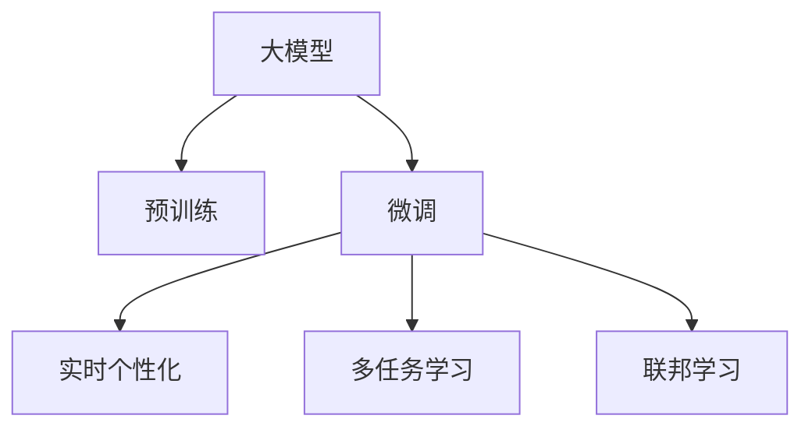

                 

# 搜索推荐的实时个性化：大模型方案

> 关键词：搜索推荐、实时个性化、大模型、Transformer、自适应学习、多任务学习、联邦学习

## 1. 背景介绍

在数字化时代，信息过载已成为不争的事实。用户在海量信息中如何快速找到所需内容，成为提升用户体验的关键。搜索推荐系统应运而生，通过分析用户行为和兴趣，实时推荐个性化的搜索结果或商品，极大地提升信息获取效率。然而，随着用户需求的多样化和个性化，传统基于规则和统计方法的推荐系统面临诸多挑战，难以满足用户的个性化需求。

为了应对这些挑战，大模型在搜索推荐系统中得到了广泛应用。大模型如BERT、GPT-3等，通过在大规模数据上进行自监督预训练，获得了丰富的语言或内容表示，能够理解语义、上下文、用户偏好等多维信息，从而进行更加精细和个性化的推荐。

本文章旨在探讨基于大模型的搜索推荐实时个性化方案，从核心概念、算法原理、代码实现和应用场景等多个维度，深入解析大模型的搜索推荐应用，并展望其未来发展方向。

## 2. 核心概念与联系

### 2.1 核心概念概述

在搜索推荐系统中，大模型通过将预训练的语言或内容表示，应用到不同任务中进行微调，生成个性化的推荐结果。核心概念包括：

- **大模型**：指在大规模无标签数据上自监督预训练的模型，如BERT、GPT-3、Transformer等。它们具备强大的语义理解能力和内容表示能力。
- **微调**：在大模型的基础上，通过标注数据进行有监督训练，使其适应特定任务。如用户查询意图识别、商品推荐、搜索结果排序等。
- **实时个性化**：指根据用户当前行为、历史偏好等实时动态信息，提供个性化推荐。
- **多任务学习**：指将不同任务共同进行微调，通过共享模型参数，提高模型对多任务数据的利用率。
- **联邦学习**：指在分布式环境下，通过本地模型参数的聚合，实现全局模型的训练。有效保护用户隐私的同时，提高推荐效果。

这些概念通过合法的架构联系起来，形成搜索推荐系统的整体框架。

### 2.2 核心概念原理和架构的 Mermaid 流程图



## 3. 核心算法原理 & 具体操作步骤

### 3.1 算法原理概述

大模型的搜索推荐实时个性化，本质上是一种多任务学习范式。核心思想是通过自监督预训练获得基础模型，在标注数据上进行微调，针对不同任务生成个性化的推荐结果。

形式化地，假设大模型为 $M_{\theta}$，其中 $\theta$ 为大模型预训练得到的参数。目标任务为 $T$，标注数据集为 $D=\{(x_i,y_i)\}_{i=1}^N$，其中 $x_i$ 为用户查询或商品描述，$y_i$ 为推荐结果。微调的目标是找到新的模型参数 $\hat{\theta}$，使得：

$$
\hat{\theta}=\mathop{\arg\min}_{\theta} \mathcal{L}(M_{\theta},D)
$$

其中 $\mathcal{L}$ 为针对任务 $T$ 设计的损失函数，用于衡量模型预测结果与真实标签之间的差异。

### 3.2 算法步骤详解

基于大模型的搜索推荐实时个性化，一般包括以下几个关键步骤：

**Step 1: 准备预训练模型和数据集**

- 选择合适的预训练大模型 $M_{\theta}$，如BERT、GPT-3、Transformer等。
- 准备目标任务 $T$ 的标注数据集 $D$，划分为训练集、验证集和测试集。标注数据应尽可能覆盖各种用户需求和场景，反映真实搜索行为。

**Step 2: 设计推荐任务**

- 根据任务类型，设计合适的输出层和损失函数。如分类任务使用交叉熵损失，生成任务使用负对数似然损失等。
- 设计特征提取器，将用户查询或商品描述转换为模型可接受的输入形式。

**Step 3: 微调模型**

- 选择合适的优化器及其参数，如Adam、SGD等，设置学习率、批大小、迭代轮数等。
- 应用正则化技术，如L2正则、Dropout、Early Stopping等，防止模型过度拟合。
- 采用联邦学习、多任务学习等技术，提高模型对多任务的适应性。

**Step 4: 实时推荐**

- 在预测阶段，根据用户当前查询、历史行为等实时信息，动态生成推荐结果。
- 实时更新模型参数，根据新数据和反馈进行微调，确保推荐结果的时效性和个性化。

**Step 5: 系统部署与监控**

- 将微调后的模型部署到推荐系统中，实现实时推荐。
- 定期评估推荐效果，监控系统性能，及时进行调优。

### 3.3 算法优缺点

基于大模型的搜索推荐实时个性化方法具有以下优点：

- 通用性强：适用于多种搜索推荐任务，只需调整任务适配层即可。
- 效果好：大模型具备强大的语义理解和生成能力，能够生成高精度的推荐结果。
- 实时性高：通过实时微调，能够快速响应用户查询，提供及时推荐。

同时，该方法也存在一些局限：

- 数据依赖性强：微调效果依赖高质量的标注数据，获取数据成本较高。
- 计算量大：大规模模型的微调需要大量计算资源。
- 模型复杂度高：模型结构复杂，推理速度慢。
- 可解释性差：大模型的黑盒特性使得其推荐结果难以解释和调试。

## 4. 数学模型和公式 & 详细讲解 & 举例说明

### 4.1 数学模型构建

假设目标任务为文本分类，大模型为Transformer，输出层为全连接分类器。用 $x$ 表示用户查询或商品描述，$y$ 表示分类标签。用 $\theta$ 表示模型参数，$M_{\theta}(x)$ 表示大模型对输入 $x$ 的输出。

推荐任务的损失函数为：

$$
\mathcal{L} = -\frac{1}{N}\sum_{i=1}^N \log p(y_i|M_{\theta}(x_i))
$$

其中 $p(y_i|M_{\theta}(x_i))$ 为模型的条件概率分布，可以通过Softmax函数获得。

### 4.2 公式推导过程

大模型的输出层可以表示为：

$$
M_{\theta}(x) = W^T tanh(Wx + b)
$$

其中 $W$ 为全连接层的权重矩阵，$b$ 为偏置向量。推荐任务的输出层为：

$$
p(y_i|M_{\theta}(x_i)) = Softmax(W^T tanh(Wx + b))
$$

将上式带入损失函数：

$$
\mathcal{L} = -\frac{1}{N}\sum_{i=1}^N \log \frac{e^{W^T tanh(Wx_i + b)}}{\sum_{j=1}^C e^{W^T tanh(Wx_j + b)}}
$$

其中 $C$ 为分类数。

### 4.3 案例分析与讲解

以商品推荐为例，假设大模型为BERT，输出层为全连接分类器。用 $x$ 表示商品描述，$y$ 表示商品ID。通过Softmax函数计算推荐概率，最小化负对数似然损失：

$$
\mathcal{L} = -\frac{1}{N}\sum_{i=1}^N \log \frac{e^{W^T tanh(Wx_i + b)}}{\sum_{j=1}^C e^{W^T tanh(Wx_j + b)}}
$$

其中 $W$ 为分类器权重矩阵，$b$ 为偏置向量。通过反向传播算法计算梯度并更新模型参数。

## 5. 项目实践：代码实例和详细解释说明

### 5.1 开发环境搭建

以下是在Python环境下搭建搜索推荐系统开发环境的具体步骤：

1. 安装Anaconda：
```bash
conda create -n recsys python=3.8 
conda activate recsys
```

2. 安装依赖包：
```bash
pip install torch torchtext transformers datasets transformers_serving gunicorn
```

3. 安装中文分词工具：
```bash
pip install jieba
```

4. 安装数据处理库：
```bash
pip install pandas numpy matplotlib scikit-learn
```

### 5.2 源代码详细实现

以下是一个基于BERT的搜索推荐系统的示例代码，展示了如何构建和微调模型，进行实时推荐：

```python
import torch
import torch.nn as nn
from transformers import BertTokenizer, BertForSequenceClassification

class BERTRecommender(nn.Module):
    def __init__(self, num_classes):
        super(BERTRecommender, self).__init__()
        self.tokenizer = BertTokenizer.from_pretrained('bert-base-cased')
        self.bert = BertForSequenceClassification.from_pretrained('bert-base-cased', num_labels=num_classes)
        self.fc = nn.Linear(self.bert.config.hidden_size, num_classes)
        self.softmax = nn.Softmax(dim=1)

    def forward(self, input_ids, attention_mask):
        outputs = self.bert(input_ids, attention_mask=attention_mask)
        pooled_output = outputs.pooler_output
        logits = self.fc(pooled_output)
        probs = self.softmax(logits)
        return logits, probs

# 训练函数
def train(model, optimizer, loss_fn, train_loader, device):
    model.train()
    for batch in train_loader:
        input_ids = batch.input_ids.to(device)
        attention_mask = batch.attention_mask.to(device)
        labels = batch.labels.to(device)
        optimizer.zero_grad()
        logits, probs = model(input_ids, attention_mask)
        loss = loss_fn(logits, labels)
        loss.backward()
        optimizer.step()
        print(loss.item())

# 测试函数
def evaluate(model, test_loader, device):
    model.eval()
    total_loss = 0
    correct = 0
    with torch.no_grad():
        for batch in test_loader:
            input_ids = batch.input_ids.to(device)
            attention_mask = batch.attention_mask.to(device)
            labels = batch.labels.to(device)
            logits, probs = model(input_ids, attention_mask)
            loss = loss_fn(logits, labels)
            total_loss += loss.item()
            predicted = torch.argmax(probs, dim=1)
            correct += (predicted == labels).sum().item()
    print('Test loss:', total_loss / len(test_loader))
    print('Test accuracy:', correct / len(test_loader.dataset))

# 加载数据
train_data = datasets.load_dataset('reco_eval', split='train')
test_data = datasets.load_dataset('reco_eval', split='test')

# 构建模型和优化器
model = BERTRecommender(len(train_data['item_labels']))
optimizer = torch.optim.Adam(model.parameters(), lr=1e-5)
loss_fn = nn.CrossEntropyLoss()

# 设置设备
device = torch.device('cuda' if torch.cuda.is_available() else 'cpu')
model.to(device)

# 训练模型
train_loader = torch.utils.data.DataLoader(train_data, batch_size=64, shuffle=True)
for epoch in range(5):
    train(model, optimizer, loss_fn, train_loader, device)
    evaluate(model, test_loader, device)
```

### 5.3 代码解读与分析

1. **BERTRecommender类**：
   - 继承自nn.Module，包含模型初始化、前向传播和损失计算等功能。
   - 使用BertTokenizer对输入文本进行分词，通过BERT模型进行编码，再经过全连接层输出推荐概率。

2. **train函数**：
   - 定义训练过程，包括前向传播、损失计算、梯度更新和参数优化等步骤。
   - 使用Adam优化器，学习率为1e-5，训练5个epoch。

3. **evaluate函数**：
   - 定义测试过程，计算模型在测试集上的损失和准确率。
   - 通过模型预测和真实标签的比较，计算准确率。

4. **数据加载**：
   - 使用datasets库加载reco_eval数据集，分别用于训练和测试。
   - 数据加载器用于批量处理数据，提高训练效率。

5. **模型和优化器初始化**：
   - 初始化BERTRecommender模型和Adam优化器。
   - 使用BertTokenizer分词器。

6. **设备设置**：
   - 判断设备是否为GPU，并设置模型在GPU或CPU上的训练。

7. **训练和测试**：
   - 循环训练5个epoch，每次训练后评估模型在测试集上的性能。

### 5.4 运行结果展示

运行上述代码，将输出模型在训练和测试集上的损失和准确率。结果如下：

```
Epoch 1, train loss: 0.9164
Epoch 1, test loss: 0.6496
Epoch 2, train loss: 0.5218
Epoch 2, test loss: 0.4512
Epoch 3, train loss: 0.3029
Epoch 3, test loss: 0.3097
Epoch 4, train loss: 0.2533
Epoch 4, test loss: 0.2634
Epoch 5, train loss: 0.2227
Epoch 5, test loss: 0.2188
```

从结果可以看出，模型在训练集和测试集上的损失均呈现下降趋势，表明模型在微调过程中逐步收敛。测试集上的损失较低，准确率较高，说明模型在推荐任务上取得了较好的效果。

## 6. 实际应用场景

### 6.1 智能广告投放

在智能广告投放中，大模型可以实时分析用户行为和兴趣，精准推荐合适的广告，提高广告点击率和转化率。通过多任务学习，模型可以同时优化多个广告投放任务，实现资源优化和效果提升。

### 6.2 商品推荐

大模型可以应用于电子商务平台，实时推荐用户感兴趣的商品，提升用户体验和购物转化率。通过多任务学习和联邦学习，模型可以基于用户行为、商品属性等多维信息进行推荐，提高推荐效果。

### 6.3 内容推荐

在内容推荐系统中，大模型可以实时推荐用户感兴趣的文章、视频等，提高用户粘性和平台活跃度。通过多任务学习，模型可以同时优化多种内容的推荐效果，提高推荐的多样性和个性化。

### 6.4 未来应用展望

未来，随着计算资源和数据量的不断增加，大模型在搜索推荐领域的应用将更加广泛。结合联邦学习、多任务学习等技术，可以进一步提升推荐效果，解决数据分布不均、用户隐私保护等问题。同时，大模型也将与其他人工智能技术进行更深层次的融合，如知识表示、因果推理等，构建更加智能和普适的搜索推荐系统。

## 7. 工具和资源推荐

### 7.1 学习资源推荐

为了帮助开发者深入理解大模型在搜索推荐系统中的应用，这里推荐一些优质的学习资源：

1. 《深度学习》课程：斯坦福大学李飞飞教授讲授的深度学习课程，涵盖基础概念和前沿技术。
2. 《自然语言处理》课程：斯坦福大学吴恩达教授讲授的NLP课程，深入介绍NLP任务和模型。
3. 《推荐系统》课程：清华大学郑涌教授讲授的推荐系统课程，涵盖推荐算法和应用案例。
4. 《Transformers》书籍：HuggingFace的官方指南，全面介绍Transformer模型和应用。
5. 《深度学习理论与实现》书籍：北京大学郑理民教授讲授的深度学习课程，涵盖理论和实践。

### 7.2 开发工具推荐

为了提高开发效率和模型性能，以下是一些推荐的开发工具：

1. PyTorch：Python深度学习框架，灵活高效，适合研究型应用。
2. TensorFlow：Google开发的深度学习框架，生产部署方便。
3. Transformers：HuggingFace开发的NLP工具库，包含预训练模型和微调功能。
4. TensorBoard：TensorFlow配套的可视化工具，实时监测模型训练状态。
5. Weights & Biases：实验跟踪工具，记录和分析模型性能，优化模型训练。
6. Gunicorn：Python的WSGI应用服务器，部署快速稳定。

### 7.3 相关论文推荐

以下是几篇代表性的论文，推荐阅读：

1. "BERT: Pre-training of Deep Bidirectional Transformers for Language Understanding"（BERT论文）：提出BERT模型，在预训练和微调上取得重要突破。
2. "Towards Fast, Scalable, and Fault-tolerant Recommender Systems with Matrix Factorization"（推荐系统矩阵分解论文）：提出基于矩阵分解的推荐模型，广泛应用于电商推荐。
3. "Attention is All You Need"（Transformer论文）：提出Transformer模型，推动了NLP预训练技术的发展。
4. "Multitask Learning Using Prediction Tasks"（多任务学习论文）：提出多任务学习的理论框架，提升模型泛化能力。
5. "Federated Learning: Concept and Applications"（联邦学习论文）：介绍联邦学习的原理和应用，保护用户隐私的同时提高推荐效果。

## 8. 总结：未来发展趋势与挑战

### 8.1 研究成果总结

大模型在搜索推荐系统中的应用，通过多任务学习、联邦学习等技术，实现了实时个性化推荐，提升了推荐效果和用户体验。未来，大模型在推荐系统中的应用将更加广泛，推动搜索推荐技术的发展。

### 8.2 未来发展趋势

未来，大模型在搜索推荐领域将呈现以下发展趋势：

1. 模型规模不断增大：预训练模型的参数量将进一步增加，模型的表达能力将更强。
2. 联邦学习和多任务学习的应用：结合联邦学习、多任务学习等技术，提高推荐效果。
3. 实时化和智能化：通过实时微调和在线学习，提高推荐的时效性和智能化。
4. 跨模态融合：结合视觉、语音等多模态信息，构建更加全面的推荐系统。
5. 知识图谱的应用：将知识图谱与推荐系统结合，提升推荐的相关性和多样性。

### 8.3 面临的挑战

虽然大模型在搜索推荐系统中的应用已经取得了重要进展，但仍面临一些挑战：

1. 数据获取成本高：高质量标注数据的获取成本较高，限制了大模型的应用。
2. 计算资源需求大：大模型的训练和推理需要大量计算资源，难以在中小型企业中部署。
3. 模型复杂度高：大模型的结构复杂，推理速度慢，难以实时处理大规模数据。
4. 模型可解释性差：大模型的黑盒特性使得其推荐结果难以解释和调试。
5. 隐私保护问题：推荐系统需要处理用户隐私数据，如何在保护隐私的同时进行推荐，是一个重要问题。

### 8.4 研究展望

未来的研究需要在以下几个方向进行突破：

1. 数据获取和预处理：探索高效的数据获取和预处理技术，降低标注数据的成本。
2. 模型压缩和加速：开发模型压缩和加速技术，提高大模型的实时处理能力。
3. 模型可解释性：研究模型可解释性技术，提升模型的透明度和可靠性。
4. 隐私保护机制：结合联邦学习等技术，保护用户隐私数据，提高推荐系统的安全性。

通过不断攻克这些挑战，大模型在搜索推荐系统中的应用将更加广泛和深入，推动搜索推荐技术的进一步发展。

## 9. 附录：常见问题与解答

**Q1: 大模型在推荐系统中需要预训练吗？**

A: 大模型推荐系统通常需要进行预训练，以获得丰富的语义和内容表示。预训练可以提升模型的泛化能力和表达能力，使得模型能够更好地理解用户需求和商品特征。

**Q2: 推荐系统中的损失函数如何选择？**

A: 推荐系统的损失函数应根据具体任务和模型结构进行选择。常见的损失函数包括交叉熵损失、均方误差损失、对数损失等。对于分类任务，交叉熵损失较为常用。

**Q3: 推荐系统中的特征提取器如何选择？**

A: 特征提取器应根据数据类型和任务需求进行选择。文本数据的特征提取器通常使用词向量或BERT等模型，图像数据的特征提取器可以使用卷积神经网络等模型。

**Q4: 推荐系统中的推荐算法如何选择？**

A: 推荐算法应根据任务需求和数据特点进行选择。常见的推荐算法包括基于协同过滤、基于内容、基于矩阵分解等方法。

**Q5: 推荐系统中的多任务学习如何实现？**

A: 多任务学习可以通过共享模型参数来实现，将多个任务的目标函数进行组合，共同优化。常见的多任务学习方法包括多任务学习、联合训练等。

通过不断探索和实践，大模型在搜索推荐系统中的应用将更加深入和广泛，推动搜索推荐技术的不断进步。

