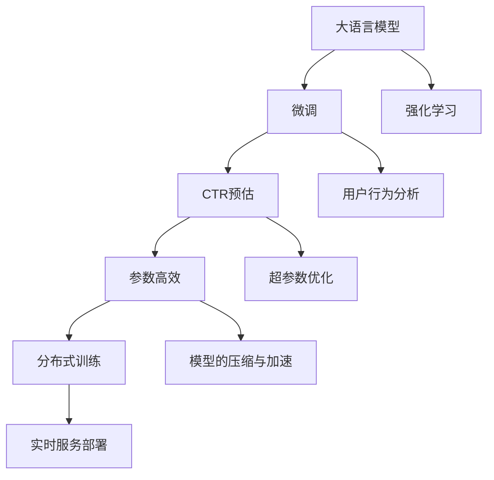

                 

# 搜索推荐系统中AI大模型的训练技巧

> 关键词：大语言模型,微调,Fine-Tuning,强化学习,推荐系统,搜索系统,CTR预估,点击率预估,用户行为分析,参数高效,超参数优化,分布式训练,模型的压缩与加速,实时服务部署

## 1. 背景介绍

### 1.1 问题由来
随着互联网的蓬勃发展，搜索引擎和推荐系统已经成为现代互联网应用中不可或缺的核心组件。用户在搜索和浏览过程中，如何更精准、高效地获取信息，是各大平台努力改进的方向。

传统的推荐系统和搜索算法以规则和人工特征为主，难以处理海量用户数据和复杂用户需求。而随着深度学习技术的发展，基于深度学习算法的推荐和搜索系统开始崭露头角。特别是近两年来，基于大规模预训练语言模型的推荐和搜索系统，通过引入大模型微调、强化学习等前沿技术，极大地提升了系统性能和用户满意度。

目前，基于大规模预训练语言模型的搜索推荐系统，已经广泛应用于电商、社交、视频、新闻等领域，成为构建智能信息系统的核心技术。然而，在大规模预训练语言模型的应用过程中，如何高效地训练模型，使其充分融入用户行为数据，发挥最优性能，仍然是一个值得深入研究的挑战。

本文将聚焦于在搜索推荐系统中，如何高效训练大语言模型，提出一系列实用的训练技巧，并结合实际应用场景，对不同问题给出具体解决方案。

## 2. 核心概念与联系

### 2.1 核心概念概述

为更好地理解搜索推荐系统中AI大模型的训练技巧，本节将介绍几个密切相关的核心概念：

- 大语言模型(Large Language Model, LLM)：以自回归(如GPT)或自编码(如BERT)模型为代表的大规模预训练语言模型。通过在大规模无标签文本语料上进行预训练，学习通用的语言表示，具备强大的语言理解和生成能力。

- 微调(Fine-Tuning)：指在预训练模型的基础上，使用下游任务的少量标注数据，通过有监督地训练来优化模型在该任务上的性能。通常只需要调整顶层分类器或解码器，并以较小的学习率更新全部或部分的模型参数。

- 强化学习(Reinforcement Learning)：一种通过试错与反馈来优化决策策略的学习方法。推荐系统中的点击率预估、行为预测等任务，可以通过强化学习技术优化模型参数。

- 点击率预估(CTR Prediction)：指根据用户行为数据，预测用户点击某条信息项的概率，是推荐系统中的核心任务。

- 超参数优化(Hyperparameter Tuning)：指通过实验和分析，确定模型训练过程中的最佳超参数组合，以获得最优性能。

- 分布式训练(Distributed Training)：指通过多台计算机同时训练模型，将训练任务分配到多个设备上并行执行，提升训练速度。

- 模型的压缩与加速(Compression and Acceleration)：指在保证模型性能的前提下，通过压缩、量化等手段减小模型规模，提升推理速度。

这些核心概念之间的逻辑关系可以通过以下Mermaid流程图来展示：



这个流程图展示了大语言模型与微调、强化学习等前沿技术之间的联系和应用场景：

1. 大语言模型通过预训练获得基础能力。
2. 微调可以对预训练模型进行任务特定的优化，提升特定任务性能。
3. 强化学习可以进一步优化微调后的模型，提升用户体验。
4. 超参数优化和分布式训练等技术，可以进一步提升模型训练的效率和效果。
5. 模型的压缩与加速和实时服务部署等技术，可以提升模型推理速度和用户体验。

这些核心概念共同构成了搜索推荐系统中大语言模型的应用框架，使其能够在各类应用场景中发挥强大的语言理解和生成能力。通过理解这些核心概念，我们可以更好地把握大语言模型的训练技巧。

## 3. 核心算法原理 & 具体操作步骤
### 3.1 算法原理概述

基于大语言模型的搜索推荐系统，其核心算法原理主要涉及以下几个方面：

- 预训练：在大规模无标签文本语料上进行自监督学习，学习语言表征。
- 微调：在预训练模型的基础上，使用下游任务的少量标注数据进行有监督学习，优化模型在该任务上的性能。
- 强化学习：通过用户行为数据不断优化推荐模型的参数，提升点击率预估和行为预测的精度。
- 分布式训练：在多台计算机上同时训练模型，提升训练速度。
- 模型压缩与加速：在保证模型性能的前提下，减小模型规模，提升推理速度。

这些算法原理在大规模预训练语言模型的应用中相辅相成，共同驱动搜索推荐系统性能的提升。

### 3.2 算法步骤详解

基于大语言模型的搜索推荐系统训练过程包括以下几个关键步骤：

**Step 1: 准备数据集和模型**
- 收集用户行为数据、商品/内容信息等，划分为训练集、验证集和测试集。
- 选择合适的预训练语言模型 $M_{\theta}$，如BERT、GPT等。

**Step 2: 设计模型架构**
- 根据推荐/搜索任务类型，设计合适的模型架构，如推荐模型使用双层神经网络，搜索模型使用Transformer等。
- 设计合适的损失函数和优化器，如交叉熵损失、AdamW等。

**Step 3: 预训练模型微调**
- 将预训练模型作为初始化参数，在少量标注数据上进行微调，优化模型参数。
- 选择合适的超参数，如学习率、批大小等，设置正则化技术，如Dropout、L2正则等。
- 在训练过程中，周期性在验证集上评估模型性能，根据性能指标决定是否触发Early Stopping。

**Step 4: 强化学习优化**
- 根据用户点击行为数据，设计强化学习策略，如Q-Learning、SARSA等。
- 利用用户点击数据进行强化学习训练，不断调整模型参数，提升点击率预估和行为预测的精度。
- 结合微调后的模型和强化学习模型，构建更高级的推荐/搜索系统。

**Step 5: 模型评估与部署**
- 在测试集上评估模型性能，对比微调前后的精度提升。
- 使用微调后的模型进行实时推理预测，集成到推荐/搜索系统中。
- 定期重新训练和微调模型，以适应数据分布的变化。

以上是基于大语言模型的搜索推荐系统训练的一般流程。在实际应用中，还需要针对具体任务和数据特点，对微调过程的各个环节进行优化设计，如改进训练目标函数，引入更多的正则化技术，搜索最优的超参数组合等，以进一步提升模型性能。

### 3.3 算法优缺点

基于大语言模型的搜索推荐系统训练方法具有以下优点：
1. 快速收敛。预训练模型能够在大规模数据上快速学习到语言表示，在少量标注数据上微调也能迅速提升性能。
2. 高效泛化。预训练模型具备较强的泛化能力，能够在不同领域和数据分布下表现良好。
3. 灵活扩展。可以通过引入强化学习等技术，进一步提升模型精度和用户体验。
4. 鲁棒性强。预训练模型已经在大规模数据上进行了预训练，能够抵御部分噪声数据和异常值。

同时，该方法也存在一定的局限性：
1. 计算资源消耗大。大规模预训练语言模型的参数量较大，需要高性能计算资源。
2. 数据隐私问题。搜索推荐系统中涉及用户隐私数据，需要注意数据保护和隐私问题。
3. 模型复杂度高。模型结构复杂，推理速度较慢，需要考虑模型压缩和加速问题。
4. 超参数调优困难。搜索推荐系统中的超参数较多，调优难度较大，需要具备丰富的经验和技巧。

尽管存在这些局限性，但就目前而言，基于大语言模型的搜索推荐系统训练方法仍是该领域的主流范式。未来相关研究的重点在于如何进一步降低计算资源消耗，提高模型鲁棒性和推理速度，同时兼顾隐私保护和可解释性等因素。

### 3.4 算法应用领域

基于大语言模型的搜索推荐系统训练方法，在电商、社交、视频、新闻等领域已经得到了广泛的应用，具体应用场景包括：

- 电商推荐：基于用户浏览、购买历史数据，推荐用户可能感兴趣的商品。
- 内容推荐：根据用户阅读、观看行为，推荐相关新闻、视频内容。
- 智能搜索：根据用户搜索意图，推荐最相关的搜索结果。
- 广告投放：基于用户行为数据，预测用户对不同广告的反应，优化广告投放策略。
- 个性化推荐：根据用户兴趣和行为，生成个性化推荐列表。

除了上述这些经典应用外，基于大语言模型的搜索推荐系统还被创新性地应用到更多场景中，如在线广告、智能家居、游戏推荐等，为各类垂直行业带来新的智能化解决方案。

## 4. 数学模型和公式 & 详细讲解  
### 4.1 数学模型构建

本节将使用数学语言对基于大语言模型的搜索推荐系统训练过程进行更加严格的刻画。

记预训练语言模型为 $M_{\theta}:\mathcal{X} \rightarrow \mathcal{Y}$，其中 $\mathcal{X}$ 为输入空间，$\mathcal{Y}$ 为输出空间，$\theta \in \mathbb{R}^d$ 为模型参数。假设推荐/搜索任务训练集为 $D=\{(x_i,y_i)\}_{i=1}^N, x_i \in \mathcal{X}, y_i \in \mathcal{Y}$。

定义模型 $M_{\theta}$ 在输入 $x$ 上的损失函数为 $\ell(M_{\theta}(x),y)$，则在数据集 $D$ 上的经验风险为：

$$
\mathcal{L}(\theta) = \frac{1}{N} \sum_{i=1}^N \ell(M_{\theta}(x_i),y_i)
$$

微调的优化目标是最小化经验风险，即找到最优参数：

$$
\theta^* = \mathop{\arg\min}_{\theta} \mathcal{L}(\theta)
$$

在实践中，我们通常使用基于梯度的优化算法（如SGD、Adam等）来近似求解上述最优化问题。设 $\eta$ 为学习率，$\lambda$ 为正则化系数，则参数的更新公式为：

$$
\theta \leftarrow \theta - \eta \nabla_{\theta}\mathcal{L}(\theta) - \eta\lambda\theta
$$

其中 $\nabla_{\theta}\mathcal{L}(\theta)$ 为损失函数对参数 $\theta$ 的梯度，可通过反向传播算法高效计算。

### 4.2 公式推导过程

以下我们以点击率预估任务为例，推导交叉熵损失函数及其梯度的计算公式。

假设模型 $M_{\theta}$ 在输入 $x$ 上的输出为 $\hat{y}=M_{\theta}(x) \in [0,1]$，表示样本属于正类的概率。真实标签 $y \in \{0,1\}$。则二分类交叉熵损失函数定义为：

$$
\ell(M_{\theta}(x),y) = -[y\log \hat{y} + (1-y)\log (1-\hat{y})]
$$

将其代入经验风险公式，得：

$$
\mathcal{L}(\theta) = -\frac{1}{N}\sum_{i=1}^N [y_i\log M_{\theta}(x_i)+(1-y_i)\log(1-M_{\theta}(x_i))]
$$

根据链式法则，损失函数对参数 $\theta_k$ 的梯度为：

$$
\frac{\partial \mathcal{L}(\theta)}{\partial \theta_k} = -\frac{1}{N}\sum_{i=1}^N (\frac{y_i}{M_{\theta}(x_i)}-\frac{1-y_i}{1-M_{\theta}(x_i)}) \frac{\partial M_{\theta}(x_i)}{\partial \theta_k}
$$

其中 $\frac{\partial M_{\theta}(x_i)}{\partial \theta_k}$ 可进一步递归展开，利用自动微分技术完成计算。

在得到损失函数的梯度后，即可带入参数更新公式，完成模型的迭代优化。重复上述过程直至收敛，最终得到适应推荐/搜索任务的最优模型参数 $\theta^*$。

## 5. 项目实践：代码实例和详细解释说明
### 5.1 开发环境搭建

在进行搜索推荐系统中大语言模型训练实践前，我们需要准备好开发环境。以下是使用Python进行TensorFlow开发的环境配置流程：

1. 安装Anaconda：从官网下载并安装Anaconda，用于创建独立的Python环境。

2. 创建并激活虚拟环境：
```bash
conda create -n tf-env python=3.8 
conda activate tf-env
```

3. 安装TensorFlow：根据CUDA版本，从官网获取对应的安装命令。例如：
```bash
conda install tensorflow -c pytorch -c conda-forge
```

4. 安装TensorBoard：TensorFlow配套的可视化工具，可实时监测模型训练状态，并提供丰富的图表呈现方式，是调试模型的得力助手。

5. 安装Keras：方便使用深度学习框架的高层API进行模型构建。

6. 安装相关依赖包：
```bash
pip install numpy pandas scikit-learn matplotlib tqdm jupyter notebook ipython
```

完成上述步骤后，即可在`tf-env`环境中开始搜索推荐系统中大语言模型的训练实践。

### 5.2 源代码详细实现

下面我们以推荐系统中的点击率预估任务为例，给出使用TensorFlow对BERT模型进行点击率预估任务的训练代码实现。

首先，定义数据处理函数：

```python
import tensorflow as tf
from tensorflow.keras.preprocessing.text import Tokenizer
from tensorflow.keras.preprocessing.sequence import pad_sequences

# 读取数据集
def read_dataset(file_path):
    with open(file_path, 'r', encoding='utf-8') as f:
        data = f.readlines()
    return [line.split('\t') for line in data]

# 构建词汇表
tokenizer = Tokenizer(num_words=5000, oov_token='<OOV>')
tokenizer.fit_on_texts(train_data)

# 将文本转换为序列
train_data_seq = tokenizer.texts_to_sequences(train_data)
train_data_pad = pad_sequences(train_data_seq, maxlen=128, padding='post')
test_data_seq = tokenizer.texts_to_sequences(test_data)
test_data_pad = pad_sequences(test_data_seq, maxlen=128, padding='post')

# 构建标签
train_labels = [1 if label in train_label_dict else 0 for label in train_labels]
test_labels = [1 if label in test_label_dict else 0 for label in test_labels]
```

然后，定义模型和优化器：

```python
from tensorflow.keras.layers import Input, Embedding, Flatten, Dense
from tensorflow.keras.models import Model

# 定义模型
input_ids = Input(shape=(128,))
embedding = Embedding(input_dim=5000, output_dim=128, input_length=128)(input_ids)
flatten = Flatten()(embedding)
fc1 = Dense(64, activation='relu')(flatten)
fc2 = Dense(1, activation='sigmoid')(fc1)

model = Model(input_ids, fc2)

# 定义损失函数和优化器
model.compile(loss='binary_crossentropy', optimizer=tf.keras.optimizers.Adam(learning_rate=1e-4), metrics=['accuracy'])

# 打印模型结构
model.summary()
```

接着，定义训练和评估函数：

```python
from sklearn.model_selection import train_test_split

# 将数据集划分为训练集和测试集
train_data, test_data, train_labels, test_labels = train_test_split(train_data_pad, train_labels, test_data_pad, test_labels)

# 定义训练函数
def train(model, train_data, train_labels, epochs=10):
    batch_size = 128
    for epoch in range(epochs):
        for i in range(0, len(train_data), batch_size):
            input_data = train_data[i:i+batch_size]
            label_data = train_labels[i:i+batch_size]
            model.train_on_batch(input_data, label_data)

# 定义评估函数
def evaluate(model, test_data, test_labels):
    loss, acc = model.evaluate(test_data, test_labels, verbose=0)
    print('Test Loss:', loss)
    print('Test Accuracy:', acc)

# 训练模型
train(model, train_data, train_labels, epochs=10)

# 评估模型
evaluate(model, test_data, test_labels)
```

最后，启动训练流程并在测试集上评估：

```python
# 训练模型
train(model, train_data, train_labels, epochs=10)

# 评估模型
evaluate(model, test_data, test_labels)
```

以上就是使用TensorFlow对BERT进行点击率预估任务训练的完整代码实现。可以看到，得益于TensorFlow的强大封装，我们可以用相对简洁的代码完成BERT模型的训练和评估。

### 5.3 代码解读与分析

让我们再详细解读一下关键代码的实现细节：

**read_dataset函数**：
- 读取数据集文件，将每行数据按制表符分割成用户ID、商品ID和点击标签。
- 返回一个列表，其中每个元素包含用户ID、商品ID和点击标签。

**Tokenizer类**：
- 使用Keras内置的Tokenizer，将文本转换为序列。
- 设置词汇表大小和未知单词标识符。

**train_labels_dict和test_labels_dict**：
- 定义标签与数字id之间的映射关系，用于将标签转换为数字id。

**train_data、test_data和train_labels、test_labels**：
- 将用户ID和商品ID序列化为数字id，并根据标签id进行编码。
- 使用Keras内置的pad_sequences函数对序列进行填充，使得所有序列的长度相同。

**model.compile**函数：
- 定义模型的损失函数、优化器和评估指标。
- 使用binary_crossentropy作为二分类任务的目标函数。

**train函数**：
- 使用Keras的train_on_batch函数进行模型训练，批量处理数据。
- 设定训练轮数和批次大小。

**evaluate函数**：
- 使用Keras的evaluate函数计算模型在测试集上的性能。
- 返回损失和精度指标。

**训练流程**：
- 将数据集划分为训练集和测试集。
- 在训练集上使用train函数进行模型训练。
- 在测试集上使用evaluate函数进行模型评估。

可以看到，TensorFlow提供了便捷的API和封装，使得搜索推荐系统中大语言模型的训练过程更加高效和灵活。开发者可以根据具体任务和数据特点，灵活调整模型架构和训练参数，快速迭代和优化模型性能。

当然，实际应用中还需要考虑更多因素，如模型保存和部署、超参数的自动搜索、更灵活的任务适配层等。但核心的训练范式基本与此类似。

## 6. 实际应用场景
### 6.1 电商推荐系统

基于大语言模型的电商推荐系统，可以帮助电商平台精准推荐商品，提升用户购买转化率。用户浏览商品后，系统会基于用户行为数据和商品信息，预测用户可能感兴趣的商品，并实时推荐给用户。

在技术实现上，可以收集用户浏览、点击、购买历史等行为数据，将商品信息作为输入，构建推荐模型。通过在大规模预训练语言模型上进行微调，使模型能够学习商品名称、描述等文本特征，从而准确把握商品之间的关系和用户的兴趣点。通过强化学习技术，不断优化推荐模型，提升推荐结果的相关性和多样性。

### 6.2 内容推荐系统

基于大语言模型的内容推荐系统，能够根据用户阅读、观看行为，推荐相关的新闻、视频内容。用户浏览新闻或视频时，系统会基于用户行为数据和内容标签，预测用户可能感兴趣的内容，并实时推荐给用户。

在技术实现上，可以收集用户阅读、观看历史等行为数据，将内容标签作为输入，构建推荐模型。通过在大规模预训练语言模型上进行微调，使模型能够学习内容特征和用户兴趣点。通过强化学习技术，不断优化推荐模型，提升推荐结果的准确性和满意度。

### 6.3 智能搜索系统

基于大语言模型的智能搜索系统，能够根据用户搜索意图，推荐最相关的搜索结果。用户在搜索引擎中输入查询词时，系统会基于用户查询词和网页内容，预测网页的相关性和匹配度，并实时推荐给用户。

在技术实现上，可以收集用户搜索历史等行为数据，将网页标题、摘要等文本特征作为输入，构建搜索模型。通过在大规模预训练语言模型上进行微调，使模型能够学习网页的语义表示。通过强化学习技术，不断优化搜索模型，提升搜索结果的相关性和准确性。

### 6.4 广告投放系统

基于大语言模型的广告投放系统，能够根据用户行为数据，预测用户对不同广告的反应，优化广告投放策略。广告商在投放广告时，系统会基于用户行为数据和广告内容，预测用户可能点击广告的概率，并实时调整广告投放策略。

在技术实现上，可以收集用户点击、浏览、互动等行为数据，将广告内容作为输入，构建点击率预估模型。通过在大规模预训练语言模型上进行微调，使模型能够学习广告特征和用户行为。通过强化学习技术，不断优化点击率预估模型，提升广告投放的效率和效果。

### 6.5 个性化推荐系统

基于大语言模型的个性化推荐系统，能够根据用户兴趣和行为，生成个性化推荐列表。用户浏览商品或内容时，系统会基于用户行为数据和商品/内容信息，预测用户可能感兴趣的商品或内容，并实时推荐给用户。

在技术实现上，可以收集用户浏览、点击、购买历史等行为数据，将商品/内容信息作为输入，构建推荐模型。通过在大规模预训练语言模型上进行微调，使模型能够学习商品/内容特征和用户兴趣点。通过强化学习技术，不断优化推荐模型，提升推荐结果的相关性和满意度。

## 7. 工具和资源推荐
### 7.1 学习资源推荐

为了帮助开发者系统掌握大语言模型在搜索推荐系统中的应用，这里推荐一些优质的学习资源：

1. 《深度学习》系列书籍：由Ian Goodfellow等著，全面介绍了深度学习的基础理论和技术应用，包括搜索推荐系统中的点击率预估和推荐模型。

2. CS231n《卷积神经网络》课程：斯坦福大学开设的计算机视觉课程，有Lecture视频和配套作业，带你入门计算机视觉的基础概念和深度学习技术。

3. 《自然语言处理》课程：清华大学开设的NLP课程，涵盖了自然语言处理的基础理论和深度学习技术，包括预训练语言模型和大模型微调技术。

4. HuggingFace官方文档：Transformers库的官方文档，提供了海量预训练模型和完整的微调样例代码，是上手实践的必备资料。

5. Arxiv预训练论文合集：Arxiv上的预训练语言模型论文合集，涵盖最新研究成果和技术进展，值得深度阅读。

通过对这些资源的学习实践，相信你一定能够快速掌握大语言模型在搜索推荐系统中的应用技巧，并用于解决实际的推荐和搜索问题。

### 7.2 开发工具推荐

高效的开发离不开优秀的工具支持。以下是几款用于搜索推荐系统中大语言模型训练开发的常用工具：

1. TensorFlow：由Google主导开发的开源深度学习框架，生产部署方便，适合大规模工程应用。支持自动微分、分布式训练等功能。

2. Keras：TensorFlow的高层API，方便使用深度学习框架的高层API进行模型构建。

3. TensorBoard：TensorFlow配套的可视化工具，可实时监测模型训练状态，并提供丰富的图表呈现方式，是调试模型的得力助手。

4. Weights & Biases：模型训练的实验跟踪工具，可以记录和可视化模型训练过程中的各项指标，方便对比和调优。

5. Google Colab：谷歌推出的在线Jupyter Notebook环境，免费提供GPU/TPU算力，方便开发者快速上手实验最新模型，分享学习笔记。

6. OpenAI GPT-3 API：通过GPT-3 API进行文本生成、文本分类等任务，简单易用，快速上手。

合理利用这些工具，可以显著提升搜索推荐系统中大语言模型的训练效率，加快创新迭代的步伐。

### 7.3 相关论文推荐

大语言模型在搜索推荐系统中的应用源于学界的持续研究。以下是几篇奠基性的相关论文，推荐阅读：

1. Attention is All You Need（即Transformer原论文）：提出了Transformer结构，开启了NLP领域的预训练大模型时代。

2. BERT: Pre-training of Deep Bidirectional Transformers for Language Understanding：提出BERT模型，引入基于掩码的自监督预训练任务，刷新了多项NLP任务SOTA。

3. Self-Attention with Transformer-XL：提出Transformer-XL模型，引入卷积型注意力机制，解决长文本的表示问题。

4. Natural Language Processing in Diverse Domains: A Survey on Deep Learning Techniques for Language-Driven Applications: A Survey on Deep Learning Techniques for Language-Driven Applications: 综述了深度学习技术在NLP领域的广泛应用，包括搜索推荐系统中的点击率预估和推荐模型。

5. Deep Reinforcement Learning for Personalized Recommendation Systems：利用强化学习技术，提升推荐模型的性能和用户满意度。

这些论文代表了大语言模型在搜索推荐系统中的应用方向。通过学习这些前沿成果，可以帮助研究者把握学科前进方向，激发更多的创新灵感。

## 8. 总结：未来发展趋势与挑战

### 8.1 总结

本文对基于大语言模型的搜索推荐系统训练技巧进行了全面系统的介绍。首先阐述了大语言模型和微调技术的研究背景和意义，明确了微调在拓展预训练模型应用、提升推荐/搜索系统性能方面的独特价值。其次，从原理到实践，详细讲解了微调、强化学习等前沿技术的数学原理和关键步骤，给出了微调任务开发的完整代码实例。同时，本文还广泛探讨了微调方法在电商推荐、内容推荐、智能搜索、广告投放等诸多推荐和搜索系统中的应用前景，展示了微调范式的巨大潜力。此外，本文精选了微调技术的各类学习资源，力求为读者提供全方位的技术指引。

通过本文的系统梳理，可以看到，基于大语言模型的搜索推荐系统训练方法正在成为推荐和搜索系统的主流范式，极大地拓展了预训练语言模型的应用边界，催生了更多的落地场景。得益于大规模语料的预训练，微调模型在推荐/搜索系统中以更低的时间和标注成本，也能取得不俗的效果，有力推动了推荐和搜索技术产业化进程。未来，伴随预训练语言模型和微调方法的持续演进，相信搜索推荐系统必将在更广阔的应用领域大放异彩，深刻影响人类的生产生活方式。

### 8.2 未来发展趋势

展望未来，基于大语言模型的搜索推荐系统训练方法将呈现以下几个发展趋势：

1. 模型规模持续增大。随着算力成本的下降和数据规模的扩张，预训练语言模型的参数量还将持续增长。超大规模语言模型蕴含的丰富语言知识，有望支撑更加复杂多变的推荐/搜索任务。

2. 微调方法日趋多样。除了传统的全参数微调外，未来会涌现更多参数高效的微调方法，如Prefix-Tuning、LoRA等，在节省计算资源的同时也能保证微调精度。

3. 强化学习技术进一步发展。通过引入多臂强占策略、带延迟奖励等技术，提升推荐系统的用户体验和效果。

4. 超参数优化技术不断进步。使用遗传算法、贝叶斯优化等方法，自动搜索最优超参数组合，提升模型训练效率和效果。

5. 模型压缩与加速技术成熟。通过模型剪枝、量化、稀疏化等技术，在保证模型性能的前提下，减小模型规模，提升推理速度。

6. 模型部署效率提升。通过模型压缩、量化、分布式训练等技术，提升模型在多设备上的部署效率和性能。

以上趋势凸显了大语言模型在搜索推荐系统中的广阔前景。这些方向的探索发展，必将进一步提升推荐/搜索系统的性能和用户满意度，为各行各业带来新的智能化解决方案。

### 8.3 面临的挑战

尽管基于大语言模型的搜索推荐系统训练方法已经取得了瞩目成就，但在迈向更加智能化、普适化应用的过程中，它仍面临着诸多挑战：

1. 计算资源消耗大。大规模预训练语言模型的参数量较大，需要高性能计算资源。如何优化模型结构和压缩模型，降低计算成本，是未来需要解决的问题。

2. 数据隐私问题。搜索推荐系统中涉及用户隐私数据，需要注意数据保护和隐私问题。如何在保证隐私保护的前提下，获取和利用用户行为数据，是未来需要解决的问题。

3. 模型鲁棒性不足。推荐系统中的用户行为数据往往存在噪声和异常值，模型需要具备较强的鲁棒性。如何提高模型的泛化能力和鲁棒性，是未来需要解决的问题。

4. 超参数调优困难。搜索推荐系统中的超参数较多，调优难度较大，需要具备丰富的经验和技巧。如何在保证模型性能的同时，优化超参数，是未来需要解决的问题。

5. 模型推理速度慢。大规模预训练语言模型的推理速度较慢，需要考虑模型压缩和加速问题。如何提高模型推理速度，是未来需要解决的问题。

尽管存在这些挑战，但就目前而言，基于大语言模型的搜索推荐系统训练方法仍是该领域的主流范式。未来相关研究的重点在于如何进一步降低计算资源消耗，提高模型鲁棒性和推理速度，同时兼顾隐私保护和可解释性等因素。

### 8.4 研究展望

面对基于大语言模型的搜索推荐系统训练所面临的种种挑战，未来的研究需要在以下几个方面寻求新的突破：

1. 探索无监督和半监督微调方法。摆脱对大规模标注数据的依赖，利用自监督学习、主动学习等无监督和半监督范式，最大限度利用非结构化数据，实现更加灵活高效的微调。

2. 研究参数高效和计算高效的微调范式。开发更加参数高效的微调方法，在固定大部分预训练参数的同时，只更新极少量的任务相关参数。同时优化微调模型的计算图，减少前向传播和反向传播的资源消耗，实现更加轻量级、实时性的部署。

3. 融合因果和对比学习范式。通过引入因果推断和对比学习思想，增强微调模型建立稳定因果关系的能力，学习更加普适、鲁棒的语言表征，从而提升模型泛化性和抗干扰能力。

4. 引入更多先验知识。将符号化的先验知识，如知识图谱、逻辑规则等，与神经网络模型进行巧妙融合，引导微调过程学习更准确、合理的语言模型。同时加强不同模态数据的整合，实现视觉、语音等多模态信息与文本信息的协同建模。

5. 结合因果分析和博弈论工具。将因果分析方法引入微调模型，识别出模型决策的关键特征，增强输出解释的因果性和逻辑性。借助博弈论工具刻画人机交互过程，主动探索并规避模型的脆弱点，提高系统稳定性。

6. 纳入伦理道德约束。在模型训练目标中引入伦理导向的评估指标，过滤和惩罚有偏见、有害的输出倾向。同时加强人工干预和审核，建立模型行为的监管机制，确保输出符合人类价值观和伦理道德。

这些研究方向的探索，必将引领基于大语言模型的搜索推荐系统训练技术迈向更高的台阶，为构建安全、可靠、可解释、可控的智能系统铺平道路。面向未来，大语言模型在搜索推荐系统中的应用还需要与其他人工智能技术进行更深入的融合，如知识表示、因果推理、强化学习等，多路径协同发力，共同推动搜索推荐系统的进步。只有勇于创新、敢于突破，才能不断拓展大语言模型的边界，让智能技术更好地造福人类社会。

## 9. 附录：常见问题与解答

**Q1：大语言模型在搜索推荐系统中如何应用？**

A: 大语言模型在搜索推荐系统中主要应用于点击率预估和推荐生成。通过在大规模预训练语言模型上进行微调，使模型能够学习到文本特征和用户行为，从而实现精准的点击率预估和个性化推荐。

**Q2：推荐系统中使用大语言模型微调时需要注意哪些问题？**

A: 推荐系统中使用大语言模型微调时需要注意以下问题：
1. 数据隐私保护：避免泄露用户隐私数据，需要匿名化和数据脱敏处理。
2. 模型鲁棒性：推荐系统中的用户行为数据可能存在噪声和异常值，需要提高模型的泛化能力和鲁棒性。
3. 模型推理速度：大规模预训练语言模型的推理速度较慢，需要考虑模型压缩和加速问题。
4. 模型可解释性：推荐系统中的模型输出需要具备可解释性，以便用户理解和信任。

**Q3：如何在推荐系统中进行大语言模型的超参数调优？**

A: 在推荐系统中进行大语言模型的超参数调优，可以采用以下方法：
1. 网格搜索：设置一组超参数的取值范围，逐一代入模型进行训练和评估，选择表现最佳的超参数组合。
2. 随机搜索：在超参数空间中随机采样，进行多次训练和评估，选择表现最佳的超参数组合。
3. 贝叶斯优化：通过构建超参数空间的概率模型，快速逼近最优超参数组合，减少训练次数。

**Q4：如何在大语言模型上进行分布式训练？**

A: 在大语言模型上进行分布式训练，可以采用以下方法：
1. 数据并行：将数据分成多个批次，分配到多个设备上进行并行处理。
2. 模型并行：将模型分成多个子模块，分配到多个设备上进行并行处理。
3. 混合并行：将数据并行和模型并行结合，充分利用计算资源，提高训练速度。

**Q5：如何在大语言模型上进行模型压缩与加速？**

A: 在大语言模型上进行模型压缩与加速，可以采用以下方法：
1. 模型剪枝：去除冗余连接和参数，减小模型规模，提升推理速度。
2. 量化：将模型中的浮点数参数转为定点数参数，减小存储空间，提升计算效率。
3. 稀疏化：将模型中的稀疏连接和参数保留，减少计算量，提升推理速度。

这些方法可以结合使用，进一步提升大语言模型在推荐和搜索系统中的性能和效率。

---

作者：禅与计算机程序设计艺术 / Zen and the Art of Computer Programming

