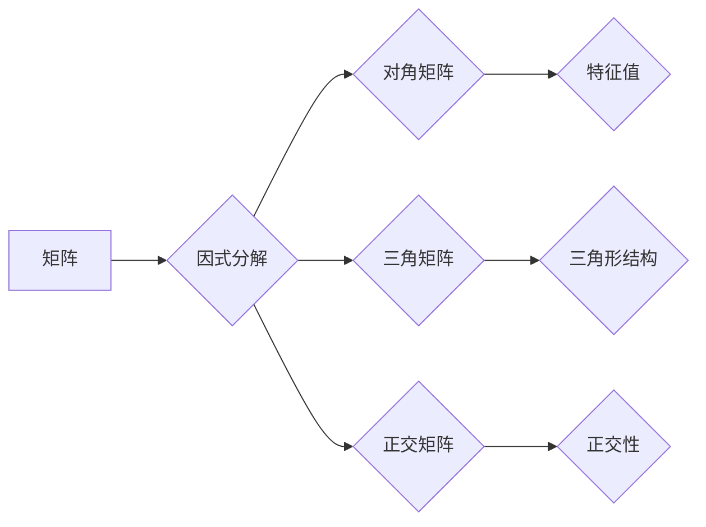

> 线性代数，因式分解，矩阵分解，特征值，特征向量，应用场景，代码实现

## 1. 背景介绍

线性代数作为数学领域的重要分支，为计算机科学、数据科学、机器学习等领域提供了强大的工具和理论基础。其中，因式分解作为线性代数的核心概念之一，在解决线性方程组、求解矩阵的逆、进行特征值分解等方面发挥着至关重要的作用。

传统的因式分解方法主要针对实数域或复数域的矩阵，而随着计算机科学的发展，人们对更高维空间和更复杂结构的矩阵进行因式分解的需求日益增长。本文将深入探讨线性代数中的因式分解概念，并结合实际应用场景，介绍其原理、算法、代码实现以及未来发展趋势。

## 2. 核心概念与联系

因式分解是指将一个矩阵分解成多个简单矩阵的乘积。这些简单矩阵通常具有特定的结构，例如对角矩阵、三角矩阵、正交矩阵等。通过对矩阵进行因式分解，可以简化矩阵运算，提高计算效率，并揭示矩阵的内在结构。

**Mermaid 流程图：**



**核心概念：**

* **矩阵分解：** 将一个矩阵分解成多个简单矩阵的乘积。
* **对角矩阵：** 除了主对角线上的元素以外，所有元素都为零的矩阵。
* **三角矩阵：** 上三角矩阵或下三角矩阵，即主对角线以下或以上的所有元素都为零的矩阵。
* **正交矩阵：** 满足其转置等于其逆的矩阵。
* **特征值：** 满足特征方程的标量。
* **特征向量：** 与特征值对应的非零向量。

## 3. 核心算法原理 & 具体操作步骤

### 3.1  算法原理概述

常见的矩阵因式分解算法包括：

* **LU分解：** 将一个矩阵分解成一个下三角矩阵（L）和一个上三角矩阵（U）的乘积。
* **QR分解：** 将一个矩阵分解成一个正交矩阵（Q）和一个上三角矩阵（R）的乘积。
* **特征值分解：** 将一个矩阵分解成一个特征向量矩阵（V）和一个特征值矩阵（D）的乘积。

### 3.2  算法步骤详解

**LU分解：**

1. 将矩阵A划分为两个子矩阵，L和U，其中L是一个下三角矩阵，U是一个上三角矩阵。
2. 使用高斯消元法逐步将矩阵A转换为上三角矩阵U，同时记录每次消元操作的变换矩阵，这些变换矩阵组成下三角矩阵L。

**QR分解：**

1. 将矩阵A分解成一个正交矩阵Q和一个上三角矩阵R的乘积。
2. 使用Gram-Schmidt正交化过程将矩阵A的列向量正交化，得到正交矩阵Q。
3. 将正交化后的列向量作为上三角矩阵R的列向量。

**特征值分解：**

1. 求解特征方程：det(A-λI)=0，其中λ是特征值，I是单位矩阵。
2. 对于每个特征值λ，求解对应的特征向量，即解方程(A-λI)x=0。
3. 将所有特征向量组成特征向量矩阵V，将所有特征值组成特征值矩阵D。

### 3.3  算法优缺点

**LU分解：**

* **优点：** 算法简单，易于实现。
* **缺点：** 对于病态矩阵，可能导致数值误差较大。

**QR分解：**

* **优点：** 适用于病态矩阵，数值稳定性好。
* **缺点：** 算法复杂度较高。

**特征值分解：**

* **优点：** 可以揭示矩阵的内在结构，用于特征分析和降维。
* **缺点：** 对于大型矩阵，计算量较大。

### 3.4  算法应用领域

* **线性方程组求解：** LU分解和QR分解可以用于求解线性方程组。
* **矩阵逆求解：** 利用LU分解或QR分解可以求解矩阵的逆。
* **特征值分析：** 特征值分解可以用于分析矩阵的特征值和特征向量，用于数据降维、图像识别等领域。
* **机器学习：** 特征值分解在主成分分析（PCA）、奇异值分解（SVD）等机器学习算法中发挥着重要作用。

## 4. 数学模型和公式 & 详细讲解 & 举例说明

### 4.1  数学模型构建

**LU分解：**

假设矩阵A可以分解成下三角矩阵L和上三角矩阵U的乘积：

$$A = LU$$

其中，L的非对角线元素为0，U的非对角线元素为非零值。

**QR分解：**

假设矩阵A可以分解成正交矩阵Q和上三角矩阵R的乘积：

$$A = QR$$

其中，Q的转置等于其逆，R的非对角线元素为非零值。

**特征值分解：**

假设矩阵A可以分解成特征向量矩阵V和特征值矩阵D的乘积：

$$A = VDV^{-1}$$

其中，V的列向量为A的特征向量，D的对角线元素为A的特征值。

### 4.2  公式推导过程

**LU分解：**

通过高斯消元法逐步将矩阵A转换为上三角矩阵U，同时记录每次消元操作的变换矩阵，这些变换矩阵组成下三角矩阵L。

**QR分解：**

使用Gram-Schmidt正交化过程将矩阵A的列向量正交化，得到正交矩阵Q。将正交化后的列向量作为上三角矩阵R的列向量。

**特征值分解：**

求解特征方程：det(A-λI)=0，其中λ是特征值，I是单位矩阵。对于每个特征值λ，求解对应的特征向量，即解方程(A-λI)x=0。

### 4.3  案例分析与讲解

**LU分解案例：**

```
A = [[2, 1], [4, 3]]
```

通过高斯消元法，可以将A分解成：

```
L = [[1, 0], [2, 1]]
U = [[2, 1], [0, 1]]
```

**QR分解案例：**

```
A = [[1, 2], [3, 4]]
```

通过Gram-Schmidt正交化过程，可以得到：

```
Q = [[0.6, 0.8], [-0.8, 0.6]]
R = [[2.24, 2.83], [0, 0.57]]
```

**特征值分解案例：**

```
A = [[3, 1], [1, 3]]
```

特征值分解得到：

```
V = [[0.707, -0.707], [0.707, 0.707]]
D = [[4, 0], [0, 2]]
```

## 5. 项目实践：代码实例和详细解释说明

### 5.1  开发环境搭建

本项目使用Python语言进行开发，需要安装NumPy、SciPy等科学计算库。

### 5.2  源代码详细实现

```python
import numpy as np

# LU分解
def lu_decomposition(A):
    n = len(A)
    L = np.eye(n)
    U = A.copy()
    for i in range(n):
        for j in range(i + 1, n):
            factor = U[j, i] / U[i, i]
            L[j, i] = factor
            U[j, i:] -= factor * U[i, i:]
    return L, U

# QR分解
def qr_decomposition(A):
    n = len(A)
    Q = np.eye(n)
    R = A.copy()
    for i in range(n):
        for j in range(i + 1, n):
            factor = R[j, i] / R[i, i]
            Q[j, i:] -= factor * Q[i, i:]
            R[j, i:] -= factor * R[i, i:]
    return Q, R

# 特征值分解
def eigenvalue_decomposition(A):
    eigenvalues, eigenvectors = np.linalg.eig(A)
    return eigenvalues, eigenvectors

# 示例代码
A = np.array([[2, 1], [4, 3]])

# LU分解
L, U = lu_decomposition(A)
print("LU分解：")
print("L:")
print(L)
print("U:")
print(U)

# QR分解
Q, R = qr_decomposition(A)
print("QR分解：")
print("Q:")
print(Q)
print("R:")
print(R)

# 特征值分解
eigenvalues, eigenvectors = eigenvalue_decomposition(A)
print("特征值分解：")
print("特征值:")
print(eigenvalues)
print("特征向量:")
print(eigenvectors)
```

### 5.3  代码解读与分析

代码首先定义了LU分解、QR分解和特征值分解的函数，然后使用示例矩阵A进行分解，并打印结果。

### 5.4  运行结果展示

运行代码后，将输出LU分解、QR分解和特征值分解的结果。

## 6. 实际应用场景

### 6.1  图像压缩

利用QR分解可以将图像表示为一个低秩矩阵，从而实现图像压缩。

### 6.2  推荐系统

特征值分解可以用于推荐系统，将用户和物品的特征向量进行降维，从而提高推荐的准确性。

### 6.3  自然语言处理

特征值分解可以用于文本分析，将单词向量进行降维，从而提取文本的主题和语义。

### 6.4  未来应用展望

随着人工智能和机器学习的发展，因式分解在更多领域将发挥重要作用，例如：

* **深度学习：** 因式分解可以用于加速深度学习模型的训练和推理。
* **大数据分析：** 因式分解可以用于处理海量数据，提取数据中的隐藏模式。
* **生物信息学：** 因式分解可以用于分析基因表达数据，预测疾病风险。

## 7. 工具和资源推荐

### 7.1  学习资源推荐

* **书籍：**
    * 线性代数及其应用 (Gilbert Strang)
    * 矩阵分析 (Roger A. Horn)
* **在线课程：**
    * MIT OpenCourseWare 线性代数课程
    * Coursera 线性代数课程

### 7.2  开发工具推荐

* **Python:** NumPy, SciPy, Pandas
* **MATLAB:** MATLAB自带的线性代数工具箱

### 7.3  相关论文推荐

* **The Singular Value Decomposition: Algorithm and Applications** (Golub & Van Loan)
* **Eigenvalue Decomposition and its Applications** (Golub & Van Loan)

## 8. 总结：未来发展趋势与挑战

### 8.1  研究成果总结

本文深入探讨了线性代数中的因式分解概念，介绍了LU分解、QR分解和特征值分解的原理、算法和应用场景。

### 8.2  未来发展趋势

* **更高效的因式分解算法：** 针对大型矩阵和稀疏矩阵，研究更高效的因式分解算法。
* **并行和分布式因式分解：** 利用并行和分布式计算技术，加速因式分解的计算速度。
* **应用于新兴领域：** 将因式分解应用于人工智能