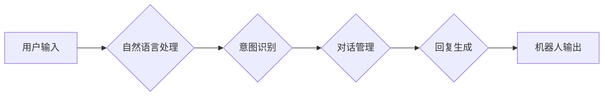

> 聊天机器人、人工智能、自然语言处理、客户服务、购物体验、机器学习、深度学习

## 1. 背景介绍

在当今数字化时代，客户服务扮演着至关重要的角色。消费者对快速、便捷、个性化的服务需求日益增长。传统客服模式，例如电话、邮件等，往往难以满足这些需求，效率低下，体验差。而聊天机器人作为一种新兴的客户服务技术，凭借其智能化、自动化、24小时在线等优势，正在迅速改变着客户服务的面貌。

聊天机器人是一种能够通过自然语言与人类进行对话的计算机程序。它利用人工智能技术，特别是自然语言处理（NLP）和机器学习（ML）等技术，能够理解用户的意图，并提供相应的回复。

## 2. 核心概念与联系

### 2.1 自然语言处理（NLP）

自然语言处理是人工智能领域的一个重要分支，旨在使计算机能够理解、处理和生成人类语言。NLP技术在聊天机器人中扮演着核心角色，它负责将用户的文本输入转换为机器可理解的格式，并生成机器可理解的文本输出。

### 2.2 机器学习（ML）

机器学习是人工智能领域的一个重要分支，旨在通过算法训练模型，使模型能够从数据中学习，并进行预测或分类。在聊天机器人中，机器学习技术用于训练模型，使其能够理解用户的意图，并提供相应的回复。

### 2.3 深度学习（DL）

深度学习是机器学习的一个子集，它利用多层神经网络来模拟人类大脑的学习过程。深度学习技术在聊天机器人中能够实现更精准的自然语言理解和生成，从而提供更自然、更流畅的对话体验。

**Mermaid 流程图**



## 3. 核心算法原理 & 具体操作步骤

### 3.1 算法原理概述

聊天机器人的核心算法原理主要包括：

* **自然语言理解（NLU）：** 将用户的文本输入转换为机器可理解的格式，包括词性标注、依存句法分析、语义角色标注等。
* **意图识别（Intent Recognition）：** 识别用户的意图，例如查询商品信息、下单购买、投诉建议等。
* **实体识别（Entity Recognition）：** 识别用户的文本输入中的关键信息，例如商品名称、价格、时间等。
* **对话管理（Dialogue Management）：** 控制对话的流程，根据用户的意图和历史对话上下文，选择合适的回复。
* **回复生成（Response Generation）：** 根据用户的意图和对话上下文，生成合适的回复文本。

### 3.2 算法步骤详解

1. **用户输入:** 用户通过文本或语音输入与聊天机器人进行对话。
2. **自然语言理解:** 聊天机器人使用NLU算法将用户的文本输入转换为机器可理解的格式，例如词向量、句向量等。
3. **意图识别:** 聊天机器人使用意图识别算法识别用户的意图，例如查询商品信息、下单购买、投诉建议等。
4. **实体识别:** 聊天机器人使用实体识别算法识别用户的文本输入中的关键信息，例如商品名称、价格、时间等。
5. **对话管理:** 聊天机器人使用对话管理算法根据用户的意图和历史对话上下文，选择合适的回复。
6. **回复生成:** 聊天机器人使用回复生成算法根据用户的意图和对话上下文，生成合适的回复文本。
7. **机器人输出:** 聊天机器人将生成的回复文本输出给用户。

### 3.3 算法优缺点

**优点:**

* **自动化:** 聊天机器人能够自动处理用户请求，无需人工干预。
* **24小时在线:** 聊天机器人能够全天候在线，随时为用户提供服务。
* **快速响应:** 聊天机器人能够快速响应用户请求，提供即时服务。
* **个性化:** 聊天机器人能够根据用户的历史对话记录和偏好，提供个性化的服务。

**缺点:**

* **理解能力有限:** 聊天机器人的理解能力有限，无法理解所有类型的用户请求。
* **缺乏情感共鸣:** 聊天机器人缺乏情感共鸣，无法像人类客服一样提供同理心和情感支持。
* **技术复杂:** 开发和维护聊天机器人需要专业的技术人员和技术支持。

### 3.4 算法应用领域

聊天机器人应用领域广泛，包括：

* **客户服务:** 自动处理客户咨询、投诉、订单等问题。
* **电商:** 提供商品推荐、下单购买、物流查询等服务。
* **金融:** 提供理财咨询、贷款申请、账户查询等服务。
* **教育:** 提供在线辅导、知识问答、学习资源推荐等服务。
* **医疗:** 提供健康咨询、预约挂号、病历查询等服务。

## 4. 数学模型和公式 & 详细讲解 & 举例说明

### 4.1 数学模型构建

在聊天机器人中，常用的数学模型包括：

* **词向量模型:** 将单词映射到向量空间，捕捉单词之间的语义关系。例如Word2Vec、GloVe等模型。
* **句向量模型:** 将句子映射到向量空间，捕捉句子的语义信息。例如Sentence-BERT、Universal Sentence Encoder等模型。
* **循环神经网络（RNN）:** 用于处理序列数据，例如文本序列。例如LSTM、GRU等模型。
* **Transformer:** 是一种新型的序列模型，能够捕捉长距离依赖关系。例如BERT、GPT等模型。

### 4.2 公式推导过程

由于篇幅限制，这里只列举一些常用的公式，并简要解释其含义。

* **词向量模型的损失函数:**

$$
L = \sum_{i=1}^{N} \left\| \mathbf{w}_i - \mathbf{v}_i \right\|^2
$$

其中，$\mathbf{w}_i$ 是词向量模型预测的词向量，$\mathbf{v}_i$ 是真实词向量，$N$ 是词典大小。

* **循环神经网络的输出:**

$$
h_t = f(W_{hh}h_{t-1} + W_{xh}x_t + b_h)
$$

其中，$h_t$ 是时间步$t$的隐藏状态，$f$ 是激活函数，$W_{hh}$ 和 $W_{xh}$ 是权重矩阵，$b_h$ 是偏置项，$x_t$ 是时间步$t$的输入。

### 4.3 案例分析与讲解

例如，在意图识别任务中，可以使用分类模型，例如支持向量机（SVM）或神经网络，将用户的文本输入映射到不同的意图类别。

## 5. 项目实践：代码实例和详细解释说明

### 5.1 开发环境搭建

* **操作系统:** Ubuntu 20.04
* **编程语言:** Python 3.8
* **深度学习框架:** TensorFlow 2.0
* **自然语言处理库:** NLTK、spaCy

### 5.2 源代码详细实现

```python
import tensorflow as tf
from tensorflow.keras.models import Sequential
from tensorflow.keras.layers import Embedding, LSTM, Dense

# 数据预处理
# ...

# 模型构建
model = Sequential()
model.add(Embedding(input_dim=vocab_size, output_dim=embedding_dim))
model.add(LSTM(units=128))
model.add(Dense(units=num_classes, activation='softmax'))

# 模型编译
model.compile(optimizer='adam', loss='sparse_categorical_crossentropy', metrics=['accuracy'])

# 模型训练
model.fit(x_train, y_train, epochs=10, batch_size=32)

# 模型评估
loss, accuracy = model.evaluate(x_test, y_test)
print('Loss:', loss)
print('Accuracy:', accuracy)
```

### 5.3 代码解读与分析

* **Embedding层:** 将单词映射到向量空间。
* **LSTM层:** 用于处理文本序列，捕捉长距离依赖关系。
* **Dense层:** 全连接层，用于分类。
* **softmax激活函数:** 将输出值映射到概率分布，用于预测意图类别。

### 5.4 运行结果展示

训练完成后，可以将模型应用于新的文本数据，预测其意图类别。

## 6. 实际应用场景

### 6.1 电商领域

* **智能客服:** 回答客户关于商品信息、订单状态、退换货政策等常见问题。
* **个性化推荐:** 根据用户的购买历史和浏览记录，推荐相关的商品。
* **导购助手:** 为用户提供商品介绍、搭配建议等服务。

### 6.2 金融领域

* **理财咨询:** 根据用户的风险偏好和投资目标，提供个性化的理财建议。
* **贷款申请:** 自动处理贷款申请，并提供贷款额度和利率信息。
* **账户查询:** 帮助用户查询账户余额、交易记录等信息。

### 6.3 教育领域

* **在线辅导:** 为学生提供个性化的学习辅导，解答学习问题。
* **知识问答:** 帮助学生查找相关知识，解答学习疑问。
* **学习资源推荐:** 根据学生的学习进度和兴趣，推荐相关的学习资源。

### 6.4 未来应用展望

随着人工智能技术的不断发展，聊天机器人将在更多领域得到应用，例如医疗、交通、娱乐等。未来，聊天机器人将更加智能化、个性化、人性化，能够更好地满足用户的需求。

## 7. 工具和资源推荐

### 7.1 学习资源推荐

* **书籍:**
    * 《深度学习》
    * 《自然语言处理》
    * 《聊天机器人技术》
* **在线课程:**
    * Coursera
    * edX
    * Udacity

### 7.2 开发工具推荐

* **TensorFlow:** 深度学习框架
* **PyTorch:** 深度学习框架
* **NLTK:** 自然语言处理库
* **spaCy:** 自然语言处理库

### 7.3 相关论文推荐

* **BERT: Pre-training of Deep Bidirectional Transformers for Language Understanding**
* **GPT-3: Language Models are Few-Shot Learners**
* **XLNet: Generalized Autoregressive Pretraining for Language Understanding**

## 8. 总结：未来发展趋势与挑战

### 8.1 研究成果总结

近年来，聊天机器人技术取得了显著进展，特别是深度学习技术的应用，使得聊天机器人的理解能力和生成能力大幅提升。

### 8.2 未来发展趋势

* **更智能的对话系统:** 能够理解更复杂的用户意图，并进行更自然、更流畅的对话。
* **更个性化的服务:** 根据用户的个人喜好和需求，提供个性化的服务。
* **多模态交互:** 支持文本、语音、图像等多种模态的交互。
* **跨语言理解:** 支持多种语言的对话。

### 8.3 面临的挑战

* **理解复杂语义:** 聊天机器人仍然难以理解复杂的语义关系和隐含信息。
* **生成自然流畅的文本:** 聊天机器人的文本生成能力仍然存在不足，生成的文本有时会显得生硬、不自然。
* **数据标注问题:** 训练聊天机器人需要大量的标注数据，数据标注成本高昂。
* **伦理问题:** 聊天机器人可能会被用于欺骗、传播虚假信息等恶意目的，需要考虑伦理问题。

### 8.4 研究展望

未来，聊天机器人技术将继续发展，朝着更智能、更人性化、更安全的方向发展。

## 9. 附录：常见问题与解答

* **Q: 聊天机器人和虚拟助理有什么区别？**
* **A:** 聊天机器人主要用于处理用户请求，提供服务，而虚拟助理则更侧重于帮助用户完成任务，例如设置提醒、发送邮件等。

* **Q: 如何训练一个聊天机器人？**
* **A:** 需要准备大量的文本数据，并使用深度学习算法进行训练。

* **Q: 聊天机器人的安全性如何保证？**
* **A:**