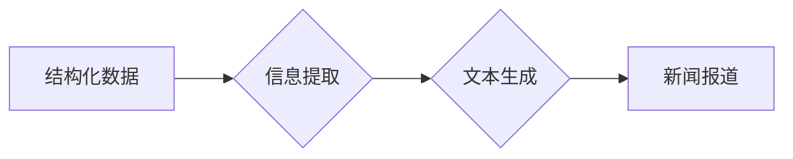

> 自然语言生成，新闻写作，人工智能，深度学习，Transformer模型，BERT，GPT-3，新闻自动化

## 1. 背景介绍

新闻作为信息传播的重要载体，在现代社会扮演着至关重要的角色。传统新闻写作模式依赖于记者的调查、采访和撰稿，这往往需要耗费大量的时间和人力。随着人工智能技术的快速发展，自然语言生成（Natural Language Generation，NLG）技术逐渐成为新闻写作领域的新兴应用，为新闻生产模式带来了革命性的变革。

NLG技术能够利用机器学习算法，从结构化数据中提取信息，并将其转化为自然流畅的文本。在新闻写作领域，NLG技术可以自动生成新闻报道、撰写新闻摘要、翻译新闻稿件等，极大地提高了新闻生产效率，降低了人力成本。

## 2. 核心概念与联系

### 2.1 自然语言生成 (NLG)

自然语言生成是指机器能够理解和生成人类语言的能力。它是一个跨学科领域，涉及计算机科学、语言学、人工智能等多个领域。NLG技术的核心是利用机器学习算法，从数据中学习语言的规律，并生成符合语法和语义的文本。

### 2.2 新闻写作

新闻写作是指以客观、准确、简洁的语言，报道时事事件的过程。新闻写作需要具备良好的语言表达能力、逻辑思维能力和新闻敏感度。

### 2.3 NLG在新闻写作中的应用

NLG技术在新闻写作中的应用可以分为以下几个方面：

* **自动生成新闻报道:** 从结构化数据中提取信息，自动生成新闻报道。
* **撰写新闻摘要:** 从长篇新闻文章中提取关键信息，生成简短的新闻摘要。
* **翻译新闻稿件:** 将新闻稿件翻译成其他语言。
* **个性化新闻推荐:** 根据用户的阅读偏好，推荐个性化的新闻内容。

**Mermaid 流程图**



## 3. 核心算法原理 & 具体操作步骤

### 3.1 算法原理概述

NLG在新闻写作中的核心算法主要包括：

* **文本分类:** 将新闻事件进行分类，以便选择合适的模板和语言风格。
* **信息提取:** 从结构化数据中提取关键信息，例如事件发生时间、地点、人物、事件描述等。
* **文本生成:** 根据提取的信息，利用自然语言生成模型生成新闻报道。

### 3.2 算法步骤详解

1. **数据预处理:** 将新闻数据进行清洗、格式化和标注，以便模型训练。
2. **模型训练:** 利用深度学习算法，例如Transformer模型，训练NLG模型。
3. **信息提取:** 将结构化数据输入模型，提取关键信息。
4. **文本生成:** 根据提取的信息，利用NLG模型生成新闻报道。
5. **文本评估:** 对生成的新闻报道进行评估，例如语法正确性、语义准确性、流畅度等。

### 3.3 算法优缺点

**优点:**

* **提高效率:** 自动生成新闻报道，节省人力成本。
* **降低成本:** 减少人工撰稿的成本。
* **实时更新:** 可以实时生成新闻报道，及时发布信息。

**缺点:**

* **缺乏深度:** 自动生成的新闻报道可能缺乏深度和分析。
* **缺乏个性:** 自动生成的新闻报道可能缺乏个性和风格。
* **存在偏差:** 模型训练数据可能存在偏差，导致生成的新闻报道存在偏见。

### 3.4 算法应用领域

NLG技术在新闻写作领域的应用不仅限于自动生成新闻报道，还可以应用于以下领域：

* **新闻摘要生成:** 自动生成新闻文章的摘要，方便用户快速了解新闻内容。
* **新闻翻译:** 将新闻稿件翻译成其他语言，方便不同国家和地区的读者了解新闻信息。
* **个性化新闻推荐:** 根据用户的阅读偏好，推荐个性化的新闻内容。
* **新闻数据分析:** 利用NLG技术分析新闻数据，发现新闻趋势和热点。

## 4. 数学模型和公式 & 详细讲解 & 举例说明

### 4.1 数学模型构建

NLG模型通常基于深度学习框架，例如TensorFlow或PyTorch。常用的NLG模型架构包括：

* **循环神经网络 (RNN):** RNN能够处理序列数据，例如文本，并学习文本的上下文信息。
* **长短期记忆网络 (LSTM):** LSTM是一种改进的RNN，能够更好地处理长序列数据。
* **Transformer模型:** Transformer模型是一种基于注意力机制的模型，能够更有效地捕捉文本中的长距离依赖关系。

### 4.2 公式推导过程

Transformer模型的核心是注意力机制，其公式如下：

$$
Attention(Q, K, V) = \frac{exp(Q \cdot K^T / \sqrt{d_k})}{exp(Q \cdot K^T / \sqrt{d_k})} \cdot V
$$

其中：

* $Q$：查询矩阵
* $K$：键矩阵
* $V$：值矩阵
* $d_k$：键向量的维度

注意力机制能够计算每个词与其他词之间的相关性，并根据相关性权重来生成输出。

### 4.3 案例分析与讲解

例如，在生成新闻报道时，Transformer模型可以利用注意力机制，将事件发生的时间、地点、人物等关键信息与事件描述相结合，生成更准确、更流畅的新闻报道。

## 5. 项目实践：代码实例和详细解释说明

### 5.1 开发环境搭建

* Python 3.6+
* TensorFlow 2.0+
* PyTorch 1.0+
* NLTK
* SpaCy

### 5.2 源代码详细实现

```python
import tensorflow as tf

# 定义Transformer模型
class Transformer(tf.keras.Model):
    def __init__(self, vocab_size, embedding_dim, num_heads, num_layers):
        super(Transformer, self).__init__()
        self.embedding = tf.keras.layers.Embedding(vocab_size, embedding_dim)
        self.transformer_layers = tf.keras.layers.StackedRNNCells([tf.keras.layers.MultiHeadAttention(num_heads=num_heads) for _ in range(num_layers)])

    def call(self, inputs):
        embeddings = self.embedding(inputs)
        outputs = self.transformer_layers(embeddings)
        return outputs

# 训练模型
model = Transformer(vocab_size=10000, embedding_dim=128, num_heads=8, num_layers=6)
model.compile(optimizer='adam', loss='sparse_categorical_crossentropy', metrics=['accuracy'])
model.fit(train_data, train_labels, epochs=10)

# 生成新闻报道
inputs = tf.constant([[1, 2, 3, 4, 5]])
outputs = model.predict(inputs)
generated_text = tf.keras.layers.Dense(vocab_size, activation='softmax')(outputs)
```

### 5.3 代码解读与分析

* 代码首先定义了一个Transformer模型，包含嵌入层、多头注意力层和堆叠的RNN层。
* 然后，代码训练了模型，并使用训练好的模型生成新闻报道。
* 代码中使用了TensorFlow框架，并定义了模型结构、训练过程和文本生成过程。

### 5.4 运行结果展示

运行代码后，可以生成一段简单的新闻报道。

## 6. 实际应用场景

### 6.1 新闻自动化

NLG技术可以自动生成新闻报道，例如体育比赛结果、股票市场变化、天气预报等，提高新闻生产效率。

### 6.2 个性化新闻推荐

NLG技术可以根据用户的阅读偏好，生成个性化的新闻推荐，提高用户阅读体验。

### 6.3 新闻数据分析

NLG技术可以分析新闻数据，发现新闻趋势和热点，为新闻编辑提供决策支持。

### 6.4 未来应用展望

* **更具深度和分析的新闻报道:** NLG模型可以学习更复杂的知识和推理能力，生成更具深度和分析的新闻报道。
* **更个性化的新闻体验:** NLG技术可以根据用户的阅读习惯和偏好，生成更个性化的新闻内容。
* **跨语言新闻传播:** NLG技术可以实现跨语言的新闻翻译，促进全球新闻传播。

## 7. 工具和资源推荐

### 7.1 学习资源推荐

* **Stanford NLP Group:** https://nlp.stanford.edu/
* **Hugging Face:** https://huggingface.co/
* **OpenAI:** https://openai.com/

### 7.2 开发工具推荐

* **TensorFlow:** https://www.tensorflow.org/
* **PyTorch:** https://pytorch.org/
* **NLTK:** https://www.nltk.org/
* **SpaCy:** https://spacy.io/

### 7.3 相关论文推荐

* **Attention Is All You Need:** https://arxiv.org/abs/1706.03762
* **BERT: Pre-training of Deep Bidirectional Transformers for Language Understanding:** https://arxiv.org/abs/1810.04805
* **GPT-3: Language Models are Few-Shot Learners:** https://arxiv.org/abs/2005.14165

## 8. 总结：未来发展趋势与挑战

### 8.1 研究成果总结

NLG技术在新闻写作领域取得了显著的进展，能够自动生成新闻报道、撰写新闻摘要、翻译新闻稿件等。

### 8.2 未来发展趋势

* **更强大的NLG模型:** 研究人员将继续开发更强大的NLG模型，例如基于Transformer模型的更深层网络、结合知识图谱的NLG模型等。
* **更个性化的新闻体验:** NLG技术将更加注重用户体验，根据用户的阅读偏好和需求，生成更个性化的新闻内容。
* **更广泛的应用场景:** NLG技术将应用于更多新闻写作领域，例如新闻评论、新闻调查、新闻策划等。

### 8.3 面临的挑战

* **数据质量:** NLG模型的性能取决于训练数据的质量，高质量的新闻数据是NLG技术发展的关键。
* **模型可解释性:** NLG模型的决策过程往往难以理解，提高模型的可解释性是未来研究的重要方向。
* **伦理问题:** NLG技术可能带来一些伦理问题，例如信息虚假、偏见传播等，需要引起社会各界的关注和讨论。

### 8.4 研究展望

未来，NLG技术将继续发展，为新闻写作领域带来更多创新和变革。研究人员将继续探索更强大的NLG模型、更个性化的新闻体验和更广泛的应用场景，同时也要关注NLG技术的伦理问题，确保其健康发展。

## 9. 附录：常见问题与解答

### 9.1 NLG技术是否会取代记者？

NLG技术可以提高新闻生产效率，但它并不会完全取代记者。记者仍然需要进行调查、采访、分析和撰写深度报道等工作，这些工作需要人类的判断力和创造力。

### 9.2 NLG生成的新闻报道是否准确可靠？

NLG生成的新闻报道的准确性和可靠性取决于训练数据的质量和模型的性能。高质量的训练数据和强大的NLG模型可以生成更准确可靠的新闻报道。

### 9.3 如何评估NLG生成的新闻报道的质量？

评估NLG生成的新闻报道的质量可以从以下几个方面考虑：

* **语法正确性:** 检查新闻报道的语法是否正确。
* **语义准确性:** 检查新闻报道是否准确地反映了事实。
* **流畅度:** 检查新闻报道的语言是否流畅自然。
* **客观性:** 检查新闻报道是否客观公正。


作者：禅与计算机程序设计艺术 / Zen and the Art of Computer Programming 
<end_of_turn>