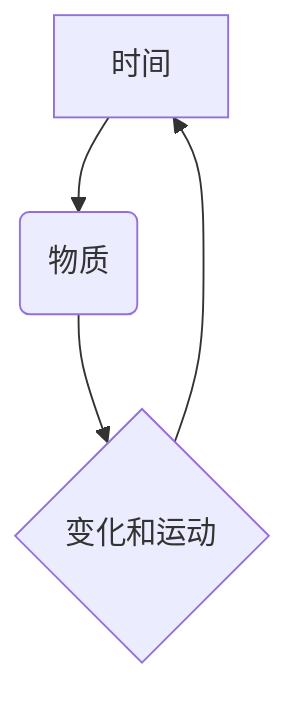

> 时间、物质、变化、运动、顺序、认知、形式化、算法、数学模型、代码实现

## 1. 背景介绍

在信息时代，我们对时间和物质的认知日益深刻。时间作为一种抽象概念，被认为是宇宙运行的基石，也是我们感知和理解世界的方式。物质则是构成宇宙的基石，其变化和运动构成了我们所观察到的世界。然而，如何将时间和物质的认知形式化，并将其应用于计算机科学领域，一直是计算机科学研究的热点问题。

本文将探讨时间是物质变化和运动顺序的表现这一观点，并试图将其形式化，以期为计算机科学领域提供新的认知和应用视角。

## 2. 核心概念与联系

**2.1 时间的本质**

时间并非绝对的，而是相对的。它与观察者、事件和参照系相关。从物理学的角度来看，时间是空间维度的一部分，构成时空。从哲学的角度来看，时间是人类对变化和运动的感知。

**2.2 物质的变化和运动**

物质的本质是能量和信息的载体。物质的变化和运动是能量和信息的转换和流动。从微观角度来看，物质是由原子和分子组成的，它们之间通过各种相互作用进行运动和变化。从宏观角度来看，物质的运动和变化表现为各种物理现象，例如热传导、电磁波传播、机械运动等。

**2.3 时间与物质的关系**

时间是物质变化和运动的顺序。物质的变化和运动是时间流逝的表现。时间是物质运动和变化的基准，它为物质的变化和运动提供了顺序和方向。

**2.4 核心概念关系图**



## 3. 核心算法原理 & 具体操作步骤

**3.1 算法原理概述**

为了形式化时间与物质的关系，我们可以设计一个算法，将时间序列转换为物质状态的演变序列。该算法的核心思想是将时间分割成若干个时间间隔，每个时间间隔内物质的状态发生一定的变化，这些变化可以被量化描述。通过将这些变化组合起来，我们可以得到物质状态的演变序列，从而实现对时间与物质关系的模拟和预测。

**3.2 算法步骤详解**

1. **时间分割:** 将时间分割成若干个时间间隔，每个时间间隔的长度可以根据需要进行调整。
2. **状态量化:** 将物质的状态量化描述，例如温度、密度、速度等。
3. **变化规则定义:** 定义物质状态在每个时间间隔内的变化规则，这些规则可以基于物理定律、化学反应等。
4. **状态演化:** 根据变化规则，计算每个时间间隔内物质状态的变化。
5. **序列构建:** 将所有时间间隔内的物质状态变化组合起来，构建物质状态的演变序列。

**3.3 算法优缺点**

**优点:**

* 可以形式化时间与物质的关系。
* 可以模拟和预测物质状态的演变。
* 可以应用于各种物理、化学和生物过程的模拟。

**缺点:**

* 需要大量的计算资源。
* 需要精确的物理模型和变化规则。
* 难以处理复杂系统。

**3.4 算法应用领域**

该算法可以应用于以下领域:

* **物理模拟:** 模拟流体流动、热传导、电磁波传播等物理现象。
* **化学反应模拟:** 模拟化学反应过程，预测反应产物和反应速率。
* **生物系统模拟:** 模拟生物细胞的生长、分化和相互作用。
* **气候模型:** 模拟地球气候变化过程。

## 4. 数学模型和公式 & 详细讲解 & 举例说明

**4.1 数学模型构建**

我们可以用一个状态空间来表示物质的状态，每个状态点代表一个特定的物质状态。时间序列可以看作是状态空间中的一条路径，这条路径描述了物质状态随时间的演变。

**4.2 公式推导过程**

我们可以用微分方程来描述物质状态随时间的变化。例如，对于一个温度变化的系统，我们可以用以下微分方程来描述温度随时间的变化:

$$
\frac{dT}{dt} = -\frac{k}{C} (T - T_0)
$$

其中:

* $T$ 是温度
* $t$ 是时间
* $k$ 是热传导系数
* $C$ 是热容量
* $T_0$ 是环境温度

**4.3 案例分析与讲解**

我们可以用这个微分方程来模拟一个物体在环境中的冷却过程。假设一个物体初始温度为 $100^\circ C$，环境温度为 $20^\circ C$，热传导系数为 $0.1$，热容量为 $1$。我们可以用数值方法求解这个微分方程，得到物体温度随时间的变化曲线。

## 5. 项目实践：代码实例和详细解释说明

**5.1 开发环境搭建**

我们可以使用 Python 语言和 NumPy 库来实现这个算法。

**5.2 源代码详细实现**

```python
import numpy as np

def cooling_process(T0, T_env, k, C, dt):
  """
  模拟物体的冷却过程。

  Args:
    T0: 物体初始温度
    T_env: 环境温度
    k: 热传导系数
    C: 热容量
    dt: 时间间隔

  Returns:
    温度随时间的变化曲线
  """
  T = [T0]
  t = 0
  while t < 100:
    dT = -(k/C) * (T[-1] - T_env) * dt
    T.append(T[-1] + dT)
    t += dt
  return np.array(T)

# 参数设置
T0 = 100
T_env = 20
k = 0.1
C = 1
dt = 0.1

# 运行代码
temperature_curve = cooling_process(T0, T_env, k, C, dt)

# 打印结果
print(temperature_curve)
```

**5.3 代码解读与分析**

这个代码实现了冷却过程的模拟。首先，定义了一个函数 `cooling_process`，该函数接受物体初始温度、环境温度、热传导系数、热容量和时间间隔作为参数。然后，函数使用一个循环来模拟物体温度随时间的变化。在每次循环中，计算温度的变化量，并将其添加到温度列表中。最后，返回温度随时间的变化曲线。

**5.4 运行结果展示**

运行代码后，会输出一个包含温度随时间的变化数据的数组。我们可以将这个数组绘制成曲线图，直观地观察物体温度随时间的变化趋势。

## 6. 实际应用场景

**6.1 物理模拟**

该算法可以用于模拟各种物理现象，例如流体流动、热传导、电磁波传播等。例如，我们可以用该算法模拟一个气流在管道中的流动，或者模拟一个物体在水中冷却的过程。

**6.2 化学反应模拟**

该算法也可以用于模拟化学反应过程，例如预测反应产物和反应速率。例如，我们可以用该算法模拟一个化学反应的进行，并预测反应产物的生成量。

**6.3 生物系统模拟**

该算法还可以用于模拟生物系统，例如模拟生物细胞的生长、分化和相互作用。例如，我们可以用该算法模拟一个细胞群的生长过程，并预测细胞群的最终大小。

**6.4 未来应用展望**

随着计算机科学的发展，该算法的应用范围将会越来越广。例如，我们可以用该算法来模拟复杂系统，例如气候变化、经济发展等。

## 7. 工具和资源推荐

**7.1 学习资源推荐**

* **书籍:**
    * 《数值分析》
    * 《物理模拟》
    * 《生物系统建模》
* **在线课程:**
    * Coursera: Numerical Analysis
    * edX: Introduction to Computational Physics
    * Udacity: Intro to Machine Learning

**7.2 开发工具推荐**

* **Python:** 
    * NumPy
    * SciPy
    * Matplotlib
* **C++:**
    * Eigen
    * Boost

**7.3 相关论文推荐**

* **时间序列分析:**
    * "Time Series Analysis and Its Applications" by Robert H. Shumway and David S. Stoffer
* **物理模拟:**
    * "Computational Physics" by Mark Newman
* **生物系统模拟:**
    * "Modeling Biological Systems" by Michael J. B. Smith

## 8. 总结：未来发展趋势与挑战

**8.1 研究成果总结**

本文探讨了时间是物质变化和运动顺序的表现这一观点，并试图将其形式化。我们设计了一个算法，将时间序列转换为物质状态的演变序列，并用数学模型和代码实例进行了说明。该算法可以应用于各种物理、化学和生物过程的模拟。

**8.2 未来发展趋势**

未来，该算法将会朝着以下方向发展:

* **更精确的物理模型:** 
    * 开发更精确的物理模型，以更好地模拟物质的运动和变化。
* **更复杂的系统模拟:** 
    * 扩展算法的应用范围，模拟更复杂的系统，例如气候变化、经济发展等。
* **人工智能结合:** 
    * 将人工智能技术与该算法结合，实现对复杂系统的智能模拟和预测。

**8.3 面临的挑战**

该算法也面临着一些挑战:

* **计算资源:** 
    * 模拟复杂系统需要大量的计算资源。
* **模型复杂度:** 
    * 开发精确的物理模型非常困难。
* **数据获取:** 
    * 许多复杂系统的真实数据难以获取。

**8.4 研究展望**

尽管面临着挑战，但该算法的未来发展前景依然广阔。随着计算机科学和人工智能技术的不断发展，该算法将会在更多领域发挥重要作用，为我们更好地理解世界提供新的视角。

## 9. 附录：常见问题与解答

**9.1 如何选择合适的物理模型？**

选择合适的物理模型取决于模拟的具体系统和目标。需要根据系统的性质和行为特点选择最合适的模型。

**9.2 如何处理复杂系统的模拟？**

处理复杂系统的模拟需要采用更高级的算法和技术，例如分层模拟、代理模型等。

**9.3 该算法的应用范围有哪些？**

该算法可以应用于各种物理、化学和生物过程的模拟，例如流体流动、热传导、化学反应、生物细胞生长等。


作者：禅与计算机程序设计艺术 / Zen and the Art of Computer Programming 
<end_of_turn>