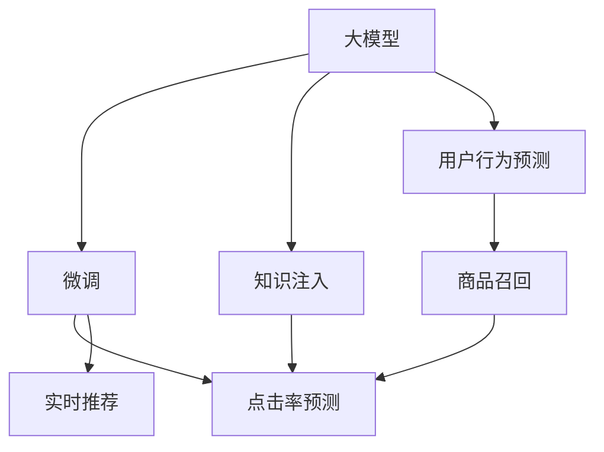

                 

# 搜索推荐系统的AI 大模型优化：电商平台的核心竞争优势

> 关键词：搜索推荐系统,大模型优化,电商平台,用户行为预测,商品召回,点击率预测,用户留存

## 1. 背景介绍

### 1.1 问题由来
随着电商平台的日益繁荣，用户对个性化商品推荐的需求愈发强烈。搜索推荐系统作为电商平台的核心功能模块，其性能直接影响用户体验和转化率。传统的搜索推荐系统往往依赖于各种特征工程和模型训练，难以实时捕捉用户行为的变化。而人工智能(AI)大模型，特别是预训练模型，以其强大的学习能力和泛化性能，为个性化推荐带来了新的可能性。

大模型通过在大规模无标签数据上进行预训练，学习到丰富的语言和视觉表征，能够在数据分布变化、新商品上架等情况下快速适应，提供更加精准和个性化的商品推荐。在实际应用中，电商平台的搜索推荐系统可以利用大模型的知识库，通过微调或知识注入等方式，进一步提升推荐效果，构建独特核心竞争力。

### 1.2 问题核心关键点
大模型优化在电商搜索推荐系统中，具体涉及以下几个核心关键点：

- **大模型选择**：选择合适的预训练大模型，如BERT、GPT-3等，作为推荐系统的基础。
- **数据适配**：将电商平台的商品数据和用户行为数据适配为大模型的输入格式，进行微调或知识注入。
- **模型优化**：通过微调或优化技术提升模型在特定任务上的性能，如用户行为预测、商品召回、点击率预测等。
- **指标评估**：选择合适的评估指标，如准确率、召回率、ROI等，衡量模型的效果。
- **实时部署**：将优化后的模型集成到电商平台，实现实时推荐。

这些问题共同构成了一个完整的大模型优化过程，旨在通过模型适配和优化，构建高效、精准、个性化的搜索推荐系统。

## 2. 核心概念与联系

### 2.1 核心概念概述

为更好地理解大模型在电商搜索推荐系统中的优化方法，本节将介绍几个密切相关的核心概念：

- **大模型**：以BERT、GPT-3等为代表，通过大规模无标签数据预训练学习到的丰富表征。
- **微调(Fine-Tuning)**：在大模型的基础上，利用电商平台的标注数据进行有监督的微调，以提升模型在特定任务上的性能。
- **知识注入(Knowledge Injection)**：将电商平台的商品知识、用户行为规则等与大模型融合，提高模型对特定领域知识的理解和运用。
- **点击率预测(CTR Prediction)**：预测用户点击商品的概率，用于商品排序和推荐。
- **商品召回(Recommender System)**：从电商平台的所有商品中，基于用户历史行为和兴趣，推荐最相关的商品。
- **用户行为预测(User Behavior Prediction)**：基于用户行为数据，预测用户的购买倾向、退货概率等。
- **实时推荐**：实时捕捉用户行为变化，动态更新推荐内容，提高推荐的相关性和实时性。

这些核心概念之间的逻辑关系可以通过以下Mermaid流程图来展示：



这个流程图展示了大模型优化中的关键概念及其之间的关系：

1. 大模型通过预训练学习到丰富的表征。
2. 微调和知识注入将大模型的表征适配到电商平台的特定任务上。
3. 点击率预测和商品召回等任务基于微调和知识注入后的模型进行。
4. 用户行为预测可以辅助商品召回和点击率预测，提供更多的用户行为信息。
5. 实时推荐依赖于动态更新的模型，捕捉用户行为变化。

这些概念共同构成了大模型在电商搜索推荐系统中的优化框架，使其能够在各种场景下发挥强大的推荐能力。

## 3. 核心算法原理 & 具体操作步骤
### 3.1 算法原理概述

大模型在电商搜索推荐系统中的优化，主要依赖于微调和知识注入技术。其核心思想是：利用大模型已经学习到的丰富表征，通过有监督的微调和知识注入，使得模型能够更好地适应电商平台的特定任务，提升推荐系统的性能。

具体来说，假设预训练模型为 $M_{\theta}$，其中 $\theta$ 为大模型的参数。给定电商平台推荐任务 $T$ 的标注数据集 $D=\{(x_i, y_i)\}_{i=1}^N$，优化的目标是最小化损失函数 $\mathcal{L}(M_{\theta},D)$，其中 $\mathcal{L}$ 为针对任务 $T$ 设计的损失函数，如交叉熵损失、均方误差损失等。通过梯度下降等优化算法，不断更新模型参数 $\theta$，最小化损失函数，得到优化后的模型 $M_{\hat{\theta}}$。

### 3.2 算法步骤详解

大模型在电商搜索推荐系统中的优化通常包括以下关键步骤：

**Step 1: 准备数据和模型**
- 收集电商平台的用户行为数据、商品数据等，进行清洗和标注。
- 选择合适的预训练模型，如BERT、GPT-3等，作为初始化参数。

**Step 2: 数据适配**
- 将电商平台的数据适配为大模型的输入格式，如将商品描述转换为token序列，将用户行为数据转换为时间序列等。
- 在适配过程中，可能还需要进行数据增强，如近义词替换、数据扩充等，以丰富数据多样性。

**Step 3: 微调模型**
- 在大模型的基础上进行有监督的微调，利用标注数据集 $D$ 更新模型参数 $\theta$。
- 使用合适的优化算法，如AdamW、SGD等，设置合适的学习率、批大小、迭代轮数等。
- 应用正则化技术，如L2正则、Dropout、Early Stopping等，防止过拟合。

**Step 4: 知识注入**
- 将电商平台特定的商品知识、用户行为规则等与大模型融合，提升模型的领域适应能力。
- 可以通过微调的方式注入知识，如在预训练模型的顶层添加新的输出层，学习任务特定的表征。
- 或者通过迁移学习的方式注入知识，如在微调过程中引入领域特定的数据集，进行二次微调。

**Step 5: 评估和优化**
- 在验证集和测试集上评估微调后的模型性能，选择最优的模型。
- 根据评估结果，进行模型参数的调整，如调整学习率、批大小、训练轮数等。
- 重复上述过程，直至得到最优的模型。

**Step 6: 实时推荐部署**
- 将优化后的模型集成到电商平台的推荐系统，实现实时推荐。
- 实时捕捉用户行为变化，动态更新推荐内容。

### 3.3 算法优缺点

大模型优化在电商搜索推荐系统中的应用，具有以下优点：

- **泛化能力强**：大模型已经在大规模数据上预训练，能够泛化到多种数据分布和任务。
- **效果显著**：微调和知识注入能够显著提升模型的推荐效果，提高用户满意度和转化率。
- **灵活性高**：可以根据电商平台的特定需求，灵活调整模型结构和优化算法。

同时，也存在一些缺点：

- **资源消耗大**：大模型的参数量较大，计算资源消耗较高。
- **实时性要求高**：实时推荐系统需要高效实时计算，对模型推理速度有较高要求。
- **数据隐私问题**：电商平台的标注数据可能涉及用户隐私，数据获取和处理需要符合隐私法规。

尽管存在这些局限性，但大模型优化仍然是大数据时代下电商推荐系统的核心技术之一。未来相关研究的重点在于如何进一步降低计算资源消耗，提高实时性，同时兼顾数据隐私和用户安全。

### 3.4 算法应用领域

大模型优化技术在电商搜索推荐系统中的应用领域非常广泛，例如：

- **商品推荐**：基于用户历史行为和兴趣，推荐相关商品。
- **用户画像构建**：通过用户行为数据，构建用户画像，用于个性化推荐。
- **新商品推荐**：根据用户历史行为和商品属性，推荐新上架的商品。
- **价格优化**：基于用户行为和市场数据，动态调整商品价格。
- **库存管理**：预测商品需求量，优化库存配置。
- **广告投放**：根据用户兴趣和行为，推荐个性化广告。

这些应用领域涵盖了大模型优化的方方面面，展示了其在电商平台中的广泛应用和巨大潜力。

## 4. 数学模型和公式 & 详细讲解 & 举例说明

### 4.1 数学模型构建

大模型在电商搜索推荐系统中的优化，通常涉及以下几个数学模型：

- **点击率预测模型**：假设用户对商品 $i$ 的点击率为 $y_i$，其预测模型为：
$$
\hat{y}_i = \sigma(\vec{w}^T\phi(x_i))
$$
其中 $\vec{w}$ 为模型的预测权重，$\phi(x_i)$ 为商品 $i$ 的特征表示函数。

- **用户行为预测模型**：假设用户 $u$ 在时间 $t$ 的某个行为事件 $o$ 发生的概率为 $y_{u, o, t}$，其预测模型为：
$$
\hat{y}_{u, o, t} = \sigma(\vec{v}^T\psi(u, o, t))
$$
其中 $\vec{v}$ 为预测权重，$\psi(u, o, t)$ 为用户 $u$ 在时间 $t$ 的行为表示函数。

- **商品召回模型**：给定用户 $u$，根据其历史行为，推荐商品 $i$ 的概率为：
$$
\hat{p}_{u, i} = \frac{e^{\vec{w}^T\phi(x_i) + \vec{v}^T\psi(u)}}{\sum_{j \in I} e^{\vec{w}^T\phi(x_j) + \vec{v}^T\psi(u)}}
$$
其中 $I$ 为商品集合。

### 4.2 公式推导过程

以点击率预测模型为例，推导其训练过程。

假设用户 $i$ 的实际点击率为 $y_i$，模型预测的点击率为 $\hat{y}_i$，则点击率的负对数似然损失函数为：
$$
\mathcal{L}_i = -y_i \log \hat{y}_i - (1-y_i) \log (1-\hat{y}_i)
$$

对所有样本 $i$ 求和，得到损失函数：
$$
\mathcal{L} = \frac{1}{N} \sum_{i=1}^N \mathcal{L}_i = \frac{1}{N} \sum_{i=1}^N [-y_i \log \hat{y}_i - (1-y_i) \log (1-\hat{y}_i)]
$$

为了最小化损失函数，需要求解 $\vec{w}$，可以通过梯度下降算法求解，即：
$$
\vec{w} \leftarrow \vec{w} - \eta \frac{\partial \mathcal{L}}{\partial \vec{w}}
$$

其中 $\eta$ 为学习率。

类似地，对于用户行为预测模型和商品召回模型，也可以通过求解相应的损失函数，最小化预测误差，提升模型性能。

### 4.3 案例分析与讲解

**案例：电商平台商品推荐系统的点击率预测**

假设有电商平台 A，其商品总数为 $I$，用户总数为 $U$。平台收集了用户的历史点击行为数据 $D=\{(x_i, y_i)\}_{i=1}^N$，其中 $x_i$ 为商品特征向量，$y_i$ 为点击标签。假设平台选择使用BERT模型进行优化。

**Step 1: 数据适配**

平台需要对用户行为数据进行清洗和标注，将点击标签 $y_i$ 转换为0-1标签。同时，将商品特征向量 $x_i$ 转换为BERT模型所需的格式。

**Step 2: 微调模型**

平台在BERT模型的基础上进行微调，选择合适的网络结构（如BERT + CTR Head）和优化算法（如AdamW）。设置合适的学习率（如1e-5）和迭代轮数（如10轮）。

**Step 3: 知识注入**

平台将商品的属性信息、用户的行为偏好等知识注入到BERT模型中，通过在模型顶部添加新的输出层和损失函数，学习任务特定的表征。

**Step 4: 评估和优化**

平台在验证集和测试集上评估模型的性能，选择最优的模型。根据评估结果，调整学习率、批大小、训练轮数等参数，进一步优化模型。

**Step 5: 实时推荐部署**

平台将优化后的模型集成到推荐系统中，实时捕捉用户行为变化，动态更新推荐内容。

通过上述步骤，平台能够构建高效的推荐系统，提升用户满意度和平台收益。

## 5. 项目实践：代码实例和详细解释说明

### 5.1 开发环境搭建

在进行大模型优化实践前，我们需要准备好开发环境。以下是使用Python进行PyTorch开发的环境配置流程：

1. 安装Anaconda：从官网下载并安装Anaconda，用于创建独立的Python环境。

2. 创建并激活虚拟环境：
```bash
conda create -n pytorch-env python=3.8 
conda activate pytorch-env
```

3. 安装PyTorch：根据CUDA版本，从官网获取对应的安装命令。例如：
```bash
conda install pytorch torchvision torchaudio cudatoolkit=11.1 -c pytorch -c conda-forge
```

4. 安装Transformers库：
```bash
pip install transformers
```

5. 安装各类工具包：
```bash
pip install numpy pandas scikit-learn matplotlib tqdm jupyter notebook ipython
```

完成上述步骤后，即可在`pytorch-env`环境中开始大模型优化实践。

### 5.2 源代码详细实现

这里以电商平台的商品推荐系统为例，给出使用Transformers库对BERT模型进行优化的PyTorch代码实现。

首先，定义商品推荐任务的数据处理函数：

```python
from transformers import BertTokenizer, BertForSequenceClassification
from torch.utils.data import Dataset
import torch

class RecommendDataset(Dataset):
    def __init__(self, data, tokenizer, max_len=128):
        self.data = data
        self.tokenizer = tokenizer
        self.max_len = max_len
        
    def __len__(self):
        return len(self.data)
    
    def __getitem__(self, index):
        user, item = self.data[index]
        user_input = tokenizer.encode(user, max_length=self.max_len, padding='max_length', truncation=True)
        item_input = tokenizer.encode(item, max_length=self.max_len, padding='max_length', truncation=True)
        return {'user_input': user_input, 
                'item_input': item_input,
                'user_label': torch.tensor(1, dtype=torch.long),
                'item_label': torch.tensor(0, dtype=torch.long)}
```

然后，定义模型和优化器：

```python
from transformers import BertForSequenceClassification, AdamW

model = BertForSequenceClassification.from_pretrained('bert-base-cased', num_labels=2)
optimizer = AdamW(model.parameters(), lr=2e-5)
```

接着，定义训练和评估函数：

```python
from torch.utils.data import DataLoader
from tqdm import tqdm
from sklearn.metrics import accuracy_score

device = torch.device('cuda') if torch.cuda.is_available() else torch.device('cpu')
model.to(device)

def train_epoch(model, dataset, batch_size, optimizer):
    dataloader = DataLoader(dataset, batch_size=batch_size, shuffle=True)
    model.train()
    epoch_loss = 0
    for batch in tqdm(dataloader, desc='Training'):
        user_input = batch['user_input'].to(device)
        item_input = batch['item_input'].to(device)
        model.zero_grad()
        outputs = model(user_input, item_input)
        loss = outputs.loss
        epoch_loss += loss.item()
        loss.backward()
        optimizer.step()
    return epoch_loss / len(dataloader)

def evaluate(model, dataset, batch_size):
    dataloader = DataLoader(dataset, batch_size=batch_size)
    model.eval()
    preds, labels = [], []
    with torch.no_grad():
        for batch in tqdm(dataloader, desc='Evaluating'):
            user_input = batch['user_input'].to(device)
            item_input = batch['item_input'].to(device)
            batch_labels = batch['user_label'].to(device)
            outputs = model(user_input, item_input)
            batch_preds = outputs.logits.argmax(dim=1).to('cpu').tolist()
            batch_labels = batch_labels.to('cpu').tolist()
            for pred, label in zip(batch_preds, batch_labels):
                preds.append(pred)
                labels.append(label)
                
    accuracy = accuracy_score(labels, preds)
    print(f'Accuracy: {accuracy:.4f}')
```

最后，启动训练流程并在测试集上评估：

```python
epochs = 5
batch_size = 16

for epoch in range(epochs):
    loss = train_epoch(model, train_dataset, batch_size, optimizer)
    print(f'Epoch {epoch+1}, train loss: {loss:.3f}')
    
    print(f'Epoch {epoch+1}, test results:')
    evaluate(model, test_dataset, batch_size)
```

以上就是使用PyTorch对BERT进行电商商品推荐任务优化的完整代码实现。可以看到，得益于Transformers库的强大封装，我们可以用相对简洁的代码完成BERT模型的加载和优化。

### 5.3 代码解读与分析

让我们再详细解读一下关键代码的实现细节：

**RecommendDataset类**：
- `__init__`方法：初始化训练数据、分词器等关键组件。
- `__len__`方法：返回数据集的样本数量。
- `__getitem__`方法：对单个样本进行处理，将用户行为和商品特征转换为token ids，并存储到数据集中。

**模型和优化器**：
- 选择预训练的BERT模型，并通过设置num_labels参数调整任务类别。
- 使用AdamW优化器，设置合适的学习率，准备进行微调。

**训练和评估函数**：
- 使用PyTorch的DataLoader对数据集进行批次化加载，供模型训练和推理使用。
- 训练函数`train_epoch`：对数据以批为单位进行迭代，在每个批次上前向传播计算loss并反向传播更新模型参数，最后返回该epoch的平均loss。
- 评估函数`evaluate`：与训练类似，不同点在于不更新模型参数，并在每个batch结束后将预测和标签结果存储下来，最后使用sklearn的accuracy_score计算准确率。

**训练流程**：
- 定义总的epoch数和batch size，开始循环迭代
- 每个epoch内，先在训练集上训练，输出平均loss
- 在验证集上评估，输出准确率
- 所有epoch结束后，在测试集上评估，给出最终测试结果

可以看到，PyTorch配合Transformers库使得BERT优化的代码实现变得简洁高效。开发者可以将更多精力放在数据处理、模型改进等高层逻辑上，而不必过多关注底层的实现细节。

当然，工业级的系统实现还需考虑更多因素，如模型的保存和部署、超参数的自动搜索、更灵活的任务适配层等。但核心的优化范式基本与此类似。

## 6. 实际应用场景

### 6.1 智能客服系统

基于大模型优化技术的智能客服系统，可以广泛应用于电商平台。传统客服往往需要配备大量人力，高峰期响应缓慢，且一致性和专业性难以保证。而使用大模型优化的智能客服系统，能够7x24小时不间断服务，快速响应客户咨询，用自然流畅的语言解答各类常见问题。

在技术实现上，可以收集企业内部的历史客服对话记录，将问题和最佳答复构建成监督数据，在此基础上对大模型进行微调和知识注入。微调后的智能客服系统能够自动理解用户意图，匹配最合适的答复，提供高效、专业的服务体验。

### 6.2 个性化推荐系统

大模型优化技术在个性化推荐系统中的应用同样广泛。传统的推荐系统往往只依赖用户的历史行为数据进行物品推荐，难以实时捕捉用户行为的变化。而大模型优化的推荐系统，能够通过实时捕捉用户行为变化，动态更新推荐内容，提高推荐的相关性和实时性。

在实际应用中，电商平台可以收集用户浏览、点击、评论、分享等行为数据，将文本内容作为模型输入，通过微调和知识注入学习用户的行为模式和兴趣点。优化的推荐系统能够实时捕捉用户行为变化，动态更新推荐内容，提高推荐的相关性和实时性。

### 6.3 金融舆情监测

金融机构需要实时监测市场舆论动向，以便及时应对负面信息传播，规避金融风险。传统的人工监测方式成本高、效率低，难以应对网络时代海量信息爆发的挑战。基于大模型优化的文本分类和情感分析技术，为金融舆情监测提供了新的解决方案。

具体而言，可以收集金融领域相关的新闻、报道、评论等文本数据，并对其进行主题标注和情感标注。在此基础上对大模型进行微调和知识注入，使其能够自动判断文本属于何种主题，情感倾向是正面、中性还是负面。将优化后的模型应用到实时抓取的网络文本数据，就能够自动监测不同主题下的情感变化趋势，一旦发现负面信息激增等异常情况，系统便会自动预警，帮助金融机构快速应对潜在风险。

### 6.4 未来应用展望

随着大模型优化技术的不断发展，其在电商搜索推荐系统中的应用前景将更加广阔。未来，大模型优化技术将与其他AI技术进行更深入的融合，如知识表示、因果推理、强化学习等，多路径协同发力，共同推动搜索推荐系统的进步。

此外，在智慧医疗、智能教育、智慧城市治理等众多领域，基于大模型优化的AI技术也将不断涌现，为各行各业带来变革性影响。相信随着技术的日益成熟，大模型优化技术将成为人工智能落地应用的重要范式，推动人工智能技术在垂直行业的规模化落地。

## 7. 工具和资源推荐
### 7.1 学习资源推荐

为了帮助开发者系统掌握大模型优化技术，这里推荐一些优质的学习资源：

1. 《Transformer from the Ground Up》系列博文：由大模型技术专家撰写，深入浅出地介绍了Transformer原理、BERT模型、优化技术等前沿话题。

2. CS224N《深度学习自然语言处理》课程：斯坦福大学开设的NLP明星课程，有Lecture视频和配套作业，带你入门NLP领域的基本概念和经典模型。

3. 《Natural Language Processing with Transformers》书籍：Transformers库的作者所著，全面介绍了如何使用Transformers库进行NLP任务开发，包括微调和优化在内的诸多范式。

4. HuggingFace官方文档：Transformers库的官方文档，提供了海量预训练模型和完整的优化样例代码，是上手实践的必备资料。

5. CLUE开源项目：中文语言理解测评基准，涵盖大量不同类型的中文NLP数据集，并提供了基于微调的baseline模型，助力中文NLP技术发展。

通过对这些资源的学习实践，相信你一定能够快速掌握大模型优化的精髓，并用于解决实际的NLP问题。
###  7.2 开发工具推荐

高效的开发离不开优秀的工具支持。以下是几款用于大模型优化开发的常用工具：

1. PyTorch：基于Python的开源深度学习框架，灵活动态的计算图，适合快速迭代研究。大部分预训练语言模型都有PyTorch版本的实现。

2. TensorFlow：由Google主导开发的开源深度学习框架，生产部署方便，适合大规模工程应用。同样有丰富的预训练语言模型资源。

3. Transformers库：HuggingFace开发的NLP工具库，集成了众多SOTA语言模型，支持PyTorch和TensorFlow，是进行微调和优化任务的利器。

4. Weights & Biases：模型训练的实验跟踪工具，可以记录和可视化模型训练过程中的各项指标，方便对比和调优。与主流深度学习框架无缝集成。

5. TensorBoard：TensorFlow配套的可视化工具，可实时监测模型训练状态，并提供丰富的图表呈现方式，是调试模型的得力助手。

6. Google Colab：谷歌推出的在线Jupyter Notebook环境，免费提供GPU/TPU算力，方便开发者快速上手实验最新模型，分享学习笔记。

合理利用这些工具，可以显著提升大模型优化任务的开发效率，加快创新迭代的步伐。

### 7.3 相关论文推荐

大模型优化技术的发展源于学界的持续研究。以下是几篇奠基性的相关论文，推荐阅读：

1. Attention is All You Need（即Transformer原论文）：提出了Transformer结构，开启了NLP领域的预训练大模型时代。

2. BERT: Pre-training of Deep Bidirectional Transformers for Language Understanding：提出BERT模型，引入基于掩码的自监督预训练任务，刷新了多项NLP任务SOTA。

3. Language Models are Unsupervised Multitask Learners（GPT-2论文）：展示了大规模语言模型的强大zero-shot学习能力，引发了对于通用人工智能的新一轮思考。

4. Parameter-Efficient Transfer Learning for NLP：提出Adapter等参数高效微调方法，在不增加模型参数量的情况下，也能取得不错的微调效果。

5. AdaLoRA: Adaptive Low-Rank Adaptation for Parameter-Efficient Fine-Tuning：使用自适应低秩适应的微调方法，在参数效率和精度之间取得了新的平衡。

这些论文代表了大模型优化技术的发展脉络。通过学习这些前沿成果，可以帮助研究者把握学科前进方向，激发更多的创新灵感。

## 8. 总结：未来发展趋势与挑战

### 8.1 总结

本文对基于大模型优化的电商搜索推荐系统进行了全面系统的介绍。首先阐述了电商平台的背景和优化需求，明确了大模型优化在提升推荐效果、增强用户体验中的关键作用。其次，从原理到实践，详细讲解了大模型优化的数学模型和关键步骤，给出了优化任务开发的完整代码实例。同时，本文还广泛探讨了大模型优化的实际应用场景和未来展望，展示了其在电商推荐系统中的巨大潜力。此外，本文精选了优化技术的各类学习资源，力求为读者提供全方位的技术指引。

通过本文的系统梳理，可以看到，大模型优化技术在电商搜索推荐系统中的应用前景广阔，能够显著提升推荐系统的性能和用户体验，构建核心竞争力。未来，伴随大模型技术的不断发展，电商平台的搜索推荐系统必将进一步智能化、个性化，为消费者提供更优质、更高效的购物体验。

### 8.2 未来发展趋势

展望未来，大模型优化技术将呈现以下几个发展趋势：

1. **计算资源优化**：随着计算能力的提升，大模型优化将进一步降低资源消耗，实现更高效的实时推荐。

2. **多模态融合**：未来的大模型优化将更多地融合视觉、语音等多模态数据，提升推荐系统的多感官融合能力。

3. **自适应学习**：未来的优化算法将具有更强的自适应学习能力，能够动态调整模型参数，应对快速变化的数据分布。

4. **持续优化**：电商平台需要不断更新优化模型，以适应新的用户行为和市场趋势。持续优化将是大模型优化的常态。

5. **联邦学习**：未来的优化系统将更多地采用联邦学习技术，实现分布式、协作化的模型优化，提升优化效果。

6. **跨领域泛化**：大模型优化将具备更强的跨领域泛化能力，能够应用于不同行业、不同领域的推荐系统。

以上趋势凸显了大模型优化技术的广阔前景。这些方向的探索发展，必将进一步提升推荐系统的性能和应用范围，为电商平台的智能化转型提供强大技术支撑。

### 8.3 面临的挑战

尽管大模型优化技术已经取得了瞩目成就，但在迈向更加智能化、普适化应用的过程中，它仍面临着诸多挑战：

1. **资源消耗大**：大模型的参数量较大，计算资源消耗较高。如何在保证性能的同时，进一步降低计算成本，是一个重要的研究方向。

2. **实时性要求高**：实时推荐系统需要高效实时计算，对模型推理速度有较高要求。如何在保证实时性的同时，提高模型精度，是一个需要攻克的难题。

3. **数据隐私问题**：电商平台的标注数据可能涉及用户隐私，数据获取和处理需要符合隐私法规。如何在保证数据隐私的前提下，提升推荐效果，是一个重要的挑战。

4. **模型鲁棒性不足**：大模型优化模型面对域外数据时，泛化性能往往大打折扣。如何提高模型的鲁棒性，避免灾难性遗忘，还需要更多理论和实践的积累。

5. **知识注入技术不足**：虽然知识注入可以提高模型对特定领域知识的理解和运用，但如何将知识与大模型深度融合，是一个需要深入研究的课题。

6. **用户行为预测难度大**：用户行为预测涉及复杂的决策过程，如何通过模型捕捉用户行为的潜在模式，是一个需要深入研究的方向。

这些挑战需要学界和工业界共同努力，通过不断的技术创新和优化，才能实现大模型优化技术的持续发展。只有勇于创新、敢于突破，才能不断拓展搜索推荐系统的边界，推动人工智能技术的普及和应用。

### 8.4 研究展望

面对大模型优化所面临的挑战，未来的研究需要在以下几个方面寻求新的突破：

1. **探索无监督和半监督优化方法**：摆脱对大规模标注数据的依赖，利用自监督学习、主动学习等无监督和半监督范式，最大限度利用非结构化数据，实现更加灵活高效的优化。

2. **研究参数高效和计算高效的优化范式**：开发更加参数高效的优化方法，在固定大部分预训练参数的同时，只更新极少量的任务相关参数。同时优化模型的计算图，减少前向传播和反向传播的资源消耗。

3. **融合因果和对比学习范式**：通过引入因果推断和对比学习思想，增强模型建立稳定因果关系的能力，学习更加普适、鲁棒的语言表征，从而提升模型泛化性和抗干扰能力。

4. **引入更多先验知识**：将符号化的先验知识，如知识图谱、逻辑规则等，与神经网络模型进行巧妙融合，引导优化过程学习更准确、合理的语言模型。同时加强不同模态数据的整合，实现视觉、语音等多模态信息与文本信息的协同建模。

5. **结合因果分析和博弈论工具**：将因果分析方法引入优化模型，识别出模型决策的关键特征，增强输出解释的因果性和逻辑性。借助博弈论工具刻画人机交互过程，主动探索并规避模型的脆弱点，提高系统稳定性。

6. **纳入伦理道德约束**：在优化目标中引入伦理导向的评估指标，过滤和惩罚有偏见、有害的输出倾向。同时加强人工干预和审核，建立模型行为的监管机制，确保输出符合人类价值观和伦理道德。

这些研究方向的探索，必将引领大模型优化技术的迈向更高的台阶，为构建安全、可靠、可解释、可控的智能系统铺平道路。面向未来，大模型优化技术还需要与其他人工智能技术进行更深入的融合，如知识表示、因果推理、强化学习等，多路径协同发力，共同推动搜索推荐系统的进步。只有勇于创新、敢于突破，才能不断拓展搜索推荐系统的边界，推动人工智能技术的普及和应用。

## 9. 附录：常见问题与解答

**Q1：大模型优化是否适用于所有电商推荐任务？**

A: 大模型优化在大多数电商推荐任务上都能取得不错的效果，特别是对于数据量较小的任务。但对于一些特定领域的任务，如医学、法律等，仅仅依靠通用语料预训练的模型可能难以很好地适应。此时需要在特定领域语料上进一步预训练，再进行微调和知识注入。

**Q2：微调和知识注入过程中如何选择合适的超参数？**

A: 微调和知识注入过程中，选择合适的超参数（如学习率、批大小、训练轮数等）是提升模型性能的关键。建议采用网格搜索、贝叶斯优化等方法，在验证集上不断调试超参数，选择最优的模型。同时，可以考虑使用自适应学习率策略（如AdamW），自动调整学习率，提高优化效率。

**Q3：如何缓解微调和知识注入过程中的过拟合问题？**

A: 过拟合是微调和知识注入面临的主要挑战。缓解策略包括：
1. 数据增强：通过回译、近义替换等方式扩充训练集。
2. 正则化：使用L2正则、Dropout、Early Stopping等防止过拟合。
3. 对抗训练：引入对抗样本，提高模型鲁棒性。
4. 参数高效微调：只调整少量参数，减少需优化的参数量。

这些策略往往需要根据具体任务和数据特点进行灵活组合。只有在数据、模型、训练、推理等各环节进行全面优化，才能最大限度地发挥大模型优化的威力。

**Q4：大模型优化在部署过程中需要注意哪些问题？**

A: 将优化后的模型转化为实际应用，还需要考虑以下因素：
1. 模型裁剪：去除不必要的层和参数，减小模型尺寸，加快推理速度。
2. 量化加速：将浮点模型转为定点模型，压缩存储空间，提高计算效率。
3. 服务化封装：将模型封装为标准化服务接口，便于集成调用。
4. 弹性伸缩：根据请求流量动态调整资源配置，平衡服务质量和成本。
5. 监控告警：实时采集系统指标，设置异常告警阈值，确保服务稳定性。
6. 安全防护：采用访问鉴权、数据脱敏等措施，保障数据和模型安全。

大模型优化为电商平台的搜索推荐系统带来了新的可能性，但如何将强大的性能转化为稳定、高效、安全的业务价值，还需要工程实践的不断打磨。只有从数据、算法、工程、业务等多个维度协同发力，才能真正实现人工智能技术在垂直行业的规模化落地。

总之，大模型优化需要开发者根据具体任务，不断迭代和优化模型、数据和算法，方能得到理想的效果。

---

作者：禅与计算机程序设计艺术 / Zen and the Art of Computer Programming

