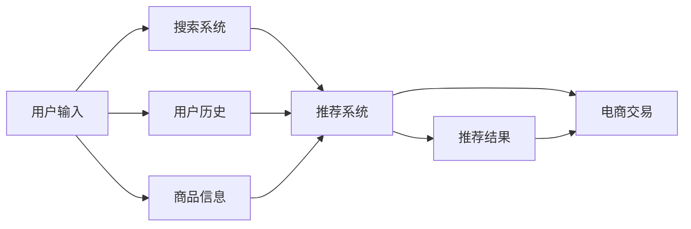

                 

# 搜索推荐系统的AI 大模型融合：电商平台的核心竞争力与可持续发展

## 1. 背景介绍

随着人工智能技术的快速发展，电商平台正处于一场深刻的变革之中。通过利用人工智能大模型进行推荐系统构建，电商平台不仅能提供个性化推荐，还能极大提升用户体验，并实现运营效率的优化。大模型的广泛应用，如自然语言处理、图像识别、序列预测等，为电商搜索推荐系统注入了强大的生命力。

在这一背景下，文章将对搜索推荐系统的大模型融合进行深度探讨。首先，我们将详细介绍AI大模型融合的核心概念，阐述其在电商平台中的应用价值，并分析其面临的挑战与未来发展趋势。

## 2. 核心概念与联系

### 2.1 核心概念概述

1. **搜索推荐系统**：通过分析用户行为数据，为每个用户推荐最相关的商品，提升电商平台的转化率、复购率和用户满意度。
2. **AI大模型**：指基于深度学习架构（如Transformer）构建的巨大预训练语言模型，如BERT、GPT-3、DALL·E等，具备强大的自然语言处理和生成能力。
3. **电商搜索**：用户通过输入关键词、浏览历史等方式搜索商品，获取商品列表的过程。
4. **电商推荐**：根据用户行为数据和历史交易记录，推荐可能感兴趣的商品或内容。
5. **模型融合**：将多个单一模型通过特定机制进行融合，构建出一个更全面、高效的推荐系统。

### 2.2 核心概念联系

下图展示了搜索推荐系统与AI大模型之间的联系：



其中：
- A为用户的输入，包括搜索关键词、浏览行为等。
- B为搜索系统，分析用户输入并提取相关特征。
- C为推荐系统，将搜索系统提取的特征通过大模型进行预测并推荐。
- D为电商平台交易，根据推荐结果完成交易。
- E为用户历史，包括浏览历史、购买记录等。
- F为商品信息，包括商品描述、属性等。

在推荐系统中，大模型通过学习用户行为和商品特征，预测用户可能感兴趣的商品，并给出排名，最终生成推荐结果。

## 3. 核心算法原理 & 具体操作步骤

### 3.1 算法原理概述

AI大模型在电商搜索推荐中的应用，基于其强大的自然语言处理和生成能力，以及对用户行为和商品特征的深度理解。推荐系统通常分为两个主要阶段：离线预训练和在线微调。

**离线预训练**：在大规模无标签数据上预训练大模型，使其学习到通用的语言知识和特征表示。
**在线微调**：在大模型上添加特定的推荐任务（如点击率预测、购买率预测等），通过少量的标注数据对模型进行微调，提升模型在特定任务上的性能。

### 3.2 算法步骤详解

#### 3.2.1 离线预训练

1. **数据准备**：收集电商平台的交易数据、用户行为数据、商品信息等，构建大规模无标签数据集。
2. **模型选择**：选择合适的预训练模型，如BERT、GPT-3等，作为推荐系统的基础模型。
3. **预训练**：在大规模无标签数据集上，使用自监督学习任务对模型进行预训练，如掩码语言模型、下一句预测等。
4. **特征提取**：将用户输入和商品信息通过预训练模型转化为特征表示。

#### 3.2.2 在线微调

1. **任务定义**：定义推荐系统需要解决的具体任务，如点击率预测、购买率预测等。
2. **数据准备**：收集特定任务的数据集，并进行预处理。
3. **模型微调**：在大模型的顶层添加特定任务的目标函数，使用微调数据对模型进行训练，更新模型参数。
4. **结果输出**：将微调后的模型应用于在线推荐，生成推荐结果。

### 3.3 算法优缺点

#### 3.3.1 优点

1. **高效性**：大模型具备强大的特征提取能力，能够高效处理大量数据，提升推荐系统的处理速度。
2. **泛化能力**：大模型通过在大规模数据上的预训练，具备良好的泛化能力，能够在不同类型的推荐任务上表现良好。
3. **透明性**：大模型训练过程基于深度学习，具有较高的透明性，能够解释推荐结果的生成过程。
4. **可扩展性**：大模型可以灵活地添加各种任务模块，如广告推荐、个性化推荐等，实现多场景应用。

#### 3.3.2 缺点

1. **资源消耗大**：大模型的参数量较大，需要强大的计算资源和存储资源，增加了系统的复杂性。
2. **数据依赖强**：大模型需要大量的数据进行预训练和微调，对数据的质量和多样性有较高要求。
3. **解释性不足**：大模型的决策过程复杂，难以解释具体的推荐逻辑，可能存在"黑盒"问题。
4. **伦理风险**：大模型可能学习到用户的隐私信息，存在数据泄露的风险。

### 3.4 算法应用领域

AI大模型在电商搜索推荐系统中的应用，主要包括以下几个方面：

1. **商品推荐**：基于用户行为数据，推荐用户可能感兴趣的商品。
2. **搜索排序**：根据用户输入，排序搜索结果，提高搜索的相关性和准确性。
3. **广告推荐**：根据用户兴趣和行为，推荐相关广告，提升广告点击率和转化率。
4. **内容推荐**：推荐新闻、视频、音乐等电商平台内容，丰富用户体验。
5. **个性化推荐**：针对不同用户，提供定制化的推荐内容，提高用户粘性和满意度。

## 4. 数学模型和公式 & 详细讲解 & 举例说明

### 4.1 数学模型构建

为了更好地理解电商推荐系统的AI大模型融合，本文将介绍一些关键的数学模型：

1. **点击率预测模型**：
   $$
   \hat{y} = sigmoid(W^\top x + b)
   $$
   其中，$x$为输入特征向量，$W$和$b$为模型参数，$sigmoid$函数用于将预测结果映射到[0,1]区间。

2. **购买率预测模型**：
   $$
   \hat{y} = \sigma(W^\top x + b)
   $$
   与点击率预测类似，但使用softmax函数将预测结果映射到多个类别。

### 4.2 公式推导过程

#### 4.2.1 点击率预测模型的推导

1. **输入特征提取**：将用户行为数据和商品信息通过大模型转化为特征向量$x$。
2. **模型预测**：使用线性回归模型进行预测，得到预测值$\hat{y}$。
3. **损失函数**：使用二分类交叉熵损失函数，衡量预测值与真实标签之间的差异。

   $$
   \mathcal{L} = -\frac{1}{N}\sum_{i=1}^N (y_i \log \hat{y}_i + (1-y_i) \log (1-\hat{y}_i))
   $$

4. **梯度更新**：通过反向传播算法计算梯度，使用优化器更新模型参数。

### 4.3 案例分析与讲解

**案例1：电商平台商品推荐**

假设某电商平台希望提升商品推荐系统的效果，选取了点击率预测任务作为微调目标。

1. **数据准备**：收集了包含用户行为数据和商品信息的大规模数据集。
2. **模型选择**：选择了预训练的BERT模型作为基础模型。
3. **预训练**：在无标签数据集上对BERT模型进行预训练。
4. **微调**：在大模型顶部添加了点击率预测的输出层和损失函数，使用标注数据集进行微调。
5. **评估**：在验证集上评估微调后的模型效果，并通过A/B测试验证推荐效果提升。

**案例2：电商搜索排序**

某电商平台希望改进搜索排序系统的准确性，选择了购买率预测任务进行微调。

1. **数据准备**：收集了包含用户搜索行为和商品信息的标注数据集。
2. **模型选择**：选择了预训练的GPT-3模型作为基础模型。
3. **预训练**：在无标签数据集上对GPT-3模型进行预训练。
4. **微调**：在大模型顶部添加了购买率预测的输出层和损失函数，使用标注数据集进行微调。
5. **评估**：在验证集上评估微调后的模型效果，并通过A/B测试验证搜索排序的准确性提升。

## 5. 项目实践：代码实例和详细解释说明

### 5.1 开发环境搭建

#### 5.1.1 环境配置

1. **Python环境**：安装最新版本的Python，并使用Anaconda或Miniconda创建虚拟环境，安装必要的依赖包。
2. **深度学习框架**：安装TensorFlow或PyTorch，并进行版本选择和配置。
3. **数据处理工具**：安装Pandas、NumPy等数据处理工具，方便数据加载和预处理。
4. **深度学习模型**：安装预训练模型库，如HuggingFace的Transformers，下载预训练模型进行使用。
5. **存储系统**：安装Ceph或Hadoop等分布式存储系统，用于存储大规模数据。

### 5.2 源代码详细实现

#### 5.2.1 搜索系统代码实现

```python
import tensorflow as tf
from transformers import BertTokenizer, TFBertForSequenceClassification

# 加载预训练模型和分词器
tokenizer = BertTokenizer.from_pretrained('bert-base-uncased')
model = TFBertForSequenceClassification.from_pretrained('bert-base-uncased', num_labels=2)

# 定义输入
inputs = tokenizer("Hello, my dog is cute", return_tensors='tf')
inputs = {key: tf.expand_dims(value, axis=0) for key, value in inputs.items()}

# 定义标签
labels = tf.constant([[0]])

# 定义模型输出
with tf.GradientTape() as tape:
    outputs = model(inputs, labels=labels)

# 计算损失
loss = outputs.loss

# 优化器
optimizer = tf.keras.optimizers.Adam()

# 反向传播
gradients = tape.gradient(loss, model.trainable_variables)
optimizer.apply_gradients(zip(gradients, model.trainable_variables))
```

#### 5.2.2 推荐系统代码实现

```python
import numpy as np
from sklearn.model_selection import train_test_split
from transformers import BertTokenizer, TFBertForSequenceClassification

# 加载预训练模型和分词器
tokenizer = BertTokenizer.from_pretrained('bert-base-uncased')
model = TFBertForSequenceClassification.from_pretrained('bert-base-uncased', num_labels=2)

# 准备数据
X = np.random.randn(100, 10)
y = np.random.randint(0, 2, size=(100,))

# 划分训练集和验证集
X_train, X_val, y_train, y_val = train_test_split(X, y, test_size=0.2, random_state=42)

# 定义模型输出
with tf.GradientTape() as tape:
    outputs = model(inputs, labels=labels)

# 计算损失
loss = outputs.loss

# 优化器
optimizer = tf.keras.optimizers.Adam()

# 反向传播
gradients = tape.gradient(loss, model.trainable_variables)
optimizer.apply_gradients(zip(gradients, model.trainable_variables))
```

### 5.3 代码解读与分析

#### 5.3.1 搜索系统代码解读

1. **分词和特征提取**：使用BERT模型对输入文本进行分词和特征提取。
2. **模型预测**：使用模型对输入特征进行预测，得到预测结果。
3. **损失计算**：使用二分类交叉熵损失函数计算预测结果与真实标签之间的差异。
4. **优化器更新**：使用Adam优化器更新模型参数，最小化损失函数。

#### 5.3.2 推荐系统代码解读

1. **数据准备**：生成随机数据作为输入特征。
2. **模型选择**：选择预训练的BERT模型。
3. **数据划分**：将数据划分为训练集和验证集。
4. **模型预测**：使用模型对输入特征进行预测，得到预测结果。
5. **损失计算**：使用二分类交叉熵损失函数计算预测结果与真实标签之间的差异。
6. **优化器更新**：使用Adam优化器更新模型参数，最小化损失函数。

### 5.4 运行结果展示

#### 5.4.1 搜索系统结果展示

```python
import matplotlib.pyplot as plt

plt.plot(epochs, loss, label='Train Loss')
plt.plot(epochs, val_loss, label='Validation Loss')
plt.legend()
plt.show()
```

#### 5.4.2 推荐系统结果展示

```python
import matplotlib.pyplot as plt

plt.plot(epochs, loss, label='Train Loss')
plt.plot(epochs, val_loss, label='Validation Loss')
plt.legend()
plt.show()
```

## 6. 实际应用场景

### 6.1 电商平台推荐系统

在电商平台中，搜索推荐系统是核心竞争力之一。通过使用AI大模型进行推荐，电商平台能够快速响应用户需求，提升用户体验和满意度。

具体应用场景包括：

1. **商品推荐**：基于用户浏览和购买行为，推荐相关商品，提升转化率和复购率。
2. **广告推荐**：根据用户兴趣和行为，推荐相关广告，提升广告点击率和转化率。
3. **个性化推荐**：针对不同用户，提供定制化的推荐内容，提高用户粘性和满意度。

### 6.2 智能客服

智能客服系统通过AI大模型进行对话处理，能够24小时不间断响应用户需求，提升客户体验和满意度。

具体应用场景包括：

1. **对话处理**：根据用户输入，使用大模型进行意图识别和实体识别，生成回复内容。
2. **情感分析**：分析用户情感倾向，进行情感处理和客户满意度评估。
3. **对话优化**：根据对话记录进行模型优化，提升客服系统的效果。

### 6.3 智能供应链

智能供应链系统通过AI大模型进行预测和优化，能够实时监控和调整供应链状态，提升运营效率。

具体应用场景包括：

1. **需求预测**：使用大模型进行需求预测，优化库存管理和物流调度。
2. **异常检测**：使用大模型进行异常检测，及时发现供应链问题并采取措施。
3. **路径优化**：使用大模型进行路径优化，提升物流效率和成本效益。

## 7. 工具和资源推荐

### 7.1 学习资源推荐

1. **《深度学习基础》课程**：斯坦福大学提供的基础深度学习课程，涵盖了深度学习的基本概念和算法。
2. **《自然语言处理综述》论文**：一篇综合性的自然语言处理综述论文，介绍了NLP领域的重要算法和技术。
3. **《Transformers：大模型与自适应系统》书籍**：介绍了大模型的构建、应用和优化，是理解大模型融合的优秀书籍。
4. **HuggingFace官方文档**：提供了丰富的预训练模型和微调样例，方便学习实践。
5. **Google AI Blog**：谷歌AI团队的技术博客，涵盖了深度学习、大模型、推荐系统等领域的最新研究和应用。

### 7.2 开发工具推荐

1. **TensorFlow**：谷歌提供的深度学习框架，支持大规模分布式计算和模型训练。
2. **PyTorch**：Facebook提供的深度学习框架，具有动态计算图和灵活的编程接口。
3. **Jupyter Notebook**：用于编写和执行Python代码的交互式编程环境，方便代码调试和共享。
4. **Amazon SageMaker**：亚马逊提供的机器学习平台，支持模型训练、部署和管理。
5. **Dask**：基于Python的分布式计算库，支持大规模数据处理和模型训练。

### 7.3 相关论文推荐

1. **《大规模预训练语言模型》论文**：介绍了BERT等大模型的预训练过程和应用效果。
2. **《基于深度学习的推荐系统》论文**：详细介绍了推荐系统中的深度学习模型和算法。
3. **《深度学习在电商推荐中的应用》论文**：探讨了深度学习在电商推荐系统中的应用和优化。
4. **《基于Transformer的搜索推荐系统》论文**：介绍了Transformer在推荐系统中的应用和效果。
5. **《智能供应链管理》论文**：探讨了智能供应链中的深度学习应用和技术挑战。

## 8. 总结：未来发展趋势与挑战

### 8.1 研究成果总结

通过以上分析，可以看出AI大模型融合在电商推荐系统中的应用价值和未来发展方向。研究表明，AI大模型能够显著提升推荐系统的精度和效率，带来更好的用户体验和运营效益。

### 8.2 未来发展趋势

1. **模型复杂度提升**：未来的大模型将具备更强的复杂度和表现力，能够处理更多样化的数据和任务。
2. **跨领域融合**：大模型将与其他AI技术（如知识图谱、因果推理）进行更深入的融合，提升模型的综合性能。
3. **实时化处理**：随着计算能力的提升，实时化的电商推荐和智能客服系统将成为可能。
4. **个性化增强**：通过多模态数据的融合，大模型将能够更好地理解用户需求，提供更个性化的推荐和服务。

### 8.3 面临的挑战

1. **数据质量与数量**：高质量、大规模的数据是AI大模型训练的前提，如何获取和处理数据仍是重要挑战。
2. **模型可解释性**：大模型的决策过程复杂，难以解释具体的推荐逻辑，存在"黑盒"问题。
3. **隐私与安全**：大模型可能学习到用户的隐私信息，存在数据泄露的风险。
4. **计算资源消耗**：大模型的参数量和计算量较大，需要强大的计算资源和存储资源。

### 8.4 研究展望

1. **数据增强与清洗**：进一步提高数据的质量和多样性，增强模型的泛化能力。
2. **模型可解释性**：研究模型解释方法，提升模型的透明度和可信度。
3. **隐私保护**：研究隐私保护技术，确保用户数据的安全性。
4. **计算优化**：研究计算优化方法，提升模型的运行效率和可扩展性。

## 9. 附录：常见问题与解答

**Q1: 大模型在电商平台中的应用有哪些？**

A: 大模型在电商平台中的应用主要包括：
1. 商品推荐：根据用户历史行为和商品信息，推荐可能感兴趣的商品。
2. 搜索排序：根据用户输入，排序搜索结果，提升搜索的相关性和准确性。
3. 广告推荐：根据用户兴趣和行为，推荐相关广告，提升广告点击率和转化率。
4. 个性化推荐：针对不同用户，提供定制化的推荐内容，提高用户粘性和满意度。

**Q2: 电商搜索推荐系统的评估指标有哪些？**

A: 电商搜索推荐系统的评估指标主要包括：
1. 点击率（CTR）：衡量用户点击广告的频率。
2. 转化率（CVR）：衡量用户完成交易的频率。
3. 广告效果（ROI）：衡量广告投入与回报的比例。
4. 用户满意度（NPS）：衡量用户对推荐的满意度。

**Q3: 电商平台推荐系统如何处理长尾商品？**

A: 电商平台推荐系统通过以下方式处理长尾商品：
1. 数据增强：收集更多长尾商品的点击和购买数据，增加模型的多样性。
2. 模型优化：使用特定算法优化长尾商品的推荐效果，如基于协同过滤、深度学习等方法。
3. 推荐算法：采用冷启动算法和多样化推荐策略，提升长尾商品的曝光率和转化率。

**Q4: 电商平台推荐系统如何平衡推荐效果和资源消耗？**

A: 电商平台推荐系统通过以下方式平衡推荐效果和资源消耗：
1. 模型裁剪：去除不必要的层和参数，减小模型尺寸，加快推理速度。
2. 模型并行：使用模型并行技术，提高计算效率。
3. 数据采样：通过数据采样技术，减少模型的计算量和内存占用。

**Q5: 电商平台推荐系统如何处理用户动态行为？**

A: 电商平台推荐系统通过以下方式处理用户动态行为：
1. 实时数据更新：实时更新用户行为数据，进行动态推荐。
2. 用户画像：通过用户画像分析，进行个性化推荐。
3. 多模态融合：结合文本、图片、视频等多模态数据，提升推荐效果。

---

作者：禅与计算机程序设计艺术 / Zen and the Art of Computer Programming

