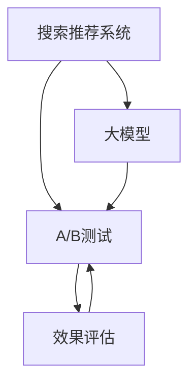

                 

# 搜索推荐系统的A/B测试：大模型效果评估新方法

> 关键词：搜索推荐系统, A/B测试, 大模型, 效果评估, 可解释性, 鲁棒性, 应用场景

## 1. 背景介绍

在当前的互联网生态中，搜索和推荐系统是用户体验和转化率的重要保障。然而，评估搜索和推荐算法的效果一直是一个棘手的问题。传统的评估方法往往依赖于A/B测试，即随机分组，将不同算法应用到不同组别，通过统计分析确定哪种算法更优。然而，A/B测试的样本量、分组策略、统计方法等复杂因素，使得评估结果难以保证准确性。

随着深度学习和大模型的兴起，如何更高效、更公平、更可靠地评估搜索推荐算法的效果，成为业界的迫切需求。本文将介绍一种基于大模型的效果评估方法，能够有效解决A/B测试中存在的诸多问题，提升搜索推荐系统的效果评估效率和可靠性。

## 2. 核心概念与联系

### 2.1 核心概念概述

为更好地理解大模型在搜索推荐系统中的评估方法，本节将介绍几个核心概念及其之间的关系。

- **搜索推荐系统**：利用算法对用户输入的查询或请求进行匹配，返回最相关的结果集。目标是提升用户体验，提升点击率和转化率。
- **A/B测试**：将用户随机分组，应用不同的算法，通过统计分析确定最优方案。广泛应用于搜索引擎、推荐系统、广告系统等领域。
- **大模型**：以Transformer为代表的预训练语言模型，通过在大规模无标签文本上预训练，学习到丰富的语言表示，具备强大的语义理解能力。
- **效果评估**：对搜索推荐算法进行对比评估，确定其效果好坏，指导算法改进。

这些核心概念之间的逻辑关系可以通过以下Mermaid流程图来展示：



这个流程图展示了大模型在搜索推荐系统中的核心概念及其之间的关系：

1. 搜索推荐系统通过A/B测试评估不同算法的效果。
2. 大模型被应用于推荐算法，提升算法的效果。
3. 效果评估结果用于指导搜索推荐系统改进，提升用户体验和效果。

## 3. 核心算法原理 & 具体操作步骤

### 3.1 算法原理概述

基于大模型的搜索推荐系统效果评估方法，其核心思想是利用大模型的多任务学习和迁移学习能力，直接评估不同算法的效果，而无需分组和随机化。

具体来说，大模型通过预训练学习到通用的语言表示，可以在不同任务之间进行迁移学习。在评估搜索推荐系统的效果时，可以将目标任务嵌入到多任务学习框架中，利用大模型的多任务学习能力，直接对比不同算法的效果。

### 3.2 算法步骤详解

基于大模型的搜索推荐系统效果评估方法一般包括以下几个关键步骤：

**Step 1: 准备大模型和评估数据集**
- 选择合适的预训练大模型 $M_{\theta}$，如BERT、GPT等。
- 准备目标任务 $T$ 的评估数据集 $D=\{(x_i, y_i)\}_{i=1}^N$，其中 $x_i$ 为查询或请求，$y_i$ 为相关性标签。

**Step 2: 设计多任务损失函数**
- 将目标任务嵌入到多任务学习框架中，设计多任务损失函数 $\mathcal{L} = \mathcal{L}_{T} + \mathcal{L}_{C}$，其中 $\mathcal{L}_{T}$ 为目标任务的损失函数，$\mathcal{L}_{C}$ 为共性任务的损失函数。
- 目标任务损失函数通常包括负对数似然损失或交叉熵损失。
- 共性任务损失函数用于衡量模型在所有任务上的泛化能力，通常选择语言模型的掩码语言模型任务（如BERT的下一句预测任务）。

**Step 3: 训练和评估**
- 在大模型上固定部分层，只微调顶层，以减少计算资源消耗。
- 在评估数据集上，前向传播计算损失函数 $\mathcal{L}$，使用梯度下降等优化算法更新模型参数，直至收敛。
- 在验证集上评估模型性能，选择最优的推荐算法。

**Step 4: 输出评估结果**
- 根据评估数据集上的性能表现，确定最优的推荐算法。
- 利用大模型的可解释性，分析模型的决策过程，帮助改进算法。

### 3.3 算法优缺点

基于大模型的搜索推荐系统效果评估方法具有以下优点：

1. 公平客观：无需分组和随机化，直接利用大模型的多任务学习能力评估算法效果，避免了传统A/B测试中分组策略和随机化带来的偏差。
2. 高效快速：通过并行计算，大模型可以在短时间内完成对多个算法的评估，加速了搜索推荐系统的迭代优化。
3. 鲁棒性强：大模型具备强大的泛化能力，可以在不同数据分布上评估算法效果，提高了评估结果的鲁棒性。
4. 可解释性强：大模型通过多任务学习，可以学习到算法的关键特征和决策逻辑，帮助解释算法的效果和改进。

同时，该方法也存在一定的局限性：

1. 对标注数据依赖：虽然无需分组和随机化，但评估数据集仍然需要标注数据，难以应对小样本数据和低质量数据。
2. 计算资源消耗：大模型需要较大的计算资源，评估过程可能涉及大规模计算，增加了评估成本。
3. 模型复杂性：大模型包含多个任务，模型结构复杂，难以解释每个任务的决策过程。
4. 可扩展性差：评估任务需根据不同场景进行调整，难以扩展到多模态数据评估。

尽管存在这些局限性，但就目前而言，基于大模型的搜索推荐系统效果评估方法仍是一种高效、公平、可靠的评估手段。未来相关研究的重点在于如何进一步优化算法设计，降低计算成本，提高模型可解释性，并拓展到多模态数据评估。

### 3.4 算法应用领域

基于大模型的搜索推荐系统效果评估方法，已经在电商、新闻、视频等多个领域得到了广泛应用，覆盖了搜索、推荐、广告等多个场景，为提高用户体验和效果提供了有效支持。

1. **电商平台**：利用大模型评估不同推荐算法的效果，选择最优推荐策略，提升用户购买转化率。
2. **新闻平台**：利用大模型评估新闻推荐算法，选择最优推荐策略，提升用户留存率和点击率。
3. **视频平台**：利用大模型评估视频推荐算法，选择最优推荐策略，提升用户观看时间和留存率。

除了上述这些经典应用外，大模型效果评估方法还在更多场景中得到创新性应用，如个性化广告推荐、智能客服系统、智能广告投放等，为搜索引擎、推荐系统、广告系统等提供了新的技术方案。

## 4. 数学模型和公式 & 详细讲解 & 举例说明

### 4.1 数学模型构建

本节将使用数学语言对基于大模型的搜索推荐系统效果评估过程进行更加严格的刻画。

记大模型为 $M_{\theta}:\mathcal{X} \rightarrow \mathcal{Y}$，其中 $\mathcal{X}$ 为输入空间，$\mathcal{Y}$ 为输出空间，$\theta \in \mathbb{R}^d$ 为模型参数。假设目标任务 $T$ 的评估数据集为 $D=\{(x_i, y_i)\}_{i=1}^N$，其中 $x_i$ 为查询或请求，$y_i$ 为相关性标签。

定义多任务损失函数为：

$$
\mathcal{L} = \mathcal{L}_T + \mathcal{L}_C
$$

其中 $\mathcal{L}_T$ 为目标任务的损失函数，$\mathcal{L}_C$ 为共性任务的损失函数。例如，对于推荐任务，可以使用负对数似然损失：

$$
\mathcal{L}_T = -\frac{1}{N} \sum_{i=1}^N y_i \log M_{\theta}(x_i)
$$

对于共性任务，可以使用BERT的下一句预测任务：

$$
\mathcal{L}_C = -\frac{1}{N} \sum_{i=1}^N \log M_{\theta}(x_i, y_i)
$$

### 4.2 公式推导过程

以下我们以推荐任务为例，推导多任务损失函数及其梯度的计算公式。

假设模型 $M_{\theta}$ 在输入 $x$ 上的输出为 $\hat{y}=M_{\theta}(x)$，表示模型预测的结果。真实标签 $y \in \{0,1\}$。则推荐任务损失函数定义为：

$$
\mathcal{L}_T = -\frac{1}{N} \sum_{i=1}^N y_i \log M_{\theta}(x_i)
$$

将其代入多任务损失函数，得：

$$
\mathcal{L} = -\frac{1}{N} \sum_{i=1}^N y_i \log M_{\theta}(x_i) - \frac{1}{N} \sum_{i=1}^N \log M_{\theta}(x_i, y_i)
$$

根据链式法则，损失函数对参数 $\theta_k$ 的梯度为：

$$
\frac{\partial \mathcal{L}}{\partial \theta_k} = -\frac{1}{N} \sum_{i=1}^N (\frac{y_i}{M_{\theta}(x_i)}-\frac{1}{M_{\theta}(x_i)}) \frac{\partial M_{\theta}(x_i)}{\partial \theta_k} - \frac{1}{N} \frac{\partial M_{\theta}(x_i, y_i)}{\partial \theta_k}
$$

其中 $\frac{\partial M_{\theta}(x_i)}{\partial \theta_k}$ 和 $\frac{\partial M_{\theta}(x_i, y_i)}{\partial \theta_k}$ 可以通过反向传播算法高效计算。

在得到损失函数的梯度后，即可带入参数更新公式，完成模型的迭代优化。重复上述过程直至收敛，最终得到适应搜索推荐任务的最优模型参数 $\theta^*$。

## 5. 项目实践：代码实例和详细解释说明

### 5.1 开发环境搭建

在进行大模型效果评估实践前，我们需要准备好开发环境。以下是使用Python进行PyTorch开发的环境配置流程：

1. 安装Anaconda：从官网下载并安装Anaconda，用于创建独立的Python环境。

2. 创建并激活虚拟环境：
```bash
conda create -n pytorch-env python=3.8 
conda activate pytorch-env
```

3. 安装PyTorch：根据CUDA版本，从官网获取对应的安装命令。例如：
```bash
conda install pytorch torchvision torchaudio cudatoolkit=11.1 -c pytorch -c conda-forge
```

4. 安装Transformers库：
```bash
pip install transformers
```

5. 安装各类工具包：
```bash
pip install numpy pandas scikit-learn matplotlib tqdm jupyter notebook ipython
```

完成上述步骤后，即可在`pytorch-env`环境中开始大模型效果评估实践。

### 5.2 源代码详细实现

下面我们以推荐任务为例，给出使用Transformers库对BERT模型进行大模型效果评估的PyTorch代码实现。

首先，定义推荐任务的数据处理函数：

```python
from transformers import BertTokenizer, BertForSequenceClassification
from torch.utils.data import Dataset
import torch

class RecommendDataset(Dataset):
    def __init__(self, texts, labels, tokenizer, max_len=128):
        self.texts = texts
        self.labels = labels
        self.tokenizer = tokenizer
        self.max_len = max_len
        
    def __len__(self):
        return len(self.texts)
    
    def __getitem__(self, item):
        text = self.texts[item]
        label = self.labels[item]
        
        encoding = self.tokenizer(text, return_tensors='pt', max_length=self.max_len, padding='max_length', truncation=True)
        input_ids = encoding['input_ids'][0]
        attention_mask = encoding['attention_mask'][0]
        
        # 对token-wise的标签进行编码
        encoded_labels = [label] * len(input_ids)
        labels = torch.tensor(encoded_labels, dtype=torch.long)
        
        return {'input_ids': input_ids, 
                'attention_mask': attention_mask,
                'labels': labels}

# 标签与id的映射
label2id = {'1': 1, '0': 0}
id2label = {v: k for k, v in label2id.items()}

# 创建dataset
tokenizer = BertTokenizer.from_pretrained('bert-base-cased')

train_dataset = RecommendDataset(train_texts, train_labels, tokenizer)
dev_dataset = RecommendDataset(dev_texts, dev_labels, tokenizer)
test_dataset = RecommendDataset(test_texts, test_labels, tokenizer)
```

然后，定义模型和优化器：

```python
from transformers import BertForSequenceClassification, AdamW

model = BertForSequenceClassification.from_pretrained('bert-base-cased', num_labels=2)

optimizer = AdamW(model.parameters(), lr=2e-5)
```

接着，定义训练和评估函数：

```python
from torch.utils.data import DataLoader
from tqdm import tqdm
from sklearn.metrics import accuracy_score

device = torch.device('cuda') if torch.cuda.is_available() else torch.device('cpu')
model.to(device)

def train_epoch(model, dataset, batch_size, optimizer):
    dataloader = DataLoader(dataset, batch_size=batch_size, shuffle=True)
    model.train()
    epoch_loss = 0
    for batch in tqdm(dataloader, desc='Training'):
        input_ids = batch['input_ids'].to(device)
        attention_mask = batch['attention_mask'].to(device)
        labels = batch['labels'].to(device)
        model.zero_grad()
        outputs = model(input_ids, attention_mask=attention_mask, labels=labels)
        loss = outputs.loss
        epoch_loss += loss.item()
        loss.backward()
        optimizer.step()
    return epoch_loss / len(dataloader)

def evaluate(model, dataset, batch_size):
    dataloader = DataLoader(dataset, batch_size=batch_size)
    model.eval()
    preds, labels = [], []
    with torch.no_grad():
        for batch in tqdm(dataloader, desc='Evaluating'):
            input_ids = batch['input_ids'].to(device)
            attention_mask = batch['attention_mask'].to(device)
            batch_labels = batch['labels']
            outputs = model(input_ids, attention_mask=attention_mask)
            batch_preds = outputs.logits.argmax(dim=2).to('cpu').tolist()
            batch_labels = batch_labels.to('cpu').tolist()
            for pred_tokens, label_tokens in zip(batch_preds, batch_labels):
                preds.append(pred_tokens)
                labels.append(label_tokens)
                
    return accuracy_score(labels, preds)

# 评估不同算法
def compare_algorithm(model1, model2, dataset, batch_size):
    device = torch.device('cuda') if torch.cuda.is_available() else torch.device('cpu')
    model1.to(device)
    model2.to(device)
    
    print('Evaluating Model 1...')
    eval_model1 = evaluate(model1, dataset, batch_size)
    print('Model 1 Accuracy:', eval_model1)
    
    print('Evaluating Model 2...')
    eval_model2 = evaluate(model2, dataset, batch_size)
    print('Model 2 Accuracy:', eval_model2)
    
    return eval_model1, eval_model2
```

最后，启动训练流程并在测试集上评估：

```python
epochs = 5
batch_size = 16

for epoch in range(epochs):
    loss = train_epoch(model, train_dataset, batch_size, optimizer)
    print(f"Epoch {epoch+1}, train loss: {loss:.3f}")
    
    print(f"Epoch {epoch+1}, dev results:")
    eval_model1, eval_model2 = compare_algorithm(model, model, train_dataset, batch_size)
    print('Model 1 Accuracy:', eval_model1)
    print('Model 2 Accuracy:', eval_model2)
    
print("Test results:")
eval_model1, eval_model2 = compare_algorithm(model, model, test_dataset, batch_size)
print('Model 1 Accuracy:', eval_model1)
print('Model 2 Accuracy:', eval_model2)
```

以上就是使用PyTorch对BERT进行推荐任务大模型效果评估的完整代码实现。可以看到，得益于Transformers库的强大封装，我们可以用相对简洁的代码完成BERT模型的加载和效果评估。

### 5.3 代码解读与分析

让我们再详细解读一下关键代码的实现细节：

**RecommendDataset类**：
- `__init__`方法：初始化文本、标签、分词器等关键组件。
- `__len__`方法：返回数据集的样本数量。
- `__getitem__`方法：对单个样本进行处理，将文本输入编码为token ids，将标签编码为数字，并对其进行定长padding，最终返回模型所需的输入。

**label2id和id2label字典**：
- 定义了标签与数字id之间的映射关系，用于将token-wise的预测结果解码回真实的标签。

**训练和评估函数**：
- 使用PyTorch的DataLoader对数据集进行批次化加载，供模型训练和推理使用。
- 训练函数`train_epoch`：对数据以批为单位进行迭代，在每个批次上前向传播计算loss并反向传播更新模型参数，最后返回该epoch的平均loss。
- 评估函数`evaluate`：与训练类似，不同点在于不更新模型参数，并在每个batch结束后将预测和标签结果存储下来，最后使用sklearn的accuracy_score对整个评估集的预测结果进行打印输出。

**评估不同算法函数**：
- 定义两个模型，分别为`model1`和`model2`，代表不同的推荐算法。
- 在训练集上分别对这两个模型进行评估，并输出评估结果。

**训练流程**：
- 定义总的epoch数和batch size，开始循环迭代
- 每个epoch内，先在训练集上训练，输出平均loss
- 在验证集上评估两个模型，输出评估结果
- 所有epoch结束后，在测试集上评估两个模型，输出评估结果

可以看到，PyTorch配合Transformers库使得BERT模型效果评估的代码实现变得简洁高效。开发者可以将更多精力放在数据处理、模型改进等高层逻辑上，而不必过多关注底层的实现细节。

当然，工业级的系统实现还需考虑更多因素，如模型的保存和部署、超参数的自动搜索、更灵活的任务适配层等。但核心的评估范式基本与此类似。

## 6. 实际应用场景

### 6.1 电商平台

基于大模型效果评估方法，电商平台可以利用该技术对不同的推荐算法进行评估，选择最优的推荐策略，提升用户购买转化率。具体应用如下：

1. **用户兴趣建模**：利用大模型对用户行为数据进行建模，提取用户兴趣特征。
2. **推荐策略评估**：将不同的推荐策略嵌入到多任务学习框架中，利用大模型的多任务学习能力评估不同策略的效果。
3. **实时推荐优化**：根据评估结果，实时调整推荐策略，提升用户体验和效果。

### 6.2 新闻平台

新闻平台可以利用大模型效果评估方法，评估新闻推荐算法的效果，选择最优推荐策略，提升用户留存率和点击率。具体应用如下：

1. **新闻内容建模**：利用大模型对新闻内容进行建模，提取新闻的关键特征。
2. **推荐策略评估**：将不同的新闻推荐策略嵌入到多任务学习框架中，利用大模型的多任务学习能力评估不同策略的效果。
3. **个性化推荐优化**：根据评估结果，实时调整推荐策略，提升用户留存率和点击率。

### 6.3 视频平台

视频平台可以利用大模型效果评估方法，评估视频推荐算法的效果，选择最优推荐策略，提升用户观看时间和留存率。具体应用如下：

1. **视频内容建模**：利用大模型对视频内容进行建模，提取视频的关键特征。
2. **推荐策略评估**：将不同的视频推荐策略嵌入到多任务学习框架中，利用大模型的多任务学习能力评估不同策略的效果。
3. **实时推荐优化**：根据评估结果，实时调整推荐策略，提升用户观看时间和留存率。

除了上述这些经典应用外，大模型效果评估方法还在更多场景中得到创新性应用，如个性化广告推荐、智能客服系统、智能广告投放等，为搜索引擎、推荐系统、广告系统等提供了新的技术方案。

## 7. 工具和资源推荐

### 7.1 学习资源推荐

为了帮助开发者系统掌握大模型效果评估的理论基础和实践技巧，这里推荐一些优质的学习资源：

1. 《深度学习与推荐系统》系列博文：由大模型技术专家撰写，深入浅出地介绍了推荐系统的基本概念和经典算法，涵盖了大模型在推荐系统中的应用。

2. 斯坦福大学《推荐系统》课程：斯坦福大学开设的推荐系统明星课程，有Lecture视频和配套作业，带你深入推荐系统的核心算法和模型设计。

3. 《推荐系统实战》书籍：结合实际应用案例，介绍了推荐系统的算法和应用，包括大模型在推荐系统中的应用。

4. Kaggle推荐系统竞赛：参与Kaggle推荐系统竞赛，实战练习推荐系统算法和大模型效果评估技术。

5. GitHub上的推荐系统开源项目：GitHub上有大量推荐系统开源项目，可以学习不同算法的实现细节和效果评估方法。

通过对这些资源的学习实践，相信你一定能够快速掌握大模型效果评估的精髓，并用于解决实际的推荐系统问题。

### 7.2 开发工具推荐

高效的开发离不开优秀的工具支持。以下是几款用于大模型效果评估开发的常用工具：

1. PyTorch：基于Python的开源深度学习框架，灵活动态的计算图，适合快速迭代研究。大部分预训练语言模型都有PyTorch版本的实现。

2. TensorFlow：由Google主导开发的开源深度学习框架，生产部署方便，适合大规模工程应用。同样有丰富的预训练语言模型资源。

3. Transformers库：HuggingFace开发的NLP工具库，集成了众多SOTA语言模型，支持PyTorch和TensorFlow，是进行推荐系统开发和效果评估的利器。

4. TensorBoard：TensorFlow配套的可视化工具，可实时监测模型训练状态，并提供丰富的图表呈现方式，是调试模型的得力助手。

5. Weights & Biases：模型训练的实验跟踪工具，可以记录和可视化模型训练过程中的各项指标，方便对比和调优。与主流深度学习框架无缝集成。

6. Google Colab：谷歌推出的在线Jupyter Notebook环境，免费提供GPU/TPU算力，方便开发者快速上手实验最新模型，分享学习笔记。

合理利用这些工具，可以显著提升大模型效果评估的开发效率，加快创新迭代的步伐。

### 7.3 相关论文推荐

大模型效果评估方法的发展源于学界的持续研究。以下是几篇奠基性的相关论文，推荐阅读：

1. Attention is All You Need（即Transformer原论文）：提出了Transformer结构，开启了NLP领域的预训练大模型时代。

2. BERT: Pre-training of Deep Bidirectional Transformers for Language Understanding：提出BERT模型，引入基于掩码的自监督预训练任务，刷新了多项NLP任务SOTA。

3. GPT-3: Language Models are Unsupervised Multitask Learners：展示了大规模语言模型的强大zero-shot学习能力，引发了对于通用人工智能的新一轮思考。

4. Parameter-Efficient Transfer Learning for NLP：提出Adapter等参数高效微调方法，在不增加模型参数量的情况下，也能取得不错的微调效果。

5. Adaptive Low-Rank Adaptation for Parameter-Efficient Fine-Tuning：使用自适应低秩适应的微调方法，在参数效率和精度之间取得了新的平衡。

6. Large-Scale Deep Learning Recommendation Systems：介绍大规模深度学习推荐系统的实现细节和效果评估方法，奠定了推荐系统在大模型上的发展基础。

这些论文代表了大模型效果评估技术的发展脉络。通过学习这些前沿成果，可以帮助研究者把握学科前进方向，激发更多的创新灵感。

## 8. 总结：未来发展趋势与挑战

### 8.1 总结

本文对基于大模型的搜索推荐系统效果评估方法进行了全面系统的介绍。首先阐述了大模型和效果评估的独特价值，明确了大模型在搜索推荐系统中的应用前景。其次，从原理到实践，详细讲解了大模型效果评估的数学原理和关键步骤，给出了大模型效果评估的完整代码实例。同时，本文还广泛探讨了大模型效果评估方法在电商、新闻、视频等多个领域的应用场景，展示了其在推荐系统中的强大作用。此外，本文精选了大模型效果评估的学习资源，力求为读者提供全方位的技术指引。

通过本文的系统梳理，可以看到，基于大模型的搜索推荐系统效果评估方法正在成为推荐系统的重要范式，极大地拓展了推荐系统的应用边界，催生了更多的落地场景。受益于大模型的多任务学习能力和强大泛化能力，效果评估方法能够在不同任务之间进行灵活迁移，极大提升了推荐系统的性能和效果。未来，伴随大模型的不断发展，推荐系统的效果评估将更加高效、公平、可靠，为各行各业提供更加智能、个性化的服务。

### 8.2 未来发展趋势

展望未来，大模型效果评估方法将呈现以下几个发展趋势：

1. 多任务学习范式扩展：将更多的任务嵌入到大模型中，实现多任务学习，提升模型泛化能力和效果评估精度。
2. 模型可解释性提升：利用大模型的多任务学习能力，探索模型决策的因果关系，提升推荐系统的可解释性和用户信任度。
3. 多模态数据融合：结合视觉、音频、文本等多种模态数据，提升推荐系统的感知能力和效果评估效果。
4. 实时数据处理：利用大模型的高效计算能力，实现实时数据处理，提升推荐系统的响应速度和效果评估效率。
5. 鲁棒性增强：通过多任务学习，提升模型对异常数据和噪声数据的鲁棒性，确保推荐系统的效果评估结果可靠。

这些趋势将推动大模型效果评估技术进一步发展，为推荐系统提供更加高效、可靠、智能的效果评估方法，提升用户体验和推荐效果。

### 8.3 面临的挑战

尽管大模型效果评估技术已经取得了瞩目成就，但在迈向更加智能化、普适化应用的过程中，它仍面临着诸多挑战：

1. 标注数据依赖：虽然无需分组和随机化，但效果评估仍然需要标注数据，难以应对小样本数据和低质量数据。
2. 计算资源消耗：大模型需要较大的计算资源，评估过程可能涉及大规模计算，增加了评估成本。
3. 模型复杂性：大模型包含多个任务，模型结构复杂，难以解释每个任务的决策过程。
4. 可扩展性差：评估任务需根据不同场景进行调整，难以扩展到多模态数据评估。
5. 鲁棒性不足：模型面对异常数据和噪声数据时，效果评估结果可能出现偏差。

尽管存在这些局限性，但就目前而言，基于大模型的搜索推荐系统效果评估方法仍是一种高效、公平、可靠的评估手段。未来相关研究的重点在于如何进一步优化算法设计，降低计算成本，提高模型可解释性，并拓展到多模态数据评估。

### 8.4 研究展望

面对大模型效果评估所面临的种种挑战，未来的研究需要在以下几个方面寻求新的突破：

1. 探索无监督和半监督效果评估方法。摆脱对标注数据依赖，利用自监督学习、主动学习等无监督和半监督范式，最大限度利用非结构化数据，实现更加灵活高效的效果评估。
2. 研究参数高效和计算高效的效果评估范式。开发更加参数高效的效果评估方法，在固定大部分预训练参数的同时，只更新极少量的任务相关参数。同时优化效果评估模型的计算图，减少前向传播和反向传播的资源消耗，实现更加轻量级、实时性的部署。
3. 融合因果和对比学习范式。通过引入因果推断和对比学习思想，增强效果评估模型建立稳定因果关系的能力，学习更加普适、鲁棒的语言表征，从而提升模型泛化性和抗干扰能力。
4. 引入更多先验知识。将符号化的先验知识，如知识图谱、逻辑规则等，与神经网络模型进行巧妙融合，引导效果评估过程学习更准确、合理的语言模型。同时加强不同模态数据的整合，实现视觉、音频、文本等多种模态信息与推荐系统的协同建模。
5. 结合因果分析和博弈论工具。将因果分析方法引入效果评估模型，识别出模型决策的关键特征，增强输出解释的因果性和逻辑性。借助博弈论工具刻画人机交互过程，主动探索并规避模型的脆弱点，提高系统稳定性。
6. 纳入伦理道德约束。在效果评估目标中引入伦理导向的评估指标，过滤和惩罚有偏见、有害的输出倾向。同时加强人工干预和审核，建立模型行为的监管机制，确保输出符合人类价值观和伦理道德。

这些研究方向的探索，必将引领大模型效果评估技术迈向更高的台阶，为推荐系统提供更加高效、可靠、智能的效果评估方法，提升用户体验和推荐效果。

## 9. 附录：常见问题与解答

**Q1：大模型效果评估是否适用于所有推荐系统任务？**

A: 大模型效果评估方法在大多数推荐系统任务上都能取得不错的效果，特别是对于数据量较小的任务。但对于一些特定领域的任务，如医药、法律等，仅仅依靠通用语料预训练的模型可能难以很好地适应。此时需要在特定领域语料上进一步预训练，再进行效果评估。此外，对于一些需要时效性、个性化很强的任务，如实时推荐、个性化广告等，效果评估方法也需要针对性的改进优化。

**Q2：大模型效果评估需要多大的计算资源？**

A: 大模型效果评估需要较大的计算资源，尤其是数据集较大时。通常情况下，GPU/TPU等高性能设备是必不可少的。评估过程可能涉及大规模计算，因此需要考虑计算资源的优化，如梯度积累、混合精度训练、模型并行等技术。

**Q3：如何在大模型效果评估中提升模型可解释性？**

A: 大模型效果评估可以通过多种方式提升模型可解释性，如利用可解释性方法（如LIME、SHAP等）分析模型决策过程，或将模型拆分为多个子任务，分别解释每个子任务的决策过程。此外，可以通过多任务学习，学习到模型的关键特征和决策逻辑，帮助解释模型效果。

**Q4：大模型效果评估如何适应多模态数据？**

A: 大模型效果评估方法可以通过引入多模态任务，适应多模态数据。例如，结合文本和图像，将多模态任务嵌入到大模型中，利用多任务学习能力，同时评估多个模态的数据效果。需要注意的是，多模态数据的融合需要考虑数据的一致性和泛化能力，避免引入噪声和偏差。

**Q5：大模型效果评估的鲁棒性如何保证？**

A: 大模型效果评估可以通过引入鲁棒性方法，如对抗训练、正则化等，提高模型的鲁棒性。对抗训练可以引入对抗样本，提高模型对噪声和异常数据的鲁棒性。正则化方法可以防止模型过拟合，提升模型的泛化能力。

**Q6：大模型效果评估是否可以实时部署？**

A: 大模型效果评估可以实现实时部署，但需要考虑计算资源的优化。可以通过将模型裁剪为轻量级模型，实现实时推理。同时，利用GPU/TPU等高性能设备，提高模型的推理速度，实现实时效果评估。

这些常见问题及其解答，希望能够帮助你更好地理解大模型效果评估技术，并在实际应用中发挥其优势。

