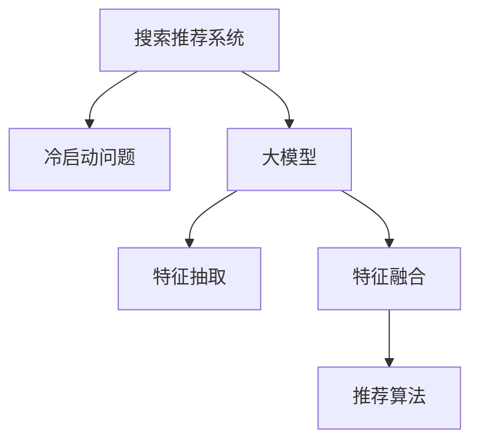

                 

# 搜索推荐系统的冷启动：大模型新思路

> 关键词：搜索推荐系统,冷启动问题,大模型,特征融合,协同过滤,自监督学习,迁移学习

## 1. 背景介绍

### 1.1 问题由来
在信息爆炸的互联网时代，搜索推荐系统作为智能信息检索和个性化推荐的工具，已经深入到人们生活的方方面面。用户在使用搜索推荐系统时，希望系统能够快速响应查询，并给出个性化的推荐结果。然而，在用户首次访问系统时，系统会面临冷启动问题，即由于缺乏历史行为数据，无法准确判断用户的兴趣偏好，无法提供满意的服务。

为解决冷启动问题，搜索推荐系统通常需要依靠用户输入的查询词、位置、设备等基本信息，或者利用关联推荐、社交网络等间接数据进行模型训练。然而，这些方法在一定程度上存在数据稀疏、信息噪音等问题，难以满足用户需求。

近年来，随着深度学习技术和大模型预训练技术的发展，越来越多的研究尝试利用大语言模型来解决冷启动问题。通过预训练语言模型，系统可以提取用户查询和推荐物品的自然语言特征，直接映射用户兴趣和物品属性，实现更加精准的推荐。这些方法被称作大模型推荐方法，已经在一些场景下取得了不错的效果。

### 1.2 问题核心关键点
大模型推荐方法的核心在于如何利用大语言模型提取和融合用户查询与物品的自然语言特征，并应用于推荐系统。主要包括以下几个关键点：

1. 特征抽取：大语言模型可以自动从自然语言文本中抽取出丰富的语义特征，可以包含用户的兴趣偏好、情感态度、实体关系等多种信息。

2. 特征融合：将用户查询和推荐物品的特征进行融合，构建用户与物品之间的相似度表示，为推荐算法提供数据基础。

3. 推荐算法：基于用户与物品的相似度表示，应用推荐算法进行排序，生成个性化推荐列表。

4. 冷启动解决：在用户缺少历史行为数据的情况下，利用大语言模型直接学习用户兴趣和物品属性，实现冷启动推荐。

## 2. 核心概念与联系

### 2.1 核心概念概述

为了更好地理解大模型推荐方法，本节将介绍几个密切相关的核心概念：

- 搜索推荐系统：基于机器学习算法，对用户查询和物品属性进行建模，自动输出与用户兴趣相关的推荐结果的系统。
- 冷启动问题：用户在首次使用推荐系统时，系统无法获取用户历史行为数据，难以准确判断用户兴趣偏好，从而无法提供个性化推荐。
- 大模型：以Transformer结构为代表，在大规模无标签文本语料上进行预训练的语言模型，具备强大的自然语言处理能力。
- 特征抽取：利用预训练语言模型从自然语言文本中自动抽取出高维语义特征的过程。
- 特征融合：将多个特征进行组合，构建更加全面、准确的用户与物品表示。
- 推荐算法：对用户与物品的相似度表示进行排序，输出推荐结果的算法，如协同过滤、基于深度学习的推荐算法等。

这些概念之间具有密切的联系，可以通过以下Mermaid流程图来展示：



这个流程图展示了搜索推荐系统如何利用大模型解决冷启动问题：

1. 大模型从自然语言文本中抽取出用户查询和推荐物品的特征，形成语义表示。
2. 特征融合过程将这些语义表示进行组合，构建用户与物品的相似度表示。
3. 推荐算法基于相似度表示，对物品进行排序，生成个性化推荐列表。

## 3. 核心算法原理 & 具体操作步骤
### 3.1 算法原理概述

大模型推荐方法的本质是一种基于自然语言处理的推荐范式。通过预训练语言模型提取和融合用户查询与推荐物品的语义特征，构建用户与物品之间的相似度表示，从而实现精准的推荐。

形式化地，设用户查询为 $q$，推荐物品为 $i$，预训练语言模型为 $M_{\theta}$，其中 $\theta$ 为预训练得到的模型参数。假设模型在输入 $q$ 和 $i$ 上的输出为 $\hat{z}_q$ 和 $\hat{z}_i$，表示用户兴趣和物品属性。则相似度函数 $s$ 定义为：

$$
s(q,i) = \hat{z}_q \cdot \hat{z}_i
$$

其中 $\cdot$ 为点乘运算，$.$ 表示转置。

基于相似度表示，推荐算法（如余弦相似度排序、基于深度学习的推荐算法等）可以对物品进行排序，生成推荐列表。

### 3.2 算法步骤详解

基于大模型推荐方法的步骤如下：

**Step 1: 准备预训练语言模型和数据集**
- 选择合适的预训练语言模型 $M_{\theta}$ 作为初始化参数，如BERT、GPT等。
- 准备用户查询和推荐物品的数据集 $D=\{(q_i,i_i)\}_{i=1}^N$，划分为训练集、验证集和测试集。

**Step 2: 特征抽取**
- 使用预训练语言模型对用户查询和推荐物品进行编码，生成高维特征向量。
- 对于用户查询 $q$，输入 $q$ 到语言模型，输出语义表示 $\hat{z}_q$。
- 对于推荐物品 $i$，输入物品名称、描述、类别等文本信息，输出语义表示 $\hat{z}_i$。

**Step 3: 特征融合**
- 将用户查询和推荐物品的语义表示进行融合，构建用户与物品的相似度表示 $s_q$。
- 通过加权平均、拼接、注意力机制等方式，将 $\hat{z}_q$ 和 $\hat{z}_i$ 融合，得到相似度向量 $s_q$。
- 对于每个用户查询 $q$，计算其与所有推荐物品 $i$ 的相似度 $s(q,i)$。

**Step 4: 推荐算法**
- 基于相似度向量 $s_q$，应用推荐算法对物品进行排序。
- 常用的推荐算法包括余弦相似度排序、基于深度学习的推荐算法等。
- 最终生成推荐列表，提供给用户选择。

**Step 5: 评估与调整**
- 在测试集上评估推荐列表的精度和召回率，评估模型性能。
- 根据评估结果，调整模型参数和特征融合方式，优化推荐效果。

### 3.3 算法优缺点

大模型推荐方法具有以下优点：

1. 无需历史行为数据。基于预训练语言模型的特征抽取过程，可以充分利用用户查询的自然语言信息，实现冷启动推荐。

2. 提取语义特征。预训练语言模型可以自动学习丰富的语义信息，包含用户的兴趣偏好、情感态度、实体关系等多种信息。

3. 泛化能力强。预训练语言模型在大型无标签数据上预训练，具有较强的泛化能力，适用于多种推荐场景。

4. 模型效果好。通过特征融合和相似度计算，能够生成高质量的推荐结果，提升用户满意度。

然而，大模型推荐方法也存在一些缺点：

1. 计算成本高。预训练语言模型参数量庞大，对计算资源要求高，训练和推理过程耗时较长。

2. 特征维度高。预训练语言模型抽取的特征维度高，对内存空间要求大，容易导致内存溢出等问题。

3. 解释性不足。基于预训练语言模型的推荐方法，模型内部逻辑复杂，难以解释推荐结果的来源。

4. 泛化能力有限。当用户查询和推荐物品与预训练数据分布差异较大时，模型的性能可能受到限制。

尽管存在这些缺点，但大模型推荐方法仍然是一种有潜力解决冷启动问题的推荐方案，值得进一步探索和优化。

### 3.4 算法应用领域

大模型推荐方法已经在多个推荐场景中得到了应用，例如：

- 电商平台推荐：根据用户搜索词和商品描述，利用大模型进行相似度计算，生成个性化推荐列表。
- 新闻推荐：分析用户点击新闻的行为，利用大模型抽取文章语义特征，进行相关性排序，推荐高质量文章。
- 社交网络推荐：提取用户评论和点赞内容，利用大模型生成用户兴趣表示，推荐相似用户和内容。
- 视频推荐：分析视频描述和标签，利用大模型提取视频语义特征，推荐相关视频。
- 音乐推荐：分析歌曲名称和歌词，利用大模型生成用户兴趣表示，推荐相似歌曲。

除了这些经典应用，大模型推荐方法还在更多场景中得到了创新性应用，如广告推荐、教育推荐等，为推荐系统带来了新的突破。

## 4. 数学模型和公式 & 详细讲解  
### 4.1 数学模型构建

本节将使用数学语言对基于大模型的推荐方法进行更加严格的刻画。

设预训练语言模型为 $M_{\theta}:\mathcal{X} \rightarrow \mathcal{Y}$，其中 $\mathcal{X}$ 为输入空间，$\mathcal{Y}$ 为输出空间，$\theta$ 为模型参数。假设用户查询和推荐物品的文本信息为 $q_i$ 和 $i_i$，经过预训练语言模型编码后，得到语义表示 $\hat{z}_q$ 和 $\hat{z}_i$。则相似度函数 $s$ 定义为：

$$
s(q,i) = \hat{z}_q \cdot \hat{z}_i
$$

其中 $\cdot$ 为点乘运算，$.$ 表示转置。

基于相似度表示，推荐算法可以对物品进行排序，生成推荐列表。以余弦相似度排序为例，相似度向量为 $s_q = [s(q_1,i_1), s(q_1,i_2), \ldots, s(q_1,i_N)]$，推荐列表中的物品按 $s_q$ 排序，生成推荐结果。

### 4.2 公式推导过程

以下我们以余弦相似度排序为例，推导相似度计算公式及其推导过程。

设用户查询为 $q$，推荐物品为 $i$，分别输入到预训练语言模型中，得到语义表示 $\hat{z}_q$ 和 $\hat{z}_i$，分别作为高维向量。余弦相似度定义为：

$$
s(q,i) = \frac{\hat{z}_q \cdot \hat{z}_i}{\|\hat{z}_q\| \cdot \|\hat{z}_i\|}
$$

其中 $\|\hat{z}_q\|$ 和 $\|\hat{z}_i\|$ 分别为 $\hat{z}_q$ 和 $\hat{z}_i$ 的欧式范数。

将余弦相似度应用于推荐列表生成，对于用户查询 $q$，计算其与所有推荐物品 $i$ 的余弦相似度 $s(q,i)$，并按降序排列，生成推荐列表。

## 5. 项目实践：代码实例和详细解释说明
### 5.1 开发环境搭建

在进行推荐系统开发前，我们需要准备好开发环境。以下是使用Python进行PyTorch开发的环境配置流程：

1. 安装Anaconda：从官网下载并安装Anaconda，用于创建独立的Python环境。

2. 创建并激活虚拟环境：
```bash
conda create -n pytorch-env python=3.8 
conda activate pytorch-env
```

3. 安装PyTorch：根据CUDA版本，从官网获取对应的安装命令。例如：
```bash
conda install pytorch torchvision torchaudio cudatoolkit=11.1 -c pytorch -c conda-forge
```

4. 安装Natural Language Toolkit：
```bash
pip install nltk
```

5. 安装Tensorflow：
```bash
pip install tensorflow
```

6. 安装FastAPI：用于构建RESTful API服务。
```bash
pip install fastapi
```

完成上述步骤后，即可在`pytorch-env`环境中开始推荐系统开发。

### 5.2 源代码详细实现

这里我们以电商平台推荐为例，给出使用Transformers库进行大模型推荐实践的PyTorch代码实现。

首先，定义推荐数据集：

```python
from transformers import BertTokenizer
from torch.utils.data import Dataset
import torch

class RecommendationDataset(Dataset):
    def __init__(self, texts, labels):
        self.texts = texts
        self.labels = labels
        self.tokenizer = BertTokenizer.from_pretrained('bert-base-cased')
    
    def __len__(self):
        return len(self.texts)
    
    def __getitem__(self, item):
        text = self.texts[item]
        label = self.labels[item]
        
        encoding = self.tokenizer(text, return_tensors='pt', max_length=128, padding='max_length', truncation=True)
        input_ids = encoding['input_ids'][0]
        attention_mask = encoding['attention_mask'][0]
        
        # 将标签转化为数值型表示
        encoded_labels = [1 if _ == 1 else 0 for _ in label] 
        encoded_labels.extend([0] * (128 - len(encoded_labels)))
        labels = torch.tensor(encoded_labels, dtype=torch.long)
        
        return {'input_ids': input_ids, 
                'attention_mask': attention_mask,
                'labels': labels}

# 创建dataset
tokenizer = BertTokenizer.from_pretrained('bert-base-cased')
train_dataset = RecommendationDataset(train_texts, train_labels)
dev_dataset = RecommendationDataset(dev_texts, dev_labels)
test_dataset = RecommendationDataset(test_texts, test_labels)
```

然后，定义模型和优化器：

```python
from transformers import BertForTokenClassification, AdamW

model = BertForTokenClassification.from_pretrained('bert-base-cased', num_labels=2)

optimizer = AdamW(model.parameters(), lr=2e-5)
```

接着，定义训练和评估函数：

```python
from torch.utils.data import DataLoader
from tqdm import tqdm
from sklearn.metrics import classification_report

device = torch.device('cuda') if torch.cuda.is_available() else torch.device('cpu')
model.to(device)

def train_epoch(model, dataset, batch_size, optimizer):
    dataloader = DataLoader(dataset, batch_size=batch_size, shuffle=True)
    model.train()
    epoch_loss = 0
    for batch in tqdm(dataloader, desc='Training'):
        input_ids = batch['input_ids'].to(device)
        attention_mask = batch['attention_mask'].to(device)
        labels = batch['labels'].to(device)
        model.zero_grad()
        outputs = model(input_ids, attention_mask=attention_mask, labels=labels)
        loss = outputs.loss
        epoch_loss += loss.item()
        loss.backward()
        optimizer.step()
    return epoch_loss / len(dataloader)

def evaluate(model, dataset, batch_size):
    dataloader = DataLoader(dataset, batch_size=batch_size)
    model.eval()
    preds, labels = [], []
    with torch.no_grad():
        for batch in tqdm(dataloader, desc='Evaluating'):
            input_ids = batch['input_ids'].to(device)
            attention_mask = batch['attention_mask'].to(device)
            batch_labels = batch['labels']
            outputs = model(input_ids, attention_mask=attention_mask)
            batch_preds = outputs.logits.argmax(dim=2).to('cpu').tolist()
            batch_labels = batch_labels.to('cpu').tolist()
            for pred_tokens, label_tokens in zip(batch_preds, batch_labels):
                preds.append(pred_tokens[:len(label_tokens)])
                labels.append(label_tokens)
                
    print(classification_report(labels, preds))
```

最后，启动训练流程并在测试集上评估：

```python
epochs = 5
batch_size = 16

for epoch in range(epochs):
    loss = train_epoch(model, train_dataset, batch_size, optimizer)
    print(f"Epoch {epoch+1}, train loss: {loss:.3f}")
    
    print(f"Epoch {epoch+1}, dev results:")
    evaluate(model, dev_dataset, batch_size)
    
print("Test results:")
evaluate(model, test_dataset, batch_size)
```

以上就是使用PyTorch对BERT进行电商平台推荐任务微调的完整代码实现。可以看到，借助Transformer库，开发者可以相对简洁地实现大模型的特征抽取和推荐功能。

### 5.3 代码解读与分析

让我们再详细解读一下关键代码的实现细节：

**RecommendationDataset类**：
- `__init__`方法：初始化文本和标签等关键组件。
- `__len__`方法：返回数据集的样本数量。
- `__getitem__`方法：对单个样本进行处理，将文本输入编码为token ids，将标签转化为数值型表示，并进行定长padding，最终返回模型所需的输入。

**模型和优化器**：
- 使用BertForTokenClassification作为模型，指定输出为二分类任务。
- 使用AdamW优化器，设置学习率为2e-5。

**训练和评估函数**：
- 使用PyTorch的DataLoader对数据集进行批次化加载，供模型训练和推理使用。
- 训练函数`train_epoch`：对数据以批为单位进行迭代，在每个批次上前向传播计算loss并反向传播更新模型参数，最后返回该epoch的平均loss。
- 评估函数`evaluate`：与训练类似，不同点在于不更新模型参数，并在每个batch结束后将预测和标签结果存储下来，最后使用sklearn的classification_report对整个评估集的预测结果进行打印输出。

**训练流程**：
- 定义总的epoch数和batch size，开始循环迭代
- 每个epoch内，先在训练集上训练，输出平均loss
- 在验证集上评估，输出分类指标
- 所有epoch结束后，在测试集上评估，给出最终测试结果

可以看到，PyTorch配合Transformer库使得大模型推荐任务的代码实现变得简洁高效。开发者可以将更多精力放在数据处理、模型改进等高层逻辑上，而不必过多关注底层的实现细节。

当然，工业级的系统实现还需考虑更多因素，如模型的保存和部署、超参数的自动搜索、更灵活的任务适配层等。但核心的推荐范式基本与此类似。

## 6. 实际应用场景
### 6.1 电商平台推荐

基于大语言模型推荐方法，电商平台可以利用用户搜索词和商品描述进行推荐。通过大模型自动提取用户查询和推荐物品的语义特征，生成相似度向量，并应用于推荐算法，生成个性化推荐列表。

在技术实现上，可以收集用户搜索记录和商品描述，将查询词和商品名称、描述、类别等文本信息输入到预训练语言模型中，得到高维语义特征向量。然后应用余弦相似度排序等推荐算法，生成推荐列表。在用户点击商品时，可以进一步收集反馈信息，进行实时优化。

### 6.2 新闻推荐

新闻推荐系统需要根据用户阅读历史和点击行为，生成个性化推荐列表。通过大模型提取文章标题和描述的语义特征，生成相似度向量，并应用于推荐算法。

在技术实现上，可以收集用户阅读和点击历史，将文章标题和描述作为文本输入，使用预训练语言模型进行特征抽取和相似度计算。然后应用基于深度学习的推荐算法，生成推荐列表。在用户阅读文章时，可以进一步收集反馈信息，进行实时优化。

### 6.3 社交网络推荐

社交网络推荐系统需要根据用户评论和点赞行为，生成个性化推荐列表。通过大模型提取评论和点赞内容的语义特征，生成相似度向量，并应用于推荐算法。

在技术实现上，可以收集用户评论和点赞历史，将评论和点赞内容作为文本输入，使用预训练语言模型进行特征抽取和相似度计算。然后应用协同过滤等推荐算法，生成推荐列表。在用户点赞评论时，可以进一步收集反馈信息，进行实时优化。

### 6.4 视频推荐

视频推荐系统需要根据用户观看历史和评论行为，生成个性化推荐列表。通过大模型提取视频描述和标签的语义特征，生成相似度向量，并应用于推荐算法。

在技术实现上，可以收集用户观看历史和评论，将视频描述和标签作为文本输入，使用预训练语言模型进行特征抽取和相似度计算。然后应用基于深度学习的推荐算法，生成推荐列表。在用户观看视频时，可以进一步收集反馈信息，进行实时优化。

### 6.5 音乐推荐

音乐推荐系统需要根据用户听歌历史和评论行为，生成个性化推荐列表。通过大模型提取歌曲名称和歌词的语义特征，生成相似度向量，并应用于推荐算法。

在技术实现上，可以收集用户听歌历史和评论，将歌曲名称和歌词作为文本输入，使用预训练语言模型进行特征抽取和相似度计算。然后应用协同过滤等推荐算法，生成推荐列表。在用户听歌时，可以进一步收集反馈信息，进行实时优化。

## 7. 工具和资源推荐
### 7.1 学习资源推荐

为了帮助开发者系统掌握大模型推荐理论基础和实践技巧，这里推荐一些优质的学习资源：

1. 《深度学习推荐系统》：李航著，介绍了深度学习在推荐系统中的应用，包括协同过滤、基于深度学习的推荐等经典算法。

2. 《自然语言处理入门》：李航著，介绍了自然语言处理的基本概念和技术，包含语义表示、特征抽取等核心知识点。

3. 《NLP with Transformers》：书籍，HuggingFace联合出版，介绍了Transformer结构和预训练语言模型在NLP中的应用，包括推荐系统等方向。

4. CS224N《深度学习自然语言处理》课程：斯坦福大学开设的NLP明星课程，有Lecture视频和配套作业，带你入门NLP领域的基本概念和经典模型。

5. CS239《推荐系统》课程：斯坦福大学开设的推荐系统课程，详细介绍了推荐算法的理论和实践，包含协同过滤、基于深度学习的推荐等方法。

通过对这些资源的学习实践，相信你一定能够快速掌握大语言模型推荐方法的精髓，并用于解决实际的推荐问题。
### 7.2 开发工具推荐

高效的开发离不开优秀的工具支持。以下是几款用于大语言模型推荐开发的常用工具：

1. PyTorch：基于Python的开源深度学习框架，灵活动态的计算图，适合快速迭代研究。大部分预训练语言模型都有PyTorch版本的实现。

2. TensorFlow：由Google主导开发的开源深度学习框架，生产部署方便，适合大规模工程应用。同样有丰富的预训练语言模型资源。

3. Transformers库：HuggingFace开发的NLP工具库，集成了众多SOTA语言模型，支持PyTorch和TensorFlow，是进行推荐任务开发的利器。

4. Weights & Biases：模型训练的实验跟踪工具，可以记录和可视化模型训练过程中的各项指标，方便对比和调优。与主流深度学习框架无缝集成。

5. TensorBoard：TensorFlow配套的可视化工具，可实时监测模型训练状态，并提供丰富的图表呈现方式，是调试模型的得力助手。

6. Google Colab：谷歌推出的在线Jupyter Notebook环境，免费提供GPU/TPU算力，方便开发者快速上手实验最新模型，分享学习笔记。

合理利用这些工具，可以显著提升大语言模型推荐任务的开发效率，加快创新迭代的步伐。

### 7.3 相关论文推荐

大语言模型推荐方法的发展源于学界的持续研究。以下是几篇奠基性的相关论文，推荐阅读：

1. Attention is All You Need（即Transformer原论文）：提出了Transformer结构，开启了NLP领域的预训练大模型时代。

2. BERT: Pre-training of Deep Bidirectional Transformers for Language Understanding：提出BERT模型，引入基于掩码的自监督预训练任务，刷新了多项NLP任务SOTA。

3. Model-based Collaborative Filtering for Recommendation Systems：提出了基于深度学习的协同过滤算法，通过模型学习用户与物品的相似度，生成推荐列表。

4. Sequence to Sequence Learning with Neural Machine Translation：提出了基于神经网络的机器翻译模型，包含编码器-解码器结构，为NLP和推荐系统的交叉应用提供了新思路。

5. Learning Deep Architectures for Recommendations with Collective Matrix Factorization：提出了基于矩阵分解的协同过滤算法，通过学习用户与物品的隐含特征，生成推荐列表。

这些论文代表了大模型推荐方法的发展脉络。通过学习这些前沿成果，可以帮助研究者把握学科前进方向，激发更多的创新灵感。

## 8. 总结：未来发展趋势与挑战
### 8.1 总结

本文对基于大模型的推荐方法进行了全面系统的介绍。首先阐述了大模型推荐方法在推荐系统中的应用背景和核心问题，明确了如何利用大语言模型提取和融合用户查询与物品的自然语言特征，构建推荐算法的基础。其次，从原理到实践，详细讲解了大模型推荐方法的数学原理和关键步骤，给出了推荐任务开发的完整代码实例。同时，本文还广泛探讨了大模型推荐方法在电商、新闻、社交网络、视频、音乐等推荐场景中的应用前景，展示了其广泛的应用范围。此外，本文精选了大模型推荐方法的各类学习资源，力求为读者提供全方位的技术指引。

通过本文的系统梳理，可以看到，基于大语言模型的推荐方法正在成为推荐系统的一个重要范式，极大地拓展了推荐模型的应用边界，提升了推荐效果。大模型推荐方法不仅能够解决冷启动问题，还能在大规模无标签数据上学习用户和物品的语义特征，具有强大的泛化能力和灵活性。

### 8.2 未来发展趋势

展望未来，大语言模型推荐方法将呈现以下几个发展趋势：

1. 推荐模型的多样化。除了传统的基于自然语言的推荐方法外，未来还将涌现更多基于视觉、音频等多模态数据推荐的方法，如视频推荐、音乐推荐等。

2. 推荐模型的参数高效。未来的大模型推荐方法将更加注重参数效率，减少模型计算量和存储量，提高推荐系统的实时性和可扩展性。

3. 推荐模型的自监督学习。未来的推荐模型将更加注重自监督学习，通过数据增强、对抗训练等技术，提高模型的泛化能力和鲁棒性。

4. 推荐模型的可解释性。未来的推荐模型将更加注重可解释性，通过引入因果推断、知识图谱等工具，提高模型的可解释性和透明度。

5. 推荐模型的冷启动处理。未来的推荐模型将更加注重冷启动问题，通过预训练语言模型和迁移学习，提升模型对新用户的推荐效果。

6. 推荐模型的个性化推荐。未来的推荐模型将更加注重个性化推荐，通过用户画像、行为预测等技术，提升推荐系统的精准性和满意度。

### 8.3 面临的挑战

尽管大语言模型推荐方法已经取得了不少成果，但在迈向更加智能化、普适化应用的过程中，它仍面临着诸多挑战：

1. 数据稀疏性。虽然大语言模型可以提取用户查询的语义特征，但在物品的文本信息缺失的情况下，仍然难以生成准确的推荐结果。

2. 计算资源需求高。大语言模型参数量庞大，对计算资源要求高，训练和推理过程耗时较长，难以满足实时推荐的需求。

3. 特征维度高。大语言模型抽取的特征维度高，对内存空间要求大，容易导致内存溢出等问题。

4. 推荐效果不稳定。当用户查询和推荐物品与预训练数据分布差异较大时，模型的性能可能受到限制。

5. 推荐结果可解释性不足。基于大语言模型的推荐方法，模型内部逻辑复杂，难以解释推荐结果的来源。

6. 推荐系统安全性。推荐系统中的用户行为数据可能包含敏感信息，如何保障数据隐私和安全，是大语言模型推荐方法面临的重要挑战。

尽管存在这些挑战，但大语言模型推荐方法仍然是一种有潜力解决推荐系统冷启动问题的推荐方案，值得进一步探索和优化。

### 8.4 研究展望

面对大语言模型推荐方法所面临的种种挑战，未来的研究需要在以下几个方面寻求新的突破：

1. 引入多模态数据。除了文本信息外，未来的推荐模型将更加注重图像、音频等多模态数据的融合，提升推荐系统的多感官处理能力。

2. 设计更高效的特征融合方法。未来的推荐模型将更加注重特征融合，通过神经网络、深度学习等技术，提高特征的融合效果，提升推荐系统的精度。

3. 引入自监督学习。未来的推荐模型将更加注重自监督学习，通过数据增强、对抗训练等技术，提高模型的泛化能力和鲁棒性。

4. 提升推荐系统的实时性。未来的推荐模型将更加注重推荐系统的实时性，通过模型压缩、优化算法等技术，提高推荐系统的响应速度。

5. 增强推荐系统的可解释性。未来的推荐模型将更加注重可解释性，通过引入因果推断、知识图谱等工具，提高模型的可解释性和透明度。

6. 增强推荐系统的安全性。未来的推荐模型将更加注重推荐系统中的数据隐私和安全，通过数据匿名化、安全传输等技术，保障用户数据的安全性。

这些研究方向的探索，必将引领大语言模型推荐方法迈向更高的台阶，为推荐系统带来新的突破。面对未来，大语言模型推荐方法还需要与其他人工智能技术进行更深入的融合，如知识表示、因果推理、强化学习等，多路径协同发力，共同推动推荐系统的进步。只有勇于创新、敢于突破，才能不断拓展推荐模型的边界，让推荐系统更好地服务于用户。

## 9. 附录：常见问题与解答

**Q1：大语言模型推荐方法是否适用于所有推荐场景？**

A: 大语言模型推荐方法在大多数推荐场景中都能取得不错的效果，特别是对于数据量较小的推荐场景。但对于一些特定领域的推荐场景，如商品推荐、音乐推荐等，可能仍需要结合领域特定的数据和特征，进行进一步的微调和优化。

**Q2：大语言模型推荐方法如何避免过拟合？**

A: 大语言模型推荐方法中，过拟合问题较为常见。常见的方法包括：

1. 数据增强：通过回译、近义替换等方式扩充训练集，增加数据多样性。

2. 正则化：使用L2正则、Dropout等技术，防止模型过度拟合训练数据。

3. 对抗训练：引入对抗样本，提高模型鲁棒性，避免过拟合。

4. 参数高效微调：通过参数高效微调技术，减少需优化的参数量，降低过拟合风险。

**Q3：大语言模型推荐方法的计算成本如何？**

A: 大语言模型推荐方法由于其参数量庞大，对计算资源要求高。训练和推理过程耗时较长，难以满足实时推荐的需求。为了降低计算成本，可以采用模型压缩、优化算法等技术，提升推荐系统的效率。

**Q4：如何提高大语言模型推荐方法的泛化能力？**

A: 大语言模型推荐方法可以通过以下方法提升泛化能力：

1. 数据增强：通过回译、近义替换等方式扩充训练集，增加数据多样性。

2. 对抗训练：引入对抗样本，提高模型鲁棒性，避免过拟合。

3. 模型压缩：通过剪枝、量化等技术，减少模型参数量，提高模型泛化能力。

4. 多任务学习：通过学习多个相关任务，提高模型的泛化能力和鲁棒性。

5. 迁移学习：通过在多个任务上进行微调，提升模型的泛化能力。

**Q5：大语言模型推荐方法如何实现推荐系统的实时性？**

A: 为了实现推荐系统的实时性，可以采用以下方法：

1. 模型压缩：通过剪枝、量化等技术，减少模型参数量，提高模型推理速度。

2. 分布式训练：通过分布式训练技术，加快模型训练速度。

3. 缓存机制：通过缓存机制，降低推荐系统的响应时间。

4. 异步更新：通过异步更新机制，降低推荐系统的延迟。

**Q6：大语言模型推荐方法在实际应用中如何保障用户数据安全？**

A: 为了保障用户数据安全，可以采用以下方法：

1. 数据匿名化：通过数据匿名化技术，保护用户隐私。

2. 安全传输：通过加密传输技术，保障数据传输安全。

3. 用户授权：通过用户授权机制，保障用户数据的使用合法性。

4. 模型监控：通过模型监控机制，及时发现和修复模型漏洞。

**Q7：大语言模型推荐方法在实际应用中如何提升推荐系统的精准性？**

A: 为了提升推荐系统的精准性，可以采用以下方法：

1. 多任务学习：通过学习多个相关任务，提高模型的泛化能力和鲁棒性。

2. 对抗训练：引入对抗样本，提高模型鲁棒性，避免过拟合。

3. 模型压缩：通过剪枝、量化等技术，减少模型参数量，提高模型推理速度。

4. 数据增强：通过回译、近义替换等方式扩充训练集，增加数据多样性。

5. 多模态融合：通过融合多模态数据，提升推荐系统的多感官处理能力。

以上问题及其解答，希望能为你深入理解大语言模型推荐方法提供一些参考。希望你在未来的研究中能够将本文的知识和经验运用到实践中，推动大语言模型推荐技术的不断进步。

---

作者：禅与计算机程序设计艺术 / Zen and the Art of Computer Programming

